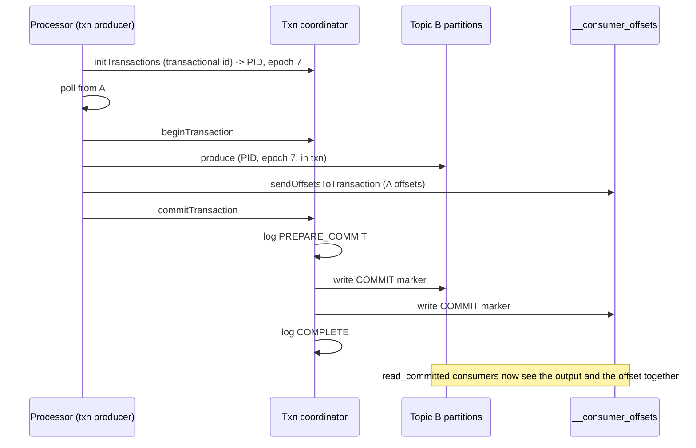
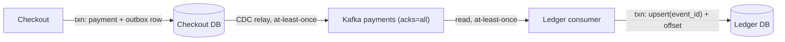

A payment event leaves the checkout service, travels through Kafka, and is consumed by a service that writes a ledger row in Postgres. Every hop can fail after the effect and before the acknowledgement: the producer can time out after the broker stored the event; the consumer can crash after inserting the row and before committing its offset. Each of those produces a duplicate on retry. Each duplicate, in a ledger, is money.

The phrase "exactly-once" is used for two different claims, and the gap between them is where designs fail. Exactly-once *delivery*, the network handing a message to a recipient precisely once, is impossible: the two-generals argument applies to every acknowledgement, and a sender that does not get one must either resend (possible duplicate) or not (possible loss). Exactly-once *processing*, the effect of the message being applied precisely once, is achievable, and it is achieved by accepting at-least-once delivery and making the effect idempotent or transactional. Kafka's exactly-once semantics is a specific, well-engineered instance of that for one set of sinks; this lesson explains what it does, where it stops, and what you do beyond it.

## The three guarantees, decided by the consumer

| Guarantee | Consumer does | Crash consequence |
|---|---|---|
| At-most-once | Commit the offset, then process | Crash after commit, before effect: lost |
| At-least-once | Process, then commit the offset | Crash after effect, before commit: reprocessed, duplicate effect |
| Effectively-once | Process idempotently or transactionally with the offset, then commit | Duplicates are absorbed |

The broker's guarantee is only that stored messages are not lost (given replication) and that a consumer can read them in order per partition. Which of the three rows you get is a consequence of when your code acks. [Queues and async processing](/learn/system-design/building-blocks/queues-and-async-processing) covers the consumer side; here the concern is the whole path.

## The producer side: idempotent producer

A producer sends a batch, times out waiting for the ack, and resends. If the broker had stored the first batch, the partition now has it twice. Kafka's idempotent producer (`enable.idempotence=true`, the default in recent clients) fixes exactly this and only this.

Mechanism: the producer gets a **producer ID** (PID) from the broker on initialisation; every batch to a partition carries a **sequence number** starting at 0 and incrementing per batch; the broker keeps, per (PID, partition), the last few sequence numbers it has written (five, matching the default in-flight limit) and rejects a batch whose sequence it has already seen as a duplicate, returning success without writing. A gap in sequence numbers is an error (out-of-order), so ordering within a partition is preserved even with several batches in flight.

What it covers: retries by one producer session to one partition. What it does not: a producer that restarts (new PID, no memory of what the old one sent, so an application-level retry after a crash still duplicates); the application calling `send` twice; duplicates across partitions; anything downstream of Kafka.

```viz
{"type": "system", "scenario": "kafka-partitions", "nodes": 3,
 "title": "Sequence numbers per producer per partition", "caption": "Each batch carries (producer ID, sequence). The broker remembers the last sequences written per partition and treats a resend as already done. This dedupes the producer's own network retries and nothing else."}
```

## Kafka transactions

The harder case is a stream processor: consume from topic A, transform, produce to topic B, and commit the consumed offset, atomically, so that a crash never leaves B with output whose input was not marked consumed (duplicate on replay) or an offset committed with no output (loss). Kafka transactions make **produce-to-B and commit-offset-on-A** one atomic unit.

Mechanism, in outline:

1. The producer is configured with a stable `transactional.id`. On start it calls `initTransactions`, which registers with a **transaction coordinator** (a broker role, state kept in an internal `__transaction_state` topic), obtains a PID and a **producer epoch**. Any older producer with the same `transactional.id` is fenced: the coordinator bumps the epoch, and the broker rejects writes from the old epoch. This is what stops a zombie instance after a rebalance or a slow shutdown from producing alongside its replacement.
2. `beginTransaction`; produce records to output partitions (written to the log immediately, marked as part of an open transaction); `sendOffsetsToTransaction` writes the consumed offsets to the consumer group's offsets topic as part of the same transaction.
3. `commitTransaction`: the coordinator writes a prepare record to its log, then writes a **commit marker** into every partition the transaction touched (output partitions and the offsets partition), then writes a completed record. It is a two-phase commit where the coordinator's log is consensus-replicated and the participants are partitions that cannot say no.
4. Consumers with `isolation.level=read_committed` buffer records from open transactions and deliver them only after seeing the commit marker; an abort marker makes them discard. Consumers with `read_uncommitted` see everything immediately.



Cost: the transaction adds the coordinator round trips and the marker writes per commit, amortised over all records in the transaction. Commit interval is a tunable (Kafka Streams defaults to 100 ms with EOS enabled); shorter intervals mean lower end-to-end latency and more overhead. Throughput impact is typically modest at reasonable intervals; latency floor is the commit interval plus the marker propagation.

The boundary is the important part: **exactly-once holds only when the sink is Kafka**. The offsets and the output are both Kafka partitions, both covered by the markers. The moment the transform writes to Postgres, calls an HTTP API or sends an email, that effect is outside the transaction and will be repeated on replay.

## Beyond Kafka: external sinks

For a sink that is not Kafka, the consumer must make its effect effectively-once itself. Four patterns, in order of preference:

**Idempotent write keyed by event ID.** The event carries a unique ID (assigned at creation, not by the broker). The sink write is an upsert: `INSERT ... ON CONFLICT (event_id) DO NOTHING`, or a `PUT` to a key derived from the event ID, or a conditional write. Replaying the event repeats a no-op. No separate dedupe state, no window, no expiry. This is the answer whenever you control the sink schema.

**Offset stored in the same transaction as the effect.** The consumer writes the ledger row *and* the consumed (partition, offset) to a table in Postgres in one local transaction, and on restart reads its offsets from that table rather than from Kafka. A crash after the transaction loses nothing (both committed); a crash before loses nothing (neither committed; replay from the stored offset). Kafka's own offset commit becomes advisory. This is what Flink's JDBC two-phase sink and Kafka Connect's JDBC sink with upserts approximate, and it is the outbox pattern run backwards.

```sql
BEGIN;
INSERT INTO ledger (event_id, account_id, amount) VALUES ($1, $2, $3)
  ON CONFLICT (event_id) DO NOTHING;
INSERT INTO consumer_offsets (partition, "offset") VALUES ($4, $5)
  ON CONFLICT (partition) DO UPDATE SET "offset" = EXCLUDED."offset";
COMMIT;
```

**Dedupe store with a window.** When the sink cannot be made idempotent (a third-party API with no idempotency key), the consumer keeps a store of processed event IDs (Redis `SET NX` with TTL, or a table) and checks before acting. The check and the act are not atomic, so a crash between them still duplicates; the window must exceed the longest possible redelivery (including dead-letter replay); and the store's durability must match the sink's. Sizing: 20,000 events per second, 7-day window, ~50 bytes per key: about 600 GB, which is a real cluster. A Bloom filter in front cuts lookups; it does not cut storage.

**Idempotency key passed to the sink.** If the external API accepts one (payment processors do), derive it from the event ID and let the sink dedupe. This is the first pattern with the dedupe moved to the other side.

```viz
{"type": "system", "scenario": "idempotency-key", "requests": 3,
 "title": "Event ID as the sink's idempotency key", "caption": "The same event delivered three times results in one ledger row: the first insert succeeds, the replays hit the unique constraint and do nothing. No dedupe store, no window, no clock."}
```

## Stream processors

Flink's exactly-once is built on **checkpoint barriers**: the source injects a barrier into the stream; each operator, on receiving barriers from all inputs, snapshots its state and forwards the barrier; when every operator has snapshotted, the checkpoint is complete and the source offsets are recorded with it. On failure, state is rolled back to the last complete checkpoint and the source replays from its recorded offsets. State is therefore exactly-once. Sinks are not, unless they are idempotent (upserts) or transactional (a two-phase sink that pre-commits on checkpoint and commits when the checkpoint completes; the Kafka sink does this with Kafka transactions). Kafka Streams achieves the same with Kafka transactions for state changelogs and outputs together. [Stateful streaming](/learn/big-data/streaming/stateful-streaming) covers checkpointing in depth.

## Worked example: the payment pipeline

Checkout service → outbox → Kafka `payments` topic → ledger consumer → Postgres ledger.

| Failure point | What happens without protection | Mechanism that covers it |
|---|---|---|
| Checkout commits the payment row, then crashes before publishing | Event lost; ledger never updated | Transactional outbox: the event row commits with the payment row; the relay publishes later |
| Outbox relay publishes, crashes before marking the row sent | Event published twice | Event carries the outbox row's ID; consumers dedupe on it |
| Producer times out on a stored batch and resends | Duplicate in the partition | Idempotent producer: (PID, sequence) dedupe at the broker |
| Broker leader fails after acknowledging with `acks=1` | Event lost on leader change | `acks=all` with `min.insync.replicas=2`: acknowledged only when replicated |
| Consumer inserts ledger row, crashes before committing offset | Row inserted again on replay | Upsert on `event_id`; or offset stored in the same Postgres transaction |
| Consumer commits offset, crashes before inserting | Row never inserted | Never commit before the effect; offset-in-transaction makes the order irrelevant |
| Consumer rebalance leaves a zombie instance still writing | Duplicate rows from two consumers of the same partition | Upsert on `event_id` absorbs it; for Kafka sinks, the producer epoch fences the zombie |
| Message replayed from the DLQ after 3 days | Duplicate if dedupe window is 1 day | No window: the unique constraint on `event_id` is permanent |

The pipeline is correct because every hop is at-least-once and every effect is idempotent on a stable ID minted at the source. There is no step where "exactly-once delivery" was needed.



## Numbers to have ready

- Idempotent producer: negligible overhead; a few bytes per batch and a small map per partition on the broker.
- Transactions: commit interval 100 ms to 1 s typical; each commit is a coordinator round trip plus one marker per touched partition; keep the number of partitions per transaction small.
- Dedupe store: events per second x window seconds x bytes per key. 5,000/s x 86,400 x 7 x 50 B ≈ 150 GB.
- Replay after a checkpoint: throughput of the consumer x the checkpoint interval is the maximum reprocessed work; 100,000 events/s with a 10-second checkpoint is 1 million events replayed, all of which must be idempotent at the sink.

## Failure modes

**Offset committed before the effect.** At-most-once by accident; events silently lost during any crash. Detect: reconciliation between source counts and sink counts. Mitigate: process then commit, or offset-in-transaction.

**Effect then crash before commit, with a non-idempotent sink.** Duplicates after every restart. Detect: duplicate rows keyed by event ID. Mitigate: upsert or dedupe.

**Non-unique dedupe key.** Two producers both number their events from 1; the consumer dedupes on the number and drops one producer's events. Detect: missing events from one source. Mitigate: globally unique IDs (UUID, or producer ID plus sequence).

**External sink assumed transactional.** The team enables Kafka EOS and believes the Postgres writes are covered. Detect: duplicates in Postgres after a rebalance. Mitigate: understand the boundary; make the sink write idempotent.

**Zombie producer after rebalance.** An instance that lost its partitions keeps producing for a while; without transactions there is no epoch to fence it. Detect: two writers to the same partition's output. Mitigate: transactional producer with a stable `transactional.id` per input partition (or the newer group-based fencing); idempotent sinks.

**Replay beyond the dedupe window.** Dead-letter replay after 3 days, window of 1 day. Detect: duplicates correlated with DLQ replays. Mitigate: permanent unique constraint instead of a window; or window longer than DLQ retention.

**Transaction timeout under backpressure.** A slow sink makes the transaction exceed `transaction.timeout.ms`; the coordinator aborts it; the processor replays; the cycle repeats. Detect: abort rate; stalled progress. Mitigate: smaller transactions, higher timeout, backpressure on the poll loop.

## Interviewer follow-ups

**Q: "Can you guarantee each payment is processed exactly once?"**

I can guarantee its effect happens exactly once, which is what the ledger cares about; I cannot guarantee it is delivered exactly once, and I would not design as if I could. Each event gets a unique ID in the checkout database transaction via the outbox; the producer is idempotent so broker retries do not duplicate; `acks=all` so acknowledged events survive a leader failure; the ledger consumer upserts on the event ID and stores its offset in the same Postgres transaction. A crash anywhere produces a replay, and every replay is a no-op at the sink. I would say "effectively-once" and explain the mechanism, because a candidate who says "Kafka gives me exactly-once" has not looked at where the ledger lives.

**Q: "What does enabling Kafka's exactly-once actually buy you here?"**

If the ledger were another Kafka topic, everything: the consumed offsets and the output commit atomically with markers, and `read_committed` consumers see them together. Since the ledger is Postgres, the transaction cannot include the Postgres write, so it buys me the idempotent producer's dedupe of broker retries and the epoch-based fencing of zombie producers, both worth having, and nothing for the sink. The sink-side guarantee comes from the upsert and the offset-in-transaction. I turn EOS on for the Kafka-to-Kafka stages of the pipeline and rely on idempotent writes at the edge.

**Q: "Why store the offset in Postgres instead of committing it to Kafka?"**

Because then the effect and the position are one atomic unit. Committing to Kafka after the Postgres write leaves a window where the row exists and the offset does not; committing before leaves the opposite. With the offset in the same Postgres transaction, on restart I read my position from Postgres and resume; there is no window. Kafka's offset commit becomes a monitoring convenience. The cost is that each consumer instance owns its offsets in the sink database, which means the consumer group's lag as Kafka reports it may be slightly stale, and I export the real lag as a metric from the consumer.

**Q: "How big is the dedupe store, and what if it fails?"**

For 5,000 events per second with a 7-day window at 50 bytes per key it is around 150 GB, which is a Redis cluster or a partitioned table, and I would rather not have it: a unique constraint on the event ID in the sink table is smaller, permanent, and atomic with the write. If I must keep a separate store because the sink is a third-party API, its loss means duplicates for the window, so for a payment API I fail closed and stop consuming until it is back, and for anything less critical I fail open and log. And I pass the event ID as the API's idempotency key wherever the API supports one, which moves the dedupe to the side that can do it atomically.

**Q: "A consumer instance is slow to shut down after a rebalance and keeps writing. What stops it?"**

For a Kafka sink, the transactional producer's epoch: when the replacement instance initialises with the same transactional ID, the coordinator bumps the epoch and the broker rejects the old instance's writes. For the Postgres sink, the upsert on event ID makes the zombie's writes no-ops if the replacement already wrote them, and identical if it did not, so the outcome is the same rows either way. What I do not do is rely on the rebalance protocol to have stopped the old instance, because the whole point of the scenario is that it did not.

## Senior signals

- You separate **delivery from processing** and say "effectively-once" with the mechanism attached.
- You know the **idempotent producer** covers only one producer session's retries to one partition, and what a producer restart does.
- You can describe **Kafka transactions** as a coordinator, markers and `read_committed`, and you state the boundary: the sink must be Kafka.
- You make external sinks safe with an **upsert on a source-minted event ID** or **offset-in-transaction**, and you prefer those to a windowed dedupe store.
- You trace a pipeline **failure point by failure point** and name the mechanism covering each.
- You size the **dedupe store** and the **replay window** in bytes and events before agreeing to either.

## Check yourself

```quiz
- q: >-
    A consumer commits its Kafka offset and then crashes before writing the event's effect to Postgres. Which guarantee did it implement, and what is the consequence?
  options: ["At-least-once; the event is reprocessed", "At-most-once; the event's effect is lost", "Exactly-once; the offset rolls back on restart", "Ordered delivery; the event is delayed"]
  answer: 1
  explanation: >-
    Committing before the effect means a replay never happens for that offset, so the effect is lost; nothing rolls the committed offset back. Process-then-commit gives at-least-once; offset-in-transaction removes the window entirely.
- q: >-
    Kafka's idempotent producer prevents:
  options: ["Duplicates from resending a batch after a lost ack", "Duplicates from the application calling send() twice", "Duplicates at an external sink after a consumer replay", "Duplicates from a restarted producer resending its batch"]
  answer: 0
  explanation: >-
    The broker dedupes on (producer ID, sequence) per partition, within one producer session. A restarted producer has a new ID, so its resends are not recognised; application-level double sends are new records; downstream sinks are out of scope.
- q: >-
    A stream processor reads from Kafka, writes rows to Postgres, and has Kafka transactions enabled. After a crash and replay, why can Postgres still contain duplicates?
  options: ["The Postgres write is outside the Kafka transaction", "Transactions are silently disabled after a crash", "Postgres commits are not durable until a checkpoint", "The consumer read with isolation level read_uncommitted"]
  answer: 0
  explanation: >-
    Only Kafka partitions and offsets are covered by the commit markers, so exactly-once holds for consume-transform-produce where the sink is Kafka. External effects need idempotent writes (upsert on event ID) or the offset stored in the same sink transaction.
- q: >-
    Which design makes a Postgres sink effectively-once with no separate dedupe store and no time window?
  options: ["Commit offsets more often so the replay window shrinks", "A smaller consumer batch so fewer events are replayed", "A unique event_id with INSERT ... ON CONFLICT DO NOTHING", "A Bloom filter of processed IDs checked before each insert"]
  answer: 2
  explanation: >-
    The unique constraint makes every replay a no-op atomically with the write and never expires; storing the consumed offset in the same transaction is an optional extra. Bloom filters have false positives and need a backing store; batch size and commit frequency shrink windows but do not remove them.
- q: >-
    After a rebalance, an old consumer instance keeps producing to the output topic for a few seconds. In a transactional pipeline, what fences it?
  options: ["The consumer group protocol revoking its partitions", "Partition reassignment moving the output leader elsewhere", "A shorter session timeout on the old consumer instance", "The producer epoch, which the replacement bumps on init"]
  answer: 3
  explanation: >-
    The replacement's initTransactions bumps the epoch and the broker rejects the old epoch's writes. Zombie fencing is done at the broker, which does not depend on the old instance noticing it lost its partitions. Timeouts and reassignment are what created the zombie window in the first place.
```
