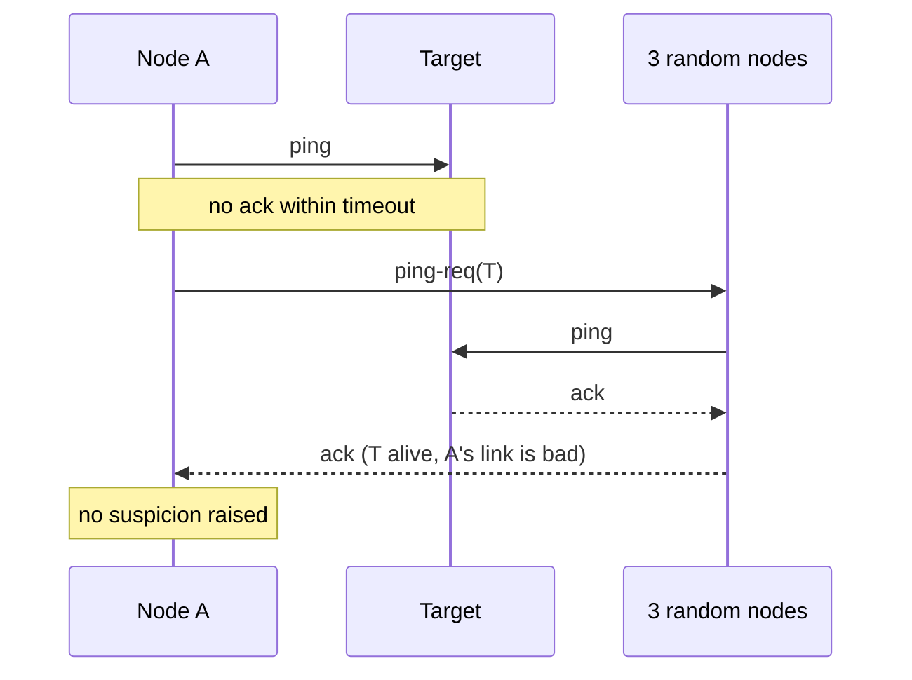
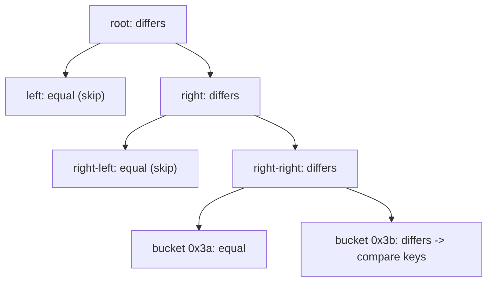

A thousand nodes need to know which of them are alive, which owns which token range, and what the schema version is. A central registry that every node polls becomes the busiest and most fragile component in the system: a thousand nodes polling every second is a thousand requests per second on one box, and when it is down nobody learns anything. Having every node tell every other node directly is N² messages, a million per round. Neither scales, and both have the failure mode that a single point (the registry, or the network to one node) blocks the spread of information.

Gossip protocols take the third path: each node periodically tells a few random peers what it knows, and they tell a few more. Information spreads like an epidemic, reaching everyone in a logarithmic number of rounds with constant load per node and no coordinator, and the spread is robust to any individual node or link failing because the next round picks different peers. The same idea, applied to data rather than membership, is anti-entropy: replicas compare what they hold and repair the differences, with Merkle trees making the comparison cheap.

## Epidemic spreading

The basic round: every T seconds (1 second is typical), each node picks k peers at random (fanout, typically 3) and exchanges state with them. Three variants:

- **Push**: the node sends what it knows. Fast to start (one infected node starts spreading immediately); slow to finish (near the end, most pushes hit nodes that already know).
- **Pull**: the node asks peers what they know. Slow to start (nobody has anything to pull until someone does); fast to finish (an uninfected node pulling from a random peer is likely to hit an infected one once most are).
- **Push-pull**: both in one exchange. Best of both; the standard choice.

The numbers, for push-pull with fanout k: after r rounds, roughly k^r nodes have heard, so full spread takes about log_k(N) rounds plus a few for the tail. For N = 1,000 and k = 3, log₃(1,000) ≈ 6.3, and in practice around 8 to 10 rounds cover everyone with high probability. At a 1-second interval, a new fact is cluster-wide in about 10 seconds. Doubling the cluster to 2,000 nodes adds one round. Per node, the load is k messages sent and about k received per round regardless of N: constant.

```viz
{"type": "system", "scenario": "gossip", "nodes": 8,
 "title": "Push-pull gossip with fanout 3", "caption": "One node learns a fact. Each round, every node that knows it exchanges with three random peers. Watch the count of informed nodes roughly triple per round until it saturates; the last few nodes are reached by pull, not push."}
```

Two flavours by what is spread. **Rumour mongering** spreads a specific new update and stops when it is old (a node that finds its peers already know may stop propagating with some probability), so the message cost per update is bounded. **Anti-entropy** exchanges full state, or a digest of it, so that any difference, however old, is eventually repaired; it never stops and is the safety net under rumour mongering.

Bandwidth arithmetic: 200 nodes, gossip interval 1 second, fanout 3, per-node state 2 KB, and each exchange sends the whole state (naive) both ways: 3 x 2 x 2 KB = 12 KB per node per second sent, plus about the same received, about 25 KB/s per node, 5 MB/s cluster-wide. Trivial. At 5,000 nodes with 100 KB of state per node it is 600 KB/s per node and 3 GB/s cluster-wide, no longer trivial, which is why real implementations gossip **digests** (node ID plus version per entry) and fetch only entries whose version is newer, so steady-state traffic is proportional to the change rate, not the state size.

## Membership with SWIM

Failure detection by heartbeating everyone to everyone is N² traffic. SWIM (Scalable Weakly-consistent Infection-style Membership) separates detection from dissemination and makes both constant per node.

**Detection.** Every protocol period (say 1 second), each node picks one random member and sends it a ping. If the ack comes back within the timeout, done. If not, the node asks k other members (say 3) to ping the target on its behalf (**indirect probe**); if any of them gets an ack, the target is alive and the problem was the link between the prober and the target, not the target. Only if all fail does the prober **suspect** the target.

**Suspicion.** A suspected member is not immediately declared dead. The suspicion is gossiped; the suspected node, when it hears it is suspected, gossips a refutation with a higher **incarnation number**, which overrides the suspicion everywhere. If no refutation arrives within a suspicion timeout (a few protocol periods, scaled by log N), the node is declared dead and that is gossiped. The incarnation number is a per-node counter that only the node itself increments, so a node can always prove it is alive by incrementing it, and stale claims about it are ordered by it.

**Dissemination.** Membership updates (joined, suspected, alive, dead) are piggybacked on the ping and ack messages, each update carried a bounded number of times (proportional to log N) before it is dropped. No separate gossip traffic; the failure detector's messages carry the membership.

The result: detection time is a small multiple of the protocol period regardless of N; false positives from a single bad link are eliminated by indirect probes; false positives from a slow node are given time to refute; and per-node load is one ping, up to k indirect pings, and the piggybacked updates, per period. HashiCorp's memberlist (used by Consul, Nomad, Serf) implements SWIM with the Lifeguard extensions: a node that is itself slow (and therefore likely to accuse others falsely) lengthens its own timeouts, and suspicions from several independent nodes shorten the time to declaring death.



Cassandra's gossip is the other common design: every second each node gossips with one to three peers, exchanging (node, generation, version) heartbeat state where generation is a per-node start timestamp and version a counter; failure detection is the phi-accrual detector from [Failure detection and leases](/learn/system-design/distributed-systems/failure-detection-and-leases) applied to gossip arrival times; the token ring, schema version and node status all ride the same channel. Redis Cluster's bus does the same with a fixed binary format and `PFAIL` (possibly failed, one node's opinion) promoted to `FAIL` when a majority of masters agree, a voting step on top of the rumour.

## Anti-entropy for data

Gossip spreads small state. Replicas of a large dataset diverge for different reasons (a write missed one replica; a node was down for an hour; hinted handoff failed), and the fix is to compare the replicas and copy the differences. Comparing key by key is O(data) per comparison, which for a terabyte per replica is impractical to run often.

**Merkle trees** make the comparison O(log n) in exchanges. Each replica builds a tree over its key range: leaves are hashes of buckets of keys (say 2^15 leaves over the range, each covering a slice of the hash space), internal nodes are hashes of their children, the root is one hash of everything. Two replicas exchange roots: equal roots mean identical data, one message. Different roots: exchange the children, descend only into the subtrees whose hashes differ, and at the leaves compare keys. A handful of differing keys is found in a depth-of-tree number of round trips, ~15 for 2^15 leaves, each carrying a few hashes.



The cost that is not free is *building* the tree: every key must be read and hashed. Cassandra's repair builds Merkle trees per token range per table on each replica involved, which is a full scan of the data and a burst of CPU and disk I/O. It is why repair is scheduled off-peak, throttled, and run per range rather than cluster-wide at once; a full repair on a large cluster can take hours to days. Dynamo and Riak use the same approach with trees kept incrementally updated to avoid the scan.

A **Bloom filter** is the lighter-weight cousin for the question "do you have any keys I do not?": a replica sends a filter of its key set (a few bits per key, so ~1.2 MB for a million keys at 1% false positives); the peer checks its keys against it and sends back the ones that are definitely missing. It finds one-sided differences in one round at the cost of false positives (a missing key the filter claims is present is not repaired this round). Digests, Merkle trees and Bloom filters are all set-reconciliation tools with different trade-offs between build cost, round trips and exactness.

```viz
{"type": "system", "scenario": "bloom-filter", "keys": ["k1","k2","k3","k7","k9"],
 "title": "Bloom filter as a set digest", "caption": "One replica sends a compact filter of its keys. The peer tests each of its own keys: a miss means the first replica definitely lacks it and it is sent; a hit might be a false positive, so a rare missing key survives until the next round or a Merkle comparison."}
```

### Three repair mechanisms

| Mechanism | When it runs | Covers | Cost |
|---|---|---|---|
| Read repair | On a read that sees divergent replicas | Hot keys only; cold keys never | Free, piggybacked on reads |
| Hinted handoff | When a replica is unreachable at write time; delivered when it returns | Writes during short outages, if the hint is stored and delivered | Storage on the hinting node; a replay burst on return; hints expire (Cassandra defaults to 3 hours) |
| Full anti-entropy repair | Scheduled (Cassandra: within gc_grace_seconds; Dynamo: continuous background) | Everything, including cold keys and long outages | Full scan, tree build, streaming; hours |

Read repair and hinted handoff are the fast paths that keep divergence small; full repair is the guarantee. A cluster that runs only the fast paths has cold data that has been diverged for months.

### Tombstones and resurrection

Deletion in a replicated store cannot simply remove the key, because a replica that missed the delete would, on the next repair, "repair" the key back onto the replicas that deleted it. So a delete writes a **tombstone**, a marker with a timestamp that says "deleted at T", which propagates and repairs like any write and shadows older values. Tombstones must eventually be purged or the store fills with them. Cassandra's `gc_grace_seconds` (default 10 days) is the window: a tombstone is kept for that long, then compacted away.

The trap: if a replica is down for longer than `gc_grace_seconds`, or repair does not run within it, the other replicas purge the tombstone; the returning replica still has the live value; the next repair sees a value on one side and nothing on the other, and copies the value back. The deleted row returns. The rule that follows is operational: full repair must run on every range at least once per `gc_grace_seconds`, and a node down longer than that must be rebuilt rather than rejoined. [Wide-column stores](/learn/databases/nosql-and-specialised/wide-column-stores) covers the rest of Cassandra's write path.

## Where gossip is the wrong tool

- **Agreement.** Gossip converges to a consistent view eventually; it does not produce a decision that all nodes make at the same logical moment. Leader election, configuration changes that must not be applied twice, or anything with a "who is right" question needs consensus ([Raft](/learn/system-design/distributed-systems/consensus-raft)). Cassandra gossips the ring but uses a single coordinator (or now a transactional metadata log) for changes that must be ordered.
- **Small N.** At 5 nodes, just tell everyone; the log N advantage is nil and the randomness adds latency.
- **Large state.** Gossiping megabytes of state per node per second is a bandwidth problem; gossip digests and fetch deltas, or move the state to a store and gossip only its version.
- **Fast, guaranteed delivery.** Convergence in ~10 rounds with high probability is not "every node within 10 seconds, guaranteed". Anything with a hard deadline needs a different mechanism.

## Worked numbers

A 200-node cluster, gossip interval 1 s, fanout 3, per-node membership state 2 KB, digest-based exchange where only changed entries are sent.

- Convergence: log₃(200) ≈ 4.8, so ~7 rounds, ~7 seconds for a new member to be known everywhere.
- Steady-state bandwidth per node: 3 exchanges x (digest of 200 entries x ~40 B = 8 KB) x 2 directions ≈ 50 KB/s. Cluster: 10 MB/s. Fine.
- SWIM detection with a 1-second protocol period, 500 ms ping timeout, 3 indirect probes, suspicion timeout of 5 periods: a dead node is suspected within ~1.5 s by its first prober and declared dead ~5 s later, ~6.5 s total, independent of cluster size. A node with a 3-second GC pause is suspected and refutes itself on resuming, never declared dead.
- Anti-entropy on 2 TB per replica with 2^15-leaf Merkle trees: a full scan at 200 MB/s takes ~3 hours per replica to build the trees; the comparison is ~15 round trips of a few KB; streaming a 0.1% divergence is 2 GB. Scheduled weekly per range, well inside a 10-day `gc_grace_seconds`.

## Failure modes

**Partition produces two consistent views.** Each side's gossip converges to "the other side is dead". Both are internally consistent and wrong. Detect: membership size per node diverging; each side reporting the other as down. Mitigate: gossip is the input to a decision, not the decision; quorum-based actions (Redis Cluster's majority `FAIL` vote; a consensus store for ownership) prevent both sides from acting as if they were the whole cluster.

**Gossip storm.** Full-state gossip with large state and high fanout; per-node bandwidth grows with cluster and state size; the gossip traffic starves real traffic. Detect: gossip bandwidth per node trending with N. Mitigate: digests and deltas; bounded fanout; rate limits on gossip.

**False death from a pause.** A 10-second GC pause on a node with a 5-second suspicion timeout; the node is declared dead, its partitions reassigned, and it comes back to find it owns nothing. Detect: dead declarations followed by rejoins within seconds. Mitigate: suspicion timeouts sized above observed pauses; incarnation refutation; Lifeguard-style self-awareness.

**Resurrected deletes.** Repair missed the `gc_grace` window on a range; deleted rows reappear. Detect: rows with deletion audit records present again. Mitigate: repair scheduling with alerts on ranges not repaired within the window; rebuild nodes down longer than the window.

**Merkle build cost at peak.** Repair kicked off during peak; every replica scans its disk; p99 doubles. Detect: repair start correlated with latency. Mitigate: schedule, throttle, per-range incremental repair.

**Slow convergence from low fanout or high interval.** Fanout 1, interval 10 s: 200 nodes need ~8 rounds, 80 seconds to learn a membership change; routing is stale for over a minute. Detect: time from event to cluster-wide knowledge. Mitigate: fanout 3, interval 1 s; the cost is negligible.

**Hints that never deliver.** A node down for 4 hours with a 3-hour hint window; the hints expire; the writes are missing until full repair. Detect: expired-hint counters. Mitigate: know the hint window; run repair after any outage longer than it.

## Interviewer follow-ups

**Q: "How does a 1,000-node cluster learn a node has died without a coordinator?"**

Through SWIM-style detection and gossip dissemination. Each node pings one random peer per second; on a missed ack it asks three other nodes to probe indirectly, so a single bad link does not condemn anyone; if those fail too, it marks the node suspected and gossips that. The suspected node, if alive, refutes with a higher incarnation number. If no refutation arrives within a few seconds, the node is declared dead and that fact rides on the ping traffic to everyone in around log N rounds, roughly 10 seconds. Per node the cost is one ping and a few piggybacked updates per second, whatever N is. What gossip does not give me is agreement: if I need to reassign the dead node's partitions exactly once, that decision goes through a consensus store using the gossip as its input.

**Q: "Two replicas hold a terabyte each. How do you find the differences without reading everything on every comparison?"**

Merkle trees. Each replica hashes its keys into buckets, then hashes up a tree to a root. Exchanging roots answers "identical or not" in one message; on a mismatch, we descend only into subtrees whose hashes differ, so a few divergent keys are located in about 15 round trips of a few kilobytes. The expensive part is building the tree, which is a full scan, so I keep trees updated incrementally where the store supports it, or I schedule the build off-peak per key range with a throughput throttle. For one-sided "what am I missing" questions, a Bloom filter of one side's keys does it in a round at a small false-positive cost.

**Q: "Why does Cassandra need repair at all if it has read repair and hinted handoff?"**

Because those only cover the keys that get read and the outages that are short. A key that nobody reads is never read-repaired; hints expire after three hours by default and are lost if the hinting node dies. Full repair with Merkle trees is the only mechanism that guarantees every replica of every key converges, and it has a deadline: it must run within `gc_grace_seconds`, or tombstones are purged on the replicas that saw the delete while a replica that did not still holds the value, and the next repair resurrects the deleted row. So repair is an operational SLO, once per range per window, with alerting.

**Q: "When would you not use gossip for membership?"**

When the cluster is small enough to just broadcast, under maybe ten nodes; when I need a strongly consistent membership view for correctness, like deciding partition ownership, where I keep membership in etcd or ZooKeeper and let nodes watch it; or when the state per node is large, in which case I gossip versions and fetch the state from a store. Gossip's guarantee is probabilistic convergence in log N rounds with constant load; it is the right tool for the "who is probably alive and what do they probably own" question at scale, and the wrong tool for any question that ends in "exactly".

**Q: "A node was down for 12 days. Can it rejoin?"**

Not as it is. With a 10-day `gc_grace_seconds`, tombstones for deletes it missed have been purged from the live replicas, and its stale live values would be repaired back onto them, resurrecting deleted data. I rebuild it: wipe its data, rejoin as a new node, and stream its ranges from the live replicas. The rule is that a node down longer than the grace period is treated as new, and the operational check before any rejoin is comparing downtime with the window.

## Senior signals

- You quote **log N rounds and constant per-node load** with the arithmetic, and you know push-pull is the practical default.
- You describe **SWIM's indirect probes, suspicion and incarnation numbers** and explain which false positive each one removes.
- You separate **dissemination from agreement** and route decisions that must happen once through consensus.
- You explain **Merkle-tree comparison** and its build cost, and you schedule repair as an operational SLO.
- You know that **tombstones plus a missed repair window resurrect deletes**, and you rebuild rather than rejoin a long-dead node.
- You gossip **digests, not state**, and can size the bandwidth for a given N and change rate.

## Check yourself

```quiz
- q: >-
    With push-pull gossip and fanout 3, roughly how many rounds does it take for a fact to reach all of 1,000 nodes?
  options: ["About 10", "About 100", "About 3", "About 333"]
  answer: 0
  explanation: >-
    Informed nodes grow by roughly the fanout each round, so log base 3 of 1,000 is about 6.3, plus a few rounds for the tail: around 8 to 10. Doubling the cluster adds about one round.
- q: >-
    In SWIM, why does a node ask three other members to probe a target before suspecting it?
  options: ["To elect a leader that decides whether the target is dead", "To measure latency from several points and average it", "To spread the ping load across more of the members", "So a bad link is not mistaken for a dead target"]
  answer: 3
  explanation: >-
    If any indirect prober gets an ack, the target is alive and the original prober's path was the problem. This removes the single-bad-link false positive without a coordinator; the extra probes add traffic rather than reduce it.
- q: >-
    Two replicas exchange Merkle tree roots and they differ. What happens next?
  options: ["They compare child hashes and descend where they differ", "They exchange all keys in the key range to find the gap", "They rebuild both trees from scratch and compare again", "The replica with the larger dataset overwrites the other"]
  answer: 0
  explanation: >-
    The tree localises differences in a depth-of-tree number of exchanges; equal subtrees are skipped until the differing buckets are found. The full scan happens once when building the tree, not during comparison.
- q: >-
    A replica misses a delete, stays down for 15 days, and rejoins a cluster with gc_grace_seconds of 10 days. The likely outcome is:
  options: ["Nothing; repair treats the stale row as already deleted", "The deleted row comes back; its tombstone is gone elsewhere", "The cluster rejects the node for exceeding the grace window", "The delete reaches it on rejoin through normal repair"]
  answer: 1
  explanation: >-
    The tombstone was purged from the other replicas after 10 days, so there is nothing to shadow the old value, and repair copies the stale live row back. A node down longer than the grace window must be rebuilt from live replicas rather than repaired; nothing rejects it automatically.
- q: >-
    Which task is gossip the wrong tool for?
  options: ["Choosing, once, who takes a dead node's partitions", "Spreading node liveness across a 1,000-node cluster", "Distributing schema version numbers to every node", "Propagating token ring changes around the cluster"]
  answer: 0
  explanation: >-
    Gossip gives eventual, probabilistic convergence of a view, not an agreed decision at one logical moment. Ownership reassignment must happen exactly once, which needs consensus with gossip as its input.
```
