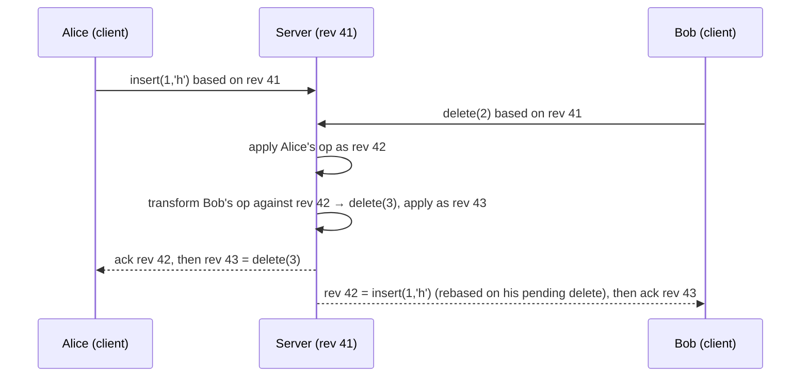
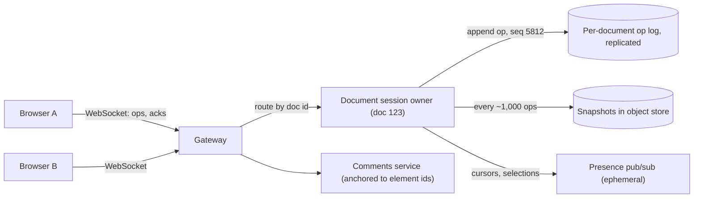

Alice is on a train with no signal, fixing a typo in paragraph two of a shared document. Bob is at his desk rewriting the heading of the same document. Both hit save. A single-leader database with locks cannot serve Alice at all: offline, she cannot take the lock. A multi-leader database with last-writer-wins accepts both writes and silently discards one, because each saved "the document" and only one document can win. Neither is acceptable for a product whose promise is that everyone types at once and nothing is lost.

You want every replica (each browser tab, phone or datacenter) to accept writes locally with no coordination, and replicas that exchange what they have to converge on a state that keeps every user's intent. Two families of technique deliver this. Conflict-free replicated data types (CRDTs) make the data type itself mergeable; operational transformation (OT) rewrites concurrent operations against each other through a central server. Google Docs is built on OT; Yjs, Automerge and Riak's data types are built on CRDTs; Figma sits between the two. This lesson traces each CRDT through concurrent operations, then OT, then the systems built on them.

## Strong eventual consistency: the contract

[Consistency models](/learn/system-design/building-blocks/consistency-models) defined eventual consistency as "if writes stop, replicas converge", which says nothing about how conflicting writes are reconciled; often the answer is last-writer-wins, which converges by discarding data. CRDTs promise **strong eventual consistency**: any two replicas that have received the same *set* of updates are in the same state, whatever the order of arrival, with no rollback and no consensus round.

For a state-based CRDT, replicas merge any two states with a function that is:

| Property | Definition | The network fault it neutralises |
|---|---|---|
| Commutative | `merge(a, b) = merge(b, a)` | Reordering: updates arrive in different orders at different replicas |
| Associative | `merge(merge(a, b), c) = merge(a, merge(b, c))` | Relaying and batching: state can hop through intermediaries in any grouping |
| Idempotent | `merge(a, a) = a` | Duplication: retries and repeated gossip are harmless |

Local updates may only move the state "upward" (a counter only grows, a set of tags only gains members), so merging takes the least upper bound of two states: a join-semilattice. `max` over integers and set union are the simplest examples; every CRDT below encodes richer intent into a structure that still merges like `max`. That is why CRDTs pair naturally with [gossip and anti-entropy](/learn/system-design/distributed-systems/gossip-and-anti-entropy), which delivers state at least once, in any order, over any topology.

## Counters, traced

A like counter replicated across three regions is the smallest useful CRDT. The naive designs both fail: one integer merged with `max` loses concurrent increments, and adding incoming values counts a duplicated message twice. The **G-Counter** gives each replica its own slot; a replica increments only its own slot, merge takes the per-slot maximum, and the value is the sum.

```python
class GCounter:
    def __init__(self, replica_id):
        self.id = replica_id
        self.slots = {}                        # replica id -> that replica's total

    def increment(self, n=1):
        self.slots[self.id] = self.slots.get(self.id, 0) + n

    def value(self):
        return sum(self.slots.values())

    def merge(self, other):
        for rid, count in other.slots.items():
            self.slots[rid] = max(self.slots.get(rid, 0), count)
```

| Step | Event | A | B | C | C's value | One integer, `max` / add |
|---|---|---|---|---|---|---|
| 1 | A +3, B +2, concurrently | {A:3} | {B:2} | {} | 0 | – |
| 2 | B's state reaches C | | | {B:2} | 2 | 2 / 2 |
| 3 | A's state reaches C twice (a retry) | | | {A:3, B:2}; second merge: max(3, 3) = 3 | 5 | 3 / 8 |
| 4 | A +1, then a stale copy of C arrives at A | {A:4, B:2} | | | – | – |
| 5 | Everyone exchanges | {A:4, B:2} | {A:4, B:2} | {A:4, B:2} | 6 | – |

No two replicas write the same slot, so concurrent increments add instead of colliding; per-slot `max` absorbs the duplicate at step 3 and the stale copy at step 4. The naive column shows both failure modes: `max` reads 3, adding reads 8.

```viz
{"type": "system", "scenario": "crdt-counter", "nodes": 3,
 "title": "A G-Counter surviving a partition", "caption": "Each replica increments only its own slot and merges by per-slot max. Watch the partitioned replica keep counting and then converge with the others without losing or double-counting a single increment."}
```

A **PN-Counter** pairs two G-Counters, `P` for increments and `N` for decrements, value `sum(P) − sum(N)`. Trace inventory with one unit in stock, `P = {seed: 1}`: region A sells it (`N = {A: 1}`) while region B, partitioned, also sells it (`N = {B: 1}`). The merge is `P = {seed: 1}`, `N = {A: 1, B: 1}`, value **−1**. Both limits matter in design reviews:

- **No invariants.** Convergence faithfully sums two locally valid decisions into an invalid one; "stock never below zero" needs coordination.
- **One slot per replica, forever.** Use a small, stable set of replica ids (a region or server), never one per browser tab, or the state grows with every client that ever connected.

```exercise
id: pn-counter-merge
title: Merge PN-Counter states
prompt: |
  Each replica of a PN-Counter holds a state `{"p": {...}, "n": {...}}`, mapping
  replica ids to that replica's running total of increments (`p`) and of
  decrements (`n`). You receive a list of states gossiped from various replicas.
  The list may contain duplicates and stale (older) copies of the same replica's
  state, in any order.

  Merge them the way a state-based CRDT does (for each replica id keep the
  maximum seen in `p`, and separately the maximum seen in `n`), then return the
  counter's value: the sum of the merged `p` minus the sum of the merged `n`.
  An empty list has value 0.
languages: [python, javascript]
entry: pn_counter_value
starter:
  python: |
    def pn_counter_value(states):
        # states: list of {"p": {replica_id: int}, "n": {replica_id: int}}
        return 0
  javascript: |
    function pn_counter_value(states) {
      // states: array of {p: {replicaId: number}, n: {replicaId: number}}
      return 0;
    }
tests:
  - args: [[{"p": {"A": 3}, "n": {}}, {"p": {"B": 2}, "n": {"B": 1}}]]
    expected: 4
  - args: [[{"p": {"A": 3}, "n": {}}, {"p": {"A": 3}, "n": {}}, {"p": {"A": 3}, "n": {}}]]
    expected: 3
    label: duplicates are idempotent
  - args: [[{"p": {"A": 5, "B": 1}, "n": {"A": 2}}, {"p": {"A": 3}, "n": {"A": 1}}]]
    expected: 4
    label: a stale copy does not roll back
  - args: [[]]
    expected: 0
    label: empty
  - args: [[{"p": {"A": 1}, "n": {"C": 4}}, {"p": {"C": 2}, "n": {}}, {"p": {"A": 4, "C": 2}, "n": {"C": 3}}, {"p": {"B": 7}, "n": {"B": 7}}]]
    expected: 2
    hidden: true
    label: order independence
  - args: [[{"p": {}, "n": {"A": 2}}, {"p": {"B": 1}, "n": {"A": 1, "B": 3}}]]
    expected: -4
    hidden: true
    label: negative value
hints:
  - "Build two maps, merged_p and merged_n. For every state and every replica id in it, keep the larger of the stored and incoming count."
  - "Only compute the value after merging. Summing each state's own value and adding them up double counts duplicates and stale copies."
```

## Registers: how last-writer-wins loses an update

The **LWW-Register** stores `(value, timestamp, replica id)` and merges by keeping the highest pair. It converges, and it discards data. Trace a document title with Bob's clock 500 ms slow:

| Real time | Event | Alice's replica | Bob's replica |
|---|---|---|---|
| 10:00:01.000 | Alice sets "Q3 plan"; her clock reads 01.000 | "Q3 plan" @ (01.000, alice) | – |
| 10:00:01.200 | Bob receives Alice's write and reads it | – | "Q3 plan" @ (01.000, alice) |
| 10:00:01.300 | Bob, having read it, retitles it "Q3 roadmap"; his clock reads 00.800 | – | Keeps (01.000, alice): his (00.800, bob) is lower |
| Merge | Highest timestamp wins everywhere | "Q3 plan" | "Q3 plan" |

Bob's edit was causally *after* Alice's and still lost, with no error: the timestamp said it was older. A **hybrid logical clock** (see [time and ordering](/learn/system-design/distributed-systems/time-and-ordering)) fixes the causal case: on receiving Alice's write, Bob's HLC advances to at least (01.000, logical 0), so his edit is stamped (01.000, logical 1) and wins. Truly concurrent writes still lose one of the two, arbitrarily.

The **MV-Register** (multi-value) tags each write with a version vector and keeps every value not dominated by another: a later write replaces an earlier one, while concurrent writes survive as *siblings* for the application or user to resolve, as in Dynamo's shopping cart and Riak.

```viz
{"type": "system", "scenario": "vector-clock", "nodes": 3,
 "title": "Detecting concurrent writes with version vectors", "caption": "Two writes whose vectors are each larger in some slot are concurrent. An MV-Register keeps both as siblings; an LWW-Register picks one by timestamp and drops the other."}
```

LWW is acceptable where a lost concurrent write is invisible or harmless (a "last seen" timestamp, a presence status). Anywhere a person typed something, prefer siblings or a richer CRDT.

## Sets: the OR-Set, traced

Adding to a replicated set is easy, because union is a join. Removal is where designs differ:

| Set | Mechanism | Behaviour | Cost |
|---|---|---|---|
| G-Set | Union only | Cannot remove | Minimal |
| 2P-Set | An add-set and a remove-set (tombstones) | Once removed, an element can never be added back | A tombstone per removed element |
| LWW-Element-Set | Timestamp per add and per remove | Latest timestamp wins; clock skew decides | Timestamps per element |
| OR-Set (observed-remove) | Each add gets a unique tag; a remove deletes only the tags it has *observed* | A concurrent add survives a remove ("add wins") | Tags, plus tombstones or a causal summary |

```python
import uuid

class ORSet:
    def __init__(self):
        self.adds = {}          # element -> set of unique tags
        self.removed = set()    # tags that some replica removed

    def add(self, x):
        self.adds.setdefault(x, set()).add(uuid.uuid4().hex)

    def remove(self, x):
        self.removed |= self.adds.get(x, set())   # only the tags observed here

    def contains(self, x):
        return bool(self.adds.get(x, set()) - self.removed)

    def merge(self, other):
        for x, tags in other.adds.items():
            self.adds.setdefault(x, set()).update(tags)
        self.removed |= other.removed
```

A shopping cart, with tags shortened to `a1` and `b1`:

| Step | Event | A: adds / removed | B: adds / removed | Milk in cart? |
|---|---|---|---|---|
| 1 | A adds milk (tag `a1`); B merges A's state | {milk: a1} / {} | {milk: a1} / {} | A yes, B yes |
| 2 | Alice on A removes milk: records the tags A has seen | {milk: a1} / {a1} | – | A no |
| 3 | Bob on B, concurrently, adds milk again (fresh tag `b1`) | – | {milk: a1, b1} / {} | B yes |
| 4 | A and B exchange states | {milk: a1, b1} / {a1} | {milk: a1, b1} / {a1} | Both: {a1, b1} − {a1} = {b1}, yes |

Alice's remove applied to the add she had seen; it cannot cancel an add she never saw. The Dynamo paper noted that its cart merge, a union of versions, could make deleted items resurface; the OR-Set is the principled fix. Its cost is remembering removed tags, which Riak's **ORSWOT** ("OR-Set without tombstones") replaces with a version vector summarising which adds each replica has seen, plus a per-element "dot" (replica, counter) for the add that created it.

## State, operations or deltas: what each needs from the network

| | State-based (CvRDT) | Operation-based (CmRDT) | Delta-state |
|---|---|---|---|
| What travels | The whole state | Each operation | Small state fragments covering recent changes |
| Delivery requirement | Eventual delivery; loss, duplication and reordering are fine | Every operation **exactly once, in causal order** (reliable causal broadcast) | Like state-based, as long as every delta is eventually covered by a later delta group or a full state |
| Message size | Grows with the state (a counter touched by 1,000 replicas ships 1,000 slots) | Small | Small |
| Concurrency rule | Merge is a join | Concurrent operations must commute | Merge is a join |
| Where you meet it | Riak data types, gossip-replicated stores | Editors with a reliable ordered channel to a server | Sync protocols of modern CRDT libraries (Almeida, Shoker and Baquero's delta CRDTs) |

Why op-based needs both halves of its contract, on the traces above. **Exactly once**: an op-based counter ships "+3"; a duplicated message adds 3 twice, and nothing in an increment says it was already applied. **Causal order**: an op-based OR-Set ships "remove tags {a1}". If replica C receives that remove before the "add milk, a1" it depends on, the remove finds nothing to remove; when the add arrives, C shows milk while A and B do not, forever. Implementations build the channel by tagging each operation `(replica, sequence)`, deduplicating on it, and buffering an operation until the version vector says its dependencies have arrived.

## Sequences: RGA, traced

Text is the hard case, because positions shift. Take `cat`: Alice inserts `h` at index 1 (`chat`) while Bob deletes index 2, the `t` (`ca`). Applied naively, Alice's replica deletes index 2 of `chat` and gets `cht`; Bob's inserts at index 1 of `ca` and gets `cha`. The replicas diverge, and one deleted the wrong character. There are two ways out: give characters identities that do not shift (CRDTs), or rewrite the indices of concurrent operations (OT, below).

**RGA** (Replicated Growable Array) gives every character an immutable id `(counter, replica)`, where the counter is a Lamport clock: one more than the largest counter the inserting replica has seen. Ids compare by counter, then replica name. An insert names its **anchor**, the character it goes after. To integrate it, a replica starts right after the anchor, skips every element whose id is *greater* than the new one, and inserts before the first smaller id. A delete marks the element as a **tombstone** and leaves it in place.

Document `AB` with ids A = (1, x), B = (2, x). Alice inserts X after A; Bob concurrently inserts Y after A, deletes B, and Alice concurrently inserts Z after B:

| Step | Operation | Alice's replica | Bob's replica |
|---|---|---|---|
| 0 | – | A B | A B |
| 1 | Alice: X (3, alice) after A | A X B | A B |
| 2 | Bob: Y (3, bob) after A | A X B | A Y B |
| 3 | Y reaches Alice: after A, X (3, alice) < (3, bob), stop | A Y X B | A Y B |
| 4 | X reaches Bob: Y (3, bob) > (3, alice), skip; B (2, x) is smaller, stop | A Y X B | A Y X B |
| 5 | Bob deletes B: tombstone | A Y X B | A Y X ~~B~~ |
| 6 | Alice: Z (4, alice) after B | A Y X B Z | A Y X ~~B~~ |
| 7 | Exchange: Bob attaches Z after the tombstone; Alice marks B deleted | A Y X ~~B~~ Z = "AYXZ" | "AYXZ" |

Counters tie at step 3, so the replica name decides, identically everywhere. The skip rule works because anything inserted after an element has a larger counter than it, so elements greater than the newcomer are concurrent inserts at the same anchor, or characters typed after them, and belong first. Step 7 is why deletes leave tombstones: Z names B as its anchor, and without B, Bob's replica would have nowhere to put it.

```exercise
id: rga-integrate
title: Integrate concurrent inserts into an RGA
prompt: |
  Replay operations on an RGA sequence and return the visible text.

  - Every character has an id `[counter, replica]`. Ids compare by counter
    first, then by replica name as a string.
  - `["ins", id, anchor, ch]` inserts `ch` after the element whose id is
    `anchor` (`null` means the start of the document): start right after
    the anchor, move past every element whose id is greater than `id`, and
    insert before the first element whose id is smaller (or at the end).
  - `["del", id]` marks that element deleted. It stays in the sequence as a
    tombstone, so later inserts can still use it as an anchor.

  Operations arrive in causal order (an anchor before anything inserted
  after it, an insert before its delete), but concurrent operations may
  arrive in any order. Deleted characters are not part of the text.
languages: [python, javascript]
entry: rga_text
starter:
  python: |
    def rga_text(ops):
        seq = []  # elements: [id, char, deleted]
        return ""
  javascript: |
    function rga_text(ops) {
      const seq = []; // elements: {id, ch, deleted}
      return "";
    }
tests:
  - args: [[["ins", [1, "x"], null, "A"], ["ins", [2, "x"], [1, "x"], "B"], ["ins", [3, "alice"], [1, "x"], "X"], ["ins", [3, "bob"], [1, "x"], "Y"]]]
    expected: "AYXB"
    label: equal counters, the replica name breaks the tie
  - args: [[["ins", [1, "x"], null, "A"], ["ins", [2, "x"], [1, "x"], "B"], ["ins", [3, "bob"], [1, "x"], "Y"], ["ins", [3, "alice"], [1, "x"], "X"]]]
    expected: "AYXB"
    label: the other delivery order converges
  - args: [[["ins", [1, "x"], null, "A"], ["ins", [2, "x"], [1, "x"], "B"], ["del", [2, "x"]], ["ins", [3, "alice"], [2, "x"], "Z"]]]
    expected: "AZ"
    label: a tombstone still anchors an insert
  - args: [[]]
    expected: ""
    label: no operations
  - args: [[["ins", [1, "s"], null, "_"], ["ins", [2, "alice"], [1, "s"], "a"], ["ins", [2, "bob"], [1, "s"], "c"], ["ins", [3, "alice"], [2, "alice"], "b"], ["ins", [3, "bob"], [2, "bob"], "d"]]]
    expected: "_cdab"
    hidden: true
    label: concurrently typed runs do not interleave
  - args: [[["ins", [1, "a"], null, "p"], ["ins", [1, "b"], null, "q"], ["ins", [2, "a"], [1, "a"], "r"]]]
    expected: "qpr"
    hidden: true
    label: concurrent inserts at the start
  - args: [[["ins", [1, "x"], null, "H"], ["ins", [9, "z"], [1, "x"], "i"], ["ins", [10, "a"], [1, "x"], "!"], ["del", [9, "z"]]]]
    expected: "H!"
    hidden: true
    label: the counter compares before the replica
hints:
  - "Keep one list of [id, char, deleted]; a delete only sets the flag."
  - "Find the anchor's index (or -1 for null), then advance while the next element's id is greater than the new id."
  - "In Python, [counter, replica] lists compare the right way with >; in JavaScript, compare the counter first and the replica string only on a tie."
```

## Interleaving and metadata: what sequences cost

**Interleaving.** Some sequence CRDTs place each character by a fractional position between its neighbours. Alice types `ab` into an empty gap: `a` at 0.3, `b` between `a` and the end at 0.6. Bob, concurrently, types `xy` into the same gap: `x` at 0.2, `y` at 0.5. Sorting by position gives `xayb`: both words shredded. Logoot and LSEQ are prone to this (Kleppmann and colleagues catalogued the anomaly in 2019). RGA keeps forward-typed runs together, because each character anchors on the previous one, so concurrent runs become separate chains (the hidden test in the exercise gives `_cdab`), though it can still interleave text typed backwards. Fugue (Weidner and Kleppmann, 2023) was designed to minimise interleaving. Ask about it before adopting a library.

**Metadata.** Naively each character ever typed carries its id (a 64-bit counter and a 64-bit replica) and its anchor's id: 32 bytes of metadata per character before the character itself. A 100,000-character document where 30% of everything typed was later deleted holds about 143,000 elements, about 4.6 MB of metadata for 100 KB of text, 46 times the text. Libraries close most of that gap in three ways. They merge a run of consecutive characters typed by one client into a single item, so metadata scales with runs (cursor jumps, splits by deletes), not characters. They encode ids as deltas in variable-length integers. And they discard deleted *content* while keeping tombstone ids as compact ranges. For ordinary human typing, full-history encodings in Yjs and Automerge come out on the same order of magnitude as the text itself; how close depends on how fragmented the edits are, and pathological traces (many single-character edits scattered across a large document) stay far larger.

**Garbage collection.** A tombstone can be dropped only when every replica has seen the delete (the delete is *causally stable*). With clients that may return after a week offline you cannot know that, so collection happens server-side at snapshot time, and a client away longer than the collection horizon resynchronises from a snapshot.

## Operational transformation, traced

OT keeps positional operations and fixes them up: an operation that arrives after a concurrent one was applied is **transformed** against it, rewritten so that applied second it has the effect its author intended.

```python
def transform(op, against):
    """Rewrite `op` so it applies after `against`; None if it became a no-op."""
    pos = op["pos"]
    if against["kind"] == "insert":
        shifts = against["pos"] < pos or (
            against["pos"] == pos
            and (op["kind"] == "delete" or against["site"] < op["site"]))
        if shifts:
            pos += 1
    else:  # against is a delete
        if against["pos"] < pos:
            pos -= 1
        elif against["pos"] == pos and op["kind"] == "delete":
            return None                  # both deleted the same character
    return {**op, "pos": pos}
```

| Replica | Applied first | Arrives | Transformed | Result |
|---|---|---|---|---|
| Alice | `insert(1, 'h')`: `chat` | `delete(2)` | `delete(3)`: an insert before position 2 shifts it right | `cha` |
| Bob | `delete(2)`: `ca` | `insert(1, 'h')` | unchanged: the delete is after position 1 | `cha` |

The tie-break on `site` orders two inserts at one position identically on both sides. The function satisfies **TP1**: applying `a` then `transform(b, a)` gives the same document as `b` then `transform(a, b)`; checked exhaustively for every pair of single-character operations from different sites on 3- and 4-character documents.

TP1 is enough only when one authority decides the order of operations. Peer-to-peer OT also needs **TP2** (transforming along different paths through a history gives the same result), which proved notoriously hard: several published algorithms were later shown to violate it. Practical OT is therefore client-server. Google Docs descends from the Jupiter protocol (Xerox PARC, 1995) via Google Wave: the server assigns each accepted operation a revision number and every client rebases onto it.



A client keeps at most one operation in flight and buffers the rest; each server operation is transformed against the in-flight and buffered ones, and they against it. The server's job is to impose one order.

## Under the hood: Yjs, Automerge, Riak and Redis

- **Yjs** implements YATA (Nicolaescu and colleagues, 2016). An item holds an id (random client id, clock), its content (a run of characters), and two origins: the left and right neighbours at insertion time; concurrent inserts between the same origins are ordered by comparing those origins and client ids. Deletes live in a **delete set** of (client, clock, length) ranges, and deleted content is replaced by placeholder structures unless history is kept. Sync is two messages: a **state vector** (client → next expected clock) and the reply with every item past it. Presence travels on a separate "awareness" protocol and is never stored.
- **Automerge** is a JSON CRDT (maps, lists, text, counters) whose operation ids are (counter, actor id). Automerge 2 moved the core to Rust, compiled to WebAssembly, with a columnar, compressed binary format that stores the full history as a hash-linked graph of changes. Its sync protocol exchanges the heads of that graph and Bloom filters of recent changes, the set-reconciliation trick from the gossip lesson.
- **Riak data types** (Riak 2.0, the `riak_dt` library) offer counters, ORSWOT sets, maps, LWW registers and flags, replicated state-based between vnodes, with siblings for plain objects.
- **Redis Enterprise Active-Active** databases apply per-type rules across regions: `INCRBY` counters merge by summing each region's contributions, sets resolve a concurrent add and remove as add-wins, and `SET` on a string is last-writer-wins by timestamp.

## OT versus CRDT

| | Operational transformation | CRDT |
|---|---|---|
| Source of order | A central server assigns a total order | Unique ids and a deterministic merge rule |
| Offline editing | Works, but a long divergence means transforming thousands of operations against thousands | Merge whenever you reconnect |
| Peer-to-peer | Impractical (TP2) | Natural |
| Metadata | Small: operations carry positions; the document is plain text | Ids per element plus tombstones, reduced by run compression |
| Where the complexity lives | A transform for every pair of operation types; rich text multiplies the pairs | Designing the data type; proven once per type |
| Server role | Mandatory and stateful per document | Optional for correctness; still used for auth, durability and fan-out |
| Examples | Google Docs and many editors of its generation | Yjs, Automerge, Riak data types, Redis Enterprise Active-Active |

Figma is the instructive middle case. It has described its multiplayer system as server-authoritative with CRDT-inspired merging: each property of each object behaves like an LWW register ordered by the server. Two people changing the same property of the same rectangle at the same instant is rare and cheap to lose; two people moving different rectangles never conflict. Choosing the smallest unit of conflict is often worth more than choosing an algorithm.

## Architecture of a collaborative editor



1. **One live owner per document**, chosen by consistent hashing on the document id or a lease. It orders operations (OT) or validates and relays them (CRDT). Most documents have one or two active editors, so one server holds tens of thousands.
2. **Durable before acknowledged.** An operation is appended to the replicated log before the client is acked; an in-region replicated append costs a few milliseconds, well under the 50 to 100 ms at which a remote cursor starts to feel laggy.
3. **Snapshots plus log.** Opening loads the latest snapshot and replays operations since; snapshotting every thousand or so bounds open time, and the log doubles as version history.
4. **Idempotent resend.** Each client operation carries `(client id, client sequence)`, so after a reconnect the owner discards what it already has: [idempotency](/learn/system-design/building-blocks/idempotency-and-retries) applied to keystrokes.
5. **Presence is not data.** Cursors change many times a second and go over ephemeral pub/sub, never into the log.
6. **Owner failover with fencing.** A new owner takes the lease and loads snapshot and log; the log append checks a fencing token so a paused old owner cannot interleave its own order ([failure detection and leases](/learn/system-design/distributed-systems/failure-detection-and-leases)).

Clients batch keystrokes every 50 to 100 ms, so a typist sends at most 10 to 20 messages a second. Fan-out grows instead: 50 editors at 20 messages a second, each delivered to 49 others, is about 50,000 deliveries a second, and batching broadcasts per document every 50 ms caps it at 20 messages a second per client. Google Docs caps simultaneous editors at around a hundred and serves larger audiences read-only. The CRDT variant, local-first, keeps a full replica in every client and uses the server as relay and durable store. The [collaborative editing case study](/learn/system-design/case-studies/collaborative-editing) works the full design.

## Where CRDTs are the wrong tool

- **Global invariants.** Unique usernames, non-negative balances, one booking per seat: two replicas can each make a locally valid decision whose merge violates the invariant, as the PN-Counter trace showed. These need consensus or a single owner ([CAP and PACELC](/learn/system-design/building-blocks/cap-and-pacelc)).
- **Semantic conflicts.** The document says "meet on Tuesday". Alice selects "Tuesday" and types "Wednesday"; Bob concurrently selects it and types "Thursday". Both deletes and both inserts survive: "meet on WednesdayThursday". It converged, and it is wrong. Real-time collaboration works anyway because, with sub-second latency and visible cursors, people see each other and avoid editing the same words.
- **Validation and access control.** A CRDT merges any well-formed operation. The server must still check that a commenter is not editing and that a client is not sending pathological operations (millions of tombstones) designed to bloat everyone's copy.

## Production failure modes

| Failure | Symptom | Diagnosis | Fix |
|---|---|---|---|
| Replica id reuse | Two clients show different text forever after a restore; no errors | A backup restore or cloned VM reused a replica id and counter, so two different operations share an id | Fresh random replica id per session; compare periodic document hashes between client and server |
| Metadata bloat | Open time and memory creep up on old, heavily edited documents | Metadata-to-content ratio per document grows with tombstones and fragmentation | Server-side compaction at snapshot time, with a horizon beyond which returning clients resync |
| Causal delivery violated in an op-based design | Rare divergence after reconnects; removed items reappear on one replica | Operations were delivered out of dependency order or twice; the version vector shows gaps | Deduplicate on (replica, sequence), buffer until dependencies arrive, or ship states or deltas |
| LWW losing edits to clock skew | Users report edits "reverting" on one device | Wall-clock timestamps; the losing client's clock was behind | Hybrid logical clocks, or an MV-register or richer CRDT for user-typed fields |
| Two owners for one document | Clients connected to different servers see different orders | A partition left the old owner alive with a new one holding the lease; appends with a stale fencing token are rejected | Fence every log append; clients reload from the log when their revision history disagrees |
| Hot document | One owner saturates during an all-hands; cursors lag | Fan-out, not operations, dominates the owner's CPU and bandwidth | Batched snapshots to viewers from a read tier; cap live editors |

## Interviewer follow-ups

**"You are building the editing layer for a Google Docs competitor. OT or CRDT?"** Model answer: ask first whether offline editing or peer-to-peer sync is needed; default to a mature CRDT library such as Yjs behind a thin server that authenticates, persists and fans out, because offline and reconnection come for free; never hand-write OT for rich text, where transform pairs multiply with every block type. Common wrong answer: "CRDTs, because they need no server," which ignores durability, access control and fan-out.

**"Why not use a PN-Counter for inventory across three regions?"** Model answer: it converges but cannot enforce "never below zero": two regions each sell the last unit and the merge is −1; give each SKU a home region that owns decrements, or escrow stock between regions. Common wrong answer: "use a PN-Counter with a check before decrementing," which is a local check on stale state.

**"A user edits offline for a week and returns with 20,000 operations. What happens?"** Model answer: with a CRDT the client sends its state vector, the server returns what it lacks, and integration is roughly linear in the operations; with OT the server transforms 20,000 operations against everything since the base revision, quadratic in the worst case, so systems fall back to a diff or ask the user; either way, if tombstones older than a week were compacted, the client rebases onto a fresh snapshot. Common wrong answer: "the merge is automatic, so nothing special happens."

**"What delivery guarantees does an op-based CRDT need, and how do you provide them?"** Model answer: exactly-once and causal: deduplicate on (replica, sequence) and buffer each operation until the version vector shows its dependencies, or use state or delta sync, which tolerate loss and duplication. Common wrong answer: "operations commute, so any order works," which fails for a remove that arrives before its add.

**"How do you know two clients actually converged?"** Model answer: the server periodically publishes a document hash at a revision and clients compare; a mismatch triggers a reload and an error report with both histories. Common wrong answer: "CRDTs are proven to converge," which is true of the algorithm, not of your implementation.

## What mid-level engineers get wrong

- **Using wall-clock LWW for fields people type into.** Consequence: edits silently disappear whenever a client's clock is behind.
- **Assigning one CRDT replica id per browser tab.** Consequence: G-Counter slots and version vectors grow with every client that ever connected.
- **Shipping op-based updates over a plain at-least-once queue.** Consequence: duplicated increments and resurrected removes, as permanent divergence.
- **Using a CRDT counter for anything with an invariant.** Consequence: oversold stock and negative balances that merged correctly.
- **Choosing a sequence CRDT without checking interleaving and metadata on a real editing trace.** Consequence: shredded concurrent words, and documents that open slowly after a year.
- **Putting cursors and presence into the durable log.** Consequence: storage and replay dominated by data that is worthless a second later.

## Senior signals

- You define a CRDT by its **merge properties** and connect each to the network fault it absorbs.
- You can trace a **G-Counter, OR-Set and RGA** through concurrent operations, including the RGA tie-break and why deletes leave tombstones.
- You separate **converging from preserving intent**: LWW converges and loses data, even causally later writes under clock skew; MV-registers, OR-Sets and sequence CRDTs keep it.
- You know what each flavour needs from the network: **state and delta tolerate anything, op-based needs exactly-once causal delivery**.
- You quote **metadata costs** and know how run merging, compact encodings and snapshot-time garbage collection reduce them.
- You know why **practical OT needs a central server** (TP1 with a total order versus TP2 without one), and you design the **unit of conflict** deliberately.

## Check yourself

```quiz
- q: >-
    Gossip in your system delivers each state message at least once and sometimes twice. Which merge property makes the duplicates harmless?
  options: ["Idempotence", "Monotonic reads", "Commutativity", "Associativity"]
  answer: 0
  explanation: >-
    Idempotence means merge(a, a) = a, so applying the same state twice changes nothing. Commutativity handles reordering and associativity handles relaying and batching; neither says anything about applying the same input twice. Monotonic reads is a session guarantee, not a merge property.
- q: >-
    An op-based OR-Set replica receives remove(tags a1) for milk before it receives the add of milk with tag a1. With no tombstones kept, what happens?
  options: ["Milk stays on this replica forever while others lack it", "The replica rejects the remove and asks for a resend", "Milk is removed once the add arrives, as on the others", "The replicas converge at the next anti-entropy round"]
  answer: 0
  explanation: >-
    The remove finds no tag to remove and is dropped; when the add arrives, milk appears and nothing will ever remove it, so this replica diverges permanently. Op-based CRDTs need causal delivery: buffer an operation until its dependencies have arrived. Op-based designs ship operations, not states, so there is no later state merge to repair it.
- q: >-
    Bob reads Alice's new title and then changes it, but his clock is 500 ms behind hers. Under a wall-clock LWW register, what is the final title?
  options: ["Alice's, because Bob's later edit carries an older timestamp", "Bob's, because his edit happened later in real time", "Both, kept as siblings for a person to resolve later", "Whichever replica's state reaches the other one last"]
  answer: 0
  explanation: >-
    LWW compares timestamps, and Bob's clock stamped his causally later write lower than Alice's, so his edit is discarded without an error. A hybrid logical clock would advance Bob's clock past Alice's timestamp on receipt and let his edit win; siblings are the MV-register's behaviour, not LWW's.
- q: >-
    In RGA, the document is A B. Alice inserts X with id (3, alice) after A while Bob concurrently inserts Y with id (3, bob) after A. What do both replicas show?
  options: ["A Y X B, because (3, bob) is the greater id", "A X Y B, because alice sorts before bob", "A X B Y, because later inserts go at the end", "Either order, depending on which arrives first"]
  answer: 0
  explanation: >-
    Integration starts after the anchor A and skips elements with a greater id. Counters tie at 3, so the replica name decides and (3, bob) is greater: on Alice's replica Y stops before X, and on Bob's replica X skips over Y. The result is independent of arrival order, which is the point of the deterministic tie-break.
- q: >-
    Why do practical OT systems such as Google Docs route every operation through a central server?
  options: ["Because the server must store each document's CRDT metadata", "Because clients are too slow to compute transformations", "Because OT operations are too large to send peer-to-peer", "Because one global order needs only TP1, not the harder TP2"]
  answer: 3
  explanation: >-
    A single authority imposing a total order means each operation is transformed along one path, so only TP1 is needed. Without it, transformations along different paths must agree (TP2), and several published algorithms were later shown to violate it. Operations are tiny and clients do transform; there is no CRDT metadata in OT.
- q: >-
    A retailer replicates inventory across three regions with a PN-Counter so every region can sell without coordination. What goes wrong?
  options: ["Nothing; the counter converges to the correct total", "Two regions sell the last unit; stock goes negative", "Increments made during a partition are lost on merge", "A PN-Counter cannot represent the decrements of sales"]
  answer: 1
  explanation: >-
    Convergence is not an invariant. Each region's decrement is valid locally and the merge faithfully sums both, giving -1. Preventing oversell needs coordination: a home region per SKU, or escrow of stock between regions.
```
