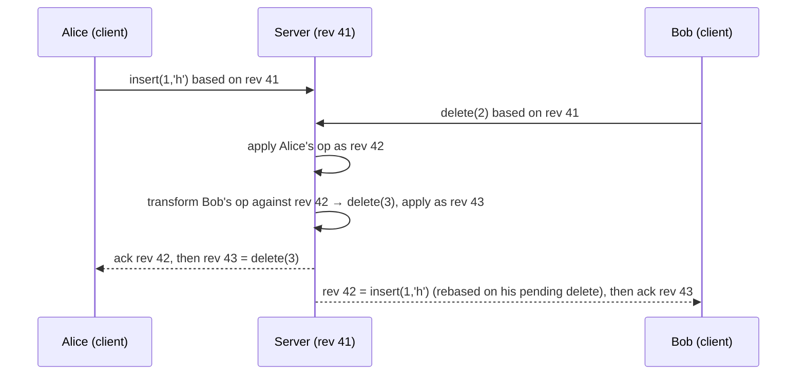
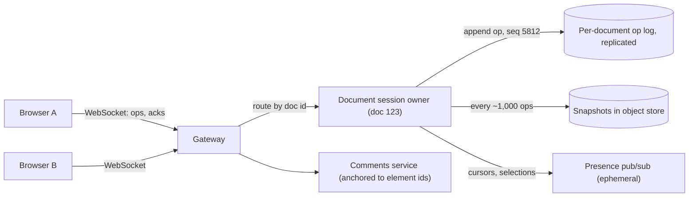

Alice is on a train with no signal, fixing a typo in paragraph two of a shared document. Bob is at his desk rewriting the heading of the same document. Both hit save. A single-leader database with locks cannot serve Alice at all: offline, she cannot take the lock. A multi-leader database with last-writer-wins accepts both writes and silently discards one, because each saved "the document" and only one document can win. Neither is acceptable for a product whose promise is that everyone types at once and nothing is lost.

You want every replica (each browser tab, phone or datacenter) to accept writes locally with no coordination, and replicas that exchange what they have to converge on a state that keeps every user's intent. Two families of technique deliver this. Conflict-free replicated data types (CRDTs) make the data type itself mergeable; operational transformation (OT) rewrites concurrent operations against each other through a central server. Google Docs is built on OT; Yjs, Automerge and Riak's data types are built on CRDTs; Figma sits between the two. The senior skill is knowing what each guarantees, what it costs, and which problems neither can solve.

## Strong eventual consistency: the contract

[Consistency models](/learn/system-design/building-blocks/consistency-models) defined eventual consistency as "if writes stop, replicas converge". That promise says nothing about *how* conflicting writes are reconciled, and in practice the reconciliation is often last-writer-wins, which converges by discarding data.

CRDTs promise something stronger, called **strong eventual consistency**: any two replicas that have received the same *set* of updates are in the same state, whatever order the updates arrived in, with no rollback and no consensus round. Convergence is a property of the data type, not of a background repair process.

For a state-based CRDT, the requirement is that replicas can merge any two states with a function that is:

| Property | Definition | The network fault it neutralises |
|---|---|---|
| Commutative | `merge(a, b) = merge(b, a)` | Reordering: updates arrive in different orders at different replicas |
| Associative | `merge(merge(a, b), c) = merge(a, merge(b, c))` | Relaying and batching: state can hop through intermediaries in any grouping |
| Idempotent | `merge(a, a) = a` | Duplication: retries and repeated gossip are harmless |

Local updates must also only move the state "upward" (a counter only grows, a set of tags only gains members), so merging is always taking the least upper bound of two states: a join-semilattice, or "a merge you can apply in any order, any number of times". `max` over integers and set union are the simplest examples. Everything interesting about CRDTs is encoding richer intent (increments, removals, inserting a character between two others) into a structure that still merges like `max`. It is also why CRDTs pair naturally with [gossip and anti-entropy](/learn/system-design/distributed-systems/gossip-and-anti-entropy), which delivers state at least once, in any order, over any topology.

## State-based, operation-based and delta CRDTs

There are two ways to ship updates, and a practical hybrid.

| | State-based (CvRDT) | Operation-based (CmRDT) | Delta-state |
|---|---|---|---|
| What travels | The whole state | Each operation | Small state fragments covering recent changes |
| Delivery requirement | Any: loss, duplication, reordering are fine as long as states eventually get through | Every operation exactly once, in causal order | Same as state-based |
| Message size | Grows with the state (a counter touched by 1,000 replicas ships 1,000 slots) | Small | Small |
| Concurrency rule | Merge is a join | Concurrent operations must commute | Merge is a join |
| Where you meet it | Riak data types, gossip-replicated stores | Editors with a reliable ordered channel to a server | Sync protocols of modern CRDT libraries |

The operation-based form looks cheaper but moves the hard part into the delivery layer: "exactly once, in causal order" is usually built by tagging each operation with `(replica id, sequence number)`, deduplicating on that pair, and buffering an operation until its dependencies (tracked with a version vector, see [time and ordering](/learn/system-design/distributed-systems/time-and-ordering)) have arrived.

## Counters

A like counter replicated across three regions is the smallest useful CRDT. The naive designs both fail. If each replica stores one integer and merges with `max`, then replica A counting 3 likes and replica B counting 2 merge to 3: two likes vanish. If replicas instead add incoming values, a duplicated gossip message counts the same likes twice.

The **G-Counter** (grow-only counter) fixes both by giving each replica its own slot. A replica increments only its own slot; merge takes the per-slot maximum; the value is the sum of slots.

```python
class GCounter:
    def __init__(self, replica_id):
        self.id = replica_id
        self.slots = {}                        # replica id -> that replica's total

    def increment(self, n=1):
        self.slots[self.id] = self.slots.get(self.id, 0) + n

    def value(self):
        return sum(self.slots.values())

    def merge(self, other):
        for rid, count in other.slots.items():
            self.slots[rid] = max(self.slots.get(rid, 0), count)
```

Worked through: A holds `{A: 3}`, B holds `{B: 2}`, C holds `{}`. B gossips to C, so C holds `{B: 2}`. A's state reaches C twice because of a retry: the first merge sets C's A-slot to 3, the second computes `max(3, 3) = 3`. C now reads 5, and so will every replica once it has seen both states, in any order and with any number of duplicates. The per-replica slot is what makes concurrent increments *add* instead of *collide*, because no two replicas ever write the same slot.

```viz
{"type": "system", "scenario": "crdt-counter", "nodes": 3,
 "title": "A G-Counter surviving a partition", "caption": "Each replica increments only its own slot and merges by per-slot max. Watch the partitioned replica keep counting and then converge with the others without losing or double-counting a single increment."}
```

A **PN-Counter** supports decrements by pairing two G-Counters: `P` for increments, `N` for decrements, value `sum(P) - sum(N)`. Two limits matter in design reviews:

- **No invariants.** A PN-Counter cannot enforce "stock never goes below zero": two regions that each sell the last unit merge to -1. Invariants need coordination (see the follow-ups).
- **One slot per replica, forever.** Use a small, stable set of replica ids (one per region or per server), never one per browser tab, or the state grows with every client that ever connected.

```exercise
id: pn-counter-merge
title: Merge PN-Counter states
prompt: |
  Each replica of a PN-Counter holds a state `{"p": {...}, "n": {...}}`, mapping
  replica ids to that replica's running total of increments (`p`) and of
  decrements (`n`). You receive a list of states gossiped from various replicas.
  The list may contain duplicates and stale (older) copies of the same replica's
  state, in any order.

  Merge them the way a state-based CRDT does (for each replica id keep the
  maximum seen in `p`, and separately the maximum seen in `n`), then return the
  counter's value: the sum of the merged `p` minus the sum of the merged `n`.
  An empty list has value 0.
languages: [python, javascript]
entry: pn_counter_value
starter:
  python: |
    def pn_counter_value(states):
        # states: list of {"p": {replica_id: int}, "n": {replica_id: int}}
        return 0
  javascript: |
    function pn_counter_value(states) {
      // states: array of {p: {replicaId: number}, n: {replicaId: number}}
      return 0;
    }
tests:
  - args: [[{"p": {"A": 3}, "n": {}}, {"p": {"B": 2}, "n": {"B": 1}}]]
    expected: 4
  - args: [[{"p": {"A": 3}, "n": {}}, {"p": {"A": 3}, "n": {}}, {"p": {"A": 3}, "n": {}}]]
    expected: 3
    label: duplicates are idempotent
  - args: [[{"p": {"A": 5, "B": 1}, "n": {"A": 2}}, {"p": {"A": 3}, "n": {"A": 1}}]]
    expected: 4
    label: a stale copy does not roll back
  - args: [[]]
    expected: 0
    label: empty
  - args: [[{"p": {"A": 1}, "n": {"C": 4}}, {"p": {"C": 2}, "n": {}}, {"p": {"A": 4, "C": 2}, "n": {"C": 3}}, {"p": {"B": 7}, "n": {"B": 7}}]]
    expected: 2
    hidden: true
    label: order independence
  - args: [[{"p": {}, "n": {"A": 2}}, {"p": {"B": 1}, "n": {"A": 1, "B": 3}}]]
    expected: -4
    hidden: true
    label: negative value
hints:
  - "Build two maps, merged_p and merged_n. For every state and every replica id in it, keep the larger of the stored and incoming count."
  - "Only compute the value after merging. Summing each state's own value and adding them up double counts duplicates and stale copies."
```

## Registers: last-writer-wins and multi-value

A register holds one value, like a document title or a user's display name. Two CRDT designs exist, and the difference between them is the difference between converging and preserving intent.

The **LWW-Register** stores `(value, timestamp, replica id)` and merges by keeping the highest pair. It is a valid CRDT and replicas converge, but of two concurrent writes one is discarded without an error, and with wall-clock timestamps clock skew picks the loser. Use hybrid logical clocks at least, so a write that causally follows another always wins.

The **MV-Register** (multi-value) tags each write with a version vector and merge keeps every value not dominated by another. A later write replaces an earlier one; concurrent writes both survive as *siblings* for the application or user to resolve, as in Dynamo's shopping cart and Riak.

```viz
{"type": "system", "scenario": "vector-clock", "nodes": 3,
 "title": "Detecting concurrent writes with version vectors", "caption": "Two writes whose vectors are each larger in some slot are concurrent. An MV-Register keeps both as siblings; an LWW-Register picks one by timestamp and drops the other."}
```

The rule of thumb: LWW is acceptable where a lost concurrent write is invisible or harmless (a "last seen" timestamp, a presence status). Anywhere a person typed something, prefer siblings or a richer CRDT.

## Sets: why removal is the hard part

Adding to a replicated set is easy: union is a join. Removal is where designs differ.

| Set | Mechanism | Behaviour | Cost |
|---|---|---|---|
| G-Set | Union only | Cannot remove | Minimal |
| 2P-Set | An add-set and a remove-set (tombstones) | Once removed, an element can never be added back | Tombstone per removed element |
| LWW-Element-Set | Timestamp per add and per remove | Latest timestamp wins; clock skew decides ties | Timestamps per element |
| OR-Set (observed-remove) | Each add gets a unique tag; a remove deletes only the tags it has *observed* | A concurrent add survives a remove ("add wins") | Tags, plus tombstones or a causal summary |

The OR-Set is the one worth knowing in detail. A shopping cart contains milk, added with tag `a1`. Alice, on replica A, removes milk: tag `a1` is recorded as removed. Concurrently Bob, on replica B, which also saw `a1`, adds milk again with a fresh tag `b1`. On merge, milk's live tags are `{a1, b1} - {a1} = {b1}`, so milk stays. Alice's remove applied to the add she had seen; it cannot cancel an add she never saw.

```python
import uuid

class ORSet:
    def __init__(self):
        self.adds = {}          # element -> set of unique tags
        self.removed = set()    # tags that some replica removed

    def add(self, x):
        self.adds.setdefault(x, set()).add(uuid.uuid4().hex)

    def remove(self, x):
        self.removed |= self.adds.get(x, set())   # only the tags observed here

    def contains(self, x):
        return bool(self.adds.get(x, set()) - self.removed)

    def merge(self, other):
        for x, tags in other.adds.items():
            self.adds.setdefault(x, set()).update(tags)
        self.removed |= other.removed
```

The Dynamo paper noted that its cart merge, a union of versions, could make deleted items resurface; the OR-Set is the principled fix. Its cost is remembering removed tags, which production versions (Riak's ORSWOT, "OR-Set without tombstones") replace with a version vector summarising which adds each replica has seen.

## Sequences: collaborative text

Text is the hard case, because the natural operations are positional and positions shift. Take the document `cat`. Alice inserts `h` at index 1 (`chat`). Concurrently Bob deletes index 2, the `t` (`ca`). Apply both naively:

- Alice's replica: `chat`, then delete index 2, which is now `a`: **`cht`**.
- Bob's replica: `ca`, then insert `h` at index 1: **`cha`**.

The replicas diverge, and one of them deleted the wrong character. Index-based operations do not commute. There are two ways out: give characters identities that do not shift (CRDTs), or rewrite the indices of concurrent operations (OT, in the next section).

A **sequence CRDT** assigns every character a unique, immutable id, typically `(counter, replica)` with a Lamport-style counter, and expresses operations against ids instead of indices: "insert `h` after the character with id `(1, x)`", "delete the character with id `(3, x)`". Deleting by id cannot hit the wrong character. What remains is ordering concurrent inserts at the same place, and every replica must do it identically.

RGA (Replicated Growable Array) does it like this: each insert names its left neighbour; to integrate it, a replica starts at that neighbour and skips over any following elements whose id is *greater* than the new element's id, then inserts. Worked example, document `AB` with ids `A = (1, x)` and `B = (2, x)`:

- Alice inserts `X` after `A` with id `(3, alice)`. Bob concurrently inserts `Y` after `A` with id `(3, bob)`. Counters tie, so the replica name breaks the tie: `(3, bob)` is greater.
- On Alice's replica (`AXB`), `Y` arrives. Start after `A`; the next element `X (3, alice)` is smaller than `Y`, so stop and insert: `AYXB`.
- On Bob's replica (`AYB`), `X` arrives. Start after `A`; `Y (3, bob)` is greater than `X`, so skip it; `B (2, x)` is smaller, so stop and insert: `AYXB`.

Both replicas agree without talking to each other. Deletes leave **tombstones** rather than removing the element, because a concurrent or delayed insert may name the deleted character as its left neighbour and still needs somewhere to attach.

Three production realities:

- **Metadata.** Naively, every character ever typed (deleted ones included) carries its own id and a neighbour reference: tens of bytes of metadata per byte of text. Libraries like Yjs merge runs of consecutive keystrokes from one client into a single item and encode compactly; the naive version is where CRDTs got their reputation for bloat.
- **Interleaving.** If two users type whole words at the same position concurrently, some algorithms can interleave the characters (`HWeolrllod` instead of `HelloWorld`). Fractional-position schemes such as Logoot and LSEQ are prone to it; RGA-style algorithms avoid the worst of it; newer algorithms were designed specifically to be non-interleaving. Ask about it before adopting a library.
- **Garbage collection.** A tombstone can be discarded only once every replica has seen the delete (the delete is "causally stable"). With clients that may return after a week offline you cannot know that, so collection usually happens server-side at snapshot time, and a client away longer than the collection horizon must resynchronise from a snapshot.

## Operational transformation

OT keeps positional operations and fixes them up. When an operation arrives that was generated concurrently with one already applied, it is **transformed** against it: rewritten so that applied second it has the effect its author intended. Replay the `cat` example with transformation:

- Alice's replica has applied `insert(1, 'h')`. Bob's `delete(2)` arrives. An insert at 1 happened before position 2, so the delete shifts to `delete(3)`, which removes `t` from `chat`: `cha`.
- Bob's replica has applied `delete(2)`. Alice's `insert(1, 'h')` arrives. A delete at 2 is after position 1, so the insert is unchanged: `ca` becomes `cha`.

```python
def transform(op, against):
    """Rewrite `op` so it applies after `against`; None if it became a no-op."""
    pos = op["pos"]
    if against["kind"] == "insert":
        shifts = against["pos"] < pos or (
            against["pos"] == pos
            and (op["kind"] == "delete" or against["site"] < op["site"]))
        if shifts:
            pos += 1
    else:  # against is a delete
        if against["pos"] < pos:
            pos -= 1
        elif against["pos"] == pos and op["kind"] == "delete":
            return None                  # both deleted the same character
    return {**op, "pos": pos}
```

The tie-break on `site` for two inserts at the same position is what makes both replicas order them identically. This function satisfies the property OT calls TP1: applying `a` then `transform(b, a)` yields the same document as applying `b` then `transform(a, b)`.

TP1 is enough only if a single authority decides the order of operations. Peer-to-peer OT also needs TP2 (transforming along different paths through a history gives the same result), which proved notoriously hard: several published algorithms were later shown to violate it. That is why practical OT is client-server. Google Docs descends from the Jupiter protocol developed at Xerox PARC in the 1990s, via Google Wave: the server assigns each accepted operation a revision number, and clients rebase onto it.



The client side keeps at most one operation in flight and buffers the rest. Every operation that arrives from the server is transformed against the in-flight and buffered operations, and the buffered ones are transformed against it. The server's job is simple and central: impose one order.

## OT versus CRDT

| | Operational transformation | CRDT |
|---|---|---|
| Source of order | A central server assigns a total order | Unique ids and a deterministic merge rule; no authority needed |
| Offline editing | Works, but a long divergence means transforming thousands of operations against thousands | Natural: merge whenever you reconnect |
| Peer-to-peer | Impractical (TP2) | Natural |
| Metadata | Small: operations carry positions; the document is plain text | Ids per element plus tombstones, reduced by run compression |
| Where the complexity lives | A transformation function for every pair of operation types; rich text (formatting, tables, lists) multiplies the pairs | Designing the data type; proven once per type |
| Server role | Mandatory and stateful per document | Optional for correctness; still useful for auth, durability and fan-out |
| Examples | Google Docs and many editors of its generation | Yjs, Automerge, Riak data types, Redis Enterprise active-active |

Figma is the instructive middle case. Its documents are trees of objects with properties, and it has described its multiplayer system as server-authoritative with CRDT-inspired merging: each property of each object behaves like a last-writer-wins register ordered by the server. Two people changing the same property of the same rectangle at the same instant is rare and cheap to lose; two people moving different rectangles never conflict. Choosing the smallest unit of conflict is often worth more than choosing an algorithm, and with a central server the practical gap between OT and CRDTs narrows to offline and peer-to-peer requirements and the richness of the document model.

## Architecture of a Google Docs-style system



The decisions that make this work:

1. **One live owner per document.** All sessions for a document route to one collaboration server, chosen by consistent hashing on the document id or by a lease. The owner orders operations (OT) or validates and relays them (CRDT). Most documents have one or two active editors, so one server holds tens of thousands of them.
2. **Durable before acknowledged.** An operation is appended to the document's replicated log before the client gets its acknowledgement, so an acknowledged keystroke survives the owner crashing. An in-region replicated append costs a few milliseconds, well under the 50 to 100 ms at which a remote cursor starts to feel laggy.
3. **Snapshots plus log.** Opening a document loads the latest snapshot and replays the operations since. Snapshotting every thousand operations or so bounds open time; the log doubles as version history.
4. **Idempotent resend.** Each client operation carries `(client id, client sequence)`. After a reconnect the client resends everything unacknowledged and the owner discards what it already has. This is [idempotency](/learn/system-design/building-blocks/idempotency-and-retries) applied to keystrokes.
5. **Presence is not data.** Cursor positions change many times a second, are worthless a second later and may be dropped. They go over an ephemeral pub/sub channel, never into the durable log.
6. **Owner failover with fencing.** The owner holds a lease; if it dies, a new owner takes the lease, loads snapshot and log, and clients reconnect and resend. The log append must check a fencing token so a paused old owner cannot interleave its own ordering; see [failure detection and leases](/learn/system-design/distributed-systems/failure-detection-and-leases).

The numbers stay small per document. Clients batch keystrokes every 50 to 100 ms, so an active typist sends at most 10 to 20 messages a second. Fan-out is what grows: 50 editors at 20 messages a second, each delivered to 49 others, is about 50,000 deliveries a second. Batching outbound broadcasts per document every 50 ms caps it at 20 messages a second per client, 1,000 for the document. Production editors also cap simultaneous editors per document (Google Docs at around a hundred) and serve larger audiences read-only. The [collaborative editing case study](/learn/system-design/case-studies/collaborative-editing) works the full design.

The CRDT variant, often called local-first, keeps a full replica in every client and uses the server as relay and durable store. Sync is a diff: the client sends a compact summary of what it has (Yjs calls it a state vector) and the server replies with exactly what is missing. If the server goes down, clients keep editing and merge when it returns.

## Where CRDTs are the wrong tool

- **Global invariants.** Unique usernames, non-negative balances, one booking per seat. Two replicas can each make a locally valid decision whose merge violates the invariant. These need consensus or a single owner, as [CAP and PACELC](/learn/system-design/building-blocks/cap-and-pacelc) discusses.
- **Semantic conflicts.** Merge is syntactic. The document says "meet on Tuesday". Alice selects "Tuesday" and types "Wednesday"; Bob concurrently selects "Tuesday" and types "Thursday". Both deletes and both inserts survive: "meet on WednesdayThursday". It converged, and it is wrong. Real-time collaboration works anyway because, with sub-second latency and visible cursors, humans see each other and avoid editing the same words; the algorithm handles the rare collision and the people handle the meaning.
- **Validation and access control.** A CRDT will merge any well-formed operation. The server must still check that a commenter is not editing and that a client is not sending pathological operations (millions of tombstones) designed to bloat everyone's copy.

## Failure modes

**Replica id reuse.** A client restored from a backup, or a cloned virtual machine, reuses a replica id and counter, so two different operations share an id. Replicas that see them in different orders diverge permanently and silently. Detect: periodic checksums of document state compared between client and server. Mitigate: generate a fresh random replica id per session, never persist and reuse one.

**Metadata bloat.** A heavily edited document carries years of tombstones; open time and memory creep upward. Detect: track metadata-to-content ratio per document. Mitigate: server-side compaction at snapshot time, with a horizon beyond which returning clients resync.

**Two owners for one document.** A network partition leaves the old owner alive while a new one takes the lease; under OT, each assigns its own order and clients connected to different owners diverge. Detect: log appends rejected on stale fencing tokens. Mitigate: fence every append, and make clients reload from the log when their revision history disagrees with the server's.

**Hot documents.** A company-wide document opened by thousands during an all-hands turns one owner into a fan-out bottleneck. Mitigate: serve viewers batched snapshots from a separate read tier; cap live editors.

## Interviewer follow-ups

**Q: "You are building the editing layer for a Google Docs competitor. OT or CRDT?"**

I would ask two things first: do we need real offline editing, and will we ever want peer-to-peer or edge sync? If both are no, either works. My default would be a mature CRDT library such as Yjs behind a thin server that authenticates, persists and fans out, because offline and reconnection come for free. I would not write my own OT for rich text: transformation pairs multiply with every new block type, and the bugs surface as rare divergences in production.

**Q: "Why not use a PN-Counter for inventory across three regions?"**

Because the counter converges but cannot enforce "never below zero": two regions can each sell the last unit and the merged value is -1. For inventory I would either give each SKU a home region that owns decrements, or use escrow, splitting the stock between regions and moving allowance with an explicit request when a region runs low. The like counter on the product page, where overshooting by one is harmless, is a fine PN-Counter.

**Q: "A user edits offline for a week and returns with 20,000 operations. What happens?"**

With a CRDT the client sends its state vector, the server returns what the client lacks, and each side integrates the other's operations, roughly linear in the number of operations; where both sides edited the same passage the merge may read oddly, so the UI should highlight it. With OT the server transforms 20,000 client operations against every server operation since the client's base revision, quadratic in the worst case, so practical systems fall back to a three-way diff or ask the user. Either way, if tombstones older than a week were compacted, the client must rebase onto a fresh snapshot.

**Q: "How do you know two clients actually converged?"**

Implementations have bugs, so I verify: the server periodically publishes a hash of the document at a revision and clients compare it with their own. A mismatch triggers a reload from the server's snapshot and an error report with both histories, which is how divergence bugs get found.

## Senior signals

- You define a CRDT by its **merge properties** (commutative, associative, idempotent) and connect each property to the network fault it absorbs.
- You separate **converging from preserving intent**: LWW converges and loses data; MV-registers, OR-Sets and sequence CRDTs keep it.
- You can explain why **index-based text operations diverge**, and fix the example both ways: stable ids (CRDT) and transformation (OT).
- You know why **practical OT needs a central server** (TP1 with a total order versus TP2 without one).
- You say what CRDTs **cannot** do: invariants, uniqueness, semantic merges, and that access control still needs a server.
- You design the **unit of conflict** deliberately, and you keep presence out of the durable log.

## Check yourself

```quiz
- q: >-
    Gossip in your system delivers each state message at least once and sometimes twice. Which merge property makes the duplicates harmless?
  options: ["Idempotence", "Monotonic reads", "Associativity", "Commutativity"]
  answer: 0
  explanation: >-
    Idempotence means merge(a, a) = a, so applying the same state twice changes nothing. Commutativity handles reordering and associativity handles relaying and batching; neither says anything about applying the same input twice. Monotonic reads is a session guarantee, not a merge property.
- q: >-
    A G-Counter keeps one slot per replica instead of a single integer merged with max. Why?
  options: ["Because addition is not commutative across replicas", "To save space compared with storing every increment", "Because max on a single integer loses concurrent adds", "To let the counter support decrements as well"]
  answer: 2
  explanation: >-
    With one integer, concurrent increments collide under max: two replicas each counting 2 would merge to 2. Per-replica slots mean no two replicas ever write the same slot, so per-slot max plus a sum adds the increments correctly. It costs more space, not less; decrements need a PN-Counter.
- q: >-
    In an OR-Set, replica A removes "milk" while replica B concurrently adds "milk" again. After both replicas merge, what does the set contain?
  options: ["Milk twice, one copy from each replica's add", "No milk, because a remove always beats a concurrent add", "Whichever operation had the later wall-clock timestamp", "Milk, because B's add has a fresh tag that A never saw"]
  answer: 3
  explanation: >-
    The remove applies only to the add tags A had observed. B's concurrent add has a fresh tag A never observed, so it survives: add wins. A 2P-Set would make milk impossible to re-add; an LWW-Element-Set would let clock skew decide.
- q: >-
    Why do practical OT systems such as Google Docs route every operation through a central server?
  options: ["Because one global order needs only TP1, not the harder TP2", "Because the server must store each document's CRDT metadata", "Because OT operations are too large to send peer-to-peer", "Because clients are too slow to compute transformations"]
  answer: 0
  explanation: >-
    A single authority imposing a total order means each operation is transformed along one path, so only TP1 is needed. Without it, transformations along different paths must agree (TP2), and several published algorithms were later shown to violate it. Operations are tiny and clients do transform; there is no CRDT metadata in OT.
- q: >-
    A retailer replicates inventory across three regions with a PN-Counter so every region can sell without coordination. What goes wrong?
  options: ["Two regions sell the last unit; stock goes negative", "A PN-Counter cannot represent the decrements of sales", "Increments made during a partition are lost on merge", "Nothing; the counter converges to the correct total"]
  answer: 0
  explanation: >-
    Convergence is not an invariant. Each region's decrement is valid locally and the merge faithfully sums both, giving -1. Preventing oversell needs coordination: a home region per SKU, or escrow of stock between regions.
- q: >-
    Why does a sequence CRDT keep a tombstone for a deleted character instead of removing it?
  options: ["So a user can later undo the delete from history", "To keep the visible document length stable for cursors", "A delayed insert may still use it as its left neighbour", "Because a delete applied twice would remove two characters"]
  answer: 2
  explanation: >-
    Inserts are positioned relative to element ids. If the anchor vanished, a concurrent or delayed insert that arrives later would have nowhere to attach and replicas could place it differently. Deletes by id are already idempotent. Tombstones can be collected only once every replica has seen the delete.
```
