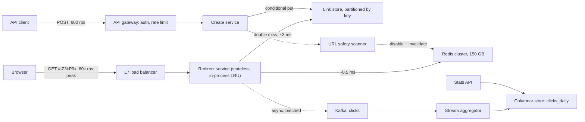

"Design a URL shortener" is the most common warm-up prompt in system design, and it catches experienced engineers because it looks easy: a map from short string to long string, a cache in front, done. [The design interview method](/learn/system-design/building-blocks/the-design-interview-method) works that version at 100 million links a month, and at that scale the easy answer is roughly right.

The senior version adds three things that break the easy answer. The data no longer fits on one node over its retention period. Every customer wants click analytics in near real time. And the read path has to stay fast when one link goes out in a push notification to 50 million phones. That leaves three hard problems. You have to generate unique, unguessable keys without a coordination point on every write. You have to serve 60,000 redirects a second when a single key sometimes takes a third of them. And you have to count every click without putting a write on the redirect path. This lesson spends its time on those three.

## Requirements

### Functional

- **Create**: given a long URL, return `https://sho.rt/aZ3kP9x`. Optional custom alias and optional expiry.
- **Redirect**: `GET /aZ3kP9x` sends the browser to the long URL.
- **Analytics**: per-link click counts by day, country and referring domain, visible within five minutes.
- **Disable**: the owner or a trust-and-safety reviewer can disable a link (malware, phishing), and it must stop redirecting everywhere within one minute.
- **Out of scope, stated aloud**: editing a link's destination, user management, QR codes. Editing is excluded on purpose. It turns a cache with one invalidation case into a cache with a consistency problem, and it lets an attacker swap a link's destination after it has been vetted.

### Non-functional

- **Redirect latency**: p99 under 20 ms server-side. A redirect is overhead on the way to somebody else's page, so users feel every millisecond of it.
- **Availability**: 99.99% for redirects (about 52 minutes a year) and 99.9% for creation. A broken redirect breaks every printed flyer, email and QR code that carries the link, and nobody can re-send those.
- **Durability**: a link that has been returned to a user is never lost and never re-pointed. Keys are never reused, even after deletion.
- **Unguessable**: people shorten links to private documents, so the key space must not be enumerable.
- **Analytics accuracy**: within 1% of the true count, with bot and link-preview traffic filtered out.

### Scale

500 million new links per month, a 100:1 read-to-write ratio (so 50 billion redirects a month), and five years' default retention.

## Back-of-envelope estimates

**Writes.** $5 \times 10^8 / 2.6 \times 10^6\ \text{s} \approx 190$ creates/s on average. With a peak factor of 3 that is about 600/s. Any database handles that, so creation is not the hard part.

**Reads.** $5 \times 10^{10} / 2.6 \times 10^6 \approx 19{,}000$ redirects/s; call it 20,000, and 60,000/s at peak. There is also a separate hot-key case: a link in a push notification or a TV advert can take 20,000–30,000 requests per second on its own for several minutes. The aggregate peak is a cache-sizing problem. The single hot key is a different problem, and the design needs an answer to both.

**Storage.** A link row has a 7-byte key, a long URL averaging about 150 bytes (capped at 2 KB), an 8-byte owner ID, two timestamps and a status, plus index and per-row overhead. Call it 500 bytes. $5 \times 10^8 \times 500\ \text{B} = 250$ GB/month, which is 3 TB/year, 15 TB over five years and 45 TB with three replicas. That is more than one relational primary should hold if failover is to stay comfortable, so the link store is partitioned from day one. The partition key is the short key, because every hot query is a point lookup on it.

**Key space.** Five years of links is $6 \times 10^9 \times 5 = 3 \times 10^{10}$. Base62 with 7 characters gives $62^7 \approx 3.5 \times 10^{12}$ keys, so after five years 0.85% of the space is in use. Six characters give $62^6 \approx 5.7 \times 10^{10}$, which would be more than half full. Random keys would then collide constantly, and a guesser would hit a real link on every other try. So the key is 7 characters.

**Cache.** Clicks skew heavily toward recent links. Assume the last 30 days of links plus a tail of evergreen ones, about 600 million links, take roughly 90% of clicks. A cache entry holds the key, the URL and Redis's per-key overhead, about 250 bytes. $6 \times 10^8 \times 250\ \text{B} = 150$ GB, which is a Redis cluster of three or four 64 GB primaries plus replicas.

**Bandwidth.** A redirect response is headers plus a `Location`, about 500 bytes. $60{,}000 \times 500\ \text{B} = 30$ MB/s, or 240 Mbps. That is trivial.

**Click events.** Each redirect emits an event of about 200 bytes: key, timestamp, country, referrer domain, user-agent class and a hashed IP. $20{,}000 \times 200\ \text{B} = 4$ MB/s, which is about 350 GB/day and about 125 TB/year of raw events.

The sentence that matters here is *the link table grows 3 TB a year and the click log grows 125 TB a year*. This read-heavy system has a write-heavy twin inside it that is forty times larger. The design keeps raw clicks for 30 days (about 10 TB) and keeps daily rollups for the life of the link.

## API design

```text
POST /v1/links
  Authorization: Bearer <token>
  Idempotency-Key: 6f1c2e...                 # a retry must not mint a second link
  {"long_url": "https://example.com/...", "custom_alias": "spring-sale",
   "expires_at": "2027-01-01T00:00:00Z"}
  -> 201 {"short_key": "aZ3kP9x", "short_url": "https://sho.rt/aZ3kP9x"}
  -> 409 alias taken   |   422 URL rejected (malformed or blocklisted)

GET /{short_key}
  -> 302 Location: <long_url>
  -> 404 never existed   |   410 expired or disabled

GET /v1/links/{short_key}/stats?from=2026-09-01&to=2026-09-26&group_by=country
  -> 200 {"total": 48211, "rows": [{"day": "2026-09-01", "country": "GB", "clicks": 1204}]}

DELETE /v1/links/{short_key}
  -> 204 (disables the link; the key is never reissued)
```

While you write this, say three things. First, mobile clients retry on timeout, so without an `Idempotency-Key` a retry mints a second link and the user shares the wrong one. Store `(owner_id, idempotency_key) -> short_key` for 24 hours; [Idempotency and retries](/learn/system-design/building-blocks/idempotency-and-retries) has the mechanics. Second, keep 404 ("never existed", which means a typo or someone enumerating) separate from 410 ("existed, now gone", which is expected). They need different alerts and different cache TTLs. Third, the status code on the redirect is a product decision with a caching consequence, which deep dive 2 covers.

## Data model

Start from the access patterns, not from the nouns in the prompt. There are four: a point lookup by key (60,000/s), a conditional insert (600/s), "list my links" for the dashboard (a few hundred per second at most), and analytics range queries by key and date.

```sql
-- Partitioned by hash(short_key). A key-value or wide-column store (DynamoDB,
-- Cassandra) or sharded Postgres all fit: every hot query is a point lookup.
CREATE TABLE links (
  short_key   VARCHAR(16) PRIMARY KEY,
  long_url    TEXT        NOT NULL,            -- validated, capped at 2 KB
  owner_id    BIGINT,
  created_at  TIMESTAMPTZ NOT NULL,
  expires_at  TIMESTAMPTZ,
  status      SMALLINT    NOT NULL DEFAULT 0   -- 0 active, 1 disabled, 2 flagged
);

-- Denormalised copy partitioned by owner, written asynchronously after the
-- link commits. A secondary index on a key-partitioned table would scatter-gather.
CREATE TABLE links_by_owner (
  owner_id    BIGINT,
  created_at  TIMESTAMPTZ,
  short_key   VARCHAR(16),
  PRIMARY KEY (owner_id, created_at, short_key)
);

-- Rollups live in a columnar store (ClickHouse, Druid, BigQuery), sorted by (short_key, day).
CREATE TABLE clicks_daily (
  short_key   VARCHAR(16),
  day         DATE,
  country     CHAR(2),
  referrer    VARCHAR(255),
  clicks      BIGINT
);
```

`links_by_owner` stays eventually consistent with `links` through change data capture or an outbox. A dashboard two seconds behind is fine, and the owner query no longer fans out to every partition. [Database scaling](/learn/system-design/building-blocks/database-scaling) covers the general problem of secondary indexes across shards.

## High-level design



Walk the redirect path out loud. It goes through the load balancer and a stateless service with an in-process cache, then to Redis, and reaches the link store only on a double miss. It never waits on Kafka: the click event goes into an in-memory buffer and the response has already left. Creation is a separate service with its own scaling and its own failure domain, so a bad deploy of the create path cannot take down redirects. The safety scanner checks new destinations against blocklists after creation, and when it flags one it disables the link and invalidates the caches.

```viz
{"type": "system", "scenario": "cache-aside", "title": "Cache-aside on the redirect path",
 "caption": "Check the cache, fall through to the store on a miss, write the result back. Links are immutable, so the only invalidations are disable and expiry; that is what makes a 95% hit rate cheap to hold."}
```

## Deep dives

### 1. Key generation: unique, unguessable and uncoordinated

Every approach ends with the same encoding step: turn an integer into seven characters from a 62-letter alphabet.

```python
ALPHABET = "0123456789abcdefghijklmnopqrstuvwxyzABCDEFGHIJKLMNOPQRSTUVWXYZ"

def base62(n: int, width: int = 7) -> str:
    digits = []
    while n:
        n, r = divmod(n, 62)
        digits.append(ALPHABET[r])
    return "".join(reversed(digits)).rjust(width, "0")

# base62(1_000_000) == "0004c92"; base62(62**7 - 1) == "ZZZZZZZ"
```

The approaches differ in where the integer comes from.

| Approach | Uniqueness | Guessable? | Coordination per write | Verdict |
|---|---|---|---|---|
| Hash the long URL, keep 42 bits | Truncated hashes collide; retry with a salt | No | None | Dedupes identical URLs, which the product does not want |
| Random 7 characters + conditional put | Retry on conflict (0.85% of inserts by year 5) | No (about 41.7 bits of entropy) | None | Simple; the default |
| Global counter + base62 | By construction | Yes, sequential | Every write | Leaks your volume and invites enumeration |
| Counter ranges + keyed permutation | By construction | No | One call per 10,000 keys | Best when conditional writes are expensive |
| Pre-generated key pool | By construction | No | A pool service | Works, but it is an extra stateful system |

**Hashing the URL** sounds efficient because two people who shorten the same URL get the same key. That is wrong for this product. A link carries an owner, an expiry, a disable switch and its own analytics. Once you salt the hash with the owner to separate them, you have rebuilt random keys with extra steps, and you still need a collision check because 42 bits of a hash collide exactly as often as 42 random bits do.

**Random keys with a conditional put** take the key from a cryptographic random source and insert it only if it is absent. In DynamoDB that is `attribute_not_exists(short_key)`. In Postgres it is `INSERT ... ON CONFLICT DO NOTHING` followed by a check of the row count. The chance of a conflict equals the fraction of the space in use, 0.85% by year five, so needing three or more attempts has probability $0.0085^2 \approx 7 \times 10^{-5}$. One caveat is worth knowing. In Cassandra, `INSERT ... IF NOT EXISTS` is a lightweight transaction that runs Paxos across replicas and costs several round trips, so "conditional put" is cheap in some stores and expensive in others.

**A global counter** is unique and simple, but the keys come out sequential. Anyone can walk the key space, and a competitor who creates one link on Monday and another on Tuesday can subtract to get your daily volume. This is the German tank problem in miniature. The counter is also a single point of failure, though at 600/s it is not a throughput problem.

**Counter ranges with a keyed permutation** fix the counter's flaws. Each create-service instance leases a block of 10,000 integers from a strongly consistent row (`UPDATE ranges SET next = next + 10000 RETURNING next`). For each value `c` it emits `base62(permute(c))`, where `permute` is a secret-keyed bijection on $[0, 2^{40})$, for example a small Feistel network. A bijection never produces the same output twice, so there are no collisions and no read before the write. The secret key means consecutive counters map to unrelated-looking keys. $2^{40} \approx 1.1 \times 10^{12}$ values all fit in seven base62 characters, which is about 180 years at $6 \times 10^9$ links a year. An instance that crashes wastes the rest of its block, which is irrelevant at this size.

**A pre-generated pool** fills a table with random unused keys offline and hands them out in batches. It is the range approach with random values, and it adds a stateful system that must mark keys as used atomically and must be sized, monitored and refilled.

The choice: random keys with a conditional put, because the store already supports a cheap conditional write and no new component is needed. You would switch to ranges plus a permutation in a store where conditional writes are expensive, or when creation goes active-active across regions (see the follow-ups). Custom aliases share the table and the conditional put. Block reserved words (`api`, `login`, brand names) and send aliases through the safety scanner, because they are the only keys a human chooses, and so the only place squatting and impersonation happen.

### 2. The redirect path: status codes, cache layers and the viral link

The status code comes first, because it decides who else caches your responses.

| Code | Cached by browsers? | Analytics | Can you disable it later? |
|---|---|---|---|
| 301 Moved Permanently | Yes, heuristically, often for a very long time | Repeat clicks are invisible | Not for browsers that cached it |
| 302 Found / 307 | Only if `Cache-Control` or `Expires` allows it | Every click is seen | Yes |

HTTP caching rules make a 301 heuristically cacheable and a 302 cacheable only with explicit freshness information. The disable-within-a-minute requirement and the analytics requirement both rule out the 301, so the service returns a 302 with no freshness headers. Some public shorteners choose 301 for search-engine reasons and accept the analytics loss. The senior answer is to name the choice as a trade-off, not to present either one as correct.

There are three cache layers, and each one exists for a specific reason:

1. **An in-process LRU** in every redirect instance holds the top 100,000 keys for 10–30 seconds. This layer handles the viral link.
2. **A Redis cluster**, cache-aside, with a 24-hour TTL plus jitter. Each entry carries `expires_at`, so expiry is enforced even on a hit, and the TTL is `min(24 h, expires_at - now)`.
3. **The link store**, reached only on a double miss.

The hot-key arithmetic is why the first layer exists. A Redis node handles roughly 100,000 simple operations per second. Redis Cluster puts each key in exactly one slot on exactly one primary, so a link taking 30,000 requests/s puts all of that load on one node. That node gives up a third of its capacity, and every other key on it starts to queue. The cluster's total capacity does not help, because the load cannot spread. With the in-process layer, 50 redirect instances each fetch the key from Redis once per 10-second TTL: 5 requests/s instead of 30,000. Request coalescing (a "single-flight" map of in-progress fetches) makes sure that when the entry expires, each instance sends one fetch and not the hundreds of requests that arrived in that millisecond. [Caching strategies](/learn/system-design/building-blocks/caching-strategies) covers stampedes in general.

**Negative caching** covers the other skew. Unknown keys are cached as "absent" for 60 seconds, so an enumeration scan or a mistyped link in a newsletter does not hit the store a thousand times a second. The create path deletes any negative entry for the key it just wrote. That matters for custom aliases, because people often probe an alias before they create it.

**Immutability is the design's secret weapon.** A link's destination never changes, so the only invalidations are disable and expiry. To disable a link, the service writes the new status to the store, deletes the key from Redis and publishes an invalidation on a pub/sub channel that every instance subscribes to. If the message is lost, the in-process TTL is the backstop. "Disabled everywhere within one minute" holds with 30 seconds of margin.

For the extreme case there is one more lever. For links above a traffic threshold, return the 302 with `Cache-Control: public, s-maxage=30` and let the CDN absorb the load. Analytics then come from CDN logs, and a disable now needs a CDN purge. It is a tool for the top 0.01% of links, not a default.

### 3. Counting clicks without slowing the redirect

There are three designs to compare.

- **`UPDATE links SET clicks = clicks + 1` on every redirect.** This turns the read path into a write path at 60,000 writes/s. A viral link serialises on one row lock, and a failure in click counting now fails the redirect. Reject it.
- **Redis `INCR` per dimension.** It is fast, but the counter count explodes (day × country × referrer), a failover loses any increments since the last replication, and a hot link is once again a hot shard.
- **An asynchronous event stream (chosen).** The redirect handler appends an event to an in-process buffer and returns. A background producer batches the buffer to Kafka every 50–100 ms. A stream processor aggregates into one-minute windows keyed by `(short_key, country, referrer)` and upserts the closed windows into the columnar store.

How you partition the `clicks` topic matters. Partitioning by `short_key` gives per-key ordering, which counting does not need, and it turns a viral link into a hot partition that one consumer must handle alone. Counting is commutative, so partition by producer instance and let the aggregator sum the partial counts. Better still, **pre-aggregate in the redirect instance**: each instance emits "aZ3kP9x, GB, t.co: 612 clicks in this second" instead of 612 events. A link taking 30,000 clicks/s becomes 50 messages a second, one per instance. The cost is per-click detail, which fraud and bot analysis need, so keep a 1% sample of raw events for them.

```viz
{"type": "system", "scenario": "kafka-partitions", "nodes": 3,
 "keys": ["aZ3kP9x", "q8Lm2Tt", "aZ3kP9x", "x1Yb7Qe", "aZ3kP9x", "Pz04nWc"],
 "title": "Why the clicks topic is not keyed by short link",
 "caption": "Keyed partitioning sends every event for aZ3kP9x to the same partition and the same consumer. For a viral link, that single consumer becomes the bottleneck. Counts are commutative, so the design partitions by producer and pre-aggregates instead."}
```

**Loss budget.** An instance that crashes loses whatever is in its buffer, at most 100 ms of clicks. At 400 redirects/s per instance (20,000 across 50), that is about 40 clicks per crash, well inside the 1% accuracy target. Write it down as an accepted loss. Downstream, the aggregator checkpoints its Kafka offsets together with its window state and writes each closed window as an idempotent upsert keyed by `(short_key, minute, country, referrer)`, so a replay after a crash overwrites counts instead of doubling them ([Exactly-once semantics](/learn/system-design/distributed-systems/exactly-once-semantics)).

**Bots.** Chat apps and social networks fetch every posted URL to render a preview card, and each fetch is a "click" nobody made. Filter by user agent, and flag fetches that come from known crawler ranges within seconds of the link being posted.

## Failure modes

**A Redis primary dies.** Its share of keys misses to the store: one-eighth of 60,000 is 7,500 extra reads/s, which a partitioned store absorbs, and a replica is promoted within seconds. The in-process LRU hides the hottest keys completely. The degradation is p99 rising from about 5 ms to about 15 ms for a few seconds.

**The link store is unreachable in a region.** About 95% of redirects are cache hits and keep working. The rest must fail fast with a 503, not a 404. Clients, crawlers and caches treat a 404 as the truth, and a human reads it as "this link is dead". Use a 50 ms timeout and a circuit breaker. A cross-region replica can serve older links, but a link created seconds ago in the failed region may be missing.

**Kafka is down.** Redirects must not notice. The producer buffer is bounded: at 400 events/s × 200 bytes, a 50 MB buffer holds about ten minutes. When it fills, drop events and increment a `clicks_dropped` counter so the analytics UI can mark the gap. Analytics degrade; redirects do not.

**A link far hotter than planned** (a million clicks per second). The in-process caches still hold, so the load balancer and the redirect fleet become the limit. Autoscale, and use the CDN lever from deep dive 2.

**A malicious link spreads before the scanner flags it.** Detection time belongs to the scanner. Propagation after detection is bounded by the in-process TTL. Scan synchronously for anonymous creators and asynchronously for trusted API keys.

**The key allocator is down** (range-based variant). Instances keep issuing keys from their leased blocks. At 600 creates/s across 30 instances, a 10,000-key block lasts about eight minutes, which is how long the coordinator can be down before creation fails.

**Creation abuse.** Spam campaigns mint millions of links to phishing pages. Rate-limit per API key and per IP with a token bucket ([Rate limiter](/learn/system-design/case-studies/rate-limiter)) and require verification for high volume.

## Senior follow-ups

**Q: "Two users shorten the same URL. Should they get the same short link?"**

No. A link carries an owner, an expiry, a disable switch and analytics. If you share one link across owners, one user's delete breaks another user's printed flyer, and each sees the other's clicks. For a single owner who shortens the same URL twice, dedupe is a reasonable product option: keep an index `(owner_id, sha256(long_url)) -> short_key` and return the existing key. That lookup is scoped to the owner, not global.

**Q: "Make creation active-active in three regions."**

The trap is conflict resolution. Multi-region tables such as DynamoDB global tables, and Cassandra across data centres, resolve concurrent writes to the same key by last-writer-wins. With random keys, two regions can generate the same key in the same second. Both conditional puts succeed locally, and replication then silently overwrites one of them, so a user holds a link that now points at somebody else's URL. The probability is small, but a "never re-pointed" durability requirement cannot rest on a small probability. The fix is to partition the key space by region so that a cross-region collision is impossible by construction. Either give each region disjoint counter ranges before the permutation, or reserve a region tag inside the key. After that, conditional puts only need to be linearizable within a region.

**Q: "How does expiry work with 30 billion links?"**

It is lazy on the read path and eager only for storage. The cache entry carries `expires_at` and the service checks it on every hit. The store's native TTL or a daily batch job deletes expired rows later. The key is never reused, because a recycled key would send old QR codes and emails to a new destination, which is a phishing gift.

**Q: "The cache hit rate drops from 95% to 70% overnight. What happened, and does it matter?"**

The access distribution changed or the cache did. The likely causes are a crawler or enumeration run walking old links (check the 404 ratio and the per-IP distribution, and check whether negative caching is absorbing it), Redis evicting because memory filled (check the eviction counter), or a deploy that changed the cache-key format so every key looks new. At a 70% hit rate the store sees 18,000 reads/s at peak instead of 3,000. Whether that is an incident depends on how the store was provisioned. That is why I provision the store for a cache-cold day of at least 50% misses, and why cache-key changes ship behind a gradual rollout.

**Q: "Why not run the whole thing at the CDN edge?"**

You can. Edge key-value stores and edge functions make an edge redirect practical, and the CDN lever for hot links is a limited version of it. The costs are per-request edge pricing on 50 billion requests a month, a disable path that now depends on a global purge, and analytics that arrive through CDN log delivery with its own delay. I would use it for the hottest links and keep the origin design as the source of truth.

**Q: "What are the SLOs, and what do you page on?"**

Redirect availability of 99.99% and a p99 under 20 ms, measured at the load balancer and split by cache hit and miss. Synthetic probes create and follow a link from each region every 30 seconds. Analytics freshness: 99% of clicks visible within five minutes, alerting on consumer lag. Page on SLO burn rate and on the probes, not on CPU. [Observability](/learn/system-design/building-blocks/observability) explains why.

## Exercise

```exercise
id: base62-fixed-width
title: Encode an ID as a fixed-width base62 key
prompt: |
  Implement `base62_encode(n, width)`, which returns the base62 representation
  of the non-negative integer `n`, left-padded with "0" to exactly `width`
  characters. Use the alphabet

      0123456789abcdefghijklmnopqrstuvwxyzABCDEFGHIJKLMNOPQRSTUVWXYZ

  so digit value 0 is "0", 10 is "a", 36 is "A" and 61 is "Z".

  You may assume 0 <= n < 62**width, so the result never needs more than
  `width` characters. This is the encoding step a shortener runs after it has
  drawn or permuted an integer key.
languages: [python, javascript]
entry: base62_encode
starter:
  python: |
    ALPHABET = "0123456789abcdefghijklmnopqrstuvwxyzABCDEFGHIJKLMNOPQRSTUVWXYZ"

    def base62_encode(n, width):
        # your code here
        return ""
  javascript: |
    const ALPHABET = "0123456789abcdefghijklmnopqrstuvwxyzABCDEFGHIJKLMNOPQRSTUVWXYZ";

    function base62_encode(n, width) {
      // your code here
      return "";
    }
tests:
  - args: [61, 1]
    expected: "Z"
  - args: [62, 2]
    expected: "10"
  - args: [125, 3]
    expected: "021"
    label: pads on the left
  - args: [0, 7]
    expected: "0000000"
    label: zero still produces width characters
  - args: [1000000, 7]
    expected: "0004c92"
  - args: [3521614606207, 7]
    expected: "ZZZZZZZ"
    hidden: true
    label: largest 7-character key
  - args: [1099511627776, 7]
    expected: "jmaiJOw"
    hidden: true
    label: 2 to the 40th
hints:
  - "Repeatedly take n % 62 for the lowest digit and n // 62 (Math.floor(n / 62) in JavaScript) for the rest; the digits come out least significant first."
  - "Handle n = 0 explicitly or let the padding do it: an empty digit string padded to width is all zeros."
  - "62**7 - 1 is about 3.5e12, well inside JavaScript's exact integer range of 2**53, so plain numbers are safe."
```

## Senior signals

- You do the key-space arithmetic in both directions, collision rate for you and hit rate for an attacker, and let it choose the key length.
- You notice that the click log is forty times the size of the link table and design it as a separate write-heavy system with a stated loss budget.
- You never put a synchronous write on the redirect path, and you can say exactly what is lost when a buffer dies.
- You know that one key lives on one cache shard, and you solve the viral link with in-process caching and request coalescing, not a bigger cluster.
- You treat 301 versus 302 as a product decision with caching consequences, and you return 503 rather than 404 when the store is unreachable.
- You spot that random keys plus last-writer-wins replication can silently re-point a link, and you partition the key space by region.

## Check yourself

```quiz
- q: >-
    You expect 3 x 10^10 links over five years. Why choose 7 base62 characters rather than 6?
  options: ["6 characters give only about 5.7 x 10^9 keys, fewer than the 3 x 10^10 needed", "7 characters leave headroom for custom aliases and the reserved-word blocklist", "6 characters would be over half full, so collisions and guesses get common", "7 characters make sequential counter keys impossible to enumerate"]
  answer: 2
  explanation: >-
    6 characters give about 5.7 x 10^10 keys (not 5.7 x 10^9), so they can technically hold 3 x 10^10 links; capacity is the wrong reason. At 53% density, random generation becomes retry-heavy and a guesser hits a real link about every other try. With 7 characters the space is 0.85% full, so both problems vanish. Length does nothing to stop a sequential counter being walked.
- q: >-
    A link takes 30,000 requests/s. Your Redis cluster has 8 primaries, each good for about 100,000 ops/s. What is the real risk, and what is the fix?
  options: ["None; the 8 primaries share the load for 800,000 ops/s of total capacity", "Redis evicts the hottest key under pressure; raise maxmemory on the cluster", "One primary takes all 30,000 ops/s; cache the key in-process with coalescing", "The link store is overloaded on misses; add read replicas behind the cache"]
  answer: 2
  explanation: >-
    Cluster capacity is irrelevant for a single key, because one key maps to one slot on one node, so that primary gives up a third of its capacity and every other key on it queues. Caching the key in each redirect instance for 10 seconds turns 30,000 Redis reads per second into roughly one per instance per TTL, and coalescing stops the expiry moment from turning into a stampede. The key is hot, not missing, so the store is not the bottleneck.
- q: >-
    Requirements say a disabled link must stop redirecting everywhere within one minute, and every click must be counted. Which redirect design fits?
  options: ["301 with Cache-Control max-age of one year, plus a CDN purge on disable", "301 without cache headers, plus an invalidation broadcast on disable", "302 with public max-age of one day, plus an invalidation broadcast on disable", "302 without freshness headers, a 30 s in-process TTL and a disable broadcast"]
  answer: 3
  explanation: >-
    A 301 is heuristically cacheable by browsers even without cache headers, so repeat clicks are invisible and neither a purge nor a broadcast reaches clients that cached it. A 302 without freshness information is not cached by browsers. The short in-process TTL is the backstop if an invalidation message is lost. A day-long public max-age lets browsers and proxies keep serving the link, which breaks the one-minute requirement whatever the servers are told.
- q: >-
    Creation goes active-active across three regions on a table that replicates with last-writer-wins, and keys are random. What can go wrong?
  options: ["Nothing; conditional puts guarantee uniqueness across all regions", "Two regions mint the same key and replication overwrites one destination", "Keys become guessable because each region draws from a smaller range", "Every insert now waits on a cross-region quorum, so creation latency triples"]
  answer: 1
  explanation: >-
    Conditional puts are only linearizable within a region. Two regions can generate the same key in the same second, both local puts succeed, and LWW replication resolves the conflict by discarding one write, which re-points a link a user has already shared. Partitioning the key space by region makes the collision impossible instead of merely unlikely.
- q: >-
    Why does the design partition the clicks topic by producer instance and pre-aggregate, instead of keying events by short link?
  options: ["Counting needs no ordering, and keying puts a viral link on one partition", "Keying by link drops events whenever a partition's leader fails over", "Kafka cannot use a string such as the short key as its partition key", "Pre-aggregating by producer makes the counts exact, which keyed events cannot"]
  answer: 0
  explanation: >-
    Counting is commutative, so keyed partitioning buys per-key ordering you do not need and concentrates a viral link's entire load on one partition and one consumer. Pre-aggregation turns 30,000 events per second into one message per instance per second. It does not make counts more exact; the design accepts losing up to 100 ms of buffered clicks per crash.
```
