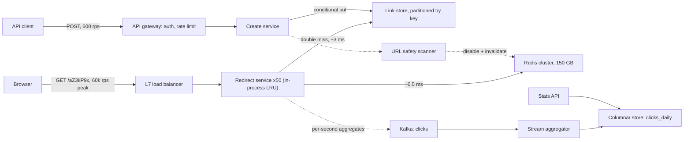

"Design a URL shortener" is the most common warm-up prompt in system design, and it catches experienced engineers because it looks easy: a map from short string to long string, a cache in front, done. [The design interview method](/learn/system-design/building-blocks/the-design-interview-method) works that version at 100 million links a month, where the easy answer is roughly right.

At 500 million links a month, three things break it. The link data outgrows one node over its retention period. Customers want click analytics within minutes. And one link sent in a push notification to 50 million phones can take half of all redirect traffic. That leaves three hard problems: generating unique, unguessable keys without coordinating on every write; serving 60,000 redirects a second when one key takes 30,000 of them; and counting every click without putting a write on the redirect path.

## Requirements

### Functional

- **Create**: given a long URL, return `https://sho.rt/aZ3kP9x`, with an optional custom alias and expiry.
- **Redirect**: `GET /aZ3kP9x` sends the browser to the long URL.
- **Analytics**: per-link clicks by day, country and referring domain, visible within five minutes.
- **Disable**: the owner or trust and safety can disable a link (malware, phishing), and it stops redirecting everywhere within one minute.
- **Out of scope, stated aloud**: editing a destination, user management, QR codes. Editing is excluded on purpose: it turns a cache with one invalidation case into a consistency problem, and it lets an attacker swap a vetted destination.

### Non-functional

- **Redirect latency**: p99 under 20 ms server-side; a redirect is pure overhead on the way to somebody else's page.
- **Availability**: 99.99% for redirects (52 minutes a year), 99.9% for creation. A broken redirect breaks every printed flyer and QR code carrying it.
- **Durability**: a returned link is never lost and never re-pointed; keys are never reused.
- **Unguessable**: people shorten links to private documents, so the key space must not be enumerable.
- **Analytics accuracy**: within 1% of the true count, with bots and link-preview fetches filtered out.

### Scale

500 million new links a month, 100 redirects per link created (50 billion a month), five years' retention, and single links that take 30,000 requests a second for minutes.

## Back-of-envelope estimates

Assumptions, all visible: $2.6 \times 10^6$ seconds a month; peak is 3× average; a stored link is 500 B (7-byte key, a URL averaging 150 B and capped at 2 KB, owner, timestamps, status, index and row overhead); a cache entry is 250 B including Redis's per-key overhead; a click event is 200 B; a redirect response is 500 B.

| Quantity | Arithmetic | Result |
|---|---|---|
| Creates | $5 \times 10^8 \div 2.6 \times 10^6$ s | 190/s average, 600/s peak |
| Redirects | 190 × 100 | 19,000/s average (call it 20,000), 60,000/s peak |
| Link storage | $5 \times 10^8 \times 500$ B | 250 GB/month, 3 TB/year, 15 TB in five years, 45 TB with three replicas |
| Key space used | $3 \times 10^{10}$ keys ÷ $62^7 = 3.5 \times 10^{12}$ | 0.85% after five years; with 6 characters ($5.7 \times 10^{10}$), 53% |
| Cache | $6 \times 10^8$ hot links (last 30 days plus an evergreen tail, assumed to take 90%+ of clicks) × 250 B | 150 GB |
| Egress | 60,000 × 500 B | 30 MB/s, about 240 Mbit/s |
| Raw click events | 20,000 × 200 B | 4 MB/s, 330 GB/day, 120 TB/year |
| Daily rollups | $5 \times 10^7$ clicked links a day × 4 (country, referrer) rows × ~20 B compressed | 4 GB/day, 1.5 TB/year |

### Machine counts

Each tier is sized by whatever binds it first, with the headroom stated.

| Tier | Sizing | Count |
|---|---|---|
| Redirect service | 60,000/s ÷ 50 = 1,200/s per instance at peak, 1,800/s after losing one of three zones. An instance doing a map lookup and one Redis call serves several thousand a second; language and where TLS terminates move that 3×, so load-test it | 50 |
| Redis | 150 GB ÷ ~45 GB usable per 64 GB node (fragmentation and fork-on-snapshot headroom). Throughput: 60,000/s ÷ 4 = 15,000/s each, against a ceiling of roughly 100,000 simple ops/s per node | 4 primaries + 4 replicas |
| Link store | 9 TB replicated in year one, 45 TB in year five, at ~2 TB per node so a node rebuild streams in hours; reads are only the 3,000/s of cache misses | 6 nodes, growing to ~24 |
| Kafka | 12 MB/s peak; 3 days × 3 replicas of raw events ≈ 3 TB | 3 brokers |
| Create service | 600/s | 3, one per zone |

The sentence that matters: **the link table grows 3 TB a year and the click log 120 TB a year**. Redis is sized by memory, not throughput, and the store by bytes, not queries. The read-heavy system hides a write-heavy twin forty times larger, so raw clicks are kept 30 days (10 TB) and rollups for the life of the link.

## API design

```text
POST /v1/links
  Authorization: Bearer <token>
  Idempotency-Key: 6f1c2e...                 # a retry must not mint a second link
  {"long_url": "https://example.com/...", "custom_alias": "spring-sale",
   "expires_at": "2027-01-01T00:00:00Z"}
  -> 201 {"short_key": "aZ3kP9x", "short_url": "https://sho.rt/aZ3kP9x"}
  -> 409 alias taken, or same Idempotency-Key still in progress
  -> 422 URL malformed or blocklisted

GET /{short_key}
  -> 302 Location: <long_url>
  -> 404 never existed   |   410 expired or disabled   |   503 store unreachable

GET /v1/links/{short_key}/stats?from=2026-09-01&to=2026-09-26&group_by=country
  -> 200 {"total": 48211, "rows": [{"day": "2026-09-01", "country": "GB", "clicks": 1204}]}

DELETE /v1/links/{short_key}
  -> 204 (disables the link; the key is never reissued)
```

Say three things while you write it. Mobile clients retry on timeout, so the `Idempotency-Key` is mandatory and stored as `(owner_id, key) -> short_key` for 24 hours ([Idempotency and retries](/learn/system-design/building-blocks/idempotency-and-retries)). A 404 ("never existed": a typo or enumeration) and a 410 ("existed, now gone") need different alerts and cache TTLs, and a 503 is never collapsed into a 404, because crawlers and caches believe a 404. The redirect status code is a product decision with caching consequences, covered in deep dive 2.

```viz
{"type": "system", "scenario": "idempotency-key", "title": "A retried create returns the same short link",
 "caption": "The first POST claims the idempotency key and stores the result; the retry after a timeout finds the stored result and returns it instead of minting a second link."}
```

## Data model

Model from the access patterns: a point lookup by key (60,000/s before caching, 3,000/s after), a conditional insert (600/s), "list my links" (a few hundred a second), and analytics range scans by key and date.

```sql
-- Hash-partitioned by short_key. DynamoDB, Cassandra or sharded Postgres all fit.
CREATE TABLE links (
  short_key   VARCHAR(16) PRIMARY KEY,
  long_url    TEXT        NOT NULL,            -- validated, capped at 2 KB
  owner_id    BIGINT,
  created_at  TIMESTAMPTZ NOT NULL,
  expires_at  TIMESTAMPTZ,
  status      SMALLINT    NOT NULL DEFAULT 0   -- 0 active, 1 disabled, 2 flagged
);

-- Denormalised copy written asynchronously (outbox or CDC) after the link commits.
CREATE TABLE links_by_owner (
  owner_id    BIGINT,
  month       CHAR(7),                         -- '2026-09': bounds partition size
  created_at  TIMESTAMPTZ,
  short_key   VARCHAR(16),
  PRIMARY KEY ((owner_id, month), created_at, short_key)
);

-- Rollups in a columnar store (ClickHouse, Druid, BigQuery), sorted by (short_key, day).
CREATE TABLE clicks_daily (
  short_key VARCHAR(16), day DATE, country CHAR(2), referrer VARCHAR(255), clicks BIGINT
);
```

| Table | Partition key | Sort key | Access pattern it serves | Why this key |
|---|---|---|---|---|
| `links` | `short_key` | none | Point lookup, conditional insert | Every hot query names the key; hashing spreads new keys evenly |
| `links_by_owner` | `(owner_id, month)` | `created_at DESC` | Newest links for one owner | A global secondary index on a key-partitioned table is either a scatter-gather across every partition or an asynchronously maintained table anyway; the month bucket stops an API customer with 100 million links (5 GB of rows) building one giant partition |
| `idempotency` | `(owner_id, idem_key)` | none, 24 h TTL | One claim and one read per create | Scoped to the owner so keys from different clients never clash |
| `clicks_daily` | columnar, sorted `(short_key, day)` | – | One link over a date range | The scan reads one contiguous run of rows |

Expiry is lazy: the cache entry carries `expires_at` and the service checks it on every hit; the store's TTL or a daily job deletes rows later. The key itself is never reused, because a recycled key sends old QR codes to a new destination. [Database scaling](/learn/system-design/building-blocks/database-scaling) covers secondary indexes across shards in general.

## High-level design



The redirect path touches the load balancer, a stateless service with an in-process cache, Redis, and the store only on a double miss; it never waits on Kafka. Creation is a separate service and failure domain, so a bad deploy of the create path cannot take redirects down. The safety scanner checks destinations after creation and disables what it flags.

```viz
{"type": "system", "scenario": "cache-aside", "title": "Cache-aside on the redirect path",
 "caption": "Check the cache, fall through to the store on a miss, write the result back. Links are immutable, so the only invalidations are disable and expiry; that is what makes a 95% hit rate cheap to hold."}
```

## Deep dive 1: unique, unguessable, uncoordinated keys

Every approach ends by encoding an integer as seven characters from a 62-letter alphabet:

```python
ALPHABET = "0123456789abcdefghijklmnopqrstuvwxyzABCDEFGHIJKLMNOPQRSTUVWXYZ"

def base62(n: int, width: int = 7) -> str:
    digits = []
    while n:
        n, r = divmod(n, 62)
        digits.append(ALPHABET[r])
    return "".join(reversed(digits)).rjust(width, "0")

# base62(1_000_000) == "0004c92"; base62(62**7 - 1) == "ZZZZZZZ"
```

The approaches differ in where the integer comes from.

| Approach | Uniqueness | Guessable? | Coordination per write | Verdict |
|---|---|---|---|---|
| Hash the long URL, keep 42 bits | Truncated hashes collide; retry with a salt | No | None | Merges different owners' links |
| Random 7 characters + conditional put | Retry on conflict: 0.85% of inserts by year five | No (41.7 bits of entropy) | None | Simple; the default |
| Global counter + base62 | By construction | Yes, sequential | Every write | Enumerable; leaks daily volume |
| Counter ranges + keyed permutation | By construction | No | One call per 10,000 keys | Best when conditional writes are expensive |
| Pre-generated key pool | By construction | No | A pool service | An extra stateful system |

**Hashing the URL** gives two people who shorten the same URL the same key, which is wrong here: each link has its own owner, expiry, disable switch and analytics. Salt the hash with the owner and you have rebuilt random keys, still needing a collision check, because 42 bits of a hash collide exactly as often as 42 random bits.

**Random keys with a conditional put** insert only if the key is absent: `attribute_not_exists(short_key)` in DynamoDB, `INSERT ... ON CONFLICT DO NOTHING` plus a row-count check in Postgres. A conflict's probability is the fraction of the space in use, so needing three or more attempts has probability $0.0085^2 \approx 7 \times 10^{-5}$. Under the hood the cost differs by store: DynamoDB evaluates the condition on the item's leader replica as part of the write, while Cassandra's `IF NOT EXISTS` is a lightweight transaction that runs Paxos across replicas and costs several round trips.

### Counter ranges and a keyed permutation

A **global counter** produces sequential keys: anyone can walk the space, and a competitor who creates a link on Monday and another on Tuesday subtracts to get your daily volume (the German tank problem). **Counter ranges with a keyed permutation** fix both. Each create instance leases 10,000 integers (`UPDATE ranges SET next = next + 10000 RETURNING next`) and emits `base62(permute(c))`, where `permute` is a secret-keyed bijection on $[0, 2^{40})$. A bijection never repeats an output, so there is no read before the write, and $2^{40} \approx 1.1 \times 10^{12}$ values last about 180 years at $6 \times 10^9$ links a year:

```python
import hashlib
import hmac

def permute(c: int, secret: bytes, bits: int = 40, rounds: int = 4) -> int:
    """Keyed bijection on [0, 2**bits): a balanced Feistel network."""
    half = bits // 2
    mask = (1 << half) - 1
    left, right = c >> half, c & mask
    for r in range(rounds):
        digest = hmac.new(secret, bytes([r]) + right.to_bytes(8, "big"), hashlib.sha256).digest()
        f = int.from_bytes(digest[:8], "big") & mask
        left, right = right, left ^ f          # invertible whatever f is
    return (left << half) | right

SECRET = b"rotate-me-via-the-secrets-manager"
for c in range(1_000_000, 1_000_003):          # consecutive counters
    print(c, base62(permute(c, SECRET)))       # doO5tAx, bxqUTY0, hDnmRTy
assert len({permute(c, SECRET, bits=16) for c in range(1 << 16)}) == 1 << 16
```

Each round swaps the halves and XORs one with a keyed hash of the other; the XOR can be undone by recomputing the hash, so the whole network is invertible and therefore collision-free whatever the round function is. The final assertion checks that on a 16-bit domain.

The choice is random keys with a conditional put, because the store already offers a cheap conditional write. Switch to ranges plus a permutation where conditional writes are expensive, or when creation goes active-active (follow-ups). Custom aliases use the same conditional put, a reserved-word blocklist (`api`, `login`, brand names) and the safety scanner, because they are the only keys a human chooses.

### A create traced through a collision

It is year five, so 0.85% of keys are taken. A single-item conditional write in a managed store takes a few milliseconds in-region, depending on the store and item size; the trace uses 5 ms.

| t (ms) | Component | Action | Result |
|---|---|---|---|
| 0 | Gateway | Validate token; take one token from the API key's bucket | Allowed |
| 1 | Create service | Conditional put `idem(owner 42, 6f1c2e)` = `pending` | Claimed; a concurrent retry now gets 409 |
| 4 | Create service | Normalise URL, check a local blocklist filter; draw `aZ3kP9x` | |
| 4–9 | Link store | Conditional put `aZ3kP9x` | Condition failed: key exists |
| 9–14 | Link store | Draw `Qm81xTe`; conditional put | Written |
| 15 | Create service | Set `idem` → `Qm81xTe`; delete negative-cache entry `neg:Qm81xTe`; outbox row for `links_by_owner` | |
| 16 | Client | `201 {"short_key": "Qm81xTe"}` | |

The collision cost one extra 5 ms round trip. The edge case is the timeout: a client that gives up at 10 ms and retries hits the `pending` claim and waits or gets a 409 instead of minting a second link, which is why the claim comes before the insert, not after.

## Deep dive 2: the redirect path and the viral link

The status code decides who else caches your responses.

| Code | Cached by browsers? | Analytics | Can you disable it later? |
|---|---|---|---|
| 301 Moved Permanently | Yes, heuristically, often for a long time | Repeat clicks invisible | Not for browsers that cached it |
| 302 Found / 307 | Only with `Cache-Control` or `Expires` | Every click seen | Yes |

The disable-within-a-minute and analytics requirements rule out the 301, so the service returns a 302 with no freshness headers. Some public shorteners choose 301 for search-engine reasons and accept the analytics loss; name it as a trade-off.

Three cache layers, each for a reason: an **in-process LRU** of the top 100,000 keys with a 10–12 s jittered TTL (the viral link); **Redis**, cache-aside, 24 h TTL with jitter, capped at `expires_at - now` (the working set); and the **link store**, reached only on a double miss.

| Hop | In-process hit | Redis hit | Double miss | Where the number comes from |
|---|---|---|---|---|
| Balancer → service | ~0.5 ms | ~0.5 ms | ~0.5 ms | One same-zone round trip plus proxying |
| In-process lookup | ~1 µs | ~1 µs | ~1 µs | A hash-map probe |
| Redis `GET` | – | ~0.3–0.5 ms | ~0.3–0.5 ms | Same-zone RTT; Redis spends microseconds |
| Store point read | – | – | ~2–5 ms | Network plus a partition-local read |
| Server-side total | ~0.5 ms | ~1 ms | ~3–6 ms | Inside the 20 ms p99 with room for queueing |

### The viral link, traced

A push notification sends `aZ3kP9x` to 50 million phones and 30,000 requests a second arrive for ten minutes, 600 a second on each of 50 instances:

| t | Event | Redis reads of the key | Store reads |
|---|---|---|---|
| 0–1 s | First request on each instance misses in-process; one Redis `GET` each | 50 in total | 0 (the key is in Redis) |
| 1–11 s | Every request is an in-process hit | 0 | 0 |
| ~11 s | Entries expire at jittered times across the fleet | ~5/s steady (50 instances ÷ 10 s) | 0 |
| Counterfactual | No in-process layer | 30,000/s on one primary, about 30% of it | 0 |

Redis Cluster puts each key in one slot on one primary, so cluster size is irrelevant for one key: without the first layer, one node spends a third of its capacity on one link and every other key on it queues. **Request coalescing** (single-flight) matters less than it sounds at this rate: with a 0.5 ms fetch, 600 requests a second overlap 0.3 others per instance. It matters when the fetch is slow: if the hot node is saturated and a `GET` takes 50 ms, 30 requests per instance, 1,500 across the fleet, pile onto the node that is already struggling, and single-flight turns them into 50. [Caching strategies](/learn/system-design/building-blocks/caching-strategies) simulates stampedes in general.

### Negative caching, invalidation and the CDN lever

**Negative caching** absorbs the other skew: unknown keys are cached as absent for 60 s so an enumeration run or a mistyped link in a newsletter does not reach the store; the create path deletes the negative entry for the key it writes. **Immutability** makes invalidation cheap: a disable writes the status, deletes the Redis key and publishes on a pub/sub channel every instance subscribes to, and the 12 s in-process TTL is the backstop if the message is lost, so "within one minute" holds with margin. For the top 0.01% of links there is one more lever: a 302 with `Cache-Control: public, s-maxage=30` lets the CDN absorb the load, at the cost of analytics from CDN logs and a disable that needs a purge.

## Deep dive 3: counting clicks without slowing the redirect

`UPDATE links SET clicks = clicks + 1` turns 60,000 reads a second into 60,000 writes and serialises a viral link on one row lock. Redis `INCR` per (day, country, referrer) explodes the counter count and loses increments on failover. The chosen design aggregates in the redirect instance: a map of `(short_key, minute, country, referrer) -> count`, flushed to Kafka every second, so a link taking 30,000 clicks a second becomes 50 messages a second, one per instance. A 1% sample of raw events goes to a separate topic for fraud and bot analysis.

### One click, traced to the dashboard

| t | Component | Action |
|---|---|---|
| 14:02:10.000 | Redirect instance | 302 sent; the in-memory counter for `(aZ3kP9x, 14:02, GB, t.co)` goes from 611 to 612 |
| 14:02:11.000 | Redirect instance | Per-second flush; the idempotent producer sends the batch with `acks=all` |
| +~5 ms | Kafka | Replicated to 3 brokers; acknowledged |
| 14:03:30 | Stream aggregator | The watermark passes 14:03 plus 30 s allowed lateness; the 14:02 window closes |
| 14:03:31 | Columnar store | Upsert keyed by `(short_key, minute, country, referrer)` |
| 14:03:31 | Stats API | Click visible 81 s after it happened, inside the five-minute target |

Partition the topic by producer instance, not by `short_key`: counting is commutative and needs no per-key order, and keying would put a viral link's entire load on one partition and one consumer.

```viz
{"type": "system", "scenario": "kafka-partitions", "nodes": 3,
 "keys": ["aZ3kP9x", "q8Lm2Tt", "aZ3kP9x", "x1Yb7Qe", "aZ3kP9x", "Pz04nWc"],
 "title": "Why the clicks topic is not keyed by short link",
 "caption": "Keyed partitioning sends every event for aZ3kP9x to the same partition and the same consumer. For a viral link, that single consumer becomes the bottleneck. Counts are commutative, so the design partitions by producer and pre-aggregates instead."}
```

**Loss budget.** An instance crash loses at most one second of its counts: 400 clicks at average load, 1,200 at peak, under a millionth of the 1.7 billion clicks a day. Write it down as accepted. Downstream, the aggregator checkpoints Kafka offsets with its window state and each closed window is an idempotent upsert, so a replay overwrites counts instead of doubling them ([Exactly-once semantics](/learn/system-design/distributed-systems/exactly-once-semantics)). Link-preview fetchers are filtered by user agent and by known crawler ranges that fetch within seconds of a link being posted.

## Failure modes

| Failure | Symptom | Diagnosis | Fix |
|---|---|---|---|
| Hot key | p99 rises for every key on one Redis shard | One node's ops/s and CPU far above its peers; `redis-cli --hotkeys` (needs an LFU policy) names the key | In-process cache with jittered TTL and single-flight; CDN `s-maxage` for the top links |
| Thundering herd after a cache restart | Store reads jump from 3,000/s to 30,000–60,000/s; throttling and 5xx | Hit ratio falls to near zero at the restart | Provision the store for 50% misses; pre-warm the top million keys from yesterday's rollups; shed with 503 beyond the store's measured capacity |
| Store unreachable in a region | The 5% of redirects that miss fail | Store timeouts; circuit breaker open | 50 ms timeout, fail fast with 503, never 404; hits keep working |
| Region loss | Every redirect in the region fails until DNS or anycast moves traffic | Synthetic create-and-follow probes fail from that region | Redirects active in two regions; a link created in the lost region within the replication lag (about a second) is missing elsewhere, so a miss on a key whose region tag names the lost region returns 503, not 404 |
| Duplicate creates | Two links for one "shorten" tap | Rows with the same owner and URL seconds apart; requests without the header | Require `Idempotency-Key`, claimed with a conditional put before the insert |
| Poison click message | The aggregator crash-loops at one offset; lag grows; dashboards freeze | The same offset in every crash log; a deserialiser exception | Catch per-record errors, park the record on a dead-letter topic, cap field lengths at the producer |
| Kafka unavailable | Analytics stall | Producer buffer-fill metric | Bounded 50 MB buffer (about 10 minutes at average load); then drop and count `clicks_dropped` so the UI marks the gap |

## Trade-offs: what was rejected

| Decision | Chosen | Rejected | Why rejected here | What would flip it |
|---|---|---|---|---|
| Key source | Random + conditional put | Counter, URL hash, key pool | Enumerable; merges owners; another stateful service | Expensive conditional writes or active-active creation: ranges + permutation |
| Key length | 7 characters | 6; 8 | 6 is 53% full by year five; 8 lengthens every printed link for nothing | 10× volume |
| Redirect code | 302, no freshness | 301 | Disable within a minute; every click counted | No analytics, links never disabled |
| Hot-key defence | In-process LRU + single-flight | Bigger cluster; key copies under N suffixes | One key lives on one shard; N copies multiply disable work | A staleness budget under a second |
| Click counting | Pre-aggregated events, windowed upserts | Row `UPDATE`; Redis `INCR` | A write on the read path; counter explosion, failover loss | Only a total per link needed |
| Store | Hash-partitioned key-value | One Postgres primary | 45 TB replicated by year five | 100 million links a month (3 TB) |

## Evolution at 10× and 100×

| | Today | 10× | 100× |
|---|---|---|---|
| Creates at peak | 600/s | 6,000/s | 60,000/s |
| Redirects at peak | 60,000/s | 600,000/s | 6,000,000/s |
| Links, five years, 3 replicas | 45 TB | 450 TB | 4.5 PB |
| 7-character space used at year five | 0.85% | 8.5%: 9% extra puts per create | 85%: 6.8 attempts per create |
| Cache | 150 GB, 4 primaries | 1.5 TB, ~34 primaries | 15 TB |
| Raw clicks kept 30 days | 10 TB | 100 TB | 1 PB |

At 10× the first thing to break is key density: mint new keys with 8 characters ($62^8 = 2.2 \times 10^{14}$, 0.14% used), while 7-character links keep working because lookup does not care about length. Redis grows by memory to about 34 primaries, and 600,000 redirects a second make the CDN lever the default for the most-clicked 1% of links. At 100×, 6 million redirects a second is an edge problem: redirects served from an edge key-value replica with the origin as source of truth, click counts pre-aggregated at the edge (raw events would be 12 PB a year), and the URL safety scanner, which calls external reputation services, becomes the create path's bottleneck at 60,000/s.

## What real companies describe

- Twitter's engineering blog described **Snowflake** (2010): 64-bit IDs built from a 41-bit millisecond timestamp, a 10-bit worker ID and a 12-bit per-millisecond sequence, so a worker coordinates once for its ID and never per write. It is counter ranges by another name, and it is time-ordered, which leaks creation time and volume; a shortener using one would permute it first.
- Instagram's engineering blog described generating IDs inside each logical Postgres shard with a PL/pgSQL function: 41 bits of time, 13 bits of shard ID, 10 bits of sequence.
- The DynamoDB and Cassandra documentation describe the two costs of a conditional write above: a single-item condition check versus a Paxos-based lightweight transaction.
- Google stopped creating goo.gl links in 2018 and later announced that existing links would stop redirecting. The objections from people whose links sat in papers, books and printed material are the public case for treating "a link is never lost" as the requirement that outlives the product.

## Interviewer follow-ups

**"Two users shorten the same URL. Should they get the same short link?"** Model answer: no. Each link has its own owner, expiry, disable switch and analytics, so sharing one lets one user's delete break another's flyer. Deduping within one owner, through an index on `(owner_id, sha256(long_url))`, is a reasonable product option. Common wrong answer: "yes, dedupe globally to save storage", which saves 500 bytes and couples strangers' links.

**"Make creation active-active in three regions."** Model answer: multi-region tables such as DynamoDB global tables and multi-datacentre Cassandra resolve concurrent writes by last-writer-wins. Two regions can mint the same random key in the same second; both local conditional puts succeed and replication silently overwrites one, re-pointing a shared link. Partition the key space by region (disjoint counter ranges before the permutation, or a region tag in the key) so a cross-region collision is impossible, not unlikely. Common wrong answer: "the conditional put guarantees uniqueness", when it is linearizable only within a region.

**"The hit rate drops from 95% to 70% overnight. What happened?"** Model answer: at 70% the store sees 18,000 reads a second at peak instead of 3,000. Check the 404 ratio and per-IP distribution (an enumeration run the negative cache should be absorbing), Redis's eviction counter (memory full), and recent deploys (a changed cache-key format makes every key new). Provision the store for a cache-cold day and roll out cache-key changes gradually. Common wrong answer: "add Redis nodes", before knowing whether memory, traffic or a deploy caused it.

**"Why not run the whole thing at the CDN edge?"** Model answer: edge key-value stores make it practical, and it is where the design goes at 100×. The costs are per-request edge pricing on 50 billion requests a month, a disable path that depends on a global purge, and analytics delayed by CDN log delivery; start with the hottest links and keep the origin as the source of truth. Common wrong answer: "the CDN removes the need for an origin", which leaves disable and analytics without an owner.

**"What are the SLOs, and what do you page on?"** Model answer: redirect availability 99.99% and p99 under 20 ms at the balancer, split by cache hit and miss; synthetic create-and-follow probes from each region every 30 s; 99% of clicks visible within five minutes, alerting on consumer lag. Page on SLO burn rate and probes ([Observability](/learn/system-design/building-blocks/observability)). Common wrong answer: CPU and memory alerts.

## What mid-level engineers get wrong

- Picking 6 characters because $5.7 \times 10^{10} > 3 \times 10^{10}$: at 53% density, half of all guesses hit a live link and retries climb.
- Hashing the URL "to save space", which merges owners' links and still needs a collision check.
- `SELECT` before `INSERT` to check uniqueness: two creates both see nothing and both insert.
- Incrementing a counter on the redirect path, turning 60,000 reads a second into 60,000 writes and a row lock per viral link.
- Adding Redis nodes to fix one hot key, which stays on one shard.
- Returning 404 when the store times out; crawlers and caches record the link as dead.
- Keying the clicks topic by `short_key`, so a viral link overloads one consumer.

## Exercises

```exercise
id: base62-fixed-width
title: Encode an ID as a fixed-width base62 key
prompt: |
  Implement `base62_encode(n, width)`, which returns the base62 representation
  of the non-negative integer `n`, left-padded with "0" to exactly `width`
  characters. Use the alphabet

      0123456789abcdefghijklmnopqrstuvwxyzABCDEFGHIJKLMNOPQRSTUVWXYZ

  so digit value 0 is "0", 10 is "a", 36 is "A" and 61 is "Z".

  You may assume 0 <= n < 62**width, so the result never needs more than
  `width` characters. This is the encoding step a shortener runs after it has
  drawn or permuted an integer key.
languages: [python, javascript]
entry: base62_encode
starter:
  python: |
    ALPHABET = "0123456789abcdefghijklmnopqrstuvwxyzABCDEFGHIJKLMNOPQRSTUVWXYZ"

    def base62_encode(n, width):
        # your code here
        return ""
  javascript: |
    const ALPHABET = "0123456789abcdefghijklmnopqrstuvwxyzABCDEFGHIJKLMNOPQRSTUVWXYZ";

    function base62_encode(n, width) {
      // your code here
      return "";
    }
tests:
  - args: [61, 1]
    expected: "Z"
  - args: [62, 2]
    expected: "10"
  - args: [125, 3]
    expected: "021"
    label: pads on the left
  - args: [0, 7]
    expected: "0000000"
    label: zero still produces width characters
  - args: [1000000, 7]
    expected: "0004c92"
  - args: [3521614606207, 7]
    expected: "ZZZZZZZ"
    hidden: true
    label: largest 7-character key
  - args: [1099511627776, 7]
    expected: "jmaiJOw"
    hidden: true
    label: 2 to the 40th
hints:
  - "Repeatedly take n % 62 for the lowest digit and n // 62 (Math.floor(n / 62) in JavaScript) for the rest; the digits come out least significant first."
  - "Handle n = 0 explicitly or let the padding do it: an empty digit string padded to width is all zeros."
  - "62**7 - 1 is about 3.5e12, well inside JavaScript's exact integer range of 2**53, so plain numbers are safe."
```

```exercise
id: create-links-with-collisions
title: Mint keys with a conditional put and bounded retries
prompt: |
  Simulate the create service. Implement
  `create_links(existing, draws, n, width, max_attempts)`:

  - `existing` is a list of keys already in the store.
  - `draws` is the random source: a list of integers, each in [0, 62**width),
    consumed strictly in order across all requests.
  - Process `n` create requests in order. For each, take the next draw, encode
    it as a base62 key of exactly `width` characters (alphabet
    0123456789abcdefghijklmnopqrstuvwxyzABCDEFGHIJKLMNOPQRSTUVWXYZ, left-padded
    with "0"), and try a conditional put: it succeeds only if the key is not
    already in the store, including keys minted earlier in this call.
  - A failed put is a collision; draw again. After `max_attempts` failed puts
    the request fails and returns null (None). If the draws run out, the
    current and all remaining requests fail with null.

  Return `{"keys": [one key or null per request], "collisions": <failed puts>}`.
languages: [python, javascript]
entry: create_links
starter:
  python: |
    ALPHABET = "0123456789abcdefghijklmnopqrstuvwxyzABCDEFGHIJKLMNOPQRSTUVWXYZ"

    def create_links(existing, draws, n, width, max_attempts):
        # your code here
        return {"keys": [], "collisions": 0}
  javascript: |
    const ALPHABET = "0123456789abcdefghijklmnopqrstuvwxyzABCDEFGHIJKLMNOPQRSTUVWXYZ";

    function create_links(existing, draws, n, width, max_attempts) {
      // your code here
      return { keys: [], collisions: 0 };
    }
tests:
  - args: [["b"], [11, 12], 1, 1, 3]
    expected: {"keys": ["c"], "collisions": 1}
    label: one collision with an existing key
  - args: [[], [5, 5, 6], 2, 1, 3]
    expected: {"keys": ["5", "6"], "collisions": 1}
    label: collides with a key minted earlier in the same call
  - args: [["a", "b"], [10, 11, 12], 2, 1, 2]
    expected: {"keys": [null, "c"], "collisions": 2}
    label: gives up after max_attempts
  - args: [[], [1000000], 1, 7, 5]
    expected: {"keys": ["0004c92"], "collisions": 0}
  - args: [[], [1], 2, 1, 3]
    expected: {"keys": ["1", null], "collisions": 0}
    label: the random source runs out
  - args: [["0z", "10"], [61, 62, 62, 124, 3843], 3, 2, 3]
    expected: {"keys": ["0Z", "20", "ZZ"], "collisions": 2}
    hidden: true
  - args: [["x"], [], 0, 1, 3]
    expected: {"keys": [], "collisions": 0}
    hidden: true
    label: no requests
hints:
  - "Keep a set of taken keys that starts as `existing` and grows with each successful put; that is the store's uniqueness constraint."
  - "Count attempts per request, but keep one index into `draws` for the whole call."
```

## Senior signals

- You do the key-space arithmetic in both directions, collision rate for you and hit rate for an attacker, and let it choose the key length, then say at what volume it changes.
- You size each tier by what actually binds it: Redis by memory, the store by bytes, the redirect fleet by zone-loss headroom.
- You notice that the click log is forty times the link table and design it as a separate write-heavy system with a stated loss budget.
- You know one key lives on one cache shard, solve the viral link with in-process caching, and can say when coalescing matters (slow fetches) and when it does not.
- You treat 301 versus 302 as a product decision, return 503 rather than 404 when the store is unreachable, and claim idempotency keys before the insert.
- You spot that random keys plus last-writer-wins replication can silently re-point a link, and partition the key space by region.

## Check yourself

```quiz
- q: >-
    You expect 3 x 10^10 links over five years. Why choose 7 base62 characters rather than 6?
  options: ["6 characters give only about 5.7 x 10^9 keys, fewer than the 3 x 10^10 needed", "6 characters would be over half full, so collisions and guesses get common", "7 characters leave headroom for custom aliases and the reserved-word blocklist", "7 characters make sequential counter keys impossible to enumerate"]
  answer: 1
  explanation: >-
    6 characters give about 5.7 x 10^10 keys (not 5.7 x 10^9), so they can technically hold 3 x 10^10 links; capacity is the wrong reason. At 53% density, random generation becomes retry-heavy and a guesser hits a real link about every other try. With 7 characters the space is 0.85% full, so both problems vanish. Length does nothing to stop a sequential counter being walked.
- q: >-
    A link takes 30,000 requests/s. Your Redis cluster has 8 primaries, each good for about 100,000 ops/s. What is the real risk, and what is the fix?
  options: ["One primary takes all 30,000 ops/s; cache the key in-process with coalescing", "Redis evicts the hottest key under pressure; raise maxmemory on the cluster", "None; the 8 primaries share the load for 800,000 ops/s of total capacity", "The link store is overloaded by misses; add more read replicas behind the cache"]
  answer: 0
  explanation: >-
    Cluster capacity is irrelevant for a single key, because one key maps to one slot on one node, so that primary gives up a third of its capacity and every other key on it queues. Caching the key in each of 50 redirect instances for 10 seconds turns 30,000 Redis reads a second into about 5. The key is hot, not missing, so the store is not the bottleneck.
- q: >-
    Requirements say a disabled link must stop redirecting everywhere within one minute, and every click must be counted. Which redirect design fits?
  options: ["301 with Cache-Control max-age of one year, plus a CDN purge on disable", "301 without cache headers, plus an invalidation broadcast on disable", "302 with public max-age of one day, plus an invalidation broadcast on disable", "302 without freshness headers, a 12 s in-process TTL and a disable broadcast"]
  answer: 3
  explanation: >-
    A 301 is heuristically cacheable by browsers even without cache headers, so repeat clicks are invisible and neither a purge nor a broadcast reaches clients that cached it. A 302 without freshness information is not cached by browsers, and the short in-process TTL is the backstop if an invalidation message is lost. A day-long public max-age lets browsers and proxies keep serving the link, which breaks the one-minute requirement whatever the servers are told.
- q: >-
    Creation goes active-active across three regions on a table that replicates with last-writer-wins, and keys are random. What can go wrong?
  options: ["Every insert now waits on a cross-region quorum, so creation latency triples", "Keys become guessable because each region draws from a smaller range", "Two regions mint the same key and replication overwrites one destination", "Nothing; conditional puts guarantee uniqueness across all regions"]
  answer: 2
  explanation: >-
    Conditional puts are only linearizable within a region. Two regions can generate the same key in the same second, both local puts succeed, and LWW replication resolves the conflict by discarding one write, which re-points a link a user has already shared. Partitioning the key space by region makes the collision impossible instead of merely unlikely.
- q: >-
    Why does the design pre-aggregate clicks per instance and partition the clicks topic by producer, instead of keying raw events by short link?
  options: ["Kafka cannot use a string such as the short key as its partition key", "Pre-aggregating by producer makes the counts exact, which keyed events cannot", "Counting needs no ordering, and keying puts a viral link on one partition", "Keying by link drops events whenever a partition's leader fails over"]
  answer: 2
  explanation: >-
    Counting is commutative, so keyed partitioning buys per-key ordering you do not need and concentrates a viral link's entire load on one partition and one consumer. Pre-aggregation turns 30,000 events a second into one message per instance per second. It does not make counts exact; the design accepts losing up to one second of one instance's counts per crash.
- q: >-
    Volume grows 10x, so the 7-character space will be 8.5% full by year five. What is the right response?
  options: ["Mint new keys with 8 characters; old 7-character keys keep working", "Switch to a global counter, since random keys no longer scale at 10x", "Nothing; an 8.5% retry rate costs one extra put per twelve creates", "Rehash every existing link into an 8-character key during a migration"]
  answer: 0
  explanation: >-
    Lookups are by exact key, so lengths can coexist: new 8-character keys put the space at 0.14% used while every printed 7-character link keeps resolving. Tolerating 8.5% density keeps creation cheap but makes guessing easier: roughly one random guess in twelve hits a live link. Rewriting existing keys breaks every link already shared, and a global counter reintroduces enumeration.
```
