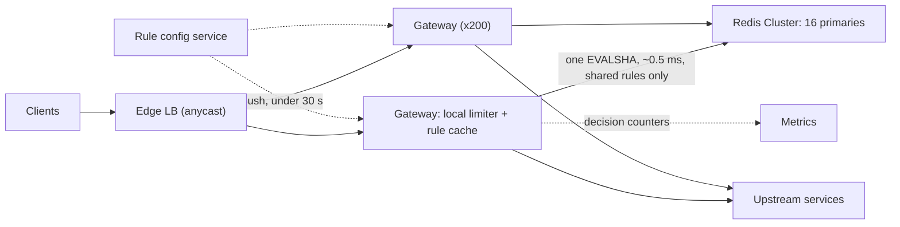

A public API serves 10 million API keys through 200 gateway nodes. Sooner or later a customer's retry loop sends 40,000 requests a second, a scraper rotates through thousands of IP addresses, or an internal batch job forgets to throttle itself. Without a limiter, each of those degrades the service for everyone else. A badly designed limiter is worse in a quieter way. It adds a synchronous dependency to every request, so when the limiter slows down the whole API slows down with it, and when the limiter fails it takes the API down with it.

So the design problem is this. Make a correct-enough decision per request in well under a millisecond. Make it consistently across hundreds of nodes, each of which sees only a slice of any one client's traffic. And make sure the limiter itself is never on the critical failure path. The algorithm is the easy part, and it is where most candidates spend their time. Senior candidates spend theirs on distribution, atomicity and failure.

## Requirements

### Functional

- **Limit by identity**: API key, authenticated user, or client IP for anonymous traffic.
- **Rules**: for example, 100 requests/s sustained with bursts up to 200 per API key; 10 per minute on `POST /v1/payments`; 1,000 per minute per anonymous IP prefix. Several rules apply to one request, and the request is rejected if any of them rejects it.
- **Respond properly**: `429 Too Many Requests` with `Retry-After` and remaining-quota headers, so well-behaved clients can back off precisely.
- **Configure live**: rules change without a deploy and take effect within 30 seconds. New rules can run in **shadow mode**, where they log would-be rejections without enforcing them.
- **Out of scope**: monthly billing quotas, which need exact, durable counting and belong in a metering system, and volumetric network-layer DDoS, which is absorbed at the edge before the gateway sees it.

### Non-functional

- **Added latency**: p99 under 1 ms for local decisions and under 2 ms when shared state is consulted.
- **Throughput**: 1 million requests/s at peak across three regions.
- **Accuracy**: within about 10% for protective limits. For limits written into a customer contract, never reject a customer who is below their limit, so when in doubt, admit.
- **Availability**: the limiter is never the reason the API is down.

## Back-of-envelope estimates

**Per-node load.** $10^6 / 200 = 5{,}000$ requests/s per gateway node.

**State.** 10 million active keys × 3 rules = $3 \times 10^7$ counters. A token bucket is two numbers (tokens and last-refill time, 16 bytes) plus a key name of about 40 bytes and Redis's per-key overhead of about 50 bytes, so roughly 100 bytes each. $3 \times 10^7 \times 100\ \text{B} = 3$ GB. Memory is not the constraint.

**Shared-state operations.** If every request runs one atomic script against a shared store, that is $10^6$ operations/s. A Redis primary running a short Lua script manages on the order of 50,000–100,000 per second, so this needs 10–20 primaries plus replicas, and each call adds a same-zone round trip of 0.3–0.5 ms. That is affordable, but it is the dominant cost, and the design should try to keep most requests away from it.

**Why the sliding log is out.** An exact sliding-window log for a 1,000-per-minute rule stores up to 1,000 timestamps per key. A Redis sorted set costs tens of bytes per member, so each key takes 50–100 KB. Across a million keys that is 50–100 GB, where a token bucket would use about 100 MB, and every request does three sorted-set commands. The log is exact and three orders of magnitude more expensive.

**Why purely local limiting fails.** The load balancer spreads a key's requests across 200 nodes. A 100/s limit split evenly gives each node 0.5 requests/s, and a burst allowance of 200 gives each node a bucket of one. Any imbalance in the load balancer then turns into false rejections. Local-only limiting works for large aggregate limits, such as a 50,000/s ceiling per upstream service, and fails for small per-client limits.

The design sentence: *the memory is trivial and the round trips are the cost, so the design question is how many requests must touch shared state, and the answer should be far below a million per second.*

## API design

The internal check is a gRPC call from the gateway, loosely modelled on the descriptor-based global rate limit API that Envoy defines. A request carries every rule dimension that applies to it:

```text
rpc ShouldRateLimit(CheckRequest) returns (CheckResponse)

CheckRequest {
  domain: "public-api"
  descriptors: [
    [("api_key", "k_81f2")],
    [("api_key", "k_81f2"), ("route", "POST /v1/payments")],
    [("ip_prefix", "203.0.113.0/24")]
  ]
  cost: 1
}
CheckResponse {
  overall: OVER_LIMIT
  statuses: [
    {code: OK,         limit: "100/s",  remaining: 37},
    {code: OVER_LIMIT, limit: "10/min", remaining: 0, reset_after_s: 42},
    {code: OK,         limit: "1000/min", remaining: 812}
  ]
}
```

The client sees:

```text
HTTP/1.1 429 Too Many Requests
Retry-After: 42
RateLimit-Limit: 10
RateLimit-Remaining: 0
RateLimit-Reset: 42
```

The `RateLimit-*` fields come from an IETF draft whose exact syntax has changed between revisions. Many APIs use `X-RateLimit-*` equivalents instead. Pick one, document it, and version it like any other part of the contract ([API design and versioning](/learn/system-design/building-blocks/api-design-and-versioning)). Rules live in reviewed configuration:

```yaml
domain: public-api
rules:
  - match: {api_key: "*"}
    algorithm: token_bucket
    rate: 100/s
    burst: 200
  - match: {api_key: "*", route: "POST /v1/payments"}
    algorithm: token_bucket
    rate: 10/min
    burst: 10
  - match: {ip_prefix: "*"}          # IPv4 by address, IPv6 by /64
    algorithm: sliding_window_counter
    rate: 1000/min
    mode: shadow                     # log would-be rejections only
```

## Data model

- **Counters** live in Redis Cluster as a hash per rule: `rl:{k_81f2}:r1 -> {tokens: 37.5, ts: 1727350000123}`. The TTL is the time to refill an empty bucket plus some slack, so idle clients cost nothing. The braces are a Redis Cluster **hash tag**: only `k_81f2` is hashed, so every rule for one client lands on the same slot, and a single script can check and consume all of them atomically.
- **Rules** live in a git-backed configuration service. They are compiled, versioned and pushed to gateways, which hold them in memory. A gateway never reads rules on the request path.
- **Decisions** (allowed, rejected, shadow-rejected, per rule) go to the metrics pipeline as counters, not to a database. You need them for dashboards and for tuning limits, not for audit.

## High-level design



There are two tiers. The **local tier** runs in the gateway process. It enforces coarse, large limits (per IP prefix, per upstream service) and caches recent denials. It costs nanoseconds and needs no network. The **shared tier** is Redis, and it enforces per-key rules that must be consistent across nodes. A request that fails the local check never touches Redis, which is exactly the behaviour you want during an attack, because floods are what fail the local checks.

## Deep dives

### 1. Choosing the algorithm

| Algorithm | State per key | Bursts | Accuracy | Where it fits |
|---|---|---|---|---|
| Fixed window counter | 1 integer | Up to 2× the limit at a window boundary | Poor at edges | Cheap daily quotas; one `INCR` + `EXPIRE` |
| Sliding window log | One timestamp per request | Exact | Exact | Low limits only (say 10/min on login) |
| Sliding window counter | 2 integers | Smoothed | Approximate, usually within a few percent | Per-IP and per-minute limits at scale |
| Token bucket | 2 numbers | Up to capacity, then the sustained rate | Exact for its model | Per-key API limits |
| Leaky bucket (as a queue) | A queue | None; output is smoothed | Exact | In front of a fragile downstream |
| GCRA | 1 timestamp | Same as token bucket | Exact | Token bucket in a single number |

**The fixed-window boundary problem.** With a limit of 100 per minute in fixed windows, a client can send 100 requests in the last second of one minute and another 100 in the first second of the next, which is 200 in two seconds. For a protective limit that is often acceptable, and many production limiters use fixed windows because they cost one `INCR` and one `EXPIRE`. For a limit that guards a fragile backend, it is double the load you designed for.

**The sliding window counter** fixes the boundary cheaply. It keeps the count for the current fixed window and the previous one, and it weights the previous count by how much of it still overlaps the sliding window. Take a limit of 100/min. The previous minute had 84 requests, the current minute has 36 so far, and you are 15 seconds into the current minute, so 45 of the previous window's 60 seconds still overlap:

$$\text{estimate} = 36 + 84 \times \tfrac{45}{60} = 36 + 63 = 99 < 100 \Rightarrow \text{allow}$$

The approximation assumes the previous window's requests were evenly spread. Cloudflare has described using exactly this approximation in production and measuring a very small error rate against exact counting on real traffic.

```viz
{"type": "system", "scenario": "sliding-window-log", "requests": 10,
 "title": "The exact version: a sliding window log",
 "caption": "Each accepted request's timestamp is kept and expired as the window slides. It is exact, with no boundary to game, and it costs one stored timestamp per request. That is why it is used for 10-per-minute login limits and not for 10,000-per-hour API limits."}
```

**The token bucket** is the right default for per-key API limits because its two parameters map onto how clients actually behave. The **capacity** is the largest burst: a dashboard page that fires 20 API calls at once should succeed. The **refill rate** is the sustained average. Refill is lazy: you never run a timer, you compute the refill from the elapsed time when a request arrives.

```python
def take(bucket, now, capacity, rate, cost=1):
    """Return True if the request is admitted. bucket = {"tokens": float, "ts": float}."""
    elapsed = now - bucket["ts"]
    bucket["tokens"] = min(capacity, bucket["tokens"] + elapsed * rate)   # lazy refill, capped
    bucket["ts"] = now                                                    # advance even on reject
    if bucket["tokens"] >= cost:
        bucket["tokens"] -= cost
        return True
    return False
```

```viz
{"type": "system", "scenario": "token-bucket", "requests": 12,
 "title": "Token bucket: burst up to capacity, then the refill rate",
 "caption": "Seven requests arrive at t=0: five drain the bucket and the other two get a 429. After that, requests succeed only as fast as tokens refill. Capacity sets the burst and the refill rate sets the sustained rate."}
```

**GCRA** (generic cell rate algorithm) is a token bucket stored as one timestamp, the theoretical arrival time (TAT) of the next conforming request. With emission interval $T = 1/\text{rate}$ and burst tolerance $\tau = (\text{capacity} - 1) \cdot T$, a request at time $t$ is admitted if $\max(\text{TAT}, t) - t \le \tau$, and the TAT then becomes $\max(\text{TAT}, t) + T$. It stores half as much state and involves no floating-point token counts, which is why several Redis-based limiters use it.

The choice: token bucket (implemented as GCRA or as the two-field hash) for per-key rules, a sliding window counter for per-IP rules, and a sliding log only for very low limits such as login attempts, where exactness matters and the log stays short.

### 2. Enforcing one limit across 200 nodes

**The race.** Two gateways handle requests from the same key in the same millisecond. Both read `tokens = 1`, both decide to admit, and both write `tokens = 0`, so two requests got through on one token. At 5,000 requests/s per node, this happens constantly for any busy key. The fix is to make the read-modify-write atomic *inside* the store, with a server-side script that Redis executes without interleaving:

```python
TOKEN_BUCKET_LUA = """
local cap, rate, cost = tonumber(ARGV[1]), tonumber(ARGV[2]), tonumber(ARGV[3])
local t = redis.call('TIME')   -- the store's clock, not the gateway's (fine before writes: scripts replicate effects)
local now = tonumber(t[1]) * 1000 + math.floor(tonumber(t[2]) / 1000)
local b = redis.call('HMGET', KEYS[1], 'tokens', 'ts')
local tokens = tonumber(b[1]) or cap
local ts = tonumber(b[2]) or now
tokens = math.min(cap, tokens + (now - ts) / 1000 * rate)
local ok = 0
if tokens >= cost then tokens = tokens - cost; ok = 1 end
redis.call('HSET', KEYS[1], 'tokens', tostring(tokens), 'ts', now)
redis.call('PEXPIRE', KEYS[1], math.ceil(cap / rate * 1000) + 1000)
return {ok, tostring(tokens)}
"""
take_token = redis_client.register_script(TOKEN_BUCKET_LUA)   # EVALSHA after the first call
ok, remaining = take_token(keys=["rl:{k_81f2}:r1"], args=[200, 100, 1])
```

Using the store's clock means gateway clock skew cannot mint tokens. When a request matches several rules, one script checks all of them and consumes from all of them only if every rule admits. Otherwise a client that is over one limit would keep burning its other budgets on requests that are rejected anyway. The hash tag guarantees that all of a key's rules live on the same shard, so this stays a single atomic call.

**How many requests touch Redis?** There are four strategies:

| Strategy | Shared-state ops/s | Accuracy | During a store outage |
|---|---|---|---|
| Central counter on every request | $10^6$ | Exact | Every decision is affected; must fail open |
| Local only (limit ÷ N per node) | 0 | Broken for small per-key limits | Unaffected |
| Token leasing (a node takes k tokens per call) | About requests ÷ k for busy keys | Overshoot up to k × nodes; leased tokens can sit unused on one node | Leases keep working until spent |
| Affinity (hash the key to one limiter node) | 0 shared ops, one extra hop | Exact per owner | 1/N of keys reset when a node leaves |

Affinity routing deserves a closer look, because it is how you avoid shared state entirely. Consistent-hash each API key to a limiter node. All of that key's decisions are then made in one process's memory, and when a node joins or leaves, only its neighbours' keys move. The keys that move start with a full bucket, which errs in the client's favour.

```viz
{"type": "system", "scenario": "consistent-hashing", "nodes": 4,
 "keys": ["key:k_81f2", "key:k_0a9c", "key:k_77de", "ip:203.0.113.0", "key:k_5b10", "ip:198.51.100.0"],
 "title": "Affinity: each client's buckets live on one limiter node",
 "caption": "Hash every rate-limit key onto the ring and its bucket lives on the first node clockwise. Adding a node moves only the keys between it and its predecessor, and their buckets restart full, which is the safe direction for a limiter."}
```

The choice at this scale: central counters in Redis for per-key rules. Sixteen primaries for a million operations a second is affordable and is the simplest system to reason about. Add two refinements for hot keys. First, **denial caching**: when Redis says a key is empty, the gateway rejects that key locally for a short interval, a few tens of milliseconds, and so an abusive client at 400× its limit stops generating Redis traffic proportional to its abuse. Second, **token leasing** for any key above about 1,000 requests/s, where the gateway takes 10 tokens per call and spends them locally. Local-only limiting stays for per-IP and per-service ceilings, where approximate is fine. YouTube's open-source Doorman is a publicly available example of the leasing model taken to its conclusion, with clients requesting capacity from a central allocator.

### 3. Failing open, and limits across regions

**Fail open, with a floor.** The gateway gives the limiter a 2 ms budget. When the call times out, the gateway admits the request, but only through a local fallback bucket sized at about twice the node's fair share of the limit (for 100/s over 200 nodes, 1/s per node). Wrap the Redis client in a circuit breaker so that during an outage the gateway stops paying the 2 ms timeout on every request and goes straight to the fallback ([Resilience patterns](/learn/system-design/building-blocks/resilience-patterns)). The fairness guarantee weakens for a few minutes and the API stays up. That is the right trade for protective limits.

**Fail closed where the limit is a security control.** Login attempts, one-time-password checks and password-reset emails are rate limited to stop brute force, not to share capacity fairly. Admitting them unmetered during an outage hands an attacker exactly the window they want. For those rules the fallback is a *strict* local limit, and if even that is unavailable, the request is rejected. Saying "fail open for fairness, fail closed for security" in one sentence is a strong senior signal.

**Multi-region.** A cross-region round trip costs 70–150 ms, so a globally exact counter cannot sit on the request path. There are three options:

1. **Split the budget.** Give each region a share of the global limit in proportion to its recent traffic for that key (for example 50/30/20) and rebalance every minute. There are no cross-region calls on the hot path, and the overshoot is bounded by how wrong the split is.
2. **Replicate counters asynchronously.** Each region increments its own counter and periodically ships it to the others as a grow-only counter per region (a CRDT), and admits against the sum of its own counter and the others' last-known values. The overshoot is roughly replication lag × rate.
3. **Home each key to a region.** It is exact, but it adds cross-region latency for any client that is not near its home.

Use option 1 for per-key limits and option 2 for rare global limits such as a free tier's daily quota. State the overshoot out loud: with a 1-second replication lag and a 100/s limit, a client hammering all three regions at once can get roughly 100–200 extra requests through before the regions converge.

## Failure modes

**A Redis primary fails.** Keys on that shard fail open to local fallback buckets until a replica is promoted, which takes seconds. If replication lagged, some buckets reset to full, which errs toward admitting. Degradation: fairness is approximate for about 10 seconds for a sixteenth of the keys.

**Limiter latency spikes.** Every request inherits the spike. The strict 2 ms timeout and the circuit breaker cap the damage, and you alert on limiter p99 separately from API p99 so that the cause is obvious.

**A hot key.** One client at 50,000 requests/s is one Redis shard's entire capacity, because the hash tag deliberately puts all its rules on one shard. Denial caching and token leasing cut that shard's load to hundreds of calls per second.

**A bad rule push.** A rule with `rate: 0/s` matching `*` makes the safety system cause the outage. Before activation, evaluate every rule change in shadow mode against live traffic and refuse any change that would reject more than a small percentage of currently admitted requests without a manual override. Roll out one region at a time and keep one-click rollback.

**Retry storms.** Clients that ignore `Retry-After` hammer the 429 path. That path must be cheaper than the success path: no upstream call, sampled logging instead of a log line per rejection, and escalation to an edge block when one identity sends more than about 100× its limit.

**State explosion under attack.** Per-IP keys with IPv6 let an attacker rotate through a /64 that holds $2^{64}$ addresses and create millions of buckets. Key IPv6 by /64 prefix, bound memory with TTLs and LRU eviction, and accept that eviction resets a bucket to full.

**Innocent users behind carrier-grade NAT.** Thousands of mobile users can share one IPv4 address. Per-IP limits therefore have to be generous, and anything strict should key on authenticated identity instead.

## Senior follow-ups

**Q: "A customer says they're being limited at 80 requests/s under a 100/s limit. Who's wrong?"**

Possibly neither. Check four things in order. (1) Burst shape: if they send 100 requests in the first 200 ms of each second, a token bucket with a small capacity rejects the tail even though the per-second average is under 100. The fix is to raise capacity or tell them to smooth their traffic. (2) Another rule: an endpoint-level or IP-level rule may be the one rejecting them. The response headers and our decision metrics say which, which is why each status carries its rule. (3) Multi-region split: if their traffic moved to a region that holds only 30% of their budget, they are hitting that region's share until the next rebalance. (4) Their own clock: they may be measuring requests sent, while retries of timed-out requests also count against the limit. The senior move is to make the limiter explain itself: every 429 names the rule that fired.

**Q: "How is this different from load shedding? Do you need both?"**

Yes, you need both, because they answer different questions. A rate limit is a fairness policy per client, and it is configured ahead of time: k_81f2 gets 100/s whether or not the service is busy. Load shedding protects the service as a whole from whatever traffic it is receiving right now, and it has to be adaptive, because capacity changes with deploys, failures and cache hit rates. Netflix has open-sourced an adaptive concurrency-limits library that applies TCP-congestion-control ideas to a service's in-flight request limit. That is the shape of the second mechanism. A service with only rate limits still falls over when every client is legitimately under its limit at once.

**Q: "Some requests are 1,000× more expensive than others. Same limit?"**

No. Charge tokens by cost. GitHub's GraphQL API publicly documents a points-based limit where each query's cost is computed from how many objects it could ask for. For a REST API, use a static cost per route (a search costs 10, a read costs 1), or charge after the fact from measured CPU time and debit the bucket on completion. That lets the bucket go negative, so the client's next request waits.

**Q: "How do you roll out a new limit without an incident?"**

Shadow mode first. The rule is evaluated on live traffic and emits `would_reject` metrics per client, but it enforces nothing. After a week you know exactly which customers it would affect, and account teams can warn them. Then enforce in one region, watch the 429 rate and support tickets, and roll out globally. That is the same canary discipline as a code deploy, applied to configuration.

**Q: "Should enforcement happen in the client SDK or on the server?"**

Both, with different jobs. The server is authoritative, because clients cannot be trusted. The SDK is a courtesy that improves everyone's experience: it reads `Retry-After` and `RateLimit-Remaining`, pauses before it is rejected, and retries 429s with exponential backoff and jitter. Well-behaved SDKs turn a rejection storm into a smooth throttle, which is cheaper for both sides.

**Q: "Can you enforce a global limit exactly across three regions?"**

Only by paying a cross-region consensus round trip on every request, 100 ms or more, and that is almost never worth it for a rate limit. I would say out loud that the global limit is approximate, quantify the overshoot from the replication lag, and reserve exact enforcement for the metering system that bills monthly quotas, which can reconcile after the fact.

## Exercise

```exercise
id: token-bucket-decisions
title: Replay a token bucket
prompt: |
  Implement `token_bucket(capacity, rate, times)`.

  The bucket holds at most `capacity` tokens and starts full at time 0. It
  refills continuously at `rate` tokens per second, never exceeding
  `capacity`. `times` is a non-decreasing list of request arrival times in
  seconds. Each request needs one whole token: if at least one token is
  available at its arrival time, consume it and admit the request; otherwise
  reject it.

  Return a list of booleans, one per request (true = admitted).

  Refill lazily: on each arrival, add `(t - last) * rate` tokens (capped),
  then update `last`, whether or not the request is admitted. Tokens may be
  fractional between requests.
languages: [python, javascript]
entry: token_bucket
starter:
  python: |
    def token_bucket(capacity, rate, times):
        # your code here
        return []
  javascript: |
    function token_bucket(capacity, rate, times) {
      // your code here
      return [];
    }
tests:
  - args: [3, 1, [0, 0, 0, 0]]
    expected: [true, true, true, false]
    label: burst up to capacity
  - args: [3, 1, [0, 0, 0, 0, 1, 1]]
    expected: [true, true, true, false, true, false]
  - args: [2, 1, [0, 0, 10, 10, 10]]
    expected: [true, true, true, true, false]
    label: refill is capped at capacity
  - args: [1, 0.5, [0, 1, 2, 3, 4]]
    expected: [true, false, true, false, true]
    label: fractional tokens accumulate across rejections
  - args: [5, 1, []]
    expected: []
    label: no requests
  - args: [5, 2, [0, 0, 0, 0, 0, 0, 0.5, 0.75, 1, 3, 3, 3, 3, 3, 3]]
    expected: [true, true, true, true, true, false, true, false, true, true, true, true, true, false, false]
    hidden: true
  - args: [4, 0.25, [0, 0, 0, 0, 0, 2, 4, 8, 8, 20, 20, 20]]
    expected: [true, true, true, true, false, false, true, true, false, true, true, true]
    hidden: true
hints:
  - "Keep two variables: tokens (start at capacity) and last (start at 0)."
  - "On each arrival: tokens = min(capacity, tokens + (t - last) * rate); last = t; then admit if tokens >= 1."
  - "Do not reset the fractional token count on a rejection; half a token plus half a token is a whole one."
```

## Senior signals

- You price the design in shared-state round trips, not in memory, and you aim to keep most requests away from shared state.
- You explain why local-only limiting breaks for small per-key limits (0.5 requests/s per node) and works for large aggregate ones.
- You make read-modify-write atomic in the store and use the store's clock, and you keep multi-rule checks all-or-nothing.
- You fail open for fairness limits and fail closed for security limits, and you say so in one sentence.
- You separate rate limiting (a per-client policy) from load shedding (adaptive protection for the service) and design both.
- You ship limits through shadow mode and a canary, because a bad limit is an outage you caused yourself.

## Check yourself

```quiz
- q: >-
    A fixed-window limiter allows 100 requests per minute. What is the most requests a client can get through in any 2-second interval?
  options: ["150", "About 103", "100", "200"]
  answer: 3
  explanation: >-
    The client sends 100 at the end of one window and 100 at the start of the next. The counter resets at the boundary, so 200 requests land within two seconds. "100" is what the limit promises, not what fixed windows enforce; this boundary problem is what sliding windows and token buckets avoid.
- q: >-
    A sliding window counter has limit 100/min. The previous minute counted 84 requests and the current minute has 36, and you are 15 seconds into the current minute. What does the limiter decide for the next request?
  options: ["Reject, because 84 + 36 x 45/60 = 111 is over 100", "Reject, because 84 + 36 = 120 is over the limit of 100", "Allow, because only the current window's 36 requests count", "Allow, because 36 + 84 x 45/60 = 99 is under 100"]
  answer: 3
  explanation: >-
    45 of the previous window's 60 seconds still overlap the sliding window, so the previous count is weighted by 0.75 and the current count is taken in full: 36 + 63 = 99. Summing both raw counts over-penalises the client, and applying the weight to the current window instead of the previous one gets the formula backwards.
- q: >-
    Two gateway nodes check the same API key at the same instant. Both read tokens = 1 from Redis with HMGET, both admit, and both write tokens = 0. What is the correct fix?
  options: ["Wrap every check in a distributed lock acquired from the same Redis", "Run the read, refill, decide and write as one atomic server-side script", "Route all traffic through one gateway so only one process decides", "Shorten the TTL on the bucket key so stale token counts expire much sooner"]
  answer: 1
  explanation: >-
    The bug is a non-atomic read-modify-write. A Lua script runs without interleaving in Redis, which fixes it at the cost of one round trip. A distributed lock would also serialise the check, but it adds several round trips and a new failure mode. A single gateway removes the race by removing the scale, and the TTL has nothing to do with the race.
- q: >-
    The Redis cluster behind the limiter is unreachable. Which policy is best?
  options: ["Fail closed for every rule, so no client can exceed any of its limits", "Fail open for every rule, since API availability matters most of all", "Queue requests at the gateway until the Redis cluster is reachable again", "Fail open via local buckets for fairness, closed for security limits"]
  answer: 3
  explanation: >-
    Fairness limits exist to share capacity, and an unmetered few minutes through a local fallback bucket is better than an API outage. Login and OTP limits exist to stop brute force, and admitting them unmetered opens exactly the window an attacker wants, so they fail closed or fall back to a strict local limit. Failing open for everything misses that distinction, and queuing just turns the outage into latency and memory growth.
- q: >-
    Your gateway fleet has 200 nodes behind a round-robin load balancer. Why can't each node enforce a 100 requests/s per-key limit on its own by allowing 0.5 requests/s locally?
  options: ["It can; splitting the limit evenly is exact under round-robin load balancing", "Round-robin sends all of one key's traffic to a single node anyway", "It can't, because node clocks drift too far to measure 0.5 requests/s", "Shares that small can't absorb bursts, and any imbalance falsely rejects"]
  answer: 3
  explanation: >-
    A 0.5/s share with a burst of one per node rejects a client whose two requests happen to land on the same node, even though it is far under its global limit. Round-robin spreads requests on average, not exactly, so an even split is not exact. Local limiting works for large aggregate ceilings; small per-client limits need a shared counter, leases or affinity routing.
```
