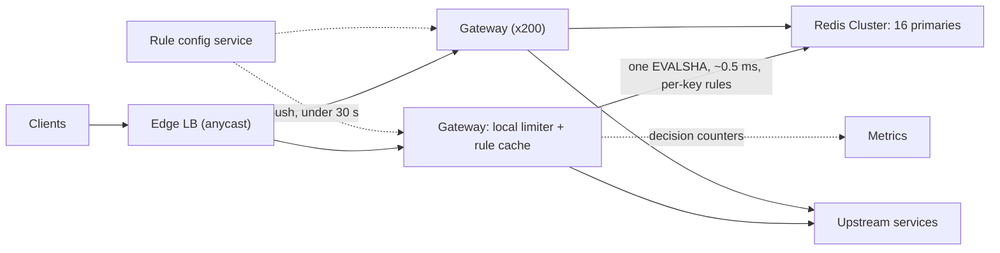

A public API serves 10 million API keys through 200 gateway nodes. Sooner or later a customer's retry loop sends 40,000 requests a second, a scraper rotates through thousands of IP addresses, or an internal batch job forgets to throttle itself. Without a limiter, each of those degrades the service for everyone else. A badly designed limiter is worse in a quieter way: it adds a synchronous dependency to every request, so when the limiter slows down the API slows down, and when it fails the API fails.

So the design problem is to make a correct-enough decision per request in well under a millisecond, consistently across hundreds of nodes that each see a slice of one client's traffic, without the limiter ever being on the critical failure path. The algorithm is the easy part and where most candidates spend their time. Senior candidates spend theirs on distribution, atomicity and failure.

## Requirements

### Functional

- **Limit by identity**: API key, authenticated user, or client IP (IPv6 by /64) for anonymous traffic.
- **Rules**: for example, 100 requests/s sustained with bursts to 200 per API key; 10 per minute on `POST /v1/payments`; 1,000 per minute per anonymous IP prefix. Several rules apply to one request, and it is rejected if any rejects it.
- **Respond properly**: `429 Too Many Requests` with `Retry-After` and remaining-quota headers.
- **Configure live**: rule changes take effect within 30 seconds without a deploy, and new rules can run in **shadow mode**, logging would-be rejections without enforcing them.
- **Out of scope**: monthly billing quotas (exact, durable counting belongs in a metering system) and volumetric network-layer DDoS, absorbed at the edge.

### Non-functional

- **Added latency**: p99 under 1 ms for local decisions, under 2 ms when shared state is consulted.
- **Accuracy**: within about 10% for protective limits; for contractual limits, never reject a customer below their limit, so when in doubt, admit.
- **Availability**: the limiter is never the reason the API is down.

### Scale

1 million requests a second at peak across three regions, 200 gateway nodes, 10 million active API keys, three rules per key on average.

## Back-of-envelope estimates

| Quantity | Arithmetic | Result |
|---|---|---|
| Per-gateway load | $10^6 \div 200$ | 5,000 requests/s per node |
| Counters | $10^7$ keys × 3 rules | $3 \times 10^7$ |
| Counter memory | $3 \times 10^7$ × ~100 B (16 B of state, ~40 B key name, ~50 B Redis per-key overhead) | 3 GB |
| Shared-state calls | One atomic script per request for per-key rules | $10^6$/s before any optimisation |
| Limiter traffic | $10^6$ × ~180 B (script hash, keys, arguments, reply) | 180 MB/s, about 1.4 Gbit/s fleet-wide |
| Sliding log instead | 1,000 timestamps × ~60 B per sorted-set member for a 1,000/min rule | 60 KB per key: 60 GB for a million keys, against 100 MB of buckets |
| Local-only instead | 100/s ÷ 200 nodes | 0.5 requests/s per node; a burst of 200 becomes 1 per node |

| Tier | Sizing | Count |
|---|---|---|
| Redis | $10^6$ calls/s ÷ 62,500 per primary. A short Lua script costs several times a `GET`, so a primary manages on the order of 50,000–100,000 a second depending on script length; 62,500 leaves headroom | 16 primaries + 16 replicas, ~190 MB of buckets each |
| Gateways | Given: 5,000 requests/s each, the limiter adds one round trip | 200 |
| Rule configuration service | Pushes versioned bundles; off the request path | 3 |

Two alternatives die in this table. The sliding log is exact and three orders of magnitude more expensive in memory, with three sorted-set commands per request. Local-only limiting splits a 100/s limit into 0.5/s per node, so any load-balancer imbalance becomes a false rejection; it works for large aggregate ceilings (50,000/s per upstream service) and fails for small per-client limits.

The design sentence: **memory is trivial and round trips are the cost, so the question is how many requests must touch shared state, and the answer should be far below a million a second.**

## API design

The internal check is a gRPC call, loosely modelled on the descriptor-based global rate limit API that Envoy defines. A request carries every rule dimension that applies to it:

```text
rpc ShouldRateLimit(CheckRequest) returns (CheckResponse)

CheckRequest {
  domain: "public-api"
  descriptors: [
    [("api_key", "k_81f2")],
    [("api_key", "k_81f2"), ("route", "POST /v1/payments")],
    [("ip_prefix", "203.0.113.0/24")]
  ]
  cost: 1
}
CheckResponse {
  overall: OVER_LIMIT
  statuses: [
    {code: OK,         limit: "100/s",  remaining: 37},
    {code: OVER_LIMIT, limit: "10/min", remaining: 0, reset_after_s: 42},
    {code: OK,         limit: "1000/min", remaining: 812}
  ]
}
```

The client sees:

```text
HTTP/1.1 429 Too Many Requests
Retry-After: 42
RateLimit-Limit: 10
RateLimit-Remaining: 0
RateLimit-Reset: 42
```

The `RateLimit-*` fields come from an IETF draft whose syntax has changed between revisions, and many APIs use `X-RateLimit-*` instead; pick one, document it and version it ([API design and versioning](/learn/system-design/building-blocks/api-design-and-versioning)). Rules live in reviewed configuration:

```yaml
domain: public-api
rules:
  - match: {api_key: "*"}
    algorithm: token_bucket
    rate: 100/s
    burst: 200
  - match: {api_key: "*", route: "POST /v1/payments"}
    algorithm: token_bucket
    rate: 10/min
    burst: 10
  - match: {ip_prefix: "*"}          # IPv4 by address, IPv6 by /64
    algorithm: sliding_window_counter
    rate: 1000/min
    mode: shadow                     # log would-be rejections only
```

## Data model

| State | Key | Where it lives | Value and TTL | Why this shape |
|---|---|---|---|---|
| Per-key buckets | `rl:{k_81f2}:r1` | Redis Cluster; the braces are a hash tag, so only `k_81f2` is hashed | Hash `{tokens, ts}`; TTL = time to refill an empty bucket + 1 s | Every rule for one identity lands on one slot, so one script checks and consumes all of them atomically; idle clients expire and cost nothing |
| Per-IP windows | `ip:203.0.113.0/24:<minute>` | Gateway memory (local tier) | Two counters; expire after two windows | Approximate is fine and needs no network |
| Denial cache | `k_81f2:r2` | Gateway memory | Deny-until timestamp, 50 ms | Keeps an abusive client's traffic away from Redis |
| Rules | Versioned bundle | Git-backed config service, pushed to gateways | Compiled rules in memory | A gateway never reads rules on the request path |
| Decisions | `(rule, outcome)` counters | Metrics pipeline | Aggregated per 10 s | For dashboards and tuning, not audit |

The hash tag concentrates a client on one shard on purpose: atomicity across its rules is worth more than spreading its load, and the hot-client problem that creates is handled in deep dive 2.

## High-level design



The **local tier** runs in the gateway process: coarse limits (per IP prefix, per upstream service) and the denial cache, in nanoseconds with no network. The **shared tier** is Redis, for per-key rules that must agree across nodes. A request that fails locally never touches Redis, which is the behaviour you want during an attack, because floods are what fail the local checks.

## Deep dive 1: choosing the algorithm

| Algorithm | State per key | Bursts | Accuracy | Where it fits |
|---|---|---|---|---|
| Fixed window counter | 1 integer | Up to 2× the limit at a window boundary | Poor at edges | Cheap daily quotas; one `INCR` + `EXPIRE` |
| Sliding window log | One timestamp per request | Exact | Exact | Low limits only (10/min on login) |
| Sliding window counter | 2 integers | Smoothed | Approximate, within a few percent | Per-IP and per-minute limits at scale |
| Token bucket | 2 numbers | Up to capacity, then the sustained rate | Exact for its model | Per-key API limits |
| Leaky bucket (as a queue) | A queue | None; output is smoothed | Exact | In front of a fragile downstream |
| GCRA | 1 timestamp | Same as token bucket | Exact | Token bucket in a single number |

### Windows: the boundary problem and its cheap fix

With 100 per minute in fixed windows, a client sends 100 in the last second of one minute and 100 in the first second of the next: 200 in two seconds. Many production limiters accept that for protective limits because it costs one `INCR` and one `EXPIRE`; for a limit guarding a fragile backend, it is double the designed load.

The **sliding window counter** keeps the current and previous windows' counts and weights the previous one by how much of it still overlaps. Limit 100/min; the previous minute had 84, the current has 36, and you are 15 s in, so 45 of the previous window's 60 s overlap:

$$\text{estimate} = 36 + 84 \times \tfrac{45}{60} = 36 + 63 = 99 < 100 \Rightarrow \text{allow}$$

It assumes the previous window's requests were evenly spread.

```viz
{"type": "system", "scenario": "sliding-window-log", "requests": 10,
 "title": "The exact version: a sliding window log",
 "caption": "Each accepted request's timestamp is kept and expired as the window slides. It is exact, with no boundary to game, and it costs one stored timestamp per request. That is why it is used for 10-per-minute login limits and not for 10,000-per-hour API limits."}
```

### Token bucket, capacity, and GCRA

The **token bucket** is the default for per-key limits because its parameters match client behaviour: **capacity** is the largest burst (a dashboard firing 20 calls at once), the **refill rate** the sustained average. Refill is lazy, computed from elapsed time on arrival:

```python
def take(bucket, now, capacity, rate, cost=1):
    """Return True if the request is admitted. bucket = {"tokens": float, "ts": float}."""
    elapsed = now - bucket["ts"]
    bucket["tokens"] = min(capacity, bucket["tokens"] + elapsed * rate)   # lazy refill, capped
    bucket["ts"] = now                                                    # advance even on reject
    if bucket["tokens"] >= cost:
        bucket["tokens"] -= cost
        return True
    return False
```

Capacity is a product decision with a measurable effect. A client averaging 80/s under a 100/s limit, but sending each second's 80 requests in the first 200 ms, was replayed through this function for ten seconds:

| Capacity | Rejected |
|---|---|
| 20 | 51% |
| 50 | 14% |
| 100 or more | 0% |

Same average rate, same limit; the capacity alone decides whether the customer files a ticket.

```viz
{"type": "system", "scenario": "token-bucket", "requests": 12,
 "title": "Token bucket: burst up to capacity, then the refill rate",
 "caption": "Seven requests arrive at t=0: five drain the bucket and the other two get a 429. After that, requests succeed only as fast as tokens refill. Capacity sets the burst and the refill rate sets the sustained rate."}
```

**GCRA** stores the bucket as one timestamp, the theoretical arrival time (TAT) of the next conforming request. With emission interval $T = 1/\text{rate}$ and burst tolerance $\tau = (\text{capacity} - 1) \cdot T$, a request at $t$ is admitted if $\max(\text{TAT}, t) - t \le \tau$, and TAT becomes $\max(\text{TAT}, t) + T$. Half the state and no floating-point token count, which is why several Redis-based limiters use it. The choice: token bucket (as GCRA or the two-field hash) per key, sliding window counter per IP, sliding log only for very low limits such as login attempts.

## Deep dive 2: one limit across 200 nodes

### The race and the atomic script

Two gateways handle the same key in the same millisecond. Both read `tokens = 1`, both admit, both write `tokens = 0`: two requests on one token, constantly, for any busy key at 5,000 requests a second per node. The fix makes the read-modify-write atomic inside the store, with a script Redis runs without interleaving:

```python
TOKEN_BUCKET_LUA = """
local cap, rate, cost = tonumber(ARGV[1]), tonumber(ARGV[2]), tonumber(ARGV[3])
local t = redis.call('TIME')   -- the store's clock, not the gateway's (fine before writes: scripts replicate effects)
local now = tonumber(t[1]) * 1000 + math.floor(tonumber(t[2]) / 1000)
local b = redis.call('HMGET', KEYS[1], 'tokens', 'ts')
local tokens = tonumber(b[1]) or cap
local ts = tonumber(b[2]) or now
tokens = math.min(cap, tokens + (now - ts) / 1000 * rate)
local ok = 0
if tokens >= cost then tokens = tokens - cost; ok = 1 end
redis.call('HSET', KEYS[1], 'tokens', tostring(tokens), 'ts', now)
redis.call('PEXPIRE', KEYS[1], math.ceil(cap / rate * 1000) + 1000)
return {ok, tostring(tokens)}
"""
take_token = redis_client.register_script(TOKEN_BUCKET_LUA)   # EVALSHA after the first call
ok, remaining = take_token(keys=["rl:{k_81f2}:r1"], args=[200, 100, 1])
```

The store's clock means gateway skew cannot mint tokens. With several rules, one script checks all and consumes from all only if every rule admits; otherwise a client over one limit keeps burning its other budgets on rejected requests.

**One request, traced** (same-zone round trip about 0.4 ms; the script itself runs for tens of microseconds):

| t (µs) | Where | Action |
|---|---|---|
| 0 | Gateway | Parse request; identity `k_81f2` from the API-key cache |
| 5 | Gateway | Local tier: IP prefix at 812 of 1,000 this minute, pass; denial cache has no entry for `k_81f2` |
| 10 | Gateway | `EVALSHA` with `rl:{k_81f2}:r1` and `rl:{k_81f2}:r2`, one slot |
| 210 | Redis | `TIME`, two `HMGET`s, refill both; r2 (10/min on payments) has 0 tokens, so nothing is consumed from either |
| 240 | Redis | Reply `{r1: OK 37, r2: OVER_LIMIT, reset 42 s}` |
| 450 | Gateway | 429 with `Retry-After: 42`; cache the denial of `k_81f2:r2` for 50 ms; bump `rejected{rule=r2}` |

About 0.45 ms of the 2 ms budget; the round trip is 90% of it.

Under the hood, Redis runs the script on its single command thread, so nothing interleaves and nothing else on that shard runs meanwhile: a script that loops over thousands of keys stalls every client of the shard, which is why the script touches only one client's few buckets. `EVALSHA` sends the script's SHA-1 instead of its text; the script cache is not durable data, so after a restart or failover the new primary can answer `NOSCRIPT`, and the client must resend the full script (redis-py's registered scripts do this for you). Since Redis 5 scripts replicate their effects (the `HSET` values) rather than the script, which is why reading `TIME` inside one is safe.

### How many requests touch Redis?

| Strategy | Shared-state calls/s | Accuracy | During a store outage |
|---|---|---|---|
| Central counter on every request | $10^6$ | Exact | Every decision affected; must fail open |
| Local only (limit ÷ N per node) | 0 | Broken for small per-key limits | Unaffected |
| Token leasing (take k tokens per call) | About requests ÷ k for busy keys | Overshoot up to k × nodes; leased tokens idle on one node | Leases keep working until spent |
| Affinity (hash the key to one limiter node) | 0 shared, one extra hop | Exact per owner | 1/N of keys reset when a node leaves |

Simulated: a key limited to 100/s (capacity 200) whose owner's retry loop sends 40,000 requests a second, Poisson, across 200 gateways, for 5 s; and a legitimate key sending 3,000/s under a 5,000/s limit.

| Defence | Redis calls/s, abusive key | Admitted/s | Redis calls/s, busy legitimate key |
|---|---|---|---|
| None | 40,067 | 140 (the burst of 200 plus 100/s) | 2,973 |
| Denial cache, 10 ms | 13,398 | 140 | – |
| Denial cache, 50 ms | 3,780 | 140 | – |
| Denial cache, 100 ms | 2,057 | 140 | – |
| Leasing, 10 tokens per call | – | – | 317 |

A 50 ms denial cache cuts the abuser's shard load by 10× without admitting one extra request, because 200 gateways each re-checking 20 times a second still find every refilled token. Leasing does the same for honest heavy users. The choice: central counters in Redis, a 50 ms denial cache everywhere, and 10-token leases for keys above about 1,000 requests a second.

```viz
{"type": "system", "scenario": "consistent-hashing", "nodes": 4,
 "keys": ["key:k_81f2", "key:k_0a9c", "key:k_77de", "ip:203.0.113.0", "key:k_5b10", "ip:198.51.100.0"],
 "title": "Affinity: each client's buckets live on one limiter node",
 "caption": "Hash every rate-limit key onto the ring and its bucket lives on the first node clockwise. Adding a node moves only the keys between it and its predecessor, and their buckets restart full, which is the safe direction for a limiter."}
```

Affinity routing removes shared state entirely: consistent-hash each key to a limiter process and make every decision in its memory; keys that move when a node joins restart full, which errs in the client's favour. It is where the design goes at 10× (below).

## Deep dive 3: failing open, and limits across regions

### A Redis primary dies, traced

The gateway gives the limiter a 2 ms budget and wraps the client in a circuit breaker ([Resilience patterns](/learn/system-design/building-blocks/resilience-patterns)). The fallback is a local bucket at twice the node's fair share: for 100/s over 200 nodes, 1/s per node, at most 200/s fleet-wide.

| t | Event | Keys on the failed shard (1/16) |
|---|---|---|
| 0 s | Primary for one slot range dies | Calls time out at 2 ms; p99 of affected requests rises by 2 ms |
| ~1 s | Breakers on each gateway open after a burst of timeouts | Local fallback buckets; no more 2 ms waits |
| ~15–20 s | Redis Cluster promotes a replica: failure is declared after `cluster-node-timeout` (15 s by default), then an election | Still on fallback |
| ~21 s | Breakers half-open, probes succeed, breakers close | Buckets on the new primary may be a few writes behind, so some are fuller than they should be |

```viz
{"type": "system", "scenario": "circuit-breaker", "title": "The breaker stops every request paying the 2 ms timeout",
 "caption": "Closed: calls go to Redis. After a burst of failures the breaker opens and the gateway decides from its local fallback bucket without waiting. Half-open: a few probes test Redis, and success closes the breaker again."}
```

One-sixteenth of clients get approximate fairness for about 20 seconds, erring toward admitting, and the API stays up.

**Fail closed where the limit is a security control.** Login attempts, one-time-password checks and password-reset emails are limited to stop brute force, not to share capacity; admitting them unmetered during an outage hands an attacker the window they want. Their fallback is a strict local limit, and without that, rejection. "Fail open for fairness, fail closed for security" in one sentence is a strong senior signal.

### Multi-region budgets, simulated

A cross-region round trip costs 70–150 ms, so an exact global counter cannot sit on the request path. Replicating per-region counters asynchronously (a grow-only counter per region, a CRDT) looks attractive. Simulated: limit 100/s in one-second windows; an aggressive client sends 1,000/s to each of three regions; each region admits while its own count plus the others' last-known counts is under 100.

| Replication lag | Admitted/s |
|---|---|
| 0 | 100 |
| 10 ms | 120 |
| 50 ms | 200 |
| 100 ms or more | 300 |

The overshoot is about lag × per-region send rate × (regions − 1), capped at (regions − 1) × limit: each region spends the whole budget before hearing from the others. So per-key limits use a **budget split** instead: each region gets a share in proportion to the key's recent traffic (say 50/30/20), rebalanced every minute, with no overshoot at all. Its failure is the opposite: a client that moves all its traffic to the 20% region gets 20/s until the next rebalance. Async counters remain right for long windows such as a daily free-tier quota, where one second of lag is 1/86,400 of the window. [CRDTs and collaboration](/learn/system-design/distributed-systems/crdts-and-collaboration) covers the counters themselves.

## Failure modes

| Failure | Symptom | Diagnosis | Fix |
|---|---|---|---|
| Redis primary fails | 2 ms latency bump, then approximate limits for 1/16 of keys for ~20 s | Breaker-open metric per shard | Fail open to local fallback buckets; closed for security rules |
| Hot client | One shard at 100% CPU; every client on it slows | The hash tag put one abusive key's 40,000/s on one shard | 50 ms denial cache; leases for heavy honest keys; edge block beyond 100× the limit |
| Retry herd | Rejections come back in waves exactly `Retry-After` seconds later | 5,000 clients rejected in one second and told `Retry-After: 42` return in the same second 42 s later; spreading each over 0–50% jitter cut the simulated peak from 5,000 to 263 a second | Jitter `Retry-After`; make the 429 path cheaper than success: no upstream call, sampled logs |
| Bad rule push | 429 rate jumps fleet-wide after a config change | Rule diff: `rate: 0/s` matching `*`, or a regex that fails to compile and crashes reloads | Shadow-evaluate every change on live traffic; refuse changes that would reject more than a small percentage of admitted requests without an override; one region at a time; one-click rollback |
| Retries double-charge | A customer "limited at 80/s under a 100/s limit" | Their timed-out requests were retried and every attempt took a token | Charge per attempt and say so; the SDK backs off on 429 with jitter |
| State explosion under attack | Redis memory climbs; evictions | An attacker rotates through the $2^{64}$ addresses of one IPv6 /64, creating a bucket per address | Key IPv6 by /64 (by /48 for sources that rotate prefixes); TTLs and LRU eviction, accepting that eviction resets a bucket to full |
| Region loss | Traffic fails over; survivors reject legitimate clients | Budget shares still sized for three regions | On an evacuation signal, reassign the lost region's share immediately rather than at the next minute |
| Carrier-grade NAT | Mobile users rejected in clusters | Thousands of users behind one IPv4 address | Generous per-IP limits; strict limits only on authenticated identity |

## Trade-offs: what was rejected

| Decision | Chosen | Rejected | Why rejected here | What would flip it |
|---|---|---|---|---|
| Per-key algorithm | Token bucket or GCRA | Fixed window; sliding log | 2× bursts at boundaries; 60 KB per key | A daily quota (fixed window is fine); login limits (the log is short) |
| Consistency across nodes | Atomic Lua script | Distributed lock; `WATCH`/`MULTI` | Several round trips; retries storm on hot keys | – |
| Where state lives | Central Redis + denial cache + leases | Local only; affinity tier | 0.5/s shares; another tier to run at 1M/s | 10× traffic: affinity becomes cheaper |
| Outage policy | Fail open with a local floor; closed for security | Fail closed; fail open unmetered | The limiter becomes the outage; a brute-force window | – |
| Multi-region | Budget split per key | Global counter; async counters | 70–150 ms per request; 3× overshoot at 100 ms lag | Long windows: async counters |

## Evolution at 10× and 100×

**10× (10 million requests a second).** One script call per request would be 160 Redis primaries and 14 Gbit/s of limiter traffic, and the round trip becomes the cost worth removing. Move per-key rules to an **affinity tier**: gateways consistent-hash each key to a limiter process holding buckets in memory and batch decisions over gRPC. An in-memory decision takes on the order of a microsecond, so a node does hundreds of thousands a second and tens of nodes cover the load, at one extra hop and approximate limits for the keys that move when a node leaves.

**100× (100 million a second).** Even an extra hop per request is expensive at that rate. Decisions go local-first with periodic capacity leases from an allocator (the Doorman model below), anonymous traffic is limited at the CDN edge before it reaches a gateway, and exact enforcement survives only where money is involved, in the metering system that reconciles after the fact.

## What real companies describe

- Stripe's engineering blog has described running four kinds of limiter: a token-bucket request rate limiter per user, a concurrent-requests limiter, and two load shedders that reserve capacity for critical traffic, built on Redis.
- Cloudflare has described using the sliding window counter approximation above at scale and reported a very small error rate against exact counting on real traffic.
- Envoy's global rate limit API, and Lyft's open-source Go service that implements it on Redis, is the descriptor model this lesson's API follows.
- YouTube's open-source Doorman leases capacity to clients from a central allocator, the leasing model taken to its conclusion.
- GitHub's GraphQL API documents a points-based limit where a query's cost is computed from how many objects it could return.
- Netflix open-sourced an adaptive concurrency-limits library that applies TCP congestion-control ideas to a service's in-flight limit: load shedding, not rate limiting.

## Interviewer follow-ups

**"A customer says they're limited at 80 requests/s under a 100/s limit. Who's wrong?"** Model answer: possibly neither. Check burst shape (80 requests in 200 ms against a capacity of 50 rejects 14%), which rule fired (every 429 names it), whether their traffic moved to a region with a smaller budget share, and whether retries of timed-out requests count against them. Make the limiter explain itself. Common wrong answer: "the limiter has a bug", before looking at the burst shape.

**"How is this different from load shedding? Do you need both?"** Model answer: yes. A rate limit is a per-client fairness policy configured ahead of time; load shedding protects the service from whatever arrives now and must adapt, because capacity changes with deploys, failures and cache hit rates. A service with only rate limits still falls over when every client is legitimately under its limit at once. Common wrong answer: "a global rate limit is load shedding".

**"Some requests are 1,000× more expensive than others. Same limit?"** Model answer: charge tokens by cost: a static cost per route (search 10, read 1), or measured CPU debited on completion, letting the bucket go negative so the client's next request waits. Common wrong answer: a separate request-count limit per endpoint, which multiplies rules without measuring cost.

**"How do you roll out a new limit without an incident?"** Model answer: shadow mode on live traffic emitting `would_reject` per client for a week, warn the affected customers, enforce in one region, watch 429s and tickets, then go global: canary discipline applied to configuration. Common wrong answer: "set it high and lower it gradually", which still surprises whoever sits at the new line.

**"Can you enforce a global limit exactly across three regions?"** Model answer: only with a cross-region consensus round trip on every request, 100 ms or more. Say the global limit is approximate, quantify the overshoot (up to 3× with async counters at 100 ms lag, none with a budget split), and leave exact enforcement to metering, which reconciles later. Common wrong answer: "replicate the counters", without computing the overshoot.

## What mid-level engineers get wrong

- Reading, deciding and writing with separate Redis commands, so two gateways spend one token twice.
- Splitting a per-key limit evenly across nodes; 0.5/s per node rejects honest bursts.
- Sizing capacity equal to the per-second rate without looking at burst shape, then fielding "limited below my limit" tickets.
- Failing closed on a Redis outage, making the limiter the outage.
- Failing open on login and OTP limits, handing an attacker an unmetered window.
- A fixed `Retry-After`, which synchronises every rejected client into the next wave.
- Replicating counters across regions and calling it "eventually exact", when an aggressive client gets up to three times the limit.

## Exercise

```exercise
id: token-bucket-decisions
title: Replay a token bucket
prompt: |
  Implement `token_bucket(capacity, rate, times)`.

  The bucket holds at most `capacity` tokens and starts full at time 0. It
  refills continuously at `rate` tokens per second, never exceeding
  `capacity`. `times` is a non-decreasing list of request arrival times in
  seconds. Each request needs one whole token: if at least one token is
  available at its arrival time, consume it and admit the request; otherwise
  reject it.

  Return a list of booleans, one per request (true = admitted).

  Refill lazily: on each arrival, add `(t - last) * rate` tokens (capped),
  then update `last`, whether or not the request is admitted. Tokens may be
  fractional between requests.
languages: [python, javascript]
entry: token_bucket
starter:
  python: |
    def token_bucket(capacity, rate, times):
        # your code here
        return []
  javascript: |
    function token_bucket(capacity, rate, times) {
      // your code here
      return [];
    }
tests:
  - args: [3, 1, [0, 0, 0, 0]]
    expected: [true, true, true, false]
    label: burst up to capacity
  - args: [3, 1, [0, 0, 0, 0, 1, 1]]
    expected: [true, true, true, false, true, false]
  - args: [2, 1, [0, 0, 10, 10, 10]]
    expected: [true, true, true, true, false]
    label: refill is capped at capacity
  - args: [1, 0.5, [0, 1, 2, 3, 4]]
    expected: [true, false, true, false, true]
    label: fractional tokens accumulate across rejections
  - args: [5, 1, []]
    expected: []
    label: no requests
  - args: [5, 2, [0, 0, 0, 0, 0, 0, 0.5, 0.75, 1, 3, 3, 3, 3, 3, 3]]
    expected: [true, true, true, true, true, false, true, false, true, true, true, true, true, false, false]
    hidden: true
  - args: [4, 0.25, [0, 0, 0, 0, 0, 2, 4, 8, 8, 20, 20, 20]]
    expected: [true, true, true, true, false, false, true, true, false, true, true, true]
    hidden: true
hints:
  - "Keep two variables: tokens (start at capacity) and last (start at 0)."
  - "On each arrival: tokens = min(capacity, tokens + (t - last) * rate); last = t; then admit if tokens >= 1."
  - "Do not reset the fractional token count on a rejection; half a token plus half a token is a whole one."
```

## Senior signals

- You price the design in shared-state round trips, not memory, and keep most requests away from shared state with denial caching and leases.
- You explain why local-only limiting breaks for small per-key limits (0.5 requests/s per node) and works for large aggregate ones.
- You make read-modify-write atomic in the store, use the store's clock, and keep multi-rule checks all-or-nothing.
- You fail open for fairness limits and closed for security limits, and say so in one sentence.
- You quantify multi-region overshoot and choose a budget split for per-key limits.
- You ship limits through shadow mode and a canary, because a bad limit is an outage you caused yourself.

## Check yourself

```quiz
- q: >-
    A fixed-window limiter allows 100 requests per minute. What is the most requests a client can get through in any 2-second interval?
  options: ["150", "About 103", "100", "200"]
  answer: 3
  explanation: >-
    The client sends 100 at the end of one window and 100 at the start of the next. The counter resets at the boundary, so 200 requests land within two seconds. 100 is what the limit promises, not what fixed windows enforce; this boundary problem is what sliding windows and token buckets avoid.
- q: >-
    A sliding window counter has limit 100/min. The previous minute counted 84 requests and the current minute has 36, and you are 15 seconds into the current minute. What does the limiter decide for the next request?
  options: ["Reject, because 84 + 36 x 45/60 = 111 is over 100", "Reject, because 84 + 36 = 120 is over the limit of 100", "Allow, because only the current window's 36 requests count", "Allow, because 36 + 84 x 45/60 = 99 is under 100"]
  answer: 3
  explanation: >-
    45 of the previous window's 60 seconds still overlap the sliding window, so the previous count is weighted by 0.75 and the current count is taken in full: 36 + 63 = 99. Summing both raw counts over-penalises the client, and applying the weight to the current window instead of the previous one gets the formula backwards.
- q: >-
    Two gateway nodes check the same API key at the same instant. Both read tokens = 1 from Redis with HMGET, both admit, and both write tokens = 0. What is the correct fix?
  options: ["Wrap every check in a distributed lock acquired from the same Redis", "Run the read, refill, decide and write as one atomic server-side script", "Route all traffic through one gateway so only one process decides", "Shorten the TTL on the bucket key so stale token counts expire much sooner"]
  answer: 1
  explanation: >-
    The bug is a non-atomic read-modify-write. A Lua script runs without interleaving in Redis, which fixes it at the cost of one round trip. A distributed lock would also serialise the check, but it adds several round trips and a new failure mode. A single gateway removes the race by removing the scale, and the TTL has nothing to do with the race.
- q: >-
    The Redis cluster behind the limiter is unreachable. Which policy is best?
  options: ["Fail closed for every rule, so no client can exceed any of its limits", "Fail open for every rule, since API availability matters most of all", "Queue requests at the gateway until the Redis cluster is reachable again", "Fail open via local buckets for fairness, closed for security limits"]
  answer: 3
  explanation: >-
    Fairness limits exist to share capacity, and a few approximate minutes through a local fallback bucket beat an API outage. Login and OTP limits exist to stop brute force, and admitting them unmetered opens exactly the window an attacker wants, so they fail closed or fall back to a strict local limit. Failing open for everything misses that distinction, and queuing turns the outage into latency and memory growth.
- q: >-
    An abusive client sends 40,000 requests/s against a 100/s limit, spread over 200 gateways. Adding a 50 ms denial cache on each gateway has what effect?
  options: ["Redis calls fall about 10x but the client now gets about 20x its limit", "The client is starved below its limit because gateways stop checking", "Redis calls stay the same, since every single request must still be counted", "Redis calls fall about 10x and the client is admitted exactly as before"]
  answer: 3
  explanation: >-
    Each gateway re-checks the key at most 20 times a second while denied, so the shard sees about 200 x 20 = 4,000 calls a second instead of 40,000; the simulation measured 3,780. Those 4,000 checks still find every token as it refills, so admission stays at the bucket's 100/s plus its initial burst. Rejected requests do not need to reach Redis to be rejected, and the fleet-wide check rate is far above the refill rate, so nobody is starved.
- q: >-
    Three regions replicate per-region counters to each other with 100 ms lag. A client sends 1,000 requests/s to each region against a 100/s global limit. Roughly how many requests a second get through?
  options: ["About 200, since only remote regions overshoot", "About 100, since the lag only delays convergence", "About 300, since each region spends the limit", "About 110, since the overshoot is lag x limit"]
  answer: 2
  explanation: >-
    At 1,000/s a region exhausts 100 tokens in 100 ms, before it hears about the other regions' admissions, so each region admits the full limit: about 300/s, as simulated. The overshoot is roughly lag x per-region rate x (regions - 1), capped at (regions - 1) x limit. A per-key budget split avoids it at the cost of under-admitting when traffic shifts between regions.
```
