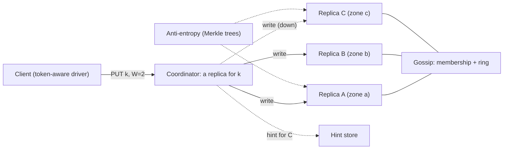

"Design a distributed key-value store" sounds like the most abstract prompt in the set. It is actually the most concrete one, because every other case study in this module is built on top of one. The feed stores timelines in one, the chat system stores messages in one, the rate limiter keeps counters in one. When an interviewer asks for it, they want to know whether you understand what those systems are made of. What happens to a write when one of its three replicas is down? What does a read return when two replicas disagree? How does the system add a node without moving every key? And what does "eventually consistent" cost the application developer who has to live with it?

The reference point is the design Amazon published in its 2007 Dynamo paper, which Cassandra, Riak and ScyllaDB inherited in various forms. The priorities are specific: the store must accept writes even during failures and partitions, because for a shopping cart a rejected "add to cart" is lost revenue, while a cart that briefly shows a removed item is an annoyance. That single product decision drives every mechanism below.

## Requirements

### Functional

- `put(key, value)`, `get(key)` and `delete(key)`. Keys up to 256 bytes; values up to 1 MB, median about 1 KB.
- Consistency is chosen per request: ONE, QUORUM or ALL (equivalently, R and W).
- Optional TTL per key.
- **Out of scope**: range scans and secondary indexes (they need a different partitioning scheme; see the follow-ups), multi-key transactions, and compare-and-set in the base design.

### Non-functional

- **Always writable**: a write succeeds as long as *any* W nodes are reachable, including during an availability-zone outage or a network partition.
- **Latency**: p99 under 10 ms for QUORUM reads and writes within a region.
- **Durability**: an acknowledged write with W=2 survives the permanent loss of any single node.
- **Elastic**: add or remove nodes without downtime, moving only a proportional share of data. Heterogeneous hardware is allowed.
- **Availability**: 99.99%, across three availability zones in a region. Multi-region replication is asynchronous and discussed in the follow-ups.

### Scale

10 billion keys, 1 million operations/s at peak, 80% reads.

## Back-of-envelope estimates

**Data.** $10^{10}$ keys × (1 KB value + about 100 bytes of key and metadata) ≈ 11 TB of logical data. With replication factor 3 that is 33 TB. LSM storage engines temporarily need extra space during compaction, so plan for a space amplification of about 1.5: roughly 50 TB on disk.

**Throughput per replica.** Reads: 800,000/s at QUORUM contact two replicas each, so the replicas together serve 1.6 million reads/s. Writes: 200,000/s go to all three replicas, which is 600,000 replica writes/s. That is 2.2 million replica operations per second in total.

**Node count.** A node with NVMe storage, bloom filters and a warm block cache comfortably serves tens of thousands of point operations per second. Capacity alone would allow 25 nodes at 2 TB each, but that would put roughly 90,000 operations/s on each node, which is too close to the ceiling for a p99 target. Plan for **48 nodes at about 1 TB of data each**, which is about 45,000 operations/s per node. The design sentence: *this cluster is sized by throughput and by recovery time, not by storage*.

**Recovery time.** When a node dies, its 1 TB must be re-replicated from peers. With virtual nodes, the stream comes from dozens of peers, and the binding constraint becomes the throttle you set to protect foreground latency, say 200 MB/s cluster-wide for a single replacement: $10^{12} / 2 \times 10^8 = 5{,}000$ s, about 1.4 hours. For those 1.4 hours the dead node's keys have only two copies. Smaller nodes recover faster, which is a durability argument for more, smaller machines.

**Network.** Writes: $200{,}000 \times 1\ \text{KB} \times 3 = 600$ MB/s. Reads: one full response plus digests, about 1 GB/s. Across 48 nodes that is roughly 35 MB/s, about 0.3 Gbps, per node. Comfortable.

**Ring metadata.** 48 nodes × 256 virtual nodes = 12,288 tokens, a few hundred KB. Every node can hold the whole map and gossip it.

## API design

```text
GET    /kv/{key}?consistency=QUORUM
       -> 200 {"values": [{"value": "<base64>", "context": "<opaque version>"}]}
          (more than one entry means concurrent versions: siblings)

PUT    /kv/{key}?consistency=QUORUM
       {"value": "<base64>", "context": "<context from the last read>", "ttl_s": 86400}
       -> 204

DELETE /kv/{key}?consistency=QUORUM
       {"context": "<context from the last read>"}
       -> 204   (writes a tombstone)
```

Two design choices hide in these three lines. First, the **context** is an opaque version vector returned by `get` and passed back on `put`. It is how the store tells a write that *replaces* what the client read apart from a write that is *concurrent* with something the client never saw. Second, `get` can return **several values**. The store does not pretend to have resolved a conflict that it cannot resolve without knowing the application's semantics. Most production descendants hide both behind last-writer-wins by default, and deep dive 2 is about what that costs.

## Data model

Logically each key maps to a small set of versions:

| Field | Size | Purpose |
|---|---|---|
| key | up to 256 B | Hashed to a ring position |
| value | median 1 KB, cap 1 MB | Opaque bytes |
| version vector | tens of bytes | `[(node, counter), ...]` for conflict detection |
| write timestamp | 8 B | Last-writer-wins tiebreak, TTL |
| tombstone flag | 1 B | A delete is a write |

Keeping several timestamped versions per key and choosing between them is the same idea as the single-node [Time-Based Key-Value Store](/practice/time-based-kv) problem; here the versions live on different machines and the choice is made by the coordinator.

Physically, each node runs a log-structured merge tree ([Storage engine internals](/learn/databases/storage-and-scale/storage-engine-internals)). A write appends to a commit log for durability, updates an in-memory sorted memtable, and is acknowledged. Full memtables flush to immutable sorted files (SSTables), each with a bloom filter and a sparse index. A point read checks the memtable, asks each SSTable's bloom filter whether the key might be there, and usually touches one or two files on disk. Background compaction merges files, drops overwritten versions and eventually drops tombstones. That last step is the source of the subtlest failure mode in this design.

Alongside the data, each node keeps three things: the **ring** (token to node, replicated to every node by gossip), a **hint store** (writes it accepted on behalf of a peer that was down), and **Merkle trees** per token range for repair.

## High-level design



There is no leader and no master. Any node can **coordinate** any request. A token-aware client driver hashes the key itself and sends the request directly to a replica, which saves a hop. The coordinator sends the operation to the key's N replicas in parallel and replies once W (or R) of them have answered. Membership and the ring spread by gossip. Missed writes are repaired by three mechanisms that operate on different timescales: hinted handoff (minutes), read repair (on access) and Merkle-tree anti-entropy (hours to days).

## Deep dives

### 1. Partitioning: consistent hashing with virtual nodes

The naive scheme is `node = hash(key) mod 48`. Add a 49th node and a key stays put only if `hash mod 48 == hash mod 49`, which holds for about 1 key in 49, so **98% of the data moves**. For a 50 TB cluster, that is a rebuild.

**Consistent hashing** puts nodes and keys on the same circle of hash values, and a key belongs to the first node clockwise from it. Adding a node takes over only the arc between it and its predecessor: about $1/49$ of the data, roughly 1 TB. [Partitioning and rebalancing](/learn/system-design/distributed-systems/partitioning-and-rebalancing) derives this in detail.

```viz
{"type": "system", "scenario": "consistent-hashing", "nodes": 4,
 "keys": ["cart:9912", "user:42", "session:7f", "cart:1180", "prefs:42", "user:77"],
 "title": "Keys belong to the first node clockwise",
 "caption": "Adding a node moves only the keys on the arc it takes over. With mod-N placement nearly every key would move. Real rings give each physical node about 256 positions so the arcs even out."}
```

With one token per node, arc lengths are random, and the largest arc is commonly several times the average, so one node holds several times its share. **Virtual nodes** fix this. Each physical node takes many tokens, 256 here, and owns many small arcs. Load then evens out to within a few percent, and three further benefits follow. A bigger machine can take more tokens, so heterogeneous hardware is easy. When a node dies, its load spreads across dozens of peers instead of landing on one unlucky successor. And a replacement streams its data from dozens of peers in parallel, which is what makes the 1.4-hour recovery estimate possible.

The **preference list** for a key is built by walking clockwise from the key's position and collecting the next N *distinct physical nodes in distinct zones*, skipping further tokens of a node already chosen. Zone awareness is what lets the store survive a zone outage with two replicas of every key intact.

The alternatives, and when you would choose them:

| Scheme | Rebalancing | Range scans | Used by |
|---|---|---|---|
| Hash mod N | Moves almost everything | No | Nobody at scale |
| Consistent hashing + vnodes | Moves 1/N, from many peers | No | Dynamo, Cassandra, Riak |
| Fixed partitions (e.g. 4,096) assigned to nodes | Moves whole partitions; the count is fixed up front | No | Redis Cluster (16,384 slots), many managed stores |
| Range partitioning with dynamic splits | Splits and moves hot ranges | Yes | Bigtable, HBase, Spanner, CockroachDB |

Choose consistent hashing here because the workload is point lookups and the requirement is elastic, even load. Choose range partitioning the day someone asks for "all keys with prefix `user:42:`".

### 2. Quorums, sloppy quorums and conflict resolution

With N=3 replicas, a write waits for W acknowledgements and a read for R responses. If $W + R > N$, every read set overlaps every write set in at least one node, so a read sees at least one copy of the latest *completed* write, and the coordinator returns the newest version it received.

```viz
{"type": "system", "scenario": "quorum", "replicas": 3,
 "title": "N=3, W=2, R=2",
 "caption": "The write succeeds with two acks while the slow replica still holds v1. A read of any two replicas must include one that has v2, and read repair then fixes the straggler."}
```

| N, W, R | Guarantee | Cost |
|---|---|---|
| 3, 2, 2 | Reads overlap writes | Default. Tolerates one slow or dead replica on either path |
| 3, 1, 1 | None: a read can miss an acknowledged write | Fastest; for data you can afford to see stale |
| 3, 3, 1 | Reads overlap writes | Fast reads; every write waits for the slowest replica and fails if any is down |
| 3, 1, 3 | Reads overlap writes | Fast, always-available writes; reads wait for the slowest |

Quorums also **cut tail latency**, which is an underrated benefit. A QUORUM write goes to all three replicas and waits for the second-fastest acknowledgement, not the slowest. If each replica independently exceeds 10 ms 1% of the time, the write exceeds 10 ms only when at least two of three do: $3(0.01)^2(0.99) + (0.01)^3 \approx 0.03\%$. The replica's p99 becomes the quorum's p99.97. Reads get most of the same benefit more cheaply: the coordinator asks two replicas and, with **speculative retry**, asks the third only if one of the two has not answered by the p95 latency.

**Sloppy quorums** are how the store stays always-writable. If replica C is down, the coordinator writes to the next healthy node on the ring with a **hint**: "this belongs to C". The hint counts toward W. When gossip reports C alive again, the substitute replays the hint and deletes it. The price is that $W + R > N$ no longer guarantees overlap. During a partition, a write can be acknowledged entirely by substitutes and a read can be answered entirely by the original replicas, which never saw it. "Quorum" in a sloppy system means "W acknowledgements happened", not "a majority of the key's home replicas have it".

**Conflicts** happen whenever two writes to the same key are concurrent, which sloppy quorums make routine. There are three families of resolution:

1. **Last-writer-wins (LWW).** Keep the version with the highest timestamp. It is simple, and it is what Cassandra does per column. Its cost: one of two concurrent writes is silently discarded, and a node whose clock runs 30 seconds fast wins every conflict for 30 seconds, so a later write from a correct clock loses to an earlier one.
2. **Version vectors with siblings.** Each version carries `[(node, counter), ...]`. The Dynamo paper's example goes like this. A cart written through node Sx gets `[Sx:1]`, and an update through Sx gives `[Sx:2]`. Then two clients update concurrently through Sy and Sz, producing `[Sx:2, Sy:1]` and `[Sx:2, Sz:1]`. Neither vector dominates the other, so both versions survive as **siblings**. The next reader receives both, merges them in application code (for a cart, the union of items), and writes `[Sx:3, Sy:1, Sz:1]`, which dominates both. Nothing is silently lost. The cost is that every client must implement a merge, and a union-merge brings deleted items back. The paper also describes truncating the oldest entries once the vector grows past a threshold, which accepts rare false conflicts.
3. **CRDTs.** Counters, sets and maps whose merge is defined mathematically (commutative, associative, idempotent), so the store can merge without asking the application. Riak shipped these as built-in data types. [CRDTs and collaboration](/learn/system-design/distributed-systems/crdts-and-collaboration) covers them.

In practice, choose LWW for data that is written once or owned by one writer (sessions, profiles), and version vectors or CRDTs for data with concurrent writers where losing a write is a bug (carts, counters). Say which keys fall into which bucket.

### 3. Membership, failure detection and repair

**Gossip.** Every second, each node exchanges its view of the cluster (heartbeat counters, token ownership, status) with a random peer. Information reaches all 48 nodes in $O(\log N)$ rounds, a handful of seconds. Rather than a fixed timeout, failure detection uses an accrual detector, which outputs a *suspicion level* based on the observed distribution of heartbeat intervals. The **phi accrual detector** that Cassandra uses is the standard example. [Gossip and anti-entropy](/learn/system-design/distributed-systems/gossip-and-anti-entropy) goes deeper.

There is a crucial distinction here. A node that stops responding is treated as **temporarily unavailable**, so hints accumulate and nothing moves. Permanent removal and replacement are **explicit operator actions**, as the Dynamo paper describes. If gossip alone could remove a node from the ring, a 30-second GC pause would trigger a terabyte of data movement, and a flapping network would do it repeatedly.

**Hinted handoff** covers minutes to hours of downtime. Hints are kept for a bounded window, say three hours. Beyond that, the hint store would grow without bound and the node must be repaired in full instead.

**Read repair** fixes divergence on access: a QUORUM read that sees two versions writes the newest back to the stale replica. It only fixes keys that someone reads.

**Anti-entropy with Merkle trees** fixes everything else. Each replica builds a hash tree over each token range it holds: leaves hash buckets of keys, parents hash their children. Two replicas compare roots. If the roots match, the whole range is identical and nothing else is exchanged. If they differ, the replicas descend only into the mismatched subtrees. Here is the arithmetic. $10^{10}$ keys over 12,288 token ranges is about 800,000 keys per range. A tree with $2^{15} = 32{,}768$ leaves puts about 25 keys under each leaf. If 100 keys in the range differ, at most 100 leaves differ, the replicas walk 15 levels of hashes to find them, and they stream about $100 \times 25 = 2{,}500$ keys instead of 800,000. Repair traffic is proportional to divergence, not to data size. The cost is building the tree, which means reading every key. That is why repair runs as a scheduled, throttled background job.

**The tombstone trap.** A delete is a write of a tombstone. Compaction eventually drops tombstones, after a grace period (`gc_grace_seconds` in Cassandra, 10 days by default). Now suppose replica C was down when the delete happened, never got the hint, and was not repaired within the grace period. A and B compact away the tombstone and the value together. C still holds the old value. The next repair sees that C has a value A and B lack, treats it as a missed write, and **copies the deleted data back to every replica**. The rule that prevents this: *a full repair must complete on every range more often than the tombstone grace period*. Treat a repair schedule that slips as a data-correctness incident, not a maintenance chore.

## Failure modes

**A node crashes.** Writes to its ranges go to substitutes with hints, and QUORUM reads and writes still find two home replicas. Latency is unaffected thanks to the quorum's tail tolerance. If the node does not return, an operator replaces it, and it streams back its terabyte over about 1.4 hours.

**A node is slow, not dead.** This is worse than dead. Gossip says it is up, so it stays in quorums, and every request that needs its answer waits. Two mitigations: **speculative retry**, which sends the read to the third replica if the first two have not answered by the p95 latency, and **latency-aware replica selection**, where coordinators track per-replica latency and prefer the fast ones.

**A zone goes down.** Zone-aware placement leaves two replicas of every key, so QUORUM continues. Hints pile up for a third of all writes: $200{,}000 \times \tfrac{1}{3} \times 1\ \text{KB} \approx 67$ MB/s, or about 720 GB over three hours across the surviving nodes. Bound the hint window. When the zone returns after longer than that, run a full repair of its ranges before trusting its reads at ONE.

**A partition splits the region.** Sloppy quorums let both sides accept writes to the same keys. After the partition heals, the versions are either resolved by LWW (and one side's writes are lost) or returned as siblings. Decide which before the partition happens, per key family.

**A hot key.** A single key taking 100,000 reads/s saturates its three replicas, no matter how many nodes the cluster has. Cache it in the client or in a layer above, allow R=1 for that key family, or split the key into k sub-keys and fan in on read.

**Clock skew under LWW.** A node 30 seconds fast wins every conflict it touches for 30 seconds. Monitor NTP offset as a correctness metric, reject writes whose timestamp is more than a few seconds in the future, or use hybrid logical clocks ([Time and ordering](/learn/system-design/distributed-systems/time-and-ordering)).

**Compaction fills the disk.** Size-tiered compaction can temporarily need as much free space as the files it merges. A node at 80% full cannot compact, its read amplification climbs, and it slows down, which pulls every quorum it serves down with it. Keep nodes below about 50% full. That headroom is part of why the estimate plans for 1.5× space amplification.

## Senior follow-ups

**Q: "With N=3, W=2, R=2, is the store linearizable?"**

No, and there are three reasons to name. Sloppy quorums break the overlap guarantee during failures. Even with strict quorums, a read concurrent with an in-flight write can return the new value from the one replica that has it, and a later read that happens to hit the two replicas that do not have it yet returns the old value, so a reader sees time go backwards. And there is no compare-and-set, so two clients can both read v1 and both write v2 based on it. For linearizable operations you need consensus per key or per range: Cassandra's lightweight transactions run Paxos per partition, and CockroachDB and TiKV run Raft per range. That is several round trips per operation, so offer it per request, not for everything.

**Q: "How does DynamoDB relate to the Dynamo paper?"**

They share a name and the partitioning idea, but the replication model is different. The DynamoDB paper published at USENIX ATC in 2022 describes each partition as a replication group spread across three zones, using Multi-Paxos to elect a leader. The leader accepts writes and serves strongly consistent reads, and eventually consistent reads can go to any replica. There are no client-visible version vectors or siblings, and conditional writes and transactions are supported. The lesson for the interview: the product wanted predictable semantics more than always-writable leaderless replication, and a leader per partition gave it that. The leaderless design survives in Cassandra, ScyllaDB and Riak.

**Q: "A product team needs read-your-writes. What do you offer them?"**

The cheapest correct option is QUORUM writes and QUORUM reads with strict (not sloppy) quorums for that key family, which overlap by construction. The alternative is a session guarantee: the client keeps the version vector from its last write and sends it with the read, and the coordinator waits until R replicas are at least that fresh, or forces a repair read. Routing the session to the same coordinator helps less than it seems, because the coordinator does not store every key. I would not offer ALL, because one slow replica then fails the read.

**Q: "Why not use Raft for everything from the start?"**

It is a legitimate choice, and many modern stores make it. Raft per range gives linearizable reads and writes, compare-and-set, and much simpler reasoning for application developers. The costs: writes go through a leader, which may be in another zone (an extra 1–2 ms), and a leader failure makes the range unwritable for the election timeout, typically a second or more, which violates "always writable". If the requirement is carts and sessions under partitions, leaderless fits. If it is balances and inventory, I would pick Raft per range and give up always-writable, and I would say that is the trade.

**Q: "A node's disk dies. Walk me through replacement, and tell me how long you're exposed."**

The operator starts a replacement node that takes over the dead node's tokens. The new node streams each of its ranges from surviving replicas, which with 256 vnodes means dozens of sources in parallel, throttled to protect foreground latency. At 200 MB/s for 1 TB that is about 1.4 hours, and during that time those keys have two copies. A second failure in the same replica set during the window loses the ability to reach QUORUM for those keys (though not the data, while one copy remains). A third failure loses data. The exposure scales with bytes per node divided by stream rate, which is why I would rather run 48 nodes of 1 TB than 12 nodes of 4 TB.

**Q: "Now they want range scans by key prefix."**

Consistent hashing destroys key order, so a prefix scan would have to ask every node. There are two honest answers. If scans are central to the workload, switch to range partitioning with dynamic splitting and accept that sequential keys create a hot range, which you mitigate by prefixing keys with a hash of the entity ID. If scans only happen within one entity, use a compound key: partition by `user_id` and sort by a clustering column within the partition, which is the Cassandra data model. Scans within a user are then local and ordered. [Wide-column stores](/learn/databases/nosql-and-specialised/wide-column-stores) covers this modelling style.

**Q: "Extend it to three regions."**

Each region runs its own ring with N=3, and writes replicate asynchronously between regions. Clients use local-quorum consistency, so latency stays in-region. Conflicts between regions are resolved by LWW or version vectors, exactly as within a region, only more often and with a replication lag of 100 ms to seconds. A client that fails over to another region may not see its last few writes, so the failover design must decide whether that is acceptable. For a cart it usually is. For anything else, say so explicitly.

## Senior signals

- You derive node count from throughput and **recovery time**, not only from storage, and you can say how long a replica set is exposed after a disk failure.
- You explain why W + R > N gives overlap, why sloppy quorums break it, and why quorums improve tail latency.
- You choose a conflict strategy per key family and can say what LWW silently loses and what union-merge brings back.
- You know that a slow node hurts more than a dead one, and you name speculative retry and latency-aware selection.
- You know the tombstone-resurrection failure and the rule that repair must run more often than the grace period.
- You can say plainly when you would give up always-writable and use consensus per range instead.

## Check yourself

```quiz
- q: >-
    A 48-node cluster places keys with hash(key) mod N. You add a 49th node. Roughly what fraction of keys move, and what would consistent hashing move?
  options: ["About 98% with mod N; about 2% with consistent hashing", "About 98% with mod N; about 50% with consistent hashing", "About 2% with mod N; about 2% with consistent hashing", "About 50% with mod N; about 25% with consistent hashing"]
  answer: 0
  explanation: >-
    A key stays put under mod N only if hash mod 48 equals hash mod 49, which holds for about 1 key in 49, so about 98% move. Consistent hashing moves only the arc the new node takes over from its predecessor, about 1/49 of the data, not half of anything.
- q: >-
    N=3, W=1, R=1. A client writes v2 and receives an acknowledgement, then immediately reads the key. What can it see?
  options: ["Both v1 and v2 as siblings, because the replicas disagree", "Always v2, because the write was acknowledged before the read", "Possibly v1, because the read may hit a replica without v2", "An error, because R + W is not greater than N for this key"]
  answer: 2
  explanation: >-
    With W + R = 2, which is not greater than N = 3, the replica that acknowledged the write and the replica that serves the read need not overlap. An acknowledgement means one replica has v2, not that every replica does. W + R <= N is a legal, fast configuration that simply gives no overlap guarantee; it is not an error.
- q: >-
    During a partition, a write with W=2 is acknowledged by two substitute nodes holding hints, and a read with R=2 is answered by two of the key's home replicas. What is returned?
  options: ["Possibly the old value, because substitutes count toward W", "An error, because hinted replicas cannot be read until handoff", "The new value, because read repair runs before the reply", "The new value, because W + R > N guarantees the sets overlap"]
  answer: 0
  explanation: >-
    Sloppy quorums keep the store writable by accepting writes on any healthy nodes, so the read set and write set need not overlap and W + R > N no longer guarantees anything. The home replicas never saw the write; the hints reach them only when the partition heals.
- q: >-
    A key is deleted while replica C is down. C returns after 12 days without having been repaired, and the tombstone grace period is 10 days. What is the risk?
  options: ["C will reject writes until an operator runs a full repair on it", "Repair treats C's old value as a missed write and resurrects it", "None, because C will receive the tombstone through hinted handoff", "Repair deletes C's data because A and B have no record of the key"]
  answer: 1
  explanation: >-
    Hints expire long before 12 days, and after the grace period A and B have compacted away the tombstone along with the value. Repair cannot tell a deleted value from a missed write, so it copies C's old value back to every replica. Full repair must complete more often than the grace period.
- q: >-
    Each replica's latency independently exceeds 10 ms 1% of the time. A QUORUM write (W=2) is sent to all 3 replicas. Roughly how often does it take longer than 10 ms?
  options: ["About 0.01% of the time", "About 1% of the time", "About 2.97% of the time", "About 0.03% of the time"]
  answer: 3
  explanation: >-
    The write waits for the second-fastest acknowledgement, so it is slow only if at least two of the three replicas are slow: 3 x 0.01^2 x 0.99 + 0.01^3 is about 0.0003. 2.97% is the chance that any one replica is slow, which would matter only if the write waited for all three; 0.01% forgets that any of three pairs can be the slow two. Quorums hide a single slow replica.
- q: >-
    The store uses last-writer-wins. One node's clock drifts 30 seconds fast. What goes wrong?
  options: ["Reads return both versions as siblings for the client to merge", "Its writes are rejected as far-future until the clock is corrected", "Its writes get future timestamps and beat later writes for about 30 s", "Nothing, because LWW orders writes by arrival order at the coordinator"]
  answer: 2
  explanation: >-
    LWW trusts timestamps, so writes coordinated by the fast node beat genuinely later writes from other nodes for about 30 seconds, which silently discards them. Rejecting far-future timestamps is a mitigation you have to add, alongside monitoring clock offset or using hybrid logical clocks. Siblings only appear with version vectors, not LWW.
```
