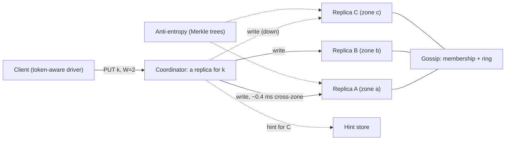

"Design a distributed key-value store" sounds like the most abstract prompt in the set. It is the most concrete, because every other case study in this module is built on one: the feed stores timelines in one, the chat system messages, the rate limiter counters. The interviewer wants to know whether you understand what those systems are made of. What happens to a write when one of its three replicas is down? What does a read return when replicas disagree? How do you add a node without moving every key? What does "eventually consistent" cost the developer who lives with it?

The reference point is the design Amazon published in its 2007 Dynamo paper, which Cassandra, Riak and ScyllaDB inherited in various forms. Its priority is specific: accept writes even during failures and partitions, because a rejected "add to cart" is lost revenue while a cart that briefly shows a removed item is an annoyance. That one product decision drives every mechanism below.

## Requirements

### Functional

- `put(key, value)`, `get(key)`, `delete(key)`; keys up to 256 bytes; values up to 1 MB, median about 1 KB; optional TTL.
- Consistency chosen per request: ONE, QUORUM or ALL (equivalently R and W).
- **Out of scope**: range scans and secondary indexes (a different partitioning scheme, see follow-ups), multi-key transactions, compare-and-set.

### Non-functional

- **Always writable**: a write succeeds while any W nodes are reachable, including during a zone outage or partition.
- **Latency**: p99 under 10 ms for QUORUM reads and writes within a region.
- **Durability**: an acknowledged W=2 write survives the permanent loss of any single node.
- **Elastic**: add or remove nodes without downtime, moving only a proportional share of data; heterogeneous hardware allowed.
- **Availability**: 99.99% across three zones in one region; multi-region is asynchronous (see evolution).

### Scale

10 billion keys, 1 million operations a second at peak, 80% reads.

## Back-of-envelope estimates

| Quantity | Arithmetic | Result |
|---|---|---|
| Logical data | $10^{10}$ × (1 KB value + ~100 B key and metadata) | 11 TB |
| On disk | 11 TB × 3 replicas × 1.5 (LSM space amplification during compaction) | ~50 TB |
| Replica reads | 800,000 reads/s × 2 replicas at QUORUM | 1.6 million/s |
| Replica writes | 200,000 writes/s × 3 replicas | 600,000/s |
| Per node, 48 nodes | 2.2 million ÷ 48 | ~46,000 replica ops/s; ~1 TB of data |
| Network | Writes 600 MB/s; reads ~1 GB/s (one full response plus digests) | ~35 MB/s, 0.3 Gbit/s per node |
| Bloom filters | $3 \times 10^{10}$ replica keys ÷ 48 × 10 bits | ~780 MB of RAM per node |
| Ring metadata | 48 nodes × 16 tokens (deep dive 1 explains why not 256) | 768 tokens, tens of KB, held by every node |
| Node recovery | 1 TB ÷ 200 MB/s streaming throttle | 5,000 s, about 1.4 hours with two copies |

**Machine count.** An NVMe node with bloom filters and a warm block cache serves tens of thousands of point operations a second; how many depends on value size, cache hit ratio and compaction load. Storage alone would allow 25 nodes of 2 TB, but that puts ~90,000 replica operations a second on each, too close to the ceiling for a 10 ms p99. So: **48 nodes, 16 per zone, ~1 TB of data each on 4 TB of NVMe** (under 50% full, because compaction needs free space), 64 GB of RAM for bloom filters, indexes and cache.

The design sentence: **this cluster is sized by throughput and by recovery time, not by storage.** A 4 TB node would take 5.6 hours to re-replicate, and every hour with two copies is exposure.

## API design

```text
GET    /kv/{key}?consistency=QUORUM
       -> 200 {"values": [{"value": "<base64>", "context": "<opaque version>"}]}
          (more than one entry means concurrent versions: siblings)

PUT    /kv/{key}?consistency=QUORUM
       {"value": "<base64>", "context": "<context from the last read>", "ttl_s": 86400}
       -> 204

DELETE /kv/{key}?consistency=QUORUM
       {"context": "<context from the last read>"}
       -> 204   (writes a tombstone)
```

Two decisions hide in these lines. The **context** is an opaque version vector returned by `get` and passed back on `put`; it is how the store tells a write that *replaces* what the client read from one *concurrent* with something the client never saw. And `get` can return **several values**: the store does not pretend to resolve a conflict it cannot resolve without the application's semantics. Most descendants hide both behind last-writer-wins; deep dive 2 is what that costs.

## Data model

| Field | Size | Purpose |
|---|---|---|
| key | up to 256 B | Hashed (Murmur3 in Cassandra, MD5 in the Dynamo paper) to a 64- or 128-bit ring position |
| value | median 1 KB, cap 1 MB | Opaque bytes |
| version vector | tens of bytes | `[(node, counter), ...]` for conflict detection |
| write timestamp | 8 B | Last-writer-wins tiebreak, TTL |
| tombstone flag | 1 B | A delete is a write |

The partition key is the hash of the whole key and there is no sort key: every request is a point lookup, and hashing gives even load at the price of key order. Keeping several versions per key and choosing between them is the single-node [Time-Based Key-Value Store](/practice/time-based-kv) problem with the versions spread across machines.

**Under the hood**, each node runs a log-structured merge tree ([Storage engine internals](/learn/databases/storage-and-scale/storage-engine-internals)). A write appends to a commit log, inserts into an in-memory sorted memtable, and is acknowledged; full memtables flush to immutable sorted SSTables, each with a bloom filter and a sparse index. A point read checks the memtable, then asks each SSTable's bloom filter. At 10 bits per key with 7 hash functions the false-positive rate is $(1 - e^{-7/10})^7 \approx 0.8\%$, so a read that consults six SSTables wastes a disk read about 5% of the time. Cassandra's default commit-log mode syncs to disk every 10 seconds rather than per write, so an acknowledged write's durability comes from being on two machines in two zones, not from `fsync`; the `batch` mode fsyncs before acknowledging at a latency cost.

```viz
{"type": "system", "scenario": "lsm-tree", "log": "Commit log", "grace": "gc_grace_seconds, 10 days by default",
 "title": "The write path on each replica",
 "caption": "Writes land in the commit log and the memtable; full memtables flush to immutable SSTables that compaction later merges, dropping overwritten versions and, after the grace period, tombstones."}
```

Alongside the data, each node keeps the **ring** (token to node, spread by gossip), a **hint store** (writes held for a peer that was down), and **Merkle trees** per token range for repair.

## High-level design



No leader, no master: any node coordinates any request, and a token-aware driver sends it straight to a replica, saving a hop. The coordinator sends to the key's N replicas in parallel and replies after W (or R) answer. Missed writes are repaired on three timescales: hinted handoff (minutes), read repair (on access), Merkle-tree anti-entropy (hours to days).

## Deep dive 1: partitioning with consistent hashing

`node = hash(key) mod 48` keeps a key in place when a 49th node joins only if `hash mod 48 == hash mod 49`, about 1 key in 49, so **98% of the data moves**. **Consistent hashing** puts nodes and keys on one circle; a key belongs to the first node clockwise, and a new node takes over one arc, about $1/49$ of the data ([Partitioning and rebalancing](/learn/system-design/distributed-systems/partitioning-and-rebalancing) derives it).

```viz
{"type": "system", "scenario": "consistent-hashing", "nodes": 4,
 "keys": ["cart:9912", "user:42", "session:7f", "cart:1180", "prefs:42", "user:77"],
 "title": "Keys belong to the first node clockwise",
 "caption": "Adding a node moves only the keys on the arc it takes over. With mod-N placement nearly every key would move. Real rings give each physical node many positions so the arcs even out."}
```

With one token per node, arcs are random and the largest is commonly several times the average. **Virtual nodes** give each machine many tokens and many small arcs, so load evens out to within a few percent, a bigger machine takes more tokens, a dead node's load spreads over dozens of peers, and a replacement streams from dozens of peers in parallel, which is what makes the 1.4-hour recovery possible. The **preference list** walks clockwise from the key and collects the next N *distinct physical nodes in distinct zones*, skipping further tokens of a chosen node; that is what lets the store lose a zone and keep two copies of every key.

### How many tokens per node?

More tokens are not free. With zone-aware placement, two nodes failing in different zones take a range below quorum if they share any replica set. Simulated with random tokens:

| Cluster | Tokens per node | Cross-zone node pairs that share a range |
|---|---|---|
| 48 nodes | 4 | 39% |
| 48 nodes | 16 | 87% |
| 48 nodes | 256 | 100% |
| 480 nodes | 16 | 18% |
| 480 nodes | 256 | 99% |

With 256 tokens, *any* two failures in different zones leave some keys unable to reach QUORUM (no data is lost while one copy remains). This is why Cassandra 4.0 lowered its default from 256 tokens to 16 and turned on by default an allocation algorithm that keeps a few tokens balanced.

| Scheme | Rebalancing | Range scans | Used by |
|---|---|---|---|
| Hash mod N | Moves almost everything | No | Nobody at scale |
| Consistent hashing + vnodes | Moves 1/N, from many peers | No | Dynamo, Cassandra, Riak |
| Fixed partitions assigned to nodes | Moves whole partitions; count fixed up front | No | Redis Cluster (16,384 slots) |
| Range partitioning with dynamic splits | Splits and moves hot ranges | Yes | Bigtable, HBase, Spanner, CockroachDB |

## Deep dive 2: quorums and sloppy quorums, traced

With N=3, a write waits for W acknowledgements and a read for R responses. If $W + R > N$, every read set overlaps every write set in at least one node, so a read sees the latest *completed* write.

```viz
{"type": "system", "scenario": "quorum", "replicas": 3,
 "title": "N=3, W=2, R=2",
 "caption": "The write succeeds with two acks while the slow replica still holds v1. A read of any two replicas must include one that has v2, and read repair then fixes the straggler."}
```

| N, W, R | Guarantee | Cost |
|---|---|---|
| 3, 2, 2 | Reads overlap writes | Default; tolerates one slow or dead replica on either path |
| 3, 1, 1 | None | Fastest; for data you can afford to see stale |
| 3, 3, 1 | Reads overlap writes | Every write waits for the slowest replica and fails if one is down |
| 3, 1, 3 | Reads overlap writes | Always-available writes; reads wait for the slowest |

Quorums **cut tail latency**. A QUORUM write waits for the second-fastest of three acknowledgements; if each replica independently exceeds 10 ms 1% of the time, the write does so only when two or three are slow: $3(0.01)^2(0.99) + (0.01)^3 \approx 0.03\%$. Reads get most of the benefit with **speculative retry**: ask two replicas and the third only if one has not answered by the p95.

### A write with one replica down, traced

Client and coordinator A in zone a; B in zone b; C in zone c has been down 40 minutes, so gossip's phi accrual detector marks it. Same-zone round trip ~0.2 ms, cross-zone ~0.8 ms (typical within one cloud region).

| t (ms) | Where | Action |
|---|---|---|
| 0.0 | Driver | Hash the key; preference list [A, B, C]; send to A |
| 0.1 | A | Commit-log append (buffered) and memtable insert, ~20 µs; send to B; C is down, so send to D, the next zone-c node on the ring, with a hint "for C" |
| 0.5 | B | Append and insert; acknowledge |
| 0.9 | A | Two acknowledgements (A, B): W=2 met; reply |
| 1.0 | Client | 204 |
| ~1.0 | D | Stores the hint; its acknowledgement is not needed |
| +40 min | D | Gossip reports C alive within seconds; D replays hints to C, throttled |

This is the Dynamo paper's **sloppy quorum**: the substitute's acknowledgement counts toward W, so the store stays writable, and $W + R > N$ no longer guarantees overlap. During a partition, substitutes can acknowledge a write that a read of the home replicas never sees. Cassandra differs in a detail worth knowing: hints stay on the coordinator and do not count toward the consistency level (except the special level `ANY`).

### A read that finds a stale replica, traced

C is back but its hints have not replayed. A QUORUM read reaches A (data) and C (digest):

| t (ms) | Where | Action |
|---|---|---|
| 0.1 | A | Local read: memtable miss, bloom filters point at one SSTable, one 4 KB NVMe read, ~0.1 ms |
| 0.9 | A | C's digest arrives and does not match A's data |
| 0.9–1.7 | A → C | Full data read from C: v1 at timestamp 100; A holds v2 at 140 |
| 1.7–2.5 | A → C | Blocking read repair: write v2 to C and wait, so a later QUORUM read cannot go backwards |
| 2.6 | Client | v2 |

One digest mismatch roughly triples this read's latency, which is why p99 rises for hours after a node returns until hints and repair catch up.

## Deep dive 3: conflicts, membership and repair

### Resolving concurrent writes

1. **Last-writer-wins.** Keep the highest timestamp, as Cassandra does per column. One of two concurrent writes is silently discarded, and a node whose clock runs 30 s fast wins every conflict for 30 s.
2. **Version vectors with siblings.** The Dynamo paper's example: a cart written through Sx gets `[Sx:1]`, then `[Sx:2]`; two concurrent updates through Sy and Sz give `[Sx:2, Sy:1]` and `[Sx:2, Sz:1]`. Neither dominates, so both survive as siblings; the next reader merges them (for a cart, the union) and writes `[Sx:3, Sy:1, Sz:1]`. Nothing is lost, every client needs a merge, and a union brings deleted items back.
3. **CRDTs.** Counters, sets and maps with a mathematically defined merge, so the store merges without the application ([CRDTs and collaboration](/learn/system-design/distributed-systems/crdts-and-collaboration)).

Choose LWW for data written once or by one owner (sessions, profiles), vectors or CRDTs where losing a write is a bug (carts, counters), and say which keys are which.

### Membership and repair

Every second each node gossips its view (heartbeats, tokens, status) with a random peer, reaching all 48 nodes in $O(\log N)$ rounds. A silent node is **temporarily unavailable**: hints accumulate and nothing moves. Removal is an **explicit operator action**, because a gossip-driven removal would turn a 30-second GC pause into a terabyte of data movement ([Gossip and anti-entropy](/learn/system-design/distributed-systems/gossip-and-anti-entropy)).

```viz
{"type": "system", "scenario": "gossip", "mode": "push-pull",
 "title": "Membership spreads by gossip",
 "caption": "Each round, every node exchanges its view with a random peer. News of a node's status reaches the whole cluster in a logarithmic number of rounds without any coordinator."}
```

**Anti-entropy with Merkle trees** fixes what hints and read repair miss. Each replica hashes each token range into a tree; replicas compare roots and descend only into mismatched subtrees. $10^{10}$ keys over 768 ranges is ~13 million keys a range; a $2^{15}$-leaf tree puts ~400 keys under a leaf. If 100 keys differ, the replicas walk 15 levels and stream at most about 40,000 keys instead of 13 million: repair traffic scales with divergence, but building the tree reads every key, so repair is a scheduled, throttled job.

**The tombstone trap.** A delete writes a tombstone that compaction drops after a grace period (`gc_grace_seconds`, 10 days by default in Cassandra). If replica C missed the delete and is not repaired within the grace period, A and B compact away both tombstone and value, C still holds the value, and the next repair treats it as a missed write and **copies the deleted data back everywhere**. Rule: a full repair must complete on every range more often than the grace period, and a slipping repair schedule is a correctness incident.

## Failure modes

| Failure | Symptom | Diagnosis | Fix |
|---|---|---|---|
| Slow node (worse than dead) | p99 of every range it serves rises; gossip says it is up | Per-replica latency on coordinators; GC or compaction logs on that node | Speculative retry at the p95; latency-aware replica selection |
| Zone outage, then hint flood | Every key has one replica in the lost zone, so hints grow at 200 MB/s (200,000 writes/s × 1 KB): ~2.2 TB by the end of a 3-hour hint window (Cassandra's default `max_hint_window`), ~135 GB for each of the 16 returning nodes; unthrottled replay saturates them | Hint-store size; returning nodes' disk and CPU pinned | Bound the hint window; throttle replay (135 GB at 20 MB/s per returning node takes about 2 hours); past the window, full repair before trusting reads at ONE |
| Hot key | Three replicas saturated at 100,000 reads/s while the cluster idles | Per-partition read metrics; one key's replicas far above peers | Cache above the store with request coalescing; split into k sub-keys and fan in on read |
| Partition within the region | Both sides accept writes to the same keys | Gossip shows two views; conflicting versions after healing | Decide per key family beforehand: LWW (one side loses) or siblings |
| Retried non-idempotent write | Counters double after timeouts | Client retries a write that had succeeded but timed out | Idempotent writes (set, not increment) or CRDT counters with per-writer entries |
| Clock skew under LWW | Recent writes vanish, clustered on one coordinator | NTP offset on that node | Reject timestamps more than a few seconds in the future; alert on clock offset; hybrid logical clocks ([Time and ordering](/learn/system-design/distributed-systems/time-and-ordering)) |
| Compaction fills the disk | Read amplification climbs, node slows, drags its quorums | Disk above ~80%; pending compactions rising | Keep nodes under ~50% full |
| Region loss | All in-region reads and writes fail | Health checks | Asynchronous replica rings in other regions; clients may lose their last writes on failover, so say which data tolerates that |

## Trade-offs: what was rejected

| Decision | Chosen | Rejected | Why rejected here | What would flip it |
|---|---|---|---|---|
| Replication | Leaderless, sloppy quorums | Raft or Multi-Paxos per range | A leader election makes a range unwritable for a second or more; always-writable is the requirement | Balances or inventory: pick consensus |
| Partitioning | Consistent hashing, 16 tokens a node | Range partitioning; 256 tokens | No scans needed; 256 tokens make every double failure a quorum loss | Prefix scans become central |
| Conflicts | Per key family: LWW or vectors | LWW everywhere | Silently drops concurrent cart updates | Single-writer data only |
| Storage engine | LSM tree | B-tree | Writes are 20% of a million a second; appends beat in-place updates | Read-dominated, update-in-place data |
| Node size | 48 × 1 TB | 12 × 4 TB | 5.6 hours of two-copy exposure per failure | – |

## Evolution at 10× and 100×

**10× (100 billion keys, 10 million operations a second).** 480 nodes at the same per-node load and 500 TB on disk. Gossip still converges in seconds, but tokens per node now decide availability: with 256 a random double failure breaks some quorum 99% of the time, with 16 only 18%. Repair becomes the scarce resource: a full repair of 10× the data must still finish inside the 10-day grace period, so incremental repair (only data written since the last repair) becomes mandatory.

**100× (a trillion keys, 100 million operations a second).** About 4,800 nodes. One ring that size makes every topology change a cluster-wide event, so split into independent cells of a few hundred nodes, each its own ring, with a thin routing layer mapping key ranges to cells. Multi-region is the default: a local ring per region with asynchronous replication, clients at LOCAL_QUORUM, and conflicts resolved exactly as within a region, only more often.

## What real companies describe

- Amazon's [Dynamo paper](https://www.allthingsdistributed.com/files/amazon-dynamo-sosp2007.pdf) (SOSP 2007) describes the shopping cart, sloppy quorums, hinted handoff, vector clocks with sibling merges, Merkle-tree anti-entropy, and a common configuration of N=3, R=2, W=2.
- Amazon's [DynamoDB paper](https://www.usenix.org/system/files/atc22-elhemali.pdf) (USENIX ATC 2022) describes a different design under a similar name: each partition is a Multi-Paxos replication group across three zones with a leader that takes writes and strongly consistent reads, no client-visible siblings, and conditional writes. The product valued predictable semantics over leaderless availability.
- Netflix published a [2011 benchmark](https://web.archive.org/web/2012id_/http://techblog.netflix.com/2011/11/benchmarking-cassandra-scalability-on.html) of Cassandra on AWS reaching 1.1 million client writes a second on 288 instances, 96 in each of three availability zones, and has written extensively about running Cassandra across regions.
- Discord's engineering blog [described](https://discord.com/blog/how-discord-stores-trillions-of-messages) moving its message store from Cassandra to ScyllaDB, citing hot partitions and garbage-collection pauses, and adding a Rust data-service layer that coalesces concurrent reads of the same channel into one database query.
- Riak added a CRDT counter in 1.4 and, in 2.0, sets and maps as built-in data types (per its 2.0 release notes).

## Interviewer follow-ups

**"With N=3, W=2, R=2, is the store linearizable?"** Model answer: no. Sloppy quorums break the overlap during failures; a read concurrent with an in-flight write can see the new value on one replica while a later read of the other two sees the old one; and there is no compare-and-set. Linearizable operations need consensus per key or range: Cassandra's lightweight transactions run Paxos per partition; CockroachDB and TiKV run Raft per range. Common wrong answer: "yes, because W + R > N".

**"A product team needs read-your-writes. What do you offer?"** Model answer: strict (not sloppy) QUORUM writes and reads for that key family, which overlap by construction; or a session token carrying the client's last write version, with the coordinator waiting until R replicas are that fresh. Common wrong answer: ALL, which fails the read whenever one replica is slow.

**"Why not Raft for everything?"** Model answer: legitimate, and many modern stores do. Raft per range gives linearizable reads and writes and compare-and-set. The costs: writes go through a leader possibly in another zone (1–2 ms), and a leader failure makes the range unwritable for the election timeout, a second or more, which violates always-writable. Carts and sessions under partitions: leaderless. Balances and inventory: Raft, and say that is the trade. Common wrong answer: "Raft doesn't scale", when it scales by running one group per range.

**"A disk dies. How long are you exposed?"** Model answer: the replacement takes the dead node's tokens and streams each range from surviving replicas, throttled: 1 TB at 200 MB/s is 1.4 hours with two copies. A second failure in the same replica set loses QUORUM for those keys; a third loses data. Exposure is bytes per node ÷ stream rate, which is why 48 nodes of 1 TB beat 12 of 4 TB. Common wrong answer: "no exposure, there are three replicas".

**"Now they want range scans by key prefix."** Model answer: hashing destroys key order, so a prefix scan asks every node. If scans are central, switch to range partitioning with dynamic splits and prefix keys with a hash of the entity to avoid a hot tail range. If scans stay within an entity, use a compound key: partition by `user_id`, sort by a clustering column ([Wide-column stores](/learn/databases/nosql-and-specialised/wide-column-stores)). Common wrong answer: "add a secondary index", which on a hash-partitioned store is a scatter-gather to all 48 nodes.

## What mid-level engineers get wrong

- Sizing the cluster from storage alone, then missing the p99 because every node runs near its operations ceiling.
- Claiming W + R > N makes the store linearizable, or forgetting that sloppy quorums void the overlap.
- Last-writer-wins on data with concurrent writers, silently dropping cart updates.
- Letting failure detection remove nodes automatically, so a GC pause moves a terabyte.
- Letting repair slip past the tombstone grace period and resurrecting deleted data.
- Maximising vnodes "for balance" without noticing that every double failure then loses a quorum somewhere.
- Filling nodes to 80% and leaving compaction no room.

## Exercise

```exercise
id: ring-preference-lists
title: Build zone-aware preference lists on a token ring
prompt: |
  Implement `preference_lists(tokens, zones, keys, n)`.

  - `tokens` is a list of `[position, node]` pairs with distinct integer
    positions, in any order. A node may own several tokens (virtual nodes).
  - `zones` maps each node name to its zone.
  - `keys` is a list of integer key positions on the same ring.

  For each key position `p`, start at the token with the smallest position
  greater than or equal to `p`, wrapping to the smallest position overall if
  there is none. Walk clockwise through the tokens in position order, at most
  one full lap. Add a token's node to the list only if that node is not
  already in the list and no node from the same zone is already in it. Stop
  when the list has `n` nodes or the lap ends.

  Return one list of node names per key, in the order the keys were given.
languages: [python, javascript]
entry: preference_lists
starter:
  python: |
    def preference_lists(tokens, zones, keys, n):
        # your code here
        return []
  javascript: |
    function preference_lists(tokens, zones, keys, n) {
      // your code here
      return [];
    }
tests:
  - args: [[[10, "A"], [20, "B"], [30, "C"], [40, "D"]], {"A": "a", "B": "b", "C": "c", "D": "a"}, [15], 3]
    expected: [["B", "C", "D"]]
  - args: [[[10, "A"], [20, "B"], [30, "C"], [40, "D"]], {"A": "a", "B": "b", "C": "c", "D": "a"}, [45], 3]
    expected: [["A", "B", "C"]]
    label: wraps past the highest token
  - args: [[[10, "A"], [20, "B"], [30, "C"], [40, "D"]], {"A": "a", "B": "b", "C": "c", "D": "a"}, [30], 3]
    expected: [["C", "D", "B"]]
    label: a key on a token belongs to it; the second zone-a node is skipped
  - args: [[[15, "B"], [5, "A"], [20, "C"], [10, "A"]], {"A": "a", "B": "b", "C": "c"}, [0, 12], 3]
    expected: [["A", "B", "C"], ["B", "C", "A"]]
    label: unsorted tokens and repeated virtual nodes
  - args: [[[5, "A"], [10, "B"], [15, "C"]], {"A": "a", "B": "b", "C": "a"}, [1], 3]
    expected: [["A", "B"]]
    label: fewer zones than replicas
  - args: [[[5, "A"]], {"A": "a"}, [], 3]
    expected: []
    label: no keys
  - args: [[[100, "n1"], [220, "n2"], [340, "n3"], [460, "n4"], [580, "n5"], [700, "n6"], [820, "n1"], [940, "n4"]], {"n1": "a", "n2": "b", "n3": "c", "n4": "a", "n5": "b", "n6": "c"}, [0, 450, 800, 999], 3]
    expected: [["n1", "n2", "n3"], ["n4", "n5", "n6"], ["n1", "n2", "n3"], ["n1", "n2", "n3"]]
    hidden: true
  - args: [[[100, "n1"], [220, "n2"], [340, "n3"], [460, "n4"], [580, "n5"], [700, "n6"], [820, "n1"], [940, "n4"]], {"n1": "a", "n2": "b", "n3": "c", "n4": "a", "n5": "b", "n6": "c"}, [650, 900], 2]
    expected: [["n6", "n1"], ["n4", "n2"]]
    hidden: true
hints:
  - "Sort the tokens by position once, then find each key's starting index (a binary search, or a linear scan for small rings)."
  - "Walk at most len(tokens) steps with index (start + i) % len(tokens), tracking chosen nodes and used zones in sets."
```

## Senior signals

- You derive node count from throughput and **recovery time**, and can say how long a replica set is exposed after a disk failure.
- You explain why W + R > N gives overlap, why sloppy quorums break it, and why quorums improve tail latency.
- You trace a read that hits a stale replica and know read repair costs that read its latency.
- You choose a conflict strategy per key family and can say what LWW silently loses and what union-merge brings back.
- You know that a slow node hurts more than a dead one, that repair must beat the tombstone grace period, and that more vnodes make double failures worse.
- You can say plainly when you would give up always-writable and use consensus per range.

## Check yourself

```quiz
- q: >-
    A 48-node cluster places keys with hash(key) mod N. You add a 49th node. Roughly what fraction of keys move, and what would consistent hashing move?
  options: ["About 98% with mod N; about 2% with consistent hashing", "About 98% with mod N; about 50% with consistent hashing", "About 2% with mod N; about 2% with consistent hashing", "About 50% with mod N; about 25% with consistent hashing"]
  answer: 0
  explanation: >-
    A key stays put under mod N only if hash mod 48 equals hash mod 49, which holds for about 1 key in 49, so about 98% move. Consistent hashing moves only the arc the new node takes over, about 1/49 of the data, not half of anything.
- q: >-
    N=3, W=1, R=1. A client writes v2 and receives an acknowledgement, then immediately reads the key. What can it see?
  options: ["Both v1 and v2 as siblings, because the replicas disagree", "Always v2, because the write was acknowledged before the read", "Possibly v1, because the read may hit a replica without v2", "An error, because R + W is not greater than N for this key"]
  answer: 2
  explanation: >-
    With W + R = 2, not greater than N = 3, the replica that acknowledged the write and the one that serves the read need not overlap. An acknowledgement means one replica has v2. W + R <= N is a legal, fast configuration with no overlap guarantee, not an error.
- q: >-
    During a partition, a write with W=2 is acknowledged by two substitute nodes holding hints, and a read with R=2 is answered by two of the key's home replicas. What is returned?
  options: ["Possibly the old value, because substitutes count toward W", "An error, because hinted replicas cannot be read until handoff", "The new value, because read repair runs before the reply", "The new value, because W + R > N guarantees the sets overlap"]
  answer: 0
  explanation: >-
    Sloppy quorums keep the store writable by accepting writes on any healthy nodes, so the read and write sets need not overlap and W + R > N no longer guarantees anything. The home replicas never saw the write; the hints reach them only when the partition heals.
- q: >-
    A key is deleted while replica C is down. C returns after 12 days without having been repaired, and the tombstone grace period is 10 days. What is the risk?
  options: ["C will reject writes until an operator runs a full repair on it", "Repair treats C's old value as a missed write and resurrects it", "None, because C will receive the tombstone through hinted handoff", "Repair deletes C's data because A and B have no record of the key"]
  answer: 1
  explanation: >-
    Hints expire long before 12 days, and after the grace period A and B have compacted away the tombstone along with the value. Repair cannot tell a deleted value from a missed write, so it copies C's old value back to every replica. Full repair must complete more often than the grace period.
- q: >-
    A QUORUM read finds that one replica's digest does not match the coordinator's data. What happens before the client gets its answer?
  options: ["The coordinator fetches full data, writes the newest back, then replies", "The read fails, and the driver retries it on a different coordinator node", "The client receives both versions and must merge them itself", "The coordinator returns its own value at once and repairs later"]
  answer: 0
  explanation: >-
    On a digest mismatch the coordinator reads full data from the replicas, picks the newest version and, with blocking read repair, writes it to the stale replica before replying, so a later QUORUM read cannot return the older value. That costs extra round trips, roughly tripling the read's latency in the trace. Returning siblings to the client happens only with version vectors, and LWW data has one winner.
- q: >-
    A 48-node, three-zone cluster uses 256 tokens per node. Two nodes in different zones fail at the same time. What happens?
  options: ["Almost surely some key range loses QUORUM, since the pair shares a range", "Nothing, because zone-aware placement always leaves two replicas of each key", "Only the keys on the two nodes' primary arcs lose QUORUM, about 4% of data", "Data is lost for the keys whose replicas were on both of the failed nodes"]
  answer: 0
  explanation: >-
    With 256 tokens each, every cross-zone pair of nodes shares at least one replica set (100% in the simulation), and that range is left with one replica, below a QUORUM of two. No data is lost while one copy remains. Zone-aware placement protects against losing one zone, not two nodes in two zones. Fewer tokens per node make this far less likely, which is why Cassandra 4.0 lowered the default to 16.
```
