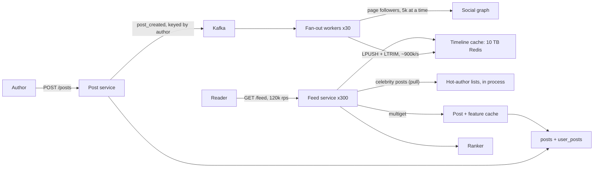

Every social product has the same screen: recent posts from the people you follow. It looks like a query, `SELECT posts WHERE author IN (my followees) ORDER BY time DESC LIMIT 20`, and at small scale it is one. At 120,000 feed loads a second with 300 followees each, it is 36 million index lookups a second plus a merge. The design problem is where to move that work, and the answer differs for an account with 200 followers and one with 100 million.

[Back-of-envelope estimation](/learn/system-design/building-blocks/back-of-envelope-estimation) derives the hybrid fan-out model in a few paragraphs. This case study takes it to the senior bar: where exactly the celebrity threshold is and why, what the timeline cache holds and costs, how ranking, deletes, blocks and pagination work without rewriting 100 million timelines, and how the feed degrades when fan-out is ten minutes behind.

## Requirements

### Functional

- **Post**: text up to 2,000 characters plus references to uploaded media ([Video upload pipeline](/learn/system-design/case-studies/video-upload-pipeline) covers media).
- **Follow and unfollow**: a directed graph, no approval step.
- **Home feed**: posts from followed accounts, reverse-chronological with light ranking, infinite scroll, an "N new posts" indicator.
- **Your own post** appears in your own feed immediately; **deletes, blocks and mutes** take effect on the next load.
- **Out of scope**: search, notifications ([Notification system](/learn/system-design/case-studies/notification-system)), ads, the ranking model's internals.

### Non-functional

- **Feed load**: p99 under 200 ms server-side.
- **Fan-out lag**: p99 under 5 s from post to followers' feeds for ordinary accounts.
- **Availability**: 99.95% for feed reads; a slightly stale feed is acceptable, an empty one is not.
- **Correctness**: never show a deleted post or a blocked author.

### Scale

500 million monthly users, 200 million daily. A daily user posts 0.5 times and loads the feed 20 times a day and follows 300 accounts on average; about half of followers are active on a given day; the largest account has 100 million followers.

## Back-of-envelope estimates

| Quantity | Arithmetic | Result |
|---|---|---|
| Posts | $2 \times 10^8 \times 0.5$ a day | $10^8$/day: 1,000/s average, 3,000/s peak |
| Feed loads | $2 \times 10^8 \times 20$ a day | $4 \times 10^9$/day: 40,000/s average, 120,000/s peak |
| Pure pull | 120,000 × 300 followee lookups | $3.6 \times 10^7$/s before merging: out |
| Push inserts | 3,000 posts/s × ~600 followers per pushed post (simulated below, not 300) × 50% active | ~900,000 timeline inserts/s at peak |
| One 100M-follower post, pushed | $10^8$ ÷ 900,000/s | 111 s of the entire fleet |
| Timeline cache | $2 \times 10^8$ daily users × 800 entries × 20 B (post ID, author ID, flags) | 3.2 TB raw, ~5 TB with Redis overhead, 10 TB with a replica |
| Post storage | $10^8$ × 1 KB a day | 100 GB/day; 110 TB/year with three replicas |
| Candidate features | 120,000 loads × 300 candidates | 36 million key lookups/s, batched |
| Egress | 120,000 × 30 KB of JSON | 3.6 GB/s, ~29 Gbit/s before media (CDN) |
| Social graph | $5 \times 10^8$ users × 300 follows = $1.5 \times 10^{11}$ edges, stored in both directions at ~16 B | 4.8 TB raw; ~22 TB with LSM overhead (×1.5) and three replicas |

| Tier | Sizing | Count |
|---|---|---|
| Timeline cache | 10 TB ÷ ~60 GB usable per node; throughput is only ~11,000 commands/s per node (900,000 × `LPUSH` + `LTRIM` ÷ 160) | ~160 nodes |
| Post and feature cache | Hot posts (two days, ~200 GB) fit easily; 36 million keys/s ÷ roughly a million keys/s per node with batched multi-gets | ~40–50 nodes |
| Feed service | 120,000 pages/s × ~5 ms of CPU (merge, filter, serialise) = 600 cores; ×2 for 50% utilisation | ~300 instances of 4 vCPU |
| Fan-out workers | 900,000 inserts/s ÷ a few tens of thousands per worker (graph page reads, pipelined Redis writes) | ~30 |
| Kafka | 3,000 events/s × ~1 KB | 3 brokers; the event rate is trivial |

The sentence: **the timeline cache is sized by memory and is the single largest cost; the feature cache is sized by lookups; and the fan-out fleet must be sized from measured fan-out per post, not from the average follower count.**

## API design

```text
POST   /v1/posts          Idempotency-Key: <uuid>
       {"text": "...", "media_ids": ["m_91..."], "visibility": "followers"}
       -> 201 {"post_id": "1839204711029760000"}
DELETE /v1/posts/{post_id}                         -> 204
PUT    /v1/follows/{user_id}                       -> 204
DELETE /v1/follows/{user_id}                       -> 204
GET    /v1/feed?limit=20&cursor=<opaque>
       -> 200 {"items": [{"post_id": "...", "author": {...}, "text": "...", "counts": {...}}],
               "next_cursor": "<opaque>"}
GET    /v1/feed/new_count?cursor=<opaque>          -> 200 {"count": 7}
```

Pagination is by **cursor, never offset**: with `?page=2`, seven posts that arrived since page 1 push items down and the user sees seven repeats. The cursor carries the last item's position and a ranking snapshot ID, so page 2 continues exactly where page 1 ended ([API design and versioning](/learn/system-design/building-blocks/api-design-and-versioning)).

## Data model

**Post IDs** are 64-bit time-sortable IDs generated without coordination, in the style Twitter published as Snowflake: 41 bits of milliseconds since a custom epoch (69 years), 10 bits of generator ID, 12 bits of sequence (4,096 IDs per millisecond per generator). Sorting by ID sorts by time, so a timeline needs no timestamp and a cursor can be an ID.

```sql
CREATE TABLE posts (
  post_id BIGINT PRIMARY KEY, author_id BIGINT NOT NULL, body TEXT, media_ids TEXT[],
  deleted BOOLEAN NOT NULL DEFAULT FALSE, created_at TIMESTAMPTZ NOT NULL
);
CREATE TABLE user_posts (author_id BIGINT, post_id BIGINT, PRIMARY KEY (author_id, post_id));
CREATE TABLE followers (user_id BIGINT, bucket SMALLINT, follower_id BIGINT,
                        PRIMARY KEY ((user_id, bucket), follower_id));
CREATE TABLE following (user_id BIGINT, followee_id BIGINT, PRIMARY KEY (user_id, followee_id));
```

| Table | Partition key | Sort key | Access pattern and rate | Why |
|---|---|---|---|---|
| `posts` | `hash(post_id)` | – | Hydration multi-gets, millions/s behind the cache | Point lookups spread evenly |
| `user_posts` | `author_id` | `post_id DESC` | Profile pages, own-post merge, celebrity refresh, rebuilds | Newest-first scan of one author is one partition |
| `followers` | `(user_id, bucket)` | `follower_id` | Fan-out pages 5,000 at a time | `bucket = hash(follower_id) mod 64` for accounts above ~1M followers, so a 100M-row list is 64 partitions read in parallel, not one giant one |
| `following` | `user_id` | `followee_id` | The viewer's own list, cached; rebuilds | Small per user; both directions stored because both are hot |
| `tl:{user_id}` (Redis list) | `user_id` (cluster slot) | insertion order | One `LRANGE 0 299` per load | Capped with `LTRIM 0 799`; IDs, not bodies |

The timeline holds **IDs, not bodies**: bodies change (edits, deletes, like counts), and storing 1 KB instead of 20 B would multiply the 10 TB cache by fifty.

Under the hood, Redis stores a list as a *quicklist*: a doubly linked list of *listpack* nodes, each up to 8 KB by default, packing entries with a few bytes of header each. A 16 KB timeline of 20-byte entries is two or three nodes and costs roughly 1.2–1.5× its raw size once allocator rounding is included, which is where 3.2 TB raw becomes about 5 TB. The per-key overhead (on the order of 100 bytes) is noise at 16 KB a key; it would not be for small keys.

## High-level design



The write path is asynchronous once the post commits: the author gets a 201 when the post is in `posts` and `user_posts` and the event is in Kafka. The read path takes the viewer's timeline, merges celebrity posts and the viewer's own, filters, hydrates, ranks and returns a page.

```viz
{"type": "system", "scenario": "kafka-partitions", "nodes": 3,
 "keys": ["author:42", "author:7", "author:42", "author:913", "author:7", "author:42"],
 "title": "post_created, partitioned by author",
 "caption": "Keying by author keeps one author's posts in order through fan-out, so an edit never overtakes its create. Partitions are the unit of fan-out parallelism, and a burst from one prolific author lands on one partition. That is one more reason celebrity accounts skip this path entirely."}
```

## Deep dive 1: push, pull or hybrid

| | Fan-out on write (push) | Fan-out on read (pull) | Hybrid |
|---|---|---|---|
| Write cost | Followers × inserts per post | One insert | Push for most accounts |
| Read cost | One timeline read | Hundreds of lookups plus a merge | One timeline read plus a small merge |
| Celebrity post | 100M inserts; minutes of lag | Free | Pulled at read time |
| Inactive followers | Wasted work | Free | Skipped; rebuilt on return |
| Failure mode | Backlog means stale feeds | Read latency and cost | Both, bounded |

### The average lies: fan-out per post, simulated

In a directed graph every edge is one follower and one followee, so the *average* follower count equals the average following count: 300. But fan-out is paid per *post*, and accounts with large audiences post more. Simulated: a million accounts with Pareto-distributed follower counts scaled to a mean of 300, and posting frequency proportional to $\text{followers}^{0.3}$ (an illustrative assumption):

| Tail exponent | Median followers | Fan-out per post | Inserts removed by pulling accounts above 450k | Fan-out per pushed post |
|---|---|---|---|---|
| 1.05 (very heavy tail) | 38 | 9,336 | 93% | 679 |
| 1.3 | 116 | 1,324 | 54% | 614 |
| 1.6 | 173 | 498 | 10% | 447 |

Depending on a tail you must measure, the real fan-out per post is 1.7× to 31× the average, and the pull threshold removes between a tenth and nearly all of the push work. That is why the estimate uses ~600 per pushed post and why "measure it" is the answer to "how big is fan-out?"

### Deriving the threshold

"Celebrities are pulled" is usually hand-waved. Derive it from **fan-out burst and lag**, not total cost. If no single post may take more than 10% of the 900,000 inserts/s fleet and the lag target is 5 s, one post can reach $90{,}000 \times 5 = 450{,}000$ active followers in time. Accounts above that are pulled at read time. The number is a policy tuned from lag metrics; saying where it comes from is the senior move.

The pull side is cheap because **the celebrity set is small**: 50,000 accounts × their last 50 post IDs × 16 B is 40 MB, which fits in every feed-service process, refreshed by subscribing to `post_created` for those authors. A viewer following 20 celebrities costs 20 in-process list reads and a merge, with no network hop and no hot key in a shared cache:

```python
import heapq

def home_candidates(timeline_ids, celeb_lists, own_recent, k=300):
    """Merge newest-first ID lists into the top-k candidates. Snowflake IDs sort by time."""
    streams = [timeline_ids, own_recent, *celeb_lists]          # each already newest-first
    merged = heapq.merge(*streams, key=lambda pid: -pid)        # k-way merge, O(n log s)
    seen, out = set(), []
    for pid in merged:                                          # dedupe at-least-once fan-out
        if pid not in seen:
            seen.add(pid)
            out.append(pid)
            if len(out) == k:
                break
    return out
```

This is [Merge k Sorted Lists](/practice/merge-k-sorted-lists) in production, and [Design Twitter](/practice/design-twitter) is the single-process version of the read path.

```viz
{"type": "linked-list", "algorithm": "merge-sorted", "values": [3, 8, 12, 20], "values2": [5, 9, 21],
 "title": "The heart of the read path: merging sorted ID streams",
 "caption": "Post IDs sort by time, so a timeline and a celebrity list merge like two sorted lists: compare heads, take one, advance. The feed merges several such streams at once with a heap."}
```

### The hybrid's cost, swept

The threshold moves work between the write path and the read path, so price both sides. Rerun of the fan-out model (tail exponent 1.3, seven independent samples of a million accounts, medians reported), with accounts above the threshold counted from the fitted tail at 500 million accounts, 3,000 posts a second at peak and half of followers active:

| Pull above | Accounts pulled | Push inserts/s at peak | Pulled streams merged per load | Their lists (50 IDs × 16 B) |
|---|---|---|---|---|
| Never (pure push) | 0 | 1.23M; 1.13M to 2.48M across samples | 0 | 0 |
| 450,000 followers | ~5,500 | 922,000; 850,000 to 980,000 | 14 | 4.4 MB, in every feed process |
| 100,000 | ~39,000 | 771,000 | 27 | 31 MB, in every process |
| 10,000 | ~780,000 | 528,000 | 61 | 620 MB: must move to a shared cache |

The merge itself is cheap: measured in CPython 3.14 on this lesson's workstation, `home_candidates` took a median 51 µs with 14 pulled streams and 65 µs with 61, because it stops after 300 IDs and extra streams only deepen the heap. At 120,000 loads a second that is 6–8 cores, next to 600 for the rest of the feed service. The real boundary is where the lists live. Down to about 100,000 followers the whole celebrity set replicates into every process; at 10,000 it is 620 MB per process, so it moves to a shared cache and every load becomes 61 network reads, 7.3 million key reads a second, a new tier to buy.

Two readings. Lowering the threshold from 450,000 to 100,000 removes only another 16% of push work for a sevenfold larger celebrity set. And the threshold's biggest effect is on predictability, not the median: across samples of the same distribution, pure push needed between 1.13 and 2.48 million inserts a second depending on how large the largest few accounts happened to be, while push with the threshold stayed between 850,000 and 980,000. A threshold caps what one account can cost, which is what makes the fan-out fleet sizeable at all. The same volatility explains the earlier table's 54%: the share of work that pulling removes swung from 19% to 66% between samples, while fan-out per pushed post stayed near 600.

## Deep dive 2: one post, traced from write to feed

An author with 3,000 followers (1,500 active) posts; a second author with 300,000 (150,000 active) posts at the same moment. Graph page reads take ~5 ms; a pipelined batch of `LPUSH` + `LTRIM` to the affected Redis shards takes ~10 ms of wall time.

| t (ms) | Where | Action |
|---|---|---|
| 0 | Post service | Insert into `posts` and `user_posts` (~5 ms, quorum write) |
| 6 | Post service | Produce `post_created` (`acks=all`, ~5 ms); 201 to the author |
| 12 | Kafka → worker | A fan-out worker polls the event from the author's partition |
| 17 | Worker | Page 1 of followers (5,000 max) from the graph; drop inactive ones with an in-memory "active in 7 days" bitmap |
| 27 | Redis | Pipelined `LPUSH tl:{f} <post,author>` + `LTRIM 0 799`, grouped by shard |
| ~30 | Follower | Small author: done; a follower who refreshes now sees the post |
| 30–1,000 | Workers | Large author: 60 pages split into 60 page-tasks on a second topic, processed by ~30 workers in parallel: 2 rounds × ~15 ms, plus queueing |
| ~1 s | Follower | Large author done, inside the 5 s target |

Three edge cases fall out of the trace. **The author's own feed**: the author refreshes at t = 7 ms, before fan-out, so the feed service merges the viewer's own recent posts from `user_posts` into every load, making read-your-writes hold by construction ([Consistency models](/learn/system-design/building-blocks/consistency-models)). **Duplicates**: a worker that crashes after its `LPUSH` but before committing its offset replays the page, and `LPUSH` is not idempotent, so a timeline can hold an ID twice; deduplicating 300 IDs at read time (the `seen` set) is cheaper than a sorted set keyed by post ID, which roughly triples memory. **A new follow**: an async job backfills the followee's last 20 posts, and until it runs the feed service merges them from `user_posts`, exactly like a celebrity pull.

```viz
{"type": "system", "scenario": "message-queue", "title": "Fan-out workers drain post_created",
 "caption": "Posts arrive as events; workers consume them, page the author's followers and push the post ID into each active follower's timeline. When producers outrun consumers, lag grows and feeds go stale rather than failing."}
```

## Deep dive 3: the read path inside 200 ms

| Step | p50 | Notes |
|---|---|---|
| Fetch timeline (`LRANGE 0 299`) | 2 ms | One Redis call |
| Merge celebrity lists and own posts | under 1 ms | In process |
| Filter blocks, mutes, unfollows | 3 ms | Viewer's small sets, cached |
| Fetch features for ~300 candidates | 15 ms | Batched multi-gets, parallel per shard |
| Rank | 30–60 ms | A lightweight model over ~300 candidates |
| Hydrate the 20 winners, serialise | 10 ms | Bodies, authors, counts |
| **Total** | **~70–90 ms** | p99 budget 200 ms |

**Deletes are filtered at read time, not fanned out.** Set `deleted = true`, invalidate the post cache, and hydration drops the post; a small synchronous denylist covers legal takedowns faster than any cache TTL. **Blocks and unfollows** are filtered the same way from the viewer's cached sets; stale IDs age out of the 800 cap. **Rank a snapshot**: take ~300 candidates, rank, return 20, and store the ranked order under a snapshot ID for about 30 minutes, which the cursor references, so page 2 continues the same list. The **new-posts pill** compares the live timeline and celebrity heads with the snapshot: one Redis call, no counters. **Every dependency has a fallback**: ranker late, serve reverse-chronological; post cache miss, batch-read the store; one post fails to hydrate, drop the post, not the page.

## Deep dive 4: a live event, when fan-out falls behind

A final goes in at a quiet hour: the post rate jumps from the 1,000/s average to 10,000/s for five minutes. At the 450,000 threshold each post costs about 307 timeline inserts on average (922,000 inserts/s ÷ 3,000 posts/s), and the fan-out fleet can do 1.0 million a second, 10% above the planned peak:

| Quantity | Arithmetic | Result |
|---|---|---|
| Insert demand during the spike | 10,000 × 307 | 3.07 million/s, three times capacity |
| Backlog after 5 minutes | (3.07M − 1.0M) × 300 s | 622 million inserts |
| Lag for a post made at the end of the spike | 622M ÷ 1.0M/s, first in first out | ~10 minutes |
| Time to drain after the spike | 622M ÷ (1.0M − 307,000 of normal demand) | ~15 minutes |

A goal posted at minute five reaches followers' feeds at minute fifteen, when everyone watching has moved on. Adding workers does not help within the event: a fleet three times larger costs three times as much all year for five minutes of it, and new workers take minutes to start. The fix is to choose which inserts matter. **Online first**: split fan-out into two lanes by whether the follower has been active in the last five minutes. If a quarter of active followers are online during the event (an assumption to replace with your own telemetry), the priority lane needs 768,000 inserts/s, inside capacity, so people watching see posts within seconds. The other lane gets the 232,000/s left over, and better still is skipped: mark those timelines stale and let the rebuild-on-open path from the dormant-user follow-up assemble them when each user returns, spread over hours instead of concentrated in minutes.

Monitor fan-out lag as the SLO it is (p99 under 5 s), per lane, measured from post creation to the timeline write, not consumer-group offset lag, which says how many events are waiting but not how old the oldest one is.

## Failure modes

| Failure | Symptom | Diagnosis | Fix |
|---|---|---|---|
| Fan-out backlog (a live event) | Feeds minutes stale but available | Consumer lag on `post_created` and page-task topics | Prioritise followers online now; autoscale workers on lag; alert on the lag SLO, not queue length |
| Timeline shard lost (thundering herd of rebuilds) | 1.25 million users (a 160th) get empty timelines; rebuilding each from 300 followees is 375 million lookups at once | Shard down with no replica; post-store load spike | Replicas; rate-limit rebuilds; serve a degraded feed (celebrities, own posts, top-interaction accounts) meanwhile |
| Viral post (hot key) | One post-cache shard saturated at 500,000 hydrations/s | Per-key or per-shard skew | In-process cache of the hottest posts for a few seconds; like counts a few seconds stale |
| Poison event | One partition's lag grows while others drain | A worker retries the same event: malformed payload, or a follower page that always times out | Retry with backoff, then park on a dead-letter topic with the offset; alert |
| Duplicate entries | The same post twice in a feed | Worker redelivery after a crash | Read-time dedupe; idempotent page tasks keyed by `(post_id, page)` |
| Deleted content reappears | Takedown visible again | A lost cache invalidation; TTL is the backstop | Synchronous denylist at hydration, checked every page |
| Social graph slow | Fan-out stalls; follows queue; reads unaffected | Graph read latency on fan-out workers | Reads never touch the graph synchronously except the viewer's cached following set; fan-out catches up on recovery |
| Region loss | Readers fail over; their timelines are cold in the new region | Timeline cache is regional | Serve degraded feeds from replicated `user_posts` and celebrity lists; rebuild timelines rate-limited |
| Pull threshold set too low | Feed-service memory climbs and a new shared cache appears on the read path | Celebrity set grows past what fits in every process (620 MB at 10,000 followers) | Raise the threshold; push work saved below 100,000 followers is small |
| Live-event fan-out lag | Posts from the moment reach feeds ten minutes late while the event is on | Insert demand above fleet capacity; lag measured per lane from post creation | Online-first lane; skip offline followers and rebuild on open; alert on lag age, not queue length |

## Trade-offs: what was rejected

| Decision | Chosen | Rejected | Why rejected here | What would flip it |
|---|---|---|---|---|
| Fan-out | Hybrid, threshold ~450k active followers | Pure push; pure pull | 111 s per celebrity post; 36M lookups/s | A product where every item is an event (likes, comments), where pull wins |
| Timeline contents | IDs | Full post bodies | 50× the memory; fan-out on every edit and like | – |
| Duplicates | Read-time dedupe | Sorted sets keyed by post ID | ~3× the memory of lists | Timelines that must be exact counts |
| Deletes and blocks | Filter at read time | Fan out removals | A delete becomes millions of writes racing the original fan-out | – |
| Pagination | Cursor over a ranked snapshot | Offsets; re-rank per page | Repeats and skips | – |

## Evolution at 10× and 100×

**10× (about 2 billion daily users, the largest social networks' scale).** Feed loads reach 1.2 million a second and the timeline cache 100 TB. Memory, not throughput, is the problem, so the cost levers become mandatory: tighten the activity window from 7 days to 2, cap infrequent users' timelines at 200 entries, and move timelines from Redis lists to a compact purpose-built store. Fan-out grows to ~9 million inserts a second; with the fleet 10× larger the derived threshold rises to ~4.5 million active followers.

**100× in feed items.** More users than that do not exist, but 100× the *items* does: a feed of likes, comments and group activity, not only posts. Push cost is items × followers, so push collapses, and the design flips to pull-first: each viewer's candidates are gathered at read time from per-author recent-activity indexes held in memory across many leaf servers, with aggregators merging and ranking. The timeline cache disappears and the ranking fleet becomes the biggest cost.

## What real companies describe

- Twitter engineers publicly described (around 2012) Redis-backed home timelines capped at roughly 800 entries, filled by fan-out on write, with very large accounts merged at read time: the hybrid above.
- Facebook engineers have described a pull-oriented feed system (Multifeed): recent actions indexed per user in memory on leaf servers, with aggregators querying leaves and ranking at read time. It fits a feed where every like and comment is a candidate item.
- Twitter's Snowflake (2010) is the ID scheme used for time-sortable post IDs above.

## Interviewer follow-ups

**"A user follows 5,000 accounts and returns after three months. What happens?"** Model answer: dormant users have no maintained timeline, and pulling 5,000 lists is too slow for page 1. Build page 1 from the in-process celebrity lists plus the 50 accounts they interacted with most (about 50 lookups), and meanwhile rebuild the full timeline asynchronously with a k-way merge over `user_posts`, capped at 800, and mark them active. By page 2 the feed is complete. Common wrong answer: "their timeline is still in the cache", which means paying to maintain timelines nobody reads.

**"Why store only IDs in the timeline?"** Model answer: memory (fifty times less), mutability (edits, deletes and likes would each need fan-out), and concentration (a popular post is hydrated from one cache entry for millions of viewers). Hydration costs ~15 ms and saves most of the bill. Common wrong answer: "bodies save a round trip", ignoring that every like would rewrite millions of timelines.

**"How do you shard the social graph when one account has 100 million followers?"** Model answer: partition `followers` by `(user_id, bucket)` with 64 buckets for accounts above a threshold, read in parallel. The hybrid design never fans out from those accounts, so their lists are read only for analytics and counts, which are separate counters. Common wrong answer: "partition by user_id", leaving a 100-million-row partition on one shard.

**"The timeline cache costs too much. Halve it."** Model answer: about 160 nodes, so levers in order: shrink the activity window from 7 days to 2; cap infrequent users at 200 entries; pack entries in a compact binary store instead of Redis list nodes; drop the replica, since timelines are rebuildable, accepting degraded feeds after a node loss. Common wrong answer: "compress the values", which does little to 20-byte entries dominated by per-entry overhead.

**"How do you add ML ranking without breaking pagination and the new-posts pill?"** Model answer: rank a snapshot of ~300 candidates, store it for 30 minutes under an ID in the cursor, read later pages from the snapshot, compare the live head with it for the pill, and build a new snapshot on pull-to-refresh. Common wrong answer: re-rank on every page, which repeats and skips items.

**"Why not lower the pull threshold to 10,000 followers and save push work?"** Model answer: because the saving is small and the cost moves somewhere worse. In the sweep, going from 450,000 to 100,000 removed only another 16% of inserts, and at 10,000 the celebrity set is about 780,000 accounts, 620 MB of lists that no longer fit in every feed process, so every load makes about 61 network reads, 7.3 million a second into a new cache tier. The threshold should be as high as the lag target allows. Common wrong answer: "pulling is free because the merge is cheap", which is true of the merge and false of where the lists live.

**"A World Cup goal: the post rate goes to 10× for five minutes. What do feeds look like?"** Model answer: at three times fan-out capacity the backlog reaches about 600 million inserts, the last posts of the spike land ten minutes late, and the queue takes another quarter of an hour to drain. So fan-out runs in lanes: followers online in the last few minutes first, which fits in capacity, and offline followers are skipped and rebuilt when they open the app. Lag is alerted on its age per lane. Common wrong answer: "autoscale the workers", which arrives after the moment has passed and sizes the fleet for five minutes a year.

## What mid-level engineers get wrong

- Sizing fan-out from the average follower count; the per-post fan-out can be 30× larger.
- Saying "celebrities are pulled" without deriving the threshold from fleet capacity and the lag target.
- Storing post bodies in timelines, then fanning out every edit and like.
- Fanning out deletes instead of filtering at hydration.
- Offset pagination on a feed whose head moves every second.
- Waiting for fan-out to show authors their own post.
- Maintaining timelines for users who have not opened the app in weeks.
- Lowering the pull threshold to save push work, then discovering the celebrity lists no longer fit in the feed processes.
- Treating fan-out as one queue during a live event, so the followers who are watching wait behind millions of inserts for people who are not.

## Exercise

```exercise
id: merge-feed-streams
title: Merge feed streams with dedupe and filters
prompt: |
  Implement `merge_feed(streams, blocked, deleted, k)`, the candidate step of
  the feed read path.

  - `streams` is a list of streams (the viewer's timeline, celebrity lists,
    the viewer's own posts). Each stream is a list of `[post_id, author_id]`
    pairs sorted by `post_id` descending, newest first. Post IDs are
    time-sortable, so a larger ID is newer.
  - A post ID can appear in several streams, or twice in one stream
    (at-least-once fan-out). Return it once.
  - Skip posts whose `author_id` is in `blocked` and posts whose `post_id` is
    in `deleted`.

  Return the `k` newest remaining post IDs, in descending order. Aim for a
  k-way merge rather than concatenating and sorting everything.
languages: [python, javascript]
entry: merge_feed
starter:
  python: |
    def merge_feed(streams, blocked, deleted, k):
        # your code here
        return []
  javascript: |
    function merge_feed(streams, blocked, deleted, k) {
      // your code here
      return [];
    }
tests:
  - args: [[[[9, 1], [5, 2], [1, 1]], [[8, 3], [4, 3]]], [], [], 3]
    expected: [9, 8, 5]
  - args: [[[[7, 1], [7, 1], [3, 1]], [[7, 1], [6, 2]]], [], [], 5]
    expected: [7, 6, 3]
    label: duplicates across and within streams
  - args: [[[[9, 1], [8, 1], [5, 2]], [[6, 3]]], [2], [8], 10]
    expected: [9, 6]
    label: blocked author and deleted post are skipped
  - args: [[[], []], [], [], 5]
    expected: []
    label: empty streams
  - args: [[[[2, 1]]], [], [], 5]
    expected: [2]
    label: fewer posts than k
  - args: [[[[50, 5], [40, 4], [30, 3], [20, 2], [10, 1]], [[45, 9], [35, 9], [25, 9]], [[44, 8], [40, 4], [12, 7]], [[41, 6]]], [9], [44], 4]
    expected: [50, 41, 40, 30]
    hidden: true
  - args: [[[[3, 1], [2, 1]]], [], [], 0]
    expected: []
    hidden: true
    label: k is zero
hints:
  - "Push the head of each non-empty stream onto a heap keyed by -post_id, with the stream index and position."
  - "Pop the newest, skip it if seen, blocked or deleted, then push the next item from the same stream; stop at k results."
```

## Senior signals

- You derive the push/pull threshold from fan-out capacity and the lag target instead of saying "celebrities".
- You know the average follower count equals the average following count, and still refuse to trust it, because fan-out per post is weighted by who posts.
- You keep IDs, not bodies, in timelines, and filter deletes, blocks and unfollows at read time.
- You name the timeline cache as the dominant cost and give the levers, in order, for cutting it.
- You guarantee read-your-own-posts by merging at read time, not by waiting for fan-out.
- Every dependency on the read path has a fallback, and the degraded feed is thinner, never empty.
- You price both sides of the threshold (push inserts against pulled streams and where their lists live), know the threshold's main effect is bounding the tail, and run fan-out in lanes by attention during spikes.

## Check yourself

```quiz
- q: >-
    Peak is 3,000 posts/s with an average of 300 followers per account. A single account has 100 million followers. What does the arithmetic say about pure fan-out on write?
  options: ["It is fine, because 900,000 inserts/s fits a Redis cluster's capacity", "The post store, not fan-out, is the bottleneck at 3,000 writes/s", "The average is fine, but one post from the top account swamps the fleet", "Push is always cheaper than pull, so fan out on write for every account"]
  answer: 2
  explanation: >-
    The average hides the tail. One post from the largest account is 100 million inserts, about 111 seconds of the entire fan-out capacity, which blows the lag target for everyone else. That is why accounts above a derived threshold are pulled at read time. Storing 3,000 posts/s is the easy part.
- q: >-
    Every follow edge is one follower and one followee, so average followers equals average following, 300. Why can fan-out per post still be far above 300?
  options: ["Inactive followers are counted in fan-out even though their feeds are skipped", "The equality only holds for undirected graphs, not for directed follow graphs", "Accounts with large audiences post more, so each post's reach is weighted up", "Fan-out counts each follower twice, once for the post and once for the reply"]
  answer: 2
  explanation: >-
    Fan-out is paid per post, so the relevant average weights each account by how often it posts, and heavy posters skew toward big audiences. In the simulation the per-post fan-out ranged from 1.7x to 31x the average depending on the tail. The equality itself holds in directed graphs, and skipping inactive followers reduces fan-out rather than inflating it.
- q: >-
    Why is the celebrity pull path cheap on the read side in the hybrid design?
  options: ["The celebrity set is small enough to hold in every instance's memory", "Each celebrity's list sits in one shared cache key that all readers hit", "Celebrity posts are served from the CDN, so the feed service skips them", "Celebrities post rarely, so their lists almost never need refreshing"]
  answer: 0
  explanation: >-
    50,000 accounts x 50 IDs x 16 bytes is about 40 MB, small enough to replicate into every feed-service process. The pull becomes an in-memory k-way merge with no network hop. A single shared cache key per celebrity is exactly the hot key the design avoids.
- q: >-
    A post is deleted. What is the right way to remove it from followers' feeds?
  options: ["Let it age out of the 800-entry cap, since timelines hold only IDs", "Fan out a delete that removes the ID from every follower's timeline", "Rebuild every follower's timeline from user_posts without the post", "Mark it deleted and invalidate the post cache so hydration drops it"]
  answer: 3
  explanation: >-
    Filtering at hydration is one write plus a cache invalidation, and a small synchronous denylist covers urgent takedowns. Removing an ID from millions of timelines is fan-out for every delete, and it races with the original fan-out. Ageing out alone would show deleted content for days.
- q: >-
    A user posts and refreshes 7 ms later, before fan-out has run. How does the design guarantee they see their own post?
  options: ["The client caches the post locally and prepends it until fan-out lands", "The feed service merges the viewer's own recent posts into every load", "Fan-out writes to the author's own timeline synchronously before 201", "It can't; with async fan-out the user must wait for the lag to pass"]
  answer: 1
  explanation: >-
    Merging your own recent posts from user_posts at read time makes read-your-writes hold by construction, for one extra small partition read. A synchronous self-insert is a second write path that can fail independently, and client-only caching breaks across devices.
- q: >-
    During a live event the post rate rises tenfold and fan-out demand reaches three times capacity for five minutes. Which change keeps feeds fresh for the people watching?
  options: ["Fan out first to followers who were online in the last few minutes", "Lower the pull threshold so that fewer accounts are pushed at all", "Raise the partition count of the post topic to add parallelism", "Add fan-out workers when consumer lag crosses an alert threshold"]
  answer: 0
  explanation: >-
    One queue builds about 600 million inserts of backlog, so posts land ten minutes late. A priority lane for followers online now fits inside capacity, and offline followers can be rebuilt when they open the app. New workers arrive after the moment and size the fleet for five minutes a year; lowering the threshold to 100,000 saved only 16% in the sweep; partitions add parallelism, not insert capacity.
```
