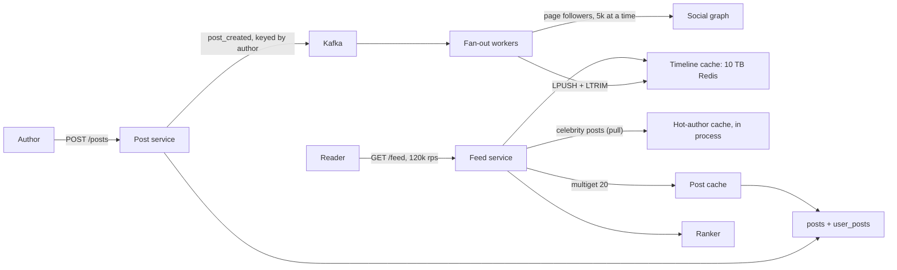

Every social product has the same screen: a scrollable list of recent posts from the people you follow. It looks like a query, `SELECT posts WHERE author IN (my followees) ORDER BY time DESC LIMIT 20`, and at small scale it is one. At 120,000 feed loads a second, with an average of 300 followees each, that query becomes 36 million index lookups a second plus a merge. The whole design problem is where to move that work, and the answer is different for an account with 200 followers than for one with 100 million.

[Back-of-envelope estimation](/learn/system-design/building-blocks/back-of-envelope-estimation) derives the hybrid fan-out model from arithmetic in a few paragraphs. This case study takes it to the senior bar. Where exactly is the celebrity threshold, and why? What goes into the timeline cache, and what does it cost? How do ranking, deletes, blocks and pagination work without rewriting 100 million timelines? And how does the system degrade when the fan-out pipeline is ten minutes behind?

## Requirements

### Functional

- **Post**: text up to 2,000 characters plus references to already-uploaded media. The media path is covered by [Video upload pipeline](/learn/system-design/case-studies/video-upload-pipeline).
- **Follow and unfollow**: a directed graph, with no approval step.
- **Home feed**: posts from followed accounts, reverse-chronological with light ranking, infinite scroll, and an "N new posts" indicator.
- **Your own post** appears in your own feed immediately.
- **Deletes, blocks and mutes** take effect on the next feed load.
- **Out of scope**: search, notifications ([Notification system](/learn/system-design/case-studies/notification-system)), ads, and the internals of the ranking model.

### Non-functional

- **Feed load latency**: p99 under 200 ms server-side.
- **Fan-out lag**: p99 under 5 seconds from post to followers' feeds for ordinary accounts.
- **Availability**: 99.95% for feed reads. A slightly stale feed is acceptable; an empty or erroring feed is not.
- **Correctness**: never show a deleted post or a blocked author, even though freshness is eventual.

### Scale

500 million monthly users, 200 million daily. Each daily user posts 0.5 times and loads the feed 20 times a day, and follows 300 accounts on average. The largest account has 100 million followers.

## Back-of-envelope estimates

**Posts.** $2 \times 10^8 \times 0.5 = 10^8$ posts/day, which is 1,000/s on average and about 3,000/s at peak. Storing posts is not the hard part.

**Feed loads.** $2 \times 10^8 \times 20 = 4 \times 10^9$/day, which is 40,000/s on average and 120,000/s at peak.

**Pull cost.** If every load reads the recent posts of 300 followees, that is $120{,}000 \times 300 = 3.6 \times 10^7$ lookups/s at peak, before merging. Even from a cache, at about 100,000 operations per node, that is hundreds of cache nodes doing nothing but this. Pure pull is out.

**Push cost.** In a directed graph, every follow is one edge, so the *average* number of followers equals the average number of followees: 300. Fan-out on write therefore costs $3{,}000 \times 300 = 9 \times 10^5$ timeline inserts/s at peak. That is a Redis-class number, spread over a cluster. But the average hides the tail. One post from the 100-million-follower account is $10^8$ inserts, more than 100 seconds of the *entire* fan-out capacity for a single post. Heavy posters also skew toward large follower counts, so the real fan-out per post is higher than 300. Measure it; do not assume it.

**Timeline cache.** Keep timelines only for recently active users, roughly the 200 million daily users, each holding its last 800 entries as a post ID (8 bytes), an author ID (8 bytes) and flags (4 bytes), which is 20 bytes per entry and 16 KB per user. $2 \times 10^8 \times 16\ \text{KB} = 3.2$ TB raw, about 5 TB with Redis overhead and 10 TB with a replica. That is roughly 160 nodes of 64 GB, and *the single largest cost in the design*. Say so.

**Post storage.** $10^8 \times 1\ \text{KB} = 100$ GB/day, which is 36 TB/year raw and about 110 TB/year with three replicas. Media is separate.

**Hydration.** Each feed page returns 20 posts, so 120,000 × 20 = 2.4 million post lookups/s at peak, plus author profiles, which you deduplicate within the page. This needs a post cache with multi-get.

**Egress.** About 30 KB of JSON per page × 120,000/s is 3.6 GB/s, roughly 29 Gbps before media, which goes through a CDN.

## API design

```text
POST   /v1/posts          Idempotency-Key: <uuid>
       {"text": "...", "media_ids": ["m_91..."], "visibility": "followers"}
       -> 201 {"post_id": "1839204711029760000"}
DELETE /v1/posts/{post_id}                         -> 204
PUT    /v1/follows/{user_id}                       -> 204
DELETE /v1/follows/{user_id}                       -> 204
GET    /v1/feed?limit=20&cursor=<opaque>
       -> 200 {"items": [{"post_id": "...", "author": {...}, "text": "...", "counts": {...}}],
               "next_cursor": "<opaque>"}
GET    /v1/feed/new_count?cursor=<opaque>          -> 200 {"count": 7}
```

Pagination is by **cursor, never offset**. With `?page=2`, the seven posts that arrived since page 1 push items down, and the user sees duplicates. The cursor encodes the last item's position (its ID or score) and a ranking snapshot ID, so page 2 continues from exactly where page 1 ended. [API design and versioning](/learn/system-design/building-blocks/api-design-and-versioning) covers cursor design in general.

## Data model

**Post IDs** are 64-bit, time-sortable IDs generated without coordination, in the style Twitter published as Snowflake: 41 bits of milliseconds since a custom epoch (about 69 years), 10 bits of generator ID and 12 bits of sequence (4,096 IDs per millisecond per generator). Sorting by ID sorts by time, so a timeline needs no separate timestamp and a cursor can be just an ID.

```sql
-- Point lookups for hydration: partitioned by hash(post_id).
CREATE TABLE posts (
  post_id     BIGINT PRIMARY KEY,
  author_id   BIGINT NOT NULL,
  body        TEXT,
  media_ids   TEXT[],
  deleted     BOOLEAN NOT NULL DEFAULT FALSE,
  created_at  TIMESTAMPTZ NOT NULL
);
-- Author timelines (profile pages and the pull path): partitioned by author_id.
CREATE TABLE user_posts (
  author_id BIGINT, post_id BIGINT,
  PRIMARY KEY (author_id, post_id)            -- clustered newest-first
);
-- The graph, stored in both directions because both are hot queries.
CREATE TABLE followers (user_id BIGINT, follower_id BIGINT, PRIMARY KEY (user_id, follower_id));
CREATE TABLE following (user_id BIGINT, followee_id BIGINT, PRIMARY KEY (user_id, followee_id));
```

**Timelines** live in Redis as `tl:{user_id}`: a capped list of `(post_id, author_id)` pairs, pushed with `LPUSH` and trimmed with `LTRIM 0 799`. Twitter engineers publicly described this shape years ago: Redis-backed home timelines capped at roughly 800 entries, filled by fan-out. The timeline holds **IDs, not bodies**. Bodies change (edits, deletes, like counts), and storing them would multiply the 10 TB cache by about fifty.

## High-level design



The write path is asynchronous from the moment the post commits. The author gets a 201 as soon as the post is in `posts` and `user_posts` and the event is in Kafka. Fan-out workers consume `post_created`, page through the author's followers, and push the post ID into each *active* follower's timeline. The read path takes the viewer's timeline, merges in posts from any celebrity accounts they follow, filters, hydrates, ranks and returns a page.

```viz
{"type": "system", "scenario": "kafka-partitions", "nodes": 3,
 "keys": ["author:42", "author:7", "author:42", "author:913", "author:7", "author:42"],
 "title": "post_created, partitioned by author",
 "caption": "Keying by author keeps one author's posts in order through fan-out, so an edit never overtakes its create. Partitions are the unit of fan-out parallelism, and a burst from one prolific author lands on one partition. That is one more reason celebrity accounts skip this path entirely."}
```

## Deep dives

### 1. Push, pull or hybrid, and where the threshold is

| | Fan-out on write (push) | Fan-out on read (pull) | Hybrid |
|---|---|---|---|
| Write cost | Followers × inserts per post | One insert | Push for most accounts |
| Read cost | One timeline read | Hundreds of lookups plus a merge | One timeline read plus a small merge |
| Celebrity post | 100M inserts; minutes of lag | Free | Pulled at read time |
| Inactive followers | Wasted work | Free | Skip them; rebuild on return |
| Failure mode | Fan-out backlog means stale feeds | Read latency and cost | Both, bounded |

The threshold between push and pull is usually hand-waved as "celebrities". Derive it instead. The driver is not total cost but **fan-out latency and burst**. Suppose no single post may take more than 10% of the fan-out fleet's 900,000 inserts/s, and the lag target is 5 seconds. Then one post can reach at most $90{,}000 \times 5 = 450{,}000$ followers within the lag target. So accounts above a few hundred thousand followers are pulled at read time, and everyone else is pushed. The number is a policy you tune from fan-out lag metrics, and saying where it comes from is the senior move.

The hybrid read path is cheaper than it looks because **the celebrity set is small**. Say 50,000 accounts are above the threshold. Keeping each one's last 50 post IDs at 16 bytes each is $50{,}000 \times 50 \times 16\ \text{B} = 40$ MB. That fits in every feed-service instance's memory, refreshed from `user_posts` via a subscription to `post_created` for those accounts. A viewer who follows 20 celebrities gets 20 in-process list reads and a merge, with no network hop and no hot key in any shared cache.

```python
import heapq

def home_candidates(timeline_ids, celeb_lists, own_recent, k=300):
    """Merge newest-first ID lists into the top-k candidates. Snowflake IDs sort by time."""
    streams = [timeline_ids, own_recent, *celeb_lists]          # each already newest-first
    merged = heapq.merge(*streams, key=lambda pid: -pid)        # k-way merge, O(n log s)
    seen, out = set(), []
    for pid in merged:                                          # dedupe at-least-once fan-out
        if pid not in seen:
            seen.add(pid)
            out.append(pid)
            if len(out) == k:
                break
    return out
```

This is [Merge k Sorted Lists](/practice/merge-k-sorted-lists) in production clothing, and [Design Twitter](/practice/design-twitter) is the single-process version of the whole read path.

**Skip inactive followers.** Roughly half of monthly users are not active on a given day, and users who have not opened the app for a week do not need a maintained timeline at all. Fan-out checks an "active in the last 7 days" bitmap and skips the rest, which cuts insert volume and cache memory together. When a dormant user returns, their timeline is rebuilt by pulling (see the follow-ups).

### 2. The read path: filter, hydrate and rank inside 200 ms

| Step | p50 | Notes |
|---|---|---|
| Fetch timeline (`LRANGE 0 299`) | 2 ms | One Redis call |
| Merge celebrity lists and own posts | under 1 ms | In process |
| Filter: blocks, mutes, unfollows | 3 ms | Viewer's block and mute sets, cached |
| Hydrate ~300 candidates' features | 15 ms | Batched multi-get from post cache, parallel per shard |
| Rank | 30–60 ms | Lightweight model over ~300 candidates |
| Hydrate the 20 winners fully, serialise | 10 ms | Bodies, authors, counts |
| **Total** | **~70–90 ms** | p99 budget 200 ms |

Four decisions make this work.

**Deletes are filtered at read time, not fanned out.** When a post is deleted, you do not remove its ID from millions of timelines. You set `deleted = true`, invalidate the post cache entry, and hydration drops it. For legal takedowns, where the cache TTL is too slow, hydration also checks a small synchronous denylist.

**Blocks and unfollows are filtered at read time too.** The viewer's block, mute and current-following sets are small and cached. An unfollow takes effect on the next load, even though stale entries sit in the timeline until they age out of the 800 cap.

**Rank a candidate set, not the timeline.** Take the newest 300 or so candidates, rank them, return 20, and store the ranked order under a snapshot ID that the cursor references. Page 2 then continues the same ranked list instead of re-ranking a set that has changed underneath it.

**Every dependency has a fallback.** If the ranker misses its 60 ms deadline, return reverse-chronological order: it is still a good feed. If the post cache misses, go to the store with a batch read. If hydration of one post fails, drop the post, not the page.

### 3. Freshness and consistency: what the user can notice

**Your own post, immediately.** Fan-out lag is a few seconds, but a user who posts and then pulls to refresh expects to see the post at once. Do not wait for fan-out to reach your own timeline. The feed service merges the viewer's own last few posts from `user_posts` into every load, which makes read-your-writes hold by construction ([Consistency models](/learn/system-design/building-blocks/consistency-models)).

**Duplicates from at-least-once fan-out.** Kafka redelivers after a worker crash, and `LPUSH` is not idempotent, so a timeline can hold the same post ID twice. Deduplicating 300 IDs at read time (the `seen` set above) is cheaper than making every insert idempotent, for example by switching to a sorted set keyed by post ID, which roughly triples memory.

**A new follow.** When you follow someone, their recent posts should appear on your next load. An async job backfills their last 20 post IDs into your timeline, and until it runs the feed service merges them from `user_posts`, exactly like a celebrity pull.

**The "N new posts" pill.** Compare the head of the viewer's timeline, plus the heads of their celebrity lists, with the top ID in the cursor. It costs one Redis call and needs no counters.

## Failure modes

**Fan-out backlog.** A major live event makes everyone post at once, or a mid-tier account's post lands in the same partition as a burst from another. Consumer lag grows, and feeds become minutes stale but stay available. Mitigations: split the fan-out queue by recipient activity (followers who are online right now first, the rest later), autoscale workers on consumer lag, and alert on the lag SLO, not on queue length.

**A timeline cache shard is lost.** With 160 nodes, a lost node without a replica empties about 1.25 million timelines. Rebuilding each one by pulling from 300 followees is 375 million lookups, and if every affected user opens the app at once, that storm lands on the post store. Replicas make this rare. When it happens, rate-limit rebuilds and serve a **degraded feed** in the meantime: celebrity posts, the user's own posts and recent posts from their ten most-interacted-with accounts. It is a thinner feed, but not an empty one.

**The social graph is slow.** Fan-out stalls because it cannot page followers, and reads are unaffected. Follow and unfollow writes queue up. The design survives this well precisely because reads never touch the graph synchronously, except for the viewer's own small following set, which is cached.

**A post goes viral.** One post ID is hydrated 500,000 times a second, all on one post-cache shard. Keep the hottest posts in an in-process cache on each feed instance for a few seconds. Like counts can be a few seconds stale.

**The ranker is down.** Serve reverse-chronological order. Measure engagement during the incident, and it will tell you how much the ranker is worth.

**Deleted content reappears.** A cache invalidation is lost, and the post-cache TTL is the backstop. For content that must disappear within seconds (legal, safety), the synchronous denylist at hydration is the guarantee, and it is checked on every page.

## Senior follow-ups

**Q: "A user follows 5,000 accounts and opens the app for the first time in three months. What happens?"**

Their timeline was not maintained, because they were dormant, so there is nothing in the cache. Rebuilding by pulling 5,000 author lists is too slow for a first page. So the first page is built from the in-process celebrity lists plus the recent posts of the 50 accounts they interacted with most before going dormant, which is a bounded pull of about 50 lookups. At the same time, an async job rebuilds the full timeline with a k-way merge over `user_posts` for all 5,000 followees, capped at 800 entries, and marks the user active so fan-out resumes. By page 2 or the next app open, the feed is complete.

**Q: "Why store only IDs in the timeline? Wouldn't bodies save the hydration step?"**

Three reasons. Memory: a 1 KB body instead of 20 bytes multiplies the 5 TB of timelines by about fifty, into hundreds of terabytes of RAM. Mutability: edits, deletes and like counts would require updating the post in every follower's timeline, which is fan-out for every edit and every like. And the post cache already concentrates reads: a popular post is hydrated from one cache entry for millions of viewers. The hydration step costs about 15 ms and saves most of the infrastructure bill.

**Q: "How would you shard the social graph when one account has 100 million followers?"**

Partition `followers` by `user_id`, but a 100-million-row partition is too large for one shard to scan without hurting everything else on it. Sub-partition large accounts: the key becomes `(user_id, bucket)` with the bucket derived from `hash(follower_id) mod 64` for accounts above a size threshold, and fan-out (or the rare full scan) reads the buckets in parallel. For the hybrid design we never fan out from these accounts at all, so their follower list is read only for analytics and for counts, which you keep as a separate counter anyway.

**Q: "What does the timeline cache cost, and how would you cut it in half?"**

Roughly 160 nodes of 64 GB at a few thousand dollars a month each, so on the order of half a million dollars a month. Four levers. Tighten the activity window that fan-out uses from 7 days to 2, which drops users who open the app only once or twice a week; their feeds are rebuilt when they return. Cap timelines of infrequent users at 200 entries instead of 800, because they never scroll that far. Pack entries into a compact binary format in a custom store instead of Redis list nodes, which removes most of the overhead. And drop the replica for timelines, since they are a rebuildable cache, accepting degraded feeds after a node loss. Each lever trades something, and I would pick them in that order.

**Q: "How do you add ML ranking without breaking pagination and the new-posts pill?"**

Rank a snapshot. Page 1 ranks the top 300 candidates and stores the ordered list under a snapshot ID for about 30 minutes, and the cursor carries the snapshot ID and the offset within it. Later pages read from the snapshot, so they never repeat or skip items. The new-posts pill compares the live timeline head with the snapshot's candidate set, and pull-to-refresh builds a new snapshot. The cost is a small, short-lived cache of ranked lists, which is cheap compared to users seeing duplicates.

**Q: "Take it to three regions."**

Posts and the graph are written in the author's home region and replicated asynchronously. Fan-out runs in each region against local replicas of the graph, writing that region's timeline cache for users homed there. The celebrity lists are replicated everywhere. Cross-region lag adds a second or two to fan-out for followers in other regions, which is within the 5-second target. The read-your-writes guarantee still holds because the author's own posts are merged from their home region's `user_posts`, which the author reads locally.

## Senior signals

- You derive the push/pull threshold from fan-out capacity and the lag target, instead of saying "celebrities" and moving on.
- You notice that the average follower count equals the average following count, and you still refuse to trust the average, because fan-out per post is weighted by who posts.
- You keep IDs, not bodies, in timelines, and you filter deletes, blocks and unfollows at read time instead of rewriting millions of timelines.
- You name the timeline cache as the dominant cost and give the levers, in order, for cutting it.
- You guarantee read-your-own-posts by merging at read time, not by waiting for fan-out.
- Every dependency on the read path has a fallback, and the degraded feed is thinner, never empty.

## Check yourself

```quiz
- q: >-
    Peak is 3,000 posts/s with an average of 300 followers per account. A single account has 100 million followers. What does the arithmetic say about pure fan-out on write?
  options: ["It is fine, because 900,000 inserts/s fits a Redis cluster's capacity", "The post store, not fan-out, is the bottleneck at 3,000 writes/s", "The average is fine, but one post from the top account swamps the fleet", "Push is always cheaper than pull, so fan out on write for every account"]
  answer: 2
  explanation: >-
    The average hides the tail. 900,000 inserts/s is manageable, but one post from the largest account is 100 million inserts, more than 100 seconds of the entire fan-out capacity, which blows the lag target for everyone else. That is why accounts above a derived threshold are pulled at read time. Storing 3,000 posts/s is the easy part.
- q: >-
    Why is the celebrity pull path cheap on the read side in the hybrid design?
  options: ["The celebrity set is small enough to hold in every instance's memory", "Each celebrity's list sits in one shared cache key that all readers hit", "Celebrity posts are served from the CDN, so the feed service skips them", "Celebrities post rarely, so their lists almost never need refreshing"]
  answer: 0
  explanation: >-
    50,000 accounts x 50 IDs x 16 bytes is about 40 MB, small enough to replicate into every feed-service process. The pull becomes an in-memory k-way merge with no network hop, instead of hundreds of remote lookups. A single shared cache key per celebrity is exactly the hot key the design avoids.
- q: >-
    A post is deleted. What is the right way to remove it from followers' feeds?
  options: ["Let it age out of the 800-entry cap, since timelines hold only IDs", "Fan out a delete that removes the ID from every follower's timeline", "Rebuild every follower's timeline from user_posts without the post", "Mark it deleted and invalidate the post cache so hydration drops it"]
  answer: 3
  explanation: >-
    Filtering at hydration is one write plus a cache invalidation, and a small synchronous denylist covers urgent legal takedowns where the cache TTL is too slow. Removing an ID from millions of timelines is fan-out for every delete, and it races with the original fan-out. Ageing out alone would show deleted content for days.
- q: >-
    A user posts and immediately refreshes, but fan-out has a 3-second lag. How does the design guarantee they see their own post?
  options: ["Fan-out writes to the author's own timeline synchronously before 201", "The feed service merges the viewer's own recent posts into every load", "It can't; with async fan-out the user must wait out the 3-second lag", "The client caches the post locally and prepends it until fan-out lands"]
  answer: 1
  explanation: >-
    Merging your own recent posts from user_posts at read time makes read-your-writes hold by construction, for one extra small partition read. A synchronous self-insert helps too, but it is a second write path that can fail independently. Client-only caching breaks across devices.
- q: >-
    Feed pagination uses ?page=2 with 20 items per page. Seven new posts arrive between page 1 and page 2. What does the user see, and what is the fix?
  options: ["Page 2 shows the seven new posts first; re-rank each page separately", "Seven page-1 items repeat on page 2; use a cursor over a ranked snapshot", "Nothing, because the offset is taken against the timeline at page 1", "Seven older items are skipped on page 2; fetch with a larger page size"]
  answer: 1
  explanation: >-
    Offsets are relative to a list that changed underneath them, so the new items push old ones down: the last seven items of page 1 reappear at the top of page 2. Nothing is skipped; items are repeated. A cursor says continue after this item (within this ranked snapshot), which is stable as the head of the feed grows.
```
