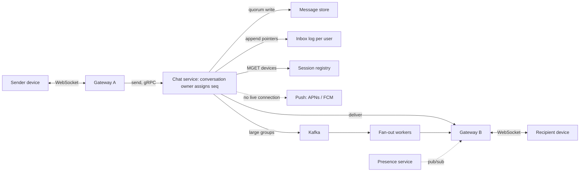

A chat system looks like a message queue with a UI. Unlike almost every other system in this module, it keeps a long-lived, stateful connection open to every online device, about 100 million at peak, and it makes promises users notice the moment they break: the same order on every device, nothing lost once the single tick appears, and a phone that was off for a week catching up the moment it comes online.

The senior version is not about WebSockets, which every candidate mentions. It is about three harder questions. How does a message find the gateway holding the recipient's connection? What makes delivery *correct* when that path fails, as it will many times a second? And what do groups and presence do to the arithmetic?

## Requirements

### Functional

- **1:1 and group chats**, groups up to 1,000 members; broadcast channels of 100,000+ are handled separately.
- **Text plus media references** (media goes to object storage and a CDN, out of scope).
- **Delivery states**: sent (the server has it), delivered (a recipient device has it), read.
- **Multi-device**: up to five devices per user, each with full history in the same order.
- **Offline delivery**: push notifications wake the device; history syncs on open.
- **Presence and typing indicators**. Out of scope: calls and message search; end-to-end encryption comes up in the follow-ups.

### Non-functional

- **Latency**: send-to-delivery p50 under 100 ms and p99 under 500 ms with both parties online in one region.
- **Durability**: once the sender sees "sent", the message is never lost.
- **Ordering**: every device shows the same order within a conversation; no global order is needed.
- **Exactly-once display** on top of at-least-once delivery.
- **Availability**: 99.99% for sending.

### Scale

500 million daily users sending 40 messages a day each; 30% of messages go to groups averaging 20 members; 1.5 online devices per user; 100 million connected devices at peak.

## Back-of-envelope estimates

| Quantity | Arithmetic | Result |
|---|---|---|
| Messages | $5 \times 10^8 \times 40$ a day | $2 \times 10^{10}$/day: 230,000/s average, ~600,000/s peak |
| Deliveries per message | $0.7 \times 2$ (1:1: recipient's devices plus sender's others) $+ 0.3 \times 29$ (19 members × 1.5 devices) | ~10; groups are 30% of messages and 85% of deliveries |
| Deliveries | 600,000 × 10 | 6 million/s at peak, plus as many receipts: ~12 million frames/s |
| Heartbeats | $10^8$ connections ÷ 60 s | 1.7 million/s, more packets than messages |
| Gateway bandwidth | 6M × 250 B + 6M × 100 B receipts + heartbeats | ~2.2 GB/s, 18 Gbit/s fleet-wide |
| Message storage | $2 \times 10^{10}$ × 200 B, stored once per conversation | 4 TB/day; 4.4 PB/year with three replicas |
| Inbox pointers | $0.7 \times 2 + 0.3 \times 20 = 7.4$ per message × ~40 B | 4.4 million writes/s at peak; 5.9 TB/day, more bytes than the messages |
| Session registry | $7.5 \times 10^8$ devices × ~100 B; 20 reconnects a device a day | 75 GB; 170,000 updates/s; ~4.4 million key reads/s for delivery lookups |

| Tier | Sizing | Count |
|---|---|---|
| Gateways | 100M connections ÷ 200,000 each; 20–50 KB of TLS and buffer state per connection is 4–10 GB of RAM; ~24,000 frames/s and 35 Mbit/s per node | 500 |
| Chat service (conversation owners) | 600,000 sends/s at ~0.5 ms of CPU each ≈ 300 cores, doubled for headroom | ~75 instances of 8 vCPU |
| Message store | 90 days hot: 1.1 PB replicated ÷ ~4 TB per node; older buckets move to object storage | ~270 nodes |
| Inbox store | 13 million replica writes/s ÷ roughly 100,000 small LSM writes/s per node (hardware-dependent); 30-day retention is ~530 TB | ~150 nodes |
| Session registry | 4.4 million key reads/s ÷ ~120,000 per primary; memory is only 75 GB | ~37 primaries + replicas |

The sentences that matter: **store each message once per conversation** (a mailbox copy per recipient would multiply 4 PB a year by ten), and **the inbox log, not the message store, is the biggest write load**, which is why it holds 40-byte pointers and is trimmed after 30 days.

## API design

Each device holds one WebSocket (`wss://chat.example.com/v1/connect`, authenticated at upgrade) carrying small typed frames:

```text
C->S {"type":"send",    "client_msg_id":"c_7f3a", "conv_id":"cv_91", "body":"on my way"}
S->C {"type":"ack",     "client_msg_id":"c_7f3a", "conv_id":"cv_91", "seq":1042, "ts":1727350000123}
S->C {"type":"msg",     "conv_id":"cv_91", "seq":1042, "from":"u_12", "body":"on my way", "inbox_seq":88113}
C->S {"type":"receipt", "conv_id":"cv_91", "up_to_seq":1042, "kind":"delivered"}
C->S {"type":"sync",    "after_inbox_seq":88090}
S->C {"type":"presence","user":"u_12", "state":"online"}
```

```text
GET  /v1/conversations/{conv_id}/messages?before_seq=1000&limit=50   # scrollback
POST /v1/conversations            {"members": ["u_12","u_40"], "title": "Trip"}
PUT  /v1/conversations/{conv_id}/members/{user_id}
```

Three fields carry the design. `client_msg_id` makes sends idempotent: a retry carries the same ID and gets the original `seq` back. `seq` is the server-assigned per-conversation order. `inbox_seq` is a per-user sequence over every event that concerns the user, the basis of sync.

## Data model

```sql
CREATE TABLE messages (
  conv_id BIGINT, bucket INT, seq BIGINT, sender_id BIGINT, client_msg_id TEXT,
  body BLOB,                          -- ciphertext if end-to-end encrypted
  sent_at TIMESTAMP,
  PRIMARY KEY ((conv_id, bucket), seq)
) WITH CLUSTERING ORDER BY (seq DESC);

CREATE TABLE inbox (                  -- "something happened in conv X at seq Y"
  user_id BIGINT, inbox_seq BIGINT, conv_id BIGINT, kind SMALLINT, ref_seq BIGINT,
  PRIMARY KEY (user_id, inbox_seq)
);

CREATE TABLE device_cursor (
  user_id BIGINT, device_id TEXT, delivered_inbox_seq BIGINT,
  PRIMARY KEY (user_id, device_id)
);
```

| Table | Partition key | Sort key | Access pattern | Why |
|---|---|---|---|---|
| `messages` | `(conv_id, bucket)`, bucket = `seq / 10000` | `seq DESC` | Scrollback: a range within one conversation, newest first | A partition holds at most 10,000 messages (~2 MB); unbounded partitions become the hot, slow ones |
| `inbox` | `user_id` | `inbox_seq` | Sync: everything after one number | One partition range read per reconnect, whatever the number of conversations |
| `device_cursor` | `user_id` | `device_id` | Per-device progress | Five rows per user at most |
| Membership | `conv_id` | `user_id` | Fan-out targets | Small per conversation; cached by the owner |
| Session registry (Redis) | `device_id` | – | `device → gateway`, TTL refreshed by heartbeats | In memory because it is read on every delivery |

This is the wide-column shape (Cassandra, ScyllaDB, HBase) because every query is a range within one partition ([Wide-column stores](/learn/databases/nosql-and-specialised/wide-column-stores)).

## High-level design



Gateways are deliberately dumb: they terminate connections and forward frames. Conversations are consistent-hashed to **owner** instances in the chat service; the owner sequences, stores, appends pointers, acks and delivers.

```viz
{"type": "network", "scenario": "websocket-upgrade",
 "title": "One long-lived connection per device",
 "caption": "The client upgrades an HTTPS request to a WebSocket and then keeps it open for hours. Each of the 500 gateways holds about 200,000 of these, and that state is exactly what makes deploys, crashes and routing the hard parts of chat."}
```

## Deep dive 1: a message from send to double tick

Both users online in one region; mobile one-way latency ~20 ms (it depends on the network: 10 ms on good Wi-Fi, 50–100 ms on congested cellular); in-region RPC ~0.5 ms; a quorum write ~4 ms.

| t (ms) | Where | Action | State |
|---|---|---|---|
| 0 | Device 1 | `send c_7f3a` on its WebSocket | Clock icon |
| 20 | Gateway A | Forward to the owner of `cv_91` | |
| 21 | Owner | `c_7f3a` not in its recent-IDs map; assign `seq = 1042` | |
| 21–26 | Stores | Quorum write of the message and inbox pointers for both members, in parallel | Durable |
| 26 | Owner | Ack to gateway A; `MGET` device 2's sessions in the registry (~1 ms) | |
| 27 | Gateway B | Write the `msg` frame to device 2's socket | |
| 46 | Device 1 | Ack arrives | Single tick |
| 47 | Device 2 | Dedupe by `(cv_91, 1042)`; it holds 1041, so render; send `receipt up_to 1042` | Delivered |
| 68 | Owner | Store the delivered cursor; append a receipt event to user 1's inbox | |
| ~90 | Device 1 | Receipt frame arrives | Double tick |

Send-to-delivery is ~47 ms, inside the 100 ms p50. **The tick means durable**: the ack waits for the quorum write, because acking from memory makes the tick a lie during a crash.

### The fast path is an optimisation; the slow path is the correctness path

Direct delivery fails many times a second: a stale registry entry, a gateway mid-crash, a phone entering a tunnel. None loses a message, because by t = 26 the message is stored and the recipient's inbox log points at it; the device fetches it on its next sync. A failed direct delivery falls through to a push notification, which only has to wake the app. Saying this is the senior signal: *correctness never depends on the live connection*.

| Transport | Server push | Cost at 100M devices | Verdict |
|---|---|---|---|
| Short polling every 5 s | No; up to 5 s latency | 20M requests/s, mostly empty | No |
| Long polling | Yes, one request per message | A new HTTP request after every message | Fallback only |
| Server-sent events | Server to client only | Needs a second channel for sends | Fine for feeds |
| WebSocket | Both directions, framed | One TLS connection per device | Default |
| MQTT over TLS | Both directions, tiny headers | Same connections, fewer bytes | Facebook has described using it for Messenger |

[Real-time transports](/learn/networking/application-protocols/real-time-transports) compares these in depth. Routing uses the **session registry plus direct RPC**: gateways write `device → gateway` with a TTL on connect, the owner looks up all members' devices in one batched call, and RPCs the right gateways. The alternatives, a pub/sub channel per user (100 million subscriptions and their churn) or a queue per gateway (durability on a path that does not need it), each add a hard system for no correctness gain.

### Under the hood: what one idle connection costs

An idle TCP socket costs the kernel a few kilobytes of socket structures: its receive and send buffers are allocated on demand as data queues, not at their configured maximums, so 200,000 idle sockets are hundreds of megabytes, not gigabytes. The larger cost is in user space. A TLS library keeps per-connection record buffers sized for 16 KB TLS records, which is most of the 20–50 KB per connection in the estimate; OpenSSL's `SSL_MODE_RELEASE_BUFFERS` frees them while a connection is idle (around 34 KB per connection, its documentation says), which is how gateways fit far more connections per gigabyte. One epoll set per event-loop thread watches all of them, and wakes only for sockets with data. Heartbeats exist because carrier NATs often expire idle TCP mappings after minutes, far below the minimum of 2 hours 4 minutes that [RFC 5382](https://www.rfc-editor.org/rfc/rfc5382.html) requires; a dead mapping looks like a live socket to both ends until the next write fails, so the interval is tuned per network rather than hard-coded.

## Deep dive 2: ordering, failover and sync

### One sequencer per conversation, fenced

Client clocks are wrong and group members send concurrently, so the server picks the order: the conversation's owner assigns the next integer. There is one writer per conversation and conversations are independent, so there is no coordination on the hot path. Failover is the subtle part, traced:

| t (s) | Owner X (lease epoch 7) | Owner Y | Store |
|---|---|---|---|
| 0 | Assigns 1043; writes succeed | | max seq 1043 |
| 1 | GC pause begins | | |
| 10 | Lease expires | Acquires lease, epoch 8; reads max seq 1043 | |
| 11 | | Assigns 1044 to Bob's message; write with epoch 8 | 1044 (Bob) |
| 13 | Wakes; still believes it owns `cv_91`; assigns 1044 to Ann's message | | |
| 13 | Conditional write "seq 1044 absent, epoch ≥ 8" | | **Rejected** |
| 13.5 | Ann's device times out and retries with the same `client_msg_id` via Y | Assigns 1045 | 1045 (Ann) |

Without the conditional write and the fencing token, 1044 would exist twice with different bodies on different devices ([Failure detection and leases](/learn/system-design/distributed-systems/failure-detection-and-leases)).

```viz
{"type": "system", "scenario": "leader-lease", "fencing": true, "holders": ["Owner X","Owner Y"], "resource": "Message store", "epoch": 7, "writes": ["seq 1043","seq 1044 (Bob)","seq 1044 (Ann)"],
 "title": "Conversation ownership is a lease with a fencing token",
 "caption": "The owner holds a time-limited lease. When it pauses past expiry, a new owner takes over with a higher epoch, and the store rejects writes carrying the old one."}
```

**Exactly-once display** combines at-least-once delivery, idempotent storage (the same `client_msg_id` gets the same `seq`; the owner keeps recent IDs per conversation, [Idempotency and retries](/learn/system-design/building-blocks/idempotency-and-retries)), and client-side dedupe by `(conv_id, seq)`. The device also fills gaps: holding 1042 and receiving 1045, it fetches 1043–1044 before rendering, shown as a brief loading state, never a reorder.

### Sync from one cursor, traced

A naive sync sends a cursor per conversation: 300 cursors and 300 partition reads per reconnect. Instead every event concerning a user is appended to their **inbox log** with the next `inbox_seq`, and a device remembers one number. A phone off for two days reconnects with 800 events waiting:

| t (ms) | Step |
|---|---|
| 0–150 | TCP and TLS handshakes over cellular (two to three round trips), authenticate the upgrade |
| 150 | `sync after_inbox_seq = 88090` |
| 155 | Read inbox rows 88091–88590 (one partition range, ~5 ms) |
| 165 | Multi-get the referenced messages, grouped by `(conv_id, bucket)` (~10 ms) |
| 165–365 | Stream 500 events × ~250 B = 125 KB at 5 Mbit/s (~200 ms) |
| 370 | Device stores them, acks cursor 88590; the owner advances `device_cursor` |
| 370–600 | Second page, 300 events |

Under a second, whatever the number of conversations. If more than 10,000 events are waiting, or the 30-day inbox has been trimmed past the cursor, the server switches to a **summary resync**: the latest few messages and unread count per conversation, with full history fetched lazily on open.

### Membership changes are sequenced events

Adding or removing a member goes through the conversation's owner and takes the next `seq`, like a message. Fan-out for seq n uses the member set as of n, and each membership row records the range its member may read: `(conv_id, user_id, joined_seq, left_seq)`. C sends at the moment A removes D:

| seq | Event, in the owner's order | Fan-out targets | Effect |
|---|---|---|---|
| 900 | B: "dinner at 8?" | A, B, C, D | |
| 901 | A removes D | A, B, C, D | D's devices show the removal; `left_seq` = 901 |
| 902 | C's message, which reached the owner after 901 | A, B, C | D receives nothing |
| 903 | A adds E | A, B, C, E | `joined_seq` = 903: E's scrollback starts here |

The race this prevents: if owners fanned out from a cached member list that a separate service updated, C's message could reach D after D's devices showed the removal, and phones could disagree on whether the removal came before C's message. In the seq stream, "did D receive 902?" has one answer, and every device shows the removal between 900 and 902.

End-to-end encryption moves the cut to the clients. Each member encrypts group messages once with its own **sender key**, which D holds up to 901; after the removal every remaining member replaces its sender key and distributes the new one over pairwise sessions before its next message, as WhatsApp's security whitepaper describes. In a 1,000-member group with 1,500 devices, one removal costs about 999 × 1,500 ≈ 1.5 million pairwise encryptions, growing with the square of the group size.

## Deep dive 3: groups, channels and presence

**Small groups (up to 1,000)**: store once, append a pointer per member, one batched registry lookup, deliver. At 1,000 members that is 1,000 pointer writes and ~1,500 deliveries per message; when such a group is busy, move its fan-out onto Kafka-fed workers so one hot group cannot stall the owner's other conversations.

**Broadcast channels (100,000+)** switch to **fan-out on read**: 100,000 pointer writes per message is the news-feed celebrity problem again. Store once, push a lightweight "channel updated" signal only to members with the channel open, and let others read the latest messages on open with a per-member read cursor ([News feed](/learn/system-design/case-studies/news-feed)).

**Presence is a fan-out bomb.** 100 million online users with 200 contacts each change state about every 10 minutes: $10^8 / 600 \approx 170{,}000$ changes/s × 200 = **33 million notifications/s**, almost all to people not looking. **Subscribe on view**: a client subscribes only to the ~20 users on its screen and unsubscribes when they scroll away; changes publish to a per-user channel that only gateways with a subscriber receive. Debounce "offline" for ~30 s so a Wi-Fi-to-cellular switch does not flash offline to 200 people, and write "last seen" lazily.

```viz
{"type": "system", "scenario": "pubsub", "flavor": "presence",
 "title": "Presence: publish per user, deliver only to subscribers",
 "caption": "A status change is published once to the user's topic. Only gateways with a client that currently has that user on screen are subscribed, so the fan-out follows attention, not the contact list."}
```

**Typing indicators** are never stored or retried, are rate-limited to about one every three seconds, and are the first thing dropped under load. **Read receipts in a 500-member group** are one coalesced cursor per member ("read up to 1042", at most every few seconds); "read by 312 of 500" is computed from cursors when the sender opens message info.

### Presence and typing, priced

Subscribe on view moves the cost rather than removing it. Computed with 500 gateways and two assumptions, a screen that changes once a minute and 60 s heartbeats:

| Quantity | Arithmetic | Result |
|---|---|---|
| Subscriptions | $10^8 \times 20$ (all online users foregrounded) | $2 \times 10^9$; 20–100 GB at 10–50 B each |
| Per-gateway dedupe | 20 viewers span $500 (1 - (499/500)^{20}) = 19.6$ gateways | 2% saved; 200× for a user with 100,000 viewers |
| Notifications | 167,000 changes/s × 20 viewers | 3.3 million/s, a tenth of 33 million |
| Subscription churn | $10^8 \times 20$ per minute | 33 million/s; 1.7 million calls/s batched per screen |
| "Last seen" writes | Offline transitions: 167,000 ÷ 2 | 83,000/s, versus 1.7 million/s per heartbeat |

Churn is affordable because it stays in the datacentre, is batched (one call per screen returns all 20 states) and comes only from foregrounded apps, and a 10 s grace period after the user scrolls away absorbs scrolling back. Subscriptions are leases the gateway renews, so a gateway crash cannot leak them.

**Detection time** follows from the heartbeat. With a 120 s idle timeout and the 30 s debounce, a clean close shows offline after 30 s, but a phone that loses signal sends nothing: the gateway notices 60–120 s later, depending on where in the heartbeat interval it died, and contacts see offline after 90–150 s. 30 s heartbeats cut that to 60–90 s at 3.3 million heartbeats/s and twice the radio wake-ups.

**Typing indicators** outnumber messages. If typing takes about 6 s and a client sends at most one indicator per 3 s, the peak is 600,000 × 2 = 1.2 million events/s. In a 1,000-member group (1,500 devices) with 20 members typing, 6.7 events/s become 10,000 frames/s sent to every device, 500 sent only to the 5% with the conversation open, and 25 if the owner aggregates them into one "Ann and 19 others are typing" frame per viewer every 3 s.

## Deep dive 4: the reconnect storm, with measured handshake costs

A reconnect is a TCP and a TLS handshake, an authenticated upgrade, a registry write and a sync. `openssl speed -seconds 2` measured the server's public-key work on one core of this machine (OpenSSL 3.0.13 on an AMD Ryzen 9 9950X3D under WSL2; results depend on the CPU):

| Operation | Per core | Each |
|---|---|---|
| X25519 key agreement | 55,189/s | 18.1 µs |
| ECDSA P-256 sign | 95,474/s | 10.5 µs |
| RSA-2048 sign | 6,181/s | 161.8 µs |

A full TLS 1.3 handshake costs the server an ephemeral key pair and a key agreement (two X25519 operations, an upper bound since key generation is faster) plus one signature: 46.7 µs with an ECDSA certificate, 198 µs with RSA-2048. Resumption drops the signature, saving 22% with ECDSA and 82% with RSA. Assume a 16-core gateway spends half its CPU on handshakes and crypto is half of each handshake: 4 cores of crypto, about 85,600 full handshakes/s with ECDSA and 20,200/s with RSA.

| Scenario | Handshakes | Where they land | Time at full capacity (ECDSA / RSA) |
|---|---|---|---|
| One gateway process crashes | 200,000 | 401 on each of 499 survivors | 5 ms / 20 ms |
| The same, behind a least-connections balancer | 200,000 | All on the empty replacement | 2.3 s / 9.9 s |
| Region loss (150 of 500 gateways) | 30 million | 85,700 on each of 350 survivors | 1.0 s / 4.2 s |

Spread out, crypto is not the constraint; **concentration and synchronisation are**. A crashed process's kernel closes all 200,000 sockets at once, so every client learns within one RTT, whereas a dead machine is discovered at each client's next heartbeat, over 60 s. If 200,000 SYNs reach one replacement within a second, its accept queue (`somaxconn`, 4,096 by default since Linux 5.4) overflows, clients resend the dropped SYNs in synchronised waves (1, 3 and 7 s later under classic exponential backoff; Linux 6.5 and later retry the first few at 1 s intervals), and with RSA only about 101,000 handshakes finish inside a 5 s client timeout. Slow start on the balancer ([load balancing](/learn/networking/application-protocols/load-balancing)) removes the concentration; full jitter over 30 s cuts the replacement's load to 6,700 handshakes/s, a third of its RSA capacity; admission control answers any excess at once with a retry-after ([timeouts, retries and backoff](/learn/networking/networking-in-practice/timeouts-retries-and-backoff)).

At region scale the limit moves downstream: 30 million registry writes are 6.8 s of the registry's entire 4.4 million operations/s, already busy serving deliveries, followed by 30 million syncs. Jitter over 60 s gives 500,000 reconnects/s: 1,430 handshakes/s per gateway (2% of ECDSA capacity) and 11% of the registry. Size the window from the slowest downstream tier, not from TLS.

## Failure modes

| Failure | Symptom | Diagnosis | Fix |
|---|---|---|---|
| Gateway crash, then reconnect storm | 200,000 devices reconnect at once; handshakes concentrate on a few survivors and saturate them | Handshake rate and CPU spike on a few gateways; `TcpExtListenOverflows` rises; least-connections routing favours the empty replacement | Exponential backoff with full jitter on clients; slow start on the balancer; gateways admit handshakes at a rate they can complete and shed the rest ([Resilience patterns](/learn/system-design/building-blocks/resilience-patterns)) |
| Region loss | 30 million connections move to surviving regions | Regional health checks; connection counts shift | Capacity-plan survivors for the handshake rate, not only the connection count; messages already acked are durable and replicated |
| Session registry down | Delivery latency jumps from ~50 ms to seconds | Registry errors on owners | Registry is fast path only: fall through to push plus sync; correctness holds |
| Slow store partition | Senders see the clock icon; retries | Store latency for one partition range | Retries reuse `client_msg_id`, so no duplicates; never ack from memory to hide it |
| Duplicate sends | The same text twice in a chat | Retries without an idempotency key, or dedupe by text | `client_msg_id` → original `seq`; device dedupes by `(conv_id, seq)` |
| Hot group | One owner's other conversations slow | Owner CPU and send latency skewed by one `conv_id` | Move that group's fan-out to workers; rate-limit sends per group |
| Removed member still receives messages | A removed user sees one more message | Membership changed outside the owner; fan-out read a stale member list | Sequence membership changes through the owner |
| Poison frame | A gateway or worker crash-loops on one malformed or oversized frame | The same message ID in every crash | Validate and cap frame size at the gateway; park bad fan-out jobs on a dead-letter queue |
| Push provider throttling | Offline users notified late | APNs/FCM error and throttle rates | Push is the doorbell, sync is the guarantee; collapse notifications per conversation |

## Trade-offs: what was rejected

| Decision | Chosen | Rejected | Why rejected here | What would flip it |
|---|---|---|---|---|
| Storage model | Once per conversation + pointer inbox | Mailbox copy per recipient | 10× the 4 PB a year | End-to-end encryption per device, where copies differ anyway |
| Ordering | Owner sequencer with fencing | Client timestamps; per-gateway counters | Clocks disagree; two senders on two gateways conflict | – |
| Routing | Registry + direct RPC | Pub/sub per user; queue per gateway | 100M subscriptions; durability on a non-durable path | – |
| Sync | One per-user inbox cursor | A cursor per conversation | 300 partition reads per reconnect | Broadcast channels, which use read cursors |
| Presence | Subscribe on view | Push to all contacts | 33M notifications/s | A product with tiny contact lists |

## Evolution at 10× and 100×

**10× (6 million sends/s, a billion connections).** 5,000 gateways; connection count and handshake rate, not message rate, become the capacity plan. The inbox store is the first storage tier to break at 130 million replica writes/s, so pointers are batched per recipient per few hundred milliseconds and retention drops to 14 days with summary resync behind it. Message history above 40 PB a year goes to compressed immutable files on object storage after 90 days.

**100×.** One region's gateway fleet cannot hold it; users are homed to regions, conversations are owned in the region of most members, and cross-region conversations pay a replication hop (~100 ms). Groups above a few hundred members all become pull-based channels, and presence is sampled (a coarse "active recently") rather than streamed.

## What real companies describe

- WhatsApp's engineering blog described holding around two million connections on a single Erlang server in 2012, which is why 200,000 a gateway here is conservative.
- Discord's engineering blog described storing messages partitioned by channel and a fixed time bucket with Snowflake IDs, for the same bounded-partition reason as `(conv_id, bucket)` above, and later moving that store to ScyllaDB.
- Facebook engineers have described Messenger using MQTT to mobile devices and Iris, a totally ordered queue of updates with separate pointers for what the app and the storage tier have received: the shape of the inbox log.
- Slack's engineering blog described Flannel, an application-level edge cache that answers clients' startup queries near the user, shrinking what each connect or reconnect costs the core services.
- WhatsApp's security whitepaper describes "sender keys" for group end-to-end encryption.

## Interviewer follow-ups

**"How does end-to-end encryption change the design?"** Model answer: the server routes and stores ciphertext; search, notification previews and content spam checks move to the device. Each device has its own keys, so a 1:1 message is encrypted per recipient device and per sender device; groups use sender keys and rotate them on membership changes. Ordering, idempotency, storage, routing and receipts need no plaintext and stay. History for a new device needs a device-to-device transfer or an encrypted backup. Common wrong answer: "encrypt in transit with TLS", which is not end to end.

**"Deploy a new gateway version without dropping 100 million connections."** Model answer: roll a few percent at a time; drain each gateway by refusing new connections and asking clients to reconnect elsewhere over ~10 minutes (330 reconnects/s per gateway); keep the frame protocol backward compatible; gate on connection success, delivery latency and reconnect rate. At 500 gateways and 5% at a time, a few hours. Common wrong answer: a rolling restart, which is 200,000 simultaneous reconnects per node.

**"Why not Kafka as the message store, or a topic per conversation?"** Model answer: a cluster handles hundreds of thousands of partitions, millions at most, not billions of conversations, and Kafka cannot answer "messages 900–950 of cv_91" without scanning, while scrollback is core. Kafka is right for large-group fan-out work. Common wrong answer: "Kafka keeps order, so it is the natural store".

**"A phone is off for two weeks. What happens?"** Model answer: it syncs after its `inbox_seq`; beyond 10,000 events or past the 30-day trim, it gets a summary resync with history fetched on open. Pushes sent meanwhile were best-effort; sync makes it correct. Common wrong answer: "the queued push notifications deliver the messages".

**"A region with 30 million connections fails. How long until everyone is back?"** Model answer: TLS needs about a second of crypto across 350 survivors; the registry (6.8 s of its full capacity) and sync are the limits, so clients jitter over about a minute and gateways admit at a fixed rate. Common wrong answer: "as fast as clients retry", which is how the storm starts.

## What mid-level engineers get wrong

- Acking "sent" before the durable write, so a crash loses messages users saw ticked.
- Ordering by device timestamps, so two phones show different orders.
- Treating the WebSocket as the delivery guarantee, with no inbox log and cursor behind it.
- Copying every message into every recipient's mailbox and paying 10× the storage.
- Pushing presence to all contacts: 33 million notifications a second.
- Reconnecting without jitter, turning one gateway crash into a handshake storm.
- Failing over conversation ownership without fencing, so two messages share one `seq`.
- Changing group membership outside the conversation's sequence, so a removed member receives a message sent after the removal.
- Writing "last seen" on every heartbeat: 20 times the writes of recording offline transitions.

## Exercise

```exercise
id: chat-ordered-render
title: Render chat frames in order with dedupe and gap detection
prompt: |
  A device has rendered every message of one conversation up to `last_seq`.
  Frames then arrive from live delivery and from sync, in the order given by
  `frames` (a list of integer `seq` values). They can be duplicated and out
  of order.

  Implement `apply_frames(last_seq, frames)`:

  - A frame whose seq is already rendered (<= the highest rendered seq) or
    already buffered is a duplicate: count it and ignore it.
  - Otherwise buffer it, then render every buffered seq that continues the
    contiguous run (highest rendered + 1, + 2, ...), in order.

  Return `{"rendered": [seqs rendered, in order], "gaps": [seqs still missing
  between the highest rendered seq and the highest buffered seq, ascending],
  "duplicates": <count>}`. The gaps are what the device must fetch.
languages: [python, javascript]
entry: apply_frames
starter:
  python: |
    def apply_frames(last_seq, frames):
        # your code here
        return {"rendered": [], "gaps": [], "duplicates": 0}
  javascript: |
    function apply_frames(last_seq, frames) {
      // your code here
      return { rendered: [], gaps: [], duplicates: 0 };
    }
tests:
  - args: [1041, [1042, 1043]]
    expected: {"rendered": [1042, 1043], "gaps": [], "duplicates": 0}
  - args: [1041, [1042, 1045, 1043]]
    expected: {"rendered": [1042, 1043], "gaps": [1044], "duplicates": 0}
    label: a gap stays open until 1044 arrives
  - args: [10, [11, 11, 10, 12]]
    expected: {"rendered": [11, 12], "gaps": [], "duplicates": 2}
    label: redelivered and already-rendered frames
  - args: [0, [3, 2, 1]]
    expected: {"rendered": [1, 2, 3], "gaps": [], "duplicates": 0}
    label: fully reversed arrival
  - args: [5, []]
    expected: {"rendered": [], "gaps": [], "duplicates": 0}
    label: no frames
  - args: [100, [104, 102, 104, 101, 106, 103]]
    expected: {"rendered": [101, 102, 103, 104], "gaps": [105], "duplicates": 1}
    hidden: true
  - args: [7, [7, 6, 9, 9]]
    expected: {"rendered": [], "gaps": [8], "duplicates": 3}
    hidden: true
hints:
  - "Keep `upto` (highest rendered seq) and a set of buffered seqs. After buffering, loop while upto + 1 is in the set."
  - "Gaps are the numbers from upto + 1 to max(buffer) that are not in the buffer."
```

## Senior signals

- You separate the fast path (registry and live socket) from the correctness path (durable store, inbox log, sync), and nothing correct depends on a live socket.
- You assign order with one sequencer per conversation, fence ownership changes, and never order by device clocks.
- You make sends idempotent with a client message ID and define "sent" as durably stored.
- You notice that the inbox log, not the message store, is the biggest write load, and trim it with a defined fallback.
- You do the presence arithmetic and switch to subscribe-on-view before the interviewer asks.
- You plan for the reconnect storm (draining for deploys, jittered backoff, handshake admission control) and know its limits are concentration, synchronisation and the registry, not TLS.

## Check yourself

```quiz
- q: >-
    A message is acked to the sender and stored, but direct delivery fails because the registry points at a gateway that crashed a moment ago. What guarantees the recipient still gets it?
  options: ["The sender's device resends it after it does not see a delivery receipt", "The push notification carries the message, so the device can display it", "The gateway replays its in-memory queue for that device as soon as it restarts", "The inbox log points to the stored copy, so the device's next sync gets it"]
  answer: 3
  explanation: >-
    Durable storage plus the per-user inbox log is the correctness path, and live delivery is only an optimisation. The push notification only has to wake the app so it syncs; APNs and FCM are best-effort. Gateways hold no durable state, and relying on the sender to resend would break exactly-once display.
- q: >-
    Two members of a group send messages at nearly the same time from phones with different clock offsets. How does every device end up showing the same order?
  options: ["Every device sorts by the time each message arrived at that device", "Every device sorts by the sender's device timestamp carried in each message", "Each gateway assigns seq numbers to the messages its own devices send", "The conversation's owner assigns seq numbers, and devices render by seq"]
  answer: 3
  explanation: >-
    One sequencer per conversation gives a total order within the conversation, with no cross-conversation coordination. Device clocks disagree and arrival order differs per device. Per-gateway numbering fails because two senders in one group are usually on different gateways, so their numbers conflict.
- q: >-
    An owner pauses for 12 seconds, its lease expires, and a new owner assigns seq 1044. The old owner wakes and assigns 1044 to a different message. What stops two different messages 1044?
  options: ["Devices keep whichever 1044 arrives first and drop the other one", "The store rejects the write: seq 1044 exists and the epoch is stale", "The old owner rereads the lease before each write, so it never sends one", "Gossip tells the old owner about the takeover before its pause ends"]
  answer: 1
  explanation: >-
    A paused process cannot be trusted to check its lease in time, because the pause can happen between the check and the write. The store is the referee: a write conditional on the seq being absent and carrying the new fencing epoch rejects the deposed owner, whose client then retries with the same client_msg_id through the new owner. Devices keeping the first arrival would show different messages on different devices.
- q: >-
    The sender's app times out and retries a send. Which mechanism prevents the recipient from seeing the message twice?
  options: ["The gateway drops any message whose text matches the sender's last one", "Read receipts tell the sender's app the first copy already arrived", "TCP retransmission guarantees each frame reaches the gateway only once", "The retry reuses client_msg_id, so the owner returns the original seq"]
  answer: 3
  explanation: >-
    Idempotency keys turn at-least-once sends into one stored message: a duplicate client_msg_id gets the original ack back, and devices deduplicate redelivery by (conv_id, seq). TCP cannot help, because the retry is a new application-level send. Text-based dedupe would wrongly drop a user who really did send ok twice.
- q: >-
    Presence moves from push-to-all to subscribe on view: 100 million online users, 20 users on each screen, screens changing about once a minute. Which cost is now the largest by operation count?
  options: ["Notifications, still about 33 million deliveries/s to all contacts", "Heartbeats, which double because every subscriber must ping them", "Memory, since two billion subscriptions cannot be held in RAM", "Subscription churn, about 33 million subscribes/s before batching"]
  answer: 3
  explanation: >-
    Notifications fall to 167,000 changes/s x 20 viewers, about 3.3 million/s, a tenth of push-to-all. But 10^8 x 20 new subscriptions a minute is about 33 million/s, which is affordable only because it is batched per screen (1.7 million calls/s), limited to foregrounded apps and smoothed by hysteresis. Heartbeats do not depend on subscriptions, and 2 x 10^9 entries at 10 to 50 bytes is 20 to 100 GB spread across shards.
- q: >-
    Messages are 200 bytes and inbox pointers 40 bytes. Why does the inbox log still write more bytes a day than the message store?
  options: ["Receipts are stored as full messages, so they double the inbox traffic", "Pointers are never compacted, while messages are compressed on write", "Pointers are replicated five times, once per device, and messages three times", "Each message creates about 7.4 pointers, one per member, on average"]
  answer: 3
  explanation: >-
    A message is stored once per conversation but a pointer is appended for every member: 0.7 x 2 + 0.3 x 20 is 7.4 pointers per message, so 7.4 x 40 bytes beats 200 bytes. That is why the inbox is the biggest write load and why it is trimmed after 30 days with a summary resync behind it. Pointers are per user, not per device, and receipts are small events, not copies of messages.
```
