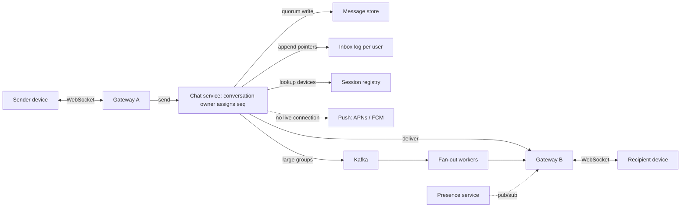

A chat system looks like a message queue with a UI. Unlike almost every other system in this module, though, it keeps a long-lived, stateful connection open to every online device, about 100 million of them at peak. It also promises things users notice immediately when they break: messages arrive in the same order on every device, nothing is lost once the single tick appears, and a phone that was off for a week catches up the moment it comes online. Every one of those promises is a distributed-systems problem wearing a friendly icon.

The senior version of this prompt is not about WebSockets, which every candidate mentions. It is about three harder questions. How does a message find the gateway that holds the recipient's connection? What makes delivery *correct* when that path fails, as it will many times a second? And what do groups and presence do to the arithmetic?

## Requirements

### Functional

- **1:1 and group chats**, with groups up to 1,000 members. Broadcast channels with 100,000+ members are discussed separately.
- **Text plus media references.** Media goes to object storage and a CDN, which is out of scope here.
- **Delivery states**: sent (the server has it), delivered (a recipient device has it) and read.
- **Multi-device**: up to five devices per user, each with full history, in the same order.
- **Offline delivery**: push notifications wake the device, and history syncs on open.
- **Presence and typing indicators**.
- **Out of scope**: voice and video calls, and message search. End-to-end encryption comes up in the follow-ups because it changes several decisions.

### Non-functional

- **Latency**: p99 under 500 ms from send to delivery when both parties are online in the same region, and p50 under 100 ms.
- **Durability**: once the sender sees "sent", the message is never lost.
- **Ordering**: within a conversation, every device shows the same order. There is no global order across conversations, and none is needed.
- **Exactly-once display**: delivery is at-least-once underneath, but the user never sees a duplicate.
- **Availability**: 99.99% for sending.

### Scale

500 million daily users, each sending 40 messages a day. 30% of messages go to groups averaging 20 members. Peak: 100 million connected devices.

## Back-of-envelope estimates

**Messages.** $5 \times 10^8 \times 40 = 2 \times 10^{10}$ per day, which is $2 \times 10^5$/s on average and about 600,000/s at peak.

**Deliveries.** A 1:1 message goes to about 1.5 online recipient devices plus the sender's other devices, roughly 2 deliveries. A group message goes to 19 members × 1.5 devices, roughly 29 deliveries. Weighted: $0.7 \times 2 + 0.3 \times 29 \approx 10$ deliveries per message, so **6 million deliveries/s at peak**. Receipts flow back the other way, so the gateway fleet moves roughly 12 million small frames a second. Groups are 30% of messages and 85% of deliveries, which is worth saying.

**Connections.** At 100 million concurrent connections and a conservative 200,000 per gateway node, the fleet is 500 gateways. WhatsApp publicly described holding around two million connections on a single server as far back as 2012, so 200,000 leaves plenty of headroom for TLS and bursts. At 20–50 KB per connection for TLS state and buffers, 200,000 connections is 4–10 GB of memory per node.

**Heartbeats.** Mobile carrier NATs drop idle TCP mappings after a few minutes, so clients send keepalives. At one per 60 seconds, 100 million connections produce 1.7 million heartbeats a second. That is more packets than the message traffic itself, and each one wakes the phone's radio. The design consequence: the heartbeat interval is a battery and capacity parameter that you tune per network, not a constant you hard-code.

**Storage.** Store each message **once per conversation**, not once per recipient: $2 \times 10^{10} \times 200\ \text{B}$ (100-byte body plus 100 bytes of metadata) is 4 TB/day, about 1.5 PB/year, and about 4.4 PB/year with three replicas, before compression. A mailbox model that copies each message into every recipient's inbox would multiply that by the 10× delivery factor. That single number decides the storage model.

**Session registry.** 750 million devices × about 100 bytes (device → gateway, connection ID, last seen) is 75 GB, which fits in an in-memory store. Mobile devices reconnect about 20 times a day (network switches, backgrounding): $7.5 \times 10^8 \times 20 / 10^5 \approx 150{,}000$ registry updates/s. That is comfortable.

## API design

Clients hold one WebSocket (`wss://chat.example.com/v1/connect`, authenticated at upgrade) carrying small typed frames:

```text
C->S {"type":"send",    "client_msg_id":"c_7f3a", "conv_id":"cv_91", "body":"on my way"}
S->C {"type":"ack",     "client_msg_id":"c_7f3a", "conv_id":"cv_91", "seq":1042, "ts":1727350000123}
S->C {"type":"msg",     "conv_id":"cv_91", "seq":1042, "from":"u_12", "body":"on my way", "inbox_seq":88113}
C->S {"type":"receipt", "conv_id":"cv_91", "up_to_seq":1042, "kind":"delivered"}
C->S {"type":"sync",    "after_inbox_seq":88090}
S->C {"type":"presence","user":"u_12", "state":"online"}
```

Request/response operations use plain HTTPS:

```text
GET  /v1/conversations/{conv_id}/messages?before_seq=1000&limit=50   # scrollback
POST /v1/conversations            {"members": ["u_12","u_40"], "title": "Trip"}
PUT  /v1/conversations/{conv_id}/members/{user_id}
```

Three fields carry the design. `client_msg_id` makes sends idempotent: a retry after a timeout carries the same ID, and the server returns the original `seq` instead of storing a second copy. `seq` is the per-conversation order, assigned by the server. `inbox_seq` is a per-user sequence over every event that concerns the user, and it is the whole basis of sync in deep dive 2.

## Data model

```sql
-- One copy per conversation. Partition = (conv_id, bucket) keeps partitions bounded:
-- bucket = seq / 10000, so a partition holds at most 10,000 messages (~2 MB).
CREATE TABLE messages (
  conv_id    BIGINT,
  bucket     INT,
  seq        BIGINT,
  sender_id  BIGINT,
  client_msg_id TEXT,
  body       BLOB,          -- ciphertext if end-to-end encrypted
  sent_at    TIMESTAMP,
  PRIMARY KEY ((conv_id, bucket), seq)
) WITH CLUSTERING ORDER BY (seq DESC);

-- Per-user ordered log of pointers: "something happened in conv X at seq Y".
CREATE TABLE inbox (
  user_id    BIGINT,
  inbox_seq  BIGINT,
  conv_id    BIGINT,
  kind       SMALLINT,      -- message, receipt, membership change
  ref_seq    BIGINT,
  PRIMARY KEY (user_id, inbox_seq)
);

-- Per-device progress: the only state sync needs from the device.
CREATE TABLE device_cursor (
  user_id BIGINT, device_id TEXT, delivered_inbox_seq BIGINT,
  PRIMARY KEY (user_id, device_id)
);
```

This is a wide-column shape (Cassandra, ScyllaDB, HBase) because every query is "a range within one partition, newest first". Discord has publicly described storing messages partitioned by channel and a fixed time bucket for the same reason: unbounded partitions become the hot, slow ones. [Wide-column stores](/learn/databases/nosql-and-specialised/wide-column-stores) covers the modelling style. Membership (`conv_id → members`), the user's conversation list, and the **session registry** (`device_id → gateway`, with a TTL refreshed by heartbeats, in Redis) complete the model.

## High-level design



Walk one message through it. Device 1 sends over its WebSocket to gateway A. The gateway is deliberately dumb: it terminates connections and forwards frames. The chat service instance that **owns** conversation `cv_91` (conversations are consistent-hashed to owners) assigns `seq = 1042`, writes the message to the store with a quorum write, and appends inbox pointers for each member. Only then does it ack the sender, which shows the single tick. It then looks up the recipients' devices in the session registry and pushes the frame to gateway B, which writes it to device 2's socket. Device 2 acks with a receipt, and the sender gets the double tick. Recipients with no live connection get a push notification instead.

```viz
{"type": "network", "scenario": "websocket-upgrade",
 "title": "One long-lived connection per device",
 "caption": "The client upgrades an HTTPS request to a WebSocket and then keeps it open for hours. Each of the 500 gateways holds about 200,000 of these, and that state is exactly what makes deploys, crashes and routing the hard parts of chat."}
```

## Deep dives

### 1. Connections, routing and the reconnect storm

| Transport | Server push | Cost at 100M devices | Verdict |
|---|---|---|---|
| Short polling every 5 s | No; up to 5 s latency | 20M requests/s of mostly empty responses | No |
| Long polling | Yes, one request per message | A new HTTP request after every message, plus headers | Fallback only |
| Server-sent events | Server to client only | Needs a second channel for sends | Fine for feeds, awkward for chat |
| WebSocket | Both directions, framed | One TLS connection per device | Default |
| MQTT over TCP/TLS | Both directions, tiny headers, QoS levels | Same connection count, fewer bytes | Common for mobile; Facebook publicly described using it for Messenger |

[Real-time transports](/learn/networking/application-protocols/real-time-transports) compares these in depth. Choosing WebSocket is the easy part. The hard part is that the gateway fleet is now **stateful**: a message for device 2 can only be delivered through the one gateway that holds its socket.

**Routing.** There are three ways to find that gateway:

1. **Session registry plus direct RPC (chosen).** On connect, the gateway writes `device → gateway` with a TTL and refreshes it with heartbeats. The chat service looks up a recipient's devices, which is one batched call even for a 1,000-member group, and RPCs the right gateways. It is simple and fast. The registry can be stale for a few seconds after a crash.
2. **Pub/sub channel per user.** Gateways subscribe to channels for their connected users, and senders publish to the recipient's channel. The routing table disappears into the pub/sub system, which must then handle 100 million subscriptions and their churn. That is a hard system in its own right.
3. **A queue per gateway.** Senders enqueue to the gateway's queue. This adds durability to a path that does not need it, because the store already has the message.

**The fast path is an optimisation; the slow path is the correctness path.** Direct delivery will fail many times a second: stale registry entries, a gateway mid-crash, a phone that just entered a tunnel. None of those lose a message, because the message is already in the store, the recipient's inbox log already points at it, and the device will fetch it on its next sync. A failed direct delivery falls through to a push notification, and the push only has to wake the app. Saying this explicitly is the senior signal: *correctness never depends on the live connection*.

**Deploys and crashes.** Each gateway holds 200,000 connections. To deploy, **drain** the gateway: stop accepting new connections and ask connected clients to reconnect elsewhere over about 10 minutes, which is roughly 330 reconnects/s per gateway. That is gentle. A *crash* is the dangerous case, because all 200,000 clients notice at once. Without jitter they all reconnect in the same second and pay a TLS handshake each, and a regional incident that drops 30 million connections becomes a self-inflicted DDoS on the survivors. Clients must reconnect with **exponential backoff and full jitter**, and gateways should shed new handshakes beyond a rate they can complete rather than accept them all and time out ([Resilience patterns](/learn/system-design/building-blocks/resilience-patterns)).

### 2. Ordering, idempotent sends and sync

**Ordering needs one sequencer per conversation.** Client clocks are wrong, and two senders in a group send concurrently, so the server must pick the order. The conversation's **owner** (a chat-service instance chosen by consistent hashing on `conv_id`) assigns `seq` as the next integer. There is one writer per conversation, so there is no coordination on the hot path, and conversations are independent, so the design scales horizontally. Failover is the subtle part: while ownership moves, two instances may briefly both believe they own `cv_91` and both assign 1043. Make the store the referee. The message write is conditional on `(conv_id, seq)` not existing, and ownership carries a lease with a fencing token, so a deposed owner's writes are rejected ([Failure detection and leases](/learn/system-design/distributed-systems/failure-detection-and-leases)).

**Sends are idempotent.** The sender's app times out and retries with the same `client_msg_id`. The owner keeps a short-lived map of recent `client_msg_id → seq` per conversation, and a duplicate gets the original ack back, not a second message. That is the difference between "at-least-once" and a user seeing their message twice ([Idempotency and retries](/learn/system-design/building-blocks/idempotency-and-retries)).

**The "sent" tick means durable.** The ack goes out only after a quorum write to the message store. Acking earlier, from memory, makes the tick a lie during a crash.

**Sync with one cursor per device.** A naive sync sends the server a cursor for every conversation ("cv_91: 1030, cv_17: 88, ..."). For a user in 300 conversations that is a large request on every reconnect, and the server must check 300 partitions. The better design gives each user a single ordered **inbox log**: every event that concerns them (new message in any conversation, receipt, membership change) is appended as a small pointer with the next `inbox_seq`. A device remembers one number, the last `inbox_seq` it processed, and sync is "give me everything after 88,090", which is one partition range read. Facebook has publicly described this shape for Messenger: a per-user ordered queue of updates with a pointer per device, so reconnecting only fetches what the device has not seen.

The inbox log is written once per member, so it is a fan-out, but of 20-byte pointers, not message bodies. For a 20-member group that is 20 small writes per message, a good trade for single-cursor sync. For a 100,000-member channel it is not, which is why channels use a different model (next deep dive).

**Exactly-once display** combines three things: at-least-once delivery (the fast path plus sync), idempotent storage (the same `client_msg_id` gets the same `seq`), and client-side deduplication by `(conv_id, seq)`. The device also detects gaps: if it holds 1042 and receives 1045, it fetches 1043–1044 before rendering them in order. Show the gap-fill as a brief loading state, never as a reorder.

### 3. Groups, channels and presence

**Small groups (up to 1,000 members)**: store the message once, append inbox pointers for every member, look up online devices in one batched registry call, and deliver. At 1,000 members that is 1,000 inbox appends and about 1,500 device deliveries per message, which is fine for occasional traffic. It becomes a problem when a 1,000-member group is busy during a live event. Move the fan-out off the owner onto Kafka-fed workers, so that one hot group cannot stall the owner's other conversations.

**Broadcast channels (100,000+ members)**: switch to **fan-out on read**. Do not append inbox pointers or push every message to every member. Store the message once, push a lightweight "channel updated" signal only to members who have the channel open, and let everyone else read the channel's latest messages when they open it, using a per-member read cursor. This is the same push/pull split as the [news feed](/learn/system-design/case-studies/news-feed), for the same arithmetic reason.

**Presence is a fan-out bomb.** 100 million online users, each with about 200 contacts, change state (foreground, background, offline) about every 10 minutes: $10^8 / 600 \approx 170{,}000$ changes/s, × 200 contacts = **33 million presence notifications/s**, almost all of them to people who are not looking. The fix is **subscribe on view**. A client subscribes to presence only for the users on its screen right now (the open chat, the visible part of the contact list, perhaps 20 people) and unsubscribes when they scroll away. Presence changes are published to a per-user channel, and only gateways with a subscriber receive them. Two more details matter. Debounce "offline" for about 30 seconds, because a phone switching from Wi-Fi to cellular should not flash offline to 200 people. And make "last seen" a coarse, lazily written timestamp, not a stream.

```viz
{"type": "system", "scenario": "pubsub",
 "title": "Presence: publish per user, deliver only to subscribers",
 "caption": "A status change is published once to the user's topic. Only gateways with a client that currently has that user on screen are subscribed, so the fan-out follows attention, not the contact list."}
```

**Typing indicators** are ephemeral. They are never stored, never retried, rate-limited to about one every three seconds per user, and the first thing dropped under load. Say so, because treating them like messages wastes the durable path on data that is worthless two seconds later.

## Failure modes

**A gateway crashes.** 200,000 devices reconnect with jitter, mostly within a minute. Messages that were acked are already durable, and anything that was in flight to those devices is fetched by their next sync. Registry entries pointing at the dead gateway expire by TTL. Until then, deliveries to it fail fast and fall through to push. Degradation: some recipients see messages a few seconds late. No messages are lost.

**The session registry is unavailable.** Direct delivery stops, and everything goes to push notifications plus sync on open. Latency degrades from 100 ms to seconds. Correctness holds, because the registry sits only on the fast path.

**A message-store partition is slow.** Sends in the affected conversations time out, and clients retry with the same `client_msg_id`, so there are no duplicates. The sender sees a clock icon instead of a tick, which is honest. Do not ack from memory to hide the slowness.

**Ownership moves mid-conversation.** Two owners briefly assign the same `seq`. The conditional write and the fencing token reject the deposed owner's write, and its client retries through the new owner.

**Push providers delay or drop notifications.** APNs and FCM are best-effort and throttle aggressively. A missed push means the user sees the message when they next open the app, because sync is the guarantee and push is the doorbell.

**Reconnect storm after a regional incident.** Tens of millions of clients reconnect at once. Jittered backoff on the client and handshake admission control on the gateways turn a thundering herd into a ramp. Capacity-plan the surviving regions for the handshake rate, not just the connection count.

**A device's clock is wrong.** Nothing breaks, because nothing orders by device time: order is `seq`, and display timestamps come from the server.

## Senior follow-ups

**Q: "How does end-to-end encryption change the design?"**

The server becomes a router and store for ciphertext it cannot read, and several features move. Server-side search, content previews in push notifications and server-side spam classification of content all go away or move to the device. Multi-device becomes a key-management problem, because each device has its own keys, so a 1:1 message is encrypted separately for each recipient device and for the sender's other devices. For groups, WhatsApp's public security whitepaper describes "sender keys": each member distributes a sender key to the others once over pairwise sessions, then encrypts each group message once. Membership changes then force key rotation. The server still owns ordering (`seq`), idempotency, storage, routing and receipts, and none of that needs plaintext. History sync to a new device needs a device-to-device transfer or an encrypted backup, because the server cannot re-encrypt old messages.

**Q: "Deploy a new gateway version without dropping 100 million connections."**

Roll gateways a few percent at a time. Drain each one: stop new connections, send a "reconnect elsewhere" control frame to its clients spread over about 10 minutes, and wait until it is empty or a deadline passes. The load balancer steers reconnects to already-upgraded nodes. Keep the frame protocol backward compatible so old clients work with new gateways. Canary on the first few gateways with connection-success rate, delivery latency and reconnect rate as the gates. At 500 gateways and 5% at a time, a full rollout takes a few hours, which is the price of stateful connections.

**Q: "Why not one Kafka topic per conversation, or Kafka as the message store?"**

Kafka partitions are heavyweight (files, replication, leader election) and a cluster is comfortable with thousands to low hundreds of thousands of them, not billions of conversations. Hashing conversations onto partitions keeps per-conversation order, but Kafka cannot answer "give me messages 900 to 950 of cv_91" without scanning, and scrollback is a core feature. Kafka is a good transport for large-group fan-out work. The system of record is a store built for partition-range reads.

**Q: "How do read receipts work in a 500-member group?"**

Not as a message per member per message, which would be 500 receipts for every message. Each member's device sends a cursor update, "read up to seq 1042", coalesced to at most one every few seconds. The server stores one read cursor per member per conversation. "Read by 312 of 500" and "read by everyone" are computed from the cursors on demand, when the sender opens the message info screen. Receipts become O(members) small cursor writes per few seconds, independent of message volume.

**Q: "History for years at 4.4 PB/year: how do you keep it affordable?"**

Most reads touch recent messages, and scrollback into last year is rare. Keep recent buckets on fast storage and compact older ones into compressed, immutable files on object storage, with an index from `(conv_id, bucket)` to file and offset. Text compresses two to three times. Media, which is the real cost, has its own tiering. Deleting a conversation is a tombstone in hot storage and a scheduled rewrite of cold files. The cold-read path adds latency to deep scrollback, which users accept.

**Q: "A phone is off for two weeks. What happens when it comes back?"**

It connects, authenticates and sends `sync after_inbox_seq = N`. The server streams the pointers since N in pages. If there are too many, say more than 10,000, it tells the device to resync conversation summaries instead: the latest few messages and the unread count per conversation, with full history lazily on open. Push notifications sent during the two weeks were best-effort, and the sync is what makes it correct. If the inbox log had been trimmed past N, the device falls back to the same summary resync, which is why log retention is a product decision with a defined fallback.

## Senior signals

- You separate the fast path (direct delivery through the session registry) from the correctness path (durable store, inbox log, sync), and nothing correct depends on a live socket.
- You assign order with one sequencer per conversation, fence ownership changes, and never order by device clocks.
- You make sends idempotent with a client message ID and define "sent" as durably stored.
- You design sync around a single per-device cursor into a per-user log, and you know when that fan-out stops paying off (channels).
- You do the presence arithmetic and switch to subscribe-on-view before the interviewer asks.
- You plan for the reconnect storm: draining for deploys, jittered backoff and handshake admission control for crashes.

## Check yourself

```quiz
- q: >-
    A message is acked to the sender and stored, but direct delivery fails because the registry points at a gateway that just crashed. What guarantees the recipient still gets it?
  options: ["The sender's device resends it after it does not see a delivery receipt", "The push notification carries the message, so the device can display it", "The gateway replays its in-memory queue for that device as soon as it restarts", "The inbox log points to the stored copy, so the device's next sync gets it"]
  answer: 3
  explanation: >-
    Durable storage plus the per-user inbox log is the correctness path, and live delivery is only an optimisation. The push notification only has to wake the app so it syncs; APNs and FCM are best-effort. Gateways hold no durable state, and relying on the sender to resend would break exactly-once display.
- q: >-
    Two members of a group send messages at nearly the same time from phones with different clock offsets. How does every device end up showing the same order?
  options: ["The conversation's owner assigns seq numbers, and devices render by seq", "Every device sorts by the time each message arrived at that device", "Every device sorts by the sender's device timestamp carried in each message", "Each gateway assigns seq numbers to the messages its own devices send"]
  answer: 0
  explanation: >-
    One sequencer per conversation gives a total order within the conversation, with no cross-conversation coordination. Device clocks disagree and arrival order differs per device. Per-gateway numbering fails because two senders in one group are usually on different gateways, so their numbers conflict.
- q: >-
    The sender's app times out and retries a send. Which mechanism prevents the recipient from seeing the message twice?
  options: ["Read receipts tell the sender's app the first copy already arrived", "TCP retransmission guarantees each frame reaches the gateway only once", "The gateway drops any message whose text matches the sender's last one", "The retry reuses client_msg_id, so the owner returns the original seq"]
  answer: 3
  explanation: >-
    Idempotency keys turn at-least-once sends into one stored message: a duplicate client_msg_id gets the original ack back, and devices deduplicate redelivery by (conv_id, seq). TCP cannot help, because the retry is a new application-level send. Text-based dedupe would wrongly drop a user who really did send "ok" twice.
- q: >-
    100 million online users with 200 contacts each change presence state about every 10 minutes. Why does the design subscribe to presence only for users on screen?
  options: ["Pushing every change to all contacts is about 33 million deliveries/s", "Offline must be debounced for 30 s, which only works for visible users", "Presence is private, so it may only be shown to users who open a chat", "Presence must be strongly consistent, which is only affordable for a few users"]
  answer: 0
  explanation: >-
    10^8 / 600 s is about 170,000 changes per second, and x 200 contacts that is about 33 million deliveries per second, almost all to people not looking. Limiting subscriptions to the roughly 20 users visible on screen makes fan-out follow attention. Presence is deliberately weakly consistent, and the offline debounce is a separate detail that applies to every user.
- q: >-
    Why does the design use a per-user inbox log of pointers for small groups but fan-out on read for 100,000-member channels?
  options: ["Channel messages are too large for a 20-byte inbox pointer to reference", "Kafka cannot hold 100,000 consumer groups, one per channel member", "Inbox pointers cost one write per member, which is 100,000 per message", "Channels need no ordering, so a per-member log adds nothing for them"]
  answer: 2
  explanation: >-
    It is the same push/pull arithmetic as the news feed. Per-member pointers buy single-cursor sync, which is cheap at 20 writes per message for a small group but becomes 100,000 writes per message for a channel, so channels store once and members pull on open. Channels keep ordering through seq exactly like groups, and a pointer's size does not depend on the message's.
```
