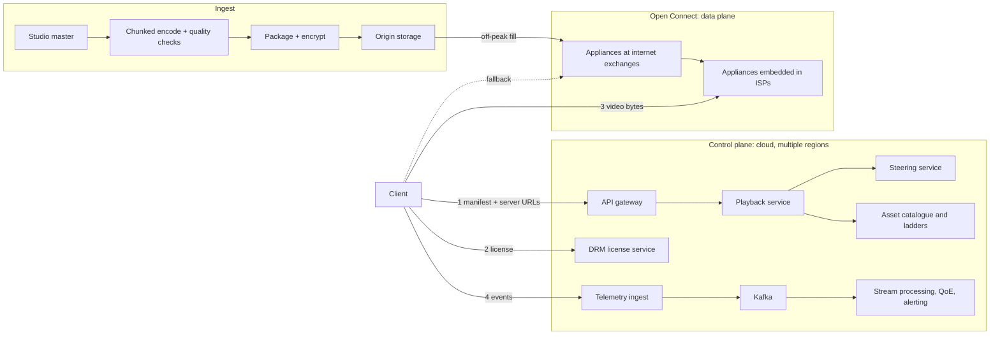
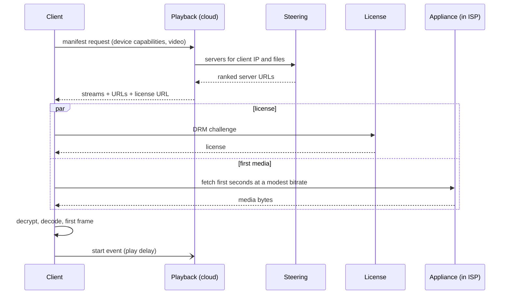

At 9 pm in São Paulo someone presses play on a television. Within a second or two, video starts at the best quality their connection can sustain, and it plays for two hours without stalling while the household's other devices fight for the same Wi-Fi. At that same moment, tens of millions of other people are doing the same thing. "Design Netflix" is the prompt that tests whether you know where the difficulty in that experience actually lives.

It does not live in storing video or in the web application. It lives in three places that most candidates never reach. The first is **encoding**: each title is turned into many renditions, and choosing them per title saves a meaningful fraction of every byte ever sent. The second is **delivery**: at hundreds of terabits per second, the bytes cannot come from a cloud region. Netflix built its own CDN, Open Connect, with servers placed inside ISPs' networks and filled overnight with what people will watch tomorrow. The third is the **client**: the player chooses a bitrate every few seconds from buffer levels and throughput samples, because it is the only component that can see the last mile.

Netflix publishes an unusual amount of this architecture in its technology blog, its Open Connect partner documentation, open-source projects and academic papers. This lesson uses only that public material, says "publicly described" where a specific claim comes from it, and labels its own numbers as assumptions. Where the public record is silent, the lesson tells you what a reasonable design would do, and the difference matters in an interview. Claiming inside knowledge you do not have is the fastest way to lose a Netflix interviewer.

## Requirements

### Functional

- **Play** any title on thousands of device types (TVs, phones, browsers, consoles), each with its own codecs, DRM system, maximum resolution and HDR support.
- **Start fast, adapt continuously**, allow seeking, and **resume** from the last position across devices.
- **Many audio and subtitle tracks** per title.
- **Ingest**: turn a studio's master file into every rendition, check its quality, and have it ready worldwide before a fixed launch time.
- **Measure** the quality of experience of every session, and run A/B tests on streaming algorithms.
- **Out of scope**: the browse UI and recommendation models (touched on in the follow-ups), billing, downloads for offline viewing, and live events.

### Non-functional

These are targets for this design, not Netflix's published figures:

- **Play delay** (press to first frame): p50 about 1 s, p95 under 3 s.
- **Rebuffering**: a small fraction of a percent of viewing time. A stall is the most damaging event in a session.
- **Quality**: maximise perceptual quality per bit within each viewer's bandwidth.
- **Availability**: stream starts succeed more than 99.99% of the time, and playing streams survive a control-plane outage.
- **Cost**: the cost per hour streamed is a first-class requirement, because egress volume dominates everything else.

### Scale (assumptions)

250 million member accounts, a global peak of 40 million concurrent streams, an average delivered bitrate of 5 Mbps across devices (phones well under that, 4K TVs well over), an average of one hour viewed per account per day, and a catalogue of 50,000 content hours.

## Back-of-envelope estimates

**Peak egress.** $4 \times 10^7 \times 5\ \text{Mbps} = 2 \times 10^8$ Mbps = **200 Tbps**.

**Daily volume.** One hour at 5 Mbps is $5 \times 3{,}600 / 8 = 2{,}250$ MB, about 2.25 GB. $2.5 \times 10^8$ hours/day × 2.25 GB ≈ $5.6 \times 10^8$ GB, which is about **560 PB per day**. Check it against the peak: 560 PB over 86,400 s averages about 52 Tbps, so the evening peak is about four times the average, which is plausible for a service watched after dinner.

**What that costs if you buy it.** Even at a fraction of a cent per GB, $5.6 \times 10^8$ GB/day comes to millions of dollars a day and on the order of a billion dollars a year. The same bytes also cross ISPs' interconnects and backbones, which costs the ISPs money and congests them at exactly the hour everyone is watching. *This number is the reason a streaming company builds its own CDN and puts it inside other companies' networks.*

**Edge fleet.** Netflix engineers have publicly described single servers pushing hundreds of Gbps of TLS-encrypted video. Assume a conservative 100 Gbps per appliance: 200 Tbps needs 2,000 appliances running flat out. Plan for about 50% utilisation, redundancy in every site and presence in thousands of ISP locations, and you get several thousand appliances. That is a fleet you design, build, ship and operate. It is not a line item on a cloud bill.

**Catalogue size.** Each content hour exists in many renditions. Assume the video ladders across codecs (H.264, HEVC, VP9, AV1) sum to about 60 Mbps of bitrate, and about 20 audio tracks at about 0.25 Mbps each add 5 Mbps. That is 65 Mbps × 3,600 s / 8 ≈ 29 GB per content hour, and × 50,000 hours ≈ **1.5 PB for the entire catalogue in every format**. The whole catalogue is small next to one day's egress (560 PB). So a site with a few large storage appliances can hold everything, while a site with limited space holds only what is likely to be watched. The design exploits this asymmetry directly.

**Encoding leverage.** A title watched for 10 million hours at 5 Mbps sends $10^7 \times 2.25$ GB = 22.5 PB. A 20% bitrate saving at equal quality is 4.5 PB never sent, for one title. Even if the better encode costs thousands of extra CPU-hours, it is paid once, while the saving recurs on every view. *Encoding efficiency is multiplied by the egress bill*, which is why Netflix invests so heavily in it.

**Control plane.** Stream starts ≈ concurrent streams / average session length ≈ $4 \times 10^7 / 2{,}700\ \text{s} \approx 15{,}000$ per second at peak, with spikes several times higher at the top of the hour and at big launches. Each start costs a manifest call, a DRM license and a few metadata calls. That is a large but ordinary microservice load. The browse UI generates far more requests than playback does.

**Telemetry.** Say each stream sends a heartbeat every 30 seconds plus events (start, bitrate switch, rebuffer, error, stop). At 40 million streams that is about 1.3 million heartbeats/s, roughly 2 million events/s in total. At about 1 KB each, that is about 2 GB/s, or 170 TB/day raw. The QoE pipeline is a big-data system in its own right.

## API design

This is a sketch consistent with the public descriptions, not Netflix's actual API:

```text
POST /playback/manifest
  {"video_id": 80100172, "profile_id": "p_91",
   "device": {"model": "tv-2024-x", "codecs": ["av1", "hevc", "avc"], "drm": "widevine-l1",
              "max_res": "2160p", "hdr": ["dolby-vision", "hdr10"], "audio": ["atmos", "5.1"]},
   "network": {"type": "wifi"}}
  -> 200 {"session_id": "s_7c1e",
          "video": [{"stream_id": "v_av1_1080_3200", "codec": "av1", "res": "1920x1080", "kbps": 3200}, ...],
          "audio": [...], "text": [...],
          "urls": [{"host": "oca-a.isp-example.net", "rank": 1},
                   {"host": "oca-b.isp-example.net", "rank": 2},
                   {"host": "oca-ix1.example.net",   "rank": 3}],
          "url_expires_s": 21600, "license_url": "...", "start_position_s": 1834}

POST /license            {"session_id": "s_7c1e", "challenge": "<DRM blob>"}  -> {"license": "<DRM blob>"}

GET  https://oca-a.isp-example.net/<file_id>?token=<signed, expiring>
     Range: bytes=...                                                      -> media bytes

POST /events             {"session_id": "s_7c1e", "events": [
                            {"t": 0,    "type": "start", "play_delay_ms": 910, "kbps": 1750},
                            {"t": 38.2, "type": "switch", "from": 1750, "to": 3200},
                            {"t": 612,  "type": "rebuffer", "ms": 1400}]}

PUT  /bookmarks/{profile_id}/{video_id}   {"position_s": 2410}
```

Point out three things. The **manifest is computed per session**: it lists only the streams this device can decode and is licensed for, and it includes the **URLs of specific servers**, which is how steering works without DNS tricks. The media URLs carry **signed, expiring tokens**, so an appliance can authorise a request without calling home. And telemetry is batched and **fire-and-forget**: nothing in playback waits for it.

## Data model

- **Asset catalogue**: `video_id → encodes[]`, each with codec, resolution, bitrate, a quality score, `file_id`, size and checksum. The ladder is per title, so it is data, not configuration.
- **Appliance inventory**: `oca_id → site, ISP network, type (storage or flash), capacity, health, load`, plus the **client IP prefixes** each embedded appliance serves, which it learns from the ISP over BGP (more on this below).
- **Placement**: per site, the set of `file_id`s it should hold tomorrow (its fill manifest), and per appliance, what it actually holds, reported back so steering never sends a client to a file that is not there.
- **Sessions and telemetry**: `session_id → profile, video, device, streams, servers`. Events stream into a log and then a warehouse, partitioned by date.
- **Bookmarks and viewing history**: `(profile_id, video_id) → position`. Written every minute or so of playback, which at 40 million streams is several hundred thousand writes a second, a wide-column-store workload keyed by profile. Netflix has publicly described keeping viewing history in Cassandra.

## High-level design



The public description of the split is simple: everything up to the moment you press play (browsing, personalisation, sign-in, the playback decision) runs in the cloud control plane, and the video itself comes from Open Connect. The two planes scale on completely different axes, requests per second against bits per second. They also fail independently, and the design depends on that.

## Deep dives

### 1. The encoding ladder: per title, then per shot

A **ladder** is the set of renditions (resolution, bitrate, codec) that the player switches between. The classic approach is one fixed ladder for everything. Netflix's 2015 post introducing per-title encoding published the fixed ladder it had used, running from 235 kbps at 320×240 up to 5,800 kbps at 1080p. A fixed ladder is wrong in both directions at once. A flat, clean animated title looks the same at 1080p and 2 Mbps as at 5.8 Mbps, so the top rung wastes most of its bits. A grainy, high-motion film shows artefacts even at 5.8 Mbps, so its top rung is starved.

**Per-title encoding**, as publicly described, measures instead of assuming:

1. Encode the title at many resolution and quality-setting combinations.
2. Score each encode with a **perceptual quality metric**. Netflix developed and open-sourced **VMAF**, which is trained on human quality ratings and reported on a 0–100 scale.
3. For each resolution, plot quality against bitrate. At low bitrates, a lower resolution upscaled on the TV beats a higher resolution starved of bits, and at high bitrates the order flips. The **upper convex hull** across all the resolution curves is the efficient frontier: for every bitrate, the resolution that looks best.
4. Place ladder rungs along the hull, spaced so that each step up is a visible improvement.

Here is an illustrative example (the numbers are made up to show the shape):

| | Fixed ladder top rung | Per-title top rung | Effect |
|---|---|---|---|
| Flat animation | 1080p at 5.8 Mbps | 1080p at ~2 Mbps, same quality score | About 65% fewer bits for top-rung viewers |
| Grainy action film | 1080p at 5.8 Mbps, visibly degraded | 1080p at ~7.5 Mbps | Quality restored where it was missing |
| Mid-bandwidth viewer at 1.5 Mbps | 720p, soft | 1080p for the animation | Better picture at the same bandwidth |

**Per-shot encoding** takes the idea further. Netflix has publicly described a "dynamic optimizer" that splits a title into shots, which are stretches of consistent visual content. It encodes each shot at several settings and then chooses a setting per shot to maximise quality at a target average bitrate. Bits flow from easy shots (a static dialogue scene) to hard ones (an explosion, rain, film grain). Shot boundaries are also natural places for keyframes, which suits the chunked, parallel encoding described below.

**Codecs multiply the ladder.** H.264 plays everywhere. HEVC serves 4K and HDR televisions. VP9 and AV1 give substantially better compression, and Netflix has publicly announced streaming AV1 to devices that support it. Each newer codec costs far more encoding compute per content hour, so the estimate from above decides the policy: pay the compute once for any title that will be watched enough, and let the per-view egress saving repay it.

**The pipeline.** A studio delivers a very high-bitrate master. The pipeline validates it, splits it into chunks at shot boundaries, encodes the chunks in parallel on a large compute fleet (Netflix has described borrowing idle reserved cloud capacity for encoding), reassembles and checks each stream with automated quality checks and quality-score thresholds, then packages and encrypts for each DRM system and publishes to origin storage. [Video upload pipeline](/learn/system-design/case-studies/video-upload-pipeline) works through the chunked-encode DAG in detail. For a studio catalogue, the difference is that there is time: a title is delivered weeks before launch, so the pipeline can afford the expensive per-shot, multi-codec work on every title.

### 2. Open Connect: appliances inside ISPs, filled off-peak

Open Connect is Netflix's own CDN. The public description has two deployment models:

- **Embedded appliances** sit inside an ISP's network, close to subscribers. Netflix provides them to qualifying ISPs at no charge. The ISP supplies space, power and connectivity, and in return Netflix traffic stops crossing its interconnects and much of its backbone.
- **Appliances at internet exchange points**, where Netflix interconnects with many ISPs directly. They serve ISPs without embedded appliances and act as the upstream tier for the embedded ones.

The appliances come in storage-heavy variants (lots of disk, a large share of the catalogue) and flash variants (less capacity, very high throughput for the most popular files). The software is publicly described as FreeBSD with NGINX, with years of published work on pushing TLS-encrypted video through a single server at hundreds of Gbps.

**Why build it?** There are three reasons, in order. Cost: the egress estimate above. Quality: a server inside the ISP is a few milliseconds away with little loss, so TCP can sustain higher throughput and the player can pick a higher rung. Control: Netflix owns the software, the logging and the steering, so it can change delivery behaviour and see exactly what happened in every session.

**Proactive fill instead of pull-through caching.** A classic CDN caches on demand: the first request for an object misses, fetches from origin, and caches it for later requests.

```viz
{"type": "network", "scenario": "cdn-cache", "title": "Classic pull-through caching",
 "caption": "The first viewer's request misses and goes to origin; later requests hit the edge. Open Connect is publicly described as working differently: appliances are filled ahead of demand during an off-peak window, so a miss at 9 pm, the worst possible moment to fetch across the internet, is rare by design."}
```

Open Connect is publicly described as **proactive**. Every day, the system predicts what each site's members are likely to watch, computes which files each site should hold, and the appliances download changes during an **off-peak fill window** agreed with the ISP, typically in the early morning when links are idle. Four facts about Netflix's workload make this work, and you should say them, because they are what make the design transferable or not:

1. **The catalogue is finite and known in advance.** Tomorrow's releases are scheduled weeks ahead. A news site or a social network cannot say this.
2. **Popularity is predictable.** Viewing history and personalisation signals forecast demand per region well, and Netflix has written publicly about content-popularity prediction for placement.
3. **The catalogue is small relative to demand.** 1.5 PB against 560 PB a day means that placement, not capacity, is the problem.
4. **Off-peak bandwidth is nearly free.** The ISP's links are idle at 4 am, so filling then shifts load out of the peak instead of adding to it.

**Tiered fill.** Not every appliance pulls from origin. The public description is tiered: appliances at exchange points fill from origin storage, and embedded appliances fill from nearby appliances upstream or from peers in the same site. That cuts origin egress and keeps fill traffic on the shortest paths.

**Placement arithmetic.** Suppose an embedded site has 200 TB of usable storage against a 1.5 PB catalogue, so it can hold about 13% of all bytes. Viewing is heavily skewed: a small head of popular titles takes most of the hours. So a site holding the predicted head, in the encodes its members' devices actually use, serves the large majority of its traffic locally, and the long tail goes to an exchange-point site that holds everything. The site's hit ratio is a function of prediction quality and storage size, and both are levers. The ISP's backbone savings depend on that hit ratio.

**Within a site, files are spread by consistent hashing.** Netflix has publicly described using consistent hashing to distribute content across the appliances in a site. The property that matters is that any component can compute which appliance should hold a file without a per-file lookup table, and adding an appliance moves only its share of files. The design also has to place the most popular files on more than one appliance, so that no single machine takes all of a hit title's traffic.

```viz
{"type": "system", "scenario": "consistent-hashing", "nodes": 4,
 "keys": ["title-81:av1-1080", "title-81:hevc-2160", "title-17:avc-720", "title-44:av1-1080", "title-17:audio-en", "title-44:avc-480"],
 "title": "Spreading a site's files across its appliances",
 "caption": "Each file hashes to a position on the ring and lives on the next appliance clockwise. Adding an appliance to a site moves only the files on the arc it takes over, which matters when a fill window is only a few hours long."}
```

### 3. Steering: which server serves which client

When the playback service builds a manifest, it asks the **steering service** for a ranked list of appliances. The public descriptions centre on the first three inputs below, and a reasonable design adds the fourth:

- **Which appliances cover this client's IP.** An embedded appliance runs a BGP session with the ISP, and the ISP announces the client IP prefixes that the appliance should serve. The ISP, not Netflix, decides which of its subscribers use which appliance, which fits how ISPs think about their own network regions.
- **Which appliances hold the needed files**, from the inventory each appliance reports.
- **Health and load.** An appliance that is failing, or already near its capacity for the evening peak, is ranked down or left out.
- **Network proximity and past performance** for that prefix.

The output is a short, ranked list of URLs with signed tokens, typically the embedded appliances first and an exchange-point appliance as a fallback. Because the manifest carries several URLs, the client can move to the next one without another control-plane round trip.

**Why application-level steering instead of DNS?** DNS-based CDNs steer by the IP of the client's DNS resolver, which may be far from the client, and their answers are cached for the record's TTL, so they react slowly. Netflix's control plane sees the client's actual IP, knows file-level availability, and can give each session its own list. When a site saturates at peak, steering sends *new* sessions to the next-best site (the overflow), while existing sessions keep playing and let their players adapt. The trade-off is that steering is only as fresh as the inventory and load reports behind it, so those reports are part of the critical path for play quality, if not for play itself.

### 4. The playback start path



Here is a budget for a sub-second start. It is a design target built from the latency numbers, not a published figure:

| Step | Time | How it stays small |
|---|---|---|
| Manifest round trip | 100–200 ms | Warm, reused connection to the API; manifest may be prefetched |
| License | 100–200 ms, in parallel | Requested alongside the first media fetch, or prefetched |
| TLS to the appliance | 1 round trip, ~10–20 ms | TLS 1.3; the appliance is inside the ISP |
| First ~2 s of video at 1.75 Mbps (~440 KB) on a 20 Mbps link | ~200 ms | Start below the eventual rung, then ramp up |
| Player setup, DRM session initialisation | 100–200 ms | Overlapped with the manifest call where possible |
| Decode and render | 50–100 ms | Segments begin on a keyframe |
| **Total** | **~0.5–0.7 s** | Leaves headroom inside the 1 s p50 target for slower networks |

The techniques are standard, and a senior candidate lists them without prompting. **Prefetch** the manifest, and even the license, for the title the member is hovering over. **Start at a modest bitrate** and ramp, using a throughput estimate remembered from the last session. **Parallelise** the license with the first media fetch. **Align resume points** to the nearest keyframe. **Keep connections warm.** Every one of these trades a little wasted work (a prefetch for a title that was never played) for time-to-first-frame, which is the metric members feel most.

### 5. Adaptive bitrate on the client

The player downloads video a few seconds at a time into a buffer and, before each download, chooses which rung to fetch. Only the client sees the last mile (the home Wi-Fi, the congested mobile cell, the sibling's game download), which is why this decision is made on the device and not by the server.

**Throughput-based ABR** estimates bandwidth from recent downloads (for example, a harmonic mean of the last few), multiplies by a safety factor such as 0.8, and picks the highest rung below that. Its weakness is that throughput estimates are noisy: TCP ramp-up, competing flows and Wi-Fi interference make them swing. Overestimate and the buffer drains into a stall. Underestimate and quality is needlessly low. Both cause oscillation.

**Buffer-based ABR** was studied in a SIGCOMM 2014 paper by Stanford and Netflix researchers who ran the experiment in Netflix's production service. It chooses the bitrate from **buffer occupancy** instead. Below a **reservoir** (say 10 seconds of video), fetch the lowest rung to protect against a stall. Above the reservoir plus a **cushion**, fetch the highest. In between, map buffer level linearly onto the ladder. The buffer is a direct, low-noise measure of whether downloads are keeping up. The paper reported fewer rebuffers without sacrificing average quality, and it also described using a capacity estimate during **startup**, when the buffer is empty and a pure buffer rule would sit at the lowest rung for too long.

```python
LADDER_KBPS = [235, 750, 1750, 3000, 4300, 5800]   # illustrative; the real ladder is per title and device

def choose_bitrate(buffer_s: float, reservoir_s: float = 10.0, cushion_s: float = 40.0) -> int:
    """Buffer-based rate selection: map buffer occupancy onto the ladder."""
    lo, hi = LADDER_KBPS[0], LADDER_KBPS[-1]
    if buffer_s <= reservoir_s:
        return lo                                    # stall protection first
    if buffer_s >= reservoir_s + cushion_s:
        return hi
    frac = (buffer_s - reservoir_s) / cushion_s      # 0..1 through the cushion
    target = lo + frac * (hi - lo)
    return max(r for r in LADDER_KBPS if r <= target)

# choose_bitrate(30) -> frac 0.5 -> target 235 + 0.5 * 5565 = 3017.5 -> 3000 kbps
# choose_bitrate(8)  -> 235 kbps (inside the reservoir)
```

Three refinements matter in practice. First, **switch down fast and up slowly**. A step up needs sustained headroom, because viewers notice quality oscillation more than a slightly lower steady quality. Second, **rungs come from the per-title ladder**, so the same buffer level means a different bitrate on an animated title than on an action film. Third, the player combines signals: modern designs, including model-predictive approaches in the research literature, blend throughput and buffer information rather than trusting either alone. The player also handles server failover: when downloads from one URL fail or slow badly, it moves to the next URL in the manifest while the buffer covers the gap.

This is also where the network lessons reappear. A player's throughput is TCP's throughput, so [congestion control](/learn/networking/fundamentals/congestion-control) (slow start at the beginning of each connection, loss recovery on a lossy Wi-Fi link) shapes what ABR sees. That is why appliances close to the client, with low round-trip times, sustain higher rungs.

### 6. Telemetry: the loop that tunes everything

Every session reports what happened: the play delay, each bitrate switch, each rebuffer and its duration, errors, which server was used, throughput samples, and whether the member gave up before the first frame. From these come the metrics that define quality of experience: play delay, rebuffer rate, average delivered quality (the per-title quality scores make "quality" measurable, not just "bitrate"), play failure rate and abandonment.

Netflix has publicly described **stream starts per second (SPS)** as its primary health signal. Viewing follows strong daily and weekly patterns, so the actual SPS per region and device can be compared against the expected SPS for that minute. A sudden dip means members are pressing play and not getting video, whatever the cause. SPS is also described publicly as the steady-state metric for Netflix's chaos experiments: if SPS holds while a component is being broken, the system tolerated it.

```viz
{"type": "system", "scenario": "stream-windowing",
 "title": "Turning a firehose of events into per-minute health",
 "caption": "Start events are counted in tumbling one-minute windows per region, device and ISP, and each window is compared against the expected count for that minute. A shortfall in one ISP's window points at that ISP's appliances or peering, not at the whole service."}
```

The pipeline: clients batch events and send them fire-and-forget. Ingest writes them to Kafka (Netflix has publicly described its Kafka-based Keystone data pipeline). Stream processors aggregate per region, ISP network, device model, app version and server, feeding dashboards and alerts within a minute or so, and the warehouse keeps everything for analysis. Sample high-volume heartbeats, but keep every start, error and rebuffer at full fidelity.

What the loop is *for* is the senior point:

- **Detection** by slice: a bad app release shows up on one device model, an ISP peering problem shows up on one network, and a failing appliance shows up on one server.
- **Experimentation**: new ABR logic and new encoding ladders ship as A/B tests measured on member-facing QoE (play delay, rebuffers, delivered quality) and viewing behaviour, not only on offline quality scores.
- **Steering and placement**: per-prefix performance feeds steering's ranking, and viewing feeds tomorrow's popularity prediction and fill manifests.

And one rule: **telemetry must never hurt playback**. Bound the client buffer, drop on overflow, and never block a frame on an event upload.

## Failure modes

**An appliance fails mid-stream.** The player has tens of seconds of buffer. It retries against the next URL in its manifest, and steering stops handing the failed appliance to new sessions once its health reports stop or turn bad. Members see nothing, or one brief quality dip.

**An ISP site saturates at peak.** Demand exceeds the site's capacity, or an appliance in it is down. Steering sends new sessions to the next-best site, usually an exchange-point site, and existing sessions adapt their bitrate. The overflow crosses the ISP's interconnect, which is why capacity is planned jointly with the ISP ahead of the evening peak.

**The fill did not finish.** The fill window was too short, or a new release was larger than planned. Some files are missing from some embedded sites. Steering knows file-level availability, so those titles are served from upstream sites. Watch the rate of requests served away from the embedded tier as a fill-health metric.

**A control-plane region fails.** Netflix has publicly described running its cloud control plane active-active across multiple regions and practising region evacuation by shifting traffic to the surviving regions. What members notice depends on how cleanly the planes are separated. Streams already playing continue, because the bytes come from appliances with pre-signed URLs, as long as the client does not *require* a control-plane call (a license renewal, a heartbeat acknowledgement) to keep playing. New starts are redirected to healthy regions. The design lesson: *make the data plane independent of the control plane for the duration of a session*.

**The license service is down.** No new plays can start, so this is one of the most critical dependencies. Run it in every region, keep it simple, and prefetch licenses for likely plays.

**A bad encode ships.** A visual artefact or an audio sync error reaches members. Automated quality checks gate publication. If something slips through, re-encode, publish new files, and point the asset catalogue at them. Manifests reference versioned file IDs, so a rollback is a metadata change, and appliances fill the corrected files in the next window.

**A client release regresses ABR.** Roll out by device family in stages with QoE and SPS gates per app version. A 0.2% rise in rebuffers on one TV model is invisible globally and obvious in the right slice.

**A launch-time surge.** A global release at a fixed hour produces a wall of stream starts. The content is already on the edge, filled on previous nights, so the risk is the control plane: pre-scale it for the launch and make clients retry with jitter.

## Senior follow-ups

**Q: "Why build a CDN instead of buying one?"**

At this volume, the arithmetic decides. Hundreds of petabytes a day makes even a fraction of a cent per GB a nine-figure annual bill. Putting servers inside ISPs removes the traffic from their interconnects, which is why ISPs accept free appliances: it saves them money and improves their customers' experience. Owning the software gives control over TLS performance, logging and steering. The costs are real: hardware design, a supply chain, thousands of sites to operate and relationships with thousands of ISPs. For a service with a tenth of the traffic, I would buy a commercial CDN and revisit the decision at scale.

**Q: "Why fill proactively instead of caching on demand?"**

Because the workload lets you. The catalogue is finite, releases are scheduled, popularity is predictable, and off-peak bandwidth is idle. Pull-through caching fetches on a miss, and at 9 pm a miss means fetching across the internet at the worst moment. Proactive fill moves that transfer to 4 am. I would not use proactive fill for user-generated video or news, where tomorrow's popular content does not exist yet. There a pull-through tier, perhaps with a popularity-triggered push, is right.

**Q: "A huge season launches worldwide at a fixed hour. Walk me through the minute before and after."**

Weeks before: encoding finishes and quality checks pass. On the nights before: fill places the files on embedded appliances in every region, weighted by predicted demand, and the fill-health metric confirms coverage. Hours before: the control plane is scaled up for a start-rate spike several times the normal peak, and playback and license capacity is checked in every region. At launch: members press play, manifests steer them to local appliances that already have the files, and the start spike lands on a pre-scaled control plane. SPS by region is on the screen. If one ISP's SPS dips, steering shifts that ISP's new sessions to its exchange-point site while someone investigates.

**Q: "How would you decide whether a new encoding ladder is better?"**

Offline, the per-title quality curves tell you whether it is more efficient on paper. That is necessary, but it is not sufficient. The decision comes from an A/B test on real sessions. Randomise members (or sessions) into old and new ladders and compare member-facing metrics: play delay, rebuffer rate, average delivered quality, bytes delivered per hour and viewing time. A ladder that looks better offline can lose in production if, say, its lower rungs cause more down-switches on mobile networks. Run it long enough to cover the weekly cycle, and slice by device and network, because the effect is rarely uniform.

**Q: "The cloud control plane loses a region during peak. What do members notice?"**

If the design separates the planes cleanly, members who are already watching notice nothing: their bytes come from appliances with URLs valid for hours. Members trying to start playback in the affected region see failures or slowness until traffic is shifted to healthy regions, which Netflix has described practising as region evacuation. SPS in that region dips and recovers. The things I would audit ahead of time are the hidden couplings: a license renewal, a heartbeat or a bookmark write that the player treats as fatal would turn a control-plane outage into a playback outage.

**Q: "How does the client decide to switch servers?"**

The manifest carries a ranked list, so switching needs no control-plane call. The player switches on hard errors (connection refused, HTTP errors, timeouts) and on sustained poor throughput compared with what the connection achieved recently, while the buffer covers the transition. It should not switch on a single slow download, because Wi-Fi noise would make it flap. Switches are reported in telemetry, which is how a quietly degrading appliance gets noticed.

**Q: "Where does personalisation touch the streaming system?"**

In more places than the home screen. Viewing predictions drive content placement, so recommendations literally decide which files sit in which ISP tomorrow. The title a member is likely to play next (the one under focus, or the next episode) is a prefetch candidate for its manifest and license, which cuts play delay. Artwork and preview clips are chosen per member and are themselves delivery traffic. And per-member history can inform the player's starting throughput estimate. The recommendation models are a separate system, but their outputs are inputs to delivery.

## Senior signals

- You split the problem into a control plane (requests per second, in the cloud) and a data plane (bits per second, at the edge), and you make sessions survive control-plane failure.
- You derive "build a CDN inside ISPs" from the egress arithmetic, and "fill proactively" from four workload properties that you can name, including when they do not apply.
- You know that the ladder is per title (and per shot), chosen on a convex hull of perceptual quality against bitrate, and that encoding compute is paid once while egress savings recur per view.
- You explain why ABR runs on the client, the difference between throughput-based and buffer-based adaptation, and why stability matters perceptually.
- You treat telemetry as the control loop (SPS for health, A/B tests on QoE, feedback into steering and placement) and never let it block playback.
- You separate what Netflix has publicly described from your own design choices, and you say which is which.

## Check yourself

```quiz
- q: >-
    Peak streaming is 40 million concurrent streams at an average of 5 Mbps. What does the arithmetic imply about delivery?
  options: ["About 20 Tbps, so a commercial CDN's pricing is clearly cheapest", "About 200 Gbps, so a single cloud region's egress can serve it", "About 200 Tbps, so bytes must come from edge servers near viewers", "About 2 Tbps, comparable to a large API fleet's total outbound traffic"]
  answer: 2
  explanation: >-
    4 x 10^7 x 5 Mbps = 2 x 10^8 Mbps = 200 Tbps. At that scale, delivery location and cost per GB decide the architecture, and egress cost dominates the design, which is why the data plane lives inside ISPs rather than in a cloud region. Dropping a factor of 1,000 (Gbps versus Tbps) is the classic unit error.
- q: >-
    Why does per-title encoding beat a fixed bitrate ladder?
  options: ["It lets the client choose each title's bitrate from its buffer", "It encodes every title at a higher top resolution than the old ladder", "It moves every title to a newer codec with better compression", "It picks rungs from each title's measured quality-bitrate curves"]
  answer: 3
  explanation: >-
    A fixed ladder assumes every title needs the same bits for the same quality. Measuring with a perceptual metric such as VMAF and placing rungs on the efficient frontier shows that animation can hit top quality at a fraction of the bitrate, while grainy action needs more. Codec choice and client-side adaptation are separate, complementary levers.
- q: >-
    Which property of Netflix's workload most directly makes proactive off-peak fill work better than pull-through caching?
  options: ["ISPs require content to be pre-positioned before they peer with it", "Video files are large, so each cache miss costs a long origin fetch", "The catalogue is finite and scheduled, so demand can be forecast", "Viewers tolerate a slow first start while the edge pulls the file"]
  answer: 2
  explanation: >-
    Proactive placement needs to know what will be requested. A finite, scheduled catalogue with forecastable popularity makes that possible, and idle off-peak bandwidth makes it cheap. Large files alone argue for caching, not for predicting; a news site with large files still cannot fill tomorrow's content tonight.
- q: >-
    A buffer-based ABR uses a 10 s reservoir, a 40 s cushion and a ladder from 235 to 5,800 kbps with rungs at 235, 750, 1750, 3000, 4300 and 5800. With 30 s buffered, which rung is chosen?
  options: ["4,300 kbps", "3,000 kbps", "235 kbps", "1,750 kbps"]
  answer: 1
  explanation: >-
    30 s is halfway through the cushion (20 of 40 s), so the target is 235 + 0.5 x 5,565 = 3,017.5 kbps, and the highest rung at or below it is 3,000. The rule maps buffer health onto the ladder without trusting a noisy throughput estimate.
- q: >-
    Why does steering hand the client a ranked list of specific server URLs instead of relying on DNS-based CDN routing?
  options: ["Steering sees the client's own IP and file inventory; DNS does not", "DRM licenses are bound to one server URL chosen at playback start", "DNS can return only one address, so the client cannot fail over", "URLs are cheaper to serve than DNS lookups at 40 million concurrent streams"]
  answer: 0
  explanation: >-
    Application-level steering has better inputs (the client's real IP mapped through ISP-announced BGP prefixes, file-level inventory, health and load) and can tailor the list per session, so the client fails over without another lookup. DNS can return several addresses, but it steers by the resolver's location and reacts only at TTL speed.
- q: >-
    A cloud region hosting part of the control plane fails at peak. In a well-separated design, what happens to members who are already watching?
  options: ["They must restart playback so a healthy region issues new URLs", "They drop to the lowest bitrate until steering can be reached", "Their streams stop, because manifests are served by that region", "They keep watching, because the bytes come from edge appliances"]
  answer: 3
  explanation: >-
    Separating the data plane from the control plane for the duration of a session is what makes this true: the player already holds pre-signed appliance URLs. New starts fail over to healthy regions. The hidden risk is any in-session dependency on the control plane, such as a license renewal, that the player treats as fatal.
```
