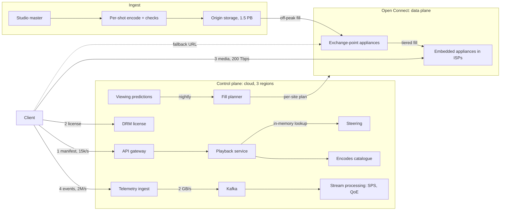

At 9 pm in São Paulo someone presses play on a television. Within a second video starts at the best quality the connection can sustain, and it plays for two hours without stalling while the household's other devices fight for the same Wi-Fi. Tens of millions of people are doing the same at that moment. "Design Netflix" tests whether you know where the difficulty in that experience lives.

It is not in storing video or in the web application. It is in three places. **Encoding**: each title becomes many renditions, and choosing them per title removes a share of every byte ever sent. **Delivery**: at hundreds of terabits per second the bytes cannot come from a cloud region, so Netflix built Open Connect, servers inside ISPs filled overnight with what members will watch tomorrow. **The client**: the player picks a bitrate every few seconds from its buffer and throughput samples, because only it can see the last mile.

Netflix publishes much of this in its technology blog, its Open Connect partner documentation and research papers. This lesson says "publicly described" for claims from that record and labels everything else as an assumption or as illustrative. Claiming inside knowledge you do not have is the fastest way to lose a Netflix interviewer.

## Requirements

### Functional

- **Play** any title on thousands of device types, each with its own codecs, DRM system, maximum resolution and HDR support; start fast, adapt continuously, seek, and resume across devices.
- **Ingest** a studio master into every rendition, quality-checked and on the edge before a fixed launch time.
- **Measure** every session's quality of experience (QoE) and A/B test streaming algorithms.
- **Personalise delivery**: use viewing predictions to place content and prefetch likely plays.
- **Out of scope**: the browse UI and the recommendation models themselves, billing, downloads, live events.

### Non-functional

Targets for this design, not Netflix's published figures:

| Property | Target |
|---|---|
| Play delay (press to first frame) | p50 ≤ 1 s, p95 ≤ 3 s |
| Rebuffering | < 0.1% of viewing time; a stall is the worst event in a session |
| Start success | ≥ 99.99%; playing streams survive the loss of a control-plane region |
| Quality | Maximise perceptual quality per bit within each viewer's bandwidth |
| Cost | Cost per hour streamed is a requirement, because egress dominates |

### Scale

Assumptions: 250 million accounts, 40 million concurrent streams at the global peak, a 5 Mbps average delivered bitrate (phones well under, 4K televisions well over), one hour viewed per account per day, and a catalogue of 50,000 content hours.

## Back-of-envelope estimates

| Quantity | Arithmetic | Result |
|---|---|---|
| Peak egress | $4 \times 10^7$ streams × 5 Mbps | **200 Tbps** |
| Bytes per viewing hour | 5 Mbps × 3,600 s ÷ 8 | 2.25 GB |
| Daily egress | $2.5 \times 10^8$ h × 2.25 GB | 560 PB/day, a 52 Tbps average: the peak is about 4× the average |
| Egress if bought | $5.6 \times 10^8$ GB/day × \$0.001–0.005 per GB (assumed high-volume contract pricing; list prices are higher) | \$0.5–3 million a day |
| Catalogue, all formats | (60 Mbps of video ladders across 4 codecs + 20 audio tracks × 0.25 Mbps) × 3,600 s ÷ 8 | 29 GB per content hour; × 50,000 ≈ **1.5 PB** |
| Encoding leverage | 20% saving on a title watched $10^7$ hours: $10^7$ × 2.25 GB × 0.2 | 4.5 PB never sent, for one title |
| Stream starts | 40 M streams ÷ 2,700 s average session | 15,000/s at peak, 45,000/s at the top of the hour |
| Bookmark writes | 40 M streams ÷ one write per 60 s | 670,000/s, 2 million replica writes/s at replication factor 3 |
| Telemetry | 40 M × (one heartbeat per 30 s + events) × ~1 KB | 2 million events/s, 2 GB/s, 170 TB/day raw |

### Machine counts

| Tier | Sizing | Count |
|---|---|---|
| Edge appliances | 200 Tbps ÷ 100 Gbps each (assumed; depends on NICs, disks and TLS offload) at 50% target utilisation | 4,000, plus spares in every site |
| Playback API | 45,000 manifests/s × ~10 ms of CPU (assumed) = 450 cores; at 50% utilisation on 16-core nodes, 56; ×1.5 so three regions survive losing one | ~85 nodes |
| Bookmark store | 2 million replica writes/s ÷ ~20,000 per node (assumed; depends on row size and disks) | ~100 nodes |
| Kafka | 2 GB/s × 3 replicas ÷ ~100 MB/s of sustained writes per broker | ~60 brokers |

The sentence that matters: the whole catalogue (1.5 PB) is under a third of a percent of one day's egress (560 PB), so delivery is a placement problem at the edge, and the control plane, at ~85 nodes, is ordinary cloud engineering by comparison.

## API design

```text
POST /playback/manifest  {video_id, profile_id, device: {codecs, drm, max_res, hdr}, network}
  -> 200 {session_id, video: [{stream_id, codec, res, kbps}], audio: [...], text: [...],
          urls: [{host: "oca-a.isp.example", rank: 1}, {host: "oca-b.isp.example", rank: 2},
                 {host: "oca-ix1.example", rank: 3}],
          url_expires_s: 21600, license_url, start_position_s: 1834}
POST /license            {session_id, challenge}          -> 200 {license}
GET  https://oca-a.isp.example/<file_id>?token=<signed, expiring>
     Range: bytes=...                                      -> 206 media bytes
POST /events             {session_id, events: [{t, type: start|switch|rebuffer|error|stop, ...}]}
                                                           -> 202 (fire-and-forget, batched)
PUT  /bookmarks/{profile_id}/{video_id}  {position_s}      -> 204 (idempotent, last write wins)
```

The manifest is computed per session: it lists only streams this device can decode and is licensed for, and it carries **specific server URLs**, which is how steering works without DNS. Media URLs carry signed, expiring tokens, so an appliance authorises a request without calling the cloud. Events are batched and never block a frame. The bookmark `PUT` carries the client's timestamp and the store keeps the newest, so a delayed retry cannot move the position backwards.

## Data model

```text
encodes     (video_id, stream_id)        -> codec, res, kbps, vmaf, file_id, bytes, sha256
appliances  (site_id, oca_id)            -> isp_asn, type (storage | flash), capacity_gbps, health, load
holdings    (oca_id, file_id)            -> present, reported_at
fill_plan   (site_id, file_id)           -> priority, copies            rebuilt nightly
bookmarks   (profile_id, video_id)       -> position_s, updated_at
events      ((date, hour), session_id, t) -> type, payload
```

| Table | Partition key | Sort key | Indexes | Why |
|---|---|---|---|---|
| `encodes` | `video_id` | `stream_id` | none | Each manifest reads one title's ~100 encodes, 45,000 times a second at the hour; the whole table (~50,000 titles × 100 × 200 B ≈ 1 GB) is cached in every playback node |
| `appliances`, `holdings` | `site_id`, `oca_id` | `oca_id`, `file_id` | client prefix → appliances, in memory | Steering answers 45,000/s from memory; appliance reports refresh it, requests never read the store |
| `fill_plan` | `site_id` | `file_id` | none | Each site pulls its own plan once a night |
| `bookmarks` | `profile_id` | `video_id` | none | 670,000 writes/s and a resume read of one profile's rows: a wide-column store |
| `events` | `(date, hour)` | `session_id`, `t` | none | Append-only; the warehouse prunes by time and reads one session's events together |

## High-level design



Everything up to pressing play (browsing, sign-in, the playback decision) runs in the cloud control plane, and the video comes from Open Connect. The planes scale on different axes, requests per second against bits per second, and the design depends on them failing independently.

## Deep dive 1: the encoding ladder, per title and per shot

A **ladder** is the set of renditions (resolution, bitrate, codec) the player switches between. Netflix's 2015 [per-title encoding post](https://web.archive.org/web/2016id_/http://techblog.netflix.com/2015/12/per-title-encode-optimization.html) published the fixed ladder it had used, from 235 kbps at 320×240 to 5,800 kbps at 1080p, and explained why one ladder is wrong in both directions: simple content such as flat animation reaches the top rung's quality at a fraction of its bitrate, while grainy, high-motion film shows artefacts even at 5.8 Mbps.

Per-title encoding measures instead of assuming:

1. Encode the title at many (resolution, quality setting) pairs.
2. Score each encode with a perceptual metric. Netflix's open-source [VMAF](https://github.com/Netflix/vmaf) is fitted to human ratings and scores up to 100.
3. Plot quality against bitrate for each resolution. At low bitrates a lower resolution, upscaled, beats a starved higher one; at high bitrates the order flips. The **upper convex hull** across the curves is the efficient frontier.
4. Place rungs along the hull, each a visible step up.

| Illustrative | Fixed top rung | Per-title top rung | Effect |
|---|---|---|---|
| Flat animation | 1080p at 5.8 Mbps | 1080p at ~2 Mbps, same VMAF | (5.8 − 2) ÷ 5.8 = 65% fewer bits |
| Grainy action film | 1080p at 5.8 Mbps, degraded | 1080p at ~7.5 Mbps | Quality restored where it was missing |

**Per-shot** encoding, publicly described as Netflix's dynamic optimizer, splits a title at shot boundaries, encodes each shot at several settings and picks one per shot to maximise quality at a target average bitrate, so bits flow from a static dialogue scene to rain and explosions. Shot boundaries are also where keyframes and chunk boundaries go, which makes the encode parallel.

### The pipeline and what it costs

A studio master is validated, split into chunks at shot boundaries, encoded in parallel, checked (decode tests, VMAF thresholds, audio sync), packaged and encrypted for each DRM system, and published to origin under versioned file IDs. Chunking bounds the wall time: a 2-hour film cut into about 1,400 five-second shots is 1,400 independent tasks per encode, so the finish time is the slowest chunk plus checks, not the film's length. Netflix has described running encodes on idle reserved cloud capacity.

The search multiplies compute. An illustrative 8 resolutions × 6 quality settings is 48 trial encodes per codec, plus about 10 final ones, against 10 for a fixed ladder: roughly 6× the work, and newer codecs (VP9, AV1) cost several times more per encode again. The leverage row decides whether it pays: the compute is spent once per title, while a title watched $10^7$ hours saves 4.5 PB. A title watched 1,000 hours delivers 2.25 TB in total, so no search can save it much. A studio title arrives weeks before launch, which leaves time to run the search on every title. [Video upload pipeline](/learn/system-design/case-studies/video-upload-pipeline) traces the transcode DAG and its per-rung costs.

## Deep dive 2: Open Connect, proactive fill and placement

Two deployment models are publicly described. **Embedded appliances** sit inside an ISP's network and are provided free to qualifying ISPs, which supply space, power and connectivity and stop carrying Netflix traffic across their interconnects. Appliances at **internet exchange points** serve ISPs without embedded ones and are the upstream tier. The [appliance page](https://openconnect.netflix.com/en/appliances/) lists storage appliances (up to 120 TB and about 200 Gbps, at exchange points and larger ISPs) and cheaper global appliances (up to 60 TB, about 80 Gbps) for smaller ISPs.

```viz
{"type": "network", "scenario": "cdn-cache", "title": "Classic pull-through caching",
 "caption": "The first request misses and goes to origin; later requests hit the edge. Open Connect is publicly described as filling appliances ahead of demand in an off-peak window instead, so a miss at 9 pm, the worst moment to fetch across the internet, is rare by design."}
```

A classic CDN pulls a file on its first miss. Open Connect is [described](https://openconnect.netflix.com/Open-Connect-Overview.pdf) as **proactive**: each day the system predicts what each site's members will watch, computes what each site should hold, and appliances download the changes in an **off-peak fill window** agreed with the ISP. Four workload properties make that work, and they decide whether the design transfers to another company:

1. The catalogue is finite and releases are scheduled weeks ahead.
2. Popularity is predictable from viewing history.
3. The catalogue (1.5 PB) is small next to daily demand (560 PB).
4. Off-peak bandwidth is idle: if a site replaces 10 TB of holdings a night in a 6-hour window, that is 10 TB × 8 ÷ 21,600 s = 3.7 Gbps, moved out of the peak.

### Placement, computed

An embedded site with 200 TB of usable disk holds 13% of a 1.5 PB catalogue. Assume viewing across content hours follows a Zipf distribution with skew $s$ and that prediction is perfect. The share of viewing the site serves locally is then the popularity mass of the hours it holds (simulated over 50,000 content hours):

| Skew $s$ | Holds 5% | Holds 13% | Holds 40% (only the encodes its devices use) |
|---|---|---|---|
| 0.8 | 50% | 63% | 81% |
| 1.0 | 74% | 82% | 92% |
| 1.2 | 91% | 94% | 98% |

Storing only the codecs and resolutions the site's devices play (assume a third of the bytes) triples the effective capacity, and it is a lever you control, unlike skew. Prediction error lowers every cell, so the share of bytes served from upstream the morning after a release is the fill-health metric.

**Tiered fill.** Exchange-point appliances fill from origin; embedded ones fill from upstream or from peers in the same site. **Within a site** files are spread by [consistent hashing](/learn/system-design/distributed-systems/partitioning-and-rebalancing) (publicly described), so any component computes a file's appliance without a lookup table, adding an appliance moves only its arc, and popular files get several copies so no single machine takes a hit title's traffic.

```viz
{"type": "system", "scenario": "consistent-hashing", "nodes": 4,
 "keys": ["title-81:av1-1080", "title-81:hevc-2160", "title-17:avc-720", "title-44:av1-1080", "title-17:audio-en", "title-44:avc-480"],
 "title": "Spreading a site's files across its appliances",
 "caption": "Each file hashes to a position on the ring and lives on the next appliance clockwise. Adding an appliance moves only the files on the arc it takes over, which matters when a fill window is a few hours long."}
```

## Deep dive 3: steering and the start path

The playback service asks steering for a ranked list of appliances. The inputs: which appliances cover the client's IP (an embedded appliance learns the prefixes it serves from a BGP session with the ISP, so the ISP decides which subscribers use it); which appliances hold the files, from holdings reports; health and load; and past performance for that prefix. The list carries signed URLs, embedded appliances first and an exchange-point appliance last, so the client can switch without a control-plane round trip. DNS-based steering sees the resolver's IP rather than the client's and reacts at TTL speed; steering in the manifest sees the client's IP and file-level holdings, and can send new sessions elsewhere when a site saturates while existing sessions adapt.

### A cold start, traced

Assumed latencies: 80 ms RTT to the cloud region, 15 ms to an appliance inside the ISP, a 20 Mbps home link.

| t (ms) | Component | Action | State |
|---|---|---|---|
| 0 | Client | Press play; `POST /playback/manifest` on a warm HTTP/2 connection | Nothing prefetched |
| 0–120 | Playback, steering | 80 ms RTT + ~40 ms of service time: filter encodes to the device, rank three appliances for its prefix from memory | Manifest: 1080p AV1 ladder, 3 URLs |
| 120 | Client | License challenge sent; TLS 1.3 to the rank-1 appliance opened in parallel | Two requests in flight |
| 135 | Appliance | TLS done in one RTT; `GET` segment 1 at 1,750 kbps, the throughput remembered from the last session | 4 s × 1,750 kbps = 875 KB |
| 135–515 | TCP | The window grows from 10 packets past the 37.5 KB bandwidth-delay product (20 Mbps × 15 ms) in about 2 RTTs; then 875 KB ÷ 2.5 MB/s = 350 ms | Link-rate limited |
| 235–350 | License | Returns at 120 + 80 + ~35 ms of service; DRM session setup | Ready before the media |
| 515–600 | Client | Decrypt, decode from the segment's keyframe, render | **First frame ≈ 0.6 s** |

Prefetching the manifest and license for the title under focus removes the first 120 ms (the license is already off the critical path); a 750 kbps first segment, 375 KB, removes 200 ms more. The edge case: if the rank-1 appliance refuses the connection, the client tries rank 2 after its connect timeout, so that timeout (hundreds of milliseconds, not the operating system's default of seconds) sits directly in p95 play delay.

```viz
{"type": "network", "scenario": "congestion-slow-start", "title": "Why the first segment is not free",
 "caption": "A new connection starts with a small congestion window and doubles it each round trip. With an appliance 15 ms away the window passes the link's bandwidth-delay product in two round trips; from a server 150 ms away the same ramp costs 300 ms, one reason appliances sit inside ISPs."}
```

## Deep dive 4: adaptive bitrate, segment by segment

The player downloads 4-second segments into a buffer and picks a rung before each one. Two rules compete:

- **Throughput-based**: estimate bandwidth as the harmonic mean of the last three segments' throughputs, multiply by 0.8, pick the highest rung below it.
- **Buffer-based** (Huang et al., SIGCOMM 2014, evaluated in Netflix's production service): below a **reservoir** of 10 s fetch the lowest rung; above reservoir plus a 40 s **cushion** fetch the highest; in between, map the buffer linearly onto the ladder.

### The buffer model, traced

Simulated with six rungs from the 2015 fixed ladder (235, 750, 1,750, 3,000, 4,300, 5,800 kbps), a link at 8 Mbps that drops to 1.2 Mbps at t = 24 s when another device starts a download and recovers to 6 Mbps at t = 72 s, a 60 s buffer cap and 30 segments. Download time is rung × 4 s ÷ link rate; playback drains the buffer at 1 s per second.

| t (s) | Player | Action | Buffer |
|---|---|---|---|
| 0.1 | Both | Segment 1 at 235 kbps (no samples, empty buffer); playback starts | 4.0 s |
| 0.1 | Throughput | Estimate 0.8 × 8,000 = 6,400 → 5,800 kbps; a 23,200-kbit segment takes 2.9 s, so the buffer gains 1.1 s per segment | 5.1 s |
| 0.1–1.2 | Buffer | Segments 2–6 at 235, then 750 kbps, while the buffer climbs through the reservoir | 22.9 s |
| 21.2 | Buffer | Segment 19: 50.9 s ≥ 10 + 40 → 5,800 kbps | 51.2 s |
| 23.3 | Throughput | Segment 10 at 5,800 kbps on a 12.8 s buffer | 12.8 s |
| 24.0 | Link | Drops to 1,200 kbps | |
| 25.0 | Buffer | Segment 20 at 5,800 kbps takes 19.3 s; the buffer absorbs it | 35.8 s after |
| 36.1–38.8 | Throughput | Buffer empties: **stall 2.7 s** until segment 10 lands after 15.5 s | 4.0 s |
| 38.8 | Throughput | Harmonic mean of 8,000, 8,000, 1,500 is 3,273; × 0.8 → 1,750 kbps, a 5.8 s download on 4 s of buffer: **stall 1.8 s** | 4.0 s |
| 44.3 | Buffer | Target 235 + (25.8 ÷ 40) × 5,565 = 3,824 → 3,000 kbps | 29.8 s |
| 44.6–72.5 | Throughput | Estimate 1,477 → 750 kbps for 13 segments while the buffer rebuilds | 5.5 → 27.6 s |

### What the trace shows

| Rule | Stalls | Stall time | Mean bitrate | Switches | Video at ≤ 750 kbps |
|---|---|---|---|---|---|
| Throughput (harmonic mean of 3, × 0.8) | 2 | 4.5 s | 2,906 kbps | 5 | 56 s |
| Buffer (10 s reservoir, 40 s cushion) | 0 | 0 s | 2,553 kbps | 8 | 24 s |

The throughput rule spent its headroom on bitrate and ran on a thin buffer, so an estimate that was right 0.7 s earlier caused two stalls and then 52 s of video at 750 kbps. The buffer rule drained 19 s of buffer on one download and never stalled. Its cost shows at startup: 24 s of video at 235–750 kbps on an 8 Mbps link. The paper reported fewer rebuffers at a similar average rate and handled startup with a capacity estimate while the buffer is empty. Production players blend both signals, switch down fast and up slowly (viewers notice oscillation), map the buffer onto the per-title ladder, and move to the next manifest URL when an appliance fails or crawls.

```python
LADDER_KBPS = [235, 750, 1750, 3000, 4300, 5800]   # illustrative; the real ladder is per title and device

def choose_bitrate(buffer_s: float, reservoir_s: float = 10.0, cushion_s: float = 40.0) -> int:
    """Buffer-based rate selection: map buffer occupancy onto the ladder."""
    lo, hi = LADDER_KBPS[0], LADDER_KBPS[-1]
    if buffer_s <= reservoir_s:
        return lo                                    # stall protection first
    if buffer_s >= reservoir_s + cushion_s:
        return hi
    frac = (buffer_s - reservoir_s) / cushion_s      # 0..1 through the cushion
    target = lo + frac * (hi - lo)
    return max(r for r in LADDER_KBPS if r <= target)

print(choose_bitrate(30))    # frac 0.5 -> target 3017.5 -> 3000
print(choose_bitrate(8))     # inside the reservoir -> 235
```

A player's throughput is TCP's throughput, so [congestion control](/learn/networking/fundamentals/congestion-control) shapes every sample ABR sees.

## Deep dive 5: telemetry and the personalisation loop

Every session reports play delay, switches, rebuffers, errors, the appliance used and throughput samples. Netflix has described **stream starts per second (SPS)** as its primary health signal ([Observability](/learn/system-design/building-blocks/observability) covers SLIs in general): viewing follows strong daily and weekly cycles, so actual SPS per region, device and ISP is compared with the expected value for that minute, and a dip means members press play and get nothing, whatever the cause. SPS is also described as the steady-state metric for its chaos experiments.

```viz
{"type": "system", "scenario": "stream-windowing", "size": 60,
 "title": "Turning a firehose of events into per-minute health",
 "caption": "Start events are counted in tumbling one-minute windows per region, device and ISP, and each window is compared with the expected count for that minute. A shortfall in one ISP's window points at that ISP's appliances or peering, not at the whole service."}
```

Clients batch events fire-and-forget; ingest writes them to Kafka (Netflix has described its Kafka-based Keystone pipeline); stream processors aggregate per region, ISP, device, app version and appliance within a minute; the warehouse keeps everything. Sample heartbeats, keep every start, error and rebuffer, and bound the client's event buffer so telemetry can never hurt playback.

### Where personalisation meets delivery

The recommendation models are a separate system, but their outputs are delivery inputs:

1. **Placement.** Regional viewing predictions become tomorrow's fill plan: "members behind this ISP will watch 40,000 hours of title T" becomes a ranked file list per site, which the placement table priced at 63–94% of viewing served locally.
2. **Prefetch.** The title under focus, or the next episode, has its manifest and license fetched early, removing the 120 ms manifest leg from the start trace. The price is control-plane load: if members focus on five titles per play, 15,000 starts a second become 75,000 prefetches a second.
3. **Artwork and previews** are chosen per member and are delivery traffic themselves.

The loop closes the other way: telemetry feeds A/B tests of ladders and ABR logic on member-facing QoE, and per-prefix performance feeds steering's ranking.

## Failure modes

| Failure | Symptom | Diagnosis | Fix |
|---|---|---|---|
| Appliance dies mid-stream | A throughput dip in affected sessions, no stall | Switch events to rank-2 URLs cluster on one appliance | Client fails over inside its buffer; steering drops the appliance when health reports stop |
| Hot site at peak | Down-switches and play delay rise on one ISP at 9 pm | Site egress at capacity; the upstream share climbs | Steering sends new sessions to the next site; capacity planned jointly with the ISP |
| Hot title on one appliance | One appliance at its NIC limit, peers idle | Per-appliance egress skew within a site | More copies of popular files across the site's appliances |
| Launch-hour thundering herd | Starts jump 3–10× at the hour; manifest p99 climbs | Control-plane CPU and connections saturate; the edge is fine | Pre-scale, prefetch manifests before launch, jittered client retries |
| Fill incomplete | More bytes served upstream the morning after a release | Holdings reports lack the new file IDs | Steering already routes by holdings; prioritise new releases in the plan; fill from peers |
| Control-plane region loss | New starts fail in one region; playing streams continue | Regional SPS dips; health checks fail | Evacuate to other regions; remove in-session dependencies such as a fatal license renewal |
| Bad encode shipped | Artefact or audio-sync reports on one title | Automated checks and VMAF on the published files | File IDs are versioned, so rollback is a catalogue change; refill in the next window |
| ABR regression in a client release | Rebuffers up 0.2% on one TV model, invisible globally | QoE sliced by device and app version | Staged rollout with per-version QoE and SPS gates |

## Trade-offs: what was rejected

| Decision | Chosen | Rejected | Why rejected here | What would flip it |
|---|---|---|---|---|
| Delivery | Own appliances inside ISPs | Commercial CDN | 560 PB a day at per-GB prices is hundreds of millions a year | A tenth of the traffic, or no ISP relationships |
| Edge fill | Proactive, nightly | Pull-through on miss | A 9 pm miss crosses the internet at the worst moment | Unpredictable catalogues: user video, news, live |
| Steering | Ranked URLs in the manifest | DNS-based | Resolver IP, TTL lag, no file-level knowledge | Many small objects where a per-session decision is too costly |
| Rate selection | Client, buffer plus throughput | Server-side | Only the client sees the last mile | Server hints can add to it, not replace it |
| Ladder | Per title, per shot | One fixed ladder | Wastes bits on easy titles, starves hard ones | A long tail of titles watched a handful of times |
| Segment length | 4 s | 2 s or 10 s | 2 s doubles requests and keyframes; 10 s slows start and reaction | Low-latency live wants 1–2 s |

## Evolution at 10× and 100×

| | Today | 10× | 100× |
|---|---|---|---|
| Peak egress | 200 Tbps, 4,000 appliances | 2 Pbps, 40,000 at 100 Gbps or 10,000 at 400 Gbps | 20 Pbps |
| Catalogue | 1.5 PB; a 200 TB site serves 92% locally ($s$ = 1) | 15 PB; the same site serves 77% | 150 PB, user-video scale |
| Starts at the hour | 45,000/s, ~85 nodes | 450,000/s, ~850 nodes | 4.5 million/s |
| Telemetry | 2 GB/s | 20 GB/s | 200 GB/s |

At 10× streams, appliance count per site is bounded by the ISP's space and power, so throughput per appliance becomes the lever. At 10× catalogue the local share falls from 92% to 77% (simulated, device-only encodes, $s$ = 1), so upstream traffic nearly triples from 8% to 23%: that breaks first, and the fix is bigger sites and better prediction. At 100× catalogue, proactive fill of everything is impossible; the head stays proactive and the tail becomes pull-through. Telemetry at 200 GB/s is aggregated on the client and heartbeats are sampled.

## What real companies describe

- Netflix's technology blog introduced **per-title encoding** in 2015 and later described **shot-based encoding** (the dynamic optimizer), the open-sourced **VMAF**, and AV1 streaming.
- Netflix's Open Connect documentation and talks describe **appliances embedded in ISPs** at no charge to qualifying ISPs, **fill during off-peak windows**, prefixes learned over **BGP**, and appliances running FreeBSD and NGINX.
- **Huang et al., SIGCOMM 2014**, written with Netflix engineers, tested **buffer-based rate adaptation** on Netflix's production service and [reported](http://yuba.stanford.edu/~nickm/papers/sigcomm2014-video.pdf) 10–20% fewer rebuffers than the then-default algorithm at a similar average video rate, with a startup phase that uses capacity estimates.
- Netflix has written about **SPS** as its health metric (also the steady-state metric in its [chaos engineering paper](https://arxiv.org/abs/1702.05843)), its Kafka-based **[Keystone](https://web.archive.org/web/2022id_/https://netflixtechblog.com/keystone-real-time-stream-processing-platform-a3ee651812a)** pipeline, and **[Cassandra for viewing history](https://web.archive.org/web/2022id_/https://netflixtechblog.com/scaling-time-series-data-storage-part-i-ec2b6d44ba39)**.
- The ladder, appliance, node and latency numbers in this lesson are illustrative assumptions, not Netflix figures.

## Interviewer follow-ups

**"Why build a CDN instead of buying one?"** Model answer: the arithmetic. 560 PB a day at \$0.001–0.005 per GB is \$0.5–3 million a day. Appliances inside ISPs take the traffic off their interconnects, which is why ISPs accept them, and a server 15 ms away sustains higher TCP throughput, so members get higher rungs. The costs are hardware, a supply chain and thousands of ISP relationships; at a tenth of the traffic I would buy. Common wrong answer: "for latency", with no egress arithmetic.

**"A huge season launches worldwide at a fixed hour. Walk me through it."** Model answer: nights before, the fill places the files in every site, weighted by predicted demand, and the upstream-share metric confirms coverage. Hours before, the control plane is scaled for 3–10× the normal start rate and manifests are prefetched. At launch, watch SPS per region and ISP; if one ISP dips, steer its new sessions to its exchange-point site. Common wrong answer: "autoscale the CDN", when the edge is fixed hardware filled in advance and the herd lands on the control plane.

**"The control plane loses a region at peak. What do members notice?"** Model answer: members already watching notice nothing, because their bytes come from appliances with URLs valid for hours; new starts in that region fail until traffic is evacuated, and SPS dips and recovers. I would audit hidden couplings: a license renewal, heartbeat acknowledgement or bookmark write the player treats as fatal turns a control-plane outage into a playback outage. Common wrong answer: "active-active fails over instantly, so nothing".

**"How would you decide whether a new ABR rule or ladder is better?"** Model answer: offline curves are necessary, not sufficient. Randomise sessions into old and new, compare play delay, rebuffer rate, delivered VMAF, bytes per hour and viewing time, run at least a week, and slice by device and network. The trace shows why mean bitrate alone misleads: the rule with the higher mean stalled twice. Common wrong answer: "compare average bitrate".

## What mid-level engineers get wrong

- Serving video from a cloud region "behind a CDN" without computing 200 Tbps or the per-GB bill.
- Choosing the bitrate on the server, which cannot see the home Wi-Fi.
- Trusting a throughput estimate alone: in the trace it stalled twice on a thin buffer when the link dropped.
- Pull-through caching for a catalogue that can be predicted, so misses land at 9 pm.
- Making playback depend on an in-session control-plane call, which turns a region failure into a playback outage.
- Measuring quality as mean bitrate instead of perceptual quality, stall time and play delay.
- Treating personalisation as the home screen only, and missing placement and prefetch.

## Exercise

```exercise
id: buffer-based-abr
title: Simulate a buffer-based ABR session
prompt: |
  Implement `simulate_abr(ladder, throughput_kbps, segment_s, reservoir_s, cushion_s)`.
  `ladder` lists bitrates in kbps, sorted ascending. The session has one segment per
  entry of `throughput_kbps`; `throughput_kbps[i]` is the link rate while segment `i`
  downloads.

  Before each download, choose a rung from the buffer level `b` (seconds of video
  buffered), with `lo` and `hi` the lowest and highest rungs:
  - `b <= reservoir_s`: `lo`.
  - `b >= reservoir_s + cushion_s`: `hi`.
  - otherwise: the highest rung `r` with `r <= lo + (b - reservoir_s) / cushion_s * (hi - lo)`.

  Downloading a segment at rung `r` takes `r * segment_s / throughput` seconds. Playback
  starts when the first segment arrives, so the first download is start-up delay, not
  rebuffering. During every later download playback drains the buffer: if the download
  takes longer than the buffer holds, the difference is rebuffering and the buffer
  empties; otherwise the buffer falls by the download time. Each completed segment then
  adds `segment_s`. The buffer starts at 0 and has no cap.

  Return `{"rungs": [rung chosen for each segment], "rebuffer_s": total rebuffering seconds}`.
languages: [python, javascript]
entry: simulate_abr
starter:
  python: |
    def simulate_abr(ladder, throughput_kbps, segment_s, reservoir_s, cushion_s):
        buffer_s = 0.0
        rebuffer_s = 0.0
        rungs = []
        # your code here
        return {"rungs": rungs, "rebuffer_s": rebuffer_s}
  javascript: |
    function simulate_abr(ladder, throughput_kbps, segment_s, reservoir_s, cushion_s) {
      let buffer_s = 0;
      let rebuffer_s = 0;
      const rungs = [];
      // your code here
      return { rungs, rebuffer_s };
    }
tests:
  - args: [[500, 1000, 2000, 4000], [4000, 4000, 4000, 4000, 4000, 4000], 4, 4, 8]
    expected: {"rungs": [500, 500, 2000, 2000, 2000, 4000], "rebuffer_s": 0}
  - args: [[500, 1000, 2000, 4000], [4000, 4000, 4000, 4000, 1000, 1000, 1000], 4, 4, 8]
    expected: {"rungs": [500, 500, 2000, 2000, 2000, 2000, 500], "rebuffer_s": 0.5}
    label: a drop with a thin cushion stalls once
  - args: [[500, 1000], [], 4, 4, 8]
    expected: {"rungs": [], "rebuffer_s": 0}
    label: no segments
  - args: [[1000], [500, 500, 500], 2, 4, 8]
    expected: {"rungs": [1000, 1000, 1000], "rebuffer_s": 4}
    label: a one-rung ladder cannot adapt
  - args: [[300, 600, 1200], [1200, 1200, 800, 600], 4, 4, 4]
    expected: {"rungs": [300, 300, 600, 1200], "rebuffer_s": 0}
    label: buffer exactly at the reservoir, then exactly at the top
  - args: [[235, 750, 1750, 3000, 4300, 5800], [8000, 8000, 8000, 8000, 8000, 8000, 8000, 8000, 8000, 8000, 8000, 8000, 1200, 1200, 1200, 1200, 1200, 1200, 6000, 6000, 6000, 6000], 4, 10, 40]
    expected: {"rungs": [235, 235, 235, 235, 750, 750, 1750, 1750, 1750, 3000, 3000, 3000, 4300, 1750, 1750, 1750, 1750, 1750, 750, 1750, 1750, 1750], "rebuffer_s": 0}
    hidden: true
  - args: [[500, 1000, 2000, 4000], [1000, 250, 4000, 4000, 500, 8000], 2, 2, 6]
    expected: {"rungs": [500, 500, 500, 1000, 2000, 500], "rebuffer_s": 4.75}
    hidden: true
  - args: [[500, 1000], [100, 4000, 4000], 4, 4, 4]
    expected: {"rungs": [500, 500, 500], "rebuffer_s": 0}
    label: a slow first segment is start-up delay, not rebuffering
    hidden: true
hints:
  - "The only state is the buffer in seconds; choose, download, drain, then add the segment."
  - "To avoid division, rung r qualifies when (r - lo) * cushion_s <= (b - reservoir_s) * (hi - lo)."
  - "A one-rung ladder has lo == hi; make sure the interpolation branch still returns that rung."
```

## Senior signals

- You split a control plane (requests per second, in the cloud) from a data plane (bits per second, at the edge) and make sessions survive control-plane failure.
- You derive "build a CDN inside ISPs" from the egress bill and "fill proactively" from four workload properties, and you say when they do not hold.
- You price placement: local share as a function of site size and popularity skew, and the lever of storing only the encodes a site's devices use.
- You trace ABR through a bandwidth drop and explain why the buffer, not the throughput estimate, is the stall predictor, and what buffer-based selection costs at startup.
- You treat telemetry and personalisation as delivery's control loop: SPS for health, A/B tests on QoE, predictions into placement and prefetch.
- You separate what Netflix has publicly described from your own assumptions, out loud. [Netflix microservices and resilience](/learn/system-design/case-studies/netflix-microservices-and-resilience) covers the control plane's failover.

## Check yourself

```quiz
- q: >-
    Peak streaming is 40 million concurrent streams at an average of 5 Mbps. What does the arithmetic imply about delivery?
  options: ["About 200 Gbps, so a single cloud region's egress can serve it", "About 2 Tbps, comparable to a large API fleet's total outbound traffic", "About 20 Tbps, so a commercial CDN's per-GB pricing is the cheapest", "About 200 Tbps, so bytes must come from edge servers near viewers"]
  answer: 3
  explanation: >-
    4 x 10^7 x 5 Mbps = 2 x 10^8 Mbps = 200 Tbps, which is 560 PB a day. At that scale the cost per GB and the location of the servers decide the architecture. Dropping a factor of 1,000 by confusing Gbps with Tbps is the classic unit error.
- q: >-
    Why does per-title encoding beat a fixed bitrate ladder?
  options: ["It moves every title to a newer codec with better compression", "It lets the client choose each title's bitrate from its buffer", "It encodes every title at a higher top resolution than before", "It picks rungs from each title's measured quality curves"]
  answer: 3
  explanation: >-
    A fixed ladder assumes every title needs the same bits for the same quality. Scoring encodes with a perceptual metric and placing rungs on the convex hull shows, in the illustrative case, that flat animation reaches top quality at about 2 Mbps while grainy film needs more than 5.8. Codec choice and client-side adaptation are separate levers.
- q: >-
    Which property of the workload most directly makes proactive off-peak fill better than pull-through caching?
  options: ["Video files are large, so each cache miss costs a long origin fetch", "The catalogue is finite and scheduled, so demand can be forecast", "Viewers tolerate a slow first start while the edge pulls the file", "ISPs require content to be pre-positioned before they will peer"]
  answer: 1
  explanation: >-
    Proactive placement needs to know what will be requested. A finite, scheduled catalogue with predictable popularity makes that possible, and idle off-peak bandwidth makes it cheap. Large files alone argue for caching, not for prediction; a news site with large files still cannot fill tomorrow's content tonight.
- q: >-
    An embedded site's 200 TB holds 13% of a 1.5 PB catalogue and serves 82% of its viewing locally. Which change raises the local share the most?
  options: ["Lengthen the nightly fill window so files arrive earlier each day", "Keep only encodes its members' devices play, fitting 3x the titles", "Switch to pull-through caching so misses fill the site on demand", "Double the site's network capacity so each appliance serves more bytes"]
  answer: 1
  explanation: >-
    Local share depends on how much of the popularity mass the site holds. Keeping only the codecs and resolutions its devices use lets the same disk hold about three times the content hours, which took the simulated share from 82% to 92%. Network capacity and a longer window do not change what is held, and pull-through moves misses into the evening peak.
- q: >-
    In the simulated bandwidth drop, the throughput-based player stalled twice and the buffer-based player did not. Why?
  options: ["It started at a lower rung, so its buffer never had time to build up", "Its harmonic-mean estimate overreacts, so it dropped rungs too far", "It downloaded longer segments, so each request took more wall time", "It spent its headroom on bitrate, so a 12.8 s buffer met the drop"]
  answer: 3
  explanation: >-
    Picking 5,800 kbps on an 8 Mbps link grows the buffer only 1.1 s per segment, so when the link fell to 1.2 Mbps the 15.5 s download outlasted a 12.8 s buffer. The buffer rule had filled to over 50 s and absorbed a 19.3 s download. Both started at the same rung with the same segment length; the harmonic mean lagged rather than overreacted.
- q: >-
    A cloud region hosting part of the control plane fails at peak. In a well-separated design, what happens to members who are already watching?
  options: ["They must restart playback so a healthy region issues new URLs", "They keep watching, because the bytes come from edge appliances", "They drop to the lowest bitrate until steering can be reached", "Their streams stop, because manifests are served by that region"]
  answer: 1
  explanation: >-
    The player already holds pre-signed appliance URLs valid for hours, so the data plane does not need the control plane mid-session. New starts move to healthy regions. The hidden risk is any in-session dependency, such as a license renewal, that the player treats as fatal.
```
