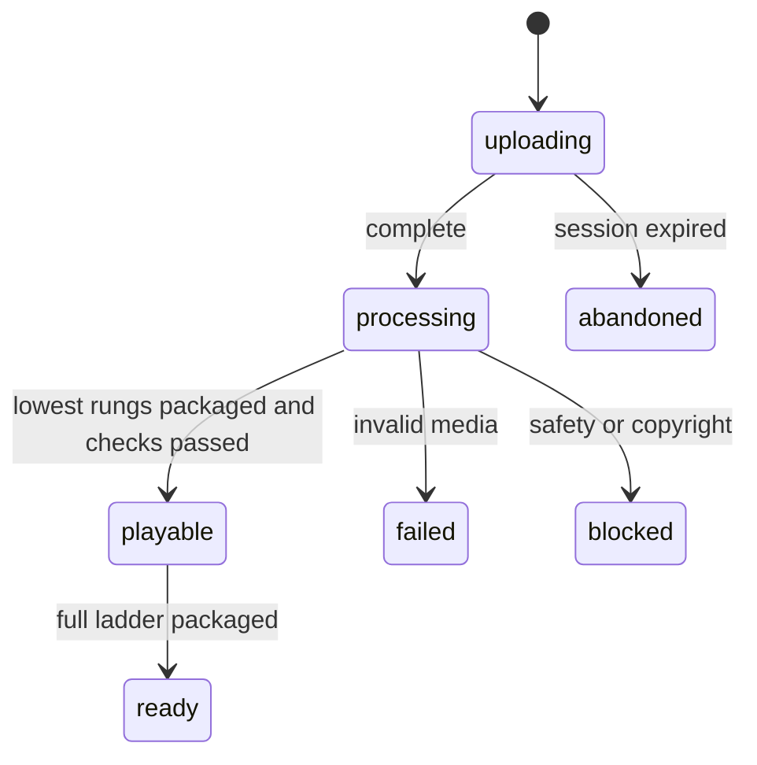
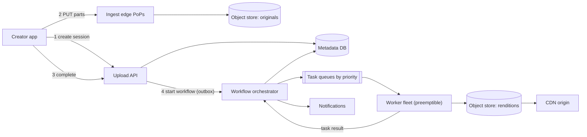
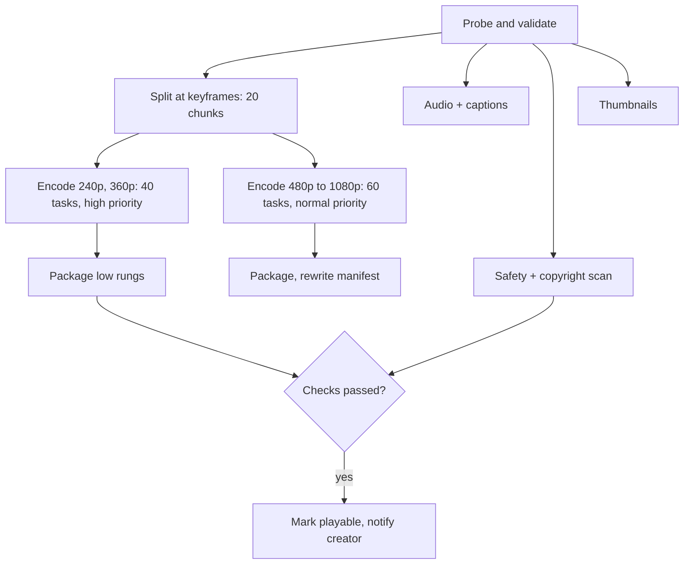

A creator on hotel Wi-Fi uploads a 4 GB file. At 83% the laptop goes to sleep. When it wakes, the only acceptable behaviour is that the upload carries on from 83%, and that a few minutes after the last byte lands, viewers can press play at 360p while the 1080p rendition is still encoding. Meanwhile about three thousand other uploads arrive every minute: some corrupt, some crafted to crash a video decoder, some byte-for-byte copies of a file uploaded ten minutes earlier.

This is the other half of video. [Video streaming](/learn/system-design/case-studies/video-streaming-netflix) is about delivering bytes that already exist; the upload pipeline is about creating them. It is two different systems glued together at the object store: a *network* problem (moving huge files over unreliable links without routing them through your servers) followed by a *compute* problem (a fan-out/fan-in graph of expensive, failure-prone jobs). Weak answers treat it as one HTTP POST and one `ffmpeg` call. Strong answers spend their time on resumability, idempotent tasks, priority, and where the money goes.

## Requirements

Ask first: what is the largest file, does "fast" mean first-playable or all-qualities, and is re-encoding the existing catalogue in scope? Assume a user-generated video platform, not a studio ingest system.

### Functional

- Upload files up to 50 GB and 12 hours long, from phones and browsers, resumable across disconnects and app restarts.
- Validate the file, then produce an adaptive-bitrate ladder (240p to 1080p H.264 for every video; higher resolutions and more efficient codecs where justified), packaged for HLS and DASH.
- Generate thumbnails, captions (speech recognition), and run content-safety and copyright checks before the video is public.
- Show processing status and notify the creator when the video is playable.
- Out of scope: playback, recommendations, live streaming.

### Non-functional

| Property | Target |
|---|---|
| Scale | 500 hours of video uploaded per minute (the order of magnitude the largest platform has cited publicly) |
| Durability | An upload acknowledged as complete is never lost |
| Time to first playable | p95 under 2 minutes for a 10-minute 1080p video, after the upload completes |
| Full ladder | p95 under 15 minutes for the same video |
| Upload availability | 99.95%; processing may lag during incidents but must never drop a job |
| Security | Every uploaded file is hostile input to a complex parser |

The split between first-playable and full-ladder is the most useful requirement you can extract, because it licenses a priority system later.

## Back-of-envelope estimates

**Upload rate.** 500 hours per minute is $500 \times 60 \times 24 = 720{,}000$ hours of video per day. In wall-clock terms it is $500 \times 3600 / 60 = 30{,}000$ seconds of video arriving every second. At an average length of 10 minutes that is 4.3 million uploads a day, about 50 per second on average and roughly 150 per second at peak.

**Ingest bandwidth.** Assume an average source bitrate of 10 Mbps (a mix of phone 1080p at 15–20 Mbps and smaller files), which is 1.25 MB/s of video. $30{,}000 \times 1.25$ MB = 37.5 GB/s, or 300 Gbps on average and the better part of a terabit per second at peak. **Design consequence: no byte of video passes through an application server.** Clients write directly to object storage.

**Concurrent uploads.** A 10-minute file at 10 Mbps is 750 MB. On a 15 Mbps home uplink that takes $750 \times 8 / 15 = 400$ seconds. By Little's law, $50/\text{s} \times 400\text{ s} = 20{,}000$ uploads in flight on average, 60,000 at peak. Each is a long-lived session that must survive your deploys.

**Storage.** Originals: $720{,}000 \text{ h} \times 4.5 \text{ GB/h} = 3.2$ PB per day, about 1.2 EB per year before replication or erasure-coding overhead. An H.264 ladder of 240p/360p/480p/720p/1080p at roughly 0.4 + 0.8 + 1.4 + 2.5 + 5 = 10 Mbps adds about the same again. At hot object-storage prices of about $0.02 per GB-month, a year of originals alone costs on the order of $24 million per month by year end. **Design consequence: originals move to an archive tier (an order of magnitude cheaper) as soon as processing finishes, and storage tiering is a requirement, not an optimisation.**

**Compute.** Assume an 8-vCPU worker encodes 1080p H.264 at about 2× real time, so the 1080p rung costs 4 vCPU-seconds per second of video. The lower rungs have 44%, 20%, 11% and 5% of the pixels, so the whole ladder costs about $4 \times 1.8 \approx 7$ vCPU-seconds per video-second. $30{,}000 \times 7 = 210{,}000$ vCPUs busy around the clock, 500,000 at peak. At roughly $0.015 per vCPU-hour for preemptible capacity, that is about $75,000 a day. **Design consequence: compute is the dominant *elastic* cost and sets latency; any codec that costs 10× more per second cannot be applied to every upload.**

**Task rate.** Split a 10-minute video into 30-second chunks and encode each chunk per rung: $20 \times 5 = 100$ encode tasks, plus a handful for probing, audio, thumbnails and packaging. $50 \times 100 = 5{,}000$ tasks per second on average and 15,000 at peak, each with two or three state transitions. That is a queue-class and sharded-store number, not a single-Postgres number.

**Metadata.** 4.3 million rows a day at ~2 KB is under 10 GB a day, about 50 writes per second. Metadata is not the problem; say so and move on.

## API design

The client never sends video to your API. It asks for permission, streams parts to storage, and tells you when it is done.

```text
POST /v1/uploads
  Idempotency-Key: 5f0c9a…
  { "filename": "trip.mov", "size_bytes": 4294967296, "sha256": "e3b0…", "title": "Lisbon" }
→ 201 { "upload_id": "up_81f", "video_id": "v_9Qx", "part_size": 16777216,
        "part_count": 256, "expires_at": "2026-10-03T12:00:00Z" }

POST /v1/uploads/up_81f/part-urls   { "parts": [1, 2, 3, 4] }
→ 200 { "urls": { "1": "https://ingest-edge.example.com/…?X-Sig=…", … } }

PUT <pre-signed part URL>            (client → nearest ingest edge, 16 MiB body + checksum)
→ 200  ETag: "a41c…"

GET /v1/uploads/up_81f
→ 200 { "status": "uploading", "received_parts": [1, 2, …, 212] }

POST /v1/uploads/up_81f/complete    { "parts": [{ "n": 1, "etag": "a41c…" }, …] }
→ 202 { "video_id": "v_9Qx", "status": "processing" }

GET /v1/videos/v_9Qx
→ 200 { "status": "processing", "playable": ["240p", "360p"], "pending": ["720p", "1080p"] }
```

Four details carry the design. Creating a session is idempotent, so a double-tap does not create two videos. Pre-signed URLs are short-lived and scoped to one part of one upload, so a leaked URL cannot overwrite another creator's file. `GET /v1/uploads/{id}` answers from the object store's own list of received parts, never from what the client claims, so a resumed client asks "what do you have?" and sends only the rest. And `complete` is idempotent: calling it twice returns the same `video_id` and starts one workflow.

## Data model

```sql
videos      (video_id PK, owner_id, title, status, source_key, source_sha256,
             duration_ms, width, height, created_at, published_at)
uploads     (upload_id PK, video_id, storage_upload_id, size_bytes, part_size,
             expires_at, completed_at)
renditions  (video_id, rendition, encoder_version, status, manifest_key, bytes,
             PRIMARY KEY (video_id, rendition, encoder_version))
tasks       (workflow_id, task_id, kind, chunk_idx, rendition, status, attempt,
             lease_owner, lease_expires_at, output_key, input_sha256)
```

Object keys are deterministic and include the encoder version, which is what makes retries and re-encodes safe:

```text
originals/v_9Qx/source                         immutable; archive tier after processing
work/v_9Qx/chunks/0007.mkv                     deleted after packaging
renditions/v_9Qx/h264-720p/enc-v14/seg-00042.m4s
manifests/v_9Qx/master.m3u8                    rewritten as rungs complete
```

The video's lifecycle is a state machine, and every consumer (the creator's UI, search indexing, the player) keys off it:



## High-level design



The path of one upload: the client creates a session (1), streams 16 MiB parts to the nearest ingest point of presence, which forwards them over the provider's backbone into the object store (2), and calls `complete` (3). The upload API commits the video's status change and a "start workflow" outbox row in one transaction (4), so the workflow cannot be lost between the database write and the orchestrator call. The orchestrator owns a per-video DAG:



Every box is an idempotent task on a queue; the orchestrator records which tasks finished and schedules the ones whose inputs are ready.

## Deep dives

### Getting the bytes in

At 300 Gbps and 20,000 concurrent sessions, routing uploads through application servers means running a large fleet whose only job is copying bytes, and every deploy of that fleet kills in-flight uploads. The real choice is between three protocols:

| Approach | Resume granularity | Who runs the byte path | Weakness |
|---|---|---|---|
| Single `PUT` of the whole file | None: restart from zero | Object store | A 4 GB upload on a phone rarely survives in one piece |
| Offset-based protocol (tus-style: `HEAD` returns the committed offset, `PATCH` appends from it) | Bytes | Your ingest fleet | You operate the 300 Gbps fleet and its storage |
| Multipart upload with pre-signed part URLs | One part | Object store | Part bookkeeping; abandoned parts cost money |

Choose multipart with pre-signed URLs, and do the part-size arithmetic out loud. S3-style multipart uploads allow at most 10,000 parts of at least 5 MiB each (except the last). A 50 GB file at 5 MiB would need about 10,000 parts, right at the limit, so 5 MiB is too small for the maximum file. At 16 MiB a 50 GB file is about 3,000 parts, a typical 750 MB file is about 45, and on a 15 Mbps uplink one part takes $16.8 \times 8 / 15 \approx 9$ seconds, so a dropped connection wastes at most 9 seconds of transfer. Larger parts reduce per-request overhead and waste more on failure; 8–64 MiB is the sensible band, and the server can choose per upload based on `size_bytes`.

Three further details are what an interviewer is listening for. First, **parallel parts**: a single TCP connection across a 150 ms round trip is limited by its congestion window, so uploading three or four parts concurrently fills a fast link; more than that hurts on phones. Uploading to a nearby edge shortens the round trip for the same reason. Second, **integrity**: each part carries a checksum (MD5 or CRC32C) that the store verifies before acknowledging, and the whole-file SHA-256 from the session lets you detect a corrupted assembly and deduplicate identical re-uploads. Third, **abandoned uploads**: incomplete multipart uploads are invisible in normal listings but still billed. A lifecycle rule aborts them after seven days, and the API's `expires_at` tells the client how long it can resume.

The completion signal deserves care. Object-store event notifications are at-least-once and occasionally late, and the client's `complete` call can be lost after it succeeded. Use the `complete` call as the primary trigger (it carries the part list and ETags), make workflow start idempotent on `video_id`, and run a sweeper that finds videos in `uploading` whose parts are all present and nudges them forward. Two triggers plus idempotent start is more robust than one perfect trigger.

### The transcoding DAG: chunked, idempotent, prioritised

**Why chunk.** Encoding a 10-minute 1080p video in one piece at 2× real time takes 5 minutes for that rung alone, and a 2-hour upload would take an hour. Splitting at keyframes into 30-second chunks and encoding them in parallel turns 5 minutes into roughly 15 seconds of encoding plus 10–20 seconds of per-task overhead (fetching the chunk, starting the encoder, uploading output). That is what makes the 2-minute first-playable target reachable. The source must be split on closed-GOP boundaries (each chunk starts with a keyframe that references nothing before it), and chunk boundaries should align with the 2–6 second packaging segments so the packager concatenates rather than re-muxes. Smaller chunks raise parallelism but add overhead and slightly hurt quality, because rate control restarts at every boundary.

**Why idempotent.** Workers are preemptible machines and tasks will be killed. Each task is a pure function of its inputs: `(source sha256, chunk index, rendition, encoder version)` fully determines the output, and the output key is derived from exactly those values. A retried task overwrites the same object with the same bytes, so there is no "did the first attempt finish?" question. The orchestrator marks a task done only after the output exists, and downstream tasks read outputs by key, never by "whatever the worker said".

**Leases and poison files.** A worker holds a task under a lease (a queue visibility timeout, or an explicit `lease_expires_at` it extends by heartbeating every 10 seconds). If it dies, the lease expires and the task is redelivered. A file that crashes the decoder every time would otherwise loop forever, so each task has an attempt limit; after three failures it goes to a dead-letter queue, the workflow marks the video `failed` with a reason the creator can act on ("unsupported codec"), and an engineer can replay it after a fix.

```viz
{"type": "system", "scenario": "message-queue", "requests": 10, "title": "Transcode tasks on a queue",
 "caption": "Each message is one chunk-rendition encode. Visibility timeouts turn a crashed worker into a redelivery, which is only safe because the task's output key is deterministic; a file that crashes the decoder every time exhausts its attempts and lands in the dead-letter queue instead of looping."}
```

**Orchestration, not choreography.** You could chain the steps with events ("chunk encoded" triggers "maybe package"). For a fixed DAG with fan-in, a workflow engine that holds per-video state (Temporal, AWS Step Functions and Netflix's open-source Conductor are examples of the category) is easier to operate: it answers "which step is video `v_9Qx` stuck on?", owns timeouts and retries in one place, and makes the fan-in ("all 20 chunks of 360p done") a counter rather than a distributed race. Choreography wins when many independent teams react to the same event; here one team owns one pipeline.

**Priority is separate queues, not a field.** The 40 low-rung tasks go on a high-priority queue with reserved worker capacity; the 1080p tasks go on a normal queue; catalogue re-encodes go on a low-priority queue that only uses spare capacity. A priority field inside one FIFO does not help when 500,000 backfill tasks are ahead of you. **Autoscale on the age of the oldest message** in each queue, not on CPU: CPU is always 100% on an encoding fleet, while queue age maps directly onto the latency SLO.

### Spending compute where the views are

View counts on user-generated video are extremely skewed: most uploads are watched a handful of times and a small fraction earns most of the watch time. Newer codecs such as AV1 deliver the same quality in roughly 30–50% fewer bits than H.264, but software encoders for them cost an order of magnitude or more compute. So the question is not "which codec is best" but "when does it pay for itself?"

Work it for a 10-minute video. A full view at 1080p and 5 Mbps is about 375 MB; saving 35% saves ~130 MB per view. At a CDN egress cost of the order of $0.01–0.02 per GB, that is roughly $0.002 per view. The AV1 ladder at ~10× the H.264 cost is $600 \times 7 \times 10 = 42{,}000$ vCPU-seconds, about 12 vCPU-hours, or roughly $0.18. Break-even is on the order of 100 full views. So: every video gets the cheap H.264 ladder immediately, and a view-count event (say, 1,000 views in a day) enqueues the AV1 ladder on the low-priority queue. The same logic justifies adding 1440p and 4K rungs only for sources that have them and videos that get watched.

The ladder itself should not be fixed. A static cartoon needs far fewer bits than handheld concert footage for the same perceived quality; Netflix has written publicly about per-title and per-shot encoding, which analyses each source's complexity and picks bitrates per rung, measured with a perceptual metric such as VMAF. For a user-generated platform, a cheap complexity probe on the first chunks that adjusts the ladder is most of the win at a fraction of the cost.

## Failure modes

| Failure | Detection | Mitigation |
|---|---|---|
| Worker preempted mid-encode | Lease expires | Redelivery; deterministic output keys make the retry harmless; chunking caps lost work at one 30-second chunk |
| Poison file crashes the decoder | Attempt count per task | Dead-letter after 3 attempts; mark `failed` with a reason; never retry forever |
| Malicious file exploits a decoder bug | Sandbox violations, crash signatures | Run decoders in a sandbox with no network, no credentials, seccomp filters, memory and time limits; treat worker hosts as disposable |
| Completion event lost | Sweeper finds "all parts present, still uploading" | Idempotent workflow start keyed on `video_id`; two triggers plus a sweeper |
| Encoder release produces subtly broken output | Automated quality checks (VMAF drop, decode test) on a canary slice | Encoder version in output keys; canary new versions on a small percentage; roll back by pointing manifests at the previous version |
| Post-outage backlog of hours | Queue age alarms | Separate priority queues keep new uploads fast while the backlog drains; shed catalogue re-encodes first |
| Region loses the object store | Health checks | Originals replicate to a second region before processing is considered complete; the workflow can resume from the replica because tasks are idempotent |

The third row is the one candidates forget. Media parsers are large, old, and written in memory-unsafe languages; a crafted file that achieves code execution on a worker that holds cloud credentials is a company-ending incident. The transcoder fleet should have exactly the permissions it needs: read one input key, write under one output prefix.

## Senior follow-ups

**Q: "The app is killed at 99% of a 4 GB upload. Walk me through what happens."**

Nothing on the server changes: the parts already uploaded are durable in the multipart upload, and the session is valid until `expires_at`. When the app restarts it reads `upload_id` from local storage, calls `GET /v1/uploads/up_81f`, gets the list of received parts from the store's own bookkeeping, requests URLs for the two or three missing parts, uploads them, and calls `complete`. Worst case it re-sends one 16 MiB part that was in flight. If the app lost its local state entirely, the whole-file SHA-256 lets the server match a new session to the incomplete one.

**Q: "How do you get a 2-hour 4K upload playable quickly?"**

The same way as a 10-minute one, with more parallelism: 240 chunks of 30 seconds, low rungs first on the high-priority queue, so 240p and 360p are playable within a few minutes of upload completion. The 4K rung is the expensive part and can take much longer; that is acceptable because the manifest is rewritten as rungs complete and the player picks up higher qualities on its next manifest fetch. I would also start probing and chunking before the upload finishes, since parts arrive in order and the first chunks are complete long before the last byte lands.

**Q: "You shipped a better encoder. How do you re-encode a billion existing videos?"**

As a low-priority backfill that uses only spare capacity, ordered by expected benefit: the most-watched videos first, because the bitrate savings multiply by views, and the long tail possibly never. Outputs go under a new `enc-v15` prefix, so old and new coexist; a manifest flip per video switches playback, and a rollback is the reverse flip. I would verify on a random sample with a quality metric before scaling up, and delete the old renditions only after a bake period.

**Q: "The same file is uploaded by 10,000 people. Do you process it 10,000 times?"**

You can deduplicate processing by content hash: if a source with the same SHA-256 has already been transcoded with the current encoder, the new video's renditions can point at the same objects, saving both compute and storage. Ownership, privacy and takedowns stay per video, and a takedown of one must not delete shared bytes, so the renditions need reference counting or a garbage collector. Copyright policy also decides whether a re-upload of known content is even allowed; the matching system usually works on perceptual fingerprints rather than exact hashes, because a re-encode changes every byte.

**Q: "Where do safety and copyright checks sit, and do they block publishing?"**

They run in parallel with encoding, off the probe step, so they add no latency to the happy path. Publishing is gated on them: the video becomes `playable` only when the low rungs are packaged and the checks have passed. Checks that take longer (human review of borderline cases) should not hold every video; the usual pattern is to publish on an automated pass and allow a later takedown, with stricter gates for accounts with a history of violations.

**Q: "How do you size and pay for the worker fleet?"**

Autoscale on queue age per priority class. Keep a baseline of reserved capacity for the high-priority queue, sized for peak first-playable demand, because that SLO cannot wait for capacity to arrive; run everything else on preemptible instances, which are much cheaper and fine because tasks last under a minute and are idempotent. The estimate says roughly 200,000 vCPUs on average, so a 20% efficiency gain from per-title encoding or better scheduling is worth more than most other optimisations in the system. At this scale, large platforms have built custom encoding hardware for exactly this reason.

## Senior signals

- You separate the **network problem** (resumable, direct-to-storage ingest) from the **compute problem** (a DAG of idempotent tasks) and say that no video byte touches an application server.
- You derive part size from the **10,000-part limit and the failure cost**, not from habit.
- You make every task a **pure function with a deterministic output key**, including the encoder version, and explain why that makes retries and re-encodes safe.
- You split **first-playable from full-ladder**, and implement priority with **separate queues and reserved capacity**, autoscaled on **queue age**.
- You treat uploaded media as **hostile input** and sandbox the decoders.
- You spend expensive codecs **where views justify them** and can show the break-even arithmetic.

## Check yourself

```quiz
- q: >-
    Uploads average 300 Gbps of ingest. What is the main reason to have clients write directly to object storage with pre-signed URLs?
  options: ["Pre-signed URLs are more secure than API authentication", "It avoids running a large byte-copying fleet whose deploys would kill in-flight uploads, and lets the store handle durability", "Object stores compress video automatically", "It removes the need for a metadata database"]
  answer: 1
  explanation: >-
    At hundreds of Gbps and tens of thousands of long-lived sessions, application servers would exist only to copy bytes, and every deploy would interrupt uploads. Pre-signed URLs are a scoping mechanism, not a stronger form of auth; the metadata database is still needed for sessions and status.
- q: >-
    An object store allows at most 10,000 parts per multipart upload, minimum 5 MiB each. Files can be up to 50 GB. Which part size is the best default?
  options: ["5 MiB, to minimise wasted work on failure", "16 MiB, about 3,000 parts for the largest file and seconds of lost work per failure", "1 GiB, to minimise the number of requests", "Parts should be sized by the client at random to spread load"]
  answer: 1
  explanation: >-
    At 5 MiB a 50 GB file needs about 10,000 parts, right at the limit. At 1 GiB a dropped connection on a phone wastes minutes of transfer. 16 MiB leaves ample headroom under the limit and loses about 9 seconds of a 15 Mbps uplink per failure.
- q: >-
    A transcode worker is preempted after uploading its output but before reporting success. The task is redelivered. What makes this safe?
  options: ["The queue guarantees exactly-once delivery", "The output key is derived from the input hash, chunk, rendition and encoder version, so the retry writes identical bytes to the same key", "The orchestrator deletes partial outputs before retrying", "Workers take a distributed lock on the video"]
  answer: 1
  explanation: >-
    Queues deliver at least once; safety comes from idempotent tasks. A deterministic output key means the retry overwrites the same object with the same content, so it does not matter whether the first attempt finished. Locks do not help when the lock holder is the process that died.
- q: >-
    After an outage, 500,000 catalogue re-encode tasks are queued and new uploads are waiting 40 minutes to become playable. What is the right structural fix?
  options: ["Add a priority field to each message in the shared queue", "Autoscale workers on CPU utilisation", "Use separate queues per priority with reserved capacity for first-playable work, and scale each on the age of its oldest message", "Reject new uploads until the backlog drains"]
  answer: 2
  explanation: >-
    A priority field inside one FIFO does not let new work jump a backlog that is already ahead of it, and CPU is always saturated on an encoding fleet, so it says nothing about latency. Separate queues isolate the classes, and queue age maps directly onto the SLO.
- q: >-
    A new codec saves 35% of bits but costs 10 times the encode compute. Which policy follows from the economics of a user-generated platform?
  options: ["Encode every upload in the new codec to minimise egress", "Never use it; compute is the dominant cost", "Encode everything in the cheap codec first and add the new codec when a video's views pass the break-even point", "Let creators choose the codec"]
  answer: 2
  explanation: >-
    Savings scale with views and costs are paid once per video. Because views are heavily skewed, most videos never repay the extra encode cost, while popular ones repay it many times over; a view-count trigger captures most of the savings at a small fraction of the compute.
```
