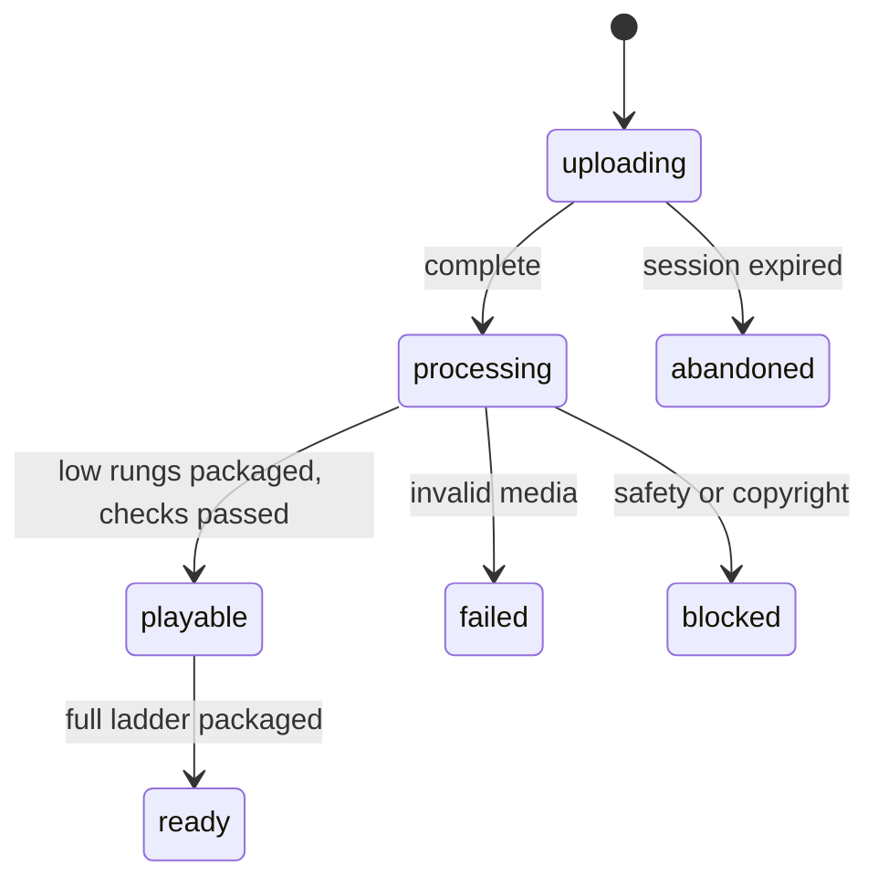
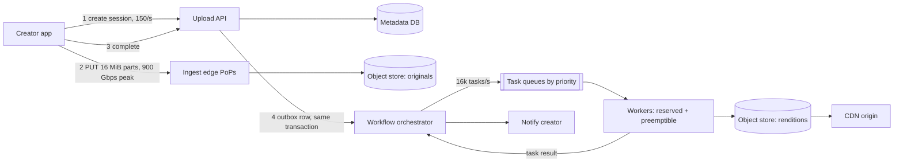
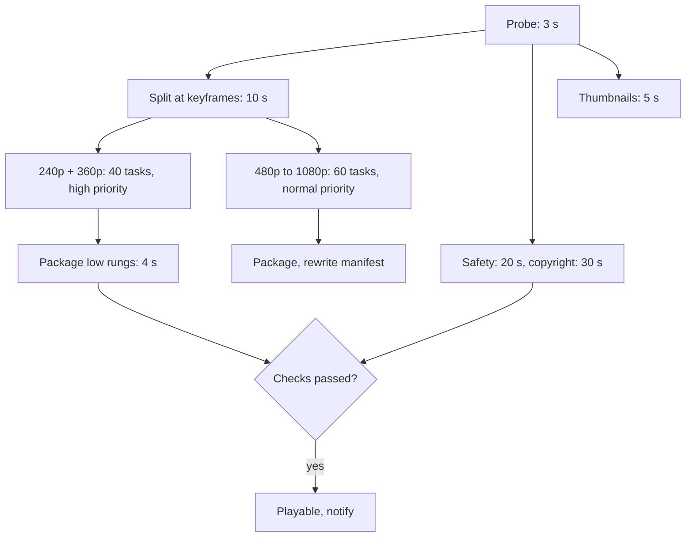

A creator on hotel Wi-Fi uploads a 4 GB file. At 83% the laptop goes to sleep. When it wakes, the only acceptable behaviour is that the upload carries on from 83%, and that within a minute or two of the last byte landing, viewers can press play at 360p while 1080p is still encoding. Meanwhile about three thousand other uploads arrive every minute: some corrupt, some crafted to crash a video decoder, some byte-for-byte copies of a file uploaded ten minutes earlier.

This is the other half of video. [Video streaming](/learn/system-design/case-studies/video-streaming-netflix) delivers bytes that already exist; the upload pipeline creates them. It is two systems glued together at the object store: a *network* problem (moving huge files over unreliable links without routing them through your servers) followed by a *compute* problem (a fan-out/fan-in graph of expensive, failure-prone jobs). Weak answers treat it as one HTTP POST and one `ffmpeg` call. Strong answers spend their time on resumability, idempotent tasks, the critical path to first playable, and where the money goes.

## Requirements

Ask first: what is the largest file, does "fast" mean first-playable or all qualities, and is re-encoding the existing catalogue in scope? Assume a user-generated platform, not a studio ingest system.

### Functional

- Upload files up to 50 GB and 12 hours, from phones and browsers, resumable across disconnects and app restarts.
- Validate the file, then produce an adaptive-bitrate ladder (240p to 1080p H.264 for every video; higher resolutions and newer codecs where justified), packaged for HLS and DASH.
- Generate thumbnails and captions, and run content-safety and copyright checks before the video is public.
- Show processing status and notify the creator when the video is playable.
- Out of scope: playback, recommendations, live streaming.

### Non-functional

| Property | Target |
|---|---|
| Durability | An upload acknowledged as complete is never lost |
| Time to first playable | p95 under 2 minutes after the last byte, for a 10-minute 1080p video |
| Full ladder | p95 under 15 minutes for the same video |
| Upload availability | 99.95%; processing may lag during incidents but never drops a job |
| Security | Every uploaded file is hostile input to a complex parser |

### Scale

500 hours of video uploaded per minute (the order of magnitude the largest platform has cited publicly), an average upload of 10 minutes at a 10 Mbps source bitrate, and a 3× daily peak. The split between first-playable and full-ladder is the most useful requirement to extract, because it licenses a priority system later.

## Back-of-envelope estimates

| Quantity | Arithmetic | Result |
|---|---|---|
| Video arriving | 500 h/min × 3,600 s ÷ 60 s | 30,000 s of video per second; 720,000 hours a day |
| Uploads | 720,000 h ÷ (10 min ÷ 60) | 4.3 million a day: 50/s average, 150/s peak |
| Ingest bandwidth | 30,000 × 10 Mbps | 300 Gbps average, 900 Gbps peak |
| File size | 600 s × 10 Mbps ÷ 8 | 750 MB |
| Concurrent uploads | 750 MB on a 15 Mbps uplink = 400 s; Little's law 50/s × 400 s | 20,000 in flight, 60,000 at peak |
| Originals | 720,000 h × 4.5 GB/h | 3.2 PB/day, 1.2 EB/year before replication |
| Storage bill | 1.2 EB × \$0.02 per GB-month | ~\$24 million a month by year end on a hot tier |
| Encode compute | 7.2 vCPU-s per video-second (deep dive 2) × 30,000 | 216,000 vCPUs busy on average |
| Compute bill | 216,000 × 24 h × \$0.015 per preemptible vCPU-hour | ~\$78,000 a day |
| Tasks | 20 chunks × 5 rungs + ~6 others = 106 per video × 50/s | 5,300/s, 16,000/s at peak; ~3 state writes each |
| Metadata | 4.3 M rows × 2 KB | 9 GB/day, 50 writes/s: not the problem |

### Machine counts

| Tier | Sizing | Count |
|---|---|---|
| Ingest edge | 900 Gbps ÷ 5 Gbps per node (10 Gbps of TLS and forwarding at 50%, assumed; depends on NIC and TLS offload) | ~180 nodes across points of presence |
| Upload API | 150 creates/s + ~12 part-URL calls per upload (45 parts, 4 per call) ≈ 2,000 req/s | 6 nodes, 2 per zone |
| Encode workers | 216,000 vCPUs ÷ 8 per worker; provisioned at 1.5× average because normal-priority work queues through the peak | 27,000 busy, ~41,000 provisioned |
| Reserved first-playable lane | 240p + 360p are 8.9% of ladder compute; × 3× peak × 216,000 vCPUs | ~58,000 vCPUs, 7,200 workers not preemptible |
| Task-state store | 16,000 tasks/s × 3 writes = 48,000 writes/s ÷ ~10,000 per shard (assumed) | 5–6 shards, 3 replicas each |

The sentence that matters: storage grows by exabytes and compute costs \$78,000 a day, so originals move to an archive tier (about 10× cheaper) as soon as processing finishes, and every expensive codec must justify itself in views; no byte of video ever passes through an application server.

## API design

```text
POST /v1/uploads                  Idempotency-Key: 5f0c9a…
  {"filename": "trip.mov", "size_bytes": 4294967296, "sha256": "e3b0…", "title": "Lisbon"}
  -> 201 {"upload_id": "up_81f", "video_id": "v_9Qx", "part_size": 16777216,
          "part_count": 256, "expires_at": "2026-10-03T12:00:00Z"}
POST /v1/uploads/up_81f/part-urls {"parts": [1, 2, 3, 4]}
  -> 200 {"urls": {"1": "https://ingest-edge.example.com/…?X-Sig=…", …}}   15-minute lifetime
PUT  <pre-signed part URL>        16 MiB body + checksum  -> 200 ETag: "a41c…"
GET  /v1/uploads/up_81f           -> 200 {"status": "uploading", "received_parts": [1, …, 212]}
POST /v1/uploads/up_81f/complete  {"parts": [{"n": 1, "etag": "a41c…"}, …]}
  -> 202 {"video_id": "v_9Qx", "status": "processing"}              same response on retry
GET  /v1/videos/v_9Qx             -> 200 {"status": "processing", "playable": ["240p", "360p"]}
```

Creating a session is idempotent, so a double tap does not create two videos. Pre-signed URLs are scoped to one part of one upload, so a leaked URL cannot overwrite another creator's file. `GET /v1/uploads/{id}` answers from the object store's own list of received parts, never from what the client claims. `complete` is idempotent on `upload_id`: a retry returns the same `video_id` and starts no second workflow ([Idempotency and retries](/learn/system-design/building-blocks/idempotency-and-retries)).

```viz
{"type": "system", "scenario": "idempotency-key", "title": "A retried complete starts one workflow",
 "caption": "The first complete call claims the upload's key and records the workflow it started; a retry after a lost response finds the record and returns the same video_id instead of transcoding the file twice."}
```

## Data model

```sql
videos      (video_id PK, owner_id, title, status, source_key, source_sha256,
             duration_ms, width, height, created_at, published_at)
uploads     (upload_id PK, video_id, storage_upload_id, size_bytes, part_size, expires_at, completed_at)
renditions  (video_id, rendition, encoder_version, status, manifest_key, bytes,
             PRIMARY KEY (video_id, rendition, encoder_version))
tasks       (workflow_id, task_id, kind, chunk_idx, rendition, status, attempt,
             lease_owner, lease_expires_at, output_key, input_sha256)
sources     (source_sha256, encoder_version) -> video_id    -- exact-duplicate lookup
```

| Table | Partition key | Sort key | Indexes | Why |
|---|---|---|---|---|
| `videos` | `video_id` | none | `(owner_id, created_at)` | Status reads by ID from the UI and player; "my uploads" by owner, a few hundred a second |
| `uploads` | `upload_id` | none | none | Every resume and `complete` names the upload |
| `tasks` | `workflow_id` | `task_id` | `(status, lease_expires_at)` for the lease sweeper | 48,000 writes/s at peak spread over 50–150 active workflows a second; the fan-in check ("all 20 chunks of 360p done?") reads one partition |
| `renditions` | `video_id` | `(rendition, encoder_version)` | none | Manifest writing reads one video's rungs; old and new encoder versions coexist |
| `sources` | `source_sha256` | `encoder_version` | none | One lookup per `complete` to reuse an identical file's renditions |

Object keys are deterministic and include the encoder version: `renditions/v_9Qx/h264-720p/enc-v14/seg-00042.m4s`. The video's lifecycle is a state machine every consumer keys off:



## High-level design



The upload API commits the status change and a "start workflow" outbox row in one transaction, so the workflow cannot be lost between the database write and the orchestrator call. The orchestrator owns a per-video DAG:



## Deep dive 1: getting the bytes in

At 300 Gbps and 20,000 concurrent sessions, routing uploads through application servers means a large fleet whose only job is copying bytes, and every deploy of it kills in-flight uploads.

| Approach | Resume granularity | Who runs the byte path | Weakness |
|---|---|---|---|
| Single `PUT` of the file | None: restart from zero | Object store | A 4 GB upload on a phone rarely survives in one piece |
| Offset protocol (tus-style `HEAD` for the committed offset, `PATCH` to append) | Bytes | Your ingest fleet | You operate a 900 Gbps fleet and its storage |
| Multipart with pre-signed part URLs | One part | Object store | Part bookkeeping; abandoned parts are billed |

Choose multipart and do the part-size arithmetic out loud. S3-style multipart uploads allow at most 10,000 parts of at least 5 MiB (except the last). At 5 MiB a 50 GB file needs about 10,000 parts, right at the limit. At 16 MiB it is about 3,000 parts, a 750 MB file is 45, and one part on a 15 Mbps uplink takes 16.8 MB × 8 ÷ 15 Mbps ≈ 9 s, so a dropped connection wastes seconds. The server can pick 8–64 MiB per upload from `size_bytes`. Upload three or four parts in parallel: one TCP connection over a 150 ms round trip is limited by its congestion window, and a nearby ingest edge shortens that round trip. Each part carries a checksum the store verifies; the whole-file SHA-256 detects a corrupt assembly and identical re-uploads. A lifecycle rule aborts incomplete multipart uploads after seven days, because they are invisible in listings but billed.

### A resumed upload, traced

A 4 GiB file (256 parts of 16 MiB) on a 15 Mbps uplink: 4.29 GB × 8 ÷ 15 Mbps = 2,290 s in total.

| t (s) | Component | Action | State |
|---|---|---|---|
| 0 | Client → API | `POST /v1/uploads`; `upload_id` saved to local storage | 256 parts expected |
| 0–1,900 | Client → edge | Parts 1–212 acknowledged with ETags, 3 in flight | 83% durable in the store |
| 1,900 | Laptop sleeps | Parts 213–215 were mid-transfer; their partial bytes are discarded | Store holds 212 parts |
| wake + 0.2 | Client → API | `GET /v1/uploads/up_81f`; the API lists parts from the store | `received_parts`: 1–212 |
| wake + 0.4 | Client → API | New URLs for 213–216 (the old ones expired after 15 minutes) | |
| wake + 0.4 → +394 | Client → edge | 44 parts × 16.8 MB × 8 ÷ 15 Mbps | 256 parts durable |
| wake + 394 | Client → API | `complete` with 256 ETags; the response is lost on the flaky Wi-Fi | Workflow started |
| wake + 396 | Client → API | Retry of `complete` | Same `video_id`, no second workflow |

The sleep cost at most the three in-flight parts, 48 MiB or about 27 s of uplink. Failed part `PUT`s are retried with jittered exponential backoff, so 20,000 clients reconnecting after an edge outage do not return in lockstep. The edge case: if the app lost its local state, the whole-file SHA-256 in a new session lets the server find the incomplete upload. Two triggers start the workflow, the `complete` call and a sweeper that finds uploads with every part present still marked `uploading`, and starting is idempotent on `video_id`.

```viz
{"type": "system", "scenario": "retry-backoff", "requests": 5, "title": "Retrying a failed part upload",
 "caption": "Each failed part PUT waits twice as long as the last, with random jitter, before retrying. Only the failed part is resent; the parts the store already acknowledged are never uploaded again."}
```

## Deep dive 2: the transcode DAG, costed and traced

The compute problem has three parts: what each rung costs, which path through the DAG decides when a viewer can press play, and how tasks survive the machines they run on.

### Per-rung cost, computed

Model encode cost as pixels × frames ÷ encoder speed. Assume x264's `medium` preset encodes 1080p30 at 2× real time on an 8-vCPU worker: 1,920 × 1,080 × 30 × 2 ÷ 8 = 15.6 megapixels per vCPU-second (the preset, content and CPU generation move this several-fold, so measure it). A 10-minute video at 30 fps is 18,000 frames:

| Rung | Pixels per frame | vCPU-s for 10 minutes | One 30 s chunk on 8 vCPU | Share of ladder |
|---|---|---|---|---|
| 240p (426×240) | 102,240 | 118 | 0.7 s | 2.7% |
| 360p (640×360) | 230,400 | 267 | 1.7 s | 6.2% |
| 480p (854×480) | 409,920 | 474 | 3.0 s | 11.0% |
| 720p (1280×720) | 921,600 | 1,067 | 6.7 s | 24.7% |
| 1080p | 2,073,600 | 2,400 | 15.0 s | 55.5% |
| Ladder | | 4,326 = 1.2 vCPU-hours | | 1.8× the 1080p rung alone |

That is 7.2 vCPU-seconds per second of video and about \$0.018 per 10-minute upload at \$0.015 per vCPU-hour. It is a first-order model: per-frame overheads make small rungs cost more than their pixel share, and decoding the source is extra.

```python
PX_PER_VCPU_S = 1920 * 1080 * 30 * 2 / 8      # assumed encoder speed: 15.6 Mpx per vCPU-second
RUNGS = {"240p": (426, 240), "360p": (640, 360), "480p": (854, 480),
         "720p": (1280, 720), "1080p": (1920, 1080)}

def encode_cost(duration_s: float, fps: int = 30) -> dict[str, float]:
    frames = duration_s * fps
    return {name: w * h * frames / PX_PER_VCPU_S for name, (w, h) in RUNGS.items()}

cost = encode_cost(600)
print({k: round(v) for k, v in cost.items()})   # 1080p: 2400 vCPU-s, one worker needs 300 s
print(round(sum(cost.values()) / 600, 1))       # 7.2 vCPU-s per video-second
```

**Why chunk.** The 1080p rung alone takes 2,400 ÷ 8 = 300 s on one worker. Split at closed-GOP keyframes into 20 chunks of 30 s and each chunk-rung task is 15 s of encoding plus about 4 s of overhead (fetch the chunk, start the encoder, upload the output). Chunk boundaries should align with the packaging segments so the packager concatenates instead of re-muxing. Shorter chunks add overhead and restart rate control more often; 2–4 s chunks would spend more time on overhead than on encoding the low rungs.

### Time to first playable, traced

Assumed durations are in the DAG diagram; the high-priority lane's p95 queue wait is 10 s. Simulated with the list scheduler from the exercise:

| t (s) | Component | Action | State |
|---|---|---|---|
| 0 | Upload API | `complete` → 202; status and outbox row committed together | `processing` |
| 1 | Orchestrator | Outbox relay (polls every 0.5–1 s) starts the workflow | DAG created |
| 1–4 | Worker | Probe: container, codecs, duration, rotation | 10 min, 1080p30 H.264 |
| 4–14 | Worker | Split into 20 chunks by stream copy: read and write 750 MB at ~150 MB/s | 20 chunk keys |
| 4–34 | Workers | In parallel: thumbnails (5 s), safety classifier (20 s), copyright fingerprint over the whole file (30 s) | |
| 14–24 | Queue | 40 low-rung tasks wait for reserved workers | |
| 24–30 | Workers | 240p and 360p chunks: ~1–2 s of encoding inside ~5–6 s tasks | 40 outputs at deterministic keys |
| 30–34 | Packager | 4 s segments and a master manifest for two rungs | Encode path done at 34 |
| 34–35 | Orchestrator | Copyright passes at 34; gate passes; notify | **Playable at 35 s** |

The critical path is probe → copyright scan → gate (1 + 3 + 30 + 1 = 35 s), not the encode. With no queue wait the low rungs are packaged at 24 s and the video still becomes playable at 35 s, so faster encoders buy nothing here until the scan runs per chunk. With only 4 workers for the video, the encode path becomes critical and first playable moves to 84 s. The full ladder, with ample normal-lane capacity, is 1 + 3 + 10 + 19 + 5 = 38 s; under load it waits on the normal queue, which the 15-minute target allows.

```viz
{"type": "system", "scenario": "message-queue", "requests": 10, "title": "Transcode tasks on a queue",
 "caption": "Each message is one chunk-rung encode. A visibility timeout turns a crashed worker into a redelivery, which is safe only because the task's output key is deterministic; a file that crashes the decoder every time exhausts its attempts and lands in the dead-letter queue."}
```

### Idempotent tasks, leases and poison files

Workers are preemptible, so tasks will be killed. Each task is a pure function of `(source sha256, chunk index, rendition, encoder version)`, and the output key is derived from exactly those values, so a retry overwrites the same object with the same bytes. The orchestrator marks a task done only after its output exists. A worker holds a task under a lease it extends every 10 s; if it dies, the lease expires and the task is redelivered. A file that crashes the decoder every time would loop forever, so after three attempts the task goes to a dead-letter queue, the video is marked `failed` with a reason the creator can act on ("unsupported codec"), and an engineer can replay it after a fix. A workflow engine (Temporal, AWS Step Functions and Netflix's open-source Conductor are examples) holds this per-video state, answers "which step is `v_9Qx` stuck on?", and turns fan-in into a counter; choreography by events suits many teams reacting to one event, not one team's fixed DAG ([Event-driven architecture](/learn/system-design/building-blocks/event-driven-architecture)).

**Priority is separate queues, not a field.** Low rungs go to a high-priority queue with the reserved 7,200 workers; 480p–1080p to a normal queue; catalogue re-encodes to a low queue that only uses spare capacity. A priority field inside one FIFO does not help when 500,000 backfill tasks are already ahead. Autoscale each queue on the age of its oldest message, not CPU, which is always near 100% on an encoding fleet ([Queues and async processing](/learn/system-design/building-blocks/queues-and-async-processing)).

## Deep dive 3: before the last byte, and where the views are

Two levers remain once the DAG is right: start before the upload ends, and stop spending compute on videos nobody will watch.

### Processing during upload

The trace starts the clock at the last byte, but the creator's clock started 400 s earlier. If the client cuts the video into keyframe-aligned segments and uploads them in order, each 30 s segment (37.5 MB, 20 s of a 15 Mbps uplink) can be probed, encoded and fingerprinted as it lands. Each segment's low rungs take about 6 s and its 1080p about 19 s, both under the 20 s between arrivals, so the encoders keep pace with the upload:

| | Waits for the last byte | Processes during upload |
|---|---|---|
| Upload of a 750 MB file | 400 s | 400 s |
| Playable after the last byte | 35 s | 6 + 4 + 1 = 11 s |
| Full ladder after the last byte | 38 s plus queueing | 19 + 5 = 24 s |

The cost: the copyright and safety checks must work per segment, a segment that fails decoding is found only mid-upload, and browsers uploading parts in parallel deliver them out of order.

### Spending compute where the views are

View counts on user video are extremely skewed. AV1 delivers the same quality in roughly 30–50% fewer bits than H.264, and its software encoders cost an order of magnitude more compute. A full view of the 10-minute video at 1080p and 5 Mbps is 375 MB; saving 35% saves 130 MB, about \$0.002 at \$0.01–0.02 per GB of CDN egress. An AV1 ladder at 10× the H.264 cost is 4,326 × 10 = 43,000 vCPU-seconds, 12 vCPU-hours or about \$0.18. Break-even is on the order of 100 full views. So every video gets H.264 immediately, and a view-count trigger (say 1,000 views in a day) enqueues AV1 on the low-priority queue.

## Failure modes

| Failure | Symptom | Diagnosis | Fix |
|---|---|---|---|
| Worker preempted mid-encode | Task latency spikes, no errors | Lease expiries on preemption notices | Redeliver; deterministic keys make the retry harmless; chunking caps lost work at one 19 s task |
| Poison file | One video stuck in `processing`; a task crash-loops | Same task ID in every crash; decoder signal in logs | Dead-letter after 3 attempts; mark `failed` with a reason; replay after a fix |
| Malicious file exploits a decoder | Sandbox violations, unexpected network egress from workers | Crash signatures, seccomp denials | Sandboxed decoders: no network, no credentials, memory and time limits, disposable hosts |
| Duplicate workflow start | The same video encoded twice; compute bill up | Two workflow IDs per `video_id` | Conditional insert of the workflow keyed on `video_id`; `complete` and sweeper both go through it |
| Post-outage herd | 40 minutes of uploads (120,000 videos) land at once; queue age climbs | Oldest-message age per lane | Separate lanes keep first-playable fast; shed re-encodes first; autoscale on age |
| Hot workflow partition | A 12-hour upload writes 7,200 tasks and 21,600 state updates in minutes to one partition | Throttling on one `workflow_id` | Batch state updates; keep fan-in as per-rung counters |
| Encoder release breaks output | VMAF drops or decode failures on a canary slice | Automated checks on new encoder version | Version in output keys; canary; roll back by pointing manifests at the previous version |
| Region loses the object store | Uploads and processing fail in one region | Store health checks | Originals replicate to a second region before `complete` returns; idempotent tasks resume there |

Media parsers are large, old and written in memory-unsafe languages; a crafted file that achieves code execution on a worker holding cloud credentials is a company-ending incident. A worker needs read access to one input key and write access to one output prefix, nothing more.

## Trade-offs: what was rejected

| Decision | Chosen | Rejected | Why rejected here | What would flip it |
|---|---|---|---|---|
| Byte path | Multipart, pre-signed parts | Single `PUT`; own tus fleet | No resume; a 900 Gbps fleet to run | A store without multipart, or byte-level resume on very poor links |
| Chunk length | 30 s | Whole file; 2–4 s | 300 s for 1080p; overhead exceeds low-rung encode time | Very long files want more chunks, not shorter ones |
| Orchestration | Workflow engine | Event choreography | Fan-in races, no single "where is it stuck?" | Many independent teams reacting to uploads |
| Priority | Separate queues, reserved lane | Priority field in one FIFO | A backlog ahead in the log still blocks | One class of work only |
| Start of processing | During upload for segmenting clients | After the last byte | Adds 24 s to first playable for a 10-minute file | Clients that cannot segment on device |
| Codec | H.264 for all, AV1 by views | AV1 for all | 10× compute for videos that never repay it | Hardware AV1 encoders cheap enough to flip the break-even |

## Evolution at 10× and 100×

| | Today | 10× | 100× |
|---|---|---|---|
| Upload rate | 500 h/min | 5,000 h/min | 50,000 h/min |
| Ingest peak | 900 Gbps | 9 Tbps | 90 Tbps |
| Encode vCPUs, average | 216,000 | 2.2 million | 22 million |
| Compute bill | \$78,000/day | \$780,000/day, \$285 million a year | \$2.8 billion a year |
| Originals | 1.2 EB/year | 12 EB/year | 120 EB/year |
| Peak tasks | 16,000/s | 160,000/s | 1.6 million/s |

Compute breaks first: at 10× the bill justifies dedicated encoding hardware and aggressive view-based ladders (encode 1080p only after the first views, for example). Storage breaks next: at 12 EB a year, originals are kept as one high-quality mezzanine encode in cold storage, or deleted after a retention window. At 100× the orchestrator stops tracking one record per task and tracks per-rung counters per video, and task state moves into the queue's own acknowledgements.

## What real companies describe

- Facebook's **SVE** paper (SOSP 2017) describes splitting video into segments, uploading and processing them as they arrive instead of after the whole file, to cut the time before a video can be shared.
- Google has publicly described building its own **video-transcoding accelerator** for YouTube, the step the 10× row points to.
- Netflix's technology blog describes **per-title and shot-based encoding** measured with VMAF, and Netflix open-sourced **Conductor**, a workflow orchestrator it has described using for media processing.
- AWS documents the S3 multipart limits used above: 10,000 parts and a 5 MiB minimum part size.
- The encoder speed, task overheads, check durations and prices above are illustrative assumptions.

## Interviewer follow-ups

**"The app is killed at 99% of a 4 GB upload. What happens?"** Model answer: nothing on the server changes; the parts are durable in the multipart upload until `expires_at`. The app reads `upload_id` from local storage, asks the API which parts the store holds, requests URLs for the missing two or three, uploads them and calls `complete`; the worst case re-sends the parts that were in flight. Common wrong answer: "the client remembers its byte offset", which trusts the client instead of the store's own part list.

**"First playable is 35 s. How do you make it 15?"** Model answer: find the critical path first. It is probe → copyright scan → gate, so faster or more encoders change nothing. Run fingerprinting per chunk in parallel, or publish on the encode path with a short hold for accounts in good standing, and then process during upload. Common wrong answer: "GPU encoders", which shortens a path with 10 s of slack.

**"You shipped a better encoder. How do you re-encode a billion videos?"** Model answer: a low-priority backfill on spare capacity, ordered by expected benefit (watch time × bitrate saved), so the head goes first and the tail maybe never. Outputs go under `enc-v15`; a manifest flip per video switches playback and rollback is the reverse flip; old renditions are deleted after a bake period. Common wrong answer: "re-encode everything in upload order", which spends most of the compute on videos nobody watches.

**"The same file is uploaded 10,000 times. Do you process it 10,000 times?"** Model answer: no. At `complete`, look up `(source_sha256, encoder_version)`; if renditions exist, the new video points at them. Ownership and takedowns stay per video, so shared renditions need reference counting. Copyright matching works on perceptual fingerprints, because a re-encode changes every byte. Common wrong answer: "dedupe by filename" or "by exact hash for copyright".

## What mid-level engineers get wrong

- Routing video bytes through application servers, so a 900 Gbps fleet exists to copy bytes and every deploy kills uploads.
- Choosing 5 MiB parts, which hits the 10,000-part limit at 50 GB, or a single `PUT` that restarts from zero.
- Writing outputs to random keys, so a retried task creates a second copy and nobody knows which is complete.
- One FIFO with a priority field, autoscaled on CPU, so a backfill blocks new uploads for 40 minutes.
- Optimising encode speed when the copyright scan is the critical path.
- Retrying a poison file forever, or running decoders with cloud credentials.
- Encoding every upload in AV1, spending 10× compute on videos that get a handful of views.

## Exercise

```exercise
id: transcode-dag-schedule
title: Schedule a transcode DAG on N workers
prompt: |
  Implement `dag_finish_times(tasks, workers)`. `tasks` is a list of
  `[id, duration, deps]`: a string id, a positive integer duration in seconds,
  and a list of ids that must finish before the task can start. The list order
  is the priority order (earlier is higher). `workers` is at least 1; each worker
  runs one task at a time. The tasks form a DAG.

  Simulate from time 0. At each moment, first complete every task finishing at
  that moment; a task is ready once all its dependencies have finished (at or
  before now). Then every idle worker starts a ready task, highest priority
  first. Time then advances to the next moment a running task finishes.

  Return a dict mapping each task id to its finish time.
languages: [python, javascript]
entry: dag_finish_times
starter:
  python: |
    def dag_finish_times(tasks, workers):
        finish = {}
        # your code here
        return finish
  javascript: |
    function dag_finish_times(tasks, workers) {
      const finish = {};
      // your code here
      return finish;
    }
tests:
  - args: [[["probe", 2, []], ["split", 3, ["probe"]], ["encode", 5, ["split"]]], 1]
    expected: {"probe": 2, "split": 5, "encode": 10}
  - args: [[["probe", 3, []], ["split", 8, ["probe"]], ["scan", 30, ["probe"]], ["enc_a", 5, ["split"]], ["enc_b", 5, ["split"]], ["pkg", 3, ["enc_a", "enc_b"]], ["gate", 1, ["pkg", "scan"]]], 10]
    expected: {"probe": 3, "split": 11, "scan": 33, "enc_a": 16, "enc_b": 16, "pkg": 19, "gate": 34}
    label: ample workers give the critical path
  - args: [[["probe", 3, []], ["split", 8, ["probe"]], ["scan", 30, ["probe"]], ["enc_a", 5, ["split"]], ["enc_b", 5, ["split"]], ["pkg", 3, ["enc_a", "enc_b"]], ["gate", 1, ["pkg", "scan"]]], 2]
    expected: {"probe": 3, "split": 11, "scan": 33, "enc_a": 16, "enc_b": 21, "pkg": 24, "gate": 34}
    label: two workers, and the scan still decides
  - args: [[["split", 2, []], ["hi1", 6, ["split"]], ["hi2", 6, ["split"]], ["lo1", 1, ["split"]], ["lo2", 1, ["split"]], ["pkg_lo", 1, ["lo1", "lo2"]]], 2]
    expected: {"split": 2, "hi1": 8, "hi2": 8, "lo1": 9, "lo2": 9, "pkg_lo": 10}
    label: high rungs first delay first playable
  - args: [[], 3]
    expected: {}
    label: no tasks
  - args: [[["split", 2, []], ["lo1", 1, ["split"]], ["lo2", 1, ["split"]], ["pkg_lo", 1, ["lo1", "lo2"]], ["hi1", 6, ["split"]], ["hi2", 6, ["split"]]], 2]
    expected: {"split": 2, "lo1": 3, "lo2": 3, "pkg_lo": 4, "hi1": 9, "hi2": 10}
    hidden: true
  - args: [[["a", 4, []], ["b", 4, []], ["c", 2, ["a"]], ["d", 2, ["b"]], ["e", 1, ["a", "b"]]], 2]
    expected: {"a": 4, "b": 4, "c": 6, "d": 6, "e": 7}
    label: two workers free at the same instant
    hidden: true
  - args: [[["start", 1, []], ["probe", 3, ["start"]], ["split", 10, ["probe"]], ["e1", 6, ["split"]], ["e2", 6, ["split"]], ["e3", 6, ["split"]], ["pkg", 4, ["e1", "e2", "e3"]], ["copyright", 30, ["probe"]], ["playable", 1, ["pkg", "copyright"]]], 3]
    expected: {"start": 1, "probe": 4, "split": 14, "copyright": 34, "e1": 20, "e2": 20, "e3": 26, "pkg": 30, "playable": 35}
    hidden: true
hints:
  - "Keep a list of running (finish_time, id) pairs and a count of idle workers; jump time to the smallest finish time."
  - "Process all completions at a moment before assigning work, so a task whose last dependency finishes now can start now."
  - "With workers >= the number of tasks, every finish time equals the longest dependency path to that task."
```

## Senior signals

- You separate the **network problem** (resumable, direct-to-storage ingest) from the **compute problem** (a DAG of idempotent tasks), and no video byte touches an application server.
- You derive part size from the **10,000-part limit and the cost of a failure**.
- You cost the ladder from **pixels × frames ÷ encoder speed**, know 1080p is over half of it, and size a reserved lane from the low rungs' share.
- You find the **critical path** to first playable before optimising, and it is often a check, not the encode.
- You make every task a **pure function with a deterministic output key**, with priority as **separate queues** autoscaled on **queue age**.
- You treat uploads as **hostile input** and spend expensive codecs **where views repay them**.

## Check yourself

```quiz
- q: >-
    An object store allows at most 10,000 parts per multipart upload, minimum 5 MiB each. Files can be up to 50 GB. Which part size is the best default?
  options: ["16 MiB, about 3,000 parts at 50 GB and seconds of rework per failure", "5 MiB, the minimum, so each failure wastes the least transfer", "1 GiB, because the fewest parts means the fewest signed requests", "256 MiB, about 200 parts at 50 GB and far fewer signed part requests"]
  answer: 0
  explanation: >-
    At 5 MiB a 50 GB file needs about 10,000 parts, right at the limit. At 256 MiB or 1 GiB a dropped connection on a phone wastes minutes of transfer. 16 MiB leaves ample headroom under the limit and loses about 9 seconds of a 15 Mbps uplink per failed part.
- q: >-
    A transcode worker is preempted after uploading its output but before reporting success, and the task is redelivered. What makes this safe?
  options: ["A deterministic output key makes the retry rewrite identical bytes", "The worker holds a distributed lock on the video until it reports back", "The queue deduplicates the redelivery, so the task runs only once", "The orchestrator deletes the partial output before it retries"]
  answer: 0
  explanation: >-
    Queues deliver at least once, so safety comes from idempotent tasks. The output key is derived from the input hash, chunk, rendition and encoder version, so the retry overwrites the same object with the same content. A lock does not help when the lock holder is the process that died.
- q: >-
    After an outage, 500,000 catalogue re-encode tasks are queued and new uploads wait 40 minutes to become playable. What is the structural fix?
  options: ["Autoscale the worker fleet on CPU utilisation until it drains", "Reject new uploads with 503 until the re-encode backlog drains", "Split queues by priority, scaling each on oldest-message age", "Add a priority field to each message in the shared FIFO queue"]
  answer: 2
  explanation: >-
    Separate queues with reserved capacity for first-playable work isolate the classes, and queue age maps onto the latency target. A priority field does not let new work jump a backlog already ahead of it, and CPU is always saturated on an encoding fleet.
- q: >-
    Time to first playable is 35 s. The low rungs are packaged at 24 s and the copyright scan finishes at 34 s. A team proposes GPU encoders that halve encode time. What happens to first playable?
  options: ["It stays at 35 s, since the scan is the critical path", "It falls to about 29 s, since encoding is half the path", "It falls to about 12 s, since the GPUs parallelise chunks", "It rises, since GPU queues are shared with other teams' jobs"]
  answer: 0
  explanation: >-
    The video becomes playable when both the encode path and the checks finish, so it waits for the longer one: probe, copyright scan, gate. The encode path already has 10 s of slack, and shortening it changes nothing. Running the fingerprint per chunk, or during upload, is what moves the number.
- q: >-
    Encode cost is modelled as pixels times frames. Roughly what share of a 240p-to-1080p H.264 ladder's compute goes to the 1080p rung?
  options: ["About 55%, since it has more pixels than the rest combined", "About 20%, since the ladder's five rungs share the work equally", "About 90%, since lower rungs are nearly free to encode at all", "About 35%, since 720p and 1080p split the high end between them"]
  answer: 0
  explanation: >-
    1080p has 2.07 million pixels per frame against 1.66 million for 240p, 360p, 480p and 720p together, so it takes 55.5% of the ladder and the ladder costs 1.8 times the 1080p rung alone. The low rungs needed for first playable are under 9%, which is why reserving capacity for them is cheap.
- q: >-
    A new codec saves 35% of bits but costs 10 times the encode compute. Which policy follows from the economics of a user-generated platform?
  options: ["Never use it, because compute is the dominant elastic cost", "Encode every upload in the new codec, because egress dominates", "Use it for every upload's 1080p rung only, where the bits are largest", "Add the new codec once a video's views pass the break-even point"]
  answer: 3
  explanation: >-
    Savings scale with views and costs are paid once per video. Break-even is on the order of 100 full views, and views are heavily skewed, so most videos never repay the extra encode, even on one rung, while popular ones repay it many times over. A view-count trigger captures most of the savings.
```
