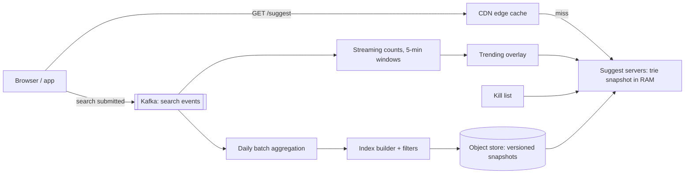

Type "net" into a search box and eight suggestions appear before your finger reaches the next key. That is roughly 100 milliseconds, end to end, for a request that is issued on nearly every keystroke. The search box therefore generates several times more traffic than search itself, every request has a latency budget smaller than a cross-continent round trip, and the answer ("the most popular queries starting with this prefix, right now, for this language") depends on a pipeline that has to count a billion searches a day and notice within minutes that everyone just started typing "eclipse".

The design splits cleanly into two systems that meet at a file: an **offline pipeline** that turns search logs into a ranked, filtered index, and an **online service** that answers prefix lookups from memory. Most weak answers put a database query on the keystroke path. Strong answers precompute everything, show that the index fits in RAM, and spend their time on freshness, caching and safety.

## Requirements

### Functional

- Given a prefix, return up to 8 suggested complete queries, ranked mostly by popularity, per language and region.
- Reflect long-term popularity (updated daily) and trending queries (surfacing within about 10 minutes).
- Never suggest blocked content (hate, sexual content, defamation, personal data); support removing a suggestion globally within a minute.
- Optionally blend in the user's own recent searches.
- Out of scope: spelling correction in the full search, the search results themselves.

### Non-functional

| Property | Target |
|---|---|
| Traffic | 1 billion searches per day; suggestion requests on most keystrokes |
| Latency | p99 under 100 ms at the client; under 10 ms inside the service |
| Availability | 99.99% for serving; stale suggestions are acceptable, missing ones are not |
| Freshness | Trending queries within ~10 minutes; base ranking daily |
| Consistency | None required between users or replicas; two users may briefly see different lists |

The consistency row matters: say explicitly that this is an availability-first, eventually consistent read path, which frees you to cache aggressively.

## Back-of-envelope estimates

**Request rate.** 1 billion searches a day. An average query is about 20 characters, but clients skip requests while the user types quickly and many searches are completed from a suggestion after 3–4 characters; assume 6 suggestion requests per search. $6 \times 10^9 / 10^5 = 60{,}000$ requests per second on average, about 150,000 at peak. **Consequence: nothing on this path can touch a disk or a database.**

**Latency budget.** A typist at 40 words per minute presses a key about every 300 ms, and fast typists every 100–150 ms. A suggestion arriving after the next keystroke is wasted. The client's round trip to a nearby edge is 20–50 ms on a good network, so the service gets around 10 ms, and a single lookup must be microseconds.

**Edge cacheability.** Prefixes of up to three letters over a–z number $26 + 676 + 17{,}576 = 18{,}278$ per language, and every typed search passes through them. A tiny keyset carrying a large share of traffic is the ideal CDN workload. Assume the edge answers 60% of requests with a TTL of a few minutes. The origin then sees about 60,000 requests per second at peak.

**Index size.** Keep only queries searched by at least a threshold number of distinct users over 30 days: assume 100 million candidate queries averaging 20 bytes, 2 GB of text. A plain trie over them could have a billion nodes, but a *compressed* (radix) trie, where chains of single-child nodes collapse into one edge, has at most about $2n$ nodes for $n$ strings: 200 million. Storing the top 8 at each node as 4-byte query IDs is 32 bytes, plus ~24 bytes of structure: $2 \times 10^8 \times 56 \approx 11$ GB. Add the query dictionary (100 million × ~30 bytes = 3 GB) and the whole index is about 15 GB. **Consequence: a full index fits in the RAM of one ordinary server. Do not shard it; replicate it.**

**Serving fleet.** An in-memory lookup is a few microseconds; the HTTP handling around it dominates, so a node handles perhaps 20,000–50,000 requests per second. 60,000 at peak is three nodes; run six per region across three zones for headroom and zone loss, in five regions for latency. Thirty small servers. The serving tier is cheap; the pipeline is where the work is.

**Pipeline.** 1 billion logged searches at ~200 bytes is 200 GB a day, 6 TB for a 30-day window. A daily batch job over 6 TB is routine; a stream of 12,000 events per second is routine. Neither needs special engineering, only correctness.

## API design

```text
GET /v1/suggest?q=net&lang=en&region=US&limit=8
→ 200
  Cache-Control: public, max-age=300
  { "q": "net",
    "suggestions": ["netflix", "netflix login", "net worth", "netball", "network error",
                    "net zero", "netanya", "netgear router"],
    "complete": false,
    "index_version": "2026-09-26T04:00Z+trend-1830" }
```

The request is a cacheable `GET` with no user identity in it, which is what lets the CDN serve it. The server normalises `q` (Unicode NFKC, case folding, whitespace collapsed) so that `Net`, `net` and `ｎｅｔ` share one cache entry. `complete: true` means the prefix has at most `limit` candidates in total, which lets the client filter locally for every longer prefix instead of calling again. `index_version` is for debugging "why did I see that?" reports.

Personal suggestions (the user's own recent searches) come from a separate, uncached call or from on-device history, and the client merges them. Mixing identity into the shared request would drop the edge hit rate to zero.

The client matters as much as the server. It should cancel the in-flight request when a new keystroke arrives, tag each request with a sequence number and ignore any response older than the latest one it has rendered (responses can arrive out of order), and keep a small local cache so that backspacing from "netf" to "net" costs nothing.

## Data model

```sql
search_log   (ts, user_hash, session_id, query_raw, query_norm, lang, region,
              source,              -- typed | suggestion | voice
              suggestion_rank)     -- position clicked, if any
query_daily  (query_norm, lang, region, day, searches, distinct_users)
candidates   (query_id, query_norm, lang, region, score, flags)
blocklist    (pattern, match_type, lang, reason, added_by, added_at)
snapshots    (version, lang, object_key, sha256, n_queries, built_at, status)
```

The serving index is not a table. It is an immutable snapshot file per language, a compressed trie laid out as flat arrays (node edges, child ranges, top-k ID lists, and the query-string dictionary), built offline and loaded with `mmap`. Flat arrays make the file position-independent, so a node can map it and serve without deserialising 15 GB of objects.

## High-level design



**Offline path.** Search events flow into Kafka. A daily batch job counts searches and distinct users per normalised query per day, computes a decayed popularity score over 30 days, drops queries below the distinct-user threshold, applies the blocklist, and hands the survivors to the index builder, which writes a new snapshot and a manifest. Serving nodes poll the manifest, download the new snapshot, validate it, and swap it in atomically.

**Streaming path.** A stream processor keeps per-query counts in 5-minute windows and compares each against its baseline. Queries that are spiking go into a small trending overlay (thousands of entries, not millions) that is pushed to every serving node each minute.

**Online path.** The edge answers most requests. On a miss, a suggest server walks the trie to the prefix node, reads its precomputed top 8, merges any overlay matches, removes anything on the kill list, and returns.

## Deep dives

### The index: a trie with precomputed top-k

A trie stores each query as a path from the root, one character per edge, so every query starting with "net" lives in the subtree under the node for "net". Reaching that node costs $O(L)$ for a prefix of length $L$, independent of how many queries exist.

```viz
{"type": "trie", "algorithm": "prefix-autocomplete",
 "operations": [["insert","net"],["insert","netflix"],["insert","network"],["insert","networth"],["insert","news"],["insert","new"],["insert","nest"],["prefix","net"]],
 "title": "Walking to a prefix, then enumerating its subtree",
 "caption": "Reaching the node is O(L). Enumerating the subtree is the expensive part: for a one-letter prefix it is millions of nodes. Production tries do this enumeration once, offline, and store the answer at every node."}
```

The animation enumerates the subtree to find completions, which is fine for seven words and fatal for the prefix "a" over 100 million queries, where the subtree holds millions of nodes. The fix is to **store the top-k list at every node** at build time, so a query is $O(L)$ to walk plus $O(k)$ to read. There is a neat way to build it: insert queries in descending score order, and the first $k$ queries to pass through any node are exactly that node's top $k$.

```python
class Node:
    __slots__ = ("children", "top")
    def __init__(self):
        self.children = {}
        self.top = []            # best-first, at most K queries

K = 8

def build(scored_queries):
    root = Node()
    # Descending score order: the first K queries that pass through a
    # node are exactly that node's top K. No heaps, no re-sorting.
    for score, query in sorted(scored_queries, reverse=True):
        node = root
        for ch in query:
            node = node.children.setdefault(ch, Node())
            if len(node.top) < K:
                node.top.append(query)
    return root

def suggest(root, prefix):
    node = root
    for ch in prefix:            # O(len(prefix))
        node = node.children.get(ch)
        if node is None:
            return []
    return node.top              # O(1): precomputed at build time
```

After the sort, the build is linear in the total number of characters. Production versions compress unary chains, replace the dictionaries with sorted flat arrays, and store query IDs rather than strings, which is how the estimate reached 15 GB.

The alternatives, and why each loses at this scale:

| Option | How a lookup works | Why not here |
|---|---|---|
| SQL `WHERE query LIKE 'net%' ORDER BY score LIMIT 8` | B-tree range scan, then sort | The range for "a" is millions of rows; latency is milliseconds to seconds, on the keystroke path |
| Search engine completion suggester (FST-based, as in Lucene) | In-memory finite-state transducer | Good up to moderate scale; at 150,000 requests per second you run and tune a large cluster for what is a static lookup |
| Distributed KV: every prefix → top-k list | One `GET` per keystroke | Every prefix is a key: roughly a billion keys and 100+ GB with per-key overhead, plus a network hop per request |
| **In-process compressed trie snapshot** | Pointer walk in local memory | Chosen: ~15 GB, microseconds, no network hop, trivially replicated |

The KV option is the one to take seriously; it is operationally familiar and scales by sharding. It loses on memory by 5–10× and adds a hop. If your index were 500 GB (say, a product catalogue with per-merchant suggestions), the trade would flip.

### Ranking and freshness: decayed counts plus a trending overlay

Raw all-time counts rank last year's news above today's. The standard fix is an exponentially decayed score: a search $d$ days old counts $0.5^{d/h}$, where $h$ is the half-life.

Work it with $h = 7$ days. "world cup", searched 1,000 times every day, converges to a score of $1000 \times \sum_{d \ge 1} 0.5^{d/7} \approx 1000 \times 9.6 = 9{,}600$. "eclipse", searched 50,000 times yesterday and never before, scores $50{,}000 \times 0.5^{1/7} \approx 45{,}300$ today and falls below "world cup" when $50{,}000 \times 0.5^{d/7} < 9{,}600$, which is after about 17 days. The half-life is a product decision: shorter makes the box feel current and noisier; longer makes it stable and stale.

The daily batch cannot surface "eclipse" on the day of the eclipse. That is the job of the streaming path. It counts each query in 5-minute windows, compares the rate against a baseline (last week's rate for that hour, plus smoothing so a query going from 1 to 5 searches is not "trending"), and emits the few thousand queries with the largest lift as an overlay with boosted scores. Tracking counts for every distinct query in a stream is memory-hungry; a count-min sketch gives approximate counts for all queries in fixed memory, and a heap keeps the heavy hitters ([count-min sketch and HyperLogLog](/learn/advanced-data-structures/probabilistic-structures/count-min-sketch-and-hyperloglog) covers the error bounds).

At serve time the overlay is small enough to hold in its own tiny trie. For a prefix, the server takes the base top 8, adds overlay matches, re-sorts by score, and truncates. This avoids rebuilding a 15 GB index every minute while still reacting in minutes.

The daily count itself is a textbook batch job: map each log line to `(query, 1)`, shuffle by query, reduce by summing. Distinct users need a second key or a HyperLogLog per query.

```viz
{"type": "system", "scenario": "mapreduce", "nodes": 3, "title": "Daily query counts are word count",
 "caption": "Mappers emit (query, 1) per search, the shuffle groups by query, reducers sum. Counting distinct users per query is the same shape with (query, user) keys or a HyperLogLog per query."}
```

Count **distinct users**, not raw searches, as the input to ranking. A bot that types a brand name a million times is one user; a million searches from one IP should move nothing.

### Serving, caching and rollout

**Edge caching.** The cache key is `(normalised prefix, lang, region)`. Short prefixes are hot and tiny in number, so a TTL of a few minutes gives a high hit rate; the cost is that a trending query can take one TTL to appear for short prefixes, which the freshness requirement tolerates. The kill list is the exception: removing a harmful suggestion must purge edge entries too, so the removal path issues a CDN purge for every prefix of the removed query (at most a few dozen keys).

**No sharding, by design.** Because the whole index fits on one machine, every node can answer every prefix and the load balancer needs no routing logic. If it stopped fitting, shard by language first (it is a natural boundary with no cross-shard queries), and only then by prefix range, accepting that ranges must be sized by traffic rather than alphabet ("s" carries far more than "x").

**Snapshot rollout.** A new snapshot is a deployment. Validate it before any node serves it: size within 10% of the previous version, a set of golden prefixes return expected results, no suggestion matches the current blocklist. Then canary on a few nodes, compare click-through on suggestions, and roll forward. Keep the last few versions on disk so rollback is a pointer change, not a rebuild.

## Failure modes

**A bad snapshot ships.** A builder bug produces an empty index, or a filter regression lets an offensive query into the top list for a common prefix. Detection: snapshot validation, canary metrics (suggestion click-through, empty-result rate). Mitigation: automated gates, canary, instant rollback to the previous version.

**A harmful suggestion trends.** A defamatory query about a real person spikes after a news event. Detection: user reports and automated classifiers on the overlay. Mitigation: the kill list is applied last, at serve time, to base and overlay alike, reloaded every few seconds, and accompanied by a CDN purge. It must not depend on the next daily build.

**Manipulation.** Someone scripts searches to push a phrase into suggestions. Detection: spikes concentrated in few users, IP ranges or user agents. Mitigation: rank on distinct users, cap the contribution of any user or IP per query per day, and require the trending overlay to see breadth across users before boosting.

**The streaming path stalls.** Detection: overlay age. Mitigation: nodes keep serving the last overlay until it is too old, then drop it; the base index still answers. Degradation is "slightly less current", never "no suggestions".

**Cold start.** A node restarting has to load 15 GB. With `mmap` it can start serving immediately and fault pages in from local disk, but its first seconds will be slow, so the readiness probe waits for a warm-up pass over the hot prefixes, and deploys proceed a zone at a time.

**A client bug floods the service.** A release that sends a request every character with no cancellation, or retries in a tight loop, can multiply load. Mitigation: per-client rate limits at the edge, and shed load by returning cached or empty results rather than erroring.

## Senior follow-ups

**Q: "How would you handle typos, like 'netflx'?"**

Only when the exact prefix is weak: if "netflx" has fewer than 8 completions, also look up candidates within edit distance 1. Doing that by brute force over the trie explores many branches, so use a structure built for it: a Levenshtein automaton intersected with the trie or FST, or a precomputed "deletion neighbourhood" index where each query is also stored under its single-character deletions, so "netflx" and "netflix" meet at "netflx". The corrected candidates are ranked below exact-prefix matches with a penalty. This costs memory (the deletion index is many times the size of the base) and latency, so it is a fallback, not the default path.

**Q: "How fast can a brand-new query appear, and what limits it?"**

The streaming path sees it within one 5-minute window and pushes the overlay within a minute, so a few minutes at the origin plus up to one edge TTL for short prefixes. The real limit is deliberate: we require a query to reach a minimum number of distinct users before suggesting it, both for privacy and for abuse resistance. Faster is possible, but every minute removed makes it easier to inject a phrase.

**Q: "What stops autocomplete from leaking someone's private search?"**

A query that one person typed (their own name and a diagnosis, say) must never be suggested to anyone else. The rule is a distinct-user threshold: only queries searched by at least N different users in the window are eligible, with N set with the privacy team, and never raw counts, which one user can inflate. The same threshold applies to the trending overlay. Personal history is shown only to its owner and never enters the shared index.

**Q: "Why not just use Elasticsearch?"**

At moderate scale I would: its completion suggester is an in-memory FST, it handles analysis and multiple languages, and a team already operates it. At 150,000 requests per second with a 10 ms budget, the question becomes cost and predictability: a static, read-only index replicated in-process is a few dozen small servers with no cluster coordination, no GC-sensitive heap full of segments, and no network hop. The index changes once a day plus an overlay; a general search engine is paying for write flexibility we do not use.

**Q: "How do you know whether a ranking change made suggestions better?"**

Online, with an A/B test, on metrics that capture effort saved: suggestion acceptance rate, characters typed before a search is submitted, and the position of the accepted suggestion (mean reciprocal rank). Guard against optimising the wrong thing: a change that raises acceptance by suggesting sensational queries can hurt downstream search satisfaction, so track the success of the search that follows too.

**Q: "What changes for Japanese or Chinese?"**

The prefix is not what the user is typing. With an input method, the user types phonetic input (romaji, pinyin) and selects characters; the box may send a partially composed string. The index needs entries keyed by the phonetic reading as well as the script, normalisation rules are language-specific, and there are no spaces to tokenise on. That is a strong argument for per-language indexes built by per-language pipelines, which is also the natural sharding boundary.

## Senior signals

- You separate an **offline ranking pipeline** from an **online lookup service** and put nothing on the keystroke path that touches a disk.
- You show that the **index fits in RAM** on one machine and therefore **replicate instead of shard**, and you know why a compressed trie has at most about $2n$ nodes.
- You **precompute top-k per node**, and you can build it in one pass by inserting in score order.
- You pair **decayed popularity** with a **streaming trending overlay** instead of rebuilding the index every minute.
- You keep the request **anonymous and cacheable** and move personalisation to a separate call or the client.
- You raise the **privacy threshold** and the **serve-time kill list** before the interviewer does.

## Check yourself

```quiz
- q: >-
    Why does precomputing a top-k list at every trie node matter so much for autocomplete?
  options: ["It lets the trie support deletions without rebuilding the snapshot", "It shrinks the trie, because every node stores IDs instead of full strings", "It avoids enumerating a short prefix's huge subtree on every keystroke", "It makes each insertion O(1), so the index can update in real time"]
  answer: 2
  explanation: >-
    Walking to the prefix node is O(L), but finding the best completions by enumerating its subtree costs time proportional to the subtree size, which for a one-letter prefix is millions of queries. Precomputing moves that cost to the offline build. It increases memory rather than shrinking it, which is the trade-off.
- q: >-
    The estimated index is about 15 GB and peak origin traffic is 60,000 requests per second. What is the best serving topology?
  options: ["Query the search engine's primary index directly on each keystroke", "Shard the trie by first letter across 26 nodes behind a router", "Store every prefix in a Redis cluster and query it per keystroke", "Load the full snapshot on every node and scale out with replicas"]
  answer: 3
  explanation: >-
    Full replicas behind a plain load balancer make every node interchangeable. Sharding what fits on one machine adds routing and hot-shard problems (s is far larger than x) for no benefit. A Redis prefix map works but costs several times the memory plus a network hop per keystroke.
- q: >-
    With a 7-day half-life, a query searched 50,000 times once competes with one searched 1,000 times every day. Roughly how long does the spike outrank the steady query?
  options: ["About 50 days", "About 7 days", "About 1 day", "About 17 days"]
  answer: 3
  explanation: >-
    The steady query converges to about 1,000 x 9.6 = 9,600. The spike decays from 50,000 by half every 7 days and crosses 9,600 after about 17 days. The raw 50:1 ratio ignores that the steady query's score accumulates. Choosing the half-life is choosing this trade-off between feeling current and being stable.
- q: >-
    A product manager asks to include the user ID in the suggest request so every list can be personalised. What is the main cost?
  options: ["It blows the 10 ms latency budget, because each ID must be looked up", "It makes trending detection impossible for personalised users", "Requests become uncacheable at the CDN, so origin load multiplies", "It breaks the trie, which cannot store per-user top-k lists"]
  answer: 2
  explanation: >-
    Shared caches only work on requests that are identical across users. Personalising the whole response drops the edge hit rate toward zero, so origin load rises by several times. The usual pattern is an anonymous, cacheable base list plus a small personal list merged on the client; the trie and the trending overlay are untouched.
- q: >-
    Which rule most directly prevents autocomplete from exposing one person's private search to others?
  options: ["Encrypting the search logs at rest and in the ranking pipeline", "Using a short half-life so rare queries decay out of the index", "Rate limiting the suggest endpoint per user and per IP address", "Suggesting only queries searched by at least N distinct users"]
  answer: 3
  explanation: >-
    A distinct-user threshold ensures a query entered by one person never becomes a suggestion, however often they repeat it. Encryption protects logs but does not stop the ranking pipeline from promoting a unique query. A short half-life does not help, because a private query searched today still scores high today. Rate limits are unrelated.
```
