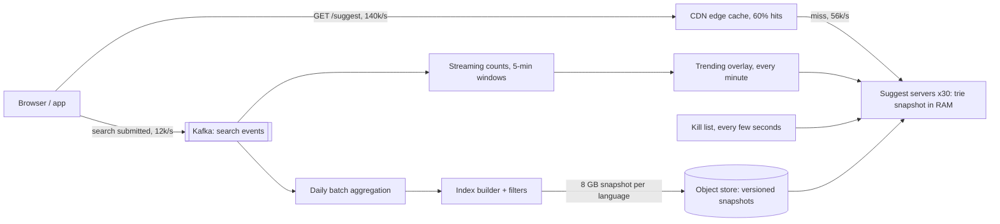

Type "net" into a search box and eight suggestions appear before your finger reaches the next key. That is roughly 100 milliseconds, end to end, for a request issued on nearly every keystroke. The search box therefore generates several times more traffic than search itself, every request has a latency budget smaller than a cross-continent round trip, and the answer ("the most popular queries starting with this prefix, right now, for this language") depends on a pipeline that counts a billion searches a day and notices within minutes that everyone has started typing "eclipse".

The design splits into two systems that meet at a file: an **offline pipeline** that turns search logs into a ranked, filtered index, and an **online service** that answers prefix lookups from memory. Weak answers put a database query on the keystroke path. Strong answers precompute everything, prove with arithmetic that the index fits in RAM, and spend their time on freshness, caching and safety.

## Requirements

### Functional

- Given a prefix, return up to 8 complete queries, ranked mostly by popularity, per language and region.
- Reflect long-term popularity (updated daily) and trending queries (surfacing within about 10 minutes).
- Never suggest blocked content (hate, sexual content, defamation, personal data); remove a suggestion globally within a minute.
- Optionally blend in the user's own recent searches.
- Out of scope: spelling correction in full search, and the search results themselves.

### Non-functional

| Property | Target |
|---|---|
| Latency | p99 under 100 ms at the client; under 10 ms inside the service |
| Availability | 99.99% for serving; stale suggestions are acceptable, missing ones are not |
| Freshness | Trending queries within ~10 minutes; base ranking daily |
| Consistency | None between users or replicas; two users may briefly see different lists |
| Privacy | No query typed by only a few people is ever suggested to anyone else |

Say the consistency row out loud: this is an availability-first, eventually consistent read path, which frees you to cache aggressively.

### Scale

1 billion searches a day in one language family; 6 suggestion requests per search (clients skip requests while typing fast, and many searches are completed from a suggestion after 3–4 characters); 100 million candidate queries averaging 20 characters; five serving regions.

## Back-of-envelope estimates

| Quantity | Arithmetic | Result |
|---|---|---|
| Suggest requests | $10^9$ × 6 ÷ 86,400 s | 69,000/s average, 140,000/s at a 2× peak |
| Edge-cacheable keys | Prefixes of up to 3 letters: 26 + 676 + 17,576 | 18,278 per language, on the path of every search |
| Origin traffic | 60% edge hit rate (assumed) | 56,000/s at peak |
| Response size | 8 suggestions × ~20 B + JSON, compressed | ~400 B |
| Egress | 140,000 × 400 B at the edge; 56,000 × 400 B at origin | 56 MB/s (450 Mbps); 22 MB/s |
| Index in RAM | 100 M queries, measured node ratios (deep dive 1) | 6.3–8.2 GB |
| Search log | $10^9$ × ~200 B | 200 GB/day; 6 TB for the 30-day window |
| Event stream | $10^9$ ÷ 86,400 s | 12,000 events/s |

### Machine counts

| Tier | Sizing | Count |
|---|---|---|
| Suggest servers | A lookup is microseconds; HTTP handling dominates, so assume 20,000 req/s per node (depends on language and TLS placement). A region takes up to 40% of the 56,000/s at its local peak: 22,400 ÷ 20,000 × 1.5 to survive losing one of three zones = 2 nodes, raised to a floor of 2 per zone | 6 per region, 30 in 5 regions, 32 GB RAM each |
| Snapshot distribution | 8 GB per node per day; 30 nodes | 240 GB/day; ~70 s per node at 1 Gbps |
| Daily batch | 6 TB scanned once a day | A few hundred cores for an hour |
| Stream processing | 12,000 events/s, 5-minute windows | 3–4 workers, one per Kafka partition group |

The sentence that matters: the whole index fits in the RAM of one ordinary server, so the serving tier is 30 replicas with no shards, and the engineering goes into the pipeline, the edge cache and the safety filters.

## API design

```text
GET /v1/suggest?q=net&lang=en&region=US&limit=8
-> 200  Cache-Control: public, max-age=300
  {"q": "net",
   "suggestions": ["netflix", "netflix login", "net worth", "netball", "network error",
                   "net zero", "netanya", "netgear router"],
   "complete": false,
   "index_version": "2026-09-26T04:00Z+trend-1830"}
-> 200 with an empty list, never 5xx, when the service is degraded
```

The request is a cacheable `GET` with no user identity, which is what lets the CDN serve it. The server normalises `q` (Unicode NFKC, case folding, collapsed whitespace) so `Net`, `net` and `ｎｅｔ` share one cache entry. `complete: true` means the prefix has at most `limit` candidates in total, so the client filters locally for longer prefixes instead of calling again. `index_version` answers "why did I see that?" reports. Personal suggestions come from a separate, uncached call or from on-device history, merged by the client; identity in the shared request would drop the edge hit rate to zero. The client cancels superseded requests, tags each with a sequence number and ignores any response older than the one it has rendered, and keeps a small local cache so backspacing from "netf" to "net" costs nothing.

## Data model

```sql
search_log   (ts, user_hash, session_id, query_raw, query_norm, lang, region,
              source,              -- typed | suggestion | voice
              suggestion_rank)     -- position clicked, if any
query_daily  (query_norm, lang, region, day, searches, distinct_users)
candidates   (query_id, query_norm, lang, region, score, flags)
blocklist    (pattern, match_type, lang, reason, added_by, added_at)
snapshots    (version, lang, object_key, sha256, n_queries, built_at, status)
```

| Table | Partition key | Sort key | Indexes | Why |
|---|---|---|---|---|
| `search_log` | `(day, hour)` | `ts` | none | 12,000 appends/s; the batch job reads whole days |
| `query_daily` | `(lang, day)` | `query_norm` | none | Written once a day; the decay job scans 30 days of one language |
| `candidates` | `(lang, region)` | `score` descending | unique `query_norm` | The index builder reads one partition in score order, which is the order its one-pass build needs |
| `blocklist` | `lang` | `pattern` | none | Read by the builder and reloaded by every server every few seconds |
| `snapshots` | `lang` | `version` | `status` | Each server polls for the newest validated version of its languages |

The serving index is not a table. It is an immutable snapshot file per language, a compressed trie laid out as flat arrays, built offline and loaded with `mmap`. Flat arrays make the file position-independent, so a node serves from it without deserialising millions of objects.

## High-level design



The daily batch counts searches and distinct users per normalised query, computes a decayed score over 30 days, drops queries below the distinct-user threshold, applies the blocklist and builds a snapshot; servers download, validate and swap it in atomically. A stream processor keeps 5-minute counts and pushes a small trending overlay each minute. On a miss, a server walks the trie to the prefix node, reads its precomputed top 8, merges overlay matches, removes kill-list entries and returns.

## Deep dive 1: the index, trie against precomputed top-k

A [trie](/learn/data-structures/tries-and-string-structures/tries) stores each query as a path from the root, one character per edge, so every query starting with "net" lives under the node for "net". Reaching that node costs $O(L)$ for a prefix of length $L$, whatever the number of queries.

```viz
{"type": "trie", "algorithm": "prefix-autocomplete",
 "operations": [["insert","net"],["insert","netflix"],["insert","network"],["insert","networth"],["insert","news"],["insert","new"],["insert","nest"],["prefix","net"]],
 "title": "Walking to a prefix, then enumerating its subtree",
 "caption": "Reaching the node is O(L). Enumerating the subtree is the expensive part: for a one-letter prefix it is millions of nodes. Production tries do this enumeration once, offline, and store the answer at every node."}
```

The animation enumerates the subtree, which is fine for seven words. In the measured log below, 11.3% of all queries sit under "t"; at 100 million queries that is 11 million queries to rank on one keystroke. So **store the top-k list at every node** at build time: a lookup is $O(L)$ to walk plus $O(k)$ to read. Insert queries in descending score order and the first $k$ queries to pass through a node are exactly its top $k$:

```python
class Node:
    __slots__ = ("children", "top")
    def __init__(self):
        self.children = {}
        self.top = []            # best-first, at most K queries

K = 8

def build(scored_queries):
    root = Node()
    # Descending score order: the first K queries that pass through a node
    # are exactly that node's top K. No heaps, no re-sorting.
    for score, query in sorted(scored_queries, reverse=True):
        node = root
        for ch in query:
            node = node.children.setdefault(ch, Node())
            if len(node.top) < K:
                node.top.append(query)
    return root

def suggest(root, prefix):
    node = root
    for ch in prefix:            # O(len(prefix))
        node = node.children.get(ch)
        if node is None:
            return []
    return node.top              # precomputed at build time

root = build([(900, "netflix"), (300, "net worth"), (120, "netball"), (1000, "news")])
print(suggest(root, "net"))      # ['netflix', 'net worth', 'netball']
```

After the sort the build is linear in total characters. Ties in score must be broken deterministically (for example by the query string) or two builds of the same data disagree.

### Memory, measured and extrapolated

To put numbers on it, a synthetic query log: every run of 1 to 3 consecutive words in a 1.5-million-word snapshot of this curriculum's prose, counted, keeping runs seen at least twice (the stand-in for a distinct-user threshold). That gives 302,133 queries averaging 11.8 characters. Random subsets show how the ratios drift with size:

| Queries | Plain-trie nodes per query | Radix-trie nodes per query | Top-k IDs per radix node | Prefixes with a full top 8 |
|---|---|---|---|---|
| 30,213 | 5.74 | 1.40 | 2.01 | 2.2% |
| 90,639 | 4.77 | 1.35 | 2.05 | 2.6% |
| 302,133 | 3.64 | 1.25 | 2.22 | 3.3% |

A **radix** trie collapses chains of single-child nodes into one labelled edge, so it has at most one node per query plus one per branching point: at most $2n$. The measured 1.25 per query is well inside that bound. Most nodes are deep, with one or two queries beneath them, so the average top-k list holds 2.2 IDs, not 8.

Extrapolated to 100 million queries: a 16-byte node record (label offset and length, first-child index, child count, top-k offset and count), 4-byte query IDs, labels holding each plain-trie edge character once (planned at 4 per query, since the ratio falls with size), and a dictionary of 20-byte strings with offsets and scores:

| Component | At 1.25 nodes per query | At the 2n bound |
|---|---|---|
| Node records | 125 M × 16 B = 2.0 GB | 3.2 GB |
| Top-k IDs | 125 M × 2.22 × 4 B = 1.1 GB | 1.8 GB |
| Edge labels | 0.4 GB | 0.4 GB |
| Query dictionary | 100 M × 28 B = 2.8 GB | 2.8 GB |
| **Total** | **6.3 GB** | **8.2 GB** |

Budgeting 8 IDs at every node overstates the top-k lists 3.6×. The lesson's own Python `Node` class measured 304 bytes per node with `tracemalloc`, which at 400 million plain-trie nodes is about 120 GB: flat arrays are what make one machine enough.

### The alternatives

| Option | How a lookup works | Why not here |
|---|---|---|
| SQL `LIKE 'net%' ORDER BY score LIMIT 8` | B-tree range scan, then sort | The range for "t" is 11 million rows, on the keystroke path |
| Search-engine completion suggester (an FST, as in Lucene) | In-memory finite-state transducer | Good at moderate scale; at 140,000 req/s you run a cluster for a static lookup |
| Key-value store: prefix → top-k strings | One `GET` per keystroke | 400 M keys × (~70 B of per-key overhead + 11.5 B key + 1.65 × 21 B values) ≈ 46 GB per replica, plus a network hop |
| **In-process radix-trie snapshot** | Array walk in local memory | Chosen: 6–8 GB, microseconds, no hop, trivially replicated |

The key-value option is the one to take seriously: it is familiar and shards easily. It loses on memory by 6–7× and adds a hop; with a 500 GB index (per-merchant suggestions over a product catalogue) the trade flips.

## Deep dive 2: ranking and freshness

Raw all-time counts rank last year's news above today's. An exponentially decayed score counts a search $d$ days old as $0.5^{d/h}$, with half-life $h$. With $h = 7$: "world cup", searched 1,000 times every day, converges to $1000 \times \sum_{d \ge 1} 0.5^{d/7} \approx 1000 \times 9.6 = 9{,}600$. "eclipse", searched 50,000 times yesterday and never before, scores $50{,}000 \times 0.5^{1/7} \approx 45{,}300$ and falls below "world cup" when $50{,}000 \times 0.5^{d/7} < 9{,}600$, after about 17 days. The half-life is a product decision: shorter feels current and noisier, longer is stable and stale.

The daily batch cannot surface "eclipse" on the day. The streaming path counts each query in 5-minute windows, compares the count against a baseline (last week's count for that window plus smoothing, so 1 → 5 searches is not "trending"), and emits the few thousand queries with the largest lift as an overlay. Exact counts for every distinct query in a stream are memory-hungry; a count-min sketch gives approximate counts in fixed memory and a heap keeps the heavy hitters ([count-min sketch and HyperLogLog](/learn/advanced-data-structures/probabilistic-structures/count-min-sketch-and-hyperloglog)). Rank on **distinct users**, not raw searches: a bot that types a brand name a million times is one user.

### A trending query, traced

| t | Component | Action | State |
|---|---|---|---|
| 12:00:00 | Users | "eclipse glasses" jumps from 20 to 30,000 searches a minute | |
| 12:00–12:05 | Stream processor | 5-minute tumbling window, sketch counts plus a heavy-hitter heap | 150,000 searches, 120,000 distinct users |
| 12:05:10 | Stream processor | Window closes after 10 s of allowed lateness; lift = 150,000 ÷ (100 baseline + 50 smoothing) = 1,000× | Candidate; passes the distinct-user threshold |
| 12:05:40 | Overlay builder | Adds it with a boosted score; runs the classifier and kill list | Overlay version 1806 |
| 12:06:00 | Suggest servers | Pull the overlay (once a minute) and merge it at serve time | Origin answers "ecl" with it |
| 12:06–12:11 | Edge | Short prefixes cached before 12:06 keep the old list for up to 300 s | Visible everywhere by 12:11 |

Origin freshness is 6 minutes; the 5-minute edge TTL on short prefixes makes the worst case 11, one minute over the 10-minute target. Cut the short-prefix TTL to 4 minutes, or purge the affected short prefixes when the overlay changes. The overlay lives in its own small trie; at serve time the server takes the base top 8, adds overlay matches, re-sorts by score and truncates, so the 8 GB index is never rebuilt more than once a day.

```viz
{"type": "system", "scenario": "mapreduce", "nodes": 3, "title": "Daily query counts are word count",
 "caption": "Mappers emit (query, 1) per search, the shuffle groups by query, reducers sum. Counting distinct users per query is the same shape with (query, user) keys or a HyperLogLog per query."}
```

## Deep dive 3: serving a keystroke

The request path is short, so its tail and its ordering are what go wrong.

### One keystroke, traced

Assumed one-way latencies: 25 ms from client to edge and 10 ms from edge to the regional origin, plus a 150 ms garbage-collection pause on one suggest server.

| t (ms) | Component | Action | State |
|---|---|---|---|
| 0 | Client | Types "netf"; local cache miss; `GET q=netf`, sequence 4 | In flight: 4 |
| 25 | Edge | Miss for `(netf, en, US)`; forwards to origin | |
| 35–185 | Suggest server | GC pause holds the request | |
| 70 | Client | Types "netfl"; `GET q=netfl`, sequence 5 | In flight: 4, 5 |
| 95 | Edge | Hit: another user filled it 2 minutes ago | |
| 120 | Client | Sequence 5 arrives; rendered | Showing 5 |
| 185 | Suggest server | Walk 4 characters, read 8 IDs, merge 2 overlay matches, filter the kill list: ~0.2 ms | |
| 195 | Edge | Caches `netf` for 300 s; responds | |
| 220 | Client | Sequence 4 arrives; 4 < 5, discarded | Still showing 5 |

Without the sequence check the box would flip back to suggestions for "netf" while the user reads "netfl". The GC pause is the p99: to hold 100 ms, the edge hedges a miss to a second origin node after 30 ms (at most 5% more origin load if 95% of misses return within 30 ms), or the servers run with a heap small enough that pauses stay in single milliseconds, which flat arrays in `mmap` make easy.

### Edge caching, no sharding, snapshot rollout

```viz
{"type": "network", "scenario": "cdn-cache", "title": "Short prefixes live at the edge",
 "caption": "The first request for a prefix in a region misses and reaches a suggest server; later requests for the same normalised prefix, language and region are served by the edge until the TTL expires. With 18,278 prefixes of up to three letters per language, a small key set carries most of the traffic."}
```

The cache key is `(normalised prefix, lang, region)`. The kill list is the exception to TTL-based freshness: removing a harmful suggestion also purges every prefix of the removed query from the CDN, at most a few dozen keys. Because the index fits on one machine, every node answers every prefix and the load balancer needs no routing; if it stopped fitting, shard by language first (no cross-shard queries), then by prefix range sized by traffic rather than alphabet ("s" carries far more than "x"; [Database scaling](/learn/system-design/building-blocks/database-scaling) covers range sharding). A new snapshot is a deployment: validate its size (within 10% of the previous version), golden prefixes and blocklist matches before any node serves it, canary on a few nodes comparing suggestion click-through, and keep the last few versions on disk so rollback is a pointer change ([Caching strategies](/learn/system-design/building-blocks/caching-strategies)).

## Failure modes

| Failure | Symptom | Diagnosis | Fix |
|---|---|---|---|
| Bad snapshot ships | Empty lists, or an offensive query on a common prefix | Canary: suggestion click-through and empty-result rate drop | Validation gates, canary, rollback by pointer to the previous version |
| Harmful suggestion trends | User reports after a news event | Classifier flags on the overlay | Kill list applied last, to base and overlay, reloaded every few seconds, with a CDN purge |
| Manipulation | A phrase climbs with few users behind it | Spike concentrated in few users, IP ranges or user agents | Rank on distinct users, cap each user's contribution, require breadth before trending |
| Streaming path stalls | Overlay version stops advancing | Overlay age metric | Keep serving the last overlay until too old, then drop it; the base index still answers |
| Cold start after a deploy | Slow first seconds on restarted nodes | Page faults on a fresh `mmap` | Readiness waits for a warm-up pass over hot prefixes; deploy a zone at a time |
| Thundering herd from a client bug | Origin requests multiply after an app release | Requests per session, by app version | Per-client edge rate limits; serve cached or empty lists instead of errors |
| Hot prefix at the edge | Origin spike each time a viral prefix's entry expires | Misses clustered on one key | Stale-while-revalidate at the edge; jitter TTLs |
| Region loss | One region's users time out | Health checks and synthetic probes | DNS or anycast shifts traffic; every region holds the full index |

## Trade-offs: what was rejected

| Decision | Chosen | Rejected | Why rejected here | What would flip it |
|---|---|---|---|---|
| Index | Radix trie, flat arrays, in process | KV of prefix → top-k; search engine | 46 GB and a hop; a cluster for a static lookup | An index of hundreds of GB |
| Top-k | Precomputed per node | Enumerate at query time | 11 million queries under "t" | Tiny corpora |
| Topology | Full replicas | Shard by first letter | Hot shards ("s" vs "x"), routing for nothing | Index outgrows one machine |
| Freshness | Daily base + minute overlay | Rebuild every few minutes | 8 GB rebuild and redistribution to 30 nodes | An index small enough to rebuild in seconds |
| Personalisation | Separate call, merged on client | User ID in the shared request | Edge hit rate falls to zero | Traffic small enough to skip the CDN |

## Evolution at 10× and 100×

| | Today | 10× | 100× |
|---|---|---|---|
| Suggest requests at peak | 140,000/s | 1.4 million/s | 14 million/s |
| Origin at 60% edge hits | 56,000/s, 30 nodes | 560,000/s: 17 per region, 85 nodes | 5.6 million/s: ~850 nodes |
| Candidate queries | 100 M, 6–8 GB | 1 B, 60–80 GB | 10 B, 600–800 GB |

At 10× traffic the edge carries it and origin grows linearly. At 10× candidates (many languages and regions in one index, or per-merchant suggestions) the index no longer fits a commodity server's RAM with headroom: shard by language, then by traffic-sized prefix range. At 100× the key-value design stops losing on memory, because sharding is needed either way, and precomputed prefix lists in a distributed store become reasonable.

## What real companies describe

- Google's published autocomplete policies say predictions come from real searches and describe removing predictions that are violent, sexually explicit, hateful or dangerous, among other categories: the kill list is a product requirement, not an afterthought.
- Lucene and Elasticsearch document a completion suggester built on an in-memory finite-state transducer, the main alternative to a hand-built trie.
- LinkedIn's engineering blog described Cleo, an open-sourced typeahead library, and Facebook's engineering blog described the path of a typeahead query; both treat the index as in-memory and the request path as a latency budget.
- The corpus, ratios and node sizes above are from this lesson's own simulation, and the traffic figures are illustrative.

## Interviewer follow-ups

**"How would you handle typos, like 'netflx'?"** Model answer: only when the exact prefix is weak. If "netflx" has fewer than 8 completions, look up candidates within edit distance 1, using a Levenshtein automaton intersected with the trie or a deletion-neighbourhood index where "netflx" and "netflix" meet at a shared deletion, and rank them below exact matches. The deletion index is many times the base size, so it is a fallback. Common wrong answer: brute-force edit distance against every query.

**"How fast can a brand-new query appear, and what limits it?"** Model answer: about 6 minutes at origin and 11 at the edge, from the trace. The deliberate limit is the distinct-user threshold: every minute removed makes it easier to inject a phrase. Common wrong answer: "rebuild the trie in real time", which is not the bottleneck.

**"What stops autocomplete leaking someone's private search?"** Model answer: only queries searched by at least N distinct users in the window are eligible, with N set with the privacy team, in the batch and the overlay alike; personal history is shown only to its owner and never enters the shared index. Common wrong answer: "we encrypt the logs", which does not stop the ranking pipeline promoting a unique query.

**"Why not use Elasticsearch?"** Model answer: at moderate scale I would. At 140,000 requests a second and a 10 ms budget, a static index replicated in-process is 30 small servers with no cluster coordination and no network hop, and it changes once a day plus an overlay; a search engine pays for write flexibility this workload does not use. Common wrong answer: "it doesn't scale", when the reason is cost and predictability.

## What mid-level engineers get wrong

- Querying a database with `LIKE 'prefix%'` on every keystroke.
- Enumerating the subtree at query time; "t" holds 11 million queries at this scale.
- Sharding an index that fits on one machine, and inheriting hot shards.
- Budgeting 8 IDs at every trie node, or pointer-based nodes at ~300 bytes each, and concluding the index cannot fit.
- Ranking on raw counts, so one bot or one person's repeated search reaches everyone.
- Putting the user ID in the shared request and losing the edge cache.
- Rendering responses in arrival order, so an old list overwrites a newer one.

## Exercise

```exercise
id: top-k-autocomplete
title: Top-k autocomplete suggestions
prompt: |
  Implement `top_k_suggestions(pairs, prefix, k)`. `pairs` is a list of
  `[query, count]` from several log shards; the same query can appear more than
  once, and its counts must be summed. Return up to `k` queries that start with
  `prefix`, ordered by total count descending, ties broken by the query string
  ascending (plain character order). An empty prefix matches every query; if
  `k` is 0 or nothing matches, return an empty list.
languages: [python, javascript]
entry: top_k_suggestions
starter:
  python: |
    def top_k_suggestions(pairs, prefix, k):
        # your code here
        return []
  javascript: |
    function top_k_suggestions(pairs, prefix, k) {
      // your code here
      return [];
    }
tests:
  - args: [[["netflix", 900], ["net worth", 300], ["netball", 120], ["network error", 300], ["news", 1000], ["nest", 50]], "net", 3]
    expected: ["netflix", "net worth", "network error"]
  - args: [[["netflix", 900], ["net worth", 300], ["netball", 120], ["network error", 300], ["news", 1000], ["nest", 50]], "ne", 10]
    expected: ["news", "netflix", "net worth", "network error", "netball", "nest"]
    label: k larger than the matches
  - args: [[["netflix", 900], ["netball", 120], ["netball", 250], ["net worth", 300]], "net", 2]
    expected: ["netflix", "netball"]
    label: counts from two shards are summed
  - args: [[["netflix", 900], ["news", 1000]], "", 2]
    expected: ["news", "netflix"]
    label: empty prefix matches everything
  - args: [[["netflix", 900], ["news", 1000]], "xyz", 3]
    expected: []
    label: no matches
  - args: [[["netflix", 900], ["news", 1000]], "ne", 0]
    expected: []
    hidden: true
  - args: [[["news", 40], ["newsletter", 90], ["new", 500], ["news today", 90]], "news", 3]
    expected: ["news today", "newsletter", "news"]
    label: a space sorts before any letter
    hidden: true
  - args: [[["b", 5], ["a", 5], ["c", 5], ["ab", 5]], "", 3]
    expected: ["a", "ab", "b"]
    label: equal counts fall back to string order
    hidden: true
hints:
  - "Sum counts into a dictionary first, then filter by prefix."
  - "Sort by the key (-count, query); in JavaScript compare strings with < and > rather than localeCompare, so the order is plain character order."
```

## Senior signals

- You separate an **offline ranking pipeline** from an **online lookup service**, with nothing on the keystroke path that touches a disk.
- You **compute the index size** from node counts, bytes per node and top-k lengths, know a radix trie has at most $2n$ nodes, and know most top-k lists are short.
- You **precompute top-k per node** in one pass by inserting in score order, and know the heap-based [top-k](/learn/data-structures/heaps/top-k-and-k-way-merge) it replaces.
- You pair **decayed popularity** with a **streaming overlay** and can trace a trending query to the edge, TTL included.
- You keep the request **anonymous and cacheable**, discard **out-of-order responses**, and move personalisation to the client.
- You raise the **distinct-user threshold** and the **serve-time kill list** before the interviewer does.

## Check yourself

```quiz
- q: >-
    Why does precomputing a top-k list at every trie node matter so much for autocomplete?
  options: ["It shrinks the trie, because nodes store IDs instead of full strings", "It avoids ranking a short prefix's huge subtree on every keystroke", "It lets the trie support deletions without rebuilding the snapshot", "It makes each insertion O(1), so the index can update in real time"]
  answer: 1
  explanation: >-
    Walking to the prefix node is O(L), but ranking its subtree costs time proportional to the subtree size, and 11.3% of the measured queries sat under the single letter t. Precomputing moves that cost to the offline build. It adds memory rather than saving it, which is the trade-off.
- q: >-
    In the measured log, a radix trie averaged 2.2 top-k IDs per node with k = 8. Why so few?
  options: ["Most nodes are deep and have only one or two queries beneath them", "The build drops IDs whose scores fall below the distinct-user limit", "Radix nodes share one top-k list between each parent and its child", "The overlay holds most of the top-k entries outside the base index"]
  answer: 0
  explanation: >-
    A node can list at most as many queries as sit beneath it, and in a trie most nodes are near the leaves, so only 3.3% of prefixes had a full list of 8. Budgeting 8 IDs per node overstates that part of the index 3.6x. The threshold filters candidates before the build, and lists are not shared.
- q: >-
    The index is estimated at 6–8 GB and peak origin traffic is 56,000 requests per second. What is the best serving topology?
  options: ["Query the search engine's primary index directly on each keystroke", "Load the full snapshot on every node and scale out with replicas", "Shard the trie by first letter across 26 nodes behind a router", "Store every prefix in a Redis cluster and query it per keystroke"]
  answer: 1
  explanation: >-
    Full replicas behind a plain load balancer make every node interchangeable. Sharding what fits on one machine adds routing and hot shards, since s carries far more than x. A Redis prefix map works but costs about 46 GB per replica plus a network hop per keystroke.
- q: >-
    With a 7-day half-life, a query searched 50,000 times once competes with one searched 1,000 times every day. Roughly how long does the spike outrank the steady query?
  options: ["About 7 days", "About 17 days", "About 1 day", "About 50 days"]
  answer: 1
  explanation: >-
    The steady query converges to about 1,000 x 9.6 = 9,600. The spike starts near 45,300 and halves every 7 days, crossing 9,600 after about 17 days. The raw 50:1 ratio ignores that the steady query's score accumulates.
- q: >-
    A client sends a request for netf, then netfl 70 ms later. The netf response arrives last because it hit a slow origin. What should the client do?
  options: ["Merge both lists, because together they cover more possible queries", "Render it, because the newest response always reflects newer data", "Retry netfl, because the slow response means the edge cache is stale", "Discard it, because its sequence number is older than the one shown"]
  answer: 3
  explanation: >-
    Responses can arrive out of order, so the client tags each request with a sequence number and ignores any response older than the one it has rendered; otherwise the box flips back to suggestions for a prefix the user has already typed past. Arrival order says nothing about which prefix is current.
- q: >-
    Which rule most directly prevents autocomplete from exposing one person's private search to others?
  options: ["Encrypting the search logs at rest and in the ranking pipeline", "Suggesting only queries searched by at least N distinct users", "Using a short half-life so that rare queries decay out quickly", "Rate limiting the suggest endpoint per user and per IP address"]
  answer: 1
  explanation: >-
    A distinct-user threshold ensures a query entered by one person never becomes a suggestion, however often they repeat it. Encryption protects the logs but does not stop the pipeline promoting a unique query, and a private query searched today still scores high today whatever the half-life.
```
