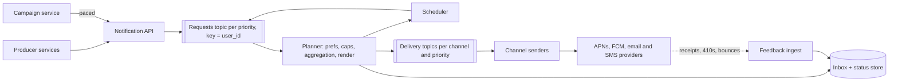

Sending one push notification is an HTTP call to Apple or Google. Sending a billion a day is a different problem: a one-time login code must arrive in seconds even while a 50-million-recipient marketing campaign is draining; a user who unsubscribed thirty seconds ago must not receive the next message; a phone that was offline for two hours must not wake up to "your driver is arriving"; and the whole thing depends on third-party providers that rate-limit you, go down, and never tell you for certain whether a human saw the message.

The interesting failures here are rarely "the system was slow". They are *duplicates* (the same receipt email three times), *wrong audience* (the test push that went to everyone), *wrong time* (3 a.m.), and *silent loss* (the password reset that never arrived). A strong design is organised around preventing those four, and it chooses different delivery guarantees for different kinds of message.

## Requirements

### Functional

- Internal services send notifications to a user by category (security, transactional, social, marketing); the platform chooses channels (iOS/Android push, email, SMS, in-app inbox) from the user's preferences and devices.
- Templates with localisation; per-category and per-channel opt-outs; quiet hours in the user's time zone; frequency caps for marketing.
- Scheduled sends and bulk campaigns to audience segments of tens of millions.
- Aggregation of bursts ("Ana and 37 others liked your photo").
- An in-app inbox of the last 90 days, and delivery status per message.
- Out of scope: the segmentation engine that builds audiences, and the content of messages.

### Non-functional

| Property | Target |
|---|---|
| Volume | 1 billion notifications per day across 300 million users |
| Critical latency | Security codes handed to the provider within 5 s at p99, even during campaigns |
| Social latency | p95 under 30 s |
| Campaigns | 50 million recipients delivered within 30 minutes (or per time-zone wave) |
| Duplicates | Avoided for marketing; collapsed on the device for receipts; tolerated for security codes |
| Availability | 99.99% for accepting requests; delivery may be delayed, never silently dropped |

Ask which categories exist and what each can tolerate. The answer drives the delivery-semantics decision later.

## Back-of-envelope estimates

**Throughput.** $10^9 / 10^5 = 10{,}000$ notifications per second on average. A 50-million-recipient campaign in 30 minutes adds $5 \times 10^7 / 1800 \approx 28{,}000$ per second on top of an organic peak of 2–3× average. **Design for roughly 60,000 per second at peak**, and note that nearly half of it can be one campaign.

**Channel mix and cost.** Assume 85% push, 14% email, 1% SMS. Push and email cost fractions of a cent; SMS costs on the order of a cent per message in the US and several times more in many countries. 10 million SMS a day is on the order of \$100,000 a day. **Consequence: SMS is reserved for security codes and critical fallbacks; the router must never fail over marketing to SMS.**

**Storage.** A notification record (IDs, template, parameters, status per channel) is about 500 bytes: 500 GB a day, 45 TB for a 90-day inbox, about 135 TB with three replicas. Every read is "this user's recent notifications". **Consequence: a wide-column store partitioned by `user_id` with time-ordered clustering, not a relational primary.**

**Lookups per message.** Each notification needs the user's preferences and device tokens. At 60,000 per second that is 60,000 preference reads and 60,000 device reads per second. Preferences for 300 million users at ~1 KB are 300 GB; tokens for 450 million devices at ~250 bytes are ~110 GB. Both are cacheable and change rarely.

**Provider concurrency.** Provider calls take on the order of 100 ms. By Little's law, 50,000 pushes per second × 0.1 s = 5,000 requests in flight. HTTP/2 multiplexes many concurrent streams per connection, so this is tens of connections per provider rather than thousands, but it is a pool you must size and monitor.

## API design

```text
POST /v1/notifications
  Authorization: service token (order-service)
  { "idempotency_key": "order-8812:shipped",
    "user_id": "u_42",
    "category": "transactional.order_update",
    "template": "order_shipped",
    "params": { "order_id": "8812", "eta": "2026-09-28" },
    "priority": "normal",
    "expires_at": "2026-09-27T12:00:00Z" }
→ 202 { "notification_id": "01J8Z…" }

POST /v1/campaigns
  { "segment_id": "lapsed_30d", "template": "we_miss_you", "send_at_local": "10:00",
    "max_rate_per_s": 20000, "canary_percent": 1 }
→ 201 { "campaign_id": "c_77", "estimated_audience": 48210331, "status": "pending_approval" }

GET  /v1/users/u_42/inbox?cursor=…          (in-app inbox, newest first)
PUT  /v1/users/u_42/preferences             (opt-outs, quiet hours, time zone)
POST /v1/devices   { "platform": "ios", "token": "…", "app_version": "9.4.1" }
POST /webhooks/{provider}                   (bounces, complaints, delivery receipts)
```

Three fields do most of the work. `idempotency_key` is chosen by the producer from the domain (`order-8812:shipped`), so a producer retry, a replayed event or a double-fired trigger all collapse into one notification. `category` is what preferences, caps, priority and delivery semantics key on; producers never pick channels directly. `expires_at` lets a message die rather than arrive late and wrong. The campaign API returns an estimated audience and starts in `pending_approval`, because the most damaging bug in this system is sending the right message to the wrong 48 million people.

## Data model

```sql
-- wide-column store, partitioned by recipient
notifications (user_id, notification_id,        -- time-ordered id (ULID)
               category, template_id, locale, params, priority,
               expires_at, status_by_channel,
               PRIMARY KEY ((user_id), notification_id))   -- newest first
deliveries    (notification_id, channel, device_id, attempt, provider,
               provider_message_id, status, error_code, updated_at)
idempotency   (producer, idempotency_key) → notification_id      TTL 72 h
preferences   (user_id, category, channel, enabled, quiet_start, quiet_end,
               time_zone, updated_at)
devices       (user_id, device_id, platform, token, app_version, last_seen, invalid_at)
suppression   (address_or_number, reason, added_at)   -- bounces, complaints, STOP
```

The `suppression` list is global and separate from preferences: an email address that hard-bounced or a number that replied STOP is suppressed for every category, and checking it is not optional.

## High-level design



**Ingest.** The API authenticates the producer, validates the template and category, claims the idempotency key, and appends the request to a Kafka topic for its priority, keyed by `user_id`. It returns 202 once the broker has acknowledged. Nothing slow happens on the producer's request path.

**Planning.** A planner consumes each partition. For every request it loads preferences (from a cache), applies opt-outs, suppression, quiet hours and frequency caps, aggregates bursts, renders the localised template, looks up device tokens, writes the inbox row, and emits one delivery job per channel and device onto a delivery topic for that channel and priority. Messages that must wait (quiet hours, `send_at`, time-zone waves) go to the scheduler, which re-injects them when due.

**Delivery.** Channel senders are thin: take a job, check it has not expired, take a token from the provider's rate limiter, call the provider, record the outcome. Feedback (APNs "unregistered" responses, email bounces and complaints, SMS receipts, client open events) flows back to update status, invalidate tokens and grow the suppression list.

## Deep dives

### Delivery semantics, chosen per category

Every hop in this pipeline is at-least-once: producers retry, Kafka redelivers after a consumer crash, senders retry provider timeouts. Duplicates enter at three places, and each has a different fix.

1. **Producer retries.** The idempotency key is claimed with an atomic conditional insert (`SET NX` with a 72-hour TTL, or a conditional write in the store). A second request with the same key returns the original `notification_id`.
2. **Planner redelivery.** If a planner crashes after writing some delivery jobs but before committing its Kafka offset, the request is processed again. The notification row is an upsert keyed by `notification_id`, and delivery jobs carry a deterministic ID `(notification_id, channel, device_id)`, so the sender can drop a job it has already completed.
3. **The provider boundary.** A sender calls APNs, APNs accepts, and the sender dies before recording success. On redelivery it cannot know whether the push went out. No protocol fixes this, because the provider does not participate in your transaction. This is the exactly-once illusion in its purest form ([exactly-once semantics](/learn/system-design/distributed-systems/exactly-once-semantics) covers the general argument).

Since the last hop cannot be made exactly-once, you **choose the failure you prefer per category**:

| Category | Worse outcome | Semantics | On an ambiguous send |
|---|---|---|---|
| Security code (OTP) | Not arriving: the user is locked out | At-least-once | Retry; a duplicate carries the same code and is harmless |
| Receipt, order update | Both are bad; duplicates erode trust | At-least-once with collapse | Retry with the same collapse identifier so the device replaces rather than stacks |
| Marketing | A duplicate promotion is worse than a missed one | At-most-once | Do not retry an ambiguous send; record it as sent |

Providers help at the device end. APNs accepts an `apns-collapse-id` header and FCM a `collapse_key`, so a later notification with the same identifier replaces an undisplayed earlier one. Setting the collapse identifier to the `notification_id` turns many duplicate pushes into one visible notification. In-app messages carry the ID so the client can dedupe. Email has no equivalent, which is why email senders record "sending" before the call and treat an ambiguous marketing email as sent.

### Priority isolation and pacing

Put a 50-million-recipient campaign and a login code in one FIFO queue and do the arithmetic: at 28,000 per second the campaign takes 30 minutes to drain, and a code enqueued behind it waits 30 minutes. A priority field inside the message does not help; the campaign is already ahead in the log.

The fix is structural isolation (a bulkhead): separate topics for each priority class and each channel, separate consumer groups, and **reserved sender capacity and provider quota for the critical class**, so a campaign can saturate its own lane without touching the critical lane. Codes and security alerts have their own topic, their own planners and a reserved share of each provider's rate limit.

Campaigns are also **paced at the source**. The campaign service injects recipients at the approved `max_rate_per_s`, and a campaign scheduled for "10:00 local" is split into waves by time zone (close to 40 distinct UTC offsets are in use, including half- and quarter-hour ones), so 48 million recipients become a series of waves of a few million each, each draining in a couple of minutes at 20,000 per second.

Providers enforce their own limits, and exceeding them gets you throttled or penalised. Each sender takes a token per call from a limiter shared across the sender fleet for that provider credential (a token bucket in Redis, or one budget divided among sender instances), and treats a 429 or its equivalent as a signal to slow down rather than to retry immediately.

```viz
{"type": "system", "scenario": "token-bucket", "requests": 10, "title": "Pacing sends against a provider limit",
 "caption": "The bucket's refill rate is the sustained send rate the provider allows; its capacity is the burst you may use after a quiet period. Critical traffic gets its own bucket so a campaign can never drain the tokens a login code needs."}
```

### Per-user state: caps, quiet hours and aggregation

Frequency caps ("at most 3 marketing pushes per day"), aggregation windows and the check that preferences have not changed are all per-user, read-modify-write logic. With 60 planner instances processing the same user concurrently, two instances can both read "2 sent today", both send, and the cap becomes 4. You can fix this with atomic counters (`INCR` with an expiry in Redis), but there is a simpler structure: **partition by `user_id`**. All requests for a user land in one partition, one planner instance owns that partition, and per-user state becomes local, single-threaded and race-free. It also gives per-user ordering, so "order shipped" never overtakes "order confirmed".

```viz
{"type": "system", "scenario": "kafka-partitions", "nodes": 3, "keys": ["user:42", "user:7", "user:42", "user:9", "user:7", "user:42"],
 "title": "One owner per user",
 "caption": "Keying by user id sends every notification for user:42 to the same partition, so one planner owns that user's caps, digests and ordering. The cost is that a user who receives a flood of events becomes a hot partition, which aggregation must absorb."}
```

**Aggregation** handles bursts. When a photo gets its first like, notify immediately; for subsequent likes on the same object within, say, 10 minutes, buffer them in the planner's state and send one digest at the end of the window ("Ana and 37 others"). This is also the defence against the hot-key problem: a celebrity receiving a million likes an hour produces a handful of notifications, not a million.

**Quiet hours** are a delay, not a drop: the planner computes the next allowed time in the user's time zone and hands the message to the scheduler, unless `expires_at` falls before then, in which case it is dropped and recorded as expired. Use the device-reported time zone, because profile time zones are often years out of date.

**Preferences are bound late.** Check them when the message is planned and again at send time for anything that waited in the scheduler. A user who unsubscribes while a campaign is mid-flight should not receive it; checking only when the campaign was created would send it to them for up to 30 minutes after they asked you to stop.

## Failure modes

**A provider degrades.** APNs returns 5xx or latency climbs. Detection: per-provider error rate and latency. Mitigation: retry with exponential backoff and full jitter, bounded by `expires_at`; a circuit breaker so senders stop hammering a failing provider; the backlog accumulates in Kafka, where it is safe. For security codes only, fall back to another channel (SMS or voice) after a short timeout.

```viz
{"type": "system", "scenario": "retry-backoff", "requests": 5, "title": "Retrying a failing provider",
 "caption": "Delays double with each failure and are jittered so thousands of senders do not retry in lockstep. The retry budget ends at the message's expires_at: a late 'your driver is here' is worse than none."}
```

**A campaign goes to the wrong audience.** The classic incident: a test message sent to production, or the wrong segment. Detection: the audience size is displayed before approval, and a canary wave of 1% is sent and watched (unsubscribe and complaint rates) before the rest. Mitigation: two-person approval above a size threshold, a campaign kill switch that stops injection and purges queued jobs, and a hard cap on how many recipients a single API call can target.

**Stale device tokens.** Uninstalled apps leave tokens that now fail; APNs answers HTTP 410 for an unregistered token and FCM reports the token as unregistered. Mitigation: invalidate the token immediately on that response; otherwise you waste quota and providers may view the traffic as abusive.

**Email reputation collapse.** A marketing send with a high bounce or complaint rate damages the sending domain's reputation, and mailbox providers start filtering *all* mail from it, including password resets. Mitigation: honour bounces and complaints via the suppression list, and send transactional and marketing email from separate subdomains and IP pools so a bad campaign cannot bury security mail.

**The event is no longer true.** "Your driver is arriving" is queued, the ride is cancelled, and the push arrives anyway. Mitigation: `expires_at` on time-sensitive messages, and for categories that need it, a relevance check (a cheap callback or a state lookup) immediately before sending.

**Consumer lag.** A slow planner or a hot partition delays one priority lane. Detection: alert on the age of the oldest unprocessed message per topic, not on queue length, because a campaign legitimately creates long queues. Mitigation: scale planners up to the partition count, and keep the critical topic small and over-provisioned.

## Senior follow-ups

**Q: "A login code must arrive within 10 seconds. How do you make that true?"**

Give it a lane of its own end to end: a dedicated topic, planners and senders, reserved provider quota, and no aggregation or quiet hours. Keep the path short (no scheduler, preferences cached locally). Treat it as at-least-once: retry quickly, and if push has not been accepted within a couple of seconds or the user has no push-capable device, fall back to SMS. Measure the SLO from request to provider acceptance per provider, and alert on it separately from everything else, because a campaign-driven lag in the bulk lanes is normal and must not mask a critical-lane problem.

**Q: "A user unsubscribes while a 50-million-recipient campaign is running. Do they get it?"**

They should not, and the design ensures it by reading preferences at plan time and rechecking any message that waited. The preference write invalidates the cache entry immediately, so the next check sees it. There is still a window of seconds for a message already handed to a sender; that is acceptable, and I would say so. What is not acceptable is binding the audience at campaign creation and sending to it for half an hour after the user asked to stop.

**Q: "How do you know whether a push was delivered or read?"**

You mostly do not, from the provider. Provider acceptance means "queued for the device", not "displayed". For real signal, the app reports receipt and open events tagged with the `notification_id`, which gives delivery and open rates per category and platform. Those numbers feed product decisions (is this category worth sending?) and alerting (a sudden drop in iOS receipts after an app release often means a broken notification extension).

**Q: "Why Kafka rather than a job table in a database or a simple cloud queue?"**

Three properties: partitioning by key gives per-user ordering and single-owner state for caps and aggregation; retention lets you replay a lane after a bug; and throughput in the tens of thousands per second is routine. A database job table works up to a few thousand per second and is a fine answer for a smaller company. A per-message queue like SQS gives simpler per-message retries and dead-lettering, and I would happily use it for the sender stage, where messages are independent; the planner stage needs keyed partitions.

**Q: "The user's phone was offline for two hours. What should arrive when it reconnects?"**

Only what is still true. Set the provider-level expiry (APNs takes an expiration timestamp, FCM a time-to-live) from `expires_at`, so the provider discards stale messages instead of delivering them on reconnect. Use collapse identifiers so that ten order updates become the latest one. Everything is still in the in-app inbox, which is the durable record; the push is just the doorbell.

**Q: "How would you make this multi-region?"**

Run the full pipeline in each region and home each user to one region by `user_id`, so per-user state (caps, digests, ordering) has one owner. Producers write to their local API, which forwards to the user's home region; if the home region is down, critical categories can be processed by the local region with idempotency keys replicated so duplicates are caught, while marketing simply waits. Provider credentials and rate limits are global resources, so their budgets must be split across regions explicitly.

## Senior signals

- You name the four real failures (**duplicate, wrong audience, wrong time, silent loss**) and design against each.
- You choose **delivery semantics per category** (at-least-once for codes, at-most-once for marketing) because the provider hop can never be exactly-once.
- You isolate critical traffic with **separate lanes and reserved provider quota**, and you can show the 30-minute arithmetic that makes a shared FIFO unacceptable.
- You **partition by user** so caps, aggregation and ordering are single-owner and race-free.
- You bind **preferences late**, put **`expires_at`** on time-sensitive messages, and keep **transactional email reputation** separate from marketing.
- You build **guardrails for campaigns** (audience preview, approval, canary, kill switch) because the worst incident here is a human one.

## Check yourself

```quiz
- q: >-
    A sender calls the push provider, the provider accepts, and the sender crashes before recording success. What is the right behaviour on redelivery for a marketing message?
  options: ["Retry it, because at-least-once delivery is always the safe default", "Ask the provider whether the push was displayed, then decide", "Don't retry it, because a duplicate promotion is worse than none", "Fail over to SMS, because the push outcome cannot be known"]
  answer: 2
  explanation: >-
    The provider hop cannot be made exactly-once, so you choose which failure you prefer per category. At-least-once is right for security codes, but for marketing a duplicate is worse than a miss, so at-most-once is the better trade: record the ambiguous send as sent. Providers cannot tell you whether a message was displayed, and failing over marketing to SMS costs real money.
- q: >-
    Security codes and a 50-million-recipient campaign share one queue. Codes are taking 30 minutes to arrive. What fixes this?
  options: ["Add a priority field so codes are picked ahead of campaign messages", "Give critical messages their own topic, senders and provider quota", "Add partitions to the shared topic so the backlog drains faster", "Send codes synchronously from the producer, bypassing the platform"]
  answer: 1
  explanation: >-
    Isolation needs separate lanes (topics and consumers per priority) and a guaranteed share of the provider's rate limit. A priority field does not let a message jump a backlog already ahead of it in a log, and more partitions just spread the same backlog. Bypassing the platform loses preferences, auditing and fallback.
- q: >-
    Why partition the requests topic by user_id?
  options: ["Kafka requires a key on every message, and user_id is always available", "One planner owns each user, so caps and ordering need no coordination", "It lets the provider collapse duplicate pushes for the same user", "It balances load better than random partitioning across the planners"]
  answer: 1
  explanation: >-
    Keying by user makes per-user state (frequency caps, aggregation windows) single-owner and per-user ordering guaranteed. It actually balances load worse than random partitioning when one user receives a flood of events, which is why aggregation is needed alongside it. Collapse happens at the provider via collapse identifiers, not via partitioning.
- q: >-
    A user's phone is offline for two hours. Which mechanism prevents a stack of stale 'your driver is arriving' pushes when it reconnects?
  options: ["Provider expiry set from expires_at, plus collapse identifiers", "The suppression list, which blocks sends to unreachable devices", "Exponential backoff, which spaces retries until the phone returns", "Quiet hours, which hold pushes until the device is back online"]
  answer: 0
  explanation: >-
    Setting the provider expiry makes the provider discard messages that are no longer useful, and collapse identifiers make later messages replace earlier undisplayed ones. Quiet hours delay sends by the user's clock, not by device connectivity; suppression is for bounced or opted-out addresses; backoff only spaces retries and would still deliver the stale pushes.
- q: >-
    A marketing campaign generates many bounces and spam complaints. Password-reset emails start landing in spam folders. What design choice would have prevented this?
  options: ["Retrying bounced emails with backoff so they are eventually delivered", "Using a larger email provider whose IP reputation absorbs the damage", "Separate subdomains and IP pools for marketing and transactional mail", "Rate-limiting the campaign so bounces arrive more slowly over the day"]
  answer: 2
  explanation: >-
    Mailbox providers judge reputation per sending domain and IP, so sharing them lets a bad campaign damage deliverability of critical mail; bounces and complaints should also feed a suppression list. Retrying bounces makes reputation worse, pacing does not change the bounce rate, and changing provider does not change how recipients' mailboxes judge your domain.
```
