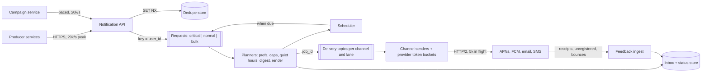

Sending one push notification is an HTTP call to Apple or Google. Sending a billion a day is a different problem: a one-time login code must arrive in seconds even while a 50-million-recipient marketing campaign is draining; a user who unsubscribed thirty seconds ago must not receive the next message; a phone that was offline for two hours must not wake up to "your driver is arriving"; and the whole thing depends on third-party providers that rate-limit you, go down, and never tell you for certain whether a human saw the message.

The failures that matter here are rarely "the system was slow". They are *duplicates* (the same receipt three times), *wrong audience* (the test push that went to everyone), *wrong time* (3 a.m.) and *silent loss* (the password reset that never arrived). A strong design is organised around preventing those four, and it chooses a different delivery guarantee for each kind of message.

## Requirements

### Functional

- Internal services send notifications to a user by category (security, transactional, social, marketing); the platform picks channels (iOS and Android push, email, SMS, in-app inbox) from the user's preferences and devices.
- Templates with localisation; per-category and per-channel opt-outs; quiet hours in the user's time zone; frequency caps for marketing and rate limits for social.
- Scheduled sends and campaigns to segments of tens of millions; aggregation of bursts ("Ana and 36 others liked your photo").
- An in-app inbox of the last 90 days and delivery status per message.
- Out of scope: the segmentation engine that builds audiences, and message content.

### Non-functional

| Property | Target |
|---|---|
| Critical latency | Security codes handed to the provider within 5 s at p99, even during campaigns |
| Social latency | p95 under 30 s, except when deliberately digested |
| Campaigns | 50 million recipients within 30 minutes, or per time-zone wave |
| Duplicates | None visible for receipts and marketing within a 24-hour window; tolerated for security codes |
| Availability | 99.99% for accepting requests; delivery may be delayed, never silently dropped |

Ask which categories exist and what each tolerates; the answer drives the delivery-semantics decision.

### Scale

1 billion notifications a day to 300 million users with 450 million devices; 85% push, 14% email, 1% SMS; an organic peak of 2.5× average; about 10% of producer requests are retries.

## Back-of-envelope estimates

| Quantity | Arithmetic | Result |
|---|---|---|
| Average rate | $10^9$ ÷ 86,400 s | 11,600/s; 29,000/s at the organic peak |
| One campaign | $5 \times 10^7$ ÷ 1,800 s | 28,000/s on top |
| Design peak | 29,000 + 28,000 | ~60,000/s, half of it one campaign |
| SMS cost | $10^7$ SMS a day × ~\$0.01 (Twilio's US list price is \$0.0083 plus carrier fees; \$0.056 to the UK, \$0.112 to Germany) | ~\$100,000 a day if all US |
| Inbox storage | $10^9$ × 500 B × 90 days × 3 replicas | 500 GB/day, 45 TB, 135 TB replicated |
| Dedupe keys | $1.1 \times 10^9$ requests in a 24-hour window × ~110 B (key, ID, per-key overhead) | ~120 GB live |
| Lookups | 60,000/s × (preferences + devices) | 120,000 cache reads/s; 300 GB of preferences, 110 GB of tokens |
| Provider concurrency | 50,000 pushes/s × ~0.1 s per call (Little's law) | 5,000 requests in flight |

### Machine counts

| Tier | Sizing | Count |
|---|---|---|
| Kafka | Request and delivery topics: 2 × 60,000 × ~1 KB × 3 replicas = 360 MB/s ÷ ~100 MB/s per broker | 4, run 6 for headroom |
| Planners | 60,000/s ÷ ~2,000/s per instance (cache reads, render, one inbox write; assumed) | 30 instances; 64 partitions per lane so they can grow |
| Dedupe store | 120 GB ÷ ~45 GB usable per 64 GB Redis node; 60,000 `SET NX`/s is 15,000 per node | 4 primaries + 4 replicas |
| Push senders | 5,000 in flight ÷ ~500 concurrent HTTP/2 streams per instance | 10 per provider, 20 across zones |
| Inbox store | 135 TB ÷ ~2 TB per node, so a rebuild streams in hours | ~70 nodes |

The sentence that matters: the throughput is ordinary; the design is dominated by per-user correctness (duplicates, caps, quiet hours, late-bound preferences) and by isolating a login code from a campaign that is half the peak.

## API design

```text
POST /v1/notifications                      Authorization: service token (order-service)
  {"dedupe_key": "order-8812:shipped", "user_id": "u_42",
   "category": "transactional.order_update", "template": "order_shipped",
   "params": {"order_id": "8812", "eta": "2026-09-28"},
   "priority": "normal", "expires_at": "2026-09-27T12:00:00Z"}
  -> 202 {"notification_id": "01J8Z…"}                  first time
  -> 200 {"notification_id": "01J8Z…", "duplicate": true}  same (user, dedupe_key) within 24 h
POST /v1/campaigns  {"segment_id": "lapsed_30d", "template": "we_miss_you", "send_at_local": "10:00",
                     "max_rate_per_s": 20000, "canary_percent": 1}
  -> 201 {"campaign_id": "c_77", "estimated_audience": 48210331, "status": "pending_approval"}
GET  /v1/users/u_42/inbox?cursor=…          PUT /v1/users/u_42/preferences
POST /v1/devices {"platform": "ios", "token": "…"}   POST /webhooks/{provider}  (bounces, receipts)
```

`dedupe_key` is built by the producer from the domain event, and it is scoped to the recipient, so a producer retry, a replayed event, or the same "order shipped" from two services all collapse into one notification ([Idempotency and retries](/learn/system-design/building-blocks/idempotency-and-retries)). `category` is what preferences, caps, priority and delivery semantics key on; producers never choose channels. `expires_at` lets a message die rather than arrive late and wrong. A campaign starts in `pending_approval` with its audience size shown, because the most damaging bug here is the right message to the wrong 48 million people.

## Data model

```sql
notifications (user_id, notification_id, category, template_id, locale, params, priority,
               expires_at, status_by_channel,
               PRIMARY KEY ((user_id), notification_id))        -- ULID, newest first
deliveries    (job_id, attempt, provider, provider_message_id, status, error_code, updated_at)
                                                                -- job_id = notification_id:channel:device_id
dedupe        (user_id, dedupe_key) -> notification_id          TTL 24 h
preferences   (user_id, category, channel, enabled, quiet_start, quiet_end, time_zone, updated_at)
devices       (user_id, device_id, platform, token, app_version, last_seen, invalid_at)
suppression   (address_or_number, reason, added_at)             -- bounces, complaints, STOP
```

| Table | Partition key | Sort key | Indexes | Why |
|---|---|---|---|---|
| `notifications` | `user_id` | `notification_id` descending | none | The inbox reads one partition newest-first; 60,000 writes/s spread by user; 90-day TTL |
| `deliveries` | `job_id` | `attempt` | `(status, updated_at)` for the stuck-job sweeper | A sender asks "already sent?" by exact ID before every provider call |
| `dedupe` | `(user_id, dedupe_key)` | none | none | One `SET NX` per request; the TTL is the dedupe window |
| `preferences` | `user_id` | `(category, channel)` | none | One partition per plan, cached; a write invalidates the cache entry |
| `devices` | `user_id` | `device_id` | `token` | Fan-out reads by user; a provider's "unregistered" answer arrives with a token |
| `suppression` | address or number | none | none | Checked before every email and SMS, for every category |

Caps and digest buffers are not tables: they are per-user state inside the planner that owns the user's partition, checkpointed with its offsets.

## High-level design



The API authenticates the producer, claims the dedupe key and appends to the Kafka topic for its lane, keyed by `user_id`, returning 202 once the broker acknowledges. A planner owns each partition: it loads preferences, applies opt-outs, suppression, quiet hours and caps, digests bursts, renders the template, writes the inbox row, and emits one delivery job per channel and device. Messages that must wait go to the scheduler, which re-injects them when due. Senders are thin: check expiry, take a provider token, call, record.

## Deep dive 1: dedupe, from the producer to the lock screen

Every hop is at-least-once: producers retry, Kafka redelivers after a consumer crash, senders retry provider timeouts. Duplicates enter at three places and each needs its own fix.

1. **Producer retries and replays.** `SET dedupe:u_42:order-8812:shipped <id> NX EX 86400` claims the key atomically; a later request with the same key gets the original ID back.
2. **Planner redelivery.** The inbox row is an upsert on `notification_id`, and each delivery job has the deterministic ID `notification_id:channel:device_id`, so a sender drops a job it has already completed.
3. **The provider boundary.** A sender calls APNs, APNs accepts, the sender dies before recording it. No protocol fixes this, because the provider is not in your transaction ([Exactly-once semantics](/learn/system-design/distributed-systems/exactly-once-semantics)). APNs merges notifications that share an `apns-collapse-id` (at most 64 bytes) into one on the device, so set it to the `notification_id` and a resend replaces the first copy instead of adding a second. FCM's `collapse_key` is not the equivalent: it only collapses messages still waiting on FCM's servers, allows four keys per device and is ignored for notification messages. On Android the notification `tag` replaces a notification already in the drawer, so set that to the `notification_id` too.

```viz
{"type": "system", "scenario": "idempotency-key", "requests": 2, "store": "cache", "client": "Order service", "service": "Notify API", "db": "Redis", "request": "POST /notifications", "key": "order-8812:shipped", "effect": "enqueue n_77", "target": "Kafka", "response": "202 n_77", "effects": "enqueued", "changed": "a different template", "downstream": false,
 "title": "A replayed event returns the original notification",
 "caption": "The first request claims the dedupe key and stores the notification ID; the replay after the producer's crash finds the key and gets the same ID back, so nothing new is enqueued."}
```

### A duplicate, traced end to end

The order service's trigger consumer reads `OrderShipped(8812)` from Kafka and calls the API. Timings assume ~1 ms Redis calls, a few milliseconds for a replicated Kafka append and a 30 s consumer-group session timeout.

| t (ms) | Component | Action | State |
|---|---|---|---|
| 0 | Trigger consumer | Reads offset 5,120,331; `POST` with key `order-8812:shipped` | |
| 1 | API | `SET NX` succeeds | key → `01J8Z` |
| 2–8 | API → Kafka | Append to the normal lane, `acks=all`; return 202 | Request durable |
| 20 | Planner p17 | Plans: preferences allow push and email; renders; upserts the inbox row; emits `01J8Z:push:dev_a`, `01J8Z:email` | 2 jobs |
| 25 | Trigger consumer | OOM-killed before committing offset 5,120,331 | |
| 45 | Push sender | APNs returns 200 with `apns-collapse-id: 01J8Z`; the sender dies before writing `sent` | Push on the phone; `deliveries` says pending |
| 30,000 | Group rebalance | A new sender takes the job; a new trigger consumer re-reads offset 5,120,331 | |
| 30,002 | API | `SET NX` fails; `GET` returns `01J8Z` | 200 duplicate; nothing appended |
| 30,010 | Push sender | Job not marked `sent`; transactional category, so resend with the same collapse ID | The phone shows one notification |
| 30,015 | Email sender | `01J8Z:email` already `sent` from before the crash | Dropped |

Each layer caught a different duplicate. The edge case is the dedupe store itself: Redis replicates asynchronously, so a primary failover can lose keys written in the last second, and a replay inside that second passes layer 1. Layers 2 and 3 still catch it for push; email has no collapse identifier, which is why email senders record `sending` before the call. For payments-grade categories, claim keys with a conditional write in a replicated database instead.

### The dedupe window store

The window is a cost and a promise. At ~110 bytes a key, 24 hours of requests is 121 GB of live keys and 72 hours is 363 GB, so the window is set per category: 24 hours covers producer retries and consumer restarts, which arrive within minutes. What it does not cover is a deliberate replay: re-reading a topic from three days ago after a bug fix finds every key expired and re-sends old receipts. Two rules close that hole: the API rejects requests whose event time is older than the window, and every message carries `expires_at`, so a replayed "order shipped" from Monday dies at the planner on Thursday.

### Semantics per category

| Category | Worse outcome | Semantics | On an ambiguous send |
|---|---|---|---|
| Security code | Not arriving: the user is locked out | At-least-once | Retry; a duplicate carries the same code |
| Receipt, order update | Both are bad | At-least-once with collapse | Retry with the same collapse identifier |
| Marketing | A duplicate promotion is worse than a miss | At-most-once | Do not retry; record it as sent |

## Deep dive 2: caps, rate limits and quiet hours per user

Caps ("at most 3 marketing pushes a day"), social rate limits, digests and quiet hours are all read-modify-write on per-user state. With 30 planners handling the same user, two can both read "2 sent today", both send, and the cap becomes 4. Atomic Redis counters fix the race at a network call per check; the simpler structure is **partitioning by `user_id`**: every request for a user lands in one partition, one planner owns it, and the state is local, single-threaded and race-free. It also orders a user's messages, so "order shipped" never overtakes "order confirmed" inside the platform; APNs documents that it may still reorder notifications to one device, which is why each push carries its full state.

```viz
{"type": "system", "scenario": "kafka-partitions", "nodes": 3, "keys": ["user:42", "user:7", "user:42", "user:9", "user:7", "user:42"],
 "title": "One owner per user",
 "caption": "Keying by user id sends every request for user:42 to the same partition, so one planner owns that user's caps, digests and ordering. A user who receives a flood of events becomes a hot partition, which digesting must absorb."}
```

### One user's day, traced

User `u_42` is in America/New_York (UTC−4 in September), with quiet hours 22:00–08:00, a marketing cap of 3 in any rolling 24 hours, and a social limit of 10 an hour beyond which likes are digested. Two marketing pushes went out yesterday at 14:00 and 20:00 UTC.

| t (UTC) | Local | Event | Decision | State |
|---|---|---|---|---|
| 02:30 | 22:30 | Campaign `c_77`, marketing | Quiet hours: defer to 08:00 local = 12:00 UTC; `expires_at` 18:00 is later, so schedule | Scheduler holds it |
| 03:10 | 23:10 | New-login security alert | Security ignores quiet hours and caps | Sent in 1 s |
| 12:00 | 08:00 | Scheduler re-injects `c_77` | Re-read preferences (still subscribed), suppression list, cap: 2 in the last 24 h | Sent; 3 of 3 |
| 12:05 | 08:05 | Campaign `c_78` | Cap full until 14:00 UTC, when yesterday's first send ages out | Capped, recorded |
| 14:00:00 | 10:00 | First like on a photo | Under the social limit: send now; open a 10-minute digest window | 1 social this hour |
| 14:00–14:10 | | 36 more likes | Buffered in the planner's state | Digest of 36 |
| 14:10 | 10:10 | Window closes | One push: "Ana and 36 others liked your photo" | 2 social this hour |

Two edge cases sit in the trace. Quiet hours are a delay, not a drop: `c_77` would have been dropped and recorded as expired if `expires_at` fell before 12:00. And "08:00 local" is computed with the time-zone database from the device-reported zone, because profile zones are often years stale and a fixed UTC offset is wrong for half the year wherever daylight saving applies. Preferences are bound late: checked at plan time and again when a scheduled message comes due, so an unsubscribe at 11:55 would have stopped `c_77`.

### Where the per-user state lives

The planner keeps, per user, a ring of recent marketing send times, a ring of social send times and any open digest buffer, about 200 bytes: 60 GB for 300 million users, under 1 GB per partition across 64. It lives in a local embedded store (RocksDB, as in Kafka Streams or Flink) and is checkpointed with the partition's offsets, so a restart replays at most the messages since the last checkpoint. When a planner dies, its partitions move and their state is restored at ~100 MB/s: about 9 s during which those users' messages wait. A warm standby replica of each partition's state removes the wait for the critical lane.

## Deep dive 3: priority lanes and provider pacing

Put the campaign and a login code in one FIFO and do the arithmetic: at 28,000 a second the campaign takes 30 minutes to drain, and a code behind it waits 30 minutes. A priority field does not help; the campaign is already ahead in the log. The fix is a bulkhead: separate topics, planners and senders for critical, normal and bulk lanes, and a **reserved share of each provider's rate limit** for the critical lane ([Resilience patterns](/learn/system-design/building-blocks/resilience-patterns)). Campaigns are paced at the source at their approved `max_rate_per_s`, and "10:00 local" is split into waves by UTC offset (the IANA time-zone database has 37 in use at any moment, including half- and quarter-hour ones), so 48 million recipients become waves of a few million, each draining in minutes at 20,000 a second.

Each sender takes a token per call from a bucket shared by every sender instance using that provider credential (a Redis token bucket, or the budget divided among instances), and treats a 429 as a signal to slow down, not to retry at once.

```viz
{"type": "system", "scenario": "token-bucket", "requests": 10, "title": "Pacing sends against a provider limit",
 "caption": "The refill rate is the sustained rate the provider allows; the capacity is the burst allowed after a quiet period. The critical lane has its own bucket, so a campaign can never spend the tokens a login code needs."}
```

### Under the hood: what APNs and FCM keep for an offline phone

The providers are not queues you can rely on. Apple's documentation says APNs [stores only one notification per app](https://developer.apple.com/documentation/usernotifications/sending-notification-requests-to-apns) for a device it cannot reach, usually the latest, for up to 30 days depending on `apns-expiration`. FCM treats every notification message as collapsible under one default key, the app's package name, and stores at most 100 uncollapsed data messages per device; past that it [discards all of them](https://firebase.google.com/docs/cloud-messaging/customize-messages/collapsible-message-types) and tells the app to resync. Trace `u_42`'s iPhone, offline from 12:00 to 14:00 UTC:

| t (UTC) | Sent | `expires_at` | What APNs holds |
|---|---|---|---|
| 12:05 | Order 8812 out for delivery | 14:30 | That notification |
| 12:40 | Order 8812 delivered | 18:00 | The delivery, replacing it |
| 13:10 | Login code | 13:15 | The code, replacing the delivery |
| 13:15 | The code expires | | Nothing |
| 13:30 | Digest of 37 likes | Tomorrow | The digest |
| 14:00 | Phone reconnects | | Shows the digest only |

Four notifications were sent and the lock screen shows one; "your order was delivered" never appears as a push, and an Android phone receiving notification messages ends the same way. The design already absorbs it: the planner wrote all four to the inbox, so the app syncs its inbox when it opens and takes its unread count from there, never from the pushes that arrived. Two rules follow. Every push states its full meaning ("delivered", not "status changed"), because it may be the only one that survives. And an Android data-message path must collapse by category or stay under 100 pending messages per device, because the 101st wipes the rest.

## Failure modes

| Failure | Symptom | Diagnosis | Fix |
|---|---|---|---|
| Provider degrades | Push errors and latency climb; backlog grows | Per-provider error rate and p99 | Backoff with full jitter bounded by `expires_at`; circuit breaker; SMS fallback for security codes only |
| Duplicate sends after a dedupe-store failover | Users report doubled receipts for a few minutes | Duplicate `dedupe_key`s whose first claim fell in the failover second | Job IDs and collapse IDs catch push; conditional writes in a replicated store for critical categories |
| Wrong audience | Complaints and unsubscribes spike minutes after a campaign starts | Audience size against the approved estimate; canary metrics | Two-person approval above a size, 1% canary, kill switch that stops injection and purges queued jobs |
| Hot user partition | One planner lags; that partition's age grows | Per-partition lag; one user with 100,000+ events | Digest bursts; aggregate per object before the per-user topic |
| Poison message | A planner crash-loops at one offset; its users stop receiving anything | Same offset in every crash; template render exception | Catch per record, park it on a dead-letter topic with the reason, alert |
| Thundering herd when a provider recovers | A burst of retries trips the provider's limit again | Retry rate spikes the moment errors stop | Retries go through the same token bucket; jitter; drain backlog at the bucket's rate |
| Stale device tokens | Quota wasted on dead devices; Apple warns that repeated 4xx errors slow a connection and can get it disconnected | APNs 410 `Unregistered`; FCM `UNREGISTERED` (HTTP 404) | Invalidate the token on that response and never retry it |
| Email reputation collapse | Password resets land in spam | Bounce and complaint rates per sending domain | Suppression list; separate subdomains and IP pools for transactional and marketing mail |
| Region loss | Accepts fail in one region | Health checks | Users homed per region; critical categories fail over with dedupe keys replicated; bulk waits |

```viz
{"type": "system", "scenario": "retry-backoff", "requests": 5, "example": "push send", "title": "Retrying a failing provider",
 "caption": "Delays double with each failure and are jittered so thousands of senders do not retry in lockstep. The retry budget ends at the message's expires_at: a late 'your driver is here' is worse than none."}
```

## Trade-offs: what was rejected

| Decision | Chosen | Rejected | Why rejected here | What would flip it |
|---|---|---|---|---|
| Dedupe scope | `(user, dedupe_key)`, 24 h | Per producer; forever | Misses the same event from two services; unbounded storage | Money movement: keep keys as long as the ledger |
| Per-user state | Partition by user, local state | Redis counters per check | A network call per cap check, plus the read-modify-write race | Users spread across planners for load reasons |
| Lanes | Separate topics and quota | Priority field | A backlog ahead in the log still blocks | One category only |
| Marketing semantics | At-most-once | At-least-once | A duplicate promotion costs trust and unsubscribes | Regulated notices that must arrive |
| Broker | Kafka keyed by user | Per-message queue (SQS) | No per-key ordering or owned state for the planner | Fine for the sender stage, where jobs are independent |

## Evolution at 10× and 100×

| | Today | 10× | 100× |
|---|---|---|---|
| Notifications | 1 B/day, 60,000/s peak | 10 B/day, 600,000/s | 100 B/day, 6 million/s |
| Dedupe keys live | 120 GB | 1.2 TB | 12 TB |
| Inbox, replicated | 135 TB | 1.35 PB | 13.5 PB |
| SMS at 1% | \$100,000/day | \$1 million/day | \$10 million/day |

At 10×, the provider limits break first: per-credential rate limits and connection counts mean more credentials, per-region sender pools and explicit quota splits. The dedupe store moves from Redis to a disk-backed store with TTLs, because 1.2 TB of keys is expensive in RAM. At 100×, the inbox dominates storage: keep 7 days hot and older entries in cheap storage, and aggregate far more aggressively, because no user reads 300 notifications a day.

## What real companies describe

- LinkedIn's engineering blog has [described](https://engineering.linkedin.com/blog/2018/03/air-traffic-controller--member-first-notifications-at-linkedin) **Air Traffic Controller**, the gateway that decides whether, when and on which channel to notify a member and aggregates notifications into digests. It partitions every request and signal by member ID so one Samza task owns each member, keeps that member's state in an embedded RocksDB (a couple of milliseconds per read against 10–100 ms for a remote call), and sends member-to-member messages on high-priority Kafka topics: the partitioning, local state and lanes of this design.
- Netflix's technology blog has described **RENO**, its [Rapid Event Notification System](https://web.archive.org/web/2022id_/https://netflixtechblog.com/rapid-event-notification-system-at-netflix-6deb1d2b57d1), which routes events to priority-specific queues and processing clusters and uses a hybrid of push and pull: it pushes to devices at once, and devices also call home during the app lifecycle, so a TV that was switched off still catches up.
- Apple and Google document `apns-collapse-id`, `collapse_key`, the Android `tag`, expiry, and the "unregistered" responses used above.
- Google and Yahoo [announced](https://blog.google/products/gmail/gmail-security-authentication-spam-protection/) bulk-sender requirements in October 2023, enforced from early 2024, including authentication, one-click unsubscribe and a ceiling on spam-complaint rates, which is why marketing mail needs its own reputation.
- The rates, sizes and timings above are illustrative.

## Interviewer follow-ups

**"A login code must arrive within 10 seconds. How do you make that true?"** Model answer: its own lane end to end (topic, planners, senders, reserved provider quota), no digest, quiet hours or scheduler; at-least-once with a quick retry and an SMS fallback if push is not accepted within a couple of seconds; an SLO measured from request to provider acceptance and alerted separately from bulk lanes. Common wrong answer: "give it high priority in the queue", which does not jump a backlog.

**"A user unsubscribes while a 50-million-recipient campaign is running. Do they get it?"** Model answer: no, because preferences are read at plan time and re-read for anything that waited, and the preference write invalidates the cache. A message already handed to a sender can still go out within seconds, and I would say so. Common wrong answer: resolving the audience at campaign creation and sending to it for 30 minutes.

**"Your dedupe store fails over. What happens to duplicates?"** Model answer: keys claimed in the last second before failover may be lost, so replays in that second pass the first layer; deterministic job IDs and collapse identifiers still stop most visible duplicates, and email is the exposed channel. For categories where one duplicate matters, claim keys with a conditional write in a synchronously replicated store. Common wrong answer: "Redis persistence prevents it".

**"The user's phone was offline for two hours. What arrives when it reconnects?"** Model answer: only what is still true. Provider expiry is set from `expires_at` (APNs takes an expiration timestamp, FCM a time-to-live), so stale pushes are discarded, and APNs keeps only one pending notification per app anyway, so ten order updates become at most the latest one; the inbox is the durable record. Common wrong answer: "everything is queued and delivered in order".

## What mid-level engineers get wrong

- One queue with a priority field, so login codes wait behind a campaign.
- Retrying every ambiguous send, including marketing, and sending duplicate promotions.
- A dedupe key chosen by the platform (a random request ID) instead of derived from the domain event, so replays get new keys.
- Enforcing caps with read-then-write from many planners, which overshoots the cap.
- Treating quiet hours as a drop, or computing them with a fixed UTC offset.
- Binding preferences when a campaign is created.
- Sending marketing and password-reset email from the same domain and IP pool.

## Exercise

```exercise
id: notification-dedupe-caps
title: Dedupe and cap a notification stream
prompt: |
  Implement `plan_notifications(events, window_s, cap_per_hour)`. `events` is a
  list of `[user, dedupe_key, t]` in arrival order, with `t` in seconds and never
  decreasing. Return one status per event:

  - `"duplicate"`: an earlier non-duplicate event had the same user and
    `dedupe_key` at time `t0` with `t - t0 < window_s`. The dedupe window runs from
    that first event; duplicates do not extend it.
  - `"capped"`: not a duplicate, but the user already has `cap_per_hour` sends
    at times `s` with `t - s < 3600`.
  - `"sent"`: otherwise.

  A capped event still claims its dedupe key (a retry of it is a duplicate).
  Only `"sent"` events count toward the cap.
languages: [python, javascript]
entry: plan_notifications
starter:
  python: |
    def plan_notifications(events, window_s, cap_per_hour):
        out = []
        # your code here
        return out
  javascript: |
    function plan_notifications(events, window_s, cap_per_hour) {
      const out = [];
      // your code here
      return out;
    }
tests:
  - args: [[["u1", "order-1:shipped", 0], ["u1", "order-1:shipped", 30], ["u1", "order-2:shipped", 60]], 600, 5]
    expected: ["sent", "duplicate", "sent"]
  - args: [[["u1", "k", 0], ["u1", "k", 599], ["u1", "k", 600]], 600, 5]
    expected: ["sent", "duplicate", "sent"]
    label: the window has ended at exactly window_s
  - args: [[["u1", "a", 0], ["u1", "b", 10], ["u1", "c", 20], ["u1", "d", 3600]], 600, 2]
    expected: ["sent", "sent", "capped", "sent"]
    label: a send exactly 3600 s old no longer counts
  - args: [[["u1", "k", 0], ["u2", "k", 1], ["u1", "k", 2], ["u2", "j", 3]], 600, 1]
    expected: ["sent", "sent", "duplicate", "capped"]
    label: keys and caps are per user
  - args: [[], 600, 3]
    expected: []
    label: no events
  - args: [[["u1", "a", 0], ["u1", "b", 10], ["u1", "c", 20], ["u1", "c", 30]], 600, 2]
    expected: ["sent", "sent", "capped", "duplicate"]
    label: the retry of a capped event is a duplicate
    hidden: true
  - args: [[["u1", "a", 0], ["u1", "a", 5], ["u1", "a", 6], ["u1", "b", 7]], 600, 2]
    expected: ["sent", "duplicate", "duplicate", "sent"]
    hidden: true
  - args: [[["u1", "a", 0], ["u1", "a", 1], ["u2", "b", 2]], 600, 0]
    expected: ["capped", "duplicate", "capped"]
    label: a cap of zero sends nothing
    hidden: true
hints:
  - "Keep a map from (user, dedupe_key) to the time of its first non-duplicate event, and a list of send times per user."
  - "Check the dedupe window before the cap; record the key before deciding whether the cap lets the event through."
```

## Senior signals

- You name the four real failures (**duplicate, wrong audience, wrong time, silent loss**) and design against each.
- You **derive the dedupe key from the domain event**, scope it to the recipient, and can trace a replay through all three layers, including what a dedupe-store failover lets through.
- You choose **delivery semantics per category**, because the provider hop can never be exactly-once.
- You **partition by user** so caps, digests and ordering are single-owner, and you trace **quiet hours as a delay** computed in the device's time zone.
- You isolate critical traffic with **separate lanes and reserved provider quota**, with the 30-minute arithmetic that makes a shared FIFO unacceptable.
- You build **campaign guardrails** (audience preview, approval, canary, kill switch), because the worst incident here is a human one.

## Check yourself

```quiz
- q: >-
    An order service's consumer crashes after the notification API accepted its request but before committing its Kafka offset. On restart it sends the same request. What stops a second notification?
  options: ["The provider, which refuses a second push with the same payload", "Kafka's idempotent producer, which removes the duplicate request", "The planner, which drops a request it has seen within the last hour", "The recipient-scoped dedupe key, claimed with SET NX"]
  answer: 3
  explanation: >-
    The replay is a new HTTP request, so broker-level idempotence does not apply. The dedupe key is derived from the domain event and claimed atomically, so the second request finds it and gets the original notification ID back without enqueuing anything. Providers do not compare payloads.
- q: >-
    A sender calls the push provider, the provider accepts, and the sender crashes before recording success. What is the right behaviour on redelivery for a marketing message?
  options: ["Ask the provider whether the push was displayed, then decide", "Fail over to SMS, because the push outcome cannot be known", "Do not retry, since a duplicate promotion is worse than none", "Retry, since at-least-once delivery is always the safe default"]
  answer: 2
  explanation: >-
    The provider hop cannot be exactly-once, so you choose the failure you prefer per category. For marketing a duplicate is worse than a miss, so record the ambiguous send as sent. Providers cannot say whether a message was displayed, and SMS fallback for marketing costs real money.
- q: >-
    Security codes and a 50-million-recipient campaign share one queue, and codes take 30 minutes to arrive. What fixes this?
  options: ["Add a priority field so codes are picked ahead of campaign messages", "Give critical messages their own topic, senders and provider quota", "Add partitions to the shared topic so that the backlog drains faster", "Send codes synchronously from the producer, bypassing the platform"]
  answer: 1
  explanation: >-
    Isolation needs separate lanes and a guaranteed share of the provider's rate limit. A priority field does not let a message jump a backlog already ahead of it in a log, and more partitions spread the same backlog. Bypassing the platform loses preferences, auditing and fallback.
- q: >-
    Thirty planners share user traffic without keying, and a marketing cap of 3 a day is sometimes exceeded. What is the most direct structural fix?
  options: ["Check the cap again in the sender right before calling the provider", "Partition requests by user_id so one planner owns each user's count", "Cache each user's count in the planner for a minute to cut reads", "Lower the cap to 2 so overshoots still stay within the product limit"]
  answer: 1
  explanation: >-
    Two planners can read 2 sent, both send and make it 4: a read-modify-write race. Keying by user makes one planner the single owner of that state, so the check and the increment happen in one thread. A cache widens the race, and a second check in the sender has the same race.
- q: >-
    A campaign arrives at 22:30 in the user's time zone, inside quiet hours that end at 08:00, and its expires_at is 18:00 local the next day. What should happen?
  options: ["Schedule it for 08:00 local and re-check preferences then", "Send it at 08:00 UTC, since the scheduler works in UTC time", "Drop it, since it arrived inside the user's quiet hours", "Send it now, since campaigns are paced and already approved"]
  answer: 0
  explanation: >-
    Quiet hours are a delay, not a drop, as long as expires_at is later than the next allowed time. The planner hands the message to the scheduler for 08:00 in the device's time zone and re-reads preferences when it comes due, so an unsubscribe overnight still wins. UTC is the wrong clock for a local rule.
- q: >-
    A marketing campaign draws many bounces and spam complaints, and password-reset emails start landing in spam. What design choice would have prevented this?
  options: ["Rate-limiting the campaign so bounces arrive more slowly across the day", "Retrying bounced emails with backoff so they are eventually delivered", "Separate subdomains and IP pools for marketing and transactional mail", "Using a larger email provider whose IP reputation absorbs the damage"]
  answer: 2
  explanation: >-
    Mailbox providers judge reputation per sending domain and IP, so sharing them lets a bad campaign bury critical mail; bounces and complaints should also feed the suppression list. Retrying bounces worsens reputation, pacing does not change the bounce rate, and a different provider does not change how mailboxes judge your domain.
```
