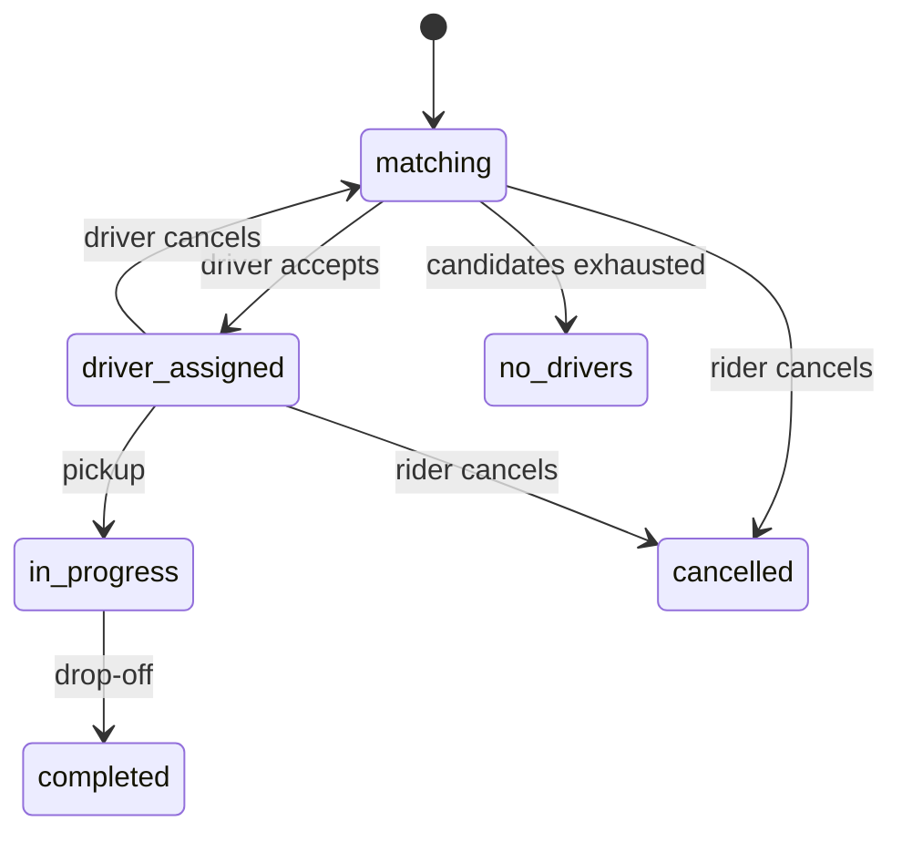
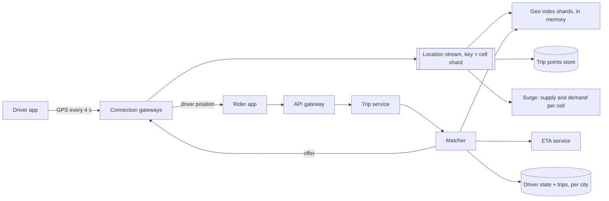
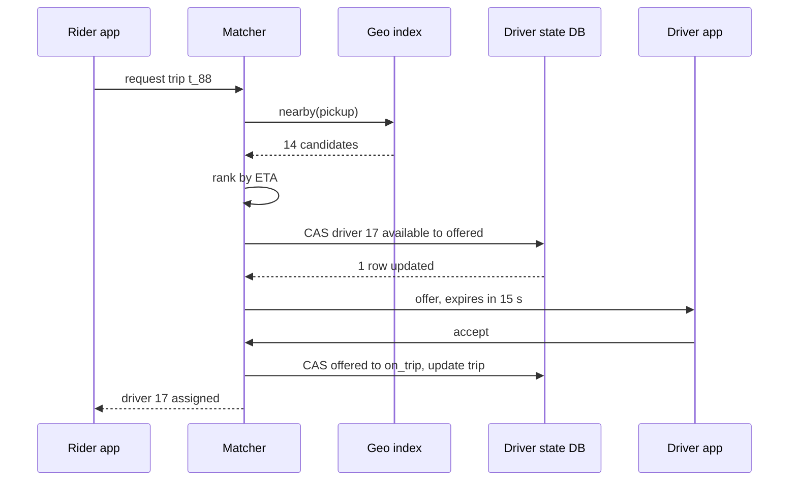

A rider opens the app outside a stadium at 22:40 on a Friday. Within a second the map shows the cars around them; within a few seconds of tapping "request", one specific driver has been offered the trip, has accepted it, and is visible crawling toward the pickup. Fifty thousand other people near the stadium are doing the same thing, and every one of a million and a half online drivers is reporting its position every four seconds whether or not anyone is looking.

Two properties make this design interesting. The data that drives matching is **huge in rate and tiny in size**: a firehose of positions that are worthless after a few seconds. And the one decision that must be exactly right, *this driver is assigned to this trip and no other*, has to be made on top of that deliberately approximate, eventually consistent data. The senior answer keeps those two worlds apart: a fast, lossy geospatial index that proposes candidates, and a small, strongly consistent state store that decides.

## Requirements

### Functional

- Riders see nearby available cars, get a fare estimate (including surge), and request a trip from pickup to drop-off.
- The system offers the trip to a suitable driver; the driver has 15 seconds to accept, otherwise the next candidate is tried.
- Rider and driver see each other's live position until pickup; the trip is tracked to drop-off and priced.
- Out of scope: pooled rides, scheduled rides, payments (see [the payment system](/learn/system-design/case-studies/payment-system)), ratings.

### Non-functional

| Property | Target |
|---|---|
| Scale | 1.5 million drivers online at global peak; 20 million trips per day |
| Location freshness | Positions used for matching are at most a few seconds old |
| Matching latency | First offer sent within 2 s of the request at p95 |
| Correctness | A driver is never assigned two trips; a request never creates two trips |
| Availability | Matching survives the loss of a zone; degraded maps are fine, lost trips are not |

Say out loud which data is allowed to be stale (positions, nearby-car maps, surge) and which is not (driver assignment, trip state). That sentence is the design.

## Back-of-envelope estimates

**Location writes.** 1.5 million drivers × one update every 4 s = **375,000 updates per second**. At ~100 bytes each that is only 37.5 MB/s: the problem is message rate, not bandwidth. No disk-backed database wants 375,000 small updates per second of rows that are overwritten four seconds later.

**Index size.** The latest position of every driver is ~100 bytes × 1.5 million = **150 MB**. The whole working set fits in the memory of one small server. **Consequence: the geo index is in memory, and it is sharded for write throughput and blast radius, not for size.**

**Trip requests.** $2 \times 10^7 / 10^5 = 200$ trips per second on average, with local peaks (bar closing, concerts, rain) of 5× or more: design for ~1,000 requests per second globally, heavily concentrated in a few cities at a time.

**Nearby-car reads.** Riders open the app far more often than they request. If each trip is preceded by ~10 app opens that refresh nearby cars every 5 seconds for a minute, that is $200 \times 10 \times 12 = 24{,}000$ reads per second on average and ~100,000 at peak. All riders standing in the same small cell see the same cars, so this collapses to one computation per cell per second.

**Live connections.** 1.5 million drivers plus perhaps a million riders with active trips hold persistent connections: 2.5 million. At 50,000–100,000 connections per gateway node that is 25–50 nodes. Forwarding the assigned driver's position to each waiting or riding rider is ~150,000 pushes per second.

**Routing.** Each request ranks 10–20 candidates by driving time, up to 20,000 driver-to-pickup ETAs per second at peak, and every fare estimate needs a pickup-to-drop-off route across the city. A full Dijkstra search over a city road graph with a million intersections takes on the order of 100 ms; thousands of such searches per second is hundreds of cores spent on textbook graph search. **Consequence: routing uses a precomputed speed-up technique, not plain Dijkstra per query.**

**Trip history.** Points for on-trip drivers only (~600,000 drivers, one point per 4 s, ~50 bytes) are 7.5 MB/s, about 650 GB a day, kept for fare disputes and safety: a time-partitioned wide-column store with tiering.

## API design

```text
Driver app, persistent connection (WebSocket or gRPC stream):
  → LocationUpdate { driver_id, lat, lng, heading, speed, accuracy_m, ts, seq }
  ← TripOffer      { offer_id, trip_id, pickup, rider_rating, expires_at }
  → OfferResponse  { offer_id, decision: "accept" | "decline" }

Rider app, HTTPS plus a stream for updates:
  GET  /v1/nearby?lat=37.7749&lng=-122.4194
  → { "cars": [{ "lat": 37.7751, "lng": -122.4188, "heading": 90 }, …], "eta_min": 3 }

  POST /v1/fare-estimates { "pickup": {…}, "dropoff": {…}, "product": "standard" }
  → { "estimate_id": "fe_31", "price_minor": 1840, "currency": "USD",
      "surge": 1.3, "expires_at": "2026-09-26T22:45:00Z" }

  POST /v1/trips   Idempotency-Key: 2c9e…   { "estimate_id": "fe_31" }
  → 201 { "trip_id": "t_88", "status": "matching" }

  POST /v1/trips/t_88/cancel
```

Notes that matter: the location stream carries a per-driver sequence number so out-of-order updates can be discarded. The nearby endpoint returns approximate positions (snapped and slightly delayed) because exact live positions of drivers are a safety and privacy concern. The fare estimate is a signed, expiring quote, so the price the rider accepted is the price charged even if surge changes a second later. And trip creation takes an idempotency key, because a rider tapping "request" on a flaky connection must not summon two cars.

## Data model

```sql
driver_state (driver_id PK, city_id, state,        -- offline | available | offered | on_trip
              trip_id, offer_expires_at, version)
trips        (trip_id PK, city_id, rider_id, driver_id, status, pickup, dropoff,
              estimate_id, price_minor, currency, requested_at, assigned_at,
              completed_at, version)
fare_quotes  (estimate_id PK, rider_id, pickup_cell, dropoff_cell, price_minor,
              surge, expires_at)
trip_points  (trip_id, ts, lat, lng, speed)        -- wide-column, time-partitioned
```

`driver_state` and `trips` for one city live in the same strongly consistent database shard, so assigning a driver and updating the trip is one local transaction. The geo index is not in this list: it is soft state in memory, rebuilt from the location stream.



## High-level design



**Location path.** Drivers hold a connection to a gateway. The gateway validates each update (sequence number, plausible speed), and publishes it to a stream partitioned by geographic shard. Geo index shards consume their partitions and keep the latest position of every driver in their area. The same stream feeds trip-point storage and the surge calculator.

**Request path.** The trip service creates the trip (idempotently) and asks the matcher for a driver. The matcher gets candidates from the geo index, ranks them by ETA, and claims one with a compare-and-set on `driver_state`. It sends the offer through the driver's gateway and waits for an answer or the 15-second expiry.

**Tracking path.** Once assigned, the driver's updates are also forwarded to the rider's connection. That is a 1:1 fan-out, cheap per message, and the reason gateways are a separate tier from the stateless API.

## Deep dives

### Geospatial indexing: geohash, S2 and H3

The naive query, `WHERE lat BETWEEN ? AND ? AND lng BETWEEN ? AND ?` on B-tree indexes, fails twice. A B-tree can use one range efficiently, so the database scans a latitude band across the whole city and filters on longitude. And every position update rewrites index entries, which at 375,000 per second is a write-amplification disaster. What you want is a key that turns "near" into "equal or adjacent", so the index becomes a hash map from **cell** to **drivers in that cell**.

**Geohash** interleaves the bits of longitude and latitude and encodes them in base 32. Each extra character narrows the cell, so nearby points usually share a prefix:

```python
BASE32 = "0123456789bcdefghjkmnpqrstuvwxyz"

def geohash(lat, lng, precision=7):
    lat_lo, lat_hi, lng_lo, lng_hi = -90.0, 90.0, -180.0, 180.0
    out, ch, bits, even = [], 0, 0, True
    while len(out) < precision:
        if even:                               # even bits refine longitude
            mid = (lng_lo + lng_hi) / 2
            ch, lng_lo, lng_hi = ((ch << 1) | 1, mid, lng_hi) if lng >= mid else (ch << 1, lng_lo, mid)
        else:                                  # odd bits refine latitude
            mid = (lat_lo + lat_hi) / 2
            ch, lat_lo, lat_hi = ((ch << 1) | 1, mid, lat_hi) if lat >= mid else (ch << 1, lat_lo, mid)
        even, bits = not even, bits + 1
        if bits == 5:                          # 5 bits per base-32 character
            out.append(BASE32[ch])
            ch, bits = 0, 0
    return "".join(out)

geohash(37.7749, -122.4194)   # '9q8yyk8'  (a ~150 m cell in San Francisco)
```

At the equator, precision 5 is about 4.9 × 4.9 km, precision 6 about 1.2 × 0.6 km, and precision 7 about 153 × 153 m. The trap is the boundary: `(37.7749, -122.4097)` is `9q8yykx` and `(37.7749, -122.4095)`, 18 metres east, is `9q8yys8`. They share only five characters, so "same prefix" is not "nearby". Every geohash proximity query must therefore search the cell **and its eight neighbours**. Geohash cells are also rectangles whose shape distorts with latitude, and the Z-order curve behind them makes some adjacent cells far apart in key order.

**S2** (from Google) projects the sphere onto the six faces of a cube and orders cells along a Hilbert curve, which preserves locality better than geohash's Z-order. Cell IDs are 64-bit integers across 31 levels, each level splitting a cell into four (roughly a square kilometre around level 13). Its strength is **region coverings**: any shape (a circle around the pickup, an airport polygon) becomes a small set of cell ID ranges, which map naturally onto range scans in an ordered store.

**H3** (open-sourced by Uber) tiles the world with hexagons at 16 resolutions; resolution 9 hexagons average about 0.1 km² with ~174 m edges. A hexagon has six neighbours, all at the same distance from its centre, unlike a square's four edge neighbours and four farther corner neighbours. That uniform adjacency makes "rings" around a point (`grid_disk(cell, k)` returns $1 + 3k(k+1)$ cells: 7 for $k=1$, 19 for $k=2$) cheap and nearly circular, and makes smoothing a quantity across neighbours (surge, demand forecasts) natural. The costs: hexagons do not nest exactly (a parent's seven children only approximately cover it), and each resolution contains 12 pentagons that code must tolerate.

| | Geohash | S2 | H3 |
|---|---|---|---|
| Cell shape | Rectangle, distorts with latitude | Quadrilateral on a cube face | Hexagon (plus 12 pentagons) |
| Neighbour query | Cell + 8 neighbours | Coverings / neighbour functions | `grid_disk(k)`, uniform distances |
| Hierarchy | Exact (prefix) | Exact (4 children) | Approximate (7 children) |
| Best at | Simplicity, prefix keys in any store | Arbitrary regions, range scans | Rings, smoothing, analytics per area |

For dispatch, choose H3 at resolution 9 for the index and a coarser resolution (7 or 8) for surge. The index itself is small enough to show:

```python
import h3                                    # h3-py, v4 API

RES = 9                                      # ~0.1 km² hexagons

class DriverIndex:
    def __init__(self):
        self.cell_drivers = {}               # cell -> set of driver ids
        self.driver = {}                     # driver id -> (cell, lat, lng, ts)

    def update(self, driver_id, lat, lng, ts):
        old = self.driver.get(driver_id)
        if old and old[3] >= ts:
            return                           # out-of-order update: drop it
        cell = h3.latlng_to_cell(lat, lng, RES)
        if old and old[0] != cell:
            self.cell_drivers[old[0]].discard(driver_id)
        self.cell_drivers.setdefault(cell, set()).add(driver_id)
        self.driver[driver_id] = (cell, lat, lng, ts)

    def nearby(self, lat, lng, want=10, max_k=6):
        origin = h3.latlng_to_cell(lat, lng, RES)
        found = []
        for k in range(1, max_k + 1):        # widen until enough candidates
            found = [d for c in h3.grid_disk(origin, k)
                       for d in self.cell_drivers.get(c, ())]
            if len(found) >= want:
                break
        return found
```

A driver moving at 10 m/s travels 40 m between updates, so most updates stay inside the same 174 m hexagon and cost one dictionary write. A production index also carries each driver's reported status so `nearby` can skip drivers already on a trip, and a background sweep evicts drivers whose last update is older than ~30 seconds, because a phone that died in a tunnel sends no "offline" message.

### Matching: candidates are a hint, the compare-and-set is the truth

The geo index is eventually consistent by construction: it can list a driver who went offline two seconds ago, or who was offered another trip by a matcher in the next process. So it only **proposes**. The decision is a conditional write against `driver_state`:

```sql
-- claim: only succeeds if nobody else has
UPDATE driver_state
   SET state = 'offered', trip_id = 't_88',
       offer_expires_at = now() + interval '15 seconds', version = version + 1
 WHERE driver_id = 17 AND state = 'available';
-- 1 row: we own the offer.  0 rows: someone else does; try the next candidate.

-- accept: only the trip that holds the offer can be confirmed
UPDATE driver_state SET state = 'on_trip', version = version + 1
 WHERE driver_id = 17 AND state = 'offered' AND trip_id = 't_88'
   AND offer_expires_at > now();
```

The server's clock decides expiry, a sweeper returns expired offers to `available`, and the accept statement runs in the same transaction as the `trips` update, which is why both tables live in the same city shard. Two matchers can race for driver 17 all day; exactly one `UPDATE` matches.



**Greedy versus batched.** Matching each request to its nearest available driver the moment it arrives is simple and fast, and it is globally wasteful. Two riders and two drivers: R1 to D1 is 2 minutes, R1 to D2 is 3, R2 to D1 is 3, R2 to D2 is 8. Greedy serves R1 first with D1, leaving R2 an 8-minute wait: 10 minutes of total waiting. Assigning R1 to D2 and R2 to D1 costs 6. Batched matching collects requests in a zone for a second or two, builds a rider × driver ETA matrix, and solves the assignment problem (Hungarian algorithm, or a greedy approximation on large batches). It costs a second or two of latency and pays back in shorter pickups across the whole city. Dense, busy areas benefit most; in a quiet suburb with one request a minute, batching only adds delay.

**Sequential versus broadcast offers.** Offering to one driver at a time can take 15 seconds per decline. Offering to three at once and confirming the first to accept is faster but annoys the two who accepted and lost. Most systems offer sequentially with a short timeout and use acceptance-rate history to rank candidates.

### ETAs on a road graph

Straight-line distance lies. A driver 300 metres away across a river may be twelve minutes away by road, and one on a one-way street pointing the wrong direction may be five. Ranking by drive time is the difference between a good and a bad pickup.

```viz
{"type": "graph", "algorithm": "dijkstra", "directed": false, "start": "P",
 "nodes": [{"id":"P","x":30,"y":60},{"id":"A","x":55,"y":65},{"id":"F","x":50,"y":90},{"id":"D2","x":75,"y":82},{"id":"B","x":85,"y":55},{"id":"C","x":85,"y":35},{"id":"E","x":55,"y":30},{"id":"D1","x":30,"y":28}],
 "edges": [{"from":"P","to":"A","w":2},{"from":"P","to":"F","w":4},{"from":"F","to":"D2","w":2},{"from":"A","to":"D2","w":3},{"from":"A","to":"B","w":3},{"from":"B","to":"C","w":2},{"from":"C","to":"E","w":3},{"from":"E","to":"D1","w":3}],
 "title": "Closest on the map, farther by road",
 "caption": "P is the pickup; weights are minutes. D1 is closer in a straight line but sits across the river, reachable only via the bridge B–C: 13 minutes. D2 is farther on the map and 5 minutes away by road."}
```

Dijkstra settles nodes in order of distance, so it answers "how far to everything" from one source; the matcher needs "how far from each of 15 drivers to one pickup", which is one Dijkstra on the reversed graph from the pickup. On a real city graph of about a million intersections, each such search still settles tens of thousands of nodes, and fare estimates need long cross-city routes thousands of times a second. Production routing engines precompute: **contraction hierarchies** add shortcut edges so a query explores a few hundred nodes instead of hundreds of thousands, answering in well under a millisecond; live traffic is applied by re-weighting edges and re-running a cheaper customisation phase every few minutes. [A* and heuristic search](/learn/algorithms/graph-algorithms/a-star-and-heuristic-search) is the other lever. The ETA service is also where machine learning earns its keep, correcting the routing engine's estimate with historical error by time of day and area.

## Failure modes

**A geo index shard crashes.** Detection: health checks and missing heartbeats. Mitigation: nothing to restore. Every driver reports within four seconds, so a replacement consuming the stream from "now" has a complete index in about four seconds. This is the payoff of treating the index as soft state; do not add persistence to it.

**Stale positions.** A phone loses signal. Detection: last-update age. Mitigation: evict entries older than ~30 s, and have the matcher skip candidates whose position is older than a few seconds.

**Double assignment.** Two matchers, a retried offer, a partitioned matcher that thinks it still owns a city. Mitigation: the compare-and-set; nothing else is trusted. If matchers own cities through leases, the lease epoch is included in the write so a deposed matcher's writes are rejected (a fencing token).

**Duplicate trip requests.** Mitigation: the idempotency key on `POST /v1/trips`, stored with the trip.

**Reconnect storm.** A gateway deploy or network blip disconnects hundreds of thousands of drivers at once, and they all reconnect in the same second. Mitigation: drain connections gradually during deploys, and have clients reconnect with jittered exponential backoff.

**Location stream lag.** Consumers fall behind; matching uses positions that are 20 seconds old. Detection: consumer lag in seconds per partition. Mitigation: alert, scale consumers, and have matchers widen their freshness tolerance explicitly (and tell the rider the ETA is less certain) rather than silently.

**Spoofed or noisy GPS.** Drivers fake positions to sit near surge zones or airports. Mitigation: map-matching (snap to roads), speed and acceleration sanity checks, and cross-checks against network location; fraud scoring downstream.

## Senior follow-ups

**Q: "Why not keep driver locations in Postgres with PostGIS?"**

PostGIS is excellent for static geometry: points of interest, service areas, airport polygons. For live positions the write pattern is wrong. 375,000 updates a second, each rewriting a row and its spatial index entry, means a WAL record per update, dead tuples for vacuum to clean, and index churn, all to store a value that is useless four seconds later and that the next update will reconstruct anyway. The in-memory index gives up durability we do not need and gains two orders of magnitude of write throughput.

**Q: "How do you shard, and what about a pickup on a shard boundary?"**

Shard by cell, not by city name: map coarse cells (H3 resolution 5 or 6, tens to a few hundred km²) to index nodes with consistent hashing, so a dense city spreads over several nodes and small towns share one. A nearby query computes its ring of fine cells, groups them by owning shard, and scatters to the one or two shards involved. Matching itself is owned per city or metro area, because assignment needs one consistent owner, and airports on the edge of two cities get an explicit owner.

**Q: "How is surge computed, and how do you honour the price the rider saw?"**

A stream job counts supply (available drivers) and demand (requests and app opens) per coarse hexagon in one- or two-minute windows, computes a multiplier from the ratio, and smooths it across neighbouring hexagons and over time, so prices do not flicker or show a cliff at a cell border. The fare estimate snapshots the multiplier into a signed quote with a short expiry; the trip references the quote, so a surge change between estimate and request never changes the price.

**Q: "A whole city's matching shard dies on a Friday night. What happens?"**

The database for that city fails over to its synchronous replica in another zone; that takes seconds to tens of seconds, and in-flight offers either complete or expire and are retried, because every step is idempotent and state lives in `driver_state`, not in matcher memory. Matchers are stateless apart from their lease on the city, so a standby takes the lease with a higher fencing epoch. Riders see "finding your driver" for longer, which is the right degradation. The geo index rebuilds itself from the stream in seconds.

**Q: "Location updates drain driver batteries and cost data. How would you reduce them?"**

Make the interval adaptive: every 4 seconds when available in a busy area or on a trip; every 10–15 seconds when idle in a quiet area or when stationary; batch several points into one message when on a trip and send them together, since the rider's map can interpolate. Send deltas rather than full coordinates. Each of these cuts the 375,000-per-second figure directly, and the estimate shows the index and gateways would welcome it.

**Q: "What changes if you add pooled rides?"**

Matching stops being an assignment of riders to idle drivers and becomes inserting a new pickup and drop-off into a moving vehicle's existing route without breaking detour limits promised to riders already on board. Candidates include busy drivers, the cost function becomes total detour, and the problem is a constrained vehicle-routing problem solved heuristically in batches. The geo index and the compare-and-set survive unchanged; the matcher is almost entirely new.

## Senior signals

- You separate **soft, lossy location state** (in memory, rebuilt from the stream) from **hard assignment state** (a conditional write in a consistent store) and say which is allowed to be stale.
- You derive that 375,000 updates per second is **150 MB of state**, and therefore shard for write rate and blast radius, not size.
- You know the **geohash boundary problem** (search the cell plus eight neighbours) and can compare **geohash, S2 and H3** on shape, hierarchy and neighbour queries.
- You guarantee one trip per driver with a **compare-and-set, server-side expiry and fencing**, not with a lock held across a network call.
- You rank candidates by **road-network ETA**, and know that per-query Dijkstra is too slow and **contraction hierarchies** are what production routing uses.
- You can argue **greedy versus batched matching** with numbers.

## Check yourself

```quiz
- q: >-
    Two riders are 18 metres apart. One is in geohash cell 9q8yykx and the other in 9q8yys8. What does this show about geohash proximity search?
  options: ["Geohash is broken for San Francisco", "Nearby points can have different prefixes at a cell boundary, so a query must search the cell and its eight neighbours", "The precision is too high; use 3 characters", "Geohash only works for exact matches"]
  answer: 1
  explanation: >-
    A shared prefix implies proximity, but proximity does not imply a shared prefix. Points on either side of a cell boundary diverge early in the string. Dropping to 3 characters makes cells about 150 km wide and still has boundaries.
- q: >-
    1.5 million drivers send a position every 4 seconds. What is the most important conclusion from the estimate?
  options: ["The positions need a sharded disk-based database for storage", "Bandwidth is the bottleneck at 37.5 GB/s", "375,000 writes per second of about 150 MB of total state: keep it in memory as soft state and shard for write rate", "The data must be replicated synchronously across regions"]
  answer: 2
  explanation: >-
    The state is tiny and the rate is huge. An in-memory index handles it easily and rebuilds from the stream in seconds after a crash. The bandwidth is 37.5 MB/s, not GB/s, and the data is worthless after a few seconds, so synchronous replication would be waste.
- q: >-
    Two matcher instances both see driver 17 as available in the geo index and both want to offer them a trip. What prevents a double assignment?
  options: ["A conditional UPDATE on driver_state that only succeeds WHERE state = 'available'; exactly one matcher gets a row back", "The geo index removes drivers as soon as they are offered", "A distributed lock held while waiting for the driver to accept", "Matchers use the driver's latest location timestamp as a version"]
  answer: 0
  explanation: >-
    The geo index is eventually consistent and only proposes candidates. The decision is a compare-and-set in a consistent store. Holding a lock across a 15-second human decision is fragile and unnecessary; the offered state with a server-side expiry is the lock.
- q: >-
    Rider R1 is 2 minutes from D1 and 3 from D2; R2 is 3 minutes from D1 and 8 from D2. What does batched matching buy over greedy?
  options: ["Nothing; greedy is optimal when each rider takes the nearest driver", "Total waiting drops from 10 minutes to 6 by giving R1 D2 and R2 D1, at the cost of a short batching delay", "It guarantees each rider their nearest driver", "It removes the need for ETAs"]
  answer: 1
  explanation: >-
    Greedy gives R1 D1 (2) and leaves R2 with D2 (8): 10 minutes. The optimal assignment is 3 + 3 = 6. Batching trades a second or two of latency for globally shorter pickups, and gives neither rider a guarantee of their individual nearest driver.
- q: >-
    Why does H3's hexagonal grid suit surge pricing particularly well?
  options: ["Hexagons nest exactly, so parent cells are exact sums of children", "H3 cell IDs sort in Hilbert order", "Hexagons avoid all pentagons", "Every neighbour is at the same distance from the centre, so smoothing a value across rings of neighbours is uniform"]
  answer: 3
  explanation: >-
    Uniform adjacency makes k-rings nearly circular and neighbour smoothing even, which avoids price cliffs at cell edges. H3 hierarchy is approximate, not exact; Hilbert ordering is S2's property; and each H3 resolution contains 12 pentagons.
```
