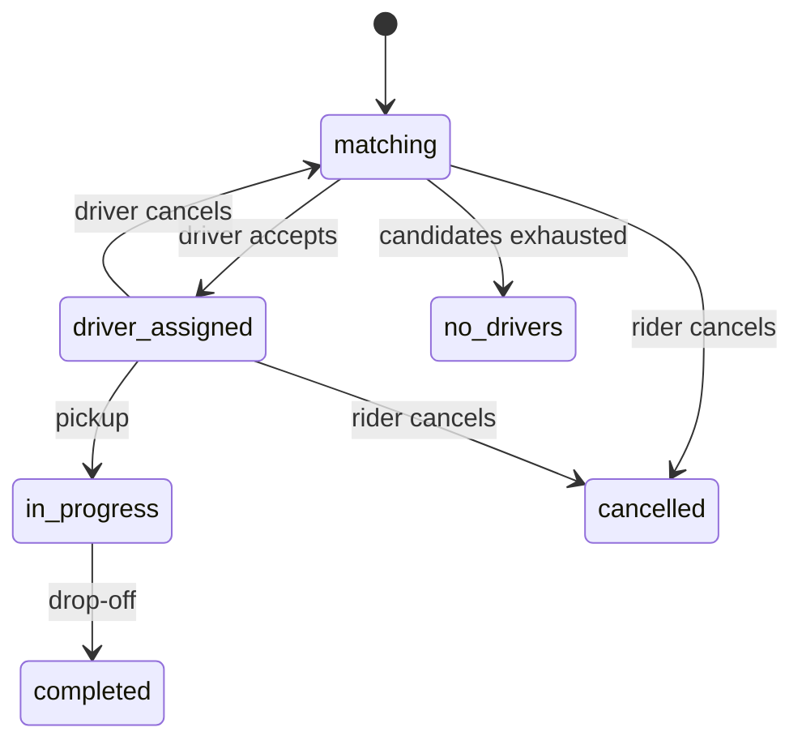
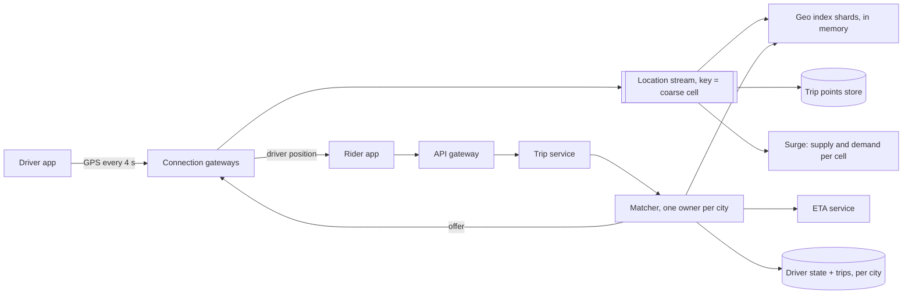
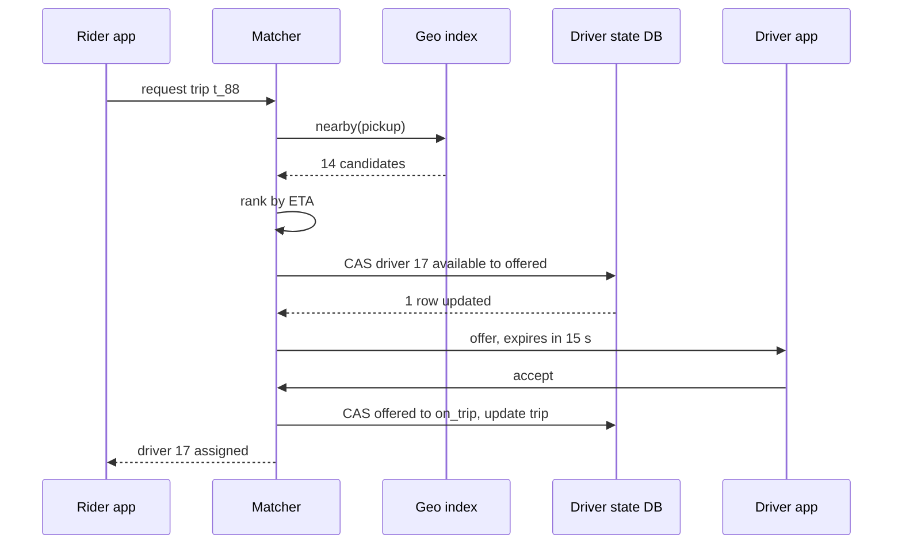

A rider opens the app outside a stadium at 22:40 on a Friday. Within a second the map shows the cars around them; within a few seconds of tapping "request", one specific driver has been offered the trip, has accepted it, and is visible crawling toward the pickup. Fifty thousand other people near the stadium are doing the same, and every one of a million and a half online drivers reports its position every four seconds whether or not anyone is looking.

Two properties make the design interesting. The data that drives matching is **huge in rate and tiny in size**: a firehose of positions that are worthless after a few seconds. And the one decision that must be exactly right, *this driver is assigned to this trip and no other*, is made on top of that deliberately approximate data. The senior answer keeps the two worlds apart: a fast, lossy geospatial index that proposes candidates, and a small, strongly consistent state store that decides.

## Requirements

**Functional.** Riders see nearby cars, get a fare estimate (including surge) and request a trip. The system offers the trip to one driver, who has 15 seconds to accept before the next candidate is tried. Rider and driver see each other live until pickup; the trip is tracked to drop-off and priced. Out of scope: pooled and scheduled rides, ratings, and payments ([the payment system](/learn/system-design/case-studies/payment-system)).

| Property | Target |
|---|---|
| Scale | 1.5 million drivers online at the global peak; 20 million trips a day |
| Freshness | A position used for matching is at most 5 s old (a 4 s reporting interval plus under 1 s of pipeline) |
| Matching latency | First offer on the driver's screen within 2 s of the request, p95 |
| Correctness | A driver is never assigned two trips; a request never creates two trips |
| Availability | 99.99% for trip requests; losing a zone costs seconds; losing a region costs minutes |
| Trip durability | An accepted trip is never lost (synchronous replication, zero RPO) |

Say which data may be stale (positions, nearby-car maps, surge) and which may not (assignment, trip state). That sentence is the design.

## Back-of-envelope estimates

| Quantity | Arithmetic | Result |
|---|---|---|
| Location updates | $1.5 \times 10^6$ drivers ÷ 4 s | **375,000 per second**, flat through the evening |
| Update bandwidth | 375,000 × ~100 B | 37.5 MB/s: the problem is message rate, not bytes |
| Live position state | $1.5 \times 10^6$ × ~100 B | **150 MB**: one server's RAM holds the world |
| Index CPU | Measured: 3.1 µs per update in pure Python on one core (2.3 µs of it the geohash encode) | 375,000 × 3.1 µs ≈ 1.2 cores; a compiled index needs a fraction of one |
| Trip requests | $2 \times 10^7$ ÷ 86,400 s | 230/s average; design for 1,000/s, concentrated in a few cities |
| Nearby-car reads | 230 trips/s × 10 app opens per trip × 12 refreshes a minute | ~28,000/s, ~100,000/s at peak; everyone in one cell sees the same cars, so one computation per cell per second |
| Persistent connections | 1.5 M drivers + ~1 M riders with live trips | 2.5 M; at 50,000–100,000 per gateway node, 25–50 nodes; run 60 across three zones |
| Rider map pushes | 600,000 on-trip drivers ÷ 4 s | 150,000 pushes/s, each 1:1 |
| Stream writes | 37.5 MB/s × replication factor 3 | 112 MB/s across the brokers: six brokers at under 20 MB/s each |
| Driver ETAs | 1,000 requests/s × 15 candidates | 15,000/s at peak (the ETA deep dive prices them) |
| Trip points kept | 600,000 × one point per 4 s × 50 B | 7.5 MB/s, ~650 GB/day, for disputes and safety |

**Consequences.** The geo index lives in memory and is sharded for write rate and blast radius, not size. Connections, not CPU, set the gateway count. And routing must use a precomputed speed-up, because textbook Dijkstra per fare estimate costs hundreds of cores.

## API

```text
Driver app, persistent connection (WebSocket or gRPC stream):
  → LocationUpdate { driver_id, lat, lng, heading, speed, accuracy_m, ts, seq }
  ← TripOffer      { offer_id, trip_id, pickup, rider_rating, expires_at }
  → OfferResponse  { offer_id, decision: "accept" | "decline" }

Rider app, HTTPS plus a stream for updates:
  GET  /v1/nearby?lat=37.7749&lng=-122.4194
  → { "cars": [{ "lat": 37.7751, "lng": -122.4188, "heading": 90 }, …], "eta_min": 3 }

  POST /v1/fare-estimates { "pickup": {…}, "dropoff": {…}, "product": "standard" }
  → { "estimate_id": "fe_31", "price_minor": 1840, "currency": "USD",
      "surge": 1.3, "expires_at": "2026-09-26T22:45:00Z" }

  POST /v1/trips   Idempotency-Key: 2c9e…   { "estimate_id": "fe_31" }
  → 201 { "trip_id": "t_88", "status": "matching" }

  POST /v1/trips/t_88/cancel
```

The per-driver `seq` lets the index drop out-of-order updates. `/nearby` returns snapped, slightly delayed positions, because exact live positions of drivers are a safety and privacy risk. The fare estimate is a signed, expiring quote, so the price the rider accepted is the price charged even if surge moves a second later. Trip creation takes an [idempotency key](/learn/system-design/building-blocks/idempotency-and-retries), because a rider tapping "request" on a flaky connection must not summon two cars.

## Data model

```sql
driver_state (driver_id PK, city_id, state,        -- offline | available | offered | on_trip
              trip_id, offer_expires_at, version)
trips        (trip_id PK, city_id, rider_id, driver_id, status, pickup, dropoff,
              estimate_id, idempotency_key UNIQUE, price_minor, currency,
              requested_at, assigned_at, completed_at, version)
fare_quotes  (estimate_id PK, rider_id, pickup_cell, dropoff_cell, price_minor, surge, expires_at)
trip_points  (trip_id, ts, lat, lng, speed)         -- wide-column: partition trip_id, cluster ts
```

Every key is chosen from the transaction or query it serves:

- **`driver_state` and `trips` are sharded by `city_id`.** Accepting an offer changes a driver row and a trip row atomically. Sharded by driver and trip separately, that becomes a cross-shard transaction; co-located by city it is one local commit. A metro area is the natural unit because a trip rarely crosses one.
- **The geo index is keyed by cell, not driver.** "Who is near here" must become "who is in these few cells". Keyed by driver, every nearby query would scatter to every shard. The index is not in this list at all: it is soft state in memory, rebuilt from the stream.
- **`trip_points` is partitioned by `trip_id`, clustered by time**, so a fare dispute reads one partition in order, and time-bucketed tables expire whole.



## High-level design



Drivers hold a connection to a gateway, which validates each update and publishes it to a stream partitioned by coarse cell. Geo index shards consume their partitions and keep each driver's latest position; the same stream feeds trip points and surge. A trip request goes to the trip service, which creates the trip idempotently and asks the city's matcher for a driver. The matcher reads candidates from the index, ranks them by ETA, claims one with a compare-and-set, and sends the offer through the driver's gateway. Gateways are a separate tier from the stateless API because they hold 2.5 million long-lived connections and do the 1:1 forwarding of positions to riders. Balance them by connection count, not round robin: after a gateway restarts, round robin keeps handing it the same share of new connections while the others keep their old ones, so it stays nearly empty for hours.

```viz
{"type": "network", "scenario": "load-balancer-least-conn",
 "title": "Long-lived connections need least-connections balancing",
 "caption": "Each new driver connection goes to the gateway holding the fewest. With persistent connections, request-count balancing says nothing about load; open connections do."}
```

## Deep dive: a location update, traced into the index

### Cells: geohash, S2 and H3

The naive query, `WHERE lat BETWEEN ? AND ? AND lng BETWEEN ? AND ?`, uses one B-tree range efficiently, so it scans a latitude band across the city and filters longitude. The fix is a key that turns "near" into "equal or adjacent", so the index becomes a hash map from **cell** to **drivers in that cell**. [Spatial indexes](/learn/advanced-data-structures/spatial-and-persistent/spatial-indexes) builds the structures; here is how the three common cell systems compare for dispatch.

**Geohash** interleaves longitude and latitude bits and encodes each 5 bits as one base-32 character:

```python
BASE32 = "0123456789bcdefghjkmnpqrstuvwxyz"

def geohash(lat, lng, precision=7):
    lat_lo, lat_hi, lng_lo, lng_hi = -90.0, 90.0, -180.0, 180.0
    out, ch, bits, even = [], 0, 0, True
    while len(out) < precision:
        if even:                               # even bits refine longitude
            mid = (lng_lo + lng_hi) / 2
            ch, lng_lo, lng_hi = ((ch << 1) | 1, mid, lng_hi) if lng >= mid else (ch << 1, lng_lo, mid)
        else:                                  # odd bits refine latitude
            mid = (lat_lo + lat_hi) / 2
            ch, lat_lo, lat_hi = ((ch << 1) | 1, mid, lat_hi) if lat >= mid else (ch << 1, lat_lo, mid)
        even, bits = not even, bits + 1
        if bits == 5:                          # 5 bits per base-32 character
            out.append(BASE32[ch])
            ch, bits = 0, 0
    return "".join(out)

print(geohash(37.7749, -122.4194))   # 9q8yyk8
```

Seven characters are 35 bits: 18 of longitude ($360°/2^{18} = 0.00137°$) and 17 of latitude ($180°/2^{17} = 0.00137°$), a cell 153 m tall and 153 m wide at the equator but 121 m wide in San Francisco, because a degree of longitude shrinks with $\cos(\text{latitude})$. The trap is the boundary: `(37.7749, -122.4097)` is `9q8yykx`, and the point 17.6 m east of it is `9q8yys8`. They share five characters. A shared prefix implies proximity; proximity does not imply a shared prefix. So every geohash query searches the cell **and its eight neighbours**.

### S2 and H3

**S2** projects the sphere onto a cube and orders cells along a Hilbert curve in a 64-bit ID: 3 bits of cube face, then 2 bits per level for 30 levels. A level-13 cell averages $5.1 \times 10^8 \text{ km}^2 / (6 \times 4^{13}) \approx 1.27$ km². Its strength is **coverings**: a circle or an airport polygon becomes a few ranges of cell IDs, which suit range scans in an ordered store.

**H3** (open-sourced by Uber) tiles the sphere with hexagons. Resolution $r$ has $2 + 120 \times 7^r$ cells, so resolution 9 has 4.84 billion and averages $5.1 \times 10^8 / 4.84 \times 10^9 = 0.105$ km², a regular hexagon with ~200 m edges (H3's [resolution table](https://h3geo.org/docs/core-library/restable) lists 0.105 km² and a 201 m average edge). Under the hood an H3 index is a 64-bit integer: a reserved bit, 4 bits of mode, 3 more reserved bits, 4 of resolution, 7 for one of 122 base cells, then fifteen 3-bit digits naming the child at each level, with the digits below the cell's own resolution set to 7 ([H3's index layout](https://h3geo.org/docs/library/index/cell)). All six neighbours sit at the same distance from the centre, so `grid_disk(cell, k)` returns $1 + 3k(k+1)$ cells (7 for $k=1$, 19 for $k=2$) forming a near-circle. The costs: a parent's seven children only approximately cover it, and each resolution has 12 pentagons.

| | Geohash | S2 | H3 |
|---|---|---|---|
| Cell shape | Rectangle, narrows with latitude | Quadrilateral on a cube face | Hexagon (plus 12 pentagons) |
| Neighbour query | Cell + 8 neighbours, two distances | Coverings, neighbour functions | `grid_disk(k)`, one distance |
| Hierarchy | Exact (prefix) | Exact (4 children) | Approximate (7 children) |
| Best at | Prefix keys in any store | Arbitrary regions, range scans | Rings, smoothing, per-area analytics |

For dispatch: H3 resolution 9 for the index, resolution 7 (5.2 km²) for surge.

### The update, hop by hop

Driver 17 is available near the stadium. Timings are one-way and typical; radio latency depends on carrier and signal.

| t (ms) | Where | What happens |
|---|---|---|
| 0 | Phone | GPS fix (37.7749, −122.4194), `seq` 5812 |
| ~50–150 | Uplink | One ~100-byte frame on an already-open TLS WebSocket; no handshake, which is why the connection is persistent |
| +0.1 | Gateway | Checks `seq` > 5811 and plausibility (40 m in 4 s is 10 m/s); keys the message by its resolution-5 parent cell |
| +2–5 | Stream | Produce with `acks=all`: replicated to three brokers in different zones |
| +1–10 | Index shard | Consumer applies it: the resolution-9 cell is unchanged, so one hash-map write (3 µs measured) |
| ≈ 60–170 | Visible to matching | Worst-case age at match time is this plus the 4 s interval, inside the 5 s target |

Why is the common case one write? A driver at 10 m/s moves 40 m between updates. Simulating 200,000 random 40 m steps inside a 0.105 km² hexagon, 14% crossed into another cell; the same steps inside a 121 × 153 m geohash-7 cell crossed 35% of the time. Bigger cells mean fewer moves, at the cost of scanning more drivers per query.

```python
import h3                                    # h3-py, v4 API

RES = 9                                      # ~0.105 km² hexagons

class DriverIndex:
    def __init__(self):
        self.cell_drivers = {}               # cell -> set of driver ids
        self.driver = {}                     # driver id -> (cell, lat, lng, ts)

    def update(self, driver_id, lat, lng, ts):
        old = self.driver.get(driver_id)
        if old and old[3] >= ts:
            return                           # out-of-order update: drop it
        cell = h3.latlng_to_cell(lat, lng, RES)
        if old and old[0] != cell:
            self.cell_drivers[old[0]].discard(driver_id)
        self.cell_drivers.setdefault(cell, set()).add(driver_id)
        self.driver[driver_id] = (cell, lat, lng, ts)

    def nearby(self, lat, lng, want=10, max_k=6, now=None, max_age=10):
        origin = h3.latlng_to_cell(lat, lng, RES)
        found = []
        for k in range(1, max_k + 1):        # widen until enough candidates
            found = [d for c in h3.grid_disk(origin, k)
                       for d in self.cell_drivers.get(c, ())
                       if now is None or now - self.driver[d][3] <= max_age]
            if len(found) >= want:
                break
        return found
```

The `max_age` filter matters: a phone that died in a tunnel sends no "offline" message, so stale entries are skipped at query time and evicted by a sweep after ~30 s.

### Why not Postgres for live positions

Measured on Postgres 17 on a 32-thread workstation, with 100,000 drivers in a table with a GiST index on a `point` column: random position updates committed 6,450 a second from 32 connections and 13,500 from 64 (group commit). With `synchronous_commit = off` they reached 89,400 a second, and after 30 seconds of that the GiST index had grown from 6.5 MB to 178 MB and the heap from 5.9 MB to 76 MB, with 2.7 million dead tuples waiting for vacuum: an update that changes an indexed column cannot be a HOT update, so each one writes a new heap tuple and a new index entry. The nearest-10 query was fast (0.18 ms), so reads are not the problem. 375,000 writes a second of data that is useless four seconds later is: durability you do not need, bought with WAL, vacuum and index churn. PostGIS remains the right tool for static geometry such as service areas and airport polygons.

```exercise
id: geohash-neighbours
title: The eight geohash neighbours
prompt: |
  A proximity search on geohashes must look at a cell and its eight neighbours,
  because two points a few metres apart can straddle a cell edge.

  Implement `geohash_neighbors(gh)`: given a geohash string (1 or more characters,
  base-32 alphabet `0123456789bcdefghjkmnpqrstuvwxyz`, even bits refine longitude,
  odd bits refine latitude), return the 8 neighbouring cells of the same length,
  in the order N, NE, E, SE, S, SW, W, NW.

  Longitude wraps: the east neighbour of a cell touching +180° is on the -180° side.
  You may assume the cell does not touch the North or South Pole.
languages: [python, javascript]
entry: geohash_neighbors
starter:
  python: |
    BASE32 = "0123456789bcdefghjkmnpqrstuvwxyz"

    def geohash_neighbors(gh):
        # your code here
        return []
  javascript: |
    const BASE32 = "0123456789bcdefghjkmnpqrstuvwxyz";

    function geohash_neighbors(gh) {
      // your code here
      return [];
    }
tests:
  - args: ["9q8yyk8"]
    expected: ["9q8yykb", "9q8yykc", "9q8yyk9", "9q8yyk3", "9q8yyk2", "9q8yyhr", "9q8yyhx", "9q8yyhz"]
    label: interior cell in San Francisco
  - args: ["9q8yykx"]
    expected: ["9q8yykz", "9q8yysb", "9q8yys8", "9q8yys2", "9q8yykr", "9q8yykq", "9q8yykw", "9q8yyky"]
    label: the east neighbour shares only five characters
  - args: ["9"]
    expected: ["c", "f", "d", "6", "3", "2", "8", "b"]
    label: a single-character cell
  - args: ["xbpbp"]
    expected: ["xbpbr", "80002", "80000", "2pbpb", "rzzzz", "rzzzy", "xbpbn", "xbpbq"]
    label: wraps across the antimeridian
    hidden: true
  - args: ["s0000"]
    expected: ["s0002", "s0003", "s0001", "kpbpc", "kpbpb", "7zzzz", "ebpbp", "ebpbr"]
    label: corner at the equator and Greenwich
    hidden: true
  - args: ["gbsuv"]
    expected: ["gbsvj", "gbsvn", "gbsuy", "gbsuw", "gbsut", "gbsus", "gbsuu", "gbsvh"]
    hidden: true
hints:
  - "Decode the hash to its bounding box, then take the centre and the cell's height and width."
  - "Step one height or width from the centre in each direction, wrap longitude into [-180, 180), and re-encode at the same length."
```

## Deep dive: a matching request, traced

### The request, hop by hop

A rider requests trip `t_88` at the stadium. Server-side timings are typical for same-zone calls.

| t (ms) | Component | What happens |
|---|---|---|
| 0 | Trip service | Receives `POST /v1/trips`; inserts `t_88` with its idempotency key (a retry finds the row); one commit, ~3 ms |
| 3 | Matcher | `grid_disk(pickup, 1)`: 7 cells, 4 drivers, too few; $k=2$: 19 cells, 14 fresh, available drivers |
| 5 | Geo index | The 19 cells fall on two shards; scatter-gather, ~1 ms each |
| 6 | ETA service | One search from the pickup on the reversed road graph, stopped when all 14 drivers are settled (~2 ms, next section) |
| 9 | Driver-state DB | Compare-and-set on the best candidate, driver 17; 1 row updated, ~3 ms |
| 12 | Gateway | Pushes the `TripOffer` over driver 17's open connection |
| ~70–160 | Driver's phone | Offer on screen: ~12 ms of server work, the rest radio |
| +3,000–15,000 | Driver | Taps accept (or the 15 s expiry fires and the next candidate gets an offer) |
| +5 | Driver-state DB | Accept CAS and the trip update in one transaction; the rider is notified |

The 2 s p95 budget is almost all network and, if the city batches, the batch window. That is the number that decides how long a batch may be.

### Candidates are a hint; the compare-and-set is the truth

The index can list a driver who went offline two seconds ago or who was offered another trip a moment ago. So it only **proposes**; the decision is a conditional write:

```sql
-- claim: succeeds only if the driver is free, or holds an offer that has expired
UPDATE driver_state
   SET state = 'offered', trip_id = 't_88',
       offer_expires_at = now() + interval '15 seconds', version = version + 1
 WHERE driver_id = 17
   AND (state = 'available' OR (state = 'offered' AND offer_expires_at < now()));

-- accept: only the trip holding a live offer can be confirmed
UPDATE driver_state SET state = 'on_trip', version = version + 1
 WHERE driver_id = 17 AND state = 'offered' AND trip_id = 't_88'
   AND offer_expires_at > now();
```

Two matcher threads racing for driver 17:

| t (ms) | Matcher A (trip t_88) | Matcher B (trip t_91) | driver_state(17) |
|---|---|---|---|
| 0 | Index returns 17 as best | | available, v41 |
| 1 | | Index returns 17 as best | available, v41 |
| 9 | Claim: 1 row; commits | | offered to t_88, v42 |
| 9.2 | | Same claim blocked on the row lock, re-checks `WHERE` after A commits: 0 rows | offered to t_88 |
| 9.5 | Sends the offer | Claims driver 23 instead: 1 row | |
| 15,009 | No answer | | The expiry clause makes 17 claimable again with no sweeper |

The database's `now()` decides expiry, so application clocks never matter, and the accept runs in the same transaction as the `trips` update, which is why both tables live on the city's shard.



### Greedy versus batched

Two riders and two drivers: R1–D1 is 2 minutes, R1–D2 3, R2–D1 3, R2–D2 8. Greedy serves R1 first with D1 and leaves R2 an 8-minute wait: 10 minutes in total. Assigning R1–D2 and R2–D1 costs 6. Batched matching collects a zone's requests for a second or two, builds the rider × driver ETA matrix and solves the assignment problem (the Hungarian algorithm is $O(n^3)$).

Simulated over 2,000 batches of 10 riders in a 3 × 3 km zone (Manhattan distance at 24 km/h):

| Drivers available | Greedy mean pickup | Batched mean pickup | Saving |
|---|---|---|---|
| 11 (supply tight) | 2.49 min, worst 12.8 | 2.15 min, worst 10.8 | 14% |
| 15 | 1.80 min | 1.62 min | 10% |
| 30 (supply plentiful) | 1.05 min | 1.00 min | 4.5% |

Batching pays most when supply is scarce, which is exactly the stadium at 22:40; in a quiet suburb with one request a minute it only adds delay, so the window is set per zone.

**Sequential or broadcast offers?** Offering to one driver at a time can cost 15 s per decline; offering to three and confirming the first to accept annoys the two who accepted and lost. Most systems offer sequentially with a short expiry and rank candidates partly by acceptance history.

```viz
{"type": "system", "scenario": "leader-lease", "fencing": true, "holders": ["Matcher A","Matcher B"], "resource": "Trip store", "epoch": 3, "writes": ["assign d17 → r1","assign d22 → r2","assign d22 → r3"],
 "title": "One matcher per city, fenced",
 "caption": "Each city's matcher holds a lease. A matcher that pauses past its lease and wakes up still believing it owns the city is stopped by the epoch carried in every write: the store rejects writes from an older epoch."}
```

## Deep dive: ETAs on a road graph

Straight-line distance lies. A driver 300 m away across a river may be twelve minutes away by road.

```viz
{"type": "graph", "algorithm": "dijkstra", "directed": false, "start": "P",
 "nodes": [{"id":"P","x":30,"y":60},{"id":"A","x":55,"y":65},{"id":"F","x":50,"y":90},{"id":"D2","x":75,"y":82},{"id":"B","x":85,"y":55},{"id":"C","x":85,"y":35},{"id":"E","x":55,"y":30},{"id":"D1","x":30,"y":28}],
 "edges": [{"from":"P","to":"A","w":2},{"from":"P","to":"F","w":4},{"from":"F","to":"D2","w":2},{"from":"A","to":"D2","w":3},{"from":"A","to":"B","w":3},{"from":"B","to":"C","w":2},{"from":"C","to":"E","w":3},{"from":"E","to":"D1","w":3}],
 "title": "Closest on the map, farther by road",
 "caption": "P is the pickup; weights are minutes. D1 is closer in a straight line but sits across the river, reachable only via the bridge B–C: 13 minutes. D2 is farther on the map and 5 minutes away by road."}
```

[Dijkstra](/learn/algorithms/graph-algorithms/shortest-paths-dijkstra) settles nodes in order of distance from one source, so the matcher runs one search from the pickup on the **reversed** graph and stops when every candidate is settled. On a synthetic 1,000 × 1,000 grid (a million intersections, 7–18 s per block) in Python, that search for 15 drivers within 2 km settled 1,954 nodes in 1.2 ms. The expensive query is the fare estimate: a point-to-point route across the grid settled 444,000 nodes in 365 ms, and a full search 0.79 s. Thousands of estimates a second at that cost is hundreds of cores.

Production engines precompute. **Contraction hierarchies** order nodes by importance, remove them one by one and add shortcut edges that preserve shortest paths, so a query runs a bidirectional search that only climbs to more important nodes and settles hundreds of nodes instead of hundreds of thousands. Live traffic changes edge weights, so engines separate a slow topology preprocessing from a fast re-weighting phase rerun every few minutes. [OSRM](https://github.com/Project-OSRM/osrm-backend), for example, ships contraction hierarchies and a multi-level Dijkstra whose pipeline splits a one-off partition step from a separate customisation step, and recommends the latter by default. [A* and heuristic search](/learn/algorithms/graph-algorithms/a-star-and-heuristic-search) is the other lever. A model then corrects the engine's estimate with its historical error by area and time of day.

## Failure modes

| Failure | Symptom | Diagnosis | Fix |
|---|---|---|---|
| Geo index shard crashes | Nearby maps empty in one area; matches there fail | Shard health check; stream consumer group shows a member gone | Nothing to restore: a replacement consumes from "now" and every driver has reported within 4 s. Do not add persistence |
| Stale positions | Offers go to drivers who drove away or lost signal | Distribution of position age at match time | Skip candidates older than a few seconds; evict entries after ~30 s |
| Stream lag | ETAs and offers wrong in one region | Consumer lag in seconds per partition | Scale consumers; widen freshness tolerance explicitly and show a less certain ETA rather than silently using 20 s old data |
| Double assignment | A driver sees two offers or two trips | Accept conflicts; two matchers writing one city | The compare-and-set; a lease epoch in every write so a deposed matcher is rejected ([fencing](/learn/system-design/distributed-systems/failure-detection-and-leases)) |
| Duplicate trip request | Two cars for one rider | Two trips with the same rider seconds apart | The idempotency key, unique on `trips` |
| Reconnect storm | Gateways saturate after a deploy or network blip | Connection rate spikes; CPU in TLS handshakes | Drain gradually; clients reconnect with jittered backoff |
| Hot cell | One index shard at 100% during a concert | Per-shard CPU and query rate | Cache nearby results per cell per second; split the hot coarse cell to its own shard |
| Spoofed GPS | Drivers "parked" at the airport from home | Speed and acceleration outliers; road-snapping failures | Map-matching, plausibility checks, network-location cross-checks, fraud scoring |

## Trade-offs: what we rejected

| Decision | Chosen | Rejected | Why here | What would flip it |
|---|---|---|---|---|
| Live position store | In-memory index from a stream | Postgres/PostGIS rows | Measured 6,450–89,400 updates/s and a 27× index bloat in 30 s, against 375,000/s needed | Positions that must survive a crash, at a low rate |
| Cell system | H3 resolution 9 | Geohash, S2 | Uniform rings for search and surge smoothing | An ordered store where S2 range scans or geohash prefixes are native |
| Assignment | CAS in the city's database | Distributed lock across the 15 s offer | One statement, server-side expiry, no lock to lose | None at this scale |
| Matching | Batched in busy zones | Greedy everywhere | 10–14% shorter pickups when supply is tight | Sparse zones, where batching only adds delay |
| Shard key for trip state | City | Driver or trip | Accept is single-shard | Trips that routinely cross metro areas |

## At 10× and 100×

**10× (15 million drivers, the whole world's couriers and cars on one platform).** 3.75 million updates a second is 375 MB/s before replication: 60+ brokers, 250–500 gateway nodes, a 1.5 GB index still in memory. The first change is adaptive reporting: every 4 s when available in a busy area or on a trip, every 15 s when idle or stationary, several points batched per message on a trip. Cutting the average interval to 8 s halves every one of these numbers.

**100× in one place (New Year's Eve in one city).** A zone with 5,000 requests in a two-second batch makes an $O(n^3)$ assignment $1.25 \times 10^{11}$ steps, minutes of compute; batches are split into sub-zones solved in parallel, or solved greedily and improved locally. The hot coarse cell gets dedicated shards, and nearby-car reads are served from a per-cell cache refreshed once a second.

## What real companies describe

Uber open-sourced H3 and has written that it calculates surge pricing by measuring supply and demand in hexagons. Its engineers also described Ringpop, an open-source library that keeps a consistent hash ring on top of SWIM gossip membership, and named its first use case as the geospatial service at the front of Uber's matching system: every online driver's location held in worker memory, because "database storage would be useless" for data that fleeting. Uber's DeepETA write-up describes taking the routing engine's estimate and training a model to predict its residual error. DoorDash's engineering blog describes dispatch as predictions (such as when an order will be ready) feeding a mixed-integer program, run per region several times a minute, which replaced an earlier Hungarian-algorithm matcher. Details change; treat these as public descriptions of approaches, not current internals.

## Interviewer follow-ups

**"Why not keep driver locations in PostGIS?"** Model answer: the write pattern is wrong: measured, one Postgres primary did 6,450–13,500 durable position updates a second and 89,400 with async commit while its GiST index grew 27-fold in 30 seconds; we need 375,000 of a value that is worthless in four seconds. Keep PostGIS for static geometry. Common wrong answer: "Postgres can't do spatial queries", when its nearest-neighbour query took 0.18 ms.

**"How do you shard the index, and what about a pickup on a shard boundary?"** Model answer: shard by coarse cell (resolution 5 or 6) with consistent hashing, so a dense city spreads over several shards; a query computes its ring of fine cells, groups them by owning shard and scatters to the one or two involved. Matching is owned per city because assignment needs one consistent owner, and airports on a border get an explicit owner. Common wrong answer: sharding by driver ID, which makes every query a scatter to all shards.

**"How is surge computed, and how do you honour the price shown?"** Model answer: a stream job counts supply and demand per resolution-7 hexagon in one-minute windows, derives a multiplier, and smooths it over the six neighbours and over time so prices do not cliff at an edge; the estimate snapshots it into a signed quote that the trip references. Common wrong answer: recomputing the price at request time, so the rider pays a number they never saw.

**"A city's matching database fails on a Friday night. What happens?"** Model answer: it fails over to its synchronous standby in another zone in tens of seconds; in-flight offers complete or expire and are retried because all state is in `driver_state`, not matcher memory; a standby matcher takes the city lease with a higher epoch. Riders see "finding your driver" for longer. Common wrong answer: "matchers keep assignments in memory and replay them".

**"What changes for pooled rides?"** Model answer: matching becomes inserting a pickup and drop-off into a moving vehicle's route within promised detour limits: candidates include busy drivers and the objective is total detour, a vehicle-routing problem solved heuristically in batches. The index and the CAS survive; the matcher is new. Common wrong answer: "match two riders to one driver with the same algorithm".

## What mid-level engineers get wrong

- Persisting every position to a database, then fighting vacuum and replication lag for data that expires in four seconds.
- Searching one geohash cell, and missing the car 18 m away across the edge.
- Holding a distributed lock for the 15 s the driver takes to decide, instead of an offered state with a server-side expiry.
- Ranking by straight-line distance, so the car across the river wins.
- Treating the index as truth and assigning from it without a conditional write, which double-books drivers under load.
- Sizing gateways by requests per second rather than by concurrent connections.

## Senior signals

- You separate **soft, lossy location state** (in memory, rebuilt from the stream in seconds) from **hard assignment state** (a conditional write in a consistent store), and say which may be stale.
- You derive that 375,000 updates a second is **150 MB of state**, shard for write rate and blast radius, and can quote why a relational store is the wrong home for it.
- You know the **geohash boundary problem** and compare geohash, S2 and H3 on shape, hierarchy and neighbour queries.
- You guarantee one trip per driver with a **compare-and-set, server-side expiry and a fencing epoch**, not a lock across a human decision.
- You rank by **road ETA**, bound the search to the candidates, and know production routing uses **contraction hierarchies**.
- You argue **greedy versus batched** with numbers and say when batching is not worth it.

## Check yourself

```quiz
- q: >-
    Two riders are 18 metres apart. One is in geohash cell 9q8yykx and the other in 9q8yys8. What does this show about geohash proximity search?
  options: ["Geohash distorts badly at this latitude, so switch to S2", "Points can straddle a cell edge; search the 8 neighbours too", "Geohash only supports exact-match lookups, not proximity", "The precision is too high; drop to 3 characters to merge them"]
  answer: 1
  explanation: >-
    A shared prefix implies proximity, but proximity does not imply a shared prefix. Points either side of a cell boundary diverge early in the string, so a query searches the cell and its eight neighbours. Dropping to 3 characters makes cells about 150 km wide and still has boundaries; latitude distortion is real but is not what this example shows.
- q: >-
    1.5 million drivers send a position every 4 seconds. What is the most important conclusion from the estimate?
  options: ["The positions need a sharded disk-based database for storage", "Bandwidth is the bottleneck, at roughly 37.5 GB/s of updates", "The data must be replicated synchronously across regions", "375,000 writes/s over 150 MB of state: keep it in memory"]
  answer: 3
  explanation: >-
    The state is tiny and the rate is huge. An in-memory index, kept as soft state and sharded for write rate rather than size, handles it and rebuilds from the stream in seconds after a crash. The bandwidth is 37.5 MB/s, not GB/s, and the data is worthless after a few seconds, so synchronous replication would be waste.
- q: >-
    Two matcher threads both see driver 17 as available and both run UPDATE driver_state SET state = 'offered' ... WHERE driver_id = 17 AND state = 'available'. What happens?
  options: ["The second blocks on the row lock, re-checks, updates 0 rows", "The one with the older index snapshot is rejected by version", "Both fail with a serialization error and must retry the claim", "Both succeed, and the later offer replaces the earlier one"]
  answer: 0
  explanation: >-
    The second UPDATE blocks on the first's row lock and, after the first commits, re-evaluates its WHERE clause against the new row, which is now offered, so it matches nothing and the matcher moves to the next candidate. Check and write are one statement, so there is no window between them; no retry loop or version from the index is involved.
- q: >-
    In the simulation, batched matching cut mean pickup time by 14% with 11 drivers for 10 riders but only 4.5% with 30 drivers. What should you conclude?
  options: ["Batching pays most when supply is tight; tune the window per zone", "The batch should grow until every rider gets the nearest driver", "Greedy matching is optimal once there are more drivers than riders", "Batching always pays, so every zone should batch requests"]
  answer: 0
  explanation: >-
    With plentiful drivers, greedy choices rarely conflict, so the optimal assignment gains little while the batch window still adds delay. With scarce supply, one greedy choice often steals the only good driver for the next rider. Greedy is not optimal even with surplus drivers, and no assignment guarantees each rider their individually nearest driver.
- q: >-
    Postgres sustained 89,400 position updates a second with synchronous_commit off, and its GiST index grew from 6.5 MB to 178 MB in 30 seconds. What does the growth show?
  options: ["GiST indexes store every historical position by design", "The index was rebuilt from scratch on every committed update", "Each update leaves a dead tuple and index entry for vacuum", "Async commit turns off the page-level compression of the index"]
  answer: 2
  explanation: >-
    Under MVCC an UPDATE creates a new row version, and because the indexed column changed it cannot be a HOT update, so each update also inserts a new GiST entry. The old versions and entries remain until vacuum removes them, and at this rate vacuum falls behind. That churn, not query speed, is why live positions do not belong in a relational table.
- q: >-
    The matcher needs driving times from 14 nearby drivers to one pickup. What is the efficient way to get them from plain Dijkstra?
  options: ["Use straight-line distance and skip the road graph", "Run Dijkstra once from each driver to the pickup", "Run Dijkstra from the pickup on the reversed graph", "Run Floyd-Warshall once over the whole city graph"]
  answer: 2
  explanation: >-
    One search from the pickup over reversed edges gives every driver's time to the pickup, and it can stop once all 14 are settled, about 2,000 nodes in the grid measurement. Fourteen separate searches cost fourteen times as much; Floyd-Warshall is cubic in a million nodes; straight-line distance ranks the car across the river first.
```
