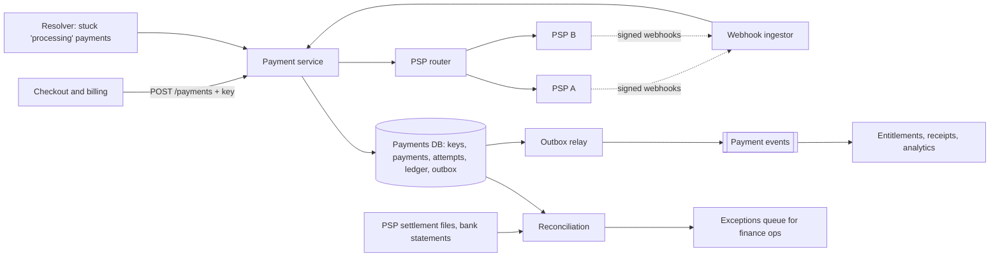

A customer taps "Pay". Your service calls the payment provider, and ten seconds later the call times out. Did the card get charged? You do not know, and nothing you can do in the next millisecond will tell you. Report failure and the customer taps again: they may be charged twice, and they will see it on their statement. Report success when the charge failed and you have given the product away. That moment, a call to a system you do not control with an outcome you cannot observe, is what payment design is about.

Payments are rarely a scale problem: billing 250 million subscribers a month needs a few hundred charges a second. They are a **correctness** problem in the presence of retries, timeouts, crashes, duplicate webhooks and external systems that cannot join your transactions. The senior answer rests on four ideas: **idempotency keys** at every boundary, **exactly-once as an effect** built from at-least-once delivery plus deduplication, a **double-entry ledger** that makes errors structurally visible, and **reconciliation** against the outside world to catch whatever the first three miss.

## Requirements

**Functional.** Charge a stored payment method for monthly renewals and at checkout, with a 3-D Secure challenge when the issuer demands one; full and partial refunds; record disputes (chargebacks) when the payment service provider (PSP) reports them; route across two or more PSPs by region and cost, with failover; post every movement of money to a double-entry ledger; reconcile daily against PSP reports and bank statements; publish payment events to entitlements, receipts and analytics. Out of scope: storing card numbers (the PSP's vault tokenises them, which keeps most of your systems out of PCI DSS scope), fraud models, tax and payouts.

| Property | Target |
|---|---|
| Correctness | No double charges, no lost payments; every cent traceable from invoice to bank |
| Durability | Zero data loss for payment state (synchronous replication) |
| Latency | Checkout p99 under 3 s, of which the PSP takes most |
| Availability | 99.99% for accepting payment requests; renewals may wait hours, never be dropped |
| Reconciliation | Over 99.9% of lines matched automatically; every break resolved within 3 business days |
| Audit | Immutable financial records retained 7+ years |

For money you choose **correctness over availability**. A renewal delayed by an hour is fine; one charged twice is an incident.

## Back-of-envelope estimates

| Quantity | Arithmetic | Result |
|---|---|---|
| Renewals | $2.5 \times 10^8$ ÷ 30 days ÷ 86,400 s | 8.3 million a day, 96/s |
| All charges | Add checkouts, card retries and refunds: assume 150/s; billing runs peak at 5× | **750/s peak**: one relational primary; do not shard for throughput |
| Money moved | $2.5 \times 10^8$ × \$15 | \$3.75 billion a month; a 0.01% error rate is \$375,000 a month |
| PSP calls in flight | Little's law: 750/s × ~1 s | 750; in a PSP brown-out with 10 s timeouts, 7,500: async I/O and a bounded pool per PSP |
| Ledger postings | 8.3 M charges × 3 entries × 2 postings | 50 million a day, 18 billion a year |
| Ledger bytes | Measured on Postgres 17: 141 B per posting including a primary key and an `(account_id, created_at)` index | 2.6 TB a year, kept 7+ years: partition by month |
| Idempotency keys | 150/s × 86,400 s × ~370 B (measured in [Idempotency and retries](/learn/system-design/building-blocks/idempotency-and-retries)) | ~5 GB live for a 24 h window |

**Consequences.** Spend the complexity budget on correctness, not scale. Reconciliation is a product, not a spreadsheet, because \$375,000 a month is at stake per basis point. PSP calls never happen inside a database transaction. Balances cannot be computed by summing 18 billion rows. Machines: a primary with a synchronous standby in another zone and a read replica for reconciliation, six stateless payment-service instances across three zones, a small Kafka cluster.

## API

```text
POST /v1/payments
  Idempotency-Key: inv_2026_09_c42
  { "invoice_id": "inv_2026_09_c42", "customer_id": "c_42",
    "amount": { "value_minor": 1599, "currency": "USD" },
    "payment_method_id": "pm_tok_9f…" }

→ 201 { "payment_id": "pay_7Q", "status": "succeeded" }
→ 202 { "payment_id": "pay_7Q", "status": "processing" }          outcome not yet known
→ 402 { "payment_id": "pay_7Q", "status": "failed", "decline_code": "insufficient_funds" }
→ 200 { "payment_id": "pay_7Q", "status": "requires_action",
        "next_action": { "type": "3ds_redirect", "url": "…" } }
→ 409  a request with this key is still in progress
→ 422  this key was used with a different request body

GET  /v1/payments/pay_7Q
POST /v1/payments/pay_7Q/refunds     Idempotency-Key: …   { "value_minor": 500 }
POST /webhooks/psp/{psp}             signed events from the PSP
```

Amounts are **integers in minor units** with an ISO 4217 code, never floats: $0.1 + 0.2 \neq 0.3$ in binary floating point, and minor units differ by currency (0 for JPY, 2 for USD, 3 for KWD). `processing` is an honest answer. The key is derived from the invoice, a natural identifier of the business intent that a buggy client cannot regenerate. A deliberate retry after a decline (dunning, days later) is a new intent with a new key, `inv_2026_09_c42:attempt-2`; replaying the old key would return the old decline.

## Data model

```sql
payments (payment_id PK, invoice_id, customer_id, amount_minor BIGINT, currency CHAR(3),
          status,   -- processing | requires_action | authorised | succeeded | failed | refunded | disputed
          psp, psp_reference, created_at, updated_at);
CREATE UNIQUE INDEX one_live_payment_per_invoice ON payments (invoice_id) WHERE status <> 'failed';

idempotency_keys (scope, key, request_hash, payment_id, response_code, response_body,
                  created_at, PRIMARY KEY (scope, key));
payment_attempts (attempt_id PK,   -- also sent to the PSP as ITS idempotency key
                  payment_id, psp, operation, status, psp_reference, raw_response, created_at);
accounts        (account_id PK, kind, currency);   -- asset | liability | revenue | expense
journal_entries (entry_id PK, kind, payment_id, created_at);   -- entry_id = 'capture:pay_7Q'
postings        (entry_id, account_id, amount_minor BIGINT, currency, created_at);  -- debit > 0
outbox          (event_id PK, topic, payload, created_at, published_at);
```

Each key answers a failure. The **partial unique index** makes the database refuse a second live payment for an invoice, however many keys, retries or bugs are involved, and it outlives the idempotency key's 24-hour window. **`(scope, key)`** scopes keys by customer, so two clients sending key `1` never see each other's response. **Deterministic `entry_id`s** make a replayed ledger post hit the primary key. **Postings are partitioned by month** on `created_at`, append-only, and indexed on `(account_id, created_at)` for balances. Keys, payments, attempts, ledger and outbox live in **one database**, so one local transaction updates them together.

## High-level design



The payment service claims the key and records the attempt in one transaction, commits, and only then calls the PSP. Results arrive synchronously or by webhook and feed one state machine; a resolver chases anything stuck in `processing`. The outbox relay publishes events to Kafka, and reconciliation compares the database with the PSP's files and the bank.

## Deep dive: one checkout, traced

### Authorise, provision, capture

At checkout the service **authorises** (the issuer reserves the funds) and **captures** (takes them) only once the product is granted, so a failure in between voids the authorisation instead of refunding a charge. Renewals use a single authorise-and-capture call. A \$15.99 checkout, key `inv_2026_09_c42`:

| t (ms) | Step | Database after the step | Ledger |
|---|---|---|---|
| 0 | Transaction 1: insert the key (`in_progress`), `pay_7Q` (`processing`), attempt `att_1` (`authorise`, `sent`); commit | Key claimed; a crash from here on leaves evidence | – |
| 3 | Authorise at PSP A with idempotency key `att_1` | Unchanged: no transaction is open across the call | – |
| ~400–1,500 | Issuer approves through the card network; the time depends on issuer and region | – | – |
| 900 | Transaction 2: `pay_7Q` = `authorised`, `att_1` = `ok`, reference `ch_1` | Funds reserved, not moved | Nothing: no money has moved |
| 905 | Entitlements grant the plan (idempotent on `pay_7Q`) | – | – |
| 910 | Capture `ch_1`, idempotency key `capture:pay_7Q` | Attempt `att_2` recorded first | – |
| ~1,200 | Transaction 3: `pay_7Q` = `succeeded`; post E1; outbox `payment.succeeded`; save the 201 under the key; commit | Everything in one commit | E1: receivable +1599, revenue −1599 |
| ~1,210 | Client gets 201 | – | – |
| Day +1 | PSP settlement file lists `ch_1`: gross 1599, fee 76 | Reconciliation matches it | E2: fees +76, receivable −76 |
| Day +2 | Bank payout arrives | Payout matched to the file's net total | E3: cash +1523, receivable −1523 |

The fee is $0.029 \times 1599 = 46.37$, rounded to 46 cents, plus 30: 76 cents, so the payout is \$15.23. If provisioning fails at 905 ms, the service voids `ch_1` and the customer sees "payment not taken"; an uncaptured authorisation also lapses by itself after a card- and network-dependent period, commonly about a week. The three-phase handler that implements transactions 1–3, with a crash between the side effect and the record, is built and run in [Idempotency and retries](/learn/system-design/building-blocks/idempotency-and-retries).

### Under the hood: what the 400–1,500 ms is

The PSP, acting for your acquiring bank, sends an authorisation request over the card network to the issuing bank, which checks the card, the available funds and its fraud models and answers approve or decline with a reason code. Nothing has moved yet: the issuer has only reduced the available balance. Capture puts the transaction into **clearing**, batches the acquirer submits to the network, typically daily; in **settlement** the issuer pays the network, the network pays the acquirer, and the PSP pays you net of fees on its payout schedule, often one to a few business days later. That is why the settlement file and the bank payout arrive days after the customer saw "paid", and why reconciliation must work in windows. When the issuer demands strong customer authentication (3-D Secure), a challenge in the customer's banking app comes first: the API returns `requires_action`, and the payment may wait minutes, which is another reason nothing holds a transaction open.

```viz
{"type": "system", "scenario": "saga", "nodes": 3,
 "title": "Checkout as a small saga",
 "caption": "Authorise, grant the entitlement, capture: each step commits on its own. If a later step fails, earlier ones are undone by compensation (void the authorisation, revoke the entitlement), not by a rollback, because the PSP is not in our transaction."}
```

### The unknown outcome

Now the capture at 910 ms times out after 10 s. There are exactly two wrong responses. Marking the payment `failed` invites the billing job to retry with a new key, which can double-charge; retrying with a new PSP key has the same effect. The right response:

1. Leave `pay_7Q` in `processing` and return 202; the page polls and says "confirming your payment".
2. Retry the capture with the **same** key `capture:pay_7Q`, which the PSP deduplicates, with backoff.
3. Accept the webhook for `ch_1` whenever it arrives; it feeds the same state machine.
4. A resolver queries the PSP by reference for anything `processing` longer than 5 minutes; the committed attempt row is the evidence that a call may have happened, which also covers a crash between the call and transaction 3.
5. Reconciliation is the backstop for whatever the resolver misses.

This is what "exactly-once" means: at-least-once delivery plus idempotent processing gives an exactly-once *effect* within the window in which keys are remembered. Stripe documents keeping keys for at least 24 hours, so a retry three days later is a new request; the partial unique index still blocks it. [Exactly-once semantics](/learn/system-design/distributed-systems/exactly-once-semantics) develops the theory.

### Webhooks out of order

Webhooks arrive at least once and in any order, so the payment's status moves only forward (`processing` → `authorised` → `succeeded` → `refunded`), and an event that does not fit triggers a fetch of the authoritative object:

| t | Event | Status before | Action | Status after |
|---|---|---|---|---|
| 0 s | `charge.refunded` for ch_1 (`evt_9`) | `processing` | Not reachable from `processing`: fetch ch_1 from the PSP API, which says captured, then refunded 500 | `succeeded` with a 500 refund recorded; E1 then E4 posted |
| 2 s | `charge.succeeded` (`evt_7`) | `succeeded` | Already past it: acknowledge, no-op | `succeeded` |
| 5 s | `evt_7` again | – | Event ID already stored: 200, no-op | – |

### Declines and dunning

If 3% of 8.3 million daily renewals decline, 250,000 retry schedules start every day. Soft declines (insufficient funds, issuer unavailable) are retried over days, often timed to when funds are likely (after a payday), each retry a new intent with a new key. Hard declines (stolen card, closed account) are never retried: card networks publish rules that cap retries of declined cards and charge for excessive ones. Retry timing is a revenue lever, so the schedule is an experiment, not a constant.

### Idempotency at every boundary

| Boundary | Duplicate source | Mechanism |
|---|---|---|
| Client → payment service | Retries, double taps, replayed billing jobs | `Idempotency-Key` with request hash and saved response; the live-payment-per-invoice index |
| Payment service → PSP | Our retries after a timeout or crash | `attempt_id` or `capture:pay_7Q` as the PSP's key |
| PSP → payment service | Webhooks delivered at least once, out of order | Verify the signature, dedupe on the PSP's event ID, apply only forward transitions |
| Payment service → downstream | Outbox relay republishes after a crash | Consumers dedupe on `event_id` |

```viz
{"type": "system", "scenario": "idempotency-key", "requests": 3, "title": "A retried charge with an idempotency key",
 "caption": "The first request claims the key, charges once and saves the response. The retry after a lost reply finds the saved response and replays it; a concurrent duplicate is refused with 409. Same key with a different body is a client bug and gets 422."}
```

```viz
{"type": "system", "scenario": "outbox", "requests": 3, "title": "Payment succeeded, event guaranteed",
 "caption": "The status change, ledger entry and outbox row commit together. The relay may publish an event twice after a crash, so the entitlement service dedupes on event_id; it can never miss one."}
```

## Deep dive: the double-entry ledger

A payments table records what you *asked* for; a ledger records what money *did*. Every journal entry moves money between at least two accounts as postings that sum to zero per currency: debits positive, credits negative. Asset and expense accounts grow with debits; liability and revenue accounts grow with credits. The checkout above, plus a later \$5.00 partial refund:

| Entry | Account | Posting (minor units) |
|---|---|---|
| E1 capture | asset: PSP receivable | +1599 |
| | revenue: subscriptions | −1599 |
| E2 PSP fee | expense: payment fees | +76 |
| | asset: PSP receivable | −76 |
| E3 settlement | asset: cash at bank | +1523 |
| | asset: PSP receivable | −1523 |
| E4 refund | contra-revenue: refunds | +500 |
| | asset: PSP receivable | −500 |

After E3 the receivable is $1599 - 76 - 1523 = 0$: the PSP owes nothing for this charge, which is exactly what reconciliation verifies. After E4 it is −500: we owe the PSP, which nets it from the next payout. The sum of all balances is zero at every point, so a bug that writes one side of an entry cannot commit. Runnable with SQLite:

```python
import sqlite3
from collections import defaultdict

db = sqlite3.connect(":memory:", isolation_level=None)
db.executescript("""
CREATE TABLE journal_entries (entry_id TEXT PRIMARY KEY, kind TEXT, payment_id TEXT);
CREATE TABLE postings (entry_id TEXT REFERENCES journal_entries, account TEXT,
                       amount_minor INTEGER NOT NULL, currency TEXT NOT NULL);
""")

def post(entry_id, kind, postings, payment_id=None):
    """postings: [(account, amount_minor, currency)]; debit > 0, credit < 0."""
    totals = defaultdict(int)
    for _, amount, currency in postings:
        if amount == 0:
            raise ValueError("zero posting")
        totals[currency] += amount
    if len(postings) < 2 or any(totals.values()):
        raise ValueError(f"unbalanced entry {entry_id}: {dict(totals)}")
    db.execute("BEGIN")
    try:
        # entry_id is deterministic ('capture:pay_7Q'), so a replay hits the primary key
        db.execute("INSERT INTO journal_entries VALUES (?, ?, ?)", (entry_id, kind, payment_id))
        db.executemany("INSERT INTO postings VALUES (?, ?, ?, ?)",
                       [(entry_id, a, amt, cur) for a, amt, cur in postings])
        db.execute("COMMIT")
    except sqlite3.IntegrityError:
        db.execute("ROLLBACK")          # already posted: the replay is a no-op
        return False
    return True

def balance(account, currency="USD"):
    return db.execute("SELECT coalesce(sum(amount_minor), 0) FROM postings "
                      "WHERE account = ? AND currency = ?", (account, currency)).fetchone()[0]

post("capture:pay_7Q", "capture", [("psp_receivable", 1599, "USD"), ("revenue", -1599, "USD")])
print(post("capture:pay_7Q", "capture", [("psp_receivable", 1599, "USD"), ("revenue", -1599, "USD")]))  # False
post("fee:pay_7Q", "fee", [("fees", 76, "USD"), ("psp_receivable", -76, "USD")])
post("settle:pay_7Q", "settlement", [("cash", 1523, "USD"), ("psp_receivable", -1523, "USD")])
print(balance("psp_receivable"), balance("cash"), balance("revenue"))    # 0 1523 -1599
try:
    post("refund:pay_7Q", "refund", [("refunds", 500, "USD"), ("psp_receivable", -50, "USD")])
except ValueError as e:
    print(e)                          # unbalanced entry refund:pay_7Q: {'USD': 450}
```

In Postgres, enforce the same invariant with a deferred constraint trigger that checks each entry's sum at commit, because application code is not the only thing that will ever write to the ledger.

### The hot account, measured

It is tempting to keep a running `balance` row per account, updated in the same transaction as each posting. Every charge touches the PSP receivable, so that row sees every transaction. Measured on Postgres 17 with durable commits, each transaction inserting two postings:

| Design | 8 connections | 32 connections |
|---|---|---|
| Append postings only | 1,590/s | 7,600/s |
| Plus one running-balance row for the receivable | 390/s, 20 ms latency | 360/s, 88 ms latency |
| Plus 16 receivable sub-accounts, one picked at random | 1,540/s | 3,030/s |

The single row stays at ~360 a second however many connections you add, because each transaction holds the row lock until its commit has flushed the WAL ([MVCC and locking](/learn/databases/relational-fundamentals/mvcc-and-locking) shows why an `UPDATE` must wait for the previous writer to finish): $1/360 \approx 2.8$ ms per transaction, serialised. At the 750/s billing peak that row is a queue. So balances are derived: a periodic snapshot per account plus the postings since, served by the `(account_id, created_at)` index; hot system accounts are split into sub-accounts (`psp_receivable:pspA:USD:07`) summed on read. A single customer's balance row is fine, because nothing else contends for it.

Three more rules keep a ledger honest. **Immutable:** mistakes are corrected by a reversing entry, never an `UPDATE`. **Balanced per currency:** conversion is two legs through an FX account at a recorded rate. **Deterministic rounding:** 1,000 cents split three ways is 333, 333 and 334 by a fixed rule, so rounding never creates or destroys a cent.

```exercise
id: ledger-balance-check
title: Check and apply journal entries
prompt: |
  Implement `check_ledger(entries)`. Each entry is `[entry_id, postings]` and each posting is
  `[account, amount_minor, currency]` (debit > 0, credit < 0). Process entries in order and
  reject an entry, applying none of its postings, for the first rule it breaks:

  1. `"duplicate"`: an entry with this `entry_id` was already accepted (a replay).
  2. `"too_few_postings"`: fewer than two postings.
  3. `"zero_posting"`: some posting has amount 0.
  4. `"unbalanced"`: for some currency, the entry's postings do not sum to 0.

  Return `{"balances": {account: {currency: total}}, "rejected": [[entry_id, reason], ...]}`.
  Include every account and currency touched by an accepted entry, even if its total is 0;
  `rejected` is in input order. A rejected `entry_id` may be accepted later.
languages: [python, javascript]
entry: check_ledger
starter:
  python: |
    def check_ledger(entries):
        balances, rejected = {}, []
        # your code here
        return {"balances": balances, "rejected": rejected}
  javascript: |
    function check_ledger(entries) {
      const balances = {}, rejected = [];
      // your code here
      return { balances, rejected };
    }
tests:
  - args: [[["capture:pay_7Q", [["psp_receivable", 1599, "USD"], ["revenue", -1599, "USD"]]], ["fee:pay_7Q", [["fees", 76, "USD"], ["psp_receivable", -76, "USD"]]], ["settle:pay_7Q", [["cash", 1523, "USD"], ["psp_receivable", -1523, "USD"]]]]]
    expected: {"balances": {"psp_receivable": {"USD": 0}, "revenue": {"USD": -1599}, "fees": {"USD": 76}, "cash": {"USD": 1523}}, "rejected": []}
    label: capture, fee and settlement leave the receivable at zero
  - args: [[["capture:pay_7Q", [["psp_receivable", 1599, "USD"], ["revenue", -1599, "USD"]]], ["capture:pay_7Q", [["psp_receivable", 1599, "USD"], ["revenue", -1599, "USD"]]], ["fee:pay_7Q", [["fees", 76, "USD"], ["psp_receivable", -76, "USD"]]]]]
    expected: {"balances": {"psp_receivable": {"USD": 1523}, "revenue": {"USD": -1599}, "fees": {"USD": 76}}, "rejected": [["capture:pay_7Q", "duplicate"]]}
    label: a replayed entry is not applied twice
  - args: [[["capture:pay_7Q", [["psp_receivable", 1599, "USD"], ["revenue", -1599, "USD"]]], ["fee:pay_7Q", [["fees", 76, "USD"], ["psp_receivable", -67, "USD"]]], ["settle:pay_7Q", [["cash", 1523, "USD"], ["psp_receivable", -1523, "USD"]]]]]
    expected: {"balances": {"psp_receivable": {"USD": 76}, "revenue": {"USD": -1599}, "cash": {"USD": 1523}}, "rejected": [["fee:pay_7Q", "unbalanced"]]}
    label: a mistyped fee is rejected and the receivable shows the gap
  - args: [[]]
    expected: {"balances": {}, "rejected": []}
    label: no entries
  - args: [[["fx:1", [["cash_usd", -1000, "USD"], ["cash_eur", 920, "EUR"]]]]]
    expected: {"balances": {}, "rejected": [["fx:1", "unbalanced"]]}
    label: USD cannot balance EUR
    hidden: true
  - args: [[["fx:1", [["cash_usd", -1000, "USD"], ["fx", 1000, "USD"], ["fx", -920, "EUR"], ["cash_eur", 920, "EUR"]]]]]
    expected: {"balances": {"cash_usd": {"USD": -1000}, "fx": {"USD": 1000, "EUR": -920}, "cash_eur": {"EUR": 920}}, "rejected": []}
    label: conversion through an FX account balances per currency
    hidden: true
  - args: [[["a", [["cash", 5, "USD"]]], ["b", [["cash", 0, "USD"], ["revenue", 0, "USD"]]], ["a", [["cash", 5, "USD"], ["revenue", -5, "USD"]]], ["a", [["cash", 5, "USD"], ["revenue", -5, "USD"]]]]]
    expected: {"balances": {"cash": {"USD": 5}, "revenue": {"USD": -5}}, "rejected": [["a", "too_few_postings"], ["b", "zero_posting"], ["a", "duplicate"]]}
    hidden: true
hints:
  - "Keep a set of accepted entry ids; check it before anything else."
  - "Sum amounts per currency inside one entry; every sum must be exactly 0 before any posting touches the balances."
```

## Deep dive: a day of reconciliation

Everything above can still be wrong: a resolver bug, a webhook never sent, a fee you did not expect, a short payout. Reconciliation compares three independent records of the same money: **your ledger**, **the PSP's settlement file** and **the bank statement**. The core is a full outer join on the PSP reference:

```sql
SELECT coalesce(p.psp_reference, s.psp_reference) AS ref,
       p.payment_id, p.amount_minor AS ours, s.gross_minor AS theirs,
       CASE
         WHEN p.payment_id IS NULL      THEN 'missing_internally'
         WHEN s.psp_reference IS NULL   THEN 'missing_at_psp'
         WHEN p.amount_minor <> s.gross_minor
           OR p.currency <> s.currency  THEN 'amount_mismatch'
         ELSE 'matched'
       END AS outcome
FROM   (SELECT * FROM payments
         WHERE status = 'succeeded' AND updated_at >= :window_start AND updated_at < :window_end) p
FULL OUTER JOIN
       (SELECT * FROM psp_settlement_lines WHERE report_date = :report_date) s
  ON p.psp_reference = s.psp_reference;
```

A small day, worked. PSP A's file for day D has four lines; our database has four succeeded payments in the window:

| Ref | Ours | PSP file | Outcome | Action |
|---|---|---|---|---|
| ch_1 | 1599 | 1599, fee 76 | matched | Post E2 and E3 |
| ch_2 | 999 | 999, fee 59 | matched | Post fee and settlement |
| ch_3 | 1599, captured 23:59:58 | – | **pending** | The PSP dated it D+1; it becomes a break only if still unmatched after 3 days |
| ch_5 | – | 1599, fee 76 | **missing internally** | Invoice `inv_2026_09_c42` was already paid by ch_1: a double charge from an unresolved timeout. Refund automatically, alert, fix the resolver |
| ch_6 | 1599 | 1499, fee 73 | **amount mismatch** | A partial capture or a bug; investigate |

The file's net is $(1599-76) + (999-59) + (1599-76) + (1499-73) = 5{,}412$. The bank shows 5,112. The 300 gap matches a chargeback line in the PSP's payout report, so the payout reconciles once that line is posted. Timing causes most false breaks, which is why lines age through `pending` before becoming exceptions. The metrics that matter are the automatic match rate, the age of the oldest break and the money in unresolved breaks. Run it daily from files as an independent check that shares no code with the payment path, and continuously from webhooks for speed.

## Failure modes

| Failure | Symptom | Diagnosis | Fix |
|---|---|---|---|
| PSP timeout | Payments stuck in `processing` | Timeouts per PSP; resolver backlog | Same-key retry, webhook, resolver, reconciliation. Never convert unknown into failed |
| PSP outage | Error rate and latency up on one PSP | Per-PSP dashboards | Route **new** payments to PSP B. A payment unknown on A stays on A until resolved or its authorisation is voided; B could charge it twice |
| Webhook chaos | A refund event before the success event; forged events | Signature failures; transitions rejected as backwards | Verify signatures, dedupe on event ID, forward-only transitions; fetch the object from the PSP when an event does not fit |
| Keys in a cache | Duplicates clustered around a cache eviction or failover | Key store is Redis with eviction | Keys in the payments database, in the same transaction |
| Crash after the PSP succeeded | Charged, but `processing` | Attempt `sent` with no result | Resolver queries by attempt reference and completes transaction 3 |
| Billing-day storm | PSP 429s at midnight on the 1st | Charge rate versus PSP limits | Anniversary billing dates, paced billing jobs, per-PSP concurrency caps |
| Hot ledger row | Commit latency climbs with load; throughput flat at ~360/s | Lock waits on one `balance` row | Derived balances; sub-accounts |
| Unbalanced entry | Commit rejected; payment unposted | Constraint-trigger errors after a deploy | Alert; post the missing entry, never edit rows |

## Trade-offs: what we rejected

| Decision | Chosen | Rejected | Why here | What would flip it |
|---|---|---|---|---|
| Cross-system atomicity | Local transactions, idempotent calls, outbox, compensation ([distributed transactions](/learn/system-design/distributed-systems/distributed-transactions)) | Two-phase commit with the PSP | The PSP is an HTTP API, not an XA participant | Never, for external PSPs |
| Key source | Derived from the invoice | Random UUID per request | Survives client restarts; backed by a unique index | No natural business key (tips, donations) |
| Balances | Snapshot plus postings; sub-accounts for hot accounts | Running balance row | Measured cap of ~360 commits/s on one row | Per-customer accounts, which are not contended |
| Checkout flow | Authorise, provision, capture | One-step charge | A provisioning failure voids instead of refunding | Instant digital goods with no provisioning step |
| Scale | One primary with a sync standby | Sharded ledger | 750/s peak | Sustained write rate beyond one primary (see 100×) |

## At 10× and 100×

**10× (7,500 charges/s at peak).** Durable commits on one primary still fit (7,600/s measured for two-posting transactions from 32 connections, with room from larger machines and batching), but the headroom is gone: partition postings by month, move reconciliation and reporting to a replica or warehouse, and add PSPs per region. Ledger storage becomes 26 TB a year: cold partitions move to cheaper storage.

**100× (a payments platform for many businesses).** Shard by merchant or account: each merchant's payments, keys and ledger live on one shard, so every transaction stays local; platform-wide accounts (fees, the PSP receivable) are split per shard and rolled up asynchronously. Reconciliation runs per shard in a batch engine over files that are now hundreds of millions of lines a day.

## What real companies describe

Stripe's API documentation describes idempotency keys that save the first response, compare the parameters of retries and may be pruned after 24 hours. Airbnb's engineering blog has described a payments idempotency library that splits each request into pre-call, call and post-call phases so that a crash between them can be retried safely. Payment providers generally document authorise-then-capture flows, settlement reports per payout, and signed, at-least-once webhooks. The same authorise, confirm, then capture-or-void sequence protects [ticket booking](/learn/system-design/case-studies/ticket-booking) from charging for seats a user did not get. Treat these as public descriptions of approaches, not current internals.

## Interviewer follow-ups

**"The PSP times out during checkout. What does the customer see?"** Model answer: "we're confirming your payment", while the page polls; the payment stays `processing`, the capture is retried with the same key, the webhook and resolver settle it within seconds to minutes, and we email if it takes longer. Common wrong answer: "payment failed, try again", which invites a second charge.

**"How do you fail over between PSPs without double charging?"** Model answer: only payments with a known outcome move. New payments route to the healthy PSP; payments unknown on the failing one stay until resolved or explicitly voided there. The unique live-payment-per-invoice index refuses a second live payment even if routing is wrong. Common wrong answer: "retry everything on the backup PSP".

**"A client retries four days later with the same key."** Model answer: the key has expired, so the request looks new, but the invoice already has a live payment, so the unique index rejects it and we return the existing payment; reconciliation catches anything that escapes both. Common wrong answer: "keep keys forever", which trades a bounded table for an unbounded one and still misses a client that mints a new key.

**"How do you answer 'what is this balance' in milliseconds?"** Model answer: a daily snapshot per account plus the postings since, via the `(account_id, created_at)` index; a materialised row is fine for a customer's account but not for system accounts, which measured at ~360 commits/s on one row. Common wrong answer: `SUM` over all postings, or one balance row for everything.

**"Isn't the ledger event sourcing?"** Model answer: it shares the property that state derives from an append-only log of immutable facts, but it has a fixed audited schema and a strong invariant (balanced per currency); event-source the payment lifecycle only if you need that history beyond audit. Common wrong answer: "yes, so store payment events and skip the ledger".

## What mid-level engineers get wrong

- Storing money as a float, then chasing a one-cent drift across millions of rows.
- Marking a timed-out payment `failed`, which turns every PSP brown-out into double charges.
- Holding a database transaction open across the PSP call and exhausting the pool during a brown-out.
- Keeping idempotency keys in an evicting cache.
- Updating ledger rows to fix mistakes, which destroys the audit trail.
- One running balance row for a system account, which caps throughput at one commit per WAL flush.
- Treating reconciliation as finance's job, so double charges are found by customers.
- Retrying hard declines on a timer, which never succeeds and draws network penalties.

## Senior signals

- You say early that payments are a **correctness problem at modest scale**, and refuse to shard for throughput you do not have.
- You place **idempotency at all four boundaries**, derive the key from the **business intent**, and back it with a **unique constraint** that outlives the key's TTL.
- You treat **"unknown" as a state** and resolve it with same-key retries, webhooks, a resolver and reconciliation.
- You separate **authorisation from capture** so that a failure after payment voids instead of refunding.
- You post a charge, fee, settlement and refund in a **double-entry ledger** in integer minor units, and know why a hot balance row serialises at the WAL flush rate.
- You make **reconciliation** a product with match rates, ageing and money at risk, and know timing windows cause most false breaks.

## Check yourself

```quiz
- q: >-
    A PSP call times out during a charge. Which response is correct?
  options: ["Mark the payment succeeded, since most charges succeed", "Mark the payment failed so the customer can retry", "Retry immediately on a second PSP to get a definite answer", "Keep it processing; retry with the same key and reconcile"]
  answer: 3
  explanation: >-
    The outcome is unknown, so the payment stays in processing and is retried with the same PSP idempotency key, then resolved by webhook or status query. Marking it failed invites a retry with a new intent, and trying a second PSP can charge twice if the first succeeded. Guessing success gives away the product when the charge actually failed.
- q: >-
    Idempotency keys are kept for 24 hours. What protects against a duplicate charge from a retry four days later?
  options: ["A longer idempotency key, so collisions cannot occur", "The PSP's fraud checks flagging the repeated charge", "A unique constraint: one live payment per invoice", "Nothing; beyond 24 hours a duplicate is an accepted risk"]
  answer: 2
  explanation: >-
    A natural business key enforced by the database outlives any key TTL. The idempotency key gives replayable responses for recent retries; the constraint gives a permanent guarantee for the business intent. Fraud checks are not designed to catch duplicates, and key length is irrelevant.
- q: >-
    A $15.99 charge incurs a 76-cent PSP fee and settles $15.23 to the bank. What is the PSP receivable balance after the capture, fee and settlement entries?
  options: ["-76", "+1599", "+1523", "0"]
  answer: 3
  explanation: >-
    The capture debits the receivable 1599; the fee credits it 76; the settlement credits it 1523. 1599 - 76 - 1523 = 0. A zero receivable after settlement is exactly the fact reconciliation checks for each charge; a nonzero one points at a missing or wrong entry.
- q: >-
    A running balance row for the PSP receivable is updated in every payment transaction. Measured, throughput stayed near 360 per second at both 8 and 32 connections. Why?
  options: ["Each transaction holds the row lock until its WAL flush", "Postgres limits each table to one writer at a time", "The postings index is rebuilt on every committed insert", "32 connections exceed the database's connection limit"]
  answer: 0
  explanation: >-
    Every transaction updates the same row and keeps its lock until commit, and commit waits for the WAL flush, about 2.8 ms here, so transactions on that row run one at a time whatever the connection count. Append-only postings do not contend and reached 7,600 per second; splitting the account into 16 sub-accounts reached 3,030.
- q: >-
    Checkout authorises the card, then grants the plan, then captures. Provisioning fails after the authorisation succeeded. What should happen?
  options: ["Capture anyway and refund the customer later", "Void the authorisation so no money is taken", "Retry the authorisation with a new idempotency key", "Let reconciliation capture the authorisation later"]
  answer: 1
  explanation: >-
    An authorisation reserves funds without moving them, so voiding it means the customer is never charged, which is cleaner than a refund that shows on the statement for days. A new authorisation key would reserve the funds twice, and reconciliation reports breaks; it does not capture payments.
- q: >-
    Reconciliation finds a PSP charge with no successful payment in your database, on an invoice already paid by another charge. What is it, and what should happen?
  options: ["A double charge; refund it automatically and alert", "A timing difference; it will match in tomorrow's file", "A fee mismatch; raise a claim against the PSP's fee", "Card fraud; block the customer's account and card"]
  answer: 0
  explanation: >-
    A charge the PSP holds that you never recorded, on an invoice already paid, means the customer paid twice, probably from an unresolved unknown outcome. The playbook refunds it and alerts so the resolver bug can be fixed. Timing windows explain a charge that appears a day late, not a second charge on a paid invoice.
```
