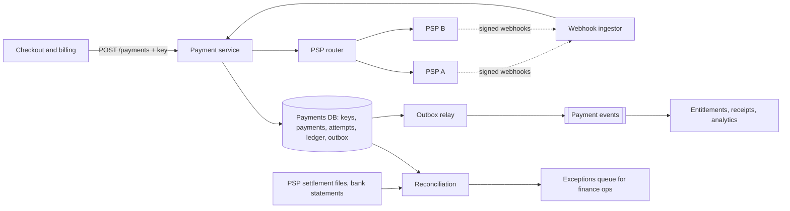

A customer taps "Pay". Your service calls the payment provider, and ten seconds later the call times out. Did the card get charged? You do not know, and nothing you can do in the next millisecond will tell you. If you report failure and the customer taps again, they may be charged twice, and they will see it on their bank statement. If you report success and the charge actually failed, you have given away the product. This single moment, a network call to a system you do not control with an outcome you cannot observe, is what payment system design is about.

Payments are rarely a scale problem. A business billing 250 million subscribers a month needs a few hundred charges per second. They are a **correctness** problem, in the presence of retries, timeouts, crashes, duplicate webhooks and external systems that cannot join your transactions. The senior answer rests on four ideas: **idempotency keys** at every boundary, **exactly-once as an illusion** built from at-least-once delivery plus deduplication, a **double-entry ledger** that makes errors structurally visible, and **reconciliation** against the outside world as the backstop that catches whatever the first three miss.

## Requirements

### Functional

- Charge a customer's stored payment method for an invoice (monthly renewals) and at checkout (new sign-ups), including a 3-D Secure challenge when the issuer demands one.
- Full and partial refunds; record disputes (chargebacks) when the PSP reports them.
- Route charges across more than one payment service provider (PSP) by region and cost, with failover.
- Record every movement of money in a double-entry ledger; answer "what is this account's balance?"
- Reconcile daily against PSP reports and bank statements.
- Publish payment events to downstream systems (entitlements, receipts, analytics).
- Out of scope: storing card numbers (the PSP's vault tokenises them, which keeps most of your systems out of PCI DSS scope), fraud models, tax, payouts to third parties.

### Non-functional

| Property | Target |
|---|---|
| Correctness | No double charges; no lost payments; every cent traceable from invoice to bank |
| Latency | Checkout p99 under 3 s, dominated by the PSP |
| Availability | 99.99% for accepting payment requests; renewals may be delayed hours, never dropped |
| Auditability | Immutable financial records, retained for years |
| Scale | 250 million subscriptions billed monthly, plus checkouts |

Make the priority explicit: for money movement you choose **correctness over availability**. A renewal that is delayed by an hour is fine; one that is charged twice is an incident.

## Back-of-envelope estimates

**Charge rate.** $2.5 \times 10^8 / 30 \approx 8.3$ million renewals a day, about 100 per second. Add checkouts, retries of declined cards and refunds, and assume 150 per second on average with billing-run peaks of 5×: **under 1,000 per second.** A single well-run relational database cluster handles this. **Consequence: do not shard for throughput; spend the complexity budget on correctness.**

**Money at stake.** At an average of \$15, 250 million subscriptions move about \$3.75 billion a month. An error rate of 0.01% is \$375,000 a month. **Consequence: reconciliation is a first-class component, not a finance spreadsheet.**

**Ledger volume.** Each successful charge produces about three journal entries (capture, PSP fee, settlement) of two postings each. $8.3 \times 10^6 \times 6 \approx 50$ million postings a day, 18 billion a year, about 2.7 TB a year at ~150 bytes, retained for seven or more years. **Consequence: postings are append-only and partitioned by month; balances cannot be computed by summing from the beginning of time.**

**PSP concurrency.** PSP calls take roughly 0.3–2 s. By Little's law, 1,000 charges per second × 1 s = 1,000 calls in flight, and during a PSP brown-out with 10-second timeouts, 10,000. **Consequence: PSP calls use asynchronous I/O and bounded pools per PSP, and never happen while a database transaction is open.**

**Declines.** A few percent of renewals decline (insufficient funds, expired card), so hundreds of thousands of retry schedules exist on any day. Retry timing is a revenue lever, and retries are another source of duplicates.

## API design

```text
POST /v1/payments
  Idempotency-Key: inv_2026_09_c42
  { "invoice_id": "inv_2026_09_c42", "customer_id": "c_42",
    "amount": { "value_minor": 1599, "currency": "USD" },
    "payment_method_id": "pm_tok_9f…" }

→ 201 { "payment_id": "pay_7Q", "status": "succeeded" }
→ 202 { "payment_id": "pay_7Q", "status": "processing" }          outcome not yet known
→ 402 { "payment_id": "pay_7Q", "status": "failed", "decline_code": "insufficient_funds" }
→ 200 { "payment_id": "pay_7Q", "status": "requires_action",
        "next_action": { "type": "3ds_redirect", "url": "…" } }
→ 409  a request with this key is still in progress
→ 422  this key was used with a different request body

GET  /v1/payments/pay_7Q
POST /v1/payments/pay_7Q/refunds     Idempotency-Key: …   { "value_minor": 500 }
POST /webhooks/psp/{psp}             signed events from the PSP
```

Amounts are **integers in minor units** with an ISO 4217 currency code, never floating point: $0.1 + 0.2 \neq 0.3$ in binary floating point, and the number of minor units differs by currency (0 for JPY, 2 for USD, 3 for KWD). `processing` is a first-class, honest answer: the API does not pretend to know what it does not. The idempotency key here is derived from the invoice, which is the strongest kind of key: a natural identifier of the business intent rather than a random value that a buggy client might regenerate. A deliberate retry after a decline (dunning, days later) is a new intent and carries a new key such as `inv_2026_09_c42:attempt-2`; replaying the old key would just return the old decline.

## Data model

```sql
payments (payment_id PK, invoice_id, customer_id, amount_minor BIGINT, currency CHAR(3),
          status,          -- processing | requires_action | succeeded | failed | refunded | disputed
          psp, psp_reference, created_at, updated_at);
CREATE UNIQUE INDEX one_live_payment_per_invoice
    ON payments (invoice_id) WHERE status <> 'failed';

idempotency_keys (scope, key, request_hash, payment_id, response_code, response_body,
                  created_at, PRIMARY KEY (scope, key));

payment_attempts (attempt_id PK,   -- also sent to the PSP as ITS idempotency key
                  payment_id, psp, status, psp_reference, raw_response, created_at);

accounts        (account_id PK, kind, currency);   -- asset | liability | revenue | expense
journal_entries (entry_id PK, kind, payment_id, created_at);
postings        (entry_id, account_id, amount_minor BIGINT, currency);  -- debit > 0, credit < 0

outbox (event_id PK, topic, payload, created_at, published_at);
```

Three structural choices are doing the work. The partial unique index means the database itself refuses a second live payment for the same invoice, however many keys, retries or bugs are involved. The idempotency keys, payments, ledger and outbox live in **one database**, so a single local transaction can update all of them atomically. And postings are append-only: nothing in the ledger is ever updated or deleted.

## High-level design



A charge flows like this. The payment service claims the idempotency key and creates the payment in state `processing` with an attempt row, in one transaction. It commits, then calls the PSP through the router, passing the `attempt_id` as the PSP's own idempotency key. When the answer arrives it opens a second transaction that records the outcome, writes the ledger entry and writes an outbox event, then stores the response under the idempotency key. Webhooks from the PSP feed the same state machine. The relay publishes outbox rows to Kafka, and reconciliation compares the database against files from the PSPs and the bank.

## Deep dives

### Idempotency at every boundary, and the unknown outcome

There are four boundaries, and each needs its own deduplication:

| Boundary | Duplicate source | Mechanism |
|---|---|---|
| Client → payment service | Retries, double taps, replayed billing jobs | `Idempotency-Key` stored with a request hash and the saved response; plus the unique live-payment-per-invoice index |
| Payment service → PSP | Our retries after a timeout or crash | Send `attempt_id` as the PSP's idempotency key; the PSP returns the original result for a repeated key |
| PSP → payment service | Webhooks are delivered at least once and out of order | Verify the signature, dedupe on the PSP's event ID, apply only forward state transitions |
| Payment service → downstream | Outbox relay republishes after a crash | Consumers dedupe on `event_id` |

```viz
{"type": "system", "scenario": "idempotency-key", "requests": 3, "title": "A retried charge with an idempotency key",
 "caption": "The first request claims the key, charges once and saves the response. The retry after a lost reply finds the saved response and replays it; a concurrent duplicate is refused with 409. Same key with a different body is a client bug and gets 422."}
```

The handler, in outline:

```python
def create_payment(req, key):
    h = sha256(canonical_json(req.body))
    with db.transaction():
        claimed = db.insert_if_absent("idempotency_keys",
                                      scope=req.customer_id, key=key, request_hash=h)
        if not claimed:
            prev = db.get("idempotency_keys", scope=req.customer_id, key=key)
            if prev.request_hash != h:
                return 422, "key reused with a different request"
            if prev.response_code is None:
                return 409, "original request still in progress"
            return prev.response_code, prev.response_body        # replay, no side effects
        pay = db.insert("payments", invoice_id=req.invoice_id, status="processing", ...)
        att = db.insert("payment_attempts", payment_id=pay.id, psp=route(req), status="sent")

    # No transaction is open across the network call.
    result = psp.charge(att, idempotency_key=att.attempt_id, timeout_s=10)

    with db.transaction():
        if result.kind == "succeeded":
            db.update("payments", pay.id, status="succeeded", psp_reference=result.ref)
            post_capture_entry(pay, result)                 # double-entry, same transaction
            db.insert("outbox", topic="payment.succeeded", payload=...)
        elif result.kind == "declined":
            db.update("payments", pay.id, status="failed")
        # timeout or 5xx: leave it 'processing'; the resolver will find out
        db.save_response("idempotency_keys", req.customer_id, key, response_for(pay))
    return response_for(pay)
```

The important line is the comment about timeouts. On a timeout the outcome is **unknown**, and there are exactly two wrong responses. Marking the payment `failed` invites the customer or the billing job to retry with a new key, which can double-charge. Retrying with a new PSP idempotency key has the same effect. The right response is to leave the payment `processing`, tell the caller so (202), and resolve it: retry the PSP call with the *same* `attempt_id`, which the PSP deduplicates; wait for the webhook; and run a resolver that queries the PSP by reference for anything stuck in `processing` longer than a few minutes. The same resolver cleans up after a crash between the two transactions, because the committed `sent` attempt is the record that a call may have happened.

This is what "exactly-once" means in practice. No network gives you exactly-once delivery. You get **at-least-once delivery plus idempotent processing**, which produces an exactly-once *effect* within the window in which you remember keys. Public payment APIs typically keep keys for about a day (Stripe documents a minimum of 24 hours), so a retry three days later is a new request. That is why the natural key matters: the unique index on `invoice_id` still blocks the duplicate after the idempotency key has expired, and reconciliation catches anything that escapes both. [Idempotency and retries](/learn/system-design/building-blocks/idempotency-and-retries) and [exactly-once semantics](/learn/system-design/distributed-systems/exactly-once-semantics) develop the general theory.

Downstream delivery uses the transactional outbox: the `payment.succeeded` event commits in the same transaction as the status change, so there is no window in which the payment succeeded but entitlements never hear about it.

```viz
{"type": "system", "scenario": "outbox", "requests": 3, "title": "Payment succeeded, event guaranteed",
 "caption": "The status change, ledger entry and outbox row commit together. The relay may publish an event twice after a crash, so the entitlement service dedupes on event_id; it can never miss one."}
```

### The double-entry ledger

A payments table records what you *asked* for. A ledger records what money *did*, and double-entry bookkeeping is the format that has survived centuries because it makes errors visible. Every journal entry moves money between at least two accounts, as postings that sum to zero per currency: debits positive, credits negative. Asset and expense accounts grow with debits; liability and revenue accounts grow with credits.

Work a real charge. A customer pays \$15.99. The PSP charges 2.9% plus 30 cents: $0.029 \times 1599 = 46.37$, rounded to 46 cents, plus 30 is 76 cents. Two days later the PSP pays out the net \$15.23. Later the customer gets a \$5.00 partial refund.

| Entry | Account | Posting (minor units) |
|---|---|---|
| E1 capture | asset: PSP receivable | +1599 |
| | revenue: subscriptions | −1599 |
| E2 PSP fee | expense: payment fees | +76 |
| | asset: PSP receivable | −76 |
| E3 settlement | asset: cash at bank | +1523 |
| | asset: PSP receivable | −1523 |
| E4 refund | contra-revenue: refunds | +500 |
| | asset: PSP receivable | −500 |

After E3 the PSP receivable is $1599 - 76 - 1523 = 0$: the PSP owes us nothing for this charge, which is precisely the fact reconciliation will verify. Cash is +1523, fees +76, revenue −1599, and all balances sum to zero. After E4 the receivable is −500: we owe the PSP, which will net it from the next payout. At every point, the sum of all balances is zero. A bug that writes one side of an entry cannot commit.

```python
from collections import defaultdict

def post(db, entry_id, kind, postings, payment_id=None):
    """postings: [(account_id, amount_minor, currency)], debit > 0, credit < 0."""
    totals = defaultdict(int)
    for _, amount, currency in postings:
        if amount == 0:
            raise ValueError("zero posting")
        totals[currency] += amount
    if any(totals.values()):
        raise ValueError(f"unbalanced entry {entry_id}: {dict(totals)}")
    # entry_id is deterministic (e.g. 'capture:pay_7Q'), so a replay hits the
    # primary key and cannot post twice.
    db.insert("journal_entries", entry_id=entry_id, kind=kind, payment_id=payment_id)
    for account, amount, currency in postings:
        db.insert("postings", entry_id=entry_id, account_id=account,
                  amount_minor=amount, currency=currency)
```

Enforce the invariant in the database too (a deferred constraint trigger that checks the sum per entry at commit), because application code is not the only thing that will ever write to the ledger.

Four rules keep a ledger honest:

- **Immutable.** Mistakes are corrected with a new reversing entry, never an `UPDATE`. The history of the correction is itself audit evidence.
- **Balanced per currency.** Currency conversion is two entries through an FX account at a recorded rate; you never let USD postings balance EUR postings.
- **Deterministic rounding.** When splitting 1,000 cents three ways, allocate 333, 333, 334 by a fixed rule, and never let rounding create or destroy a cent.
- **Balances are derived.** A balance is the sum of postings. At 18 billion postings a year you do not sum from zero: keep a periodic balance snapshot per account and sum postings since. Do not maintain a running-balance row on hot system accounts like the PSP receivable, which every charge touches; at hundreds of writes per second a single row becomes a lock queue. Split such accounts into sub-accounts (`psp_receivable:pspA:USD:shard-07`) summed on read.

### Reconciliation: trust, but verify against the outside world

Everything above can still be wrong. A resolver has a bug, a webhook was never sent, a PSP applied a fee you did not expect, a bank payout was short. Reconciliation compares three independent records of the same money: **your ledger**, **the PSP's reports** (per-transaction settlement files, usually daily) and **the bank statement** (the payouts that actually arrived).

The core is a full outer join on the PSP reference:

```sql
SELECT coalesce(p.psp_reference, s.psp_reference) AS ref,
       p.payment_id, p.amount_minor AS ours, s.gross_minor AS theirs,
       CASE
         WHEN p.payment_id IS NULL      THEN 'missing_internally'
         WHEN s.psp_reference IS NULL   THEN 'missing_at_psp'
         WHEN p.amount_minor <> s.gross_minor
           OR p.currency <> s.currency  THEN 'amount_mismatch'
         ELSE 'matched'
       END AS outcome
FROM   (SELECT * FROM payments
         WHERE status = 'succeeded' AND updated_at >= :window_start AND updated_at < :window_end) p
FULL OUTER JOIN
       (SELECT * FROM psp_settlement_lines WHERE report_date = :report_date) s
  ON p.psp_reference = s.psp_reference;
```

Each outcome has a playbook:

- **Missing internally.** The PSP charged; you have no successful payment. Usually the unknown-outcome case where resolution failed. If the invoice is unpaid, record the payment and grant the product; if the invoice was already paid by another attempt, this is a double charge, so refund it automatically and alert.
- **Missing at the PSP.** You believe it succeeded; the PSP has no record. The customer received the product without paying. Rare and serious: a bug in result handling or a forged webhook. Investigate every one.
- **Amount mismatch.** Partial captures, currency conversion, or a bug. Investigate.
- **Fee mismatch.** The PSP charged a different fee than the contract; finance raises a claim.
- **Payout mismatch.** The bank received less than the sum of settlement lines, often a PSP reserve, adjustment or chargeback. Match the PSP's payout report line by line.

Timing causes most false alarms. A charge captured at 23:59:58 in your time zone lands in the PSP's next UTC day, and settlements arrive one to three business days later. So matching uses windows (a transaction stays `pending` for a few days before it can become a break), and only unresolved items age into an exceptions queue with the money at risk attached. The metrics that matter are the automatic match rate (well above 99.9%), the age of the oldest break, and the total value of unresolved breaks.

Run reconciliation continuously as well as daily: webhooks and the resolver catch most divergence within minutes, and the daily file-based run is the independent check that does not share code paths with the system it is checking.

## Failure modes

**PSP timeout.** Outcome unknown. Mitigation: `processing` state, same-key retry, webhook, resolver, and reconciliation as the last resort. Never convert "unknown" into "failed".

**PSP outage.** Detection: error rates and latency per PSP. Mitigation: route **new** payments to the secondary PSP. Do not retry a payment whose attempt on PSP A is in an unknown state on PSP B; if A later succeeds you have charged twice. Resolve A first, or cancel the authorisation on A explicitly before trying B. Renewals do not need failover at all; they can wait hours and retry on the primary.

**Webhook chaos.** Duplicates, reordering (a refund event before the success event), forgeries. Mitigation: verify signatures, dedupe on event ID, make state transitions monotonic (a `succeeded` payment never returns to `processing`), and when an event does not fit, fetch the authoritative object from the PSP API rather than guessing.

**Idempotency store loses keys.** Keys kept in a cache that evicts under memory pressure silently turn retries into duplicate charges. Mitigation: keep keys in the same durable database as the payments, in the same transaction.

**Crash between PSP success and the second transaction.** The customer is charged; your database says `processing`. Mitigation: the resolver queries the PSP by attempt reference and completes the transaction; reconciliation catches it if the resolver does not.

**Billing-day retry storm.** Millions of renewals and their retries hit the PSP at midnight on the first of the month. Mitigation: spread billing dates (anniversary billing), pace billing jobs, and respect PSP rate limits with per-PSP concurrency caps.

**Unbalanced ledger entry.** A code change emits one side of an entry. Mitigation: the entry is rejected at commit, the payment remains unposted, an alert fires, and reconciliation reports the gap. Correct by posting the missing entry, never by editing rows.

## Senior follow-ups

**Q: "The PSP times out during checkout. What does the customer see, and what does the system do?"**

The customer sees "we're confirming your payment" rather than a failure, and the page polls the payment status. The system leaves the payment `processing`, retries the PSP call with the same attempt ID (the PSP deduplicates it), and listens for the webhook. Most resolve in seconds. If it is still unknown after a minute, the customer is told we will email them, and the resolver keeps querying. What we never do is show "payment failed, try again", because the second tap would carry a new intent and could charge twice.

**Q: "How do you fail over between PSPs without double charging?"**

Only payments whose outcome is known may move. New payments route to the healthy PSP immediately. Payments with an unknown outcome on the failing PSP stay there until resolved, or until we explicitly cancel the authorisation on that PSP and get confirmation. The unique live-payment-per-invoice index is the safety net: the database refuses a second live payment for the invoice even if routing logic is wrong.

**Q: "Why not a distributed transaction across the payments database and the PSP?"**

The PSP will not participate. Two-phase commit needs every participant to support prepare and commit under a shared coordinator; the PSP exposes an HTTP API with idempotency keys, not an XA resource manager. Even inside our own systems, 2PC would couple our availability to every participant's. The substitute is what we built: local transactions, idempotent external calls, an outbox for events, compensations (refunds) where needed, and reconciliation to prove the result. [Distributed transactions](/learn/system-design/distributed-systems/distributed-transactions) covers the trade-off in general.

**Q: "A client retries four days later with the same idempotency key. What happens?"**

The key has expired, so the request looks new. The natural key saves us: the invoice already has a live payment, so the unique index rejects the insert and we return the existing payment. This is why I derive keys from business identifiers where one exists, and why the database constraint, not the key store, is the long-term guarantee.

**Q: "How do you answer 'what is this customer's balance' in milliseconds with billions of postings?"**

Balances are snapshots plus deltas: a daily (or hourly) balance per account computed by a job, and a sum over postings since the snapshot, served by an index on `(account_id, created_at)`. For customer-facing balances, a materialised balance row updated in the same transaction as the posting is fine, because a single customer's account is not contended. Hot system accounts are the ones that get sharded sub-accounts or snapshot-only balances.

**Q: "Isn't the ledger just event sourcing?"**

It shares the key property: state is derived from an append-only log of immutable facts, and corrections are new facts. The difference is that a ledger has a fixed, audited schema (entries, postings, accounts) with a strong invariant (balanced per currency), whereas event sourcing is a general pattern for arbitrary domain events. I would event-source the payment's lifecycle only if we needed its full history for more than audit; the ledger is non-negotiable either way.

## Senior signals

- You say early that payments are a **correctness problem at modest scale**, and you refuse to shard or add infrastructure for throughput you do not have.
- You place **idempotency at all four boundaries** and derive the key from the **business intent** (invoice) where possible, backed by a **unique constraint** that outlives the key's TTL.
- You treat **"unknown" as a state**, never convert a timeout into a failure, and resolve it with same-key retries, webhooks, a resolver and reconciliation.
- You describe **exactly-once as at-least-once plus dedupe**, bounded by how long you remember keys.
- You can post a charge, fee, settlement and refund in a **double-entry ledger** with integer minor units and show that it balances.
- You make **reconciliation** a product with match rates, ageing and money-at-risk, and you know that timing windows cause most false breaks.

## Check yourself

```quiz
- q: >-
    A PSP call times out during a charge. Which response is correct?
  options: ["Mark the payment failed so the customer can retry", "Retry immediately on a second PSP", "Keep the payment in processing, retry with the same PSP idempotency key, and resolve via webhook or status query", "Mark the payment succeeded, since most charges succeed"]
  answer: 2
  explanation: >-
    The outcome is unknown. Marking it failed invites a retry with a new intent, and trying a second PSP can charge twice if the first succeeded. A same-key retry is deduplicated by the PSP, and the webhook, resolver and reconciliation settle the truth. Guessing success gives away the product when the charge actually failed.
- q: >-
    Idempotency keys are kept for 24 hours. What protects against a duplicate charge from a retry four days later?
  options: ["Nothing; this is an accepted risk", "A unique constraint allowing only one live payment per invoice", "The PSP's fraud checks", "Making the idempotency key longer"]
  answer: 1
  explanation: >-
    A natural business key enforced by the database outlives any key TTL. The idempotency key gives replayable responses for recent retries; the constraint gives a permanent guarantee for the business intent. Fraud checks are not designed to catch duplicates, and key length is irrelevant.
- q: >-
    A $15.99 charge incurs a 76-cent PSP fee and settles $15.23 to the bank. What is the PSP receivable balance after the capture, fee and settlement entries?
  options: ["+1599", "+1523", "0", "-76"]
  answer: 2
  explanation: >-
    The capture debits the receivable 1599; the fee credits it 76; the settlement credits it 1523. 1599 - 76 - 1523 = 0. A zero receivable after settlement is exactly the fact reconciliation checks for each charge.
- q: >-
    Which statement about exactly-once payment processing is accurate?
  options: ["Kafka transactions make PSP calls exactly-once", "Two-phase commit with the PSP gives exactly-once", "Exactly-once is achieved by setting retries to zero", "Exactly-once delivery is impossible over a network; you get an exactly-once effect from at-least-once delivery plus idempotent processing, within the dedupe window"]
  answer: 3
  explanation: >-
    Messages and calls can always be lost or duplicated, so systems deliver at least once and deduplicate. Kafka transactions cover reads and writes inside Kafka, not calls to an external PSP, which also does not participate in 2PC. Zero retries gives at-most-once, trading duplicates for lost payments.
- q: >-
    Daily reconciliation finds a PSP charge with no successful payment in your database, and the invoice was already paid by another attempt. What is it and what should happen?
  options: ["A timing difference; wait for tomorrow's file", "A double charge, probably from an unresolved unknown outcome; refund it automatically and alert", "A fee mismatch; raise a claim with the PSP", "Fraud; block the customer"]
  answer: 1
  explanation: >-
    A charge the PSP holds that you never recorded, on an invoice already paid, means the customer paid twice. The playbook refunds it and alerts so the resolver bug can be fixed. Timing windows explain charges that appear a day late, not a second charge on a paid invoice.
```
