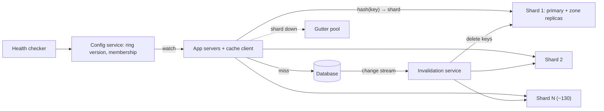
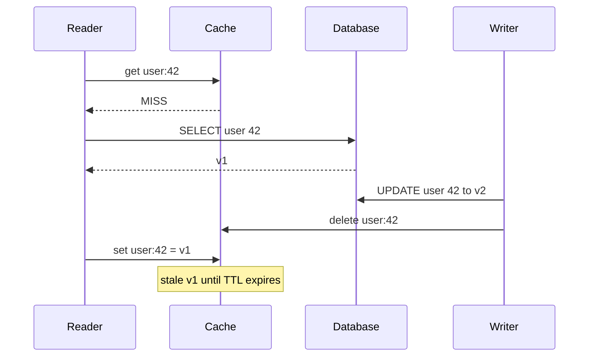

"It's just a cache" is the most expensive sentence in infrastructure. A cache that absorbs 99% of reads is not an optimisation; it is load-bearing. The database behind it has been sized for the 1% that misses, so the day a cache node dies, or a deploy flushes it, or a popular key expires under 50,000 concurrent readers, the database receives a multiple of the load it was built for and falls over. And a cache that returns wrong data is worse than a slow one, because nobody notices until a customer does.

Designing a distributed cache is therefore about four things, none of which is "put Redis in front of it": **partitioning** keys across a hundred-plus nodes so that membership changes move as few keys as possible; surviving **node loss** without a miss storm; handling **hot keys** and **stampedes** that concentrate load on one node; and keeping the cache **consistent enough** with the source of truth. This case study designs the cache cluster itself, the thing a platform team runs for hundreds of services.

## Requirements

### Functional

- `get`, `get_multi`, `set` with TTL, `add` (set if absent), `cas` (set if unchanged), `delete`, `incr`.
- Automatic eviction when memory is full; separate pools for workloads that must not evict each other.
- Routing handled by a client library or proxy; cluster membership changes without application restarts.
- Invalidation when the database changes.
- Out of scope: using the cache as a durable primary store (session stores that must survive are a different design).

### Non-functional

| Property | Target |
|---|---|
| Throughput | 10 million operations per second at peak, about 10:1 reads to writes |
| Latency | p99 under 1 ms from a client in the same zone; server time well under 100 µs |
| Working set | 10 TB of hot data |
| Hit rate | 99% for the main pool |
| Resilience | Losing a node, or a zone, must not overload the database |
| Staleness | Entries invalidated within seconds of a database write; TTL bounds the worst case |

The resilience row is the one to press on: ask what the database behind the cache can take on its own. The answer turns "should the cache replicate?" from taste into arithmetic.

## Back-of-envelope estimates

**Items.** Assume 1 KB average values, ~50-byte keys and ~50 bytes of per-item metadata: about 1.1 KB per item, so 10 TB is roughly **9 billion items**.

**Memory and nodes.** Allocators waste space (slab rounding, fragmentation) and nodes need headroom, so plan ~13 TB of RAM for one copy. With 128 GB hosts giving ~100 GB to the cache, that is **about 130 nodes**. Replicating every shard once doubles it.

**Per-node load.** $10^7 / 130 \approx 77{,}000$ operations per second per node, about 85 MB/s or 0.7 Gbps. Memcached is multithreaded and handles several times that per host; a single Redis process tops out around 100,000 simple operations per second, so a Redis deployment runs several processes per host. Either way the cluster is **memory-bound, not CPU-bound**, which is the usual shape of a cache.

**Database exposure.** 9 million reads per second at a 99% hit rate leaves 90,000 per second for the database. Lose one of 130 nodes and its share of reads, $9 \times 10^6 / 130 \approx 69{,}000$ per second, all miss at once: the database goes from 90,000 to about 160,000 reads per second, **1.75× its normal load, from one node**. Lose a zone holding a third of the nodes without replication and 3 million reads per second hit the database. **Consequence: the cache needs a node-failure strategy (replicas or a gutter pool) and zone-aware placement, even though it holds no data you cannot recompute.**

**Hot key.** One key read a million times a second lives on one node: 1 million ops and ~1 GB/s (8 Gbps) against a node sized for 77,000 ops. **Consequence: per-key load, not aggregate load, is what breaks a well-sized cluster.**

**The cross-zone bill.** Clients in three zones spread evenly over nodes in three zones means about two-thirds of the roughly 11 GB/s of cache traffic (10 million operations × 1.1 KB) crosses a zone boundary. Clouds commonly bill inter-zone traffic at around \$0.01 per GB in each direction, so $7.3 \text{ GB/s} \times 86{,}400 \approx 630$ TB a day, on the order of \$10,000 a day and several hundred thousand dollars a month. **Consequence: zone-local read replicas and zone-aware routing pay for themselves.**

## API design

```text
get(key)                        → (value, cas_token) | MISS
get_multi([k1, k2, …])          → { k: value }         batched per node, fanned out in parallel
set(key, value, ttl_s)
add(key, value, ttl_s)          → STORED | NOT_STORED  only if absent (locks, leases)
cas(key, value, cas_token, ttl_s) → STORED | EXISTS    only if unchanged since get
delete(key)
incr(key, delta)                → new value
```

The client library is part of the API. It hashes keys to nodes using a routing table it watches in a config service, keeps pooled connections, and applies a tight timeout (a few milliseconds; a cache that takes 50 ms is worse than a miss). It treats timeouts as misses and never blindly retries writes. It prefixes keys with a schema version (`user:v7:42`), so a deploy that changes serialisation reads fresh keys instead of misparsing old ones. `get_multi` groups keys by node and issues one request per node in parallel, which matters because a page that needs 200 keys should cost one round of parallel requests, not 200 sequential ones.

## Data model

Inside each node:

- A **hash table** from key to item. The item holds the value bytes, expiry time, a CAS version, flags, and links for the eviction list.
- A **slab allocator** (Memcached's approach): memory is carved into pages, and each page into equal-sized chunks for one size class, with classes growing by a factor (1.25 by default). An item goes into the smallest class that fits. No external fragmentation, at the cost of internal waste, and of "slab calcification" when the size mix shifts and one class starves while another has free pages, which is why modern versions rebalance pages between classes.
- **Eviction** per size class by an approximate or segmented LRU. Expired items are reclaimed lazily on access and by a background crawler.

Cluster-wide, the only shared state is small: the membership list, the ring or slot map with a version number, and per-node health, all in a strongly consistent config service such as etcd or ZooKeeper that clients watch.

LRU is the default eviction policy because recency predicts reuse for most cache workloads, and it is cheap: a hash map plus a doubly linked list gives O(1) lookup, promotion and eviction ([the LRU cache lesson](/learn/advanced-data-structures/caches-and-eviction/lru-cache) builds it).

```viz
{"type": "system", "scenario": "lru-cache", "keys": ["A", "B", "C", "A", "D", "B", "E", "A"],
 "title": "Eviction inside one cache node",
 "caption": "Every hit moves the item to the head; a full node evicts from the tail. Real servers approximate this: Redis samples a handful of keys and evicts the oldest of the sample, and Memcached segments its LRU into hot, warm and cold regions so a one-off scan cannot flush the working set."}
```

## High-level design



Clients route each key to a shard with consistent hashing over a membership list they watch in the config service. Each shard has a primary and replicas in other zones; clients read from the replica in their own zone and send writes and deletes to all copies. On a miss the application reads the database and populates the cache (cache-aside). A separate invalidation service tails the database's change stream and deletes affected keys, so every write path invalidates, including batch jobs and manual fixes. When a shard is unreachable, clients temporarily use a small gutter pool rather than rehashing its keys onto healthy nodes.

## Deep dives

### Partitioning and rebalancing

**Why not `hash(key) mod N`?** Because changing N remaps almost every key. Going from 130 to 131 nodes moves a key unless `hash mod 130` equals `hash mod 131`, which is true for about 1 key in 131: **99.2% of keys move**, the hit rate collapses to near zero, and the database receives the full 9 million reads per second. Mod-N is fine for a fixed-size cluster that never changes; caches change all the time.

**Consistent hashing** places nodes and keys on the same hash ring and assigns each key to the first node clockwise. Adding a node takes over only the arc between it and its predecessor: about $1/131 \approx 0.76\%$ of keys move.

```viz
{"type": "system", "scenario": "consistent-hashing", "nodes": 4,
 "keys": ["user:1", "user:7", "video:9", "session:3", "cart:5", "feed:2"],
 "title": "Adding a node moves only its arc",
 "caption": "With mod-N, adding a node remaps nearly every key and the hit rate collapses. On a ring, only keys between the new node and its predecessor move, about 1/N of them."}
```

**Virtual nodes** fix the balance. With one point per node, arc lengths vary wildly. In a quick simulation of 130 nodes and 200,000 keys, one point per node left the busiest node with **4.5× the average load** and one node with almost none. With 160 points per node, the busiest node carried **1.25×** the average and the standard deviation fell to about **8%**; adding a 131st node moved 0.78% of keys, as predicted.

```python
import bisect, hashlib

def h(s: str) -> int:
    return int.from_bytes(hashlib.blake2b(s.encode(), digest_size=8).digest(), "big")

class Ring:
    def __init__(self, nodes, vnodes=160):
        # Each physical node appears vnodes times at pseudo-random positions.
        self.points = sorted((h(f"{n}#{i}"), n) for n in nodes for i in range(vnodes))
        self.hashes = [p for p, _ in self.points]

    def node_for(self, key: str) -> str:
        i = bisect.bisect(self.hashes, h(key)) % len(self.points)   # first point clockwise
        return self.points[i][1]
```

Virtual nodes also spread a failed node's load across many neighbours instead of dumping it all on one successor.

**Alternatives.** Fixed slots, as in Redis Cluster, hash keys into 16,384 slots (CRC16 of the key mod 16,384) and assign slots to nodes explicitly. Rebalancing is "move these slots", which operators control precisely, and clients that hit a moved slot receive a `MOVED` redirect and refresh their map. Hash tags (`{user:42}:profile`, `{user:42}:settings`) force related keys into one slot so multi-key operations work. Rendezvous hashing scores every node per key and picks the highest; it needs no ring and moves the minimum number of keys, at O(N) per lookup, which is fine for tens of nodes.

**Where routing lives.** In the client (fastest, no extra hop, but thousands of app servers must converge on the same ring version), in a proxy (one place to change config and far fewer connections to each cache node, for an extra hop of a fraction of a millisecond), or on the server via redirects (Redis Cluster). At hundreds of services, a proxy tier or sidecar usually wins on operability; for a single latency-critical service, a smart client wins.

### Hot keys and stampedes

**Detecting hot keys.** Servers sample requests and keep approximate per-key counts (a count-min sketch plus a small heap of heavy hitters), and export the top keys to the control plane. You cannot fix what you cannot see, and hot keys are usually a surprise: a celebrity profile, a feature-flag blob every request reads, a product on the home page.

**Near cache.** Give the client a tiny in-process cache for keys the control plane marks hot, with a TTL of a second or two. A key read a million times a second across 2,000 app servers then costs each server one fetch per second: 2,000 reads per second at the cache node instead of a million. The price is up to one TTL of staleness and no invalidation, which is acceptable for most hot keys (a profile, a config blob) and unacceptable for a few (an account balance), so it is opt-in per key pattern.

**Key replication.** Store copies under `k#0` … `k#7` on eight different nodes; readers pick a suffix at random, writers delete all eight. Read load per node falls by 8×, and write cost rises by 8×, which suits the read-dominated keys that become hot.

**Stampedes.** When a hot key expires or is evicted, every concurrent reader misses together and recomputes it against the database.

```viz
{"type": "system", "scenario": "cache-stampede", "requests": 40, "title": "One expiry, forty identical queries",
 "caption": "Without coordination every reader that misses goes to the database. A lease (or single-flight lock) lets one reader recompute while the others wait briefly or take a stale value."}
```

The strongest fix is a **lease**, described in Facebook's "Scaling Memcache at Facebook" paper (NSDI 2013). On a miss, the server gives the first client a lease token and tells the others, for the next few seconds, to wait and retry or to accept a slightly stale value. Only the token holder queries the database and sets the key. The same token solves the stale-set race in the next deep dive, which is why leases are worth building into the server rather than bolting onto clients. Jittered TTLs (so keys written together do not expire together) and probabilistic early refresh (recompute slightly before expiry, with a probability that rises as expiry nears) remove most stampedes before they start.

### Consistency with the source of truth

Cache-aside has a race that bites every team eventually:



The reader's `set` arrives after the writer's `delete`, so the cache holds v1 for the full TTL, which might be hours. Defences, in order of strength:

- **Delete, do not update, on write.** Two writers updating the cache can land out of order; two deletes cannot conflict. The next reader repopulates from the database.
- **Guard the set.** A lease makes it structural: the writer's `delete` invalidates any outstanding lease for the key, so the slow reader's `set` carries a dead token and is rejected. Without leases you can approximate this with `add` (only set if absent) after a short-lived tombstone left by the delete, or with version numbers compared on set.
- **Invalidate from the change stream.** Application code that remembers to delete misses the batch job, the migration and the engineer running `UPDATE` by hand. An invalidation service tailing the database's change stream (binlog or WAL, via CDC) deletes keys for every committed write and retries until the delete succeeds, which also means deletes happen *after* commit, never before.
- **TTL as the backstop.** Every key has a TTL, so every inconsistency has a bound. Choose it per key type from how stale that data may be, not one global number.

Two further cases matter in review. **Read-your-writes** for the writer: after a user edits their profile, their next read may hit a replica or a not-yet-invalidated key. Route that user's reads to the database for a few seconds after a write, or write through for their own session. **Multiple regions**: each region runs its own cache, and invalidations must follow the database's replication stream into each region, so a write in one region invalidates the other only after replication lag. The Facebook paper describes setting a marker in the local region on write so that readers there go to the primary database until replication catches up.

## Failure modes

**Node failure.** The arithmetic says one node costs 1.75× database load. Mitigations: a replica per shard in another zone that takes over reads (the price is roughly double the memory), or a **gutter pool**, a small set of spare servers (the Facebook paper describes about 1% of a cluster) that absorbs a failed node's keys with short TTLs. Rehashing a dead node's keys onto its ring neighbours sounds natural but doubles their load at the worst moment and can cascade. Use hysteresis before removing a node from the ring, so a GC pause or network blip does not trigger a reshuffle.

**Zone failure.** Replicas must be in other zones, and routing must prefer the local zone's copy while falling back across zones.

**Cold cache.** A new cluster or a full restart starts at a 0% hit rate. Warm it before it takes production traffic: replay recent keys from a sample of access logs, or shift traffic gradually while watching database load. Never flush a production cache at peak.

**Split routing.** During a membership change, some clients have ring version 41 and others version 42, so the same key is written to two nodes, and after convergence some readers see the stale copy. Mitigations: version the ring in the config service, make clients converge quickly, and keep TTLs short enough to bound the damage.

**Big values and slow commands.** A 5 MB value or a `KEYS *` in a single-threaded server blocks every other request on that node, turning a p99 of 1 ms into hundreds. Mitigations: cap value size (Memcached's default item limit is 1 MB), store large blobs in object storage and cache a pointer, and block expensive commands in the client (use `SCAN` and `UNLINK` in Redis).

**Noisy neighbour eviction.** A new service writes millions of one-off keys and evicts another team's hot working set. Mitigation: separate pools per workload with their own memory budgets, which is also how you give critical data a different hit-rate target.

**Connection storms.** Thousands of app servers × 130 nodes × a few connections each is hundreds of thousands of connections; a deploy that reconnects them all at once can overwhelm the servers. Proxies and connection pooling cap it.

## Senior follow-ups

**Q: "Memcached, Redis Cluster, or build your own?"**

For a pure look-aside cache of opaque values at this scale, Memcached's multithreading and simplicity make it very efficient per host, with routing done by a client or proxy. Redis Cluster brings data structures (sorted sets, hashes, counters), replication and server-side routing, which many teams want, at the cost of single-threaded command execution per process and more operational surface. I would not build a cache server; I would build the parts that are specific to us: the client or proxy with our routing, hot-key handling and metrics, and the invalidation pipeline. [Key-value stores and Redis](/learn/databases/nosql-and-specialised/key-value-stores-and-redis) compares the engines.

**Q: "You need 20 more nodes during peak. How do you add them without a miss storm?"**

Consistent hashing bounds the damage to about 20/150, or 13% of keys, which would still push the database well past its normal load at peak, so do not add them all at once. Add them one or two at a time, waiting for the hit rate to recover between steps, or warm each new node first by having clients dual-read (try the new owner, fall back to the old owner on a miss and copy the value across) until its hit rate matches. With Redis Cluster, migrate slots gradually. And the real answer is capacity planning: add nodes before peak, not during it.

**Q: "Should the cache replicate at all? It is only a cache."**

It depends on what one node's worth of misses does to the database. Here, one node is 1.75× normal database load and a zone is fatal, so yes: zone-spread replicas, or a gutter pool if memory cost dominates. For a small cluster in front of a database with 10× headroom, replication is wasted memory. The estimate decides, not the principle.

**Q: "Cache-aside or write-through?"**

Cache-aside with delete-on-write and change-stream invalidation for general data, because it caches only what is read and tolerates cache outages. Write-through makes sense for data that is read immediately after being written and must be fresh, and it doubles the write path's failure modes: if the database commit succeeds and the cache write fails, you are back to needing invalidation anyway. [Caching strategies](/learn/system-design/building-blocks/caching-strategies) walks through the variants.

**Q: "How do you choose a TTL?"**

Per key type, from two numbers: how stale the data may be when every other invalidation mechanism fails, and how expensive a miss is. A product price might tolerate 60 seconds and be cheap to recompute; a rendered recommendations row might tolerate an hour and cost 200 ms of model inference. Add jitter so keys written together do not expire together. Do not choose "no TTL": that converts every missed invalidation into permanent corruption.

## Senior signals

- You treat the cache as **load-bearing** and compute what a node or zone failure does to the database before deciding on replication.
- You explain why **mod-N remaps ~99% of keys** and **consistent hashing ~1/N**, and why **virtual nodes** are needed for balance, with numbers.
- You look for **hot keys** separately from aggregate load and have three tools: near cache, key replication, and leases for stampedes.
- You can draw the **stale-set race**, and fix it with **delete-on-write, leases or guarded sets, change-stream invalidation and TTL as a backstop**.
- You estimate the **cross-zone traffic bill** and design zone-local reads because of it.
- You separate **pools per workload** and cap value sizes, because the worst cache incidents are one tenant hurting another.

## Check yourself

```quiz
- q: >-
    A cluster of 130 cache nodes uses hash(key) mod N. One node is added. Roughly what fraction of keys now maps to a different node?
  options: ["About 99%", "About 1%", "About 50%", "About 0%"]
  answer: 0
  explanation: >-
    A key stays put only if hash mod 130 equals hash mod 131, which happens for about 1 key in 131, so about 99% move and the hit rate collapses. Moving about 1/131 of keys (under 1%) is what consistent hashing gives you, not modulo hashing; existing keys do not stay put.
- q: >-
    9 million reads per second hit a 130-node cache at a 99% hit rate. One node dies and its keys all miss. What happens to database read load?
  options: ["It stays at about 90,000 per second", "It rises by about 1%, to 91,000 per second", "It rises to about 160,000 per second", "It drops, because fewer nodes are answering"]
  answer: 2
  explanation: >-
    Normal misses are 90,000 per second. The dead node's share of reads, about 69,000 per second, now all misses, giving about 160,000: roughly 1.75 times normal. That is why the cache needs replicas or a gutter pool even though it stores nothing irreplaceable.
- q: >-
    Why do consistent-hashing rings use many virtual nodes per physical node?
  options: ["To reduce the number of keys that move when a node is added", "Because hash functions produce collisions without them", "To allow keys to be stored on multiple nodes for durability", "To even out arc sizes and spread a dead node's keys widely"]
  answer: 3
  explanation: >-
    With one point per node, arcs are very uneven; a simulation of 130 nodes gave the busiest node about 4.5 times the average. With 160 points per node the busiest carried about 1.25 times, and a failed node's keys spread across many neighbours. The fraction of keys moved on a change is about 1/N either way, so that is not the reason.
- q: >-
    A reader misses, reads v1 from the database, and pauses. A writer commits v2 and deletes the key. The reader then sets v1. What prevents the stale value from living until its TTL?
  options: ["Having the reader fetch from a database replica", "A shorter TTL so the stale value expires sooner", "A lease: the delete voids the reader's token, so its set fails", "Having the writer update the cache instead of deleting the key"]
  answer: 2
  explanation: >-
    The race is between a slow set and a delete. A lease (or a guarded set with a version) makes the slow set fail. Updating instead of deleting creates a different ordering race between writers; a shorter TTL only shortens the window, the stale value still lives until it expires; replicas add lag and make it worse.
- q: >-
    One key receives a million reads per second from 2,000 app servers. Which mitigation reduces the load on its cache node the most, and what does it cost?
  options: ["Add more cache nodes; the cost is the extra hardware", "Raise the key's TTL; the cost is holding it in memory longer", "An in-process near cache; the cost is up to 1 s staleness", "Use consistent hashing; the cost is a ring lookup per read"]
  answer: 2
  explanation: >-
    More nodes and ring changes do not help: one key lives on one node. A near cache with a 1-second TTL means each app server fetches once per second, so about 2,000 reads per second reach the node. The trade is bounded staleness without invalidation, which is why it is opt-in per key type.
```
