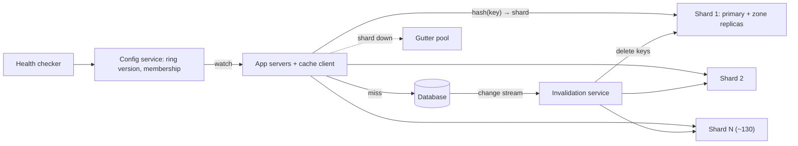

"It's only a cache" is the most expensive sentence in infrastructure. A cache that absorbs 99% of reads is not an optimisation; it is load-bearing. The database behind it has been sized for the 1% that misses, so the day a cache node dies, or a deploy flushes it, or a popular key expires under 50,000 concurrent readers, the database receives a multiple of the load it was built for and falls over. And a cache that returns wrong data is worse than a slow one, because nobody notices until a customer does.

Designing a distributed cache is therefore about four things, none of which is "put Redis in front of it": **partitioning** keys across a hundred-plus nodes so that membership changes move as few keys as possible; surviving **node loss** without a miss storm; handling **hot keys** and **stampedes** that concentrate load on one node; and keeping the cache **consistent enough** with the source of truth. This case study designs the cache cluster itself, the thing a platform team runs for hundreds of services.

## Requirements

**Functional.** `get`, `get_multi`, `set` with TTL, `add` (set if absent), `cas` (set if unchanged), `delete`, `incr`; eviction when memory is full; separate pools for workloads that must not evict each other; routing by a client library or proxy, with membership changes and no application restarts; invalidation when the database changes. Out of scope: the cache as a durable primary store.

| Property | Target |
|---|---|
| Throughput | 10 million operations per second at peak, about 9:1 reads to writes |
| Latency | p99 under 1 ms from a client in the same zone; server time well under 100 µs |
| Working set | 10 TB of hot data |
| Hit rate | 99% for the main pool |
| Resilience | Losing a node must keep the database under 1.5× its normal load; losing a zone must not take it down |
| Staleness | Invalidated within seconds of a database write; a TTL bounds the worst case |

The resilience row is the one to press on: ask what the database behind the cache can take on its own. The answer turns "should the cache replicate?" from taste into arithmetic.

## Back-of-envelope estimates

| Quantity | Arithmetic | Result |
|---|---|---|
| Items | 10 TB ÷ (1 KB value + ~50 B key + ~50 B metadata) | ~9 billion |
| RAM for one copy | 10 TB plus slab rounding, fragmentation and headroom | ~13 TB |
| Nodes | 13 TB ÷ ~100 GB usable per 128 GB host | **~130**; 260 with a replica of every shard |
| Per-node load | $10^7$ ÷ 130 | 77,000 ops/s, 85 MB/s, 0.7 Gbps: memory-bound, not CPU-bound |
| Normal database reads | 9 M reads/s × 1% misses | 90,000/s |
| One node dies, no protection | + its share, $9 \times 10^6 / 130$ = 69,000/s, all missing | 159,000/s: **1.77× normal** |
| One zone of three dies | a third of the reads miss | 3 million/s: fatal |
| Hot key | one key at $10^6$ reads/s × 1.1 KB | 1 GB/s on one node sized for 77,000 ops |
| Cross-zone traffic | two-thirds of 11 GB/s crosses zones | 7.3 GB/s, 634 TB a day; at ~\$0.01/GB charged on each side, ~\$12,700 a day |
| Client connections | 2,000 app hosts × 20 processes × 130 nodes | 5.2 million, 40,000 per node |

**Consequences.** Node loss needs a strategy (replicas or a gutter pool) and zone loss needs replicas in other zones, even though the cache holds nothing irreplaceable. Per-key load, not aggregate load, breaks a well-sized cluster. Zone-local reads pay for themselves. And 40,000 connections per node argues for a proxy per host.

## API

```text
get(key)                        → (value, cas_token) | MISS
get_multi([k1, k2, …])          → { k: value }         batched per node, fanned out in parallel
set(key, value, ttl_s)
add(key, value, ttl_s)          → STORED | NOT_STORED  only if absent (locks, leases)
cas(key, value, cas_token, ttl_s) → STORED | EXISTS    only if unchanged since get
delete(key)
incr(key, delta)                → new value
```

The client library is part of the API. It hashes keys to nodes using a routing table it watches in a config service, keeps pooled connections, and applies a tight timeout (a few milliseconds; a cache that takes 50 ms is worse than a miss). It treats timeouts as misses and never blindly retries writes. It prefixes keys with a schema version (`user:v7:42`), so a deploy that changes serialisation reads fresh keys instead of misparsing old ones. `get_multi` groups keys by node and issues one request per node in parallel: a page that needs 200 keys costs one round of parallel requests, not 200 sequential ones.

## Data model

Inside each node:

- A **hash table** from key to item; the item holds the value, expiry, a CAS version, flags and eviction-list links.
- A **slab allocator** (Memcached's approach): memory is carved into 1 MB pages, each split into equal chunks for one size class, classes growing by a factor of 1.25 by default. An item goes into the smallest class that fits, so there is no external fragmentation but up to ~20% internal waste, and "slab calcification" when the size mix shifts, which is why modern versions move pages between classes.
- **Eviction** per size class by a segmented LRU; expired items are reclaimed lazily on access and by a background crawler.

Cluster-wide, the only shared state is small: the membership list and the ring or slot map with a version number, in a strongly consistent config service (etcd or ZooKeeper) that clients watch. Keys are chosen so that one `get_multi` for a page lands on few nodes where it matters: hash tags such as `{user:42}:profile` and `{user:42}:settings` force related keys onto one node, at the price of a hotter node if user 42 is a celebrity.

LRU is the default because recency predicts reuse for most cache workloads, and a hash map plus a doubly linked list gives O(1) lookup, promotion and eviction ([the LRU cache lesson](/learn/advanced-data-structures/caches-and-eviction/lru-cache) builds it).

```viz
{"type": "system", "scenario": "lru-cache", "keys": ["A", "B", "C", "A", "D", "B", "E", "A"],
 "title": "Eviction inside one cache node",
 "caption": "Every hit moves the item to the head; a full node evicts from the tail. Real servers approximate this: Redis samples a handful of keys and evicts the oldest of the sample, and Memcached segments its LRU into hot, warm and cold regions so a one-off scan cannot flush the working set."}
```

## High-level design



Clients route each key with consistent hashing over the membership they watch. Each shard has a primary and a replica in another zone; clients read the copy in their own zone and send writes and deletes to all copies. On a miss the application reads the database and populates the cache ([cache-aside](/learn/system-design/building-blocks/caching-strategies)). An invalidation service tails the database's change stream and deletes affected keys, so every write path invalidates, including batch jobs and manual fixes. A small gutter pool absorbs a dead shard's keys while it is replaced.

## Deep dive: partitioning and rebalancing

**Why not `hash(key) mod N`?** Changing N remaps almost every key. Going from 130 to 131 nodes, a key stays put only if `hash mod 130` equals `hash mod 131`; over a million random 64-bit hashes, **99.24% moved**, the hit rate collapses and the database receives all 9 million reads a second.

**Consistent hashing** places nodes and keys on one hash ring; a key belongs to the first node clockwise. Adding a node takes over only the arc before it: ideally $1/131 = 0.76\%$ of keys.

```viz
{"type": "system", "scenario": "consistent-hashing", "nodes": 4,
 "keys": ["user:1", "user:7", "video:9", "session:3", "cart:5", "feed:2"],
 "title": "Adding a node moves only its arc",
 "caption": "With mod-N, adding a node remaps nearly every key and the hit rate collapses. On a ring, only keys between the new node and its predecessor move, about 1/N of them."}
```

**Virtual nodes** fix the balance. Simulated with 130 nodes, 200,000 keys and BLAKE2b positions:

| Points per node | Busiest node ÷ average | Spread (std dev) | Keys moved adding node 131 | Where a dead node's keys go |
|---|---|---|---|---|
| 1 | 5.79× | 101% | 1.86% | All to one neighbour |
| 10 | 2.04× | 31% | 0.63% | 9 nodes, biggest share 49% |
| 160 | 1.23× | 8.7% | 0.65% | 92 nodes, biggest share 4% |

```python
import bisect, hashlib

def h(s: str) -> int:
    return int.from_bytes(hashlib.blake2b(s.encode(), digest_size=8).digest(), "big")

class Ring:
    def __init__(self, nodes, vnodes=160):
        # Each physical node appears vnodes times at pseudo-random positions.
        self.points = sorted((h(f"{n}#{i}"), n) for n in nodes for i in range(vnodes))
        self.hashes = [p for p, _ in self.points]

    def node_for(self, key: str) -> str:
        i = bisect.bisect(self.hashes, h(key)) % len(self.points)   # first point clockwise
        return self.points[i][1]
```

The last column is the failure argument: with one point per node, a dead node doubles one neighbour's load; with 160 its load spreads over 92 nodes at under 5% each.

**Alternatives.** Redis Cluster hashes keys into 16,384 slots (CRC16 mod 16,384) assigned to nodes explicitly; rebalancing moves slots, and a client that hits a moved slot gets a `MOVED` redirect and refreshes its map. Rendezvous hashing scores every node per key and picks the highest: no ring and minimal movement, at O(N) per lookup. Routing can live in the client (no extra hop; thousands of processes must converge on one ring version), in a proxy per host (one place to change, 8× fewer connections per node, a fraction of a millisecond extra), or in the server via redirects. At hundreds of services a per-host proxy usually wins. [Partitioning and rebalancing](/learn/system-design/distributed-systems/partitioning-and-rebalancing) covers the general case.

```exercise
id: ring-moves
title: Which keys move when the ring changes?
prompt: |
  Implement `ring_moves(old_nodes, new_nodes, vnodes, keys)`.

  Each node `n` is placed on a ring of 32-bit positions at `vnodes` points,
  `h32(f"{n}#{i}")` for `i` in `0 .. vnodes-1` (the starter gives you `h32`).
  A key belongs to the first point whose position is `>= h32(key)`, wrapping to the
  lowest point if there is none. If two points share a position, the smaller node
  name comes first.

  Return `[key, old_owner, new_owner]` for every key whose owner differs between the
  ring built from `old_nodes` and the ring built from `new_nodes`, in input order.
languages: [python, javascript]
entry: ring_moves
starter:
  python: |
    def h32(s):
        h = 2166136261                      # FNV-1a over the UTF-8 bytes
        for b in s.encode("utf-8"):
            h = ((h ^ b) * 16777619) % 2**32
        h ^= h >> 16                        # murmur3 finaliser
        h = (h * 0x85EBCA6B) % 2**32
        h ^= h >> 13
        h = (h * 0xC2B2AE35) % 2**32
        h ^= h >> 16
        return h

    def ring_moves(old_nodes, new_nodes, vnodes, keys):
        # your code here
        return []
  javascript: |
    function h32(s) {
      let h = 2166136261;                   // FNV-1a over the UTF-8 bytes
      for (const b of new TextEncoder().encode(s)) h = Math.imul(h ^ b, 16777619) >>> 0;
      h ^= h >>> 16; h = Math.imul(h, 0x85ebca6b) >>> 0;   // murmur3 finaliser
      h ^= h >>> 13; h = Math.imul(h, 0xc2b2ae35) >>> 0;
      h ^= h >>> 16;
      return h >>> 0;
    }

    function ring_moves(old_nodes, new_nodes, vnodes, keys) {
      // your code here
      return [];
    }
tests:
  - args: [["a", "b", "c"], ["a", "b", "c", "d"], 50, ["user:1", "user:2", "user:3", "user:4", "user:5", "user:6", "user:7", "user:8", "user:9", "user:10", "user:11", "user:12"]]
    expected: [["user:2", "b", "d"], ["user:3", "a", "d"], ["user:6", "c", "d"], ["user:8", "c", "d"], ["user:12", "b", "d"]]
    label: every moved key moves to the new node
  - args: [["a", "b", "c", "d"], ["a", "c", "d"], 50, ["user:1", "user:2", "user:3", "user:4", "user:5", "user:6", "user:7", "user:8", "user:9", "user:10", "user:11", "user:12"]]
    expected: [["user:9", "b", "c"], ["user:10", "b", "d"], ["user:11", "b", "d"]]
    label: only the removed node's keys move
  - args: [["a", "b"], ["a", "b"], 10, ["user:1", "user:2", "user:3"]]
    expected: []
    label: no membership change
  - args: [["a", "b", "c"], ["a", "b", "c", "d"], 50, []]
    expected: []
    label: no keys
  - args: [["a", "b", "c"], ["a", "b", "c", "d"], 1, ["user:1", "user:2", "user:3", "user:4", "user:5", "user:6", "user:7", "user:8", "user:9", "user:10", "user:11", "user:12"]]
    expected: []
    label: one point per node can own an empty arc
    hidden: true
  - args: [["solo"], ["solo", "twin"], 3, ["user:1", "user:2", "user:3", "user:4", "user:5", "user:6", "user:7", "user:8", "user:9", "user:10", "user:11", "user:12"]]
    expected: [["user:1", "solo", "twin"], ["user:2", "solo", "twin"], ["user:3", "solo", "twin"], ["user:4", "solo", "twin"], ["user:6", "solo", "twin"], ["user:8", "solo", "twin"], ["user:9", "solo", "twin"], ["user:12", "solo", "twin"]]
    hidden: true
hints:
  - "Build a sorted list of (position, node) for each ring; the owner of a key is found by binary search for the first position >= h32(key)."
  - "Wrap past the end with an index modulo the number of points."
```

## Deep dive: a node failure, traced

Node 57 (one of 130, no replica) loses power at 21:00:00. Its keys draw 69,000 reads a second. Timeline, with a 5 ms client timeout, a routing proxy per app host (2,000 of them) with a circuit breaker per cache node, health probes every second, and a gutter pool with a 10 s TTL:

| t | What happens | Database reads/s |
|---|---|---|
| 0 | Requests to node 57 time out after 5 ms; clients treat them as misses | 90,000 → 159,000 |
| 0.3 s | Each proxy sees ~35 requests a second for node 57, so its breaker opens after 10 consecutive timeouts; its keys go to the (empty) gutter pool, no more 5 ms waits | ~159,000 |
| 1.3 s | The gutter has had a second of requests: ~50% hits under the popularity model below | ~124,000 |
| 3 s | The health checker's third missed probe marks node 57 down: hysteresis, so a GC pause does not reshuffle the ring | ~120,000 |
| 4 s | Ring version 42 published; clients converge within a second | ~118,000 |
| 10 s onward | The gutter settles at ~60% hits: its 10 s TTL bounds how stale an un-invalidated entry can be, and also its hit rate | ~118,000: **1.31×** |
| ~10 min | A replacement node joins and warms (below) | falling to 90,000 |

Per-process breakers would be slower: 40,000 client processes each see 1.7 requests a second for node 57, so ten timeouts take six seconds. The gutter works for four reasons: it absorbs the dead node's keys without rehashing them onto live neighbours (which would double their load and can cascade), it is small (the Facebook memcache paper describes about 1% of a cluster, here 2 nodes), it never needs invalidations because its TTL is short, and it turns a 1.77× spike into 1.31×.

### How fast does a cold node warm?

Model the dead node's 69 million keys with Zipf popularity (the $i$-th most popular key gets a share proportional to $i^{-s}$) and 69,000 requests a second. A cold node's hit rate after $t$ seconds is $\sum_i p_i (1 - e^{-\lambda p_i t})$; a cache that expires entries $T$ seconds after insertion hits $\sum_i p_i \frac{\lambda p_i T}{1 + \lambda p_i T}$. Computed, and checked against a Monte Carlo run:

| Skew | After 1 s | 1 min | 5 min | 30 min | 1 h | 10 s TTL (gutter) | 24 h TTL (steady) |
|---|---|---|---|---|---|---|---|
| s = 0.8 | 12.6% | 39.0% | 58.0% | 83.7% | 92.1% | 21.7% | 98.9% |
| s = 1.0 | 50.4% | 72.3% | 80.9% | 90.1% | 93.3% | 59.6% | 99.0% |

All skews reach the design's 99% with day-long TTLs, but organic warm-up takes about an hour, during which the database carries 5,000–20,000 extra reads a second at s = 1 and far more at s = 0.8. Measure your skew before trusting either row.

### The warm-up plan

- **Bulk copy from a replica** when one exists: 69 million items × 1.1 KB = 76 GB, about 2.5 minutes at 500 MB/s (a 10 Gbit/s link at 40%). The replacement serves only after the copy.
- **Dual read** when none exists: the new node takes writes at once; a read that misses it falls back to the old source (the gutter, or a warm cluster) before the database, and copies the value in. The Facebook paper describes warming a cold cluster this way from a warm one.
- **Scale out one or two nodes at a time**, waiting for the hit rate to recover between steps. Adding 20 nodes at once moves 20/150 = 13% of keys, about 1.2 million reads a second of fresh misses at peak.
- **Never flush a production cache at peak**, and make a full cold start a rehearsed, throttled procedure.

With a replica in another zone the table is different: clients read the replica on the first timeout, the database never sees the spike, and each read pays a cross-zone round trip (~0.5–1 ms) until the replacement is copied. The price is doubling RAM; the decision follows from the zone row of the estimates, because a gutter pool cannot absorb 43 nodes.

```viz
{"type": "system", "scenario": "replication-leader-follower", "nodes": 3,
 "title": "A replica per shard in another zone",
 "caption": "Writes go to every copy; each client reads its own zone's copy. When the primary dies, reads fail over to a replica that is already warm, and the replacement is filled by bulk copy rather than by a miss storm on the database."}
```

## Deep dive: leases for hot keys, stampedes and stale sets

### Hot keys

Servers sample requests into approximate per-key counts (a [count-min sketch](/learn/advanced-data-structures/probabilistic-structures/count-min-sketch-and-hyperloglog) plus a small heap of heavy hitters) and export the top keys: hot keys are usually a surprise, such as a celebrity profile or a feature-flag blob every request reads. Two fixes:

- **Near cache.** Clients keep keys the control plane marks hot in process for a second or two. A key read a million times a second across 2,000 app servers then costs each server one fetch a second: 2,000 reads a second at the node. The price is up to one TTL of staleness with no invalidation, so it is opt-in per key pattern: fine for a profile, wrong for a balance.
- **Key replication.** Store copies under `k#0` … `k#7` on eight nodes; readers pick a suffix at random, writers delete all eight: 8× less read load per node, 8× more write cost.

### Stampedes

A key read 50,000 times a second expires. The database query that rebuilds it takes 20 ms, so $50{,}000 \times 0.02 = 1{,}000$ readers miss and query the database before the first one sets the value.

```viz
{"type": "system", "scenario": "cache-stampede", "requests": 40, "title": "One expiry, forty identical queries",
 "caption": "Without coordination every reader that misses goes to the database. A lease (or single-flight lock) lets one reader recompute while the others wait briefly or take a stale value."}
```

A **lease**, as described in Facebook's "Scaling Memcache at Facebook" paper (NSDI 2013): on a miss the server hands the first client a lease token and, for the next few seconds, tells the others to wait and retry (or accept a slightly stale value); the paper describes issuing at most one token per key every 10 seconds. One query instead of 1,000. Jittered TTLs and probabilistic early refresh (recompute before expiry with a probability that rises as expiry nears) prevent most stampedes from starting.

### The stale-set race, and the same lease

| t (ms) | Reader R | Writer W | Cache `user:42` | Database |
|---|---|---|---|---|
| 0 | `get` → miss | | – | v1 |
| 0.5 | `SELECT` → v1; then a 50 ms GC pause | | – | v1 |
| 10 | | `UPDATE` to v2; commit | – | v2 |
| 11 | | `delete user:42` | – | v2 |
| 55 | `set user:42 = v1` | | **v1, stale until its TTL** | v2 |

With leases, R's miss at t = 0 returns token L1; W's delete at 11 ms invalidates L1; R's `set` at 55 ms carries a dead token and is rejected; the next reader misses, gets L2, reads v2. The defences, strongest last:

- **Delete, do not update, on write.** Two updates can land out of order; two deletes cannot conflict.
- **Guard the set** with a lease, or a version compared on set, or `add` after a short tombstone.
- **Invalidate from the change stream.** Application code misses the batch job and the manual `UPDATE`; an invalidation service tailing the WAL or binlog deletes keys for every committed write, after commit, retrying until it succeeds ([change data capture](/learn/big-data/streaming/change-data-capture)).
- **TTL as the backstop**, chosen per key type, so every inconsistency has a bound.

For read-your-writes, route a user's reads to the database for a few seconds after their own write. Across regions, invalidations follow the database's replication stream, so a remote region is stale for the replication lag; the Facebook paper describes a marker set on write that sends that region's readers to the primary until replication catches up.

```viz
{"type": "system", "scenario": "cache-aside", "title": "Cache-aside with delete on write",
 "caption": "Reads populate the cache on a miss; writes go to the database and then delete the key. The window between a slow reader's database read and its set is where a stale value can slip in, which is what the lease closes."}
```

## Failure modes

| Failure | Symptom | Diagnosis | Fix |
|---|---|---|---|
| Node death | Database reads jump 1.77× | Client timeouts to one node; health probes failing | Gutter pool or zone replica; breakers so clients stop waiting; hysteresis before a ring change |
| Zone loss | A third of reads miss | Every node in one zone unreachable | Replicas in other zones; zone-aware routing with fallback |
| Cold start | Hit rate near 0 after a deploy or a new cluster | Hit-rate graph; database load | Bulk copy or dual read; throttled rollout |
| Split routing | Same key stale on some clients after a membership change | Clients on ring versions 41 and 42 | Versioned ring in the config service; fast convergence; short TTLs |
| Big values, slow commands | p99 from 1 ms to hundreds on one node | Slow log shows a 5 MB value or `KEYS *` | Cap values (Memcached's default item limit is 1 MB), pointers to object storage, `SCAN` and `UNLINK` |
| Noisy neighbour | One team's hit rate collapses when another launches | Evictions spike in a shared pool | Separate pools with their own memory budgets |
| Connection storm | Nodes saturate on reconnect after a deploy | Accept queue and TLS handshake CPU | Per-host proxies; jittered reconnects |
| Stale set | A value wrong until TTL after an update | Cache and database disagree for one key | Leases or guarded sets; change-stream invalidation |

## Trade-offs: what we rejected

| Decision | Chosen | Rejected | Why here | What would flip it |
|---|---|---|---|---|
| Partitioning | Ring with 160 virtual nodes | `hash mod N`; one point per node | 99.24% of keys move with mod-N; 5.79× hot spot with one point | A fixed-size cluster that never changes |
| Node-loss protection | Zone replicas (plus a small gutter) | Gutter only; nothing | A zone is 3 million reads/s; the database takes 1.5× at most | A database with 10× headroom, or RAM cost dominating |
| Routing | Proxy per host | Smart client in every process | 8× fewer connections per node; one place to change config | One latency-critical service |
| Write policy | Delete on write + change-stream invalidation | Update on write; write-through | Deletes cannot reorder; every write path invalidates | Data read immediately after write that must be fresh |
| Engine | Memcached-class for opaque values | Redis Cluster | Multithreaded, simple, efficient per host | Needing sorted sets, counters or server-side routing |

## At 10× and 100×

**10× (100 million ops/s, 100 TB).** About 1,300 nodes, 2,600 with replicas. With a weekly rolling deploy, 186 nodes restart every day, so the node-failure path becomes the deploy path: every restart must bulk-warm from its replica or the database sees a permanent low-grade storm. Cross-zone traffic would cost ~\$127,000 a day, so zone-local reads are mandatory. Direct client connections become 52 million; a proxy per host is no longer optional.

**100× (a billion ops/s, many regions).** Each region runs its own cluster; invalidation traffic fans out to every region, so deletes are batched through proxies, and the regional replication lag becomes the staleness floor. Hot keys at this rate need near caches everywhere, and the cache hierarchy (in-process, per-host, regional) is designed as one system with a TTL per layer.

## What real companies describe

Facebook's "Scaling Memcache at Facebook" (NSDI 2013) describes leases for stampedes and stale sets, a gutter pool of about 1% of servers, a routing proxy (mcrouter), invalidation by tailing the database's commit log, and warming a cold cluster from a warm one. Netflix has described EVCache, a Memcached-based cache whose client writes to copies in several zones and reads from the local one, and a cache warmer that fills new replicas from existing ones so clusters can be resized without a cold start. Redis documents Cluster's 16,384 slots and `MOVED` redirects, and warns that asynchronous replication can lose acknowledged writes on failover. Twitter open-sourced twemproxy, a proxy for Memcached and Redis. Treat these as public descriptions, not current internals.

## Interviewer follow-ups

**"Memcached, Redis Cluster, or build your own?"** Model answer: for opaque look-aside values at this scale, Memcached's multithreading makes it very efficient per host; Redis Cluster adds data structures, replication and server-side routing at the cost of one command thread per process and more to operate ([key-value stores and Redis](/learn/databases/nosql-and-specialised/key-value-stores-and-redis)). Build the parts specific to you: routing proxy, hot-key handling, invalidation. Common wrong answer: "Redis, because it is faster", without saying what for.

**"You need 20 more nodes during peak."** Model answer: consistent hashing still moves 13% of keys, 1.2 million fresh misses a second, so add one or two at a time with dual reads, watching the hit rate between steps; better, add capacity before peak. Common wrong answer: "consistent hashing means adding nodes is free".

**"Should the cache replicate at all?"** Model answer: compute it: one node here is 1.77× database load and a zone is 3 million reads a second, so yes, across zones. In front of a database with 10× headroom, replication is wasted RAM. Common wrong answer: "no, it's only a cache" or "always".

**"How do you choose a TTL?"** Model answer: per key type, from how stale it may be when every invalidation fails and what a miss costs, with jitter so keys written together do not expire together; never no TTL, which makes every missed invalidation permanent. Common wrong answer: one global TTL.

**"How long does a replacement node take to warm?"** Model answer: it depends on the key popularity: organically, about an hour to reach 93% under a Zipf(1) model and longer with a flatter one, so I would bulk-copy 76 GB from a replica in minutes or dual-read from a warm source. Common wrong answer: "a few seconds, the hot keys come back first", which is right for the head and wrong for the tail.

## What mid-level engineers get wrong

- `hash mod N` routing, so the first scale-out empties the cache.
- Rehashing a dead node's keys onto its neighbours, which doubles their load at the worst moment.
- Assuming a new node is warm after a minute; the tail takes an hour.
- Updating the cache on write instead of deleting, and then chasing values that are wrong until TTL.
- One shared pool for every team, so one launch evicts another team's working set.
- No TTL on "permanent" keys, converting every missed invalidation into corruption.
- Ignoring cross-zone bandwidth, a bill of ~\$12,700 a day here.

## Senior signals

- You treat the cache as **load-bearing** and compute what a node or zone failure does to the database before choosing replicas or a gutter.
- You explain **mod-N versus consistent hashing** and **virtual nodes** with measured numbers, including where a dead node's keys go.
- You give a **warm-up plan** with a time (bulk copy in minutes, organic warm-up in an hour) rather than assuming warmth.
- You handle **hot keys** separately from aggregate load and use **leases** for stampedes and stale sets.
- You fix consistency with **delete-on-write, guarded sets, change-stream invalidation and TTL**.
- You estimate the **cross-zone bill** and the **connection count**, and put proxies and zone-local reads in because of them.

## Check yourself

```quiz
- q: >-
    A cluster of 130 cache nodes uses hash(key) mod N. One node is added. Roughly what fraction of keys now maps to a different node?
  options: ["About 99%", "About 1%", "About 50%", "About 0%"]
  answer: 0
  explanation: >-
    A key stays put only if hash mod 130 equals hash mod 131; over a million random hashes 99.24% moved, so the hit rate collapses. Moving about 1/131 of keys is what consistent hashing gives you, not modulo hashing.
- q: >-
    9 million reads per second hit a 130-node cache at a 99% hit rate. One node dies and its keys all miss. What happens to database read load?
  options: ["It stays at about 90,000 per second", "It rises by about 1%, to 91,000 per second", "It rises to about 159,000 per second", "It drops, because fewer nodes are answering"]
  answer: 2
  explanation: >-
    Normal misses are 90,000 per second. The dead node's share of reads, about 69,000 per second, now all misses, giving about 159,000: roughly 1.77 times normal. That is why the cache needs replicas or a gutter pool even though it stores nothing irreplaceable.
- q: >-
    In the simulation, a dead node's keys went to one neighbour with one ring point per node but spread over 92 nodes with 160 points. Why does that matter?
  options: ["One point per node lets keys be stored on two nodes at once", "More points make the ring lookup faster for every key", "Spreading the load stops one neighbour doubling and cascading", "More points reduce the fraction of keys that move on a change"]
  answer: 2
  explanation: >-
    With one point, the dead node's whole arc falls to its successor, which suddenly carries twice its load and may fail too. With 160 points the arc is 160 small pieces spread over many nodes, each gaining under 5%. The fraction of keys moved on a change is about 1/N either way.
- q: >-
    A replacement cache node starts empty. Under a Zipf(1) popularity model its hit rate reaches about 72% after a minute. Roughly how long until it reaches 93%?
  options: ["About 5 seconds, once the hottest keys return", "Never, because a cold node cannot reach steady state", "About 5 minutes, one TTL-free refill of the arc", "About 1 hour, because the long tail arrives slowly"]
  answer: 3
  explanation: >-
    The head of the distribution returns in seconds, but the tail, many keys each requested rarely, takes time to be requested even once: the model gives 90% at 30 minutes and 93% at an hour. That is why a warm-up plan copies from a replica or dual-reads from a warm source instead of waiting.
- q: >-
    A reader misses, reads v1 from the database, and pauses. A writer commits v2 and deletes the key. The reader then sets v1. What prevents the stale value from living until its TTL?
  options: ["Having the reader fetch from a database replica", "A shorter TTL so the stale value expires sooner", "A lease: the delete voids the reader's token", "Having the writer update the cache, not delete"]
  answer: 2
  explanation: >-
    The race is between a slow set and a delete. A lease (or a set guarded by a version) makes the slow set fail. Updating instead of deleting creates an ordering race between writers; a shorter TTL only shortens the window; a replica adds lag and makes it worse.
- q: >-
    One key receives a million reads per second from 2,000 app servers. Which mitigation reduces the load on its cache node the most, and what does it cost?
  options: ["Add more cache nodes; the cost is the extra hardware", "Raise the key's TTL; the cost is holding it in memory longer", "An in-process near cache; the cost is up to 1 s staleness", "Use consistent hashing; the cost is a ring lookup per read"]
  answer: 2
  explanation: >-
    More nodes and ring changes do not help: one key lives on one node. A near cache with a 1-second TTL means each app server fetches once per second, so about 2,000 reads per second reach the node. The trade is bounded staleness without invalidation, which is why it is opt-in per key type.
```
