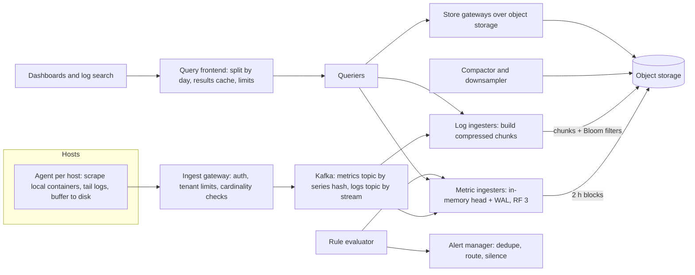

Every other system in the company depends on this one at the worst possible moment. When checkout starts failing at 21:00 on a Friday, five hundred engineers open dashboards at once, every service starts logging stack traces at ten times its normal rate, and the platform that is supposed to explain the outage receives its highest read load and its highest write load in the same minute. If it falls over, the company is debugging blind.

The workload is inverted compared with most products: writes outnumber reads by three orders of magnitude, nothing is updated, and the data is valuable only in aggregate. The capacity unit is not requests per second but *distinct time series*, and one careless label can multiply it by a million. And the platform must be more available than what it monitors, so it cannot share that system's failure modes.

## Requirements

Ask before you draw. The questions that change the design are: how many hosts and containers, how many metrics per container, how long to keep raw and aggregated data, how fresh dashboards must be, and whether logs need full-text search or only filtering.

### Functional

- **Metrics ingestion.** Counters, gauges and histograms with key/value labels (`service`, `endpoint`, `status`, `pod`) from every container, every 10 seconds.
- **Metrics queries.** Range queries aggregated by label ("p99 latency of checkout by endpoint, last hour"), for dashboards and ad-hoc exploration.
- **Alerting.** Tens of thousands of rules evaluated every 30 seconds, routed to on-call with deduplication and silencing.
- **Log ingestion.** Structured log lines with labels (`service`, `pod`, `level`) and a free-text body.
- **Log search.** Filter by labels and time, grep the body, find every line carrying a given `trace_id`, and tail a service live.
- **Retention.** Raw metrics for 15 days; 1-minute rollups for 13 months (to compare with last year's peak). Logs hot for 7 days, retained 90 days for audit.

### Non-functional

| Property | Target | Why this number |
|---|---|---|
| Ingest availability | 99.99%, and never blocks the application | Losing telemetry is bad; slowing checkout to protect telemetry is worse |
| Freshness | Metric visible on a dashboard within 30 s (p99); log line searchable within 60 s | An alert on 5-minute-old data pages people for problems that are already over |
| Dashboard query | p99 under 1 s for a 1-hour panel; under 5 s for 30 days of rollups | Engineers retry slow dashboards, multiplying load during incidents |
| Alert evaluation lag | under 60 s | Alerts are the product; dashboards are the debugger |
| Failure independence | Platform survives the loss of the region or cluster it monitors | "Who monitors the monitor" is a requirement, not a joke |
| Cost | A bounded, known fraction of infrastructure spend | Observability bills grow faster than the fleet if nobody owns them |

## Back-of-envelope estimates

Assume 50,000 hosts running 200,000 containers.

**Metrics ingest.** Each container exposes ~50 series (a handful of metrics, most of them histograms with a dozen buckets). $200{,}000 \times 50 = 10^7$ active series. At one sample per series every 10 seconds, that is $10^7 / 10 = 10^6$ samples per second, flat around the clock. There is no lunchtime peak; there is a deploy peak, which matters later.

**Sample size.** A sample is a timestamp and a float, 16 bytes raw. Time-series codecs in the style of Facebook's published Gorilla design compress regular timestamps and slowly changing values to around 1–2 bytes per sample; assume 2. Raw tier: $10^6 \times 2 \text{ B} = 2$ MB/s, which is $2 \times 86{,}400 \approx 170$ GB/day and ~2.6 TB for 15 days. Small.

**Rollups.** One rollup per series per minute is $10^7 / 60 \approx 167{,}000$ rollups/s. Each stores min, max, sum and count, ~20 bytes compressed, so 3.3 MB/s, ~290 GB/day, and about 110 TB over 13 months. The long-term tier is forty times the raw tier. On triple-replicated SSD at roughly $0.10 per GB-month that is 330 TB and ~$33,000 a month; in object storage at roughly $0.02 per GB-month, stored once (the store handles durability), it is ~$2,200 a month. That single comparison decides that historical blocks live in object storage.

**In-memory head.** Recent data is served from memory. A few KB per active series for labels, index entries and the open chunk (assume 4 KB) gives $10^7 \times 4 \text{ KB} = 40$ GB, plus two hours of samples, $10^7 \times 720 \times 2 \text{ B} \approx 14$ GB. Replicated three times, ~160 GB across the ingester fleet: twenty 32 GB machines with headroom. Memory scales with *series*, not samples, which is why cardinality is the capacity unit.

**Logs.** Assume 5 lines per second per container on average: $2 \times 10^5 \times 5 = 10^6$ lines/s, and 3× that during incidents because errors log stack traces. At 500 bytes per line, 500 MB/s average, $500 \text{ MB} \times 86{,}400 \approx 43$ TB/day raw, up to 1.5 GB/s at incident peak. Logs are 250 times the metrics volume. That ratio is normal and is the first thing to say out loud: the logging tier is where the money goes.

**Ingest buffer.** Agents compress batches roughly 5×, so logs arrive at ~100 MB/s (300 MB/s peak) and metrics at ~20 MB/s. At ~10 MB/s per partition, peak needs 30+ Kafka partitions; provision 128 for consumer parallelism. Twenty-four hours of retention at replication factor 3 is $120 \text{ MB/s} \times 86{,}400 \times 3 \approx 31$ TB of broker disk, and it buys a full day during which any downstream store can be down without losing a byte.

**Reads.** 30,000 alert rules every 30 seconds is 1,000 in-memory evaluations/s: negligible. The dangerous read is the incident: 500 engineers × 20 panels ÷ a 10 s refresh = 1,000 panel queries/s, survivable only with a results cache and per-user limits.

## API design

Ingestion is batched, compressed and asynchronous; the client never waits on storage.

```text
POST /api/v1/push              protobuf + snappy: [{labels, samples:[(ts, value)]}]
                               header: X-Tenant-ID          -> 204, 429 if over tenant limit
POST /api/v1/logs/push         [{labels, entries:[(ts, line)]}]      -> 204, 429
GET  /api/v1/query_range       ?query=&start=&end=&step=30s          -> matrix
GET  /api/v1/logs/query_range  ?query=&start=&end=&limit=&direction=backward
GET  /api/v1/logs/tail         ?query=   (WebSocket, rate-limited)
PUT  /api/v1/rules/{namespace} alert and recording rules (YAML)
```

Queries use a label-matching language. PromQL is the de facto standard for metrics, and a LogQL-style syntax keeps the two consistent:

```text
histogram_quantile(0.99,
  sum by (le, endpoint) (rate(http_request_duration_seconds_bucket{service="checkout"}[5m])))

{service="checkout", level="error"} |= "timeout" | json | trace_id="4bf92f3577b34da6"
```

Two API decisions matter. The tenant header lets the gateway enforce per-team limits on series count and ingest rate, which is the only defence against one team's cardinality bomb taking down everyone's alerts. And `429` is a real answer: the agent buffers and retries, it never blocks the application.

## Data model

A **series** is identified by its metric name plus its sorted label set. The ingester hashes that to a 64-bit `series_id` and keeps an **inverted index** from each label pair to a sorted postings list of series IDs, exactly like a search engine:

```text
series  {__name__="http_requests_total", service="checkout", status="500", pod="co-7f"}  -> id 91
postings  service="checkout" -> [12, 40, 91, 133]
          status="500"       -> [7, 91, 133, 204]
query {service="checkout", status="500"}  = intersect -> [91, 133]
```

Samples live in **chunks**: ~120 samples of one series, compressed. Chunks are grouped into immutable **blocks** covering two hours, each carrying its own index. The compressor merges small blocks into larger ones (2 h → 12 h → 24 h) and writes downsampled rollups for old data.

The compression trick is worth knowing because it explains the 2-byte figure. Timestamps arrive at a near-constant interval, so store the *delta of the delta*, which is almost always zero and costs one bit. Values change slowly, so XOR each float with the previous one; identical values XOR to zero (one bit) and similar values share their leading and trailing zero bits.

```python
def delta_of_delta(timestamps):
    out = [timestamps[0]]               # first timestamp stored in full
    prev_delta = None
    for prev, cur in zip(timestamps, timestamps[1:]):
        delta = cur - prev
        out.append(delta if prev_delta is None else delta - prev_delta)
        prev_delta = delta
    return out

print(delta_of_delta([1000, 1010, 1020, 1030, 1041, 1051]))
# [1000, 10, 0, 0, 1, -1]  -> the zeros encode in 1 bit each
```

**Logs** are grouped into **streams**, one per distinct label set (`{service="checkout", pod="co-7f", level="error"}`). Each stream is a sequence of compressed chunks of lines ordered by time. The index maps labels to streams and streams to chunk references with time ranges; it does *not* index the words in the body. Each chunk carries a small Bloom filter over high-cardinality fields such as `trace_id` and `request_id`.

## High-level design



The agent on each host scrapes its own containers, pushes compressed batches to the gateway, and spools to a bounded local disk buffer when the gateway says `429`, dropping the oldest data when the buffer fills. Metric ingesters consume partitions, append to a write-ahead log, hold the last two hours in memory, and every two hours upload an immutable block to object storage. Recent queries go to ingesters; older ranges go to store gateways that cache block indexes and hot chunks. The query frontend splits a 30-day query into 30 one-day queries and caches each day's result, so the 499th engineer opening the same dashboard costs almost nothing.

The rule evaluator reads only from ingesters for recent windows, so alerting keeps working if object storage or the store gateways are down. That is a deliberate asymmetry: dashboards over last month can degrade, alerts cannot.

```viz
{"type": "system", "scenario": "kafka-partitions", "nodes": 3, "keys": ["series:91", "series:12", "series:40", "series:91", "series:133", "series:12"],
 "title": "Partitioning the ingest stream",
 "caption": "Metrics are keyed by series hash, so every sample of one series lands in one partition and one ingester, which keeps chunks append-only and in order. Adding consumers up to the partition count scales ingestion; a consumer that dies has its partitions reassigned and resumes from the last committed offset."}
```

## Deep dives

### Cardinality is the capacity unit

Memory, index size and query cost all scale with the number of distinct series, and the number of distinct series is the *product* of the distinct values of every label. Consider one innocent histogram:

`http_request_duration_seconds_bucket{service, endpoint, method, status, pod, le}`

With 300 services × 20 endpoints × 2 methods × 5 status codes × 30 pods × 12 buckets, the upper bound is $300 \times 20 \times 2 \times 5 \times 30 \times 12 = 21.6$ million series. Real combinations are sparser, but the order of magnitude is right, and it is more than the whole platform's 10-million-series budget from one metric. Now someone adds `user_id` with a million values and asks why the ingesters are OOM-killing.

The mechanisms that keep it bounded, from cheapest to most intrusive:

1. **Admission limits per tenant and per metric.** The gateway tracks active series per tenant (a HyperLogLog is enough for an estimate) and rejects *new* series over the limit with an explicit error, while continuing to accept samples for existing ones. Existing dashboards keep working; the team that added the label sees the rejection in its own metrics.
2. **Aggregate before storing.** Most dashboards want per-service, not per-pod, latency. Recording rules or agent-side aggregation sum the histogram buckets across pods and drop `pod`, dividing that metric's series by 30. Keep the per-pod version with a 24-hour retention for debugging.
3. **Put high-cardinality identity in logs and traces, not metrics.** Per-user or per-request data belongs in an event store that is priced per event, not per distinct value. *Exemplars* attach a sample trace ID to a histogram bucket, so a latency spike on the dashboard links directly to a slow trace without a `trace_id` label.
4. **Watch churn, not just the total.** Every deploy gives every pod a new name, so a fleet that redeploys daily creates millions of new series a day even if the active count is flat. The in-memory head holds every series seen in its window, so churn inflates memory. Labels that change on every deploy (pod name, container ID, build SHA) are the usual culprits.

Percentiles deserve their own warning: the mean of 30 pods' p99s is not a p99 of anything. Store histograms, sum the buckets across pods, and compute the quantile at query time, as the PromQL example above does; mergeable sketches (t-digest, DDSketch) do the same with bounded error. The [median of a data stream](/practice/find-median-data-stream) problem is the exact-but-unmergeable version of the question.

### The storage engine: append, seal, compact, tier

A relational table with one row per sample fails on arithmetic alone: 10^6 inserts/s is 100 times a Postgres primary's comfortable write rate, with 30+ bytes of row overhead per 2 bytes of payload. A wide-column store can absorb the writes but compresses individual samples poorly and turns "sum 10,000 series over an hour" into a scatter-gather.

The design that works is log-structured and specialised: append to an in-memory head and a WAL, seal and compress chunks, compact immutable blocks and downsample them. That is the LSM pattern with time doing the partitioning. Because data arrives roughly in time order and is never updated, compaction is cheap and retention deletes whole blocks instead of tombstoning rows.

```viz
{"type": "system", "scenario": "lsm-tree",
 "title": "The same shape as an LSM tree",
 "caption": "Writes land in memory backed by a WAL, flush as immutable sorted files, and compact in the background. A time-series store specialises this: each flush is a two-hour block, compaction merges adjacent time ranges, and retention deletes whole files instead of individual rows."}
```

Two consequences to state. **Out-of-order samples** cannot be appended to a sealed block, so accept a bounded window (say, 10 minutes), and reject older or future-dated samples with a per-host counter, which also surfaces broken clocks. **The query path is split by time**: the last two hours come from ingesters (the querier asks all three replicas and deduplicates), older ranges from object storage, which adds tens of milliseconds per request; a 30-day dashboard should read 5-minute rollups, not raw samples.

### Logs: index everything, or index labels and scan

This is the decision that sets the logging bill, so compare both with the numbers.

**Option A, full-text inverted index (Elasticsearch-class).** Every token is indexed and queries of any shape are fast. But indexing a million documents per second takes a large CPU-heavy cluster sized for the 3× incident peak, and stored size including the index is of the same order as the raw data: at 43 TB/day with one replica and 7 days hot, ~600 TB of SSD before the 90-day archive.

**Option B, label index plus compressed chunks in object storage (Loki-class).** Index only the stream labels, compress lines ~8× into chunks, and brute-force scan at query time. Storage is 43 TB / 8 ≈ 5.4 TB/day; 90 days is ~490 TB in object storage, roughly $10,000 a month. Ingest is cheap because there is no per-token work.

The price of B is paid at query time, and whether it is acceptable depends on the query's selectivity:

- "Errors from checkout in the last hour, containing `timeout`": if checkout produces 1% of volume, the label index narrows the scan to $1.8 \text{ TB/hour} \times 1\% = 18$ GB raw (~2 GB compressed). At roughly 1 GB/s of decompress-and-match per core, that is 18 core-seconds, well under a second on 100 query cores.
- "Any line containing this IP address, all services, last 24 hours": 43 TB raw, ~43,000 core-seconds, most of a minute even on 1,000 cores. Slow, and expensive every time it runs.

**Bloom filters close most of the gap for needle queries.** The common needle query is "every line for this `trace_id`". Each chunk stores a Bloom filter of the trace IDs it contains; the querier checks the filter (a few KB, cached) and fetches only chunks that *might* contain the ID. A chunk of 10,000 lines with ~5,000 distinct trace IDs needs about 9.6 bits per ID for a 1% false-positive rate, so ~6 KB per chunk, about 1% of the chunk's compressed size, and it cuts a 24-hour trace lookup from scanning every chunk to scanning the handful that match plus 1% false positives.

```viz
{"type": "system", "scenario": "bloom-filter", "keys": ["trace-4bf9", "trace-a3c1", "trace-77e0", "trace-19d2"],
 "title": "Skipping chunks that cannot contain the trace",
 "caption": "Each chunk's filter answers 'definitely not here' or 'maybe here'. A 'no' is always right, so the querier skips that chunk without fetching it; a 'maybe' costs one fetch that is occasionally wasted. The false-positive rate is set by bits per key, about 10 bits for 1%."}
```

The senior answer is usually B with filters, plus a small full-text index for the few high-value log types that need arbitrary search (security audit logs, for instance), and a habit of turning repeated log queries into metrics. If a team greps for `payment declined` every day, that should be a counter.

## Failure modes

**Incident log flood.** Errors multiply log volume exactly when you need it. Detect: ingest rate per tenant, Kafka consumer lag. Mitigate: Kafka absorbs the burst (24 hours of buffer); per-tenant rate limits shed `DEBUG` and `INFO` before `ERROR`; agents sample repetitive lines ("this message repeated 4,000 times") rather than shipping each copy.

**Cardinality bomb from a deploy.** A new release adds a `request_path` label containing raw URLs with IDs. Detect: active-series count per tenant and per metric, alerting on growth rate. Mitigate: the gateway rejects new series over the tenant limit; the rest of the platform is untouched. The failure is contained to the team that caused it, which is the whole point of per-tenant limits.

**Ingester crash.** Two hours of in-memory data for a set of series is lost from that replica. Mitigate: replication factor 3 across ingesters in different zones, and the WAL replays on restart. Kafka offsets are committed only after the WAL write, so a crash re-delivers rather than loses.

**Query of death.** A regex over a year of raw samples, or a log scan over all services for 30 days, eats every querier. Detect: per-query CPU and bytes scanned. Mitigate: the query frontend enforces per-tenant limits on time range, series touched and bytes scanned, queues fairly across tenants, and kills queries over budget. Dashboards that refresh every 5 seconds over 30 days are rejected at save time.

**Alerting silenced by its own outage.** If ingestion stops, rules evaluate over no data and nothing fires. Detect: a dead man's switch, an alert that is *always* firing and pages when it stops arriving. Mitigate: alert on `absent()` for critical series, and on ingest lag directly.

**The platform shares the outage.** If the metrics stack runs in the same region, on the same Kafka cluster or behind the same DNS as production, a regional failure blinds you while it hurts you. Mitigate: run the platform (or at least alerting and a thin slice of critical dashboards) in a separate failure domain, and monitor the platform itself with a small, independent meta-monitoring stack in another region.

## Senior follow-ups

**Q: "A team wants `user_id` as a metric label so they can see per-user latency. What do you say?"**

No, and I explain the arithmetic rather than the rule: a million users multiplies every series of that metric by up to a million, and the head memory is per series, so it would cost more than the rest of the platform combined. The question they are asking ("is this user having a bad time?") is answered by traces and structured logs, which are priced per event, and exemplars link a latency bucket to specific traces. If they need a per-customer view for a few hundred enterprise customers, a `tier` or `customer` label with bounded values is fine, with a series limit on that metric.

**Q: "Why put Kafka between the agents and the ingesters?"**

It absorbs the 3× incident burst without sizing ingesters for peak; its 24 hours of retention turns a store outage into a delay instead of a loss; and it lets several consumers (ingesters, a security pipeline, a data-lake archiver) read one stream. The cost is ~30 TB of broker disk and one more system to run, so below roughly 50,000 samples/s I would push straight to ingesters with agent-side buffering.

**Q: "How do you compute a fleet-wide p99 across 200 pods?"**

Sum the per-second rate of each histogram bucket across pods, then interpolate the quantile. The error depends on bucket boundaries, so I put buckets densely around the SLO threshold (if the SLO is 300 ms, buckets at 250, 300 and 350 ms matter more than one at 10 s). If boundaries cannot be chosen in advance, a mergeable sketch such as DDSketch gives a relative-error guarantee.

**Q: "Pull or push?"**

Both, at different layers. Pull from the agent to local containers, because a failed scrape is itself a signal ("target down") and discovery is local. Push from the agent to the platform, because a central system scraping 200,000 ephemeral containers across networks is fragile and the agent can buffer during outages. Short-lived batch jobs push directly, because they may finish before a scrape.

**Q: "The logging bill is growing 40% a year while the fleet grows 15%. What do you do?"**

Measure it per team and per log line pattern first; logging cost is always concentrated in a few chatty services. Then, in order: retention by level (debug for 3 days, errors for 30), sampling of high-volume success logs, converting repeated queries into metrics, moving from full-text indexing to label indexing for bulk logs, and charging teams back for their volume so the incentive sits with the people who can change it. A cost that nobody owns grows forever.

## Senior signals

- You treat active series and churn, not requests per second, as the capacity unit, and you enforce limits per tenant so one team cannot take down everyone's alerts.
- You know percentiles do not average, and you design storage (histograms, mergeable sketches) so they can be aggregated correctly.
- You split the query path by time and make alerting depend only on the recent, in-memory tier.
- You compare index-everything and index-labels-and-scan with storage and scan arithmetic, and you name the query shapes each makes slow.
- You put the platform in a different failure domain from production and monitor the monitor with a dead man's switch.
- You name cost as a first-class requirement and know the logging tier dominates it.

## Check yourself

```quiz
- q: >-
    A metric has labels service (300 values), endpoint (20), status (5) and pod (30). An engineer proposes adding a customer_id label with 50,000 values. What is the most accurate objection?
  options: ["It adds 50,000 series, which is fine", "It multiplies that metric's potential series count by up to 50,000, and memory and index cost scale with series count", "It slows down queries but does not affect ingestion", "Labels with numeric values cannot be indexed"]
  answer: 1
  explanation: >-
    Series count is the product of label cardinalities, so a new label multiplies rather than adds. Ingester memory, index size and query cost all scale with distinct series. The tempting "adds 50,000" answer is the mistake that causes cardinality outages.
- q: >-
    Thirty pods each report their own p99 latency. Which approach gives a correct fleet-wide p99?
  options: ["Average the 30 p99 values", "Take the maximum of the 30 p99 values", "Sum the histogram bucket counts across pods, then compute the quantile from the merged histogram", "Take the median of the 30 p99 values"]
  answer: 2
  explanation: >-
    Quantiles are not additive; the mean or median of per-pod p99s is not a p99 of anything. Histograms (or mergeable sketches) can be summed across pods and the quantile computed from the merged distribution. The maximum is an upper-bound heuristic, not the fleet p99.
- q: >-
    Why does the design make alert evaluation read only from the in-memory ingesters rather than from object storage?
  options: ["Object storage cannot store time-series data", "Alerts need only recent windows, and this keeps alerting working when the historical tier is slow or down", "Ingesters have more complete data than object storage", "It is cheaper per query"]
  answer: 1
  explanation: >-
    Alert rules look at the last few minutes, which live in the ingesters. Removing the dependency on store gateways and object storage means a failure in the historical tier degrades dashboards but not paging. Designing the most critical path to have the fewest dependencies is the point.
- q: >-
    Logs are stored as compressed chunks indexed only by labels. Which query becomes cheap once each chunk carries a Bloom filter of trace IDs?
  options: ["Count all error lines across every service for a month", "Find every line for one specific trace_id across all services in the last day", "Full-text search for any word in any line", "Compute p99 latency from log lines"]
  answer: 1
  explanation: >-
    A Bloom filter answers "definitely not here" for most chunks, so the querier fetches only chunks that might contain that trace ID, plus about 1% false positives. It does nothing for aggregate scans or arbitrary words that were not put in the filter.
- q: >-
    The 1-minute rollup tier for 13 months is about 110 TB while raw 15-day data is about 2.6 TB. What is the design consequence?
  options: ["Drop rollups and keep raw data for 13 months instead", "Store historical blocks once in object storage and downsample further for old ranges, because replicated SSD for that tier would cost roughly ten times more", "Shard the rollups across more SSD nodes", "Compress rollups with gzip"]
  answer: 1
  explanation: >-
    The long-term tier dominates storage, so its cost per GB decides the design. Object storage provides durability without triple replication at a fraction of the SSD price, and 5-minute rollups for older ranges shrink it further. Keeping raw data for 13 months would be larger still.
```
