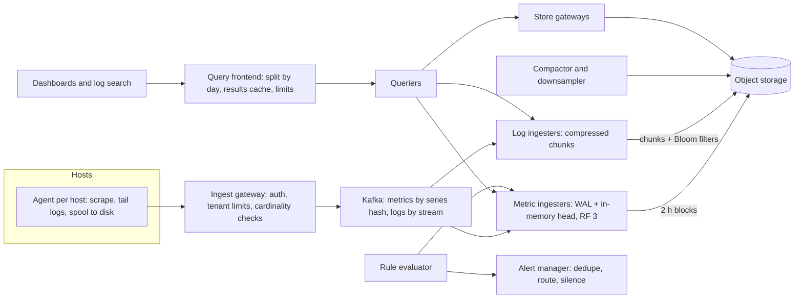

Every other system in the company depends on this one at the worst possible moment. When checkout starts failing at 21:00 on a Friday, five hundred engineers open dashboards at once, every service starts logging stack traces at three times its normal rate, and the platform that is supposed to explain the outage receives its highest read load and its highest write load in the same minute. If it falls over, the company is debugging blind.

The workload is inverted compared with most products: writes outnumber reads by three orders of magnitude, nothing is updated, and the data is valuable only in aggregate. The capacity unit is not requests per second but *distinct time series*, and one careless label can multiply it by a million. And the platform must be more available than what it monitors, so it cannot share that system's failure modes.

## Requirements

Ask before you draw: how many hosts and containers, how many series per container, how long to keep raw and aggregated data, how fresh dashboards must be, and whether logs need full-text search or only filtering.

### Functional

- **Metrics ingestion.** Counters, gauges and histograms with labels (`service`, `endpoint`, `status`, `pod`) from every container, every 10 seconds.
- **Metrics queries.** Range queries aggregated by label ("p99 latency of checkout by endpoint, last hour").
- **Alerting.** 30,000 rules evaluated every 30 seconds, routed to on-call with deduplication and silencing.
- **Logs.** Structured lines with labels (`service`, `pod`, `level`) and a free-text body; filter by labels and time, grep the body, find every line for a `trace_id`, tail live.
- **Retention.** Raw metrics 15 days; rollups 13 months (to compare with last year's peak). Logs hot 7 days, retained 90.

### Non-functional

| Property | Target | Why this number |
|---|---|---|
| Ingest availability | 99.99%, never blocks the application | Slowing checkout to protect telemetry is worse than losing telemetry |
| Freshness | Metric on a dashboard within 30 s (p99); log line searchable within 60 s | An alert on 5-minute-old data pages people for problems already over |
| Dashboard query | p99 under 1 s for a 1-hour panel; under 5 s for 30 days | Engineers retry slow dashboards, multiplying incident load |
| Alert evaluation lag | Under 60 s | Alerts are the product; dashboards are the debugger |
| Failure independence | Survives the loss of the region it monitors | "Who monitors the monitor" is a requirement |
| Cost | A bounded, known fraction of infrastructure spend | Observability bills grow faster than the fleet when nobody owns them |

## Back-of-envelope estimates

Assume 50,000 hosts running 200,000 containers.

| Quantity | Arithmetic | Result |
|---|---|---|
| Active series | 200,000 containers × ~50 series (a few metrics, mostly 12-bucket histograms) | $10^7$ |
| Samples per second | $10^7$ ÷ 10 s | $10^6$/s, flat all day; the peak comes from deploys (new series), not traffic |
| Raw metric storage | $10^6$ × ~2 B per compressed sample × 86,400 s | 173 GB/day, 2.6 TB for 15 days |
| 1-minute rollups | $10^7$ ÷ 60 × 20 B (min, max, sum, count) × 86,400 × 395 days | 114 TB for 13 months; 30 TB if rolled to 5 minutes after 30 days |
| Ingester memory | $10^7$ × ~4 KB (labels, index, open chunk) + $10^7$ × 720 samples × 2 B | 54 GB; 163 GB at replication factor 3, so ~20 ingesters holding ~8 GB each, with room for churn |
| Log lines | 200,000 × 5 lines/s | $10^6$/s average, $3 \times 10^6$/s in an incident |
| Log bytes | $10^6$ × 500 B | 500 MB/s, **43 TB/day**, 1.5 GB/s at incident peak |
| Wire into Kafka | Logs ÷ ~5 (agent compression) + metrics | ~120 MB/s, ~320 MB/s peak; ~10 MB/s per partition means 32+ partitions, so provision 128 for consumer parallelism |
| Kafka disk | 120 MB/s × 86,400 × 3 replicas | 31 TB for a 24-hour buffer: ~12 brokers at ~4 TB each with headroom |
| Log ingest CPU | 1.5 GB/s peak × 3 replicas ÷ 276 MB/s per core (zlib level 1, measured in CPython) | ~16 cores: log ingesters are sized by open-chunk memory, not CPU |
| Reads | 500 engineers × 20 panels ÷ 10 s refresh; 30,000 rules ÷ 30 s | 1,000 panel queries/s in an incident; 1,000 rule evaluations/s always |

**Consequences.** Logs are 250 times the metric bytes, so the logging tier is where the money goes. Memory scales with *series*, not samples, so cardinality is the capacity unit. The rollup tier is 40 times the raw tier, and on triple-replicated SSD at an assumed ~\$0.10 per GB-month it would cost ~\$34,000 a month against ~\$2,300 in object storage at an assumed ~\$0.02 (list prices vary by provider, region and tier, but the ratio of roughly 15× survives), so historical blocks live in object storage.

## API

Ingestion is batched, compressed and asynchronous; the client never waits on storage.

```text
POST /api/v1/push              protobuf + snappy: [{labels, samples:[(ts, value)]}]
                               header: X-Tenant-ID          -> 204, 429 if over tenant limit
POST /api/v1/logs/push         [{labels, entries:[(ts, line)]}]      -> 204, 429
GET  /api/v1/query_range       ?query=&start=&end=&step=30s          -> matrix
GET  /api/v1/logs/query_range  ?query=&start=&end=&limit=&direction=backward
GET  /api/v1/logs/tail         ?query=   (WebSocket, rate-limited)
PUT  /api/v1/rules/{namespace} alert and recording rules (YAML)
```

```text
histogram_quantile(0.99,
  sum by (le, endpoint) (rate(http_request_duration_seconds_bucket{service="checkout"}[5m])))

{service="checkout", level="error"} |= "timeout" | json | trace_id="4bf92f3577b34da6"
```

The tenant header lets the gateway enforce per-team limits on series and ingest rate, the only defence against one team's cardinality bomb taking down everyone's alerts. And `429` is a real answer: the agent spools and retries; it never blocks the application.

## Data model

A **series** is a metric name plus its sorted label set, hashed to a 64-bit `series_id`. The ingester keeps an **inverted index** from each label pair to a sorted postings list, exactly like a search engine:

```text
series    {__name__="http_requests_total", service="checkout", status="500", pod="co-7f"}  -> id 91
postings  service="checkout" -> [12, 40, 91, 133]
          status="500"       -> [7, 91, 133, 204]
query {service="checkout", status="500"}  = intersect -> [91, 133]
```

Samples live in **chunks** of ~120 samples of one series (Prometheus's default target; 20 minutes at 10 s), grouped into immutable two-hour **blocks**, each with its own index. The partition key is the series hash, because every query reads a series' samples in time order and every write appends to one series; keying by time would send every sample of a two-hour window to one shard.

**Under the hood: why 2 bytes a sample is an assumption, not a law.** The Gorilla encoding stores each timestamp as a delta of deltas (a regular 10 s scrape is `0`, one bit) and each value as the XOR with the previous one (unchanged is one bit; similar floats share leading and trailing zero bits). Implementing that bit accounting over 720 synthetic samples gave:

| Series shape | Bytes per sample |
|---|---|
| Constant gauge (most high histogram buckets) | 0.26 |
| Request counter, regular scrape | 2.08 |
| Same counter, 1 scrape in 5 off by ±1 s | 2.51 |
| Noisy full-precision float (a latency gauge) | 7.26 |

Facebook's [Gorilla paper](https://www.vldb.org/pvldb/vol8/p1816-teller.pdf) reports about 1.37 bytes per point averaged over its production mix, with about 96% of timestamps and 51% of values compressed to a single bit. Your mix decides your storage bill: jittery scrapes and noisy gauges cost several times what constant counters do.

**Logs** are grouped into **streams**, one per distinct label set. Each stream is a sequence of compressed chunks of lines, and the index maps labels to streams and streams to chunk references with time ranges; it does *not* index words in the body. Each chunk carries a small Bloom filter over high-cardinality fields such as `trace_id`.

## High-level design



The agent pushes compressed batches and spools to a bounded local disk buffer when the gateway says `429`, dropping the oldest data when the buffer fills. Metric ingesters consume [Kafka](/learn/big-data/streaming/kafka-internals), append to a write-ahead log, hold two hours in memory and upload immutable blocks. The query frontend splits a 30-day query into 30 one-day queries and caches each day's result, so the 499th engineer opening the same dashboard costs almost nothing. The rule evaluator reads only from ingesters, so alerting survives an outage of object storage: dashboards over last month may degrade, alerts may not.

```viz
{"type": "system", "scenario": "kafka-partitions", "nodes": 3, "keys": ["series:91", "series:12", "series:40", "series:91", "series:133", "series:12"],
 "title": "Partitioning the ingest stream",
 "caption": "Metrics are keyed by series hash, so every sample of one series lands in one partition and one ingester, which keeps chunks append-only and in order. A consumer that dies has its partitions reassigned and resumes from the last committed offset."}
```

```viz
{"type": "system", "scenario": "backpressure", "requests": 8,
 "title": "429 is backpressure, not an error",
 "caption": "When the gateway or a tenant limit refuses a batch, the agent keeps it in a bounded disk spool and retries later. The application never waits; if the spool fills, the oldest telemetry is dropped first."}
```

## Deep dive: one sample, scrape to object storage

Follow one sample of `http_requests_total{service="checkout", status="500", pod="co-7f"}` scraped at 21:00:00.000.

| t | Where | What happens | What the time depends on |
|---|---|---|---|
| 0 | Agent | Scrapes the container's `/metrics`; the sample is stamped 21:00:00.000 | 10 s interval; a 50-series scrape is sub-millisecond |
| +0–1,000 ms | Agent | Joins a batch flushed every 1 s or at 1 MB, snappy-compressed | The batch window (an assumption; it dominates freshness) |
| +~2 ms | Gateway | Auth, tenant lookup, "is this series already active?" against an in-memory set, over-limit new series rejected | Same-zone round trip ~0.5 ms |
| +~5–10 ms | Kafka | Produced with `acks=all` to partition `hash(series) mod 128`; acknowledged once in-sync replicas have it | Follower fetch round trips, order of milliseconds in one region |
| +~50–200 ms | Ingester (×3) | Consumer poll, WAL append (fsyncs batched), append to the series' open chunk, then commit the offset | Poll interval and fsync batching |
| ≈1.2 s | Queryable | A dashboard now sees it; the 30 s p99 freshness target leaves ~28 s of slack for consumer lag | Consumer lag is therefore an alert |
| ≤ 30 s | Rule evaluator | Evaluates `rate(...[5m])` over the head; an alert with `for: 2m` fires 2–2.5 minutes after the expression first becomes true | Evaluation interval plus `for:` duration |
| 21:20 | Head | The chunk seals at 120 samples and is compressed | Samples per chunk |
| ~23:00–24:00 | Block | The 21:00–23:00 window is cut into an immutable block and uploaded with its index | Block range plus an out-of-order grace period |
| Next day | Compactor | Merged into a 24-hour block; downsampled once old enough | Compaction schedule |

That is the [LSM pattern](/learn/advanced-data-structures/log-structured-and-disk-structures/lsm-trees-and-sstables) with time as the partitioning: append to memory backed by a WAL, flush immutable files, compact in the background, and delete whole blocks at retention instead of tombstoning rows.

```viz
{"type": "system", "scenario": "lsm-tree",
 "title": "The same shape as an LSM tree",
 "caption": "Writes land in memory backed by a WAL, flush as immutable sorted files, and compact in the background. A time-series store specialises this: each flush is a two-hour block, compaction merges adjacent time ranges, and retention deletes whole files."}
```

### The dashboard query, and a late sample

`sum by (le, endpoint) (rate(bucket{service="checkout"}[5m]))` over one hour touches every checkout bucket series: 20 endpoints × 2 methods × 5 statuses × 30 pods × 12 buckets = 72,000 series × 360 samples = 26 million samples. The querier intersects postings, asks all three ingester replicas and deduplicates, then decodes. At an order of 10–100 million decoded samples per second per core (it depends on the engine and encoding), that is 0.3–3 core-seconds per refresh, times 500 engineers. A **recording rule** that precomputes the sum every 30 s stores 20 × 12 = 240 series, and the panel then reads 86,400 samples. Precompute every dashboard that incidents depend on.

**The edge case.** The gateway was down for 15 minutes; agents spooled and now replay. The ingester accepts samples up to 10 minutes older than its newest for a series, so the oldest 5 minutes are rejected as out of order. Size the out-of-order window to the spool, or accept the gap, and count rejections per host, which also exposes broken clocks.

## Deep dive: cardinality and honest downsampling

### Cardinality is multiplicative

`http_request_duration_seconds_bucket{service, endpoint, method, status, pod, le}` has an upper bound of $300 \times 20 \times 2 \times 5 \times 30 \times 12 = 21.6$ million series: more than the whole platform's 10-million budget from one metric. Add `user_id` with a million values and the bound multiplies by a million. Controls, cheapest first:

1. **Admission limits per tenant and metric.** The gateway rejects *new* series over the limit with an explicit error and keeps accepting samples for existing ones, so dashboards keep working and the failure lands on the team that caused it.
2. **Aggregate before storing.** Summing buckets across pods and dropping `pod` divides the bound by 30, to 720,000. Keep per-pod data for 24 hours for debugging.
3. **Put identity in logs and traces**, priced per event, not per distinct value ([observability](/learn/system-design/building-blocks/observability)). *Exemplars* attach a trace ID to a histogram bucket, so a latency spike links to a slow trace without a `trace_id` label.
4. **Watch churn.** Pod names change on every deploy, so a full fleet redeploy inside the two-hour head window holds both generations: $2 \times 10^7$ series and ~80 GB instead of 40 GB, with the active count on the dashboard unchanged.

### Downsampling, traced

A queue-depth gauge scraped every 10 s from 21:00 to 21:05; four scrapes failed in minute 21:02:

| Minute | Samples | min | max | sum | count | Average |
|---|---|---|---|---|---|---|
| 21:00 | 12 15 14 18 16 13 | 12 | 18 | 88 | 6 | 14.7 |
| 21:01 | 17 22 30 41 38 35 | 17 | 41 | 183 | 6 | 30.5 |
| 21:02 | 90 120 | 90 | 120 | 210 | 2 | 105.0 |
| 21:03 | 60 44 31 25 20 18 | 18 | 60 | 198 | 6 | 33.0 |
| 21:04 | 16 15 15 14 13 12 | 12 | 16 | 85 | 6 | 14.2 |
| **5-minute rollup** | | **12** | **120** | **764** | **26** | **29.4** |

The 5-minute row is built from the 1-minute rows, not the raw samples: min of mins, max of maxes, sum of sums, count of counts, and the average is sum ÷ count = 29.4. The average of the five averages is 39.5, a third too high, because the two-sample minute weighs as much as the full ones. Store the four components and every level rolls up exactly. Counters need a reset-aware increase per window instead, or a restart looks like a negative rate.

**Percentiles do not roll up at all.** Pod A serves 9,000 requests with p99 69 ms; pod B, degraded, serves 1,000 with p99 520 ms. The mean of the p99s is 295 ms, traffic-weighted 114 ms, and the true fleet p99 is 463 ms. Summing the two pods' histogram buckets and interpolating inside the 400–500 ms bucket gives 484 ms: right to within the bucket width. Store histograms (or mergeable sketches such as DDSketch), sum buckets, and compute the quantile last. The [median of a data stream](/practice/find-median-data-stream) problem is the exact-but-unmergeable version.

One more surprise: a 1-minute rollup (20 bytes) is *larger* than the six raw samples it replaces (~12 bytes). Rollups buy query speed and long retention, not compression, which is why the 13-month tier rolls again to 5 minutes after 30 days (114 TB down to 30 TB).

```exercise
id: downsample-rollup
title: Downsample samples into rollups
prompt: |
  Implement `rollup(samples, step)`. `samples` is a list of `[ts, value]` pairs
  (integer seconds, numeric value) in any order. Each sample belongs to the
  window starting at `ts - ts % step`, so a sample exactly on a multiple of
  `step` opens a new window.

  Return one row `[window_start, min, max, sum, count]` per window that has at
  least one sample, sorted by `window_start`. Windows with no samples are
  omitted, not zero-filled. Return `[]` for no samples.
languages: [python, javascript]
entry: rollup
starter:
  python: |
    def rollup(samples, step):
        # your code here
        return []
  javascript: |
    function rollup(samples, step) {
      // your code here
      return [];
    }
tests:
  - args: [[[0, 5], [10, 7], [20, 3], [60, 4], [70, 10]], 60]
    expected: [[0, 3, 7, 15, 3], [60, 4, 10, 14, 2]]
    label: two windows
  - args: [[[70, 10], [0, 5], [60, 4], [20, 3], [10, 7]], 60]
    expected: [[0, 3, 7, 15, 3], [60, 4, 10, 14, 2]]
    label: unsorted input
  - args: [[[59, 1], [60, 2], [119, 3], [120, 4]], 60]
    expected: [[0, 1, 1, 1, 1], [60, 2, 3, 5, 2], [120, 4, 4, 4, 1]]
    label: samples on window boundaries
  - args: [[], 60]
    expected: []
    label: no samples
  - args: [[[0, 1], [300, 2]], 60]
    expected: [[0, 1, 1, 1, 1], [300, 2, 2, 2, 1]]
    label: gaps are omitted
  - args: [[[125, 4], [61, 3], [179, 9]], 60]
    expected: [[60, 3, 3, 3, 1], [120, 4, 9, 13, 2]]
    hidden: true
  - args: [[[0, -3], [100, 2.5], [200, -0.5], [299, 1]], 300]
    expected: [[0, -3, 2.5, 0, 4]]
    hidden: true
hints:
  - "Key a dictionary by window start and keep [start, min, max, sum, count] per window."
  - "Sort the window starts at the end; the input order must not matter."
```

## Deep dive: logs, index everything or index labels and scan

This decision sets the logging bill. Synthetic 230-byte log lines with a random 64-bit trace ID compressed 4.5× with zlib level 1 and 6.3× at level 6 (measured); decompression ran at 0.9 GB/s and substring search at 2.2 GB/s on one core, so ~0.64 GB/s per core for decompress-and-grep.

**Option A, full-text inverted index (Elasticsearch-class).** Any query shape is fast, but indexing a million documents a second is a large CPU-heavy cluster sized for the 3× peak, and the index is of the order of the raw data: 43 TB/day × 7 days × 2 copies ≈ 600 TB of SSD before the archive.

**Option B, label index plus compressed chunks in object storage (Loki-class).** At ~6× compression, 7.2 TB/day, 648 TB for 90 days, ~\$13,000 a month in object storage; ingest does no per-token work. The price is paid per query and depends on selectivity:

- "Checkout errors containing `timeout`, last hour": checkout is 1% of 1.8 TB/hour = 18 GB raw, 28 core-seconds, **0.3 s on 100 cores**.
- "This IP, all services, 24 hours": 43 TB, 67,000 core-seconds, **over a minute on 1,000 cores**, every time it runs.

### Bloom filters for needle queries

A [Bloom filter](/learn/advanced-data-structures/probabilistic-structures/bloom-filters) per chunk makes "every line for this `trace_id`" affordable. A chunk of 10,000 lines (5 MB raw, ~830 KB compressed) holds ~5,000 distinct trace IDs. For a 1% false-positive rate:

$$m = -\frac{n \ln p}{(\ln 2)^2} = \frac{5{,}000 \times 4.605}{0.4805} = 47{,}925 \text{ bits} \approx 5.9 \text{ KB}, \qquad k = \frac{m}{n}\ln 2 = 6.6 \to 7$$

That is 0.7% of the chunk. Be honest about the whole-day needle query, though: $10^6$ lines/s is 8.6 million chunks a day, so checking every filter reads ~52 GB of filters, and 1% false positives still fetch 86,400 chunks (~72 GB). That beats scanning 7.2 TB by two orders of magnitude but is not free; narrowing by a `service` label first, or 14.4 bits per key for 0.1%, cuts it by another 10×.

```viz
{"type": "system", "scenario": "bloom-filter", "keys": ["trace-4bf9", "trace-a3c1", "trace-77e0", "trace-19d2"],
 "title": "Skipping chunks that cannot contain the trace",
 "caption": "Each chunk's filter answers 'definitely not here' or 'maybe here'. A 'no' is always right, so the querier skips that chunk; a 'maybe' costs one fetch that is occasionally wasted. About 10 bits per key gives 1%."}
```

The usual senior answer is B with filters, a small full-text index for the few log types that need arbitrary search (security audit), and a habit of turning repeated log queries into metrics: a team grepping for `payment declined` every day needs a counter.

## Failure modes

| Failure | Symptom | Diagnosis | Fix |
|---|---|---|---|
| Incident log flood | Log search lags minutes behind; Kafka lag climbs | Ingest rate per tenant 3× normal, mostly stack traces | Kafka absorbs it (24 h buffer); per-tenant limits shed `DEBUG`/`INFO` before `ERROR`; agents collapse repeats ("repeated 4,000 times") |
| Cardinality bomb from a deploy | Ingester memory climbs, then OOM kills | Active series per tenant and metric jumps; a new label with raw URLs or IDs | Gateway rejects new series over the tenant limit; everyone else is untouched |
| Ingester crash | A gap in one replica's recent data | Pod restart; WAL replay time in logs | RF 3 across zones, WAL replay, Kafka offsets committed only after the WAL write |
| Query of death | Every querier at 100% CPU; dashboards time out | Per-query bytes scanned and series touched; one regex over a year | Frontend limits on range, series and bytes per tenant; fair queueing; kill over budget; reject 5 s refresh on 30-day panels at save time |
| Alerting silenced by its own outage | No alerts during an outage | Rules evaluated over no data return nothing | A dead man's switch that pages when it *stops*; `absent()` alerts; alert on ingest lag |
| Platform shares the outage | Dashboards die with production | Same region, Kafka or DNS as production | Alerting and critical dashboards in a separate failure domain; a small meta-monitoring stack elsewhere |
| Spool replay rejected | A 5-minute hole after a gateway outage | Out-of-order rejections spike on reconnect | Out-of-order window sized to the agent spool |

## Trade-offs: what we rejected

| Decision | Chosen | Rejected | Why here | What would flip it |
|---|---|---|---|---|
| Metric store | Append-only TSDB, blocks in object storage | One row per sample in Postgres or a wide-column store | $10^6$ inserts/s with 30+ B of row overhead per 2 B of payload | A few thousand series with SQL joins |
| Log index | Labels + chunks + Bloom filters | Full-text index for all logs | ~\$13k/month vs ~600 TB of SSD | Most queries are arbitrary-word searches over everything |
| Ingest buffer | Kafka, 24 h | Agents push straight to ingesters | Absorbs 3× bursts; outage becomes delay | Under ~50,000 samples/s: agent spooling is enough |
| Percentiles | Histograms or sketches, quantile at query time | Per-pod p99 gauges | p99s cannot be averaged (295 ms vs a true 463 ms) | Only per-instance views ever needed |
| Alert source | In-memory ingesters only | The full query path | Paging survives an object-store outage | Alerts over long ranges (use recording rules instead) |
| Collection | Pull locally, push to the platform | Central scraping of 200,000 containers | A failed local scrape is a signal; the agent buffers | A small static fleet |

## At 10× and 100×

**10× (2 million containers):** $10^8$ series and $10^7$ samples/s; head memory 1.6 TB at RF 3, ~200 ingesters, so the hash ring and per-tenant shuffle-sharding (each tenant on a subset of ingesters) matter more than the storage format. Logs reach 430 TB/day: full-text indexing of bulk logs becomes unaffordable, and sampling of success logs becomes policy.

**100×:** $10^9$ series will not be queried as raw series. Aggregate at ingest (a streaming aggregation tier that keeps only the rolled-up series most dashboards read), keep per-pod data for hours, federate per region with a thin global view, and treat logs as mostly structured events feeding metrics, with raw lines sampled.

## What real companies describe

- **Facebook's Gorilla paper** describes an in-memory time-series cache with delta-of-delta timestamps and XOR values, at about 1.37 bytes per point, acting as a write-through cache of the most recent 26 hours in front of an older disk-based store: the head-and-blocks split used here.
- **Netflix** has publicly described **Atlas**, its open-source system for dimensional time-series data, which [its documentation](https://netflix.github.io/atlas-docs/overview/) says keeps the most recent hours in memory and rolls older data up into S3.
- **Uber** has publicly described **M3**, its open-source metrics platform, including an aggregation tier that downsamples at ingest.
- **Prometheus** documents the two-hour block and the WAL; **Thanos, Cortex and Grafana Mimir** move those blocks to object storage behind a query frontend that splits long queries (Mimir's default split is 24 hours) and caches the results; **Grafana Loki** documents label-only indexing with chunks in object storage.

Treat these as design lineages; the numbers in this lesson are assumptions for a 200,000-container fleet, not any company's figures.

## Interviewer follow-ups

**"A team wants `user_id` as a label for per-user latency."** Model answer: no, with arithmetic: a million users multiplies every series of the metric by up to a million and head memory is per series. Per-user questions belong to traces and structured logs; exemplars link a latency bucket to traces; a bounded `tier` label with a series limit is fine. Common wrong answer: "it adds a million series, we can absorb that", which confuses adding with multiplying.

**"Why Kafka between agents and ingesters?"** Model answer: it absorbs the 3× incident burst without sizing ingesters for peak, turns a store outage into delay rather than loss for 24 hours, and lets a security pipeline and an archiver read the same stream; it costs 31 TB of broker disk and a system to run, so below ~50,000 samples/s I would push directly. Common wrong answer: "Kafka makes it exactly-once", when the WAL-then-commit order is what prevents loss.

**"How do you compute a fleet-wide p99 across 200 pods?"** Model answer: sum per-bucket rates across pods, then interpolate; the error is bounded by bucket width, so put buckets densely around the SLO threshold (250, 300, 350 ms for a 300 ms SLO), or use DDSketch for a relative-error guarantee. Common wrong answer: average the pods' p99s.

**"Dashboards are slow during every incident."** Model answer: check the query frontend's cache hit rate and the series each panel touches; the checkout panel reads 26 million samples per refresh, and a recording rule reduces it to 86,400. Then per-tenant query limits and a minimum refresh interval. Common wrong answer: add queriers, which multiplies load on ingesters.

**"The logging bill grows 40% a year while the fleet grows 15%."** Model answer: attribute cost per team and per log pattern (it is always concentrated), then retention by level, sampling of success logs, repeated queries turned into metrics, label-only indexing for bulk logs, and chargeback. Common wrong answer: "compress harder", which moves the bill by tens of percent, not multiples.

## What mid-level engineers get wrong

- Adding an unbounded label (user, request path, container ID) and discovering cardinality from an OOM kill.
- Averaging per-pod p99s, or averaging averages in rollups; both give numbers that describe nothing.
- Alerting through the same query path, region and Kafka cluster as production, so the pager goes quiet exactly when it matters.
- Indexing every log token because search "must be fast", then paying for 600 TB of SSD to grep a few services.
- Sizing ingesters by samples per second instead of active series and churn.
- Letting dashboards query 30 days of raw samples instead of rollups and recording rules.

## Senior signals

- You treat active series and churn as the capacity unit and enforce limits per tenant.
- You trace a sample end to end and know which step sets freshness (the batch window) and which sets alert latency (evaluation interval plus `for:`).
- You store min, max, sum and count so rollups compose, and histograms so percentiles merge.
- You compare index-everything with index-labels-and-scan using storage and scan arithmetic, and size the Bloom filters that make needle queries affordable.
- You put alerting on the smallest dependency set and in a different failure domain, and watch it with a dead man's switch.
- You name cost as a requirement and know the logging tier dominates it.

## Check yourself

```quiz
- q: >-
    A metric has labels service (300 values), endpoint (20), status (5) and pod (30). An engineer proposes adding a customer_id label with 50,000 values. What is the most accurate objection?
  options: ["It slows down queries but does not affect ingestion", "It adds 50,000 series, which the platform can absorb", "Labels with numeric values cannot be indexed by the TSDB", "It multiplies the metric's series count by up to 50,000"]
  answer: 3
  explanation: >-
    Series count is the product of label cardinalities, so a new label multiplies rather than adds. Ingester memory, index size and query cost all scale with distinct series. The tempting "adds 50,000" answer is the mistake that causes cardinality outages.
- q: >-
    Pod A serves 9,000 requests with p99 69 ms and pod B serves 1,000 with p99 520 ms. Which method gives a fleet p99 close to the true 463 ms?
  options: ["Sum both pods' histogram buckets, then interpolate", "Weight the p99s by traffic, which gives about 114 ms", "Average the two p99 values, which gives about 295 ms", "Take the larger p99, since the tail is set by the slow pod"]
  answer: 0
  explanation: >-
    Quantiles are not additive, so any average of per-pod p99s describes nothing. Summing bucket counts gives the merged distribution; interpolating in the 400–500 ms bucket gives about 484 ms, within one bucket width of the truth. The maximum is an upper bound heuristic, here 57 ms too high.
- q: >-
    Five 1-minute rollups have averages 14.7, 30.5, 105, 33 and 14.2, but the 105 minute has only 2 samples while the others have 6. What should the 5-minute average be built from?
  options: ["The maximum of the maxima divided by the sample count", "The median of the five averages, to damp the outlier", "The sum of sums divided by the sum of counts: 29.4", "The mean of the five averages, which is about 39.5"]
  answer: 2
  explanation: >-
    Averages of averages weight a two-sample minute like a six-sample one. Storing sum and count per window lets every level roll up exactly: 764 over 26 samples is 29.4. The median discards information rather than weighting it correctly.
- q: >-
    A sample is scraped at 21:00:00. Which step contributes most to the time before a dashboard can see it, in the traced design?
  options: ["The WAL fsync on the ingester before the offset commit", "The agent's one-second batching window before pushing", "The Kafka produce with acks=all to three replicas", "The two-hour block upload to object storage"]
  answer: 1
  explanation: >-
    The batch window costs up to a second; the gateway, Kafka acknowledgement and WAL append are milliseconds to a few hundred milliseconds. Recent samples are served from the ingester's head, so the block upload hours later does not affect visibility.
- q: >-
    A needle query looks for one trace_id across all services for 24 hours, with per-chunk Bloom filters at 1% false positives over 8.6 million chunks. What is the realistic cost?
  options: ["Nothing beyond the label index, which stores trace IDs", "~52 GB of filters plus ~86,000 false-positive chunks", "One chunk fetch, because the filter points to the chunk", "A full scan of 7.2 TB, because filters cannot skip chunks"]
  answer: 1
  explanation: >-
    A Bloom filter only answers per chunk, so every chunk's filter must be checked, and 1% of 8.6 million chunks are wasted fetches. That is roughly 100 times cheaper than scanning everything, and narrowing by a service label or a lower false-positive rate cuts it further. Filters do not point to locations.
- q: >-
    Why does the rule evaluator read only from the in-memory ingesters rather than through the full query path?
  options: ["Alerts read recent data, so paging survives a history outage", "Reading from memory is cheaper per query than object storage", "Ingesters hold more complete data than the object store", "Object storage cannot hold time-series data in queryable form"]
  answer: 0
  explanation: >-
    Alert rules look at the last few minutes, which live in the ingesters. Removing the dependency on store gateways and object storage means a failure in the historical tier degrades dashboards but not paging. The cheaper query is a side effect, not the reason.
```
