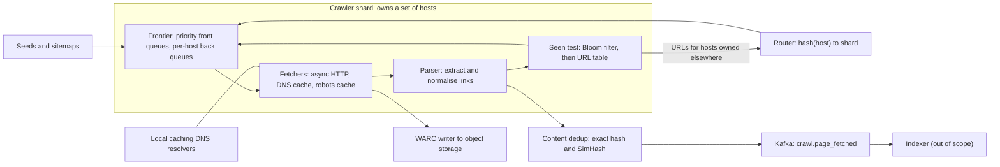

A crawler is [breadth-first search](/learn/data-structures/graphs/breadth-first-search) over a graph you cannot see, with tens of billions of nodes, edges that point at servers you do not own, and nodes that actively fight back. The textbook version fits in ten lines: pop a URL, fetch it, push its links, keep a visited set. Every one of those lines breaks at scale. The queue does not fit in memory. The visited set has ten billion entries. "Fetch it" means opening connections to servers whose owners will block you, or worse, fall over, if you send them two thousand requests a second because their links happened to be at the front of your queue. And some sites generate infinite URLs on purpose or by accident, so a naive crawler spends its whole budget on one calendar widget.

The interviewer is testing whether you can see that the interesting constraint is not bandwidth or storage, which are modest, but *politeness*: the per-host rate limit that makes throughput a scheduling problem across millions of hosts.

## Requirements

### Functional

- Start from seed URLs and sitemaps; fetch HTML pages over HTTP(S); extract and follow links.
- Respect `robots.txt` (allow/disallow rules and crawl delay) and per-host rate limits.
- Store every fetched page (raw bytes plus metadata) for the downstream indexer.
- Detect duplicate URLs (the same page under different spellings) and duplicate or near-duplicate content.
- Recrawl known pages on a schedule that tracks how often they change.
- Out of scope unless asked: images and video, rendering JavaScript (discussed in follow-ups), the indexer itself.

### Non-functional

| Property | Target |
|---|---|
| Throughput | 5 billion page fetches per month (new pages plus refreshes) |
| Politeness | At most one connection per host, about one request per second per host unless `robots.txt` or an agreement says otherwise |
| Freshness | Important, fast-changing pages refreshed within hours; the long tail within weeks |
| Robustness | Survives spider traps, malformed HTML, slow and hostile servers, and machine failures without losing the frontier |
| Extensibility | New content types and processing steps without redesigning the fetch loop |

## Back-of-envelope estimates

**Fetch rate.** $5 \times 10^9$ pages / $2.6 \times 10^6$ s per month ≈ 1,900 pages/s. Call it 2,000/s. Unlike user traffic there is no daily peak, because you choose when to crawl; provision for 3,000/s so the crawler can catch up after an outage.

**Bandwidth.** Assume ~100 KB per page after decompression (the median HTML document is smaller; the mean is dragged up by large pages). $2{,}000 \times 100$ KB = 200 MB/s = 1.6 Gbps. Most servers send gzip, so the wire carries perhaps a third of that. A modest number spread over a fleet; bandwidth is not the design.

**Storage.** $5 \times 10^9 \times 100$ KB = 500 TB/month raw; HTML compresses ~5×, so ~100 TB/month. Many refetches find the page unchanged, so storing a new copy only when the content hash changes cuts this substantially. Object storage, a few PB over some years. Not the design either.

**Concurrency.** By Little's law, in-flight fetches = rate × latency. A fetch (DNS, TCP and TLS handshakes, time to first byte, transfer) averages around a second, with a long tail of slow servers up to a 30-second deadline. $2{,}000 \times 1$ s = 2,000 concurrent fetches on average; budget 10,000 for the tail. With asynchronous I/O one process holds ~1,000 connections, so 10–20 fetcher machines.

**Politeness arithmetic, the number that shapes everything.** At one request per second per host, 2,000 pages/s requires at least 2,000 *distinct hosts* in rotation every second (many more once slow hosts earn longer delays), and a frontier holding URLs for far more hosts than that so there is always a host whose delay has expired. It also bounds a single site: a site with 100 million pages at 1 page/s takes $10^8$ s, about 3.2 years, to crawl once. Politeness, not hardware, decides how fresh a big site can be.

**Link discovery.** ~50 outlinks per page means $2{,}000 \times 50 = 100{,}000$ URLs/s to normalise, filter and test against the seen set.

**Seen set.** Suppose 10 billion URLs are known (discovered, not all crawled). An exact set of 64-bit fingerprints is $10^{10} \times 8$ B = 80 GB, which fits in memory sharded across a few machines, or on SSD. A Bloom filter at a 1% false-positive rate needs ~9.6 bits per URL: $10^{10} \times 9.6 / 8 \approx 12$ GB. The birthday bound says 64-bit fingerprints on $10^{10}$ URLs produce about $n^2 / 2^{65} \approx 3$ collisions: three URLs never crawled, an acceptable price.

**Parsing.** ~5–10 ms of CPU to parse a page and extract links: $2{,}000 \times 10$ ms = 20 cores. Cheap.

The conclusion to say out loud: hardware is modest (tens of machines); the design problem is the scheduler that keeps 2,000+ hosts busy without ever being rude to one of them, and the dedup that keeps 100,000 discovered URLs a second from turning into repeated work.

## API design

A crawler has no end-user API; its contracts are internal. Name them anyway, because they are the seams between components.

```text
Control plane (operators)
POST /v1/seeds                  {urls:[...], priority}                 -> 202
GET  /v1/urls/{fingerprint}     -> {url, last_fetch, status, next_fetch_at, content_hash}
PUT  /v1/hosts/{host}/policy    {max_rps, blocked, url_budget}         -> 200

Frontier (per shard, internal RPC)
enqueue(urls[], source_url, depth)          batched; routed to the shard that owns each host
lease(fetcher_id, n) -> [(url, lease_id, deadline)]
complete(lease_id, result)                  status, fetch_ms, content_hash, etag

Output contract (Kafka topic crawl.page_fetched)
{url, final_url, status, fetched_at, content_hash, simhash, blob_ref, outlink_count}
```

`lease` rather than `pop` is the important choice: a fetcher that dies holding URLs does not lose them; the lease expires and they return to the frontier.

## Data model

URLs and hosts are sharded by **host**, for reasons the deep dive makes clear.

```text
url      (shard = hash(host))
  url_fp          u64   primary key, fingerprint of the normalised URL
  url             text
  host            text
  first_seen, last_fetched, last_changed, next_fetch_at   timestamps
  fetch_interval  seconds, adapted on every fetch
  priority        float, from inbound links and change rate
  last_status, content_hash, etag, last_modified

host     (same shard)
  host            primary key
  ips, dns_expires_at
  robots_rules, robots_fetched_at, crawl_delay
  next_allowed_at, consecutive_errors, url_budget

content  object storage, WARC files of ~1 GB (many pages appended per file)
  index: content_hash -> (warc_file, offset, length)
```

WARC is the standard web-archive container format; appending many compressed records to large files avoids billions of tiny objects, which object stores handle poorly and bill per request.

## High-level design



Each shard owns a set of hosts, assigned by [consistent hashing](/learn/system-design/distributed-systems/partitioning-and-rebalancing) on the host name. Everything that concerns a host (its queue, its politeness clock, its `robots.txt`, its URL table) lives on one shard, so no global coordination is needed to be polite. The parser sends links for hosts owned by other shards through a router in batches; most links on a page point to the same host, so most discovered URLs never leave the shard.

The crawl is a BFS, and the visited set is what stops it looping. Watch the queue and the visited set on a tiny web graph where E links back to the seed:

```viz
{"type": "graph", "algorithm": "bfs", "directed": true, "start": "A",
 "nodes": [{"id":"A"},{"id":"B"},{"id":"C"},{"id":"D"},{"id":"E"},{"id":"F"}],
 "edges": [{"from":"A","to":"B"},{"from":"A","to":"C"},{"from":"B","to":"D"},{"from":"C","to":"D"},{"from":"C","to":"E"},{"from":"D","to":"F"},{"from":"E","to":"A"}],
 "title": "Crawling is BFS with a visited set",
 "caption": "D is discovered twice and A is linked back from E; the visited set turns both into no-ops. A real frontier is not a plain FIFO: priority and per-host politeness reorder it, but the discovered-once invariant is the same."}
```

## Deep dives

### The frontier: priority in front, politeness behind

A single FIFO fails immediately: a page from `bigsite.com` yields 50 links to `bigsite.com`, all adjacent in the queue, and a pool of fetchers would hit that host 50 times in parallel. The design publicly described for the Mercator crawler (and taught in the standard information-retrieval texts) splits the frontier into two halves.

**Front queues handle priority.** A prioritiser assigns each URL to one of, say, 10 queues by importance (inbound links, a PageRank-style estimate) and staleness. A biased selector pulls from high-priority queues more often without starving low ones.

**Back queues handle politeness.** Each back queue holds URLs for exactly one host. A min-heap keyed by "earliest time this host may be fetched again" decides which host goes next. When a fetch completes, the host's next allowed time is set to `now + max(crawl_delay, k × fetch_duration)`; a published heuristic uses k ≈ 10, which automatically backs off from servers that are slow, which are often the servers that are struggling. When a back queue empties, it is refilled from the front queues. Having several times more back queues than fetcher threads keeps the heap stocked with ready hosts.

```python
import heapq
from collections import deque

class PoliteFrontier:
    """Back-queue half of a Mercator-style frontier: one FIFO per host and a
    min-heap of (earliest allowed fetch time, host). A host is in the heap only
    while it has queued URLs and no fetch in flight."""

    def __init__(self, default_delay=1.0):
        self.queues = {}        # host -> deque of URLs
        self.ready_at = {}      # host -> earliest time the next fetch may start
        self.in_flight = set()
        self.heap = []
        self.default_delay = default_delay

    def add(self, host, url):
        q = self.queues.setdefault(host, deque())
        q.append(url)
        if len(q) == 1 and host not in self.in_flight:
            heapq.heappush(self.heap, (self.ready_at.get(host, 0.0), host))

    def next(self, now):
        if self.heap and self.heap[0][0] <= now:
            _, host = heapq.heappop(self.heap)
            self.in_flight.add(host)          # one connection per host
            return host, self.queues[host].popleft()
        return None                            # sleep until heap[0][0]

    def done(self, host, now, fetch_seconds, crawl_delay=None):
        self.in_flight.discard(host)
        delay = max(crawl_delay or self.default_delay, 10 * fetch_seconds)
        self.ready_at[host] = now + delay
        if self.queues[host]:
            heapq.heappush(self.heap, (self.ready_at[host], host))
```

Trace it: three URLs for `a.com` and one for `b.org`. The first two `next(0)` calls return `a.com/1` and `b.org/x`; the third returns `None` because `a.com` is in flight. If `a.com` took 0.2 s, its next slot is `0.2 + max(1.0, 2.0) = 2.2`, and `next(1.0)` still returns `None`. Politeness is enforced by the data structure, not by a rule someone has to remember.

Two refinements matter in production. **Politeness per IP as well as per host**: shared hosting puts thousands of small sites on one IP, and a host-only limit would send the server thousands of requests a second. Resolve DNS early and apply a second, looser limit per IP. **The frontier lives on disk**: at billions of URLs, only the head of each queue is in memory, with the rest in append-only files or an embedded key-value store (RocksDB-class), so a restart loses nothing.

### Deduplication at three levels

**URL normalisation.** The same page has many spellings. Before testing "seen", canonicalise: lowercase the scheme and host, remove default ports (`:80`, `:443`), drop the `#fragment`, resolve `.` and `..` segments, sort query parameters, and strip known tracking and session parameters (`utm_*`, `sessionid`). Honour `<link rel="canonical">` as a hint. Without this, one page with session IDs in its links becomes a million "different" URLs.

**The seen test.** 100,000 discovered URLs a second each need an answer to "have we seen this?" Three options:

| Option | Memory for 10^10 URLs | Error | Notes |
|---|---|---|---|
| Exact set of 64-bit fingerprints in RAM | ~80 GB, sharded | ~3 fingerprint collisions total | Simple; memory grows with the web |
| URL table on SSD (LSM store) | Disk | None | Every test is a lookup; batching and sorting make it tolerable |
| Bloom filter in front of the URL table | ~12 GB at 1% | 1% false "seen" | "No" is always right, so new URLs skip the lookup |

The subtle point about the [Bloom filter](/learn/advanced-data-structures/probabilistic-structures/bloom-filters): it never says "no" to a URL it has seen, so a "no" is definitive and the URL is new. But for a genuinely new URL it says "maybe" about 1% of the time, so if you trust "maybe" blindly, 1% of new URLs are never crawled. For low-priority URLs that is often acceptable; for high-priority ones (from sitemaps, from important pages), confirm the "maybe" against the URL table. Since most discovered links point at pages already seen, the filter mainly saves lookups for the new ones.

```viz
{"type": "system", "scenario": "bloom-filter", "keys": ["a.com/", "a.com/about", "b.org/x", "c.net/"],
 "title": "The seen test",
 "caption": "Each URL sets k bits. A lookup that finds any of its bits unset is definitely new and goes straight to the frontier. A lookup that finds all bits set is 'probably seen'; at about 10 bits per URL the probability of being wrong is about 1%."}
```

**Near-duplicate content.** Mirrors, printer-friendly versions and pages that differ only in a timestamp or an ad slot would waste index space and crawl budget. Exact duplicates are caught by a content hash. Near-duplicates need a fingerprint where similar documents get similar fingerprints: **SimHash** hashes each feature (word shingle), adds or subtracts its weight per bit position, and keeps the sign of each position, producing a 64-bit value where documents that share most features differ in few bits. A published Google paper on near-duplicate detection for web crawling used 64-bit SimHash and treated pages within a Hamming distance of 3 as near-duplicates.

Finding "any stored fingerprint within 3 bits" among billions uses the pigeonhole principle. Split the 64 bits into 4 blocks of 16. If two fingerprints differ in at most 3 bits, those bits fall in at most 3 blocks, so at least one block is identical. Keep 4 tables, each keyed by one block; look up the new fingerprint's 4 blocks and check the Hamming distance only for the candidates that share a block. [MinHash and LSH](/learn/advanced-data-structures/probabilistic-structures/minhash-and-lsh) apply the same "hash similar things together" idea to set similarity.

### Recrawl scheduling and freshness

After the first pass, most fetches are refetches, so the scheduler decides what "fresh" means. Model each page's changes as random events at rate $\lambda$ per day. If you crawl it every $I$ days, the fraction of time your copy is fresh is

$$ F = \frac{1 - e^{-\lambda I}}{\lambda I} $$

A page that changes daily ($\lambda = 1$) crawled daily is fresh $(1 - e^{-1})/1 \approx 63\%$ of the time. A page that changes hourly ($\lambda = 24$) crawled daily is fresh $1/24 \approx 4\%$ of the time, and crawling it twice a day only raises that to 8%. That produces the counter-intuitive result from crawler research (Cho and Garcia-Molina's work on refresh policies): to maximise *average* freshness, do not spend the budget in proportion to change rate, because pages that change faster than you can crawl absorb budget without becoming fresh. Weight by importance instead, and give the hopeless cases (a news homepage) a dedicated, frequent crawl only if they matter.

The mechanics are simple:

- **Adaptive interval per URL.** If the content hash changed, halve the interval (down to a floor); if not, multiply it by 1.5 (up to a ceiling). Priority for the front queues combines importance with the estimated probability of change, $1 - e^{-\lambda t}$ for time $t$ since the last fetch.
- **Conditional requests.** Send `If-None-Match` with the stored ETag or `If-Modified-Since`. A `304 Not Modified` costs a few hundred bytes instead of 100 KB, so a refetch of an unchanged page is nearly free for both sides.
- **Sitemaps with `lastmod`.** The site tells you what changed. Trust but verify: sites that lie about `lastmod` get their sitemap weight reduced.

## Failure modes

**Spider traps.** A calendar with a "next month" link forever, `/a/b/a/b/a/b/...` paths from relative-link bugs, session IDs in every link, or deliberately generated infinite link farms. Detect: a host whose URL count grows without bound while near-duplicate rates climb. Mitigate: cap URL length (~2,000 characters) and path depth, detect repeating path segments, strip session parameters, and give every host a URL budget scaled by its importance so no host can consume the crawl.

**Hostile or broken servers.** Servers that trickle one byte a second, redirect in loops, or return a 5 GB "page". Mitigate: a total fetch deadline (not just an idle timeout), a maximum body size (say 10 MB), at most 5 redirect hops, and checking `Content-Type` before downloading the body.

**Being blocked, or hurting a site.** A spike of `429` or `503` means you are too fast for that host. Mitigate: per-host exponential backoff honouring `Retry-After`, automatic slowdown when error rate or latency rises, a descriptive `User-Agent` with a contact URL, and an operator kill switch per host. A crawler that takes down a small site is an incident, not a success.

**`robots.txt` unavailable.** RFC 9309 specifies the behaviour: a 4xx (for example 404) means no restrictions; a 5xx or network failure means the rules are undefined and the crawler must assume everything is disallowed (it may keep using a previously cached copy instead); and a cached copy should normally not be used for more than about 24 hours. Getting this backwards means crawling hardest precisely while the site is failing.

**Fetcher crash.** Leased URLs expire and return to the frontier. Some are fetched twice, which costs bandwidth, not correctness: GETs are safe to repeat and storage deduplicates by content hash.

**Frontier shard loss.** Queues are persisted on disk and the URL table is replicated. On permanent loss, consistent hashing moves the shard's hosts to neighbours, which rebuild queues from the URL table's `next_fetch_at` index. Politeness state (`next_allowed_at`) is conservative on rebuild: start each host at its full delay.

**DNS as a bottleneck.** Hundreds of lookups per second can be rate-limited by public resolvers or add 100+ ms each. Mitigate: local caching resolvers per fetcher group, prefetching DNS for hosts about to reach the head of the heap, and respecting TTLs.

## Senior follow-ups

**Q: "Why shard by host rather than by URL hash?"**

Because politeness and `robots.txt` are per host. With URL-hash sharding, every shard would hold some URLs for `bigsite.com`, and enforcing one request per second across them needs a global per-host rate limiter consulted on every fetch, which is a coordination hot spot. Host sharding makes politeness, robots caching and the host's URL table local. The costs are skew (one huge site lands on one shard, handled by its URL budget and politeness cap anyway, since it cannot be crawled faster than its rate limit) and cross-shard link routing, which is small because most links are intra-site.

**Q: "One site has 100 million pages and allows one request per second. How do you keep it fresh?"**

You cannot crawl all of it: a full pass is about three years. So prioritise: use its sitemaps and `lastmod` to fetch only what changed, use conditional requests so unchanged pages cost a `304`, rank its URLs by importance and accept that the tail is stale. Many large sites will accept a higher rate if asked, and some search engines give site owners crawl-rate controls; the answer is a negotiated policy, not more fetchers.

**Q: "How do you handle pages that need JavaScript to render their content?"**

Rendering in a headless browser costs orders of magnitude more CPU per page than parsing HTML: seconds rather than milliseconds, plus fetching every script and API call the page makes. So make it a second stage with its own budget: fetch HTML first, and only when heuristics say the content is client-rendered (an empty body, a framework's root element) enqueue the page for rendering. Cache shared resources (a site's JS bundle) across its pages. Google has publicly described queuing pages for rendering separately from crawling for exactly this cost reason.

**Q: "Does the crawler need exactly-once processing?"**

No, and saying why is the point. Fetching a page twice wastes bandwidth and a little of the host's patience; it does not corrupt anything. At-least-once with leases, idempotent enqueue (adding a seen URL is a no-op) and content-hash dedup in storage is sufficient and much simpler than any transactional scheme. I would spend the complexity budget on politeness instead.

**Q: "How would you detect that the crawler is wasting its budget?"**

Measure yield: the fraction of fetches that produce a new or changed, non-duplicate page, per host and per priority tier. A host with high fetch volume and near-zero yield is a trap or a mirror; a tier whose yield is falling is being recrawled too often. Also track the `304` rate (high is good for refreshes) and the distribution of time-since-last-change at fetch time. These drive the adaptive intervals and the host budgets.

**Q: "Why not a Bloom filter alone for the seen set, since it is so compact?"**

Because it cannot answer the questions the scheduler needs: when was this URL last fetched, what was its ETag, when is it due. The URL table is required anyway for recrawl scheduling; the Bloom filter is an optimisation in front of it that turns most "new URL" checks into a memory probe. Bloom filters also cannot delete, so URLs that die (404 for months) stay "seen" until the filter is rebuilt.

## Senior signals

- You identify politeness, not bandwidth or storage, as the constraint, and derive "2,000+ hosts in rotation every second" and "a big site takes years" from it.
- You split the frontier into priority and politeness halves and can explain the per-host heap.
- You shard by host and explain why that makes politeness a local property.
- You treat Bloom filter false positives as a product decision (which URLs may be skipped) and back them with an exact store where it matters.
- You reason about freshness with a change-rate model and know that crawling the fastest-changing pages hardest is not optimal.
- You choose at-least-once with idempotent effects over exactly-once machinery, and say why.

## Check yourself

```quiz
- q: >-
    A crawler must sustain 2,000 fetches per second while fetching any single host at most once per second. What does this imply for the frontier?
  options: ["Nothing; add more fetcher threads", "Each host must be fetched 2,000 times per second", "At least 2,000 distinct hosts must be in rotation every second, so the frontier must hold URLs across many more hosts than that", "The crawler needs 2,000 machines"]
  answer: 2
  explanation: >-
    Politeness caps each host's contribution at about one fetch per second, so throughput comes from breadth across hosts. The scheduler needs a large pool of hosts whose delay has expired. Adding threads does nothing if they all wait on the same few hosts.
- q: >-
    Why does the Mercator-style frontier keep one back queue per host with a heap keyed by next allowed fetch time?
  options: ["To enforce per-host politeness structurally, so a host cannot be fetched again before its delay expires and never has two fetches in flight", "To sort URLs alphabetically", "To store the visited set", "To make BFS run in O(1)"]
  answer: 0
  explanation: >-
    A host is returned by the heap only when its delay has expired and it is not in flight, so politeness is a property of the data structure. Priority is handled separately by the front queues.
- q: >-
    A Bloom filter for the seen set returns "probably seen" for a URL that has never been crawled. What happens, and what is the usual mitigation?
  options: ["Nothing; Bloom filters have no false positives", "The URL would be skipped; for important URLs, confirm a 'maybe' against the exact URL table", "The filter corrupts and must be rebuilt", "The URL is crawled twice"]
  answer: 1
  explanation: >-
    False positives mean a new URL looks seen and would never be crawled, about 1% of the time at 10 bits per key. A 'no' is always correct. Backing 'maybe' answers with the exact URL table for high-priority URLs removes the loss where it matters.
- q: >-
    Pages A and B are equally important and both are crawled once a day. A changes about once an hour, B about once a day. You can afford one extra crawl per day. Which choice improves average freshness more?
  options: ["Crawl A more, because it changes more", "It makes no difference", "Crawl neither; use sitemaps only", "Crawl B more, because A changes faster than any affordable crawl rate can keep fresh"]
  answer: 3
  explanation: >-
    With F = (1 - e^(-λI)) / (λI), A crawled daily or twice daily stays fresh only 4–8% of the time, while B gains substantially from a second daily crawl. Spending budget in proportion to change rate is the intuitive mistake.
- q: >-
    robots.txt for a host returns HTTP 503 for an hour. What should the crawler do under RFC 9309?
  options: ["Treat the site as having no restrictions and crawl normally", "Assume everything is disallowed (or keep using a previously cached copy) until robots.txt can be fetched again", "Crawl only the home page", "Delete the host from the URL table"]
  answer: 1
  explanation: >-
    A server error on robots.txt signals that the site is unhealthy, and the standard says to assume full disallow. A 404, in contrast, means no restrictions. Crawling hard while a site is failing is exactly the rudeness the protocol exists to prevent.
```
