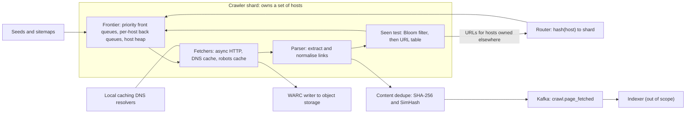

A crawler is [breadth-first search](/learn/data-structures/graphs/breadth-first-search) over a graph you cannot see, with tens of billions of nodes, edges that point at servers you do not own, and nodes that fight back. The textbook version fits in ten lines: pop a URL, fetch it, push its links, keep a visited set. Every line breaks at scale. The queue does not fit in memory. The visited set has ten billion entries. "Fetch it" means opening connections to servers whose owners will block you, or fall over, if you send them two thousand requests a second because their links happened to be at the front of your queue. And some sites generate infinite URLs, so a naive crawler spends its budget on one calendar widget.

The interviewer is testing whether you see that the binding constraint is not bandwidth or storage, which are modest, but *politeness*: a per-host rate limit that turns throughput into a scheduling problem across tens of thousands of hosts.

## Requirements

### Functional

- Start from seed URLs and sitemaps; fetch HTML over HTTP(S); extract and follow links.
- Respect `robots.txt` (allow/disallow and crawl delay) and per-host rate limits.
- Store every fetched page (raw bytes plus metadata) for the downstream indexer.
- Detect duplicate URLs (one page, many spellings) and duplicate or near-duplicate content.
- Recrawl known pages on a schedule that tracks how often they change.
- Out of scope unless asked: images and video, JavaScript rendering (see follow-ups), the indexer.

### Non-functional

| Property | Target |
|---|---|
| Throughput | 5 billion fetches a month (new pages plus refreshes) |
| Politeness | One connection per host; about one request per second per host at most, slower for slow hosts, unless `robots.txt` or an agreement says otherwise |
| Freshness | Important, fast-changing pages within hours; the long tail within weeks |
| Robustness | Survives spider traps, malformed HTML, hostile servers and machine failures without losing the frontier |
| Scale of the known web | 10 billion known URLs |

## Back-of-envelope estimates

| Quantity | Arithmetic | Result |
|---|---|---|
| Fetch rate | $5 \times 10^9$ ÷ $2.63 \times 10^6$ s per month | 1,900/s; provision 3,000/s to catch up after an outage (you choose when to crawl, so there is no daily peak) |
| Bandwidth | 2,000/s × ~100 KB decompressed | 200 MB/s = 1.6 Gbps; gzip puts perhaps a third of that on the wire |
| Storage | $5 \times 10^9$ × 100 KB ÷ ~5 (HTML compression) | 100 TB/month, less when unchanged pages are not stored again |
| Fetches in flight | 2,000/s × 0.69 s mean fetch (Little's law) | ~1,400; budget 10,000 for the 30 s tail, so 10–20 async fetcher processes at ~1,000 connections each |
| Hosts in rotation | 2,000/s ÷ 0.13 pages/s per host (simulated below) | **~15,000 hosts ready at every moment** |
| One big site | $10^8$ pages at 1 page/s | 3.2 years per full pass |
| Discovered links | 2,000 × ~50 outlinks | 100,000 URLs/s to normalise and test against the seen set |
| Seen set | $10^{10}$ URLs × 8-byte fingerprints; or a Bloom filter at 9.6 bits per URL | 80 GB exact; 12 GB at 1% false positives |
| Fingerprint collisions | $n^2 / 2^{65}$ for $n = 10^{10}$ | ~2.7 URLs that are never crawled: acceptable |
| Parse CPU | 2,000 × ~6 ms (CPython's `html.parser` measured 3.5 ms on a 60 KB page with 1,426 tags) | ~12 cores; a C parser needs fewer |

**Consequence.** Hardware is tens of machines. The design problem is a scheduler that keeps ~15,000 hosts busy without being rude to any one of them, and a dedupe path that stops 100,000 discovered URLs a second from turning into repeated work.

## API

A crawler has no end-user API; its contracts are the seams between components.

```text
Control plane (operators)
POST /v1/seeds                  {urls:[...], priority}                 -> 202
GET  /v1/urls/{fingerprint}     -> {url, last_fetch, status, next_fetch_at, content_hash}
PUT  /v1/hosts/{host}/policy    {max_rps, blocked, url_budget}         -> 200

Frontier (per shard, internal RPC)
enqueue(urls[], source_url, depth)          batched; routed to the shard that owns each host
lease(fetcher_id, n) -> [(url, lease_id, deadline)]
complete(lease_id, result)                  status, fetch_ms, content_hash, etag

Output (Kafka topic crawl.page_fetched)
{url, final_url, status, fetched_at, content_hash, simhash, warc_ref, outlink_count}
```

`lease` rather than `pop`: a fetcher that dies holding URLs does not lose them; the lease expires and they return to the frontier.

## Data model

URLs and hosts are sharded by **host**, because politeness, `robots.txt` and the per-host queue are all per host; sharding by URL hash would need a global per-host rate limiter consulted on every fetch.

```text
url      (shard = hash(host))
  url_fp          u64   primary key, fingerprint of the normalised URL
  url, host       text
  first_seen, last_fetched, last_changed, next_fetch_at
  fetch_interval  seconds, adapted on every fetch
  priority        float, from inbound links and change rate
  last_status, content_hash, simhash, etag, last_modified

host     (same shard)
  host            primary key
  ips, dns_expires_at, robots_rules, robots_fetched_at, crawl_delay
  next_allowed_at, consecutive_errors, url_budget

content  object storage, WARC files of ~1 GB; index content_hash -> (file, offset, length)
```

`url_fp` is the key because the hot operation is "have we seen this URL?", 100,000 times a second; an index on `next_fetch_at` serves the recrawl scheduler. WARC, the standard web-archive container, appends many compressed records into large files, avoiding billions of tiny objects that object stores handle poorly and bill per request.

## High-level design



Each shard owns a set of hosts by [consistent hashing](/learn/system-design/distributed-systems/partitioning-and-rebalancing) on the host name, so everything about a host lives in one place and politeness needs no global coordination. Links to hosts owned elsewhere go through a router in batches; most links point to the same site, so most discovered URLs never leave their shard.

```viz
{"type": "graph", "algorithm": "bfs", "directed": true, "start": "A",
 "nodes": [{"id":"A"},{"id":"B"},{"id":"C"},{"id":"D"},{"id":"E"},{"id":"F"}],
 "edges": [{"from":"A","to":"B"},{"from":"A","to":"C"},{"from":"B","to":"D"},{"from":"C","to":"D"},{"from":"C","to":"E"},{"from":"D","to":"F"},{"from":"E","to":"A"}],
 "title": "Crawling is BFS with a visited set",
 "caption": "D is discovered twice and A is linked back from E; the visited set turns both into no-ops. A real frontier is not a plain FIFO: priority and per-host politeness reorder it, but the discovered-once invariant is the same."}
```

## Deep dive: one URL, from discovery to a WARC record

A fetched page contains `<a href="/Products/42?utm_source=mail&sessionid=9f3#reviews">`. Timings are for one shard; the network figures assume an 80 ms round trip to the site.

| t | Step | What happens |
|---|---|---|
| 0 | Extract | The parser resolves the relative link against the page's URL |
| +10 µs | Normalise | Lowercase scheme and host, drop default port and `#reviews`, strip `utm_*` and `sessionid`, sort remaining parameters: `https://shop.example.com/Products/42`. The path keeps its case, because paths are case-sensitive |
| +1 µs | Fingerprint | 64-bit hash of the normalised string |
| +~1 µs | Bloom test | 7 bit probes into a 12 GB array; one bit is unset, so the URL is **definitely new** and skips the URL table (a "maybe" would cost a batched SSD lookup, ~0.1–1 ms) |
| +~100 ms | Route and enqueue | Same host, same shard: a batched insert into the URL table (flushed every ~100 ms) and a front queue by priority (3 of 10) |
| minutes to hours | Wait | A biased selector refills `shop.example.com`'s back queue from the front queues; the host's heap entry says it may be fetched at 14:02:07.3 |
| 14:02:07.3 | Fetch | DNS 40 ms (cache miss; prefetching makes it 0), TCP handshake 80 ms, TLS 1.3 80 ms, request to first byte 230 ms (one round trip plus 150 ms of server time), the rest of a 35 KB gzip body one more round trip because the first congestion window carries ~14.6 KB: **510 ms** |
| +510 ms | Politeness | Host's next slot = now + max(1 s, 10 × 0.51 s) = +5.1 s |
| +~6 ms | Parse | Extract ~50 links, each starting this walk again |
| +37 µs | Content hash | SHA-256 of 100 KB (measured); not seen before |
| +~1 ms | SimHash | 64-bit fingerprint; 20 table probes find no page within 3 bits |
| +~1 ms | Store | Append the record to the open WARC file (uploaded when it reaches 1 GB), index `content_hash → (file, offset, length)`, publish `crawl.page_fetched`, set `next_fetch_at` |

**Edge case.** The response is a `301` to `/products/42`. The redirect target is a new URL: it goes through normalisation and the seen test like any link, counts as a hop (at most 5), and the record stores both `url` and `final_url`, or two spellings of one page get crawled forever.

### Sizing the seen test

For $n = 10^{10}$ URLs and false-positive rate $p$, a [Bloom filter](/learn/advanced-data-structures/probabilistic-structures/bloom-filters) needs

$$m = -\frac{n \ln p}{(\ln 2)^2} = \frac{10^{10} \times 4.605}{0.4805} = 9.59 \times 10^{10} \text{ bits} = 12 \text{ GB}, \qquad k = \frac{m}{n}\ln 2 = 6.6 \to 7$$

At $p = 0.001$ it is 14.4 bits per URL, 18 GB and 10 hash functions. The subtle point: a filter never says "no" to a URL it has seen, but it says "maybe" to 1% of genuinely new URLs, and trusting that blindly means 1% of new URLs are never crawled. For low-priority links that is acceptable; for sitemap and high-priority URLs, confirm "maybe" against the URL table.

```viz
{"type": "system", "scenario": "bloom-filter", "keys": ["a.com/", "a.com/about", "b.org/x", "c.net/"],
 "title": "The seen test",
 "caption": "Each URL sets k bits. A lookup that finds any of its bits unset is definitely new and goes straight to the frontier. A lookup that finds all bits set is 'probably seen'; at about 10 bits per URL the probability of being wrong is about 1%."}
```

**Under the hood: checking against disk without a disk seek per URL.** Most discovered links point at pages already seen, so the filter says "maybe" to most of the 100,000 URLs a second, and each "maybe" that must be confirmed would be a random SSD read. The trick the IRLbot paper describes, and an LSM store gives you for free, is batching: buffer a few seconds of fingerprints, sort them, and merge-join the sorted batch against the sorted on-disk key range, so thousands of checks cost one sequential pass over the relevant files instead of thousands of seeks. Confirmation is then limited by sequential bandwidth, not seek latency, which is why the URL table can live on SSD rather than in 80 GB of RAM.

```exercise
id: bloom-size
title: Size a Bloom filter
prompt: |
  Implement `bloom_size(n, p)`, which returns `[m, k]` for a Bloom filter that
  will hold `n` items (n >= 1) with target false-positive rate `p` (0 < p < 1):

  - `m`, the number of bits, is `-n * ln(p) / (ln 2)^2` rounded **up** to an integer.
  - `k`, the number of hash functions, is `(m / n) * ln 2` rounded to the
    nearest integer with halves rounded up (use `floor(x + 0.5)`), and at least 1.

  Use the rounded `m` when computing `k`.
languages: [python, javascript]
entry: bloom_size
starter:
  python: |
    import math

    def bloom_size(n, p):
        # your code here
        return [0, 0]
  javascript: |
    function bloom_size(n, p) {
      // your code here
      return [0, 0];
    }
tests:
  - args: [1000, 0.01]
    expected: [9586, 7]
    label: textbook 1%
  - args: [10000000000, 0.01]
    expected: [95850583774, 7]
    label: ten billion URLs
  - args: [1, 0.5]
    expected: [2, 1]
    label: one item
  - args: [100, 0.9]
    expected: [22, 1]
    label: k never drops below 1
  - args: [1000000, 0.001]
    expected: [14377588, 10]
  - args: [5000, 0.01]
    expected: [47926, 7]
    hidden: true
  - args: [100, 0.1]
    expected: [480, 3]
    hidden: true
  - args: [1000, 0.000001]
    expected: [28756, 20]
    hidden: true
hints:
  - "Python's math.log and JavaScript's Math.log are natural logarithms; (ln 2)^2 is about 0.4805."
  - "Round m up with ceil before computing k, and write the half-up rounding as floor(x + 0.5)."
```

```viz
{"type": "network", "scenario": "dns-resolution",
 "title": "Why the fetcher keeps its own DNS cache",
 "caption": "An uncached lookup walks resolver, root, TLD and authoritative servers. At 2,000 fetches a second across 15,000 hosts, a local caching resolver with prefetching turns tens of milliseconds per fetch into zero for hosts about to reach the head of the heap."}
```

## Deep dive: the frontier, where politeness lives

A single FIFO fails at once: a page from `bigsite.com` yields 50 links to `bigsite.com`, adjacent in the queue, and a pool of fetchers hits that host 50 times in parallel. The Mercator crawler design, as described in the standard information-retrieval texts, splits the frontier in two. **Front queues** hold priority: a prioritiser assigns each URL to one of ~10 queues by importance and staleness, and a biased selector favours high-priority queues without starving the rest. **Back queues** hold politeness: each holds URLs for exactly one host, and a min-heap keyed by "earliest time this host may be fetched" decides who goes next. After a fetch, the host's next time is `now + max(crawl_delay, 10 × fetch_duration)`, a gap an order of magnitude larger than the last fetch, which automatically backs off from slow, often struggling, servers. The texts suggest about three times as many back queues as fetcher threads.

```python
import heapq
from collections import deque

class PoliteFrontier:
    """Back-queue half of a Mercator-style frontier: one FIFO per host and a
    min-heap of (earliest allowed fetch time, host). A host is in the heap only
    while it has queued URLs and no fetch in flight."""

    def __init__(self, default_delay=1.0):
        self.queues = {}        # host -> deque of URLs
        self.ready_at = {}      # host -> earliest time the next fetch may start
        self.in_flight = set()
        self.heap = []
        self.default_delay = default_delay

    def add(self, host, url):
        q = self.queues.setdefault(host, deque())
        q.append(url)
        if len(q) == 1 and host not in self.in_flight:
            heapq.heappush(self.heap, (self.ready_at.get(host, 0.0), host))

    def next(self, now):
        if self.heap and self.heap[0][0] <= now:
            _, host = heapq.heappop(self.heap)
            self.in_flight.add(host)          # one connection per host
            return host, self.queues[host].popleft()
        return None                            # sleep until heap[0][0]

    def done(self, host, now, fetch_seconds, crawl_delay=None):
        self.in_flight.discard(host)
        delay = max(crawl_delay or self.default_delay, 10 * fetch_seconds)
        self.ready_at[host] = now + delay
        if self.queues[host]:
            heapq.heappush(self.heap, (self.ready_at[host], host))
```

Trace it: three URLs for `a.com` and one for `b.org`. The first two `next(0)` calls return `a.com/1` and `b.org/x`; the third returns `None` because `a.com` is in flight. If `a.com` took 0.2 s, its next slot is `0.2 + max(1.0, 2.0) = 2.2`, and `next(1.0)` still returns `None`. Politeness is a property of the data structure, not a rule someone must remember.

### How many hosts does 2,000 pages a second need?

Simulated with fetch times drawn from a lognormal distribution (median 0.5 s, mean 0.69 s, capped at 30 s): each host's cycle is fetch plus gap, 7.6 s on average, so a host yields 0.13 pages/s and **2,000 pages/s needs ~15,200 hosts** with work queued. Running the heap scheduler over 15,200 always-busy hosts for ten simulated minutes produced 2,006 pages/s with ~1,380 fetches in flight, as Little's law predicts (2,000 × 0.69 s). With a flat 1 s gap instead of the 10× rule, 3,400 hosts would do: the self-adjusting gap costs 4.5 times more breadth, which is the price of never hammering a slow server.

Two refinements. **Politeness per IP as well as per host**: shared hosting puts thousands of small sites on one IP. If 5,000 sites share a server and each is fetched once a second, the server sees 5,000 requests a second from you. Resolve DNS early and apply a second limit per IP, say 10 requests a second; each of those sites then gets a fetch every 500 s, which is the correct outcome for a small server. **The frontier lives on disk**: at billions of URLs only the head of each queue is in memory, the rest in append-only files or an embedded key-value store, so a restart loses nothing.

## Deep dive: duplicate content and freshness

### Near-duplicates with SimHash

Mirrors, printer versions and pages that differ only in a timestamp waste index space and crawl budget. SHA-256 catches exact copies. **SimHash** catches near-copies: hash each 3-word shingle to 64 bits, add +1 or −1 per bit position, keep the sign of each position. On an 800-word synthetic page, changing one word to a timestamp and appending an ad slot changed the SimHash in **1 bit**, while the SHA-256 changed completely; an unrelated page of the same vocabulary differed in **33 bits**, as random 64-bit values should. Google's published near-duplicate work used 64-bit SimHash and a Hamming distance of 3.

Finding every stored fingerprint within 3 bits uses the pigeonhole principle: split 64 bits into blocks; if two fingerprints differ in at most 3 bits, at least some blocks match exactly, so index tables by those blocks. The block count decides the cost. With 4 blocks of 16 bits, a lookup matches 16 bits and returns $8 \times 10^9 / 2^{16} \approx 122{,}000$ candidates per probe at 8 billion pages: far too many. With 6 blocks, at least 3 match; one table per choice of 3 blocks is $\binom{6}{3} = 20$ tables keyed on 30–33 bits, returning a handful of candidates per probe ($8 \times 10^9 / 2^{32} \approx 2$), at the price of 20 copies of the fingerprints (20 × 64 GB). [MinHash and LSH](/learn/advanced-data-structures/probabilistic-structures/minhash-and-lsh) apply the same idea to set similarity.

### Recrawl scheduling

Most fetches after the first pass are refetches. Model a page's changes as random events at rate $\lambda$ per day; crawled every $I$ days, the fraction of time your copy is fresh is

$$ F = \frac{1 - e^{-\lambda I}}{\lambda I} $$

| Page | Changes | Crawled | Fresh |
|---|---|---|---|
| B | Daily ($\lambda = 1$) | Daily | 63.2% |
| B | Daily | Twice a day | 78.7% |
| A | Hourly ($\lambda = 24$) | Daily | 4.2% |
| A | Hourly | Twice a day | 8.3% |

One extra daily crawl buys B 15.5 points and A 4.2. That is the counter-intuitive result from Cho and Garcia-Molina's work on refresh policies: to maximise average freshness, do not spend budget in proportion to change rate, because pages that change faster than you can crawl absorb budget without becoming fresh. Weight by importance, and give the hopeless-but-important cases (a news homepage) a dedicated fast lane. Mechanically: halve a URL's interval when its content hash changed, multiply it by 1.5 when it did not, send `If-None-Match` or `If-Modified-Since` so an unchanged page costs a few hundred bytes of `304`, and trust sitemap `lastmod` only from sites that have not lied about it.

## Failure modes

| Failure | Symptom | Diagnosis | Fix |
|---|---|---|---|
| Spider trap | One host's URL count grows without bound; yield (new, non-duplicate pages per fetch) near zero | Repeating path segments (`/a/b/a/b/`), calendar parameters, session IDs in links | Cap URL length (~2,000 chars) and depth, detect repeated segments, strip session parameters, per-host URL budget scaled by importance |
| Hostile or broken server | Fetchers blocked on connections that trickle bytes | Fetch duration histogram with a fat tail at the deadline | Total deadline (not only idle timeout), 10 MB body cap, 5 redirects, check `Content-Type` before downloading |
| Being too fast for a site | Spike of `429`/`503` from one host; complaints | Error rate and latency per host rising together | Honour `Retry-After`, exponential per-host backoff, descriptive `User-Agent` with a contact URL, per-host kill switch |
| `robots.txt` returns 5xx | Crawling hardest while a site is failing | RFC 9309 treats a 5xx or network failure as "undefined" | Assume full disallow (or keep the cached copy, normally no older than 24 hours); a 4xx means no restrictions |
| Fetcher crash | Some URLs fetched twice | Leases expired and re-issued | Nothing to fix: GETs are safe to repeat and storage dedupes by content hash |
| Frontier shard loss | Its hosts stop being crawled | Shard health check | Hosts move to neighbours by consistent hashing; queues rebuilt from the URL table's `next_fetch_at`; every host restarts at its full politeness delay |
| DNS bottleneck | Fetch time dominated by lookups; public resolvers rate-limit | DNS time per fetch in the timing breakdown | Local caching resolvers per fetcher group, prefetch for hosts near the head of the heap, respect TTLs |

## Trade-offs: what we rejected

| Decision | Chosen | Rejected | Why here | What would flip it |
|---|---|---|---|---|
| Sharding | By host | By URL hash | Politeness and robots become local | A few hosts dominating the crawl (split them with explicit per-host budgets) |
| Seen set | Bloom filter in front of a URL table | Bloom filter alone; exact set in RAM | Scheduler needs per-URL state anyway; filter saves most lookups for new URLs | Memory cheap enough for 80 GB of fingerprints per shard group |
| Delivery | At-least-once with leases | Exactly-once fetch | A duplicate fetch costs bandwidth, not correctness | Fetches with side effects (never, for GET) |
| Politeness gap | max(delay, 10 × fetch time) | Flat 1 s | Backs off struggling servers automatically | Sites that negotiate a higher rate |
| Near-dup index | 20 tables on 32-bit keys | 4 tables on 16-bit keys | ~2 candidates per probe instead of ~122,000 | Fewer pages, or memory tighter than CPU |
| Recrawl budget | By importance, capped per page | Proportional to change rate | Fast-changing pages never become fresh anyway | A product that only cares about the head (news) |

## At 10× and 100×

**10× (50 billion fetches a month, 19,000/s):** ~150,000 hosts must be ready at every moment, which is more than many crawls ever discover in a region, so the crawler becomes host-starved: yield per host and negotiated rates matter more than machines. The seen set reaches 120 GB of Bloom filter for $10^{11}$ URLs and the fingerprint collision count rises to ~270, which argues for 96-bit fingerprints. Bandwidth, 16 Gbps, becomes a network-placement decision (crawl from several regions, each owning nearby hosts).

**100×:** the web does not have enough distinct, useful pages to fetch 190,000 a second politely; at that point the design problem is choosing what not to crawl (quality models before fetch, sitemaps and push notifications from sites such as IndexNow-style pings) rather than fetching faster.

## What real companies describe

- **Mercator** (the Compaq/DEC research crawler) is the publicly described origin of the front-queue/back-queue frontier and the "order of magnitude longer than the last fetch" gap.
- The **IRLbot** paper describes crawling over six billion pages from a single server, using batched disk-based URL uniqueness checks and per-domain budgets tied to how many other domains link in, to starve spam farms.
- **Common Crawl** publishes its crawls as WARC files in public cloud storage: the storage format used here.
- **Google** has publicly described Googlebot queuing pages for JavaScript rendering separately from fetching, and its researchers published the 64-bit SimHash near-duplicate method.

The numbers in this lesson are assumptions for a 5-billion-page-a-month crawl, not any company's figures.

## Interviewer follow-ups

**"Why shard by host rather than by URL hash?"** Model answer: politeness and `robots.txt` are per host; with URL-hash sharding every shard holds some `bigsite.com` URLs and enforcing one request per second needs a global per-host limiter on every fetch. Host sharding makes it local; skew from a huge site is bounded by its own rate limit, and cross-shard link routing is small because most links are intra-site. Common wrong answer: "URL hashing balances load better", which ignores that politeness caps each host anyway.

**"One site has 100 million pages and allows one request a second."** Model answer: a full pass is 3.2 years, so crawl what changed: sitemaps with `lastmod`, conditional requests that cost a `304`, and importance ranking that accepts a stale tail; then ask the site for a higher rate. Common wrong answer: "add fetchers", which the politeness limit makes useless.

**"How do you handle JavaScript-rendered pages?"** Model answer: rendering in a headless browser costs seconds of CPU per page instead of milliseconds, so it is a second stage with its own budget, entered only when heuristics say the HTML is an empty shell, with shared bundles cached per site. Common wrong answer: render every page, multiplying the fleet by two or three orders of magnitude.

**"Does the crawler need exactly-once processing?"** Model answer: no; a duplicate fetch wastes bandwidth and some of a host's patience and corrupts nothing. Leases, idempotent enqueue and content-hash dedupe are enough; spend the complexity on politeness. Common wrong answer: a transactional pipeline for fetch, parse and store.

**"How do you know the crawler is wasting its budget?"** Model answer: measure yield per host and per priority tier (fetches producing new or changed, non-duplicate pages), the `304` rate on refreshes, and time since last change at fetch time; a high-volume, zero-yield host is a trap or a mirror. Common wrong answer: pages per second, which a spider trap maximises.

## What mid-level engineers get wrong

- One global FIFO queue, which sends bursts of requests to whichever host's links came first.
- Lowercasing the whole URL during normalisation, merging pages whose paths differ only in case.
- Trusting Bloom "maybe" for high-priority URLs, silently never crawling 1% of new pages.
- Splitting SimHash into 4 × 16-bit tables at billions of pages, so each probe returns 100,000+ candidates.
- Recrawling hardest the pages that change fastest, spending budget that never buys freshness.
- Treating a `robots.txt` 5xx as "no rules" and crawling a failing site harder.

## Senior signals

- You identify politeness as the constraint and derive "~15,000 hosts ready every moment" and "a big site takes years" from it.
- You split the frontier into priority and politeness halves and can explain the per-host heap and the 10× gap.
- You shard by host and say why that makes politeness local.
- You size the Bloom filter from $n$ and $p$, and treat its false positives as a product decision backed by an exact store.
- You size near-duplicate indexes by candidates per probe, not only by bits.
- You reason about freshness with a change-rate model and choose at-least-once over exactly-once, with reasons.

## Check yourself

```quiz
- q: >-
    Fetch times average 0.69 s and each host waits max(1 s, 10 × fetch time) between requests. Roughly how many hosts with queued work does 2,000 pages a second need?
  options: ["About 2,000, one fetch per host per second", "About 15,000, since each host's cycle is ~7.6 s", "About 1,400, the number of fetches in flight", "About 200, if each host is fetched ten times a second"]
  answer: 1
  explanation: >-
    Each host yields one page per fetch-plus-gap cycle, 7.6 s on average in the simulation, so about 0.13 pages a second; 2,000 divided by 0.13 is about 15,000. The 1,400 figure is fetches in flight from Little's law, which is a different quantity; fetching a host ten times a second breaks politeness.
- q: >-
    Why does the Mercator-style frontier keep one back queue per host with a heap keyed by next allowed fetch time?
  options: ["To act as the visited set so no URL is fetched twice", "So politeness is structural, not a check in the fetcher", "To make the breadth-first traversal run in O(1) per URL", "To keep each host's URLs in priority order for fetching"]
  answer: 1
  explanation: >-
    A host is returned by the heap only when its delay has expired and it is not in flight, so it cannot be fetched early and never has two fetches at once. Priority is handled separately by the front queues, and the seen set is a separate component.
- q: >-
    A Bloom filter for 10 billion URLs targets a 1% false-positive rate. What does it need, and what does a false positive do?
  options: ["About 80 GB and 1 hash; a new URL is fetched twice", "About 1.2 GB and 3 hashes; the filter must be rebuilt", "About 12 GB and 7 hashes; a new URL is skipped", "About 12 GB and 7 hashes; a seen URL is fetched again"]
  answer: 2
  explanation: >-
    m = -n ln p / (ln 2)^2 is about 9.6 bits per URL, 12 GB, and k = (m/n) ln 2 is 6.6, so 7. A false positive says maybe-seen for a URL that is new, so trusting it skips the URL; a seen URL never gets a no. That is why high-priority URLs confirm maybes against the URL table.
- q: >-
    Near-duplicate detection must find fingerprints within 3 bits among 8 billion 64-bit SimHashes. Why use 20 tables on ~32-bit keys rather than 4 tables on 16-bit keys?
  options: ["16-bit keys miss pairs that differ in exactly 3 bits", "20 tables use less memory because the keys are longer", "A 16-bit key returns ~122,000 candidates per probe", "32-bit keys let the check skip the Hamming distance step"]
  answer: 2
  explanation: >-
    Both layouts guarantee a match on at least one key by the pigeonhole principle, so neither misses pairs. The difference is selectivity: 8 billion divided by 2^16 is about 122,000 candidates to check per probe, against about 2 for a 32-bit key. The price is 20 copies of the fingerprints, not less memory.
- q: >-
    Pages A and B are equally important and both are crawled once a day. A changes about once an hour, B about once a day. You can afford one extra crawl per day. Which choice improves average freshness more?
  options: ["Crawl neither; rely on sitemaps to signal the changes", "Crawl A more, because it changes 24 times as often", "Crawl B more; one more crawl barely helps A's freshness", "It makes no difference, since both pages matter equally"]
  answer: 2
  explanation: >-
    With F = (1 - e^(-λI)) / (λI), B goes from 63% to 79% fresh with a second daily crawl, while A only goes from 4% to 8%, because it changes faster than any affordable crawl rate. Spending budget in proportion to change rate is the intuitive mistake.
- q: >-
    robots.txt for a host returns HTTP 503 for an hour. What should the crawler do under RFC 9309?
  options: ["Crawl only the home page until robots.txt returns", "Treat it as full disallow until robots.txt can be fetched", "Delete the host and its URLs from the URL table", "Treat the site as having no restrictions and crawl normally"]
  answer: 1
  explanation: >-
    A server error on robots.txt signals an unhealthy site, and the standard says to assume full disallow or keep using a recently cached copy. A 404, in contrast, means no restrictions. Crawling hard while a site is failing is exactly the rudeness the protocol exists to prevent.
```
