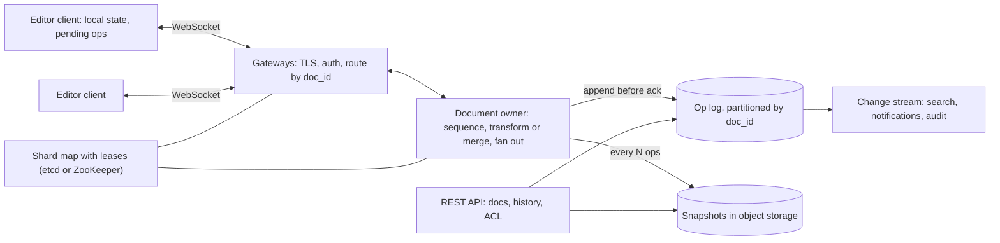

Alice in London and Bob in New York are editing the same sentence. Alice types an "X" after the first letter at the same instant Bob deletes the third. Each sees their own change immediately, because an editor that waits a network round trip to show a keystroke feels broken. Then each receives the other's change, tens of milliseconds late, and applies it to a document that has already moved. If Bob's "delete the character at position 2" is applied literally to Alice's document, it deletes the wrong character, and the two copies have silently diverged.

That is the whole problem in one keystroke. Locking paragraphs is unacceptable UX, last-writer-wins on the whole document throws away someone's work, and "merge at save time" is what people did before real-time collaboration. The system has to accept concurrent edits optimistically, guarantee that every copy converges to the same text, preserve each author's intent, and never lose an edit the user was told was saved.

## Requirements

**Functional.** Create, open and edit rich-text documents with many concurrent editors; instant local echo and remote edits within a fraction of a second; live presence (who is here, their cursor and selection); offline editing that merges on reconnect; version history with restore; per-document roles (owner, editor, commenter, viewer). Out of scope: comment threads, search, export.

| Property | Target |
|---|---|
| Convergence | Replicas that have applied the same set of edits show identical content, always |
| Local latency | 0 ms: the keystroke is applied before any network call |
| Remote latency | p99 under 300 ms between editors in the document's home region; plus one cross-region trip otherwise |
| Durability | An edit acknowledged as saved is never lost (acknowledge only after a replicated append) |
| Scale | 100 million documents, 10 million daily active users, up to ~100 simultaneous editors and 50,000 viewers on one document |
| Availability | 99.9%+ for editing; offline editing continues through outages |

## Back-of-envelope estimates

| Quantity | Arithmetic | Result |
|---|---|---|
| Concurrent editors | $10^7$ DAU × 30 min ÷ 1,440 min | 208,000 average, **625,000 at a 3× peak** |
| Open sockets | Editors plus viewers | ~1 million at peak |
| Gateway nodes | 1 M ÷ ~50,000 mostly idle sockets per node | 20; run 40 across three zones so 27 survive a zone loss |
| Operations in | 20% of peak editors typing × 3 batches/s (keystrokes coalesced over ~100 ms) | **375,000 ops/s** |
| Broadcast out | × ~2 other collaborators on a typical active document | 750,000 messages/s |
| Bandwidth | 375,000 × 150 B in; 750,000 × 150 B out | 56 MB/s in, 113 MB/s out |
| One busy document | 50 people typing × 3 batches/s | **150 ops/s**: trivial for one process |
| Owner nodes | 375,000 ops/s ÷ an assumed ~20,000 ops/s per node (transforms take µs; appends are batched per document) | ~20; run 30 |
| Op log | 125,000 ops/s average × 100 B | 12.5 MB/s, 1.1 TB/day; 30 days of individual ops is 32 TB |
| Snapshots | $10^8$ documents × 50 KB of text | 5 TB as plain text; 23–72 TB if stored as a CRDT (computed in the second deep dive) |

**Consequences.** The aggregate load is large but is the sum of hundreds of thousands of *independent* small streams with no cross-document transaction. So each document gets a single owner that orders all its operations, and documents are sharded across owners: consensus disappears from the hot path because each document's order is decided in one place. Opening a document reads the latest snapshot plus at most a few thousand ops: a few hundred KB, one round trip.

## API

REST for everything that is not live editing; one [WebSocket](/learn/networking/application-protocols/real-time-transports) per open document for everything that is.

```text
POST /v1/docs                              -> {doc_id}
GET  /v1/docs/{id}                         -> {snapshot, version, acl}
GET  /v1/docs/{id}/history?before=VERSION  -> [{version, author, ts, summary}]
POST /v1/docs/{id}/restore {version}       -> {version}   (a new op that reverts, not a rewrite)
WS   /v1/docs/{id}/session?since=VERSION
```

```json
{"type": "op", "client_id": "c-7f2", "client_seq": 41, "base_version": 1208,
 "ops": [{"retain": 1}, {"insert": "X"}]}

{"type": "op", "version": 1209, "author": "bob", "ops": [{"retain": 2}, {"delete": 1}]}

{"type": "ack", "client_seq": 41, "version": 1210}

{"type": "presence", "user": "bob", "cursor": 2, "selection_end": 2}
```

Three fields carry the design. `base_version` says which state the op was written against, so the owner knows what to transform it against. `(client_id, client_seq)` makes resends idempotent. `since=VERSION` lets a reconnecting client receive only the ops it missed instead of reloading a snapshot.

## Data model

```sql
CREATE TABLE documents (
  doc_id           uuid PRIMARY KEY,
  owner_id         uuid NOT NULL,
  title            text,
  latest_version   bigint NOT NULL,
  snapshot_version bigint NOT NULL,
  snapshot_ref     text NOT NULL          -- object-store key
);

CREATE TABLE doc_ops (
  doc_id     uuid,
  version    bigint,                      -- dense, assigned by the document's owner
  client_id  text NOT NULL,
  client_seq bigint NOT NULL,
  author_id  uuid NOT NULL,
  payload    bytea NOT NULL,
  created_at timestamptz NOT NULL,
  PRIMARY KEY (doc_id, version),          -- a second writer for the same version fails
  UNIQUE (doc_id, client_id, client_seq)  -- a resent op is detected, not reapplied
);

CREATE TABLE doc_acl (doc_id uuid, principal uuid, role text, PRIMARY KEY (doc_id, principal));
```

Each key is there for a failure or a query:

- **`(doc_id, version)` with dense versions** is both the total order and the fence: the append of version N+1 succeeds only if nobody has written N+1.
- **`UNIQUE (doc_id, client_id, client_seq)`** turns a resent op into a detected duplicate: the [idempotency-key pattern](/learn/system-design/building-blocks/idempotency-and-retries) applied to keystrokes.
- **Partitioning by `doc_id`** keeps one document's log in one partition, so "ops since 1208" and history are single-partition range reads. Partitioning by time would scatter every document open.

The op log is append-only; at 1.1 TB a day it lives in a horizontally scalable store with conditional writes (a sharded relational database, or a wide-column store with lightweight transactions). Snapshots are blobs in object storage. Presence is never persisted: it lives in the owner's memory and dies with the session.

## High-level design



A client opens a document over REST (snapshot plus version) and connects a WebSocket. The gateway finds the document's owner in a shard map and forwards the socket's messages to it. The owner holds the document in memory (text, recent ops, connected sessions); for each incoming op it transforms or merges it against ops the client had not seen, assigns the next version, appends it to the op log, and only then acknowledges the sender and broadcasts to everyone else. Every thousand ops or so it writes a snapshot.

## Deep dive: one keystroke, end to end

The document is homed in us-east (Ashburn, Virginia). Alice types "X" in London; Bob watches from New York. The London–Ashburn great-circle distance is 5,917 km, so light in fibre (~200 km/ms) needs at least 29.6 ms one way; New York–Ashburn is 350 km, 1.8 ms. Real routes add some tens of percent.

| t (ms) | Where | What happens | What it depends on |
|---|---|---|---|
| 0 | Alice's editor | Inserts "X" into the local model and renders it; the op joins the pending buffer, persisted to local storage | Nothing remote: this is why typing feels instant |
| 0–100 | Alice's editor | No batch is in flight, so it sends now; keystrokes typed while a batch is unacknowledged coalesce into the next batch | Typing speed and the one-batch-in-flight rule |
| ~35 | Gateway (us-east) | One frame on the open WebSocket arrives; routed by `doc_id` to the owner (~0.5 ms) | London to Virginia: distance, not bandwidth |
| ~36 | Owner | Transforms against ops committed since `base_version` 1208 (one op, microseconds); assigns version 1210 | Ops the client had not seen |
| ~38–41 | Op log | Conditional append of (doc, 1210), acknowledged by a quorum across zones | Cross-zone replication plus fsync, 2–5 ms |
| ~41 | Owner | Sends the ack to Alice and version 1210 to Bob's session | – |
| ~44 | Bob's editor | Transforms 1210 against his own pending ops, applies it, renders "X" | New York to Virginia, ~2–3 ms |
| ~76 | Alice's editor | Ack arrives; the op leaves her pending buffer; "Saved" | The return trip to London |

Remote echo is ~45 ms for Bob and would be ~75 ms for a second London editor, well inside 300 ms. Alice's own "Saved" takes a full transatlantic round trip, which is why the document's home region matters (see the multi-region follow-up).

**Edge case: the ack is lost.** Alice's Wi-Fi drops at 60 ms, after the append but before the ack reaches her. On reconnect her editor asks for ops `since` 1208, receives 1209 and her own 1210, and resends its pending op with the same `(client_id, client_seq)`. The unique constraint recognises it, and the owner re-acknowledges version 1210 instead of appending a second "X".

```viz
{"type": "network", "scenario": "websocket-upgrade",
 "title": "One long-lived socket per open document",
 "caption": "The editor upgrades one HTTP request to a WebSocket and keeps it open, so each keystroke batch costs one frame on an existing connection instead of a new request with its own handshakes."}
```

## Deep dive: the same two edits, OT versus CRDT

Two families of algorithm make concurrent edits converge ([CRDTs and collaboration](/learn/system-design/distributed-systems/crdts-and-collaboration) develops both). Take the text `abc` at version 1208 and two concurrent pairs: **(1)** Alice inserts X at 1 while Bob deletes position 2 (the `c`); **(2)** a tie, Alice inserts X at 1 while Bob inserts Y at 1.

### Server-ordered operational transformation

OT rewrites an incoming op so it applies after ops it did not know about. The owner received Bob's op first:

| Step | Owner | Alice's replica | Bob's replica |
|---|---|---|---|
| Local edits | `abc` at 1208 | `aXbc`, pending ins(1, X) | `ab`, pending del(2) |
| Bob's op arrives | Version 1209 = del(2): `ab` | | Ack 1209 |
| Alice's op arrives, base 1208 | Transform ins(1, X) against 1209: the delete is after position 1, unchanged; version 1210: `aXb` | | |
| Broadcasts land | | 1209 = del(2) transformed against her pending insert at 1: shifts to del(3): `aXb` | 1210 = ins(1, X): `aXb` |

Both intents survive: the `c` is gone and the X sits after the `a`. For the tie, the owner applies Bob's ins(1, Y) as 1209; Alice's ins(1, X) is transformed with a deterministic tie rule (here, the lower client ID goes first, and `alice` < `bob`), stays at 1, and every replica reads `aXYbc`.

```python
def transform(op, against, op_wins):
    """Rewrite op so it applies after `against`. Ops are ["ins", pos, ch] or ["del", pos].
    op_wins breaks the tie between two inserts at the same position."""
    kind, pos = op[0], op[1]
    if against[0] == "ins":
        a = against[1]
        if a < pos or (a == pos and (kind == "del" or not op_wins)):
            pos += 1                      # an insert at or before us shifts us right
    else:
        d = against[1]
        if d < pos:
            pos -= 1                      # a delete before us shifts us left
        elif d == pos and kind == "del":
            return None                   # both deleted the same character
    return [kind, pos] + list(op[2:])

print(transform(["del", 2], ["ins", 1, "X"], False))   # ['del', 3]
print(transform(["ins", 1, "X"], ["del", 2], True))    # ['ins', 1, 'X']
```

Checked in scratch code for this lesson: 200,000 random concurrent pairs on random strings of up to six characters all converged, and so did 2,998 randomised runs of three clients, each with one batch in flight, random network delays and about 24 edits per run. The pairwise function is easy; OT's reputation comes from what surrounds it. Rich-text operations (formatting spans, lists, tables) multiply the cases, and OT *without* a central order needs transformation properties that several published algorithms turned out to violate. A single server order means only the simple pairwise property is needed.

### A sequence CRDT

A CRDT avoids transformation by making every edit commute. Each character gets an immutable ID `(counter, replica)`, where the counter is one more than the largest the replica has seen (a Lamport clock, from [time and ordering](/learn/system-design/distributed-systems/time-and-ordering)), and an insert records "after ID p" instead of "at position 1". The seed text is `a`(1,0) `b`(2,0) `c`(3,0).

| Step | Alice's replica | Bob's replica |
|---|---|---|
| Local edits | insert X (4,A) after (1,0): `a X b c` | tombstone (3,0): `a b c†` |
| Receive the other | tombstone (3,0): `a X b c†` = `aXb` | insert (4,A) after (1,0): `a X b c†` = `aXb` |
| Tie: X (4,A) and Y (4,B) both after (1,0) | Siblings after the same ID are ordered by descending ID; (4,B) > (4,A), so Y first: `aYXbc` | Same rule, same result: `aYXbc` |

Deletes leave **tombstones** so that later ops naming (3,0) still resolve. Merging is commutative, associative and idempotent, so replicas converge in any delivery order that respects causality, with or without a server. Checked: 2,000 randomised runs of three replicas, 60,000 operations in total delivered in random causal orders, all converged. Note that the OT run produced `aXYbc` and the CRDT `aYXbc`: each tie rule is an arbitrary convention, and what matters is that every replica applies the same one.

```viz
{"type": "system", "scenario": "crdt-counter", "nodes": 3,
 "title": "Convergence without coordination, in its simplest form",
 "caption": "A grow-only counter: each replica increments only its own slot and merges by taking the element-wise maximum. Merge order does not matter and repeating a merge changes nothing, so every replica converges. A text CRDT applies the same three properties to characters with unique IDs and tombstones."}
```

### What the CRDT costs: metadata and offline merge

Metadata, computed for this lesson on simulated sessions of 30,000 keystrokes by two authors, with a naive element of 16 B of ID, 16 B of origin reference, 1 B of text and a deleted flag, and a run-length form that stores one ID and origin per run of consecutively typed characters plus a list of deleted ranges (the idea behind modern libraries' compression, not a benchmark of any of them):

| Editing style | Tombstones | Naive | Run-length |
|---|---|---|---|
| Careful: 3% backspaces, 1% cursor jumps | 3% | 35 B per live character | 4.6 B (runs average 12.6 characters) |
| Heavy: 12% backspaces, 2% cursor jumps | 14% | 39 B | 14.4 B (runs average 3.9) |

Against 1 byte of plain text, that is the 23–72 TB in the estimates. Tombstones grow with every deletion and can only be discarded once every replica has seen the delete, which needs a coordinator that knows what every client has seen.

**Offline merge.** Alice edits on a plane for three hours and returns with 5,000 pending ops against version 1,208; the server is at 9,000. Server-ordered OT transforms each pending op against each of the 7,792 missed ops: $5{,}000 \times 7{,}792 \approx 39$ million pairwise transforms, about 5 s of CPU in CPython at the measured 0.13 µs per plain-text transform, before any rich-text cases. A CRDT integrates $5{,}000 + 7{,}792 = 12{,}792$ operations, each located by ID. And long divergent histories are where OT's intent preservation looks strangest to users.

### Choosing between them

| | Server-ordered OT | Sequence CRDT |
|---|---|---|
| Needs a central order | Yes | No (a server is still useful) |
| Offline and peer-to-peer | Awkward: pending × missed transforms on reconnect | Natural: linear in the ops |
| Per-character overhead | None beyond the text | 4.6–14 B with run-length encoding in the computation above |
| Implementation risk | Transform functions for every op pair, especially rich text | Mature open-source libraries (Yjs, Automerge) |
| Garbage | None | Tombstones need coordinated compaction |

What I would choose: for a product with central servers, permissions and history, either works, because the server exists regardless. If offline and local-first behaviour are real requirements, a mature CRDT library plus a server that orders, persists and fans out. If documents are huge and offline is rare, server-ordered OT's lower memory wins. The senior move is to name the requirement that decides.

```exercise
id: ot-transform
title: Transform one operation against a concurrent one
prompt: |
  Implement `transform(op, against, op_wins)` for plain-text operations.
  An operation is `["ins", pos, ch]` (insert character `ch` before index `pos`) or
  `["del", pos]` (delete the character at index `pos`). Both `op` and `against`
  were written against the same text. Return `op` rewritten so that it applies
  correctly to the text after `against` has been applied, or `null`/`None` if it
  has become a no-op.

  - Against an insert at `a`: shift `op` right by one if `a < pos`, or if `a == pos`
    and `op` is a delete. If both are inserts at the same position, `op` stays put
    when `op_wins` is true and shifts right otherwise.
  - Against a delete at `d`: shift `op` left by one if `d < pos`. If `d == pos` and
    `op` is also a delete, both deleted the same character: return null. An insert
    at the deleted position stays put.
  Do not modify the inputs; return a new list.
languages: [python, javascript]
entry: transform
starter:
  python: |
    def transform(op, against, op_wins):
        # your code here
        return op
  javascript: |
    function transform(op, against, op_wins) {
      // your code here
      return op;
    }
tests:
  - args: [["del", 2], ["ins", 1, "X"], false]
    expected: ["del", 3]
    label: the opening example
  - args: [["ins", 1, "X"], ["del", 2], true]
    expected: ["ins", 1, "X"]
    label: a later delete does not move an insert
  - args: [["ins", 1, "Y"], ["ins", 1, "X"], false]
    expected: ["ins", 2, "Y"]
    label: tie, the other insert goes first
  - args: [["ins", 1, "X"], ["ins", 1, "Y"], true]
    expected: ["ins", 1, "X"]
    label: tie, this insert goes first
  - args: [["del", 2], ["del", 2], false]
    expected: null
    label: both deleted the same character
  - args: [["del", 4], ["del", 1], true]
    expected: ["del", 3]
    hidden: true
  - args: [["ins", 3, "Z"], ["del", 3], false]
    expected: ["ins", 3, "Z"]
    hidden: true
  - args: [["del", 0], ["ins", 0, "Q"], true]
    expected: ["del", 1]
    label: a delete shifts past an insert at its position regardless of the tie flag
    hidden: true
hints:
  - "Handle the two cases of `against` separately; only positions before or equal to `op`'s position matter."
  - "Equal positions are the whole difficulty: insert versus insert needs the tie flag, delete versus delete cancels, delete versus insert shifts."
```

## Deep dive: one owner per document, fenced, and the hot document

**Finding the owner.** Gateways consult a shard map: consistent hashing over live owner nodes, with a lease per document in a coordination service. When an owner fails, its lease expires within seconds, a new owner acquires it, loads the latest snapshot plus the log tail, and clients reconnect.

**Making sure there is only one.** A lease alone is not enough: an owner that pauses longer than its lease (a long GC, a VM migration) can wake up still believing it owns the document. The protection is in storage: the owner appends version N+1 only if no N+1 exists. If a new owner has already written N+1, the stale owner's insert fails and it steps down. The log position is the fencing token ([failure detection and leases](/learn/system-design/distributed-systems/failure-detection-and-leases) explains why a lease always needs a fence).

```viz
{"type": "system", "scenario": "distributed-lock", "nodes": 3,
 "title": "Why the log, not the lease, is the fence",
 "caption": "A paused holder wakes after its lease has expired and tries to write. Without a fencing check the storage accepts two writers. Here the check is the op log's conditional append on (doc_id, version): the stale owner's write of an already-taken version fails."}
```

**The hot document.** A company all-hands document has 1,000 editors present (10% typing at once) and 50,000 viewers:

| Design | Arithmetic | Messages a second |
|---|---|---|
| Broadcast every op to every session | 1,000 × 10% × 3 = 300 ops/s × 51,000 sessions | 15.3 million |
| Tick batching: one message per session per 50 ms | 51,000 × 20; each carries ~15 ops, ~1.5 KB | 1.02 million, 1.5 GB/s |
| Editors at 50 ms, viewers at 1 s | 1,000 × 20 + 50,000 × 1 | 70,000 |
| Plus 50 relays between owner and sockets | Owner sends 50 × 20 per second; each relay serves ~1,020 sockets | 1,000 from the owner |

Batching cuts message count, not bytes: every viewer still receives ~30 KB/s of ops, so relays scale out bandwidth while the owner does only sequencing. Presence is throttled to a few updates a second, showing the nearest few dozen cursors. Viewers tolerate a second of delay; editors do not.

## Failure modes

| Failure | Symptom | Diagnosis | Fix |
|---|---|---|---|
| Owner crash | "Saving…" stalls for seconds, then recovers | Lease expiry and reassignment in the shard map | Acked ops are in the log; unacked ones are in clients' pending buffers; new owner loads snapshot plus tail; clients resend; the unique constraint dedupes |
| Split brain between owners | Append conflicts during a failover | Conflict metric on `(doc_id, version)`, near zero otherwise | The conditional append; the loser steps down |
| Silent divergence | Two users see different text and both think they are right | Clients periodically send a hash of their document at a version; the owner compares | On mismatch the client reloads the snapshot and re-merges its pending ops; every mismatch is a correctness bug |
| Op log slow | Acks slow; editors keep typing | Append p99 per shard | Cap the pending buffer; warn the user after a few unacknowledged seconds; alert |
| Reconnect storm | Snapshot store spikes after a gateway deploy | 50,000 sockets reconnecting in one second | Drain gateways with a "reconnect in N s" message; jitter; `since=VERSION` so reconnects fetch only missed ops |
| Returning client beyond retained ops | Offline client asks for `since` a version older than 30 days | Ops compacted into snapshots | Reload the snapshot and rebase pending ops as one diff; tell the user |
| Tombstone bloat | CRDT documents slow to load and large in memory | Tombstone fraction per document | Server-coordinated compaction once all known replicas have acknowledged the deletes |
| Malicious or buggy client | Other replicas crash on a bad op | Ops rejected by validation | Validate every op (positions in range, size limits, role) before sequencing; rate-limit per session |
| Permission revoked mid-session | A removed user keeps typing | ACL change event | Owner disconnects that user's sessions within seconds and rejects further ops |

## Trade-offs: what we rejected

| Decision | Chosen | Rejected | Why here | What would flip it |
|---|---|---|---|---|
| Concurrency control | Optimistic merge at character level | Paragraph locks | Typos in one paragraph would block, walk-away holders need expiry, offline is impossible | Structured forms where fields have one owner |
| Conflict policy | Convergent merge | Last-writer-wins on the whole document | LWW discards whole edits | Single-author documents |
| Ordering | One owner per document | Multi-owner or peer-to-peer ordering | 150 ops/s per document needs no consensus; one order makes OT simple | Documents too busy for one process (none observed at this scale) |
| Algorithm | Server-ordered OT or a CRDT, by the offline requirement | Peer-to-peer OT | Needs transformation properties that are hard to get right | – |
| Durability point | Ack after the replicated append | Ack on receipt | "Saved" must survive an owner crash | A viewer-only stream |
| History | Op log plus periodic snapshots | Snapshots only | Fine-grained history and `since=VERSION` reconnects | Storage cost of 32 TB of ops per 30 days |

## At 10× and 100×

**10× (100 million DAU).** 10 million sockets need 200–400 gateway nodes and 3.75 million ops/s arrive: the owner fleet grows to ~200 nodes and the op log to 11 TB a day, so op retention drops to days and snapshots become more frequent. Nothing about the per-document design changes, because documents are independent.

**100× (a billion DAU, or huge shared documents).** Home each document in the region where most of its editors are and migrate homes as that shifts (stop accepting ops briefly, snapshot, move the lease). Hot documents get dedicated owners and relay trees two levels deep. For CRDT storage, tombstone compaction and run-length encoding stop being optimisations and become the difference between 5 TB and 72 TB per 100 million documents.

## What real companies describe

Google has publicly described Google Docs as using operational transformation with a central server that orders changes, and its Wave protocol documents described OT in the lineage of the Jupiter system, where a server and each client transform against each other. Figma's engineering blog describes its multiplayer design as server-authoritative and inspired by CRDTs, without full OT, largely last-writer-wins per property. Yjs and Automerge are open-source CRDT libraries used in production editors, and the Peritext work addresses formatting marks in text CRDTs. These are public descriptions of approaches, not current internals.

## Interviewer follow-ups

**"Why not lock the paragraph someone is editing?"** Model answer: it fails the common case (two people fixing typos block each other), needs lock expiry and fencing on the path of every keystroke, and makes offline impossible; optimistic convergent merging resolves conflicts at character granularity, where they are rare. Common wrong answer: "locks are simpler, so start there", which ships the UX problem.

**"If CRDTs converge without a server, why keep one?"** Model answer: convergence is one requirement of several. The server authorises every edit, makes it durable before "saved", fans out without a peer mesh, produces one history for versioning and audit, and can compact tombstones because it knows what every client has seen. Common wrong answer: "with a CRDT you can drop the backend".

**"How does undo work when others are editing?"** Model answer: undo is local: my undo reverts *my* last change. The client keeps the inverse of each of its ops, transforms it against every op applied since (mine and others'), and sends it as a new op; with a CRDT, undo deletes the characters I inserted and re-inserts ones I deleted, as new operations. Common wrong answer: "revert the document one version", which destroys other people's work.

**"How would you make this multi-region?"** Model answer: one owner per document in a home region, placed where most editors are; others get instant local echo and one extra cross-region trip on remote echo (~30 ms each way London–Virginia at the speed of light in fibre). Migrate the home if the population shifts. Common wrong answer: an owner per region for the same document, which reintroduces the ordering problem OT cannot tolerate and makes durability and permissions harder for a small latency gain.

**"How do you handle rich text?"** Model answer: formatting is marks over ranges anchored to character IDs (CRDT) or retain-with-attributes operations (OT), with defined behaviour when someone types at the boundary of a bold span or two users apply conflicting formats; tables and lists are trees and need tree-aware operations, so many editors restrict structure. This is where most of the real engineering effort goes. Common wrong answer: "store HTML and diff it".

## What mid-level engineers get wrong

- Acknowledging on receipt, so an owner crash loses edits the user was told were saved.
- Relying on the lease alone to guarantee a single owner, so a paused process writes a second version 5001.
- Generating a new `client_seq` on resend, which turns a lost ack into a duplicated paragraph.
- Choosing a CRDT without budgeting its metadata: 4.6–14 bytes per character in the computation above, and tombstones that never shrink without coordination.
- Broadcasting every op to every viewer of a hot document instead of batching on a tick.
- Assuming the algorithm is bug-free instead of checksumming replicas to detect divergence.

## Senior signals

- You compute the per-document op rate and conclude that one sequencer per document is enough, which removes consensus from the hot path.
- You trace the same concurrent edits through OT (versions and transforms) and a CRDT (IDs, tombstones, sibling order), and pick between them by the requirement that decides: offline, overhead or rich text.
- You fence the owner with the storage layer's conditional append, not with the lease alone.
- You define "saved" as durably appended, make resends idempotent, and can say where the milliseconds of a keystroke go.
- You treat the hot document as a fan-out problem and solve it with tick batching, relays and presence throttling, with the arithmetic.
- You detect divergence with checksums rather than assuming the algorithm is correct.

## Check yourself

```quiz
- q: >-
    On the text "abc", Alice inserts X at position 1 while Bob concurrently deletes position 2. What must Bob's delete become when applied at Alice's replica?
  options: ["Delete at 2", "Drop the op", "Delete at 3", "Delete at 1"]
  answer: 2
  explanation: >-
    Alice's insert at position 1 shifts every later character right, so the c that Bob meant is now at index 3. Applying delete-at-2 literally removes b and the replicas diverge. Alice's insert, transformed against Bob's delete, is unchanged because it is before the deleted position.
- q: >-
    In a sequence CRDT, Alice inserts X with ID (4,A) and Bob inserts Y with ID (4,B), both after the character with ID (1,0). Siblings are ordered by descending ID. What do both replicas show for "abc"?
  options: ["aXYbc on Alice's replica, aYXbc on Bob's", "aYXbc on both replicas, whatever the order", "aXYbc on both, because Alice's op was sent first", "Whichever insert arrives last at each replica wins"]
  answer: 1
  explanation: >-
    The position of each character is decided by its ID relative to its siblings, not by arrival order, so every replica places (4,B) before (4,A) and reads aYXbc. That the tie rule is arbitrary does not matter; that every replica applies the same one is what guarantees convergence.
- q: >-
    Why does the design give each document a single owner process that orders all its operations?
  options: ["One process handles a doc's op rate and gives one order", "Because the CRDT merge requires a single owner per document", "To cut storage costs by keeping one copy of each document", "Because WebSocket connections cannot be load-balanced"]
  answer: 0
  explanation: >-
    Even a busy document produces around 150 ops per second. Load is sharded across owners by document, and within a document one owner imposes a total order, which keeps transformation simple and history linear without consensus on every keystroke. CRDTs are precisely the approach that does not need a single owner.
- q: >-
    An owner pauses for 20 seconds, its lease expires, a new owner takes over, and then the old owner wakes and tries to append version 5001. What prevents two different ops being stored as version 5001?
  options: ["The expired lease stops the old owner from running more code", "Clients reject messages from the old owner's connection", "A (doc_id, version) primary key makes the append conditional", "Nothing; the CRDT merge resolves the conflict afterwards"]
  answer: 2
  explanation: >-
    A lease cannot stop a paused process from acting on stale beliefs. A conditional write in storage can: the log accepts one op per version, so whichever writer is second fails and steps down. The log position acts as a fencing token.
- q: >-
    A client's connection drops after the server durably appended its op but before the ack arrived. What prevents the op from being applied twice when the client resends it?
  options: ["Insert and delete ops are idempotent by nature", "A unique (doc_id, client_id, client_seq) constraint", "TCP retransmission, which drops duplicate segments", "The client waits for the ack before applying locally"]
  answer: 1
  explanation: >-
    Insert operations are not idempotent: applying one twice inserts the text twice. Client sequence numbers act as idempotency keys, so the server recognises the resend and re-acknowledges it with the original version. TCP deduplication does not span a dropped connection, and waiting for the ack would destroy local echo.
- q: >-
    A user returns from three hours offline with 5,000 pending ops; 7,792 ops were committed meanwhile. Why does this favour a CRDT over server-ordered OT?
  options: ["OT must transform each pending op against each missed op", "OT cannot merge offline edits at all and must drop them", "A CRDT has no per-character metadata to transfer back", "A CRDT resolves the conflicts by keeping the newest edit"]
  answer: 0
  explanation: >-
    Server-ordered OT rewrites each of the 5,000 ops against each of the 7,792 it missed, about 39 million pairwise transforms, and long divergent histories are where its merges look strangest. A CRDT integrates the 12,792 operations by ID. OT can merge them; it is just expensive. CRDTs do carry per-character metadata, and they converge by ID order, not by newest-wins.
```
