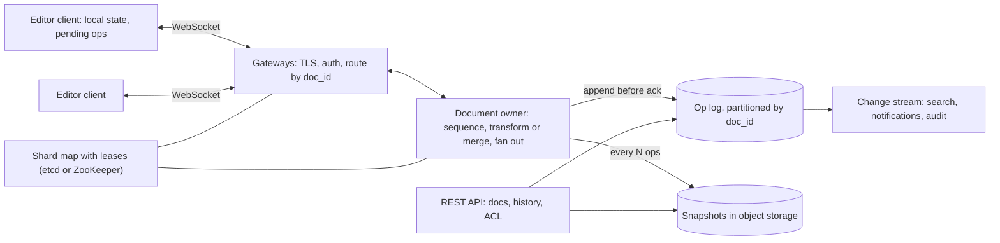

Alice in London and Bob in New York are editing the same sentence. Alice types an "X" after the first letter at the same instant Bob deletes the third. Each sees their own change immediately, because an editor that waits a network round trip to show a keystroke feels broken. Then each receives the other's change, 80 milliseconds late, and applies it to a document that has already moved. If Bob's "delete the character at position 2" is applied literally to Alice's document, it deletes the wrong character, and the two copies have silently diverged.

That is the whole problem in one keystroke. Locking paragraphs is unacceptable UX, last-writer-wins on the whole document throws away someone's work, and "merge at save time" is what people used before real-time collaboration existed. The system has to accept concurrent edits optimistically, guarantee that every copy converges to the same text, preserve each author's intent, and never lose an edit that the user was told was saved.

## Requirements

### Functional

- Create, open and edit rich-text documents; many users editing the same document concurrently.
- Instant local echo; remote edits appear within a fraction of a second.
- Live presence: who is here, where their cursor is, what they have selected.
- Offline editing that merges on reconnect.
- Version history (see and restore earlier versions) and per-document permissions (owner, editor, commenter, viewer).
- Out of scope unless asked: comments threading, search, export formats.

### Non-functional

| Property | Target |
|---|---|
| Convergence | All replicas that have applied the same set of edits show identical content, always |
| Local latency | 0 ms (optimistic apply) |
| Remote latency | p99 under ~300 ms for editors in the same region as the document |
| Durability | An edit acknowledged as saved is never lost |
| Scale | 100 million documents, 10 million daily active users, up to ~100 simultaneous editors per document and many more viewers |
| Availability | 99.9%+ for editing; offline editing continues through outages |

## Back-of-envelope estimates

**Concurrent sessions.** 10 million DAU editing ~30 minutes a day on average: $10^7 \times 30 / 1{,}440 \approx 210{,}000$ concurrent editors on average, ~600,000 at a 3× peak. Add viewers and call it a million open WebSockets at peak. A tuned server holds on the order of 50,000 mostly idle connections, so ~20 gateway nodes for connections alone; run 40 to survive a zone loss.

**Operations.** Suppose 20% of peak editors are actively typing (120,000), each sending ~3 operation batches per second (keystrokes coalesced over ~100 ms). That is ~360,000 ops/s inbound. With ~2 other collaborators on a typical active document, ~720,000 broadcast messages/s outbound. At ~150 bytes per message, about 50 MB/s in and 110 MB/s out. Moderate.

**Per-document rate, the number that decides the architecture.** A document with 50 people typing at once generates $50 \times 3 = 150$ ops/s. One process can sequence that with ease. The aggregate load is large but is the sum of hundreds of thousands of *independent* small streams: there is no cross-document transaction. So the design gives each document a single owner that orders all its operations, and shards documents across owners. Everything that is hard about distributed consensus disappears from the hot path, because each document's order is decided in one place.

**Storage.** The op log at an average ~120,000 ops/s × 100 bytes is 12 MB/s, about 1 TB/day. Keep individual ops for 30 days (30 TB) for fine-grained history, then keep periodic snapshots only. Snapshots: 100 million documents × ~50 KB (text plus editing metadata) = 5 TB. Opening a document reads the latest snapshot plus at most a few thousand ops since it: a few hundred KB, one round trip to storage.

## API design

REST for everything that is not live editing; one [WebSocket](/learn/networking/application-protocols/real-time-transports) per open document for everything that is.

```text
POST /v1/docs                              -> {doc_id}
GET  /v1/docs/{id}                         -> {snapshot, version, acl}
GET  /v1/docs/{id}/history?before=VERSION  -> [{version, author, ts, summary}]
POST /v1/docs/{id}/restore {version}       -> {version}   (a new op that reverts, not a rewrite)
WS   /v1/docs/{id}/session?since=VERSION
```

Messages on the socket:

```json
{"type": "op", "client_id": "c-7f2", "client_seq": 41, "base_version": 1208,
 "ops": [{"retain": 17}, {"insert": "X"}]}

{"type": "op", "version": 1209, "author": "bob", "ops": [{"retain": 19}, {"delete": 1}]}

{"type": "ack", "client_seq": 41, "version": 1210}

{"type": "presence", "user": "bob", "cursor": 19, "selection_end": 19}
```

Three fields carry the design. `base_version` says which document state the client's op was written against, so the server knows what to transform it against. `(client_id, client_seq)` makes resends idempotent: after a reconnect the client resends every unacknowledged op, and the server recognises the ones it already has. And `since=VERSION` on reconnect lets a client that still holds the document receive only the ops it missed, instead of reloading a snapshot.

## Data model

```sql
CREATE TABLE documents (
  doc_id           uuid PRIMARY KEY,
  owner_id         uuid NOT NULL,
  title            text,
  latest_version   bigint NOT NULL,
  snapshot_version bigint NOT NULL,
  snapshot_ref     text NOT NULL          -- object-store key
);

CREATE TABLE doc_ops (
  doc_id     uuid,
  version    bigint,                      -- dense, assigned by the document's owner
  client_id  text NOT NULL,
  client_seq bigint NOT NULL,
  author_id  uuid NOT NULL,
  payload    bytea NOT NULL,
  created_at timestamptz NOT NULL,
  PRIMARY KEY (doc_id, version),          -- a second writer for the same version fails
  UNIQUE (doc_id, client_id, client_seq)  -- a resent op is detected, not reapplied
);

CREATE TABLE doc_acl (doc_id uuid, principal uuid, role text, PRIMARY KEY (doc_id, principal));
```

The op log is append-only and partitioned by `doc_id`; at 1 TB/day it lives in a horizontally scalable store with conditional writes (a sharded relational database, or a wide-column store with lightweight transactions). Snapshots are blobs in object storage. Presence is never persisted: it lives in the owner's memory and dies with the session.

## High-level design



A client opens a document over REST (snapshot plus version) and then connects a WebSocket. The gateway looks up the document's owner in a shard map (consistent hashing over owner nodes, with a lease per document recorded in a coordination service) and forwards the socket's messages to it. The owner holds the document in memory: its current text, the recent ops, and the list of connected sessions. For each incoming op it transforms or merges it against any ops the client had not yet seen, assigns the next version, appends it to the op log, and only then acknowledges the sender and broadcasts to everyone else. Every thousand ops or so it writes a snapshot.

## Deep dives

### Operational transformation versus CRDTs

There are two families of algorithm for making concurrent edits converge, and the choice shapes the server. [CRDTs and collaboration](/learn/system-design/distributed-systems/crdts-and-collaboration) develops both in more depth.

**Operational transformation (OT)** rewrites an incoming operation so that it applies correctly after operations it did not know about. Take the opening example on the text `abc`. Alice inserts `X` at position 1; Bob concurrently deletes position 2 (the `c`).

- At Alice's replica the text is `aXbc`. Bob's delete, applied literally at 2, would remove `b`. Transformed against Alice's insert (an insert at or before position 2 shifts it right), it becomes delete at 3, which removes `c`: result `aXb`.
- At Bob's replica the text is `ab`. Alice's insert at 1 is before Bob's delete position, so it is unchanged: result `aXb`.

Both converge on `aXb`, and both intents survived.

```python
def transform(op, against, op_has_priority):
    """Rewrite op so it applies after `against` has been applied.
    Ops are ("ins", pos, char) or ("del", pos). Ties between two inserts at the
    same position are broken by a deterministic priority, e.g. lower client id."""
    kind, pos = op[0], op[1]
    a_kind, a_pos = against[0], against[1]
    if a_kind == "ins":
        if a_pos < pos or (a_pos == pos and (kind == "del" or not op_has_priority)):
            pos += 1
    else:  # against is a delete
        if a_pos < pos:
            pos -= 1
        elif a_pos == pos and kind == "del":
            return None                 # both deleted the same character
    return (kind, pos) + tuple(op[2:])

transform(("del", 2), ("ins", 1, "X"), False)   # -> ("del", 3)
transform(("ins", 1, "X"), ("del", 2), True)    # -> ("ins", 1, "X")
```

This pairwise function is easy. What makes OT notoriously hard is everything around it: rich-text operations (formatting spans, lists, tables) multiply the cases, and peer-to-peer OT without a central order requires transformation properties that many published algorithms turned out to violate. The practical fix, used by Google Docs according to its engineers' public descriptions, is a **central server that imposes one total order**. In the common design, each client has at most one batch of ops in flight; it transforms incoming server ops against its own pending ops; the server transforms each client op against the ops committed since that client's `base_version`. With a single order, only the simple pairwise property is needed. (Here the server received Bob's op 1209 first, so Alice's op, written against 1208, was transformed against 1209 and became 1210, as in the messages above.)

**CRDTs (conflict-free replicated data types)** avoid transformation by making every edit commute. A sequence CRDT gives every inserted character a globally unique, immutable ID (for example `(replica_id, counter)`) and records inserts as "after character ID p" rather than "at position 2". Concurrent inserts after the same ID are ordered by comparing their IDs, which every replica does identically. Deletes mark a character as a tombstone rather than removing it, so later ops that reference it still resolve. Because merging is commutative, associative and idempotent, replicas converge whatever order they receive edits in, with or without a server.

```viz
{"type": "system", "scenario": "crdt-counter", "nodes": 3,
 "title": "Convergence without coordination, in its simplest form",
 "caption": "A grow-only counter: each replica increments only its own slot and merges by taking the element-wise maximum. Merge order does not matter and repeating a merge changes nothing, so every replica converges. A text CRDT applies the same three properties to characters with unique IDs and tombstones."}
```

The trade-offs, compared honestly:

| | Server-ordered OT | Sequence CRDT |
|---|---|---|
| Needs a central order | Yes | No (a server is still useful) |
| Offline / peer-to-peer | Awkward: long transform chains on reconnect | Natural |
| Per-character overhead | None beyond the text | IDs and tombstones; modern libraries compress runs typed by one author, but overhead remains |
| Implementation risk | Transform functions for every op pair, especially rich text | Mature open-source libraries (Yjs, Automerge) exist |
| Garbage | None | Tombstones need coordinated compaction |

What I would choose: for a product with central servers, permissions and version history, either works, and the server exists regardless. If offline editing and local-first behaviour are real requirements, I pick a mature CRDT library and still run a server that orders, persists and fans out updates. If documents are huge and offline is rare, server-ordered OT has lower memory overhead. Figma has publicly described a middle path for its multiplayer design: server-authoritative and inspired by CRDTs, without full OT. The senior move is to name the requirement that decides, not to declare one family superior.

### One owner per document, fenced

The per-document rate is small, so each document gets exactly one owner process that sequences its ops. That leaves two problems: finding the owner, and making sure there is only ever one.

**Finding it.** Gateways consult a shard map. The owner for a document is chosen by consistent hashing over the live owner nodes and holds a lease on the document in a coordination service. On owner failure, the lease expires (seconds), a new owner acquires it, loads the latest snapshot plus the op log tail, and clients reconnect through the gateway.

**Making sure there is only one.** Leases alone are not enough: an owner that pauses for longer than its lease (a long GC, a VM migration) can wake up still believing it owns the document and try to append. The protection is in the storage layer, not the lease: the op log's primary key is `(doc_id, version)`, and versions are dense. An owner appends version N+1 only if no version N+1 exists. If a new owner has already written N+1, the stale owner's insert fails, and it steps down. The log position is itself the fencing token. [Failure detection and leases](/learn/system-design/distributed-systems/failure-detection-and-leases) explains why leases always need a fence.

```viz
{"type": "system", "scenario": "distributed-lock", "nodes": 3,
 "title": "Why the log, not the lease, is the fence",
 "caption": "A paused holder wakes after its lease has expired and tries to write. Without a fencing check the storage accepts two writers. Here the check is the op log's conditional append on (doc_id, version): the stale owner's write of an already-taken version fails."}
```

**Hot documents.** A company all-hands document with 1,000 editors and 50,000 viewers breaks the naive owner: 3,000 ops/s in, each broadcast to 51,000 sessions, is 150 million messages a second. Three changes fix it. Batch fan-out on a tick (every 50 ms, send each session one message containing all ops since the last tick), which caps messages at 20 per second per session regardless of op rate. Move fan-out off the owner into a relay tier: the owner publishes each tick once to a few dozen relays, and each relay serves thousands of sockets. Throttle presence: send cursor updates at most a few times a second and show only the nearest few dozen cursors. Viewers can tolerate a second of delay; editors cannot.

### Durable acknowledgement, idempotent resend and offline merge

"Saved" must mean durable. The owner acknowledges an op only after the op log append succeeds, and the client keeps every unacknowledged op in a pending buffer (persisted locally, so a browser crash does not lose it). On reconnect, the client asks for ops `since` its last acknowledged version, transforms or merges its pending ops against them, and resends them with their original `(client_id, client_seq)`. The unique constraint on those fields means an op that was durably appended before the connection dropped (but whose ack was lost) is recognised and acknowledged again, not applied twice. This is the idempotency-key pattern applied to keystrokes.

Offline is the same path stretched out. A user who edits on a plane for three hours returns with, say, 5,000 pending ops against version 1,208, while the server has moved to 9,000. With a CRDT, merging is a union of operations, roughly linear in their number. With server-ordered OT, each pending op must be transformed against the 7,792 ops the user missed: millions of pairwise transforms, affordable once but not free, and the intent-preservation of very long divergent histories is where OT merges look strangest to users. This is the strongest argument for CRDTs in products where offline is common.

Version history falls out of the log: every version is replayable from the nearest earlier snapshot. Restoring an old version appends new ops that transform the current text into the old one; it never rewrites history, because other clients' pending ops are based on the current version.

## Failure modes

**Owner crash.** Ops appended but not yet acknowledged are safe in the log; ops received but not appended are lost from the server but still in clients' pending buffers. Clients reconnect, the new owner loads the snapshot plus tail, clients resend, the unique constraint deduplicates. No acknowledged edit is lost.

**Split brain between owners.** Covered by the conditional append: the log accepts exactly one op per version, and the owner that loses the race steps down. Detect: a metric for append conflicts, which should be near zero outside failovers.

**Silent divergence.** A transform bug, or a client applying ops in the wrong order, leaves two replicas different while both believe they are correct. Detect: clients periodically send a hash of their document at a given version; the owner compares with its own. Mitigate: on mismatch, the client discards local state and reloads from the server's snapshot, keeping its pending ops for a re-merge. Log every mismatch; it is a correctness bug, not noise.

**Op log store slow.** Acks slow down; the editor keeps applying locally and shows "saving". Mitigate: cap the pending buffer and warn the user if it stays unacknowledged for more than a few seconds; alert on append latency.

**Reconnect storm.** Deploying a gateway drops 50,000 sockets at once; if every client reloads a snapshot, the snapshot store sees a spike. Mitigate: drain gateways gradually with a "reconnect in N seconds" message, jitter client reconnects, and use `since=VERSION` so reconnecting clients fetch only missed ops.

**Malicious or buggy client.** An op that deletes past the end of the document, or a 50 MB insert, could crash every other replica. Mitigate: the owner validates every op against the current document (positions in range, size limits, role allows editing) before sequencing it, and rate-limits per session.

**Permission revoked mid-session.** The ACL change emits an event; the owner disconnects that user's sessions within seconds and rejects further ops from them.

## Senior follow-ups

**Q: "Why not just lock the paragraph someone is editing?"**

Because it fails on the common case and the edge cases. Two people fixing typos in the same paragraph would block each other, a user who walks away holding a lock needs a timeout, and offline editing is impossible. Locks also create a distributed-lock problem (expiry, fencing) on the hot path of every keystroke. Optimistic concurrency with convergent merging lets everyone type and resolves conflicts at character granularity, where they are rare.

**Q: "If CRDTs converge without a server, why does your design still have one?"**

Because convergence is one requirement of several. The server authenticates and authorises every edit, makes edits durable before saying "saved", fans out to other clients without a peer mesh, produces a single history for versioning and audit, and can compact tombstones because it knows what every client has seen. A CRDT removes the need for the server to *transform*; it does not remove the need for the server.

**Q: "How does undo work when others are editing?"**

Undo must be local: my undo reverts *my* last change, not whoever typed last. The client keeps the inverse of each of its own ops; to undo, it takes that inverse, transforms it against every op applied since (mine and others'), and sends it as a new op. In a CRDT the equivalent is deleting the characters I inserted and re-inserting the ones I deleted, as new operations. Global undo ("revert the document one step") would destroy other people's work and is not what users expect.

**Q: "How would you make this multi-region?"**

Keep one owner per document, placed in a home region, usually where it was created or where most of its editors are. Editors in other regions get instant local echo and an extra ~100–150 ms on remote echo, which is acceptable for text. If the editor population shifts, migrate the document's home: stop accepting ops briefly, snapshot, move the lease. I would not run multiple owners for one document across regions; OT needs a single order, and even with CRDTs, cross-region durability and permission checks become much harder for a small latency gain.

**Q: "How do you handle rich text, not just characters?"**

Formatting is where the simple model gets hard. Represent formatting as marks over ranges anchored to character IDs (CRDT) or as retain-with-attributes operations (OT), and define what happens when someone types at the boundary of a bold span or when two users apply conflicting formats. Published work such as Peritext treats this specifically for CRDTs. Tables and nested lists are trees, which need tree-aware operations; many editors restrict structure to keep transforms tractable. In an interview I would name this as the area where most of the real engineering effort goes.

## Senior signals

- You compute the per-document op rate and conclude that one sequencer per document is enough, which removes consensus from the hot path.
- You explain OT with a worked transform and CRDTs with unique IDs and tombstones, and pick between them by naming the requirement (offline, overhead, rich text) that decides.
- You fence the owner with the storage layer's conditional append, not with the lease alone.
- You define "saved" as durably appended, and make resends idempotent with client sequence numbers.
- You treat the hot document as a fan-out problem and solve it with tick batching, relays and presence throttling.
- You detect divergence with checksums rather than assuming the algorithm is bug-free.

## Check yourself

```quiz
- q: >-
    On the text "abc", Alice inserts X at position 1 while Bob concurrently deletes position 2. What must Bob's delete become when applied at Alice's replica?
  options: ["Delete at 2", "Drop the op", "Delete at 3", "Delete at 1"]
  answer: 2
  explanation: >-
    Alice's insert at position 1 shifts every later character right, so the c that Bob meant is now at index 3. Applying delete-at-2 literally removes b and the replicas diverge. Alice's insert, transformed against Bob's delete, is unchanged because it is before the deleted position.
- q: >-
    Why does the design give each document a single owner process that orders all its operations?
  options: ["One process handles a doc's op rate and gives a single order", "Because the CRDT merge requires a single owner per document", "To cut storage costs by keeping one copy of each document", "Because WebSocket connections cannot be load-balanced"]
  answer: 0
  explanation: >-
    Even a busy document produces a few hundred ops per second. The aggregate load is sharded across owners by document, and within a document one owner imposes a total order, which makes transformation simple and history linear without consensus on every keystroke: that is what makes server-ordered OT tractable. CRDTs are precisely the approach that does not need a single owner.
- q: >-
    An owner pauses for 20 seconds, its lease expires, a new owner takes over, and then the old owner wakes and tries to append version 5001. What prevents two different ops being stored as version 5001?
  options: ["The expired lease stops the old owner from running any more code", "Clients reject messages from the old owner's connection", "A (doc_id, version) primary key makes the append conditional", "Nothing; the CRDT merge resolves the conflict afterwards"]
  answer: 2
  explanation: >-
    A lease cannot stop a paused process from acting on stale beliefs. A conditional write in storage can: the log accepts one op per version, so whichever writer is second fails and steps down. The log position acts as a fencing token.
- q: >-
    A client's connection drops after the server durably appended its op but before the ack arrived. What prevents the op from being applied twice when the client resends it?
  options: ["Insert and delete ops are idempotent by nature", "A unique (doc_id, client_id, client_seq) constraint", "TCP retransmission, which drops duplicate segments", "The client waits for the ack before applying locally"]
  answer: 1
  explanation: >-
    Insert operations are not idempotent: applying one twice inserts the text twice. Client sequence numbers act as idempotency keys, so the server recognises the resend and re-acknowledges it with the original version instead of appending a duplicate. TCP dedupe does not span a dropped connection.
- q: >-
    Offline editing for hours is a core requirement. Which choice does that most strongly favour, and why?
  options: ["Last-writer-wins per document, because it is simple and cheap", "Server-ordered OT, because it carries less metadata", "A sequence CRDT, because any two histories merge by design", "Paragraph locks, because they avoid conflicts entirely"]
  answer: 2
  explanation: >-
    Long divergent histories are where OT is most expensive and its merges most surprising: it must transform every pending op against every missed op. A CRDT merge is commutative and roughly linear in the number of ops. OT's lower metadata overhead is real but is not the deciding factor when offline is a core requirement.
```
