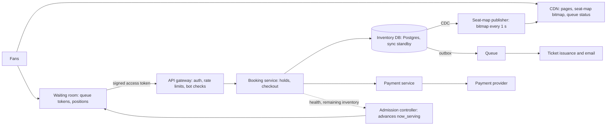

A stadium tour goes on sale at 10:00. There are 50,000 seats and two million people with the page open, hitting refresh at 09:59:59. The system can fail in two opposite ways. It can sell seat 14C in section 112 to two people, which is a refund, a furious customer and a news story. Or it can protect correctness so conservatively, or collapse under the load so completely, that it sells nothing for twenty minutes, which is a different news story.

The data is tiny and the contention is extreme. The whole inventory for the hottest event is 50,000 rows, a few megabytes. The load is concentrated in time (the first five minutes) and on the same keys (the best seats), and 99% of the people generating it will leave with nothing. A design that treats this as e-commerce checkout at larger scale misses the point: the job is to decide who gets to try, and then to make each try atomic.

## Requirements

**Functional.** Browse events and a seat map with near-real-time availability; select up to 8 reserved seats (or a quantity for general admission) and hold them for 10 minutes during checkout; pay, confirm and issue tickets; release holds on expiry or abandonment; for high-demand on-sales, a virtual waiting room that admits users in a fair order. Out of scope: resale, refunds, venue management.

| Property | Target | Note |
|---|---|---|
| Correctness | Never sell a seat twice; never charge for seats not issued | Strong consistency on inventory, per event |
| Hold latency | p99 under 500 ms for admitted users | A slow hold means the seat goes to someone else |
| Seat map freshness | Up to 2 s stale | The hold is the truth; the map is a hint |
| On-sale availability | Keeps selling through the spike; zero confirmed orders lost (RPO 0) | Degrade by queueing, not by erroring |
| Fairness | Roughly first come, first served; no advantage for refreshing or bots | A product requirement with design consequences |

## Back-of-envelope estimates

| Quantity | Arithmetic | Result |
|---|---|---|
| Normal day | $10^6$ tickets ÷ 86,400 s | 12 tickets/s: a CRUD app |
| Orders available | 50,000 seats ÷ 2.5 seats per order | 20,000; $20{,}000 / 2 \times 10^6$ = **1% of fans can succeed** |
| Unqueued seat-map reads | $2 \times 10^6$ refreshing every 5 s | 400,000/s |
| Unqueued hold attempts | $2 \times 10^6$ × 3 tries in the first minute ÷ 60 s | 100,000/s at 50,000 rows, 99% of them doomed |
| Admitted users | 125 admitted per second × a 240 s checkout (Little's law) | 30,000 active users, enough to sell 20,000 orders with abandonment |
| Booking tier load | 30,000 × 10 requests ÷ 240 s | **1,250 requests/s**: 4–6 stateless instances |
| Inventory database | Measured below: 8,000–9,000 durable two-seat holds/s from 32 connections | One primary at ~15% of its capacity, plus a synchronous standby |
| Waiting-room polls | $2 \times 10^6$ ÷ one poll per 20 s | 100,000/s of one cacheable integer per event, served at the edge |
| Seat map bitmap | 50,000 seats × 1 bit | 6.25 KB; at 400,000 reads/s, 2.5 GB/s spread across a CDN |
| Payments | 20,000 orders in ~15 minutes | ~20 calls/s at 1–3 s each, which matters for hold expiry |

**Consequence.** This is a coordination and admission problem, not a data-volume problem. The inventory database never needs sharding within an event; it needs protecting, and the waiting room turns a 100,000/s write problem into 1,250/s.

## API

```text
GET    /v1/events/{id}/seatmap              -> availability bitmap + version (CDN-cached, ~1 s)
POST   /v1/events/{id}/queue                -> {queue_token, position}   (signed, per account)
GET    /v1/queue/status?token=...           -> {position, now_serving, eta} | {access_token}
POST   /v1/events/{id}/holds                {seat_ids | section+quantity}   Authorization: access_token
                                            Idempotency-Key: <uuid>
                                            -> 201 {hold_id, seats, expires_at} | 409 {unavailable_seats}
DELETE /v1/holds/{hold_id}
POST   /v1/holds/{hold_id}/checkout         {payment_method}   Idempotency-Key: <uuid>
                                            -> 202 {order_id, status: "pending"}
GET    /v1/orders/{order_id}                -> {status: pending|confirmed|failed, tickets}
```

Holds are **all-or-nothing**: four friends want four adjacent seats, not three. Both mutating calls take an **Idempotency-Key** ([idempotency and retries](/learn/system-design/building-blocks/idempotency-and-retries)), because the user will click "Buy" three times when the spinner spins. **Checkout is asynchronous**: it returns `pending` and the client polls, because the payment provider's latency is outside your control.

## Data model

```sql
CREATE TABLE seats (
  event_id        bigint,
  seat_id         int,
  section         text, seat_row text, seat_number int, price_tier int,
  status          text NOT NULL DEFAULT 'AVAILABLE',  -- AVAILABLE | HELD | PAYMENT_PENDING | SOLD
  hold_id         uuid,
  hold_expires_at timestamptz,
  order_id        uuid,
  PRIMARY KEY (event_id, seat_id)
);
CREATE TABLE holds  (hold_id uuid PRIMARY KEY, event_id bigint, user_id bigint,
                     seat_ids int[], expires_at timestamptz, status text);
CREATE TABLE orders (order_id uuid PRIMARY KEY, hold_id uuid UNIQUE, user_id bigint,
                     amount_cents bigint, payment_ref text, status text,
                     idempotency_key text UNIQUE);
CREATE TABLE tickets (ticket_id uuid PRIMARY KEY, order_id uuid, event_id bigint, seat_id int,
                      UNIQUE (event_id, seat_id));   -- the last line of defence
```

**Why these keys.** `(event_id, seat_id)` makes a hold a primary-key lookup per seat, and puts one event's rows together so the whole event lives on one shard when events are spread across databases. Seat state lives on the seat row, not only in `holds`, so the claim is one conditional update on the rows being claimed rather than a check across two tables. `orders.hold_id UNIQUE` means one hold can become one order however often checkout is retried. `tickets UNIQUE (event_id, seat_id)` means that whatever bug exists in the application, the database refuses two tickets for one seat. For general admission, inventory is a count: `ga_inventory(event_id, section, bucket, capacity, held, sold)`.

## High-level design



For a flagged high-demand event, every booking request must carry an access token that only the waiting room issues; the booking service verifies its signature locally, so unadmitted traffic never reaches the inventory. The admission controller watches the booking tier's latency and the remaining inventory and advances `now_serving`. Availability flows out of the database by change data capture into a bitmap published to the CDN every second. Confirmed orders write an outbox row in the same transaction ([distributed transactions](/learn/system-design/distributed-systems/distributed-transactions)), and a worker issues tickets and email from it.

## Deep dive: the oversell race, reproduced and fixed

### Check-then-act, measured

Two sessions on Postgres 17 at the default isolation level each read seat 14, wait half a second (the application doing work), then update it and record the hold:

| t (ms) | Session A | Session B | Holds recorded for seat 14 |
|---|---|---|---|
| 0 | `SELECT status` → AVAILABLE | | 0 |
| 102 | | `SELECT status` → AVAILABLE | 0 |
| 503 | `UPDATE … SET hold_id = 'A'`; commit | | 1 |
| 604 | | `UPDATE … SET hold_id = 'B'`; commit | **2**: both users are told the seat is theirs |

The check and the write are separate statements, so the database cannot see that B's decision rests on a stale read. Nothing errors; the oversell is found at the gate.

### One conditional update

```sql
BEGIN;
UPDATE seats
   SET status = 'HELD', hold_id = $1, hold_expires_at = now() + interval '10 minutes'
 WHERE event_id = $2
   AND seat_id = ANY($3)
   AND (status = 'AVAILABLE'
        OR (status = 'HELD' AND hold_expires_at < now()))
RETURNING seat_id;
-- fewer rows returned than requested?  ROLLBACK: the hold is all-or-nothing
COMMIT;
```

The same experiment with this statement on seat 15:

| t (ms) | Session A | Session B |
|---|---|---|
| 0 | `UPDATE … WHERE status = 'AVAILABLE'` returns seat 15 (2 ms); transaction still open | |
| 101 | | Same `UPDATE` blocks on A's row lock |
| 503 | Commits | |
| 510 | | Wakes, re-checks the `WHERE` against A's committed row, finds HELD: **0 rows**, rolls back |

When two transactions update the same row, Postgres makes the second wait for the first and then re-evaluates its predicate against the new version ([MVCC and locking](/learn/databases/relational-fundamentals/mvcc-and-locking)). There is no window between check and write because they are one statement. Use the database's `now()` for expiry so application clocks never matter.

### Under the hood: isolation level and lock order

The re-check is a READ COMMITTED behaviour: the blocked `UPDATE` re-reads the newest committed version of the row and evaluates its `WHERE` on it (the executor's recheck, called EvalPlanQual in the Postgres source). At REPEATABLE READ or SERIALIZABLE the same collision raises `could not serialize access due to concurrent update`, and the application must retry the whole transaction. Both are correct; READ COMMITTED answers in one round trip, which suits a one-statement claim.

Lock order matters for multi-seat holds. Reproduced: session A updated seat 20 then seat 21 while B updated 21 then 20. Both blocked at about 0.3 s; after `deadlock_timeout` (1 s by default) Postgres aborted A, and B got seat 20 1.3 s after it started. During an on-sale that is a one-second stall and a failed hold for every such pair, so lock seats in sorted order (one statement over a sorted list, or `SELECT … ORDER BY seat_id FOR UPDATE` first), and the cycle cannot form.

### Best available without a queue on the best row

"Best available" picks seats for the user inside the claim, which also removes the stale-map race:

```sql
UPDATE seats SET status = 'HELD', hold_id = $1, hold_expires_at = now() + interval '10 minutes'
 WHERE (event_id, seat_id) IN (
   SELECT event_id, seat_id FROM seats
    WHERE event_id = $2 AND section = $3
      AND (status = 'AVAILABLE' OR (status = 'HELD' AND hold_expires_at < now()))
    ORDER BY price_tier DESC, seat_row, seat_number
    LIMIT 4
    FOR UPDATE SKIP LOCKED)
RETURNING seat_id;
```

Without `SKIP LOCKED`, every request ranks the same four seats first and queues on their locks. Measured with 32 connections competing for the best 5,000 seats (1 s holds so seats recycle): plain `FOR UPDATE` ran 590 claims a second at 54 ms and claimed 2,380 seats a second, because a request that waited found its seats taken and returned short; `SKIP LOCKED` ran 11,000 a second at 2.9 ms and claimed all 5,000 seats a second the supply allowed. The next-best unlocked seats are taken instead of waiting for the best.

### What it costs, measured

On the same machine, 32 connections, durable commits, two-seat holds with a 1 s expiry so seats recycle:

| Workload | Attempts/s | Rows claimed/s | Why |
|---|---|---|---|
| Holds spread over 50,000 seats | 7,980–9,120 | ~12,100 | Each success is a durable commit |
| Holds aimed at the best 2,000 seats | 66,600 | ~2,000 | 97% match no rows: a zero-row `UPDATE` writes no WAL, so it commits without a flush |
| GA: one counter row | 377 | – | Every hold serialises on one row lock held through the WAL flush |
| GA: 100 bucket rows, one picked at random | 6,610 | – | 17.5× more, and each bucket still enforces its own capacity |

Contention on the best seats is not a throughput problem: the doomed attempts are the cheap ones. The single counter row is, which is why general admission splits stock into buckets.

| Approach | Verdict |
|---|---|
| Read, check, write in the app | Oversells, as reproduced above |
| Distributed lock per seat (Redis) | A lock with a TTL can have two holders after a pause or failover; safe only with fencing, at which point the database check does the work ([distributed locks](/learn/system-design/distributed-systems/distributed-locks-and-coordination)) |
| Inventory in Redis with a Lua check-and-set | Fast, but asynchronous replication can lose acknowledged holds on failover; a pre-filter, not the record |
| `SELECT … FOR UPDATE` then `UPDATE` | Correct; holds the lock across a round trip |
| **Conditional update** | Correct in one statement; the lock lasts one short transaction |

```viz
{"type": "system", "scenario": "distributed-lock", "nodes": 3,
 "title": "Why a per-seat Redis lock is not the answer",
 "caption": "A client pauses while holding a lease, the lease expires, a second client acquires it, and both believe they own the seat. Only a fencing check at the storage layer saves you, and for seats the storage layer's conditional update already is that check, with no second system to keep consistent."}
```

## Deep dive: a hold, traced through expiry and payment

### Lazy expiry

The `hold_expires_at < now()` clause makes an expired hold claimable by the next person who asks, whether or not a sweeper has run. The sweeper only keeps the seat map accurate; correctness never depends on it. If it stalls, seats show as held a little longer and nothing oversells.

### Choosing the hold length

The hold length trades two losses. Illustratively, suppose genuine checkouts take a lognormal time with a median of 3 minutes (σ = 0.5) and 30% of holds are abandoned. A 5-minute hold times out 15.3% of genuine buyers mid-payment; 7 minutes, 4.5%; 10 minutes, 0.8%; 15 minutes, 0.1%. Meanwhile abandoned holds lock up to 30% of 50,000 seats, 15,000, until they expire, which is the second wave at minute 10 in the on-sale trace. Measure the real checkout-time distribution from the last on-sale and set the hold near its 99th percentile; do not pick a round number.

### The dangerous interleaving

User U holds seats 7 and 8 at 10:00:00; the hold expires at 10:10:00. U clicks Pay at 10:09:58, and the payment provider takes three seconds. Without care, someone claims the seats at 10:10:01 and U pays for seats that belong to another fan. The flow that prevents it ([the payment system](/learn/system-design/case-studies/payment-system) covers the provider side):

| Time | Step | Seats 7, 8 |
|---|---|---|
| 10:09:58.000 | Checkout: `UPDATE seats SET status = 'PAYMENT_PENDING', hold_expires_at = now() + interval '5 minutes' WHERE hold_id = $h AND status = 'HELD' AND hold_expires_at > now()`; 2 rows, so U still owns them | PAYMENT_PENDING, not claimable by the lazy clause |
| 10:09:58.010 | **Authorise**, not capture, with idempotency key = `order_id`: funds reserved, none taken | PAYMENT_PENDING |
| 10:10:01.000 | Another fan tries seat 8: the `WHERE` matches only AVAILABLE or expired HELD rows: 0 rows, 409 | PAYMENT_PENDING |
| 10:10:01.200 | Authorisation approved; one transaction sets SOLD, inserts tickets and an outbox row | SOLD |
| 10:10:01.300 | **Capture** the authorisation; the outbox worker issues tickets and email | SOLD |

Had U clicked at 10:10:00.5, the checkout `UPDATE` would have matched 0 rows (the hold had expired), and U would be told before any card call. If confirmation fails after authorisation, **void** it: the user sees "payment not taken", not a refund days later. A provider timeout is an unknown outcome: query the provider by the idempotency key before deciding, and let a reconciliation job resolve any order stuck in `pending`; PAYMENT_PENDING rows never expire by themselves.

The same idempotency discipline applies at the API: the client generates one key per checkout attempt and reuses it on every retry, and the server stores the key with the resulting order.

```viz
{"type": "system", "scenario": "idempotency-key", "requests": 3,
 "title": "Three clicks, one order",
 "caption": "The first checkout request with a key creates the order and stores the result under that key; retries with the same key return the stored result and never reach the payment provider again."}
```

```exercise
id: seat-holds
title: Holds with lazy expiry and payment
prompt: |
  Implement `booking(hold_s, events)`, processing events in order and returning one
  string per event. Seats start AVAILABLE. Hold ids are never reused.

  - `["hold", t, hold_id, [seat, ...]]`: a seat is claimable at time `t` if it is
    AVAILABLE, or HELD with `expires <= t` (lazy expiry). If every requested seat is
    claimable, mark them all HELD by `hold_id` with `expires = t + hold_s` and return
    `"held"`; otherwise change nothing and return `"unavailable"` (all or nothing).
  - `["checkout", t, hold_id]`: if every seat of the hold is still HELD by `hold_id`
    with `expires > t`, mark them PAYMENT_PENDING and return `"pending"`; otherwise
    return `"expired"`. PAYMENT_PENDING seats are never claimable.
  - `["pay_ok", t, hold_id]` / `["pay_fail", t, hold_id]`: if every seat of the hold is
    PAYMENT_PENDING by `hold_id`, mark them SOLD (return `"sold"`) or AVAILABLE
    (return `"released"`); otherwise return `"invalid"`.
languages: [python, javascript]
entry: booking
starter:
  python: |
    def booking(hold_s, events):
        out = []
        # your code here
        return out
  javascript: |
    function booking(hold_s, events) {
      const out = [];
      // your code here
      return out;
    }
tests:
  - args: [600, [["hold", 0, "h1", [14]], ["hold", 1, "h2", [14]]]]
    expected: ["held", "unavailable"]
    label: two fans race for one seat
  - args: [600, [["hold", 0, "h1", [14, 15]], ["hold", 599, "h2", [15]], ["hold", 600, "h3", [15]], ["checkout", 601, "h1"]]]
    expected: ["held", "unavailable", "held", "expired"]
    label: an expired hold is reclaimed without a sweeper
  - args: [600, [["hold", 0, "h1", [3]], ["hold", 5, "h2", [2, 3, 4]], ["hold", 6, "h3", [2, 4]]]]
    expected: ["held", "unavailable", "held"]
    label: holds are all or nothing
  - args: [600, []]
    expected: []
    label: no events
  - args: [600, [["hold", 0, "h1", [7, 8]], ["checkout", 598, "h1"], ["hold", 700, "h2", [8]], ["pay_ok", 701, "h1"], ["hold", 702, "h3", [7]]]]
    expected: ["held", "pending", "unavailable", "sold", "unavailable"]
    label: payment in flight protects the seats past the hold expiry
    hidden: true
  - args: [600, [["hold", 0, "h1", [7]], ["checkout", 10, "h1"], ["pay_fail", 20, "h1"], ["hold", 21, "h2", [7]], ["pay_ok", 22, "h1"]]]
    expected: ["held", "pending", "released", "held", "invalid"]
    hidden: true
  - args: [60, [["hold", 0, "h1", [1]], ["checkout", 60, "h1"], ["hold", 60, "h2", [1]], ["checkout", 119, "h2"], ["pay_ok", 500, "h2"], ["hold", 501, "h3", [1]]]]
    expected: ["held", "expired", "held", "pending", "sold", "unavailable"]
    label: expiry exactly at t
    hidden: true
hints:
  - "Keep each seat's state, owner and expiry, and each hold's seat list."
  - "Check every seat before changing any; that is what makes a hold all or nothing."
```

## Deep dive: the waiting room

### Fair positions

Users who arrive before the on-sale get a *random* position when it opens; later arrivals are appended in order. Randomising early arrivals removes the advantage of refreshing at 09:59:59.9 or of bots with faster connections. Tokens are signed and bound to an account, so a bot farm needs a thousand verified accounts to hold a thousand places, and per-account limits cap what each place is worth.

The arithmetic of fairness: say a scalper runs 1,000 verified accounts among 1.6 million early arrivals, and the first wave admits 30,000. In arrival order, a bot farm with faster connections can take the first 1,000 places and, at 4 tickets per account, 4,000 tickets. With random positions it expects $1{,}000 \times 30{,}000 / 1{,}600{,}000 \approx 19$ admissions and 75 tickets.

### Cheap waiting, and the on-sale traced

A queued client polls `GET /queue/status` every 15–30 s with jitter. The answer comes from the position inside the signed token (no lookup) and the event's `now_serving` (one cached integer), so two million waiting users cost a small stateless fleet and a CDN, not a database.

| Time | Admission controller | Booking tier |
|---|---|---|
| 09:30 | Queue opens; arrivals get tokens with no position yet | Idle |
| 10:00:00 | 1.6 million early arrivals shuffled into positions 1–1,600,000; later arrivals appended | |
| 10:00–10:04 | Admits 125/s while p99 hold latency stays under 500 ms | Rises to ~1,250 requests/s at 30,000 active users |
| 10:04 | 30,000 admitted; pauses because remaining inventory is fully held or in checkout | Steady |
| 10:10–10:14 | Holds from the first minute expire unused; admits more as seats return | Short second wave |
| ~10:15 | Inventory zero: every queued user is told at once | Drains |

The controller is a token bucket whose refill rate follows feedback: booking-tier latency and error rate, and remaining inventory. Telling queued users "sold out" the moment it is true is a trust requirement, not a nicety.

```viz
{"type": "system", "scenario": "token-bucket", "requests": 10,
 "title": "Admission as a token bucket",
 "caption": "Each admitted user consumes a token; tokens refill at the rate the booking tier can convert users into orders. A burst of queued users drains the bucket and the rest wait at the edge instead of hammering the inventory database."}
```

### Failing closed, and the seat map

If the waiting room or admission controller fails, admit nobody and show a holding page. Failing open sends two million users at a database sized for thirty thousand.

A seat-map publisher consumes the change stream, flips one bit per seat in a 6.25 KB bitmap per event, and publishes it to the CDN with a version number every second; clients discard any version older than the one they hold and overlay their own holds, which they know first. A mostly-sold or mostly-free bitmap compresses to a fraction of its size, and publishing the whole map every second is simpler and cheaper than pushing per-seat deltas to hundreds of thousands of connections ([change data capture](/learn/big-data/streaming/change-data-capture)).

```viz
{"type": "system", "scenario": "cdc",
 "title": "Seat changes out of the database",
 "caption": "The publisher reads committed changes from the write-ahead log rather than asking the booking service to publish them, so every path that changes a seat, including support tools and sweepers, reaches the seat map without a second write that could be forgotten."}
```

## Failure modes

| Failure | Symptom | Diagnosis | Fix |
|---|---|---|---|
| Primary fails mid on-sale | Holds error for tens of seconds | Failover in progress | Synchronous standby (RPO 0); admission pauses on errors; extend hold expiries by the outage |
| Stale seat map | Users click "free" seats and get 409 | Map age vs hold rate | By design; offer "best available", chosen inside the same conditional update |
| Bots and scalpers | Positions and orders concentrated in few payment instruments | Accounts per card, request timing | Randomised early positions, account-bound tokens, per-account limits, pre-registration for extreme events |
| Buy-button retries | Duplicate orders attempted | Same idempotency key seen repeatedly | Keys; `orders.hold_id UNIQUE`; per-token rate limits |
| Mass hold expiry | A lump of seats returns at minute 10 | Released inventory spikes | Admit smoothly as seats return; jitter hold lengths by a few seconds |
| Provider degraded | Authorisations take 20 s or fail | Provider latency per call | Pause admission; PAYMENT_PENDING holds seats; reconciliation resolves stuck orders |
| Sweeper stops | Map shows expired holds as held | Sweeper lag | Nothing breaks, thanks to lazy expiry; alert anyway |
| Hot GA counter | GA holds cap at ~380/s | Lock waits on one row | Bucket rows |

## Trade-offs: what we rejected

| Decision | Chosen | Rejected | Why here | What would flip it |
|---|---|---|---|---|
| Claim | Conditional `UPDATE` | Check-then-act; Redis lock; `FOR UPDATE` | One statement, oversell impossible, short locks | None |
| Inventory store | Postgres with a sync standby | Redis as the record | 1,250 req/s needs no Redis; async replication can lose holds | A pre-filter for doomed requests, never the record |
| Scaling strategy | Admission control | Scale the inventory tier to peak | 99% of peak load cannot succeed | Demand below capacity |
| Expiry | Lazy, in the claim's `WHERE` | Sweeper-driven release | Correct if the sweeper stalls | None |
| Payment | Authorise, confirm, capture or void | Charge, then refund on failure | No money moves for seats not issued | A provider without separate capture |
| Waiting-room failure | Fail closed | Fail open | A database sized for 30,000 meets 2 million | None for flagged events |

## At 10× and 100×

**10× (a stadium tour of 20 dates on sale at once).** Each event's inventory is independent, so events are spread across database shards by `event_id`; the admission controllers bound total admitted traffic, so the booking tier grows with admitted users, not fans. A 20-event on-sale at 1,250 requests/s each is 25,000/s across shards.

**100× (a thousand on-sales on one Saturday morning, 200 million queued fans).** Queue status is 10 million polls a second of cacheable integers, which the CDN absorbs; the risk moves to shared dependencies: the payment provider (20,000 authorisations a second across events) and identity checks for bots. Mega events get a dedicated primary; the rest share shards.

## What real companies describe

Ticketmaster has publicly described Verified Fan, pre-registration that limits high-demand on-sales to vetted accounts. Commercial waiting rooms (Queue-it, Cloudflare Waiting Room) document admitting users at a configured rate and randomising the order of people who arrive before a sale opens. Payment providers document authorise-then-capture and voiding of uncaptured authorisations. Treat these as public descriptions, not current internals.

## Interviewer follow-ups

**"Why not keep the inventory in Redis?"** Model answer: speed is not the constraint once the waiting room exists (1,250 requests a second against a primary measured at 8,000–9,000 holds a second), and Redis's asynchronous replication can lose acknowledged holds on failover, which here means two fans with one seat; use it for the seat map and as a pre-filter. Common wrong answer: "Redis Lua scripts are atomic, so it is safe", which ignores failover.

**"General admission: 80,000 identical tickets."** Model answer: one counter row serialises at the WAL flush rate (measured 377 holds a second); split stock into 100 bucket rows and pick a random bucket with stock (measured 6,610 a second), collapsing buckets as a section sells out so requests do not probe empty ones. Common wrong answer: `SELECT … FOR UPDATE` on the counter, which takes the same lock.

**"Payment succeeded but confirmation failed."** Model answer: with authorise-then-capture that state never reaches the card: void the authorisation; if a capture did happen, mark the order `failed_needs_refund` and refund through the outbox, and let reconciliation find any divergence. Common wrong answer: "retry confirmation until it works", which may hand seats that were meanwhile released to someone else.

**"How do you make the queue fair?"** Model answer: define fair first: randomise everyone who arrived before the opening, arrival order afterwards, tokens bound to verified accounts, per-account limits, and publish the rules. Common wrong answer: strict arrival order, which rewards bots.

**"How do you know it will work at 10:00 on Saturday?"** Model answer: rehearse it: replay two million synthetic users against a production-sized staging stack, check that the admission controller backs off when hold p99 rises, fail the primary over in the middle of the test, and compare sold seats with tickets issued and payments captured afterwards. Common wrong answer: "we autoscale", when the constraint is a single inventory primary that autoscaling does not touch.

**"What consistency does the seat map need?"** Model answer: very little; it is advisory, and a stale map costs some 409s. Strong consistency lives in one place, the conditional update. Common wrong answer: pushing every seat change to every client synchronously.

## What mid-level engineers get wrong

- `SELECT` then `UPDATE`, which oversells exactly as reproduced, silently.
- Scaling the database for 100,000 holds a second that 99% of users cannot win.
- A sweeper that correctness depends on, so a stalled job strands seats or double-books them.
- Capturing payment before confirming seats, turning every confirmation failure into a refund.
- Retrying a timed-out payment with a new idempotency key.
- A waiting room that fails open.
- One counter row for general admission.

## Senior signals

- You notice that 99% of on-sale load comes from users who cannot succeed and size admission from inventory, not from peak traffic.
- You make the check and the write one statement, can show the race it prevents, and back the invariant with a unique constraint.
- You know failed claims are cheap and hot single rows are not, and split counters into buckets.
- You make expiry lazy and protect in-flight payments with a state the claim cannot take.
- You authorise before confirming, capture after, and treat a timeout as unknown.
- You fail the waiting room closed and scope strong consistency to the seat rows.

## Check yourself

```quiz
- q: >-
    Two requests try to hold the same available seat at the same instant using UPDATE seats SET status='HELD' ... WHERE seat_id=14 AND status='AVAILABLE'. What happens?
  options: ["The database raises a deadlock error on both transactions", "The second blocks, re-checks, sees HELD and updates no rows", "Both succeed because they read the row at the same time", "Whichever request has the lower user id wins the seat"]
  answer: 1
  explanation: >-
    Row locking serialises the two updates: the second waits for the first to commit, then re-evaluates its WHERE clause against the committed row, finds it HELD and updates nothing. Because check and write are one statement, there is no window for a race. A SELECT followed by an UPDATE has that window, which the experiment reproduced as two recorded holds.
- q: >-
    Two million users arrive for 50,000 seats, averaging 2.5 seats per order. What is the main design consequence?
  options: ["Put the seats in Redis to handle 100,000 holds per second", "Only ~1% can win; admit users at the rate seats can sell", "Raise the hold time to 30 minutes so checkouts can finish", "Shard the seats table across 100 databases for write load"]
  answer: 1
  explanation: >-
    Only 20,000 orders exist, so 99% of the load is from users who will fail. Admission control, with everyone else waiting cheaply at the edge, turns a 100,000/s write problem into about 1,250/s. Scaling the inventory store to serve doomed requests is the expensive wrong answer.
- q: >-
    Holds aimed at the best 2,000 seats ran at 66,600 attempts a second, while holds spread over all 50,000 seats ran at about 9,000. Why were the contended attempts faster?
  options: ["Hot rows stay in the buffer cache, so each read is quicker", "Postgres batches updates that target the same rows together", "The hot seats were locked, so attempts were queued and skipped", "Most matched no rows, and an update of no rows writes no WAL"]
  answer: 3
  explanation: >-
    Nearly all attempts on the hot seats found them held, updated nothing, and committed without writing WAL or waiting for a flush. Successful holds pay for a durable commit. Failed attempts are the cheap ones, which is why contention on the best seats is not a throughput problem; a single hot counter row is.
- q: >-
    Why does the hold query treat HELD seats with an expired hold_expires_at as claimable?
  options: ["To let a new buyer take over a seat still being paid for", "Because the database has no way to run scheduled jobs", "So correctness does not depend on the background sweeper", "To keep the seat map accurate between sweeper runs"]
  answer: 2
  explanation: >-
    Expired holds are released lazily by the next claimant, so the sweeper only keeps the seat map accurate. A seat in PAYMENT_PENDING is not matched by the clause, so a checkout in progress is never taken.
- q: >-
    A user clicks Pay two seconds before their hold expires, and the provider takes three seconds. What stops another fan claiming the seats meanwhile?
  options: ["Checkout moves the seats to PAYMENT_PENDING, which no claim matches", "The client keeps the hold alive by polling the order status", "The provider's authorisation locks the seats in the database", "The sweeper skips holds whose owners have clicked Pay recently"]
  answer: 0
  explanation: >-
    Checkout's conditional update succeeds only while the hold is live, and moves the seats to a state the lazy-expiry clause does not match, extending the deadline for the payment. The provider knows nothing about seats, polling does not extend holds, and correctness does not depend on the sweeper.
- q: >-
    A general-admission section of 80,000 tickets is one counter row, and holds were measured at 377 per second. What is the standard fix?
  options: ["Move the counter to the application server's memory", "Use SELECT FOR UPDATE on the counter row before updating", "Remove the capacity check and reconcile oversells later", "Split the counter into bucket rows and pick a random one"]
  answer: 3
  explanation: >-
    Updates to one row serialise on its lock, held through the commit's WAL flush; SELECT FOR UPDATE takes the same lock. Splitting stock across 100 rows measured 6,610 holds per second, each bucket still enforcing its own capacity. Removing the check oversells; in-memory counters lose state on a crash.
```
