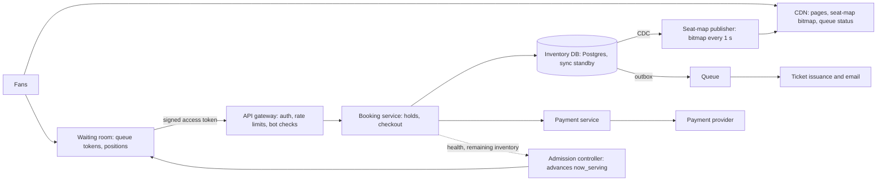

A stadium tour goes on sale at 10:00. There are 50,000 seats and two million people with the page open, hitting refresh at 09:59:59. The system can fail in two opposite ways. It can sell seat 14C in section 112 to two people, which is a refund, a furious customer and a news story. Or it can protect correctness so conservatively, or collapse under the load so completely, that it sells nothing for twenty minutes, which is a different news story.

What makes this problem distinctive is that the data is tiny and the contention is extreme. The whole inventory for the hottest event is 50,000 rows, a few megabytes. The load is concentrated in time (the first five minutes) and on the same keys (the best seats), and 99% of the people generating it will leave with nothing. A design that treats this as a normal e-commerce checkout at larger scale misses the point: the job is to decide who gets to try, and then to make each try atomic.

## Requirements

### Functional

- Browse events; view a seat map with near-real-time availability.
- Select up to 8 seats (reserved seating) or a quantity (general admission), and hold them for a limited time (10 minutes) while checking out.
- Pay, confirm the booking and issue tickets; release holds on expiry or abandonment.
- For high-demand on-sales, a virtual waiting room that admits users in a fair order.
- Out of scope unless asked: resale marketplace, refunds, venue management.

### Non-functional

| Property | Target | Note |
|---|---|---|
| Correctness | Never sell a seat twice; never charge for seats not issued | Strong consistency on inventory, per event |
| Hold latency | p99 under 500 ms for admitted users | A slow "hold" means the seat goes to someone else |
| Seat map freshness | A few seconds stale is acceptable | The hold is the source of truth; the map is a hint |
| On-sale availability | The system keeps selling during the spike | Degrade by queueing, not by erroring |
| Fairness | Roughly first-come-first-served; no advantage for refreshing or bots | A product requirement with design consequences |

## Back-of-envelope estimates

**Normal days.** A million tickets a day is $10^6 / 10^5 \approx 10$ tickets per second. One Postgres primary does this without noticing. If that were the whole problem, the design would be a CRUD app.

**The on-sale, unqueued.** Two million users refreshing the seat map every 5 seconds is $2 \times 10^6 / 5 = 400{,}000$ reads/s. If each tries three holds in the first minute, that is $2 \times 10^6 \times 3 / 60 = 100{,}000$ hold attempts/s, all aimed at 50,000 rows, most at the same few thousand good seats. At an average of 2.5 seats per order there are only 20,000 orders to be had, so $20{,}000 / (2 \times 10^6) = 1\%$ of users can succeed. **99% of that load is people who are going to fail.** Serving it at full cost is pure waste, and it is exactly the load that would take the inventory database down for the 1% who could succeed.

**The on-sale, queued.** Admit users at the rate the inventory can convert them. If an admitted user makes ~10 requests over a ~4-minute checkout and you admit 30,000 users (enough to sell 20,000 orders with some abandonment), the booking tier sees $30{,}000 \times 10 / 240 \approx 1{,}250$ requests/s. One well-indexed Postgres primary handles that. The waiting room converts a 100,000/s write problem into a 1,000/s write problem plus a read problem.

**The waiting room's own load.** Two million queued users polling every 20 seconds is 100,000 requests/s, but each asks one question ("has `now_serving` passed my position?") whose answer is one integer per event. That is a cacheable read, served at the edge.

**Seat map as a bitmap.** 50,000 seats at one bit each is 6.25 KB. Publishing that bitmap once a second to a CDN and letting admitted users poll it costs almost nothing, even at hundreds of thousands of reads per second (6 KB × 400,000/s ≈ 2.4 GB/s at the edge, spread across a CDN).

**Storage and payments.** 50,000 seats × ~100 bytes = 5 MB per event. 20,000 orders over ~15 minutes is ~20 payment calls/s, trivial for a payment provider, though each takes 1–3 s, which matters for hold expiry.

The conclusion: this is a coordination problem and an admission problem, not a data-volume problem. The inventory database never needs sharding *within* an event; it needs protecting.

## API design

```text
GET    /v1/events/{id}/seatmap              -> availability bitmap + version (CDN-cached, ~1 s)
POST   /v1/events/{id}/queue                -> {queue_token, position}   (signed, per account)
GET    /v1/queue/status?token=...           -> {position, now_serving, eta} | {access_token}
POST   /v1/events/{id}/holds                {seat_ids | section+quantity}   Authorization: access_token
                                            Idempotency-Key: <uuid>
                                            -> 201 {hold_id, seats, expires_at} | 409 {unavailable_seats}
DELETE /v1/holds/{hold_id}
POST   /v1/holds/{hold_id}/checkout         {payment_method}   Idempotency-Key: <uuid>
                                            -> 202 {order_id, status: "pending"}
GET    /v1/orders/{order_id}                -> {status: pending|confirmed|failed, tickets}
```

Three decisions are visible here. Holds are **all-or-nothing** for the requested seats: four friends want four adjacent seats, not three. Both mutating calls take an **Idempotency-Key** ([idempotency and retries](/learn/system-design/building-blocks/idempotency-and-retries)), because the user will click "Buy" three times when the spinner spins. And **checkout is asynchronous**: it returns `pending` and the client polls the order, because the payment provider's latency is outside your control and the HTTP request should not be held open for it.

## Data model

```sql
CREATE TABLE seats (
  event_id        bigint,
  seat_id         int,
  section         text, seat_row text, seat_number int, price_tier int,
  status          text NOT NULL DEFAULT 'AVAILABLE',  -- AVAILABLE | HELD | PAYMENT_PENDING | SOLD
  hold_id         uuid,
  hold_expires_at timestamptz,
  order_id        uuid,
  PRIMARY KEY (event_id, seat_id)
);

CREATE TABLE holds  (hold_id uuid PRIMARY KEY, event_id bigint, user_id bigint,
                     seat_ids int[], expires_at timestamptz, status text);

CREATE TABLE orders (order_id uuid PRIMARY KEY, hold_id uuid UNIQUE, user_id bigint,
                     amount_cents bigint, payment_ref text, status text,
                     idempotency_key text UNIQUE);

CREATE TABLE tickets (ticket_id uuid PRIMARY KEY, order_id uuid, event_id bigint, seat_id int,
                      UNIQUE (event_id, seat_id));   -- the last line of defence
```

The `UNIQUE (event_id, seat_id)` on `tickets` is worth pointing out in the interview. Whatever bug exists in the application logic, the database will refuse to issue two tickets for one seat. Invariants that matter this much belong in constraints, not only in code.

For general admission, inventory is a count rather than rows: `ga_inventory(event_id, section, bucket, capacity, held, sold)`, with the bucket column explained in the follow-ups.

## High-level design



Outside an on-sale, the waiting room is bypassed and users go straight to booking. For a flagged high-demand event, every request for that event must carry an access token that only the waiting room issues. The booking service verifies the token's signature and expiry locally, with no database call, so unadmitted traffic never reaches the inventory. The admission controller watches the booking tier's latency and the remaining inventory and advances `now_serving` accordingly. Seat availability flows out of the database by change data capture into a bitmap published to the CDN once a second. Confirmed orders write an [outbox](/learn/system-design/distributed-systems/distributed-transactions) row in the same transaction, and a worker issues tickets and sends email from it, so a crash between "paid" and "emailed" loses nothing.

## Deep dives

### Making double-selling impossible

The options, from worst to best for this workload ([distributed locks](/learn/system-design/distributed-systems/distributed-locks-and-coordination) covers why lock-based designs need fencing):

| Approach | How | Verdict |
|---|---|---|
| Read, check, write in the app | `SELECT status`; if available, `UPDATE` | Race: two requests both read `AVAILABLE` and both write. Never. |
| Distributed lock per seat (Redis) | Lock seat, check, write, unlock | A lock with a TTL can have two holders after a pause or failover, and it is a second system that must agree with the database. Only safe with fencing, at which point the database check is doing the work. |
| Inventory in Redis with an atomic script | Lua check-and-set on a hash of seats | Fast (100,000+ ops/s) but asynchronous persistence and failover can lose acknowledged holds, so it can oversell. Usable as a pre-filter, not as the record. |
| Pessimistic row lock | `SELECT ... FOR UPDATE` then `UPDATE` | Correct; holds locks across a round trip. |
| **Conditional update** | One `UPDATE ... WHERE status is claimable` | Correct, one statement, locks held only for one short transaction. **Use this.** |

```sql
BEGIN;
UPDATE seats
   SET status = 'HELD', hold_id = $1, hold_expires_at = now() + interval '10 minutes'
 WHERE event_id = $2
   AND seat_id = ANY($3)
   AND (status = 'AVAILABLE'
        OR (status = 'HELD' AND hold_expires_at < now()))
RETURNING seat_id;
-- fewer rows returned than requested?  ROLLBACK: the hold is all-or-nothing
COMMIT;
```

Why this is safe: when two transactions try to update the same row, the database (Postgres at its default isolation level, for example) makes the second wait for the first to commit, then re-checks the `WHERE` clause against the row's new version. The second finds `status = 'HELD'` with a future expiry, updates nothing for that seat, returns fewer rows, and rolls back. There is no window between the check and the write because they are the same statement. Two refinements: lock seats in a consistent order (sort the IDs) so two overlapping multi-seat holds cannot deadlock, and use the database's `now()` for expiry so application servers' clocks never matter.

Note the **lazy expiry** in the `WHERE` clause. A hold that has expired is claimable by the next person who asks, whether or not a background sweeper has run. The sweeper exists only to make the seat map accurate; correctness never depends on it.

```viz
{"type": "system", "scenario": "distributed-lock", "nodes": 3,
 "title": "Why a per-seat Redis lock is not the answer",
 "caption": "A client pauses while holding a lease, the lease expires, a second client acquires it, and both believe they own the seat. Only a fencing check at the storage layer saves you, and for seats the storage layer's conditional update already is that check, with no second system to keep consistent."}
```

### The waiting room: admission as the scaling strategy

The waiting room is the component that makes the arithmetic work, so design it properly rather than as a spinner.

**Fair positions.** Users who arrive before the on-sale opens get a *random* position at the moment it opens; users who arrive afterwards are appended in arrival order. Randomising the early arrivals removes the advantage of refreshing at 09:59:59.9 or of running bots with faster connections, which would otherwise win a pure arrival-time race. Tokens are signed and bound to an account, so a bot farm cannot hold a thousand places without a thousand verified accounts, and per-account purchase limits cap what each place is worth.

**Cheap waiting.** A queued user's client polls `GET /queue/status` every 15–30 seconds with jitter. The response is computed from two things: the position inside the signed token (no lookup) and the event's current `now_serving` value (one cached integer). The status tier is stateless and scales horizontally; two million waiting users cost a small fleet, not a database.

**Admission rate from two signals.** The admission controller advances `now_serving` by a rate set by the booking tier's health (p99 latency and error rate, backing off if they rise) and by remaining inventory: admit enough users to sell out allowing for abandonment, then pause, and admit more as holds expire unused. When inventory reaches zero, tell everyone still queued immediately; keeping people waiting for seats that do not exist is a trust failure. The controller is effectively a token bucket whose refill rate is adjusted by feedback.

```viz
{"type": "system", "scenario": "token-bucket", "requests": 10,
 "title": "Admission as a token bucket",
 "caption": "Each admitted user consumes a token; tokens refill at the rate the booking tier can convert users into orders. A burst of queued users drains the bucket and the rest wait at the edge instead of hammering the inventory database."}
```

**Fail closed.** If the waiting room or admission controller fails, admit nobody and show a holding page. Failing open would send two million users straight at a database sized for thirty thousand.

### Holds, payment, and never charging for seats you did not get

The dangerous interleaving: a user's hold expires at 10:10:00; they click "Pay" at 10:09:58; the payment provider takes three seconds; meanwhile someone else claims the seats at 10:10:01. Now one person has paid for seats that belong to another.

The flow that prevents it (the [payment system](/learn/system-design/case-studies/payment-system) case study goes deeper on the provider side):

1. **Checkout moves the hold to `PAYMENT_PENDING`** in a conditional update (only if `hold_id` still matches and the seats are not claimed), extending its expiry by a few minutes. `PAYMENT_PENDING` seats are not claimable by the lazy-expiry clause, so no one can take them while payment is in flight.
2. **Authorise, do not capture.** Call the payment provider with an idempotency key equal to the `order_id`. An authorisation reserves the funds without taking them.
3. **Confirm in the database.** `UPDATE seats SET status='SOLD', order_id=... WHERE hold_id=... AND status='PAYMENT_PENDING'`, insert tickets and an outbox row, commit.
4. **Capture** the authorisation. If step 3 failed for any reason, **void** the authorisation instead; the user sees "payment not taken" rather than a refund days later.

If the call to the provider times out, the outcome is unknown, not failed. Query the provider by the idempotency key before deciding; retrying blindly with a new key is how customers get charged twice. A reconciliation job compares provider records with orders every few minutes and resolves any order stuck in `pending`.

The same idempotency discipline applies at the API. The client generates one key per checkout attempt and reuses it on every retry; the server stores the key with the resulting order, and a repeated request returns the original response instead of creating a second order.

```viz
{"type": "system", "scenario": "idempotency-key", "requests": 3,
 "title": "Three clicks, one order",
 "caption": "The first checkout request with a key creates the order and stores the result under that key; retries with the same key return the stored result and never reach the payment provider again."}
```

## Failure modes

**Database primary fails mid on-sale.** Confirmed orders must not be lost, so the primary replicates synchronously to a standby in another zone (RPO zero), accepting a millisecond or two per commit. Failover takes tens of seconds; the admission controller sees the errors and pauses admission, and hold expiries are extended by the outage duration so users do not lose seats because of your failure.

**Stale seat map.** A user clicks a seat that the one-second-old map shows as free and gets a `409`. That is by design; the map is a hint. Mitigate the UX with a "best available" option where the server picks seats inside the same conditional update, which removes the stale-map race entirely for most users.

**Bots and scalpers.** Automated clients want positions and speed. Mitigate: randomised early positions, signed tokens bound to verified accounts, per-account limits, bot detection at the gateway, and for the most extreme events, pre-registration so that the queue is only for verified fans.

**Retry storms from the Buy button.** Every spinner produces clicks. Mitigate: idempotency keys, disabling the button client-side, and per-token rate limits at the gateway.

**Mass hold expiry.** Thousands of holds created in the first minute all expire at the tenth. Mitigate: the admission controller watches released inventory and admits more users smoothly rather than in a lump, and jittering hold durations by a few seconds spreads the release.

**Payment provider degraded.** Authorisations take 20 seconds or fail. Mitigate: the `PAYMENT_PENDING` extension covers slow calls; beyond that, pause admission (more admitted users would only create more pending payments), and never let a provider failure leave seats stuck in `PAYMENT_PENDING` forever: a reconciliation job resolves them.

**Sweeper stops.** Nothing breaks, thanks to lazy expiry; the map shows expired holds as held a little longer. Alert on sweeper lag anyway.

## Senior follow-ups

**Q: "Why not keep the inventory in Redis? It is much faster."**

Speed is not the constraint once the waiting room exists: the database sees about a thousand requests a second. Redis's persistence is asynchronous by default, and a failover can lose recent writes, which here means two people holding the same seat. I would use Redis for the seat-map cache and possibly as a pre-filter that rejects obviously unavailable seats before they reach the database, but the conditional update in a synchronously replicated database is the record.

**Q: "General admission: 80,000 identical tickets in one section. What changes?"**

The inventory becomes one counter row, and every hold is `UPDATE ... SET held = held + n WHERE sold + held + n <= capacity` on that row. Row updates serialise, so at a few milliseconds per transaction the row caps out at a few hundred to a thousand holds per second. Split the counter into, say, 100 bucket rows of 800 tickets each; a request picks a random bucket with stock and tries another if it is empty. Contention drops by roughly the bucket count, and the invariant (no bucket oversells) still holds in the database. When a section is nearly sold out, collapse the remaining stock into fewer buckets so requests do not probe many empty ones.

**Q: "The payment succeeded but the seat confirmation failed. What happens?"**

With authorise-then-capture, this state never reaches the customer's card: confirmation failure voids the authorisation. If for some reason a capture happened (a bug, a provider that does not support separate authorisation), the order is marked `failed_needs_refund`, the refund is issued automatically through the outbox, and the user is told immediately. The reconciliation job exists to find any order where provider state and our state disagree.

**Q: "How do you make the queue fair?"**

Define fair first. Arrival-order fairness rewards bots and fast connections, so I randomise everyone who arrived before the on-sale and use arrival order after. Tokens bound to verified accounts and per-account limits stop one party holding many places. I would publish the rules to users; perceived fairness matters as much as actual fairness.

**Q: "A thousand events go on sale at 10:00 on the same Saturday. How does this scale?"**

Each event's inventory is independent, so partition by `event_id`: events are spread across database shards, and one mega event gets a dedicated primary. Waiting rooms are per event and stateless apart from the `now_serving` value. The shared components (gateway, payment service, CDN) are sized for the sum of admitted traffic, which the admission controllers bound; it is the unqueued traffic that would have been unbounded.

**Q: "What consistency does the seat map need?"**

Very little: it is advisory. A few seconds of staleness costs some `409`s, which the UI handles with alternatives. Strong consistency lives in exactly one place, the conditional update on the seat rows. Putting the consistency boundary in the right place, and making everything else cheap and cacheable, is the design.

## Senior signals

- You notice that 99% of on-sale load comes from users who cannot succeed and design admission control to shed it, deriving the admitted rate from inventory rather than from peak traffic.
- You make the check and the write one statement, back the invariant with a unique constraint, and say why a distributed lock or Redis inventory is weaker.
- You make expiry lazy, so correctness does not depend on a background job.
- You separate authorisation from capture and know that a payment timeout is an unknown outcome, not a failure.
- You fail the waiting room closed and extend holds when the outage is yours.
- You scope strong consistency to the seat rows and let the seat map be stale.

## Check yourself

```quiz
- q: >-
    Two requests try to hold the same available seat at the same instant using UPDATE seats SET status='HELD' ... WHERE seat_id=14 AND status='AVAILABLE'. What happens?
  options: ["The second waits for the first to commit, re-checks the WHERE clause, finds the seat HELD, and updates nothing", "Both succeed because they read the row at the same time", "The database raises a deadlock error for both", "Whichever has the lower user id wins"]
  answer: 0
  explanation: >-
    Row-level locking serialises the two updates, and the second re-evaluates its condition against the committed row. Because check and write are one statement, there is no window for a race. A separate SELECT followed by UPDATE would have that window.
- q: >-
    Two million users arrive for 50,000 seats, averaging 2.5 seats per order. What is the main design consequence?
  options: ["Shard the seats table across 100 databases", "About 1% of users can succeed, so admit users at the rate inventory can be converted and keep the rest waiting cheaply at the edge", "Put the seats in Redis to handle 100,000 holds per second", "Increase the hold time to 30 minutes"]
  answer: 1
  explanation: >-
    Only 20,000 orders exist, so 99% of the load is from users who will fail. Admission control turns a 100,000/s write problem into roughly 1,000/s. Scaling the inventory store to serve doomed requests is the expensive wrong answer.
- q: >-
    Why does the hold query treat HELD seats with an expired hold_expires_at as claimable?
  options: ["To let users steal each other's seats", "Because the database cannot run scheduled jobs", "To improve the seat map's accuracy", "So correctness does not depend on a background sweeper: expired holds are released lazily by the next claimant"]
  answer: 3
  explanation: >-
    Lazy expiry makes the sweeper an optimisation for the seat map only. If it stalls, seats are still correctly claimable once their hold expires.
- q: >-
    A call to the payment provider times out during checkout. What should the system do?
  options: ["Mark the order failed and release the seats", "Retry immediately with a new idempotency key", "Treat the outcome as unknown and query the provider using the original idempotency key before deciding", "Capture the payment again to be sure"]
  answer: 2
  explanation: >-
    A timeout means the charge may or may not have happened. Retrying with a new key risks a double charge; releasing the seats risks charging for seats the user did not get. The idempotency key lets you ask the provider what actually happened.
- q: >-
    A general-admission section of 80,000 tickets is stored as one counter row, and hold throughput is capped at a few hundred per second. What is the standard fix?
  options: ["Remove the capacity check", "Split the counter into many bucket rows and have each request pick a random bucket with stock", "Use SELECT FOR UPDATE on the row", "Move the counter to the application server's memory"]
  answer: 1
  explanation: >-
    Updates to one row serialise, so throughput is bounded by transaction time. Splitting the stock across N rows divides contention by about N while each bucket still enforces its own capacity in the database. Removing the check oversells; in-memory counters lose state on crash.
```
