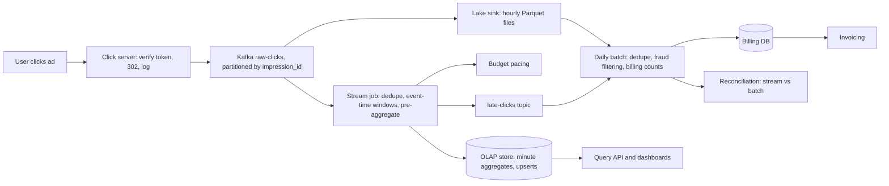

An advertiser pays you every time someone clicks their ad. Every click is money, and a counting error in either direction is a real problem: undercount and you lose revenue; overcount and you have billed a customer for clicks that did not happen, which is a trust problem and in some jurisdictions a legal one. Advertisers also want to see clicks within seconds, because they adjust bids and budgets live, and the ad server needs near-real-time spend to stop showing ads for a campaign that has exhausted its budget.

The tension is between fast and exact. A counter that updates in a second cannot also wait for late data, run a fraud model over a day of traffic, and deduplicate against every click in the past 24 hours. The senior answer is not to pick one. It is to build two paths that share one immutable log, make each path correct for its purpose, and reconcile them.

## Requirements

### Functional

- Record every click: ad, campaign, advertiser, time, placement, coarse location, device, and a user or device key.
- Aggregate clicks per ad per minute, with breakdowns by country and device.
- Query clicks for an ad or campaign over a time range; the top N ads by clicks in the last minute.
- Feed budget pacing: current spend per campaign within seconds.
- Produce billing-grade daily counts per campaign: deduplicated, with invalid (fraudulent or robotic) clicks removed, auditable.

### Non-functional

| Property | Target |
|---|---|
| Volume | 1 billion clicks/day; peaks of 5× average |
| Real-time freshness | Aggregates queryable within ~30 s of the click |
| Accuracy | Billing counts exact after deduplication and fraud filtering; no click counted twice, none lost |
| Late data | Real-time path accepts events up to 5 minutes late; billing path up to 24+ hours |
| Retention | Raw clicks retained for audit (at least 90 days, typically much longer) |
| Ingest availability | 99.99%+: a lost click is lost revenue and a broken user navigation |

## Back-of-envelope estimates

**Rate.** $10^9 / 10^5 = 10{,}000$ clicks/s on average, 50,000/s at peak. For scale: at a 1% click-through rate there are about 100 impressions per click, so the impression pipeline (out of scope here) is 100× larger, which is why click tracking must be designed not to depend on it.

**Bytes.** ~200 bytes per click event: 2 MB/s average, 10 MB/s peak. For Kafka that is small; partitions are chosen for consumer parallelism (say 64), not throughput.

**Raw storage.** $10^9 \times 200$ B = 200 GB/day. Columnar and compressed (~5×), ~40 GB/day, ~15 TB/year. Keeping raw clicks for years is cheap, which matters, because the raw log is the audit trail and the source of truth for every recomputation.

**Aggregates.** With 2 million active ads and 600,000 clicks a minute, perhaps 300,000 (ad, minute) pairs have at least one click. Breaking down by country and device multiplies rows by ~5: 1.5 million rows a minute, 25,000 upserts/s into an OLAP store, ~100 GB/day at ~50 bytes a row. Roll minutes into hours after a week and the long-term footprint drops 60×.

**Stream state.** Windows are small: 300,000 keys × ~6 open windows (1-minute windows kept for 5 minutes of lateness) × ~64 bytes ≈ 115 MB. Deduplication state is the bigger one: remembering every click ID for an hour is $3.6 \times 10^7 \times 16$ B ≈ 600 MB; for 24 hours, ~14 GB before overhead. Spread across 64 parallel tasks with an on-disk state backend, both are fine.

**The pacing number.** Suppose a campaign pays \$1 per click and a live-event ad draws 1,000 clicks/s. A 30-second pipeline delay means the ad server learns about 30,000 clicks, \$30,000 of spend, after they happened. If policy is not to bill past the budget, that overspend is your lost revenue. So the pacing path needs lower latency than the dashboard path for high-velocity campaigns, and a safety margin (stop at 95% of budget) for everything else.

## API design

The click itself is a redirect: the ad's link points at your click server, which records the click and sends the user on to the advertiser.

```text
GET /c?t=<signed impression token>
    -> 302 Location: <landing URL from the ad's metadata>
       (the click is logged asynchronously; logging never delays the redirect)

GET /v1/ads/{ad_id}/clicks?from=&to=&granularity=minute|hour&group_by=country
GET /v1/campaigns/{id}/clicks?date=2026-09-26&source=realtime|billing
GET /v1/top-ads?window=1m&n=100&country=US
```

The signed token carries the impression ID, ad ID and issue time with an HMAC, so the click server can reject forged or replayed clicks without a lookup. The landing URL comes from the ad's metadata, never from a query parameter, or the click server becomes an open redirect for phishing. And the query API exposes `source=realtime|billing` explicitly, because the two numbers will differ for a few hours and the advertiser should know which one they are looking at.

## Data model

The click event, serialised with a schema registry so producers and consumers evolve compatibly:

```json
{"click_id": "c-8f14e45f", "impression_id": "imp-5d41402a", "ad_id": "ad-9",
 "campaign_id": "cmp-3", "advertiser_id": "adv-1",
 "event_time": "2026-09-26T10:00:41.120Z", "received_at": "2026-09-26T10:00:41.180Z",
 "user_key": "u-hash-77", "ip_prefix": "203.0.113.0/24", "country": "US",
 "device": "mobile", "placement": "feed", "token_valid": true}
```

Two timestamps, on purpose: `event_time` is when the click happened (windows use it), `received_at` is when the server saw it (used to bound lateness and to detect clock skew).

Real-time aggregates, in an OLAP store that supports upserts by key:

```text
ad_clicks_minute
  key:    (ad_id, window_start, country, device)
  values: clicks, unique_users_sketch (HyperLogLog), updated_at
```

Billing, in a transactional database: `campaign_billing(campaign_id, date, billable_clicks, invalid_clicks, amount, batch_run_id)`, one row per campaign per day, rewritten atomically by each batch run.

## High-level design



The click server is stateless, runs in every region, and appends events to Kafka with an idempotent producer (`acks=all`); if Kafka is unreachable it spools to local disk rather than dropping or blocking the redirect. The raw topic has two consumers. The **fast path** is a stream processor (Flink-class) that deduplicates, assigns clicks to event-time windows, and upserts minute aggregates into an OLAP store for dashboards and pacing. The **billing path** lands the same raw events in the data lake as hourly Parquet files, and a daily batch job computes the authoritative numbers with the full fraud model. A reconciliation job compares the two.

Partitioning the raw topic by `impression_id` puts every duplicate of a click on the same partition, so deduplication is local to one task with no shuffle; the job then re-keys by `ad_id` for aggregation.

```viz
{"type": "system", "scenario": "kafka-partitions", "nodes": 3, "keys": ["imp-51", "imp-07", "imp-51", "imp-93", "imp-07", "imp-22"],
 "title": "Duplicates land together",
 "caption": "Keying by impression ID sends a double-click's two events to the same partition and the same consumer, so a local 'seen' check catches it. Ordering is guaranteed within a partition, not across partitions, which is why aggregation re-keys by ad and uses event-time windows rather than arrival order."}
```

## Deep dives

### Event time, windows and watermarks

A click at 10:00:58 belongs to the 10:00 minute even if it reaches the stream job at 10:01:05 because an edge buffer flushed late, or at 10:40 because a region's Kafka mirror was lagging. Counting by *processing time* (when the job saw it) would put it in the wrong minute, and after any outage it would pile an hour of clicks into the minute the job recovered, a spike that never happened. So windows are defined on **event time**. [The stream processing model](/learn/big-data/streaming/stream-processing-model) covers windows and watermarks in general.

Event time creates a question processing time never had: when is the 10:00 window *complete*? The job never knows for certain that no more 10:00 clicks are coming. A **watermark** is its declared assumption: "I believe I have seen all events with event time ≤ W". A common policy is W = (maximum event time seen) − (bounded out-of-orderness), say 30 seconds. The window [10:00, 10:01) fires when the watermark passes 10:01:00, that is, once a click stamped 10:01:30 or later has arrived.

Worked through:

| Arrives at | Event time | Max event time seen | Watermark | Effect on [10:00, 10:01) |
|---|---|---|---|---|
| 10:00:52 | 10:00:50 | 10:00:50 | 10:00:20 | counted, window open |
| 10:01:05 | 10:00:58 | 10:00:58 | 10:00:28 | counted, window open |
| 10:01:25 | 10:00:40 | 10:00:58 | 10:00:28 | counted (out of order, but the window is still open) |
| 10:01:31 | 10:01:30 | 10:01:30 | 10:01:00 | **window fires, count emitted** |
| 10:03:00 | 10:00:45 | ... | ~10:02:30 | late: within 5-minute allowed lateness, count updated and re-emitted |
| 10:09:00 | 10:00:33 | ... | ~10:08:30 | too late: sent to the late-clicks topic for the batch path |

The bounded delay trades latency for completeness: a 30-second bound means results are at least 30 seconds behind; a 5-second bound fires sooner and sends more clicks down the late path. Allowed lateness keeps window state around so stragglers can *correct* an already-emitted result, which only works because the sink accepts overwrites, as the next deep dive requires.

```viz
{"type": "system", "scenario": "watermarks",
 "title": "When is a window complete?",
 "caption": "The watermark trails the maximum event time seen by a fixed bound. An out-of-order event that arrives before the watermark passes its window's end is counted normally; one that arrives after is late and is either used to correct the result or diverted."}
```

One production trap: the job's watermark is the *minimum* across its input partitions. A partition that receives no data (a quiet region at night) holds the watermark back and stops every window from firing. Stream processors provide an idleness timeout that excludes silent partitions; configure it, or dashboards freeze at 3 a.m. for reasons nobody can see.

### Counting each click once

Exactly-once *delivery* does not exist across a network; what you can build is an exactly-once *effect*: every click contributes once to the result, however many times it was transmitted. Duplicates come from four places, and each needs its own defence.

1. **The user.** A double-click, or a back-and-click-again, produces two genuine requests. Billing policy defines one billable click per impression within a time window, so dedupe on `impression_id`. The stream job keeps a keyed "seen" set with a TTL (an hour for the fast path); the batch path dedupes over the full day.
2. **The click server's retries to Kafka.** A timeout after the broker wrote the event causes a resend. Kafka's idempotent producer ([Kafka internals](/learn/big-data/streaming/kafka-internals)) attaches a producer ID and sequence number so the broker discards the duplicate.
3. **The stream job's own restarts.** The job periodically checkpoints its state (window counts, the seen set) together with the Kafka offsets it has consumed, as one consistent snapshot. After a crash it restores the snapshot and re-reads from those offsets, so every event after the checkpoint is processed again, against state that has not yet seen it. State stays exactly-once.
4. **The sink.** Replayed events produce results that were already written. If the sink *adds*, they are counted twice. So the sink must be idempotent: write the window's absolute count keyed by window, not an increment.

```sql
-- Wrong: a replay after a crash adds the same 37 clicks again
UPDATE ad_clicks_minute SET clicks = clicks + 37
 WHERE ad_id = 'ad-9' AND window_start = '2026-09-26 10:00' AND country = 'US';

-- Right: the job emits the window's full count; a replay overwrites with the same value
INSERT INTO ad_clicks_minute (ad_id, window_start, country, clicks, updated_at)
VALUES ('ad-9', '2026-09-26 10:00', 'US', 412, now())
ON CONFLICT (ad_id, window_start, country)
DO UPDATE SET clicks = EXCLUDED.clicks, updated_at = EXCLUDED.updated_at;
```

This is the single most important line in the design: absolute values keyed by window make replays harmless and make late corrections natural. Where the sink is another Kafka topic, transactional producers achieve the same by committing output and offsets atomically. [Exactly-once semantics](/learn/system-design/distributed-systems/exactly-once-semantics) covers the mechanics in depth.

### Two paths and a reconciliation

Why not make the stream the billing system? Three reasons, each concrete.

- **Fraud detection needs time and context.** Invalid traffic (bots, click farms, accidental clicks within a second of page load) is detected with models that look at a device's behaviour over hours, IP reputation, and patterns across campaigns. That is a batch computation over a day of data.
- **Lateness has a long tail.** SDKs that batch clicks while offline, and regional outages, deliver clicks hours late. The fast path cannot keep windows open for a day; the batch path simply runs after the day closes (with a grace period) over everything that arrived.
- **Reproducibility.** An invoice must be recomputable from immutable inputs by a deterministic job. A batch run over Parquet files with a recorded code version is exactly that; a stream's output depends on timing.

So the fast path is **correct for its purpose**: dashboards and pacing, where a count that is 0.5% high for a few hours is acceptable and seconds of freshness is essential. The batch path is **authoritative for money**. Once the batch for a day completes, its numbers overwrite the real-time aggregates for that day (a "restatement"), and the dashboard labels which source it shows.

Reconciliation compares the two per campaign per hour. The expected difference is the invalid-click rate plus late arrivals; alert when it deviates, for example when the stream is more than 1% below the batch (the stream is losing events) or when the difference for one campaign jumps (a fraud attack, or a dedupe bug). Reconciliation is how you find the bugs that exactly-once machinery was supposed to prevent.

The alternative, a single streaming codebase that also recomputes billing by replaying the retained Kafka log (the Kappa architecture), is attractive because it avoids maintaining two implementations of the counting logic. It works when the fraud logic can run in the stream and the log is retained long enough to replay a month. Many teams land in between: one shared library for the counting rules, invoked by both a streaming job and a batch job, so the logic cannot drift. [Lambda vs Kappa](/learn/big-data/streaming/lambda-vs-kappa) develops the trade-off.

## Failure modes

**Stream job crash.** Restore from the last checkpoint and replay; idempotent upserts make the replay invisible. The real risk is recovery time: after a 10-minute outage the job must process 10 minutes of backlog while keeping up with live traffic, so provision catch-up capacity of at least 2–3× normal throughput and alert on consumer lag.

**Broker failure.** Replication factor 3, `min.insync.replicas=2` and `acks=all` mean an acknowledged click survives the loss of any one broker. The click server's local spool covers the rare case where Kafka is unavailable altogether.

**Frozen watermark.** An idle partition stalls every window. Detect: watermark lag metric (wall clock minus watermark). Mitigate: idleness timeouts, and a "data delayed" banner on dashboards rather than silently stale numbers.

**Click server outage.** Clicks are lost and, worse, users clicking an ad get an error instead of the advertiser's page. This is the most availability-critical component: stateless, deployed in every region behind anycast or geo-DNS, with no synchronous dependency except its signing key.

**Fraud flood.** A botnet generates a million clicks on one campaign. Do not drop at ingest: the evidence is what the fraud model needs. Instead, score clicks in the stream by velocity per IP prefix and device, tag the suspicious ones so pacing does not exhaust the victim's budget, and let the batch path exclude them from billing.

**Device clock skew.** SDK-reported event times can be hours off. Clamp `event_time` to a window around `received_at` (for example, no earlier than 24 hours before and no later than 1 minute after) and flag clamped events.

**Schema change breaks consumers.** A producer renames a field and the stream job fails to deserialise. Mitigate: a schema registry that rejects incompatible changes at publish time.

## Senior follow-ups

**Q: "Why not just `INCR` a Redis key per ad per minute?"**

At 50,000/s it would keep up, and for a prototype it is fine. But it is not billing-grade: an `INCR` is not idempotent, so every retry and replay double-counts; there is no deduplication; it uses arrival time unless you compute windows yourself; and a Redis failover can lose recent increments. Most importantly there is no replayable source of truth. Put the immutable log first, and derive every counter from it.

**Q: "A click arrives three days late. What happens?"**

The fast path has long since closed that window and sends the click to the late topic. The batch path for that day has already run, so it depends on policy: most systems close a day for billing after a fixed grace period (say 48 hours) and either drop later clicks or credit them to the current period. What matters is that the policy is explicit, applied consistently, and visible in reconciliation. I would also measure how many clicks arrive that late; if it is material, the grace period is wrong.

**Q: "Advertisers want unique users per campaign per day. How?"**

Exact distinct counts require remembering every user key per campaign, which is expensive at this scale. A [HyperLogLog](/learn/advanced-data-structures/probabilistic-structures/count-min-sketch-and-hyperloglog) sketch with $2^{14}$ registers uses about 12 KB and has a standard error of $1.04 / \sqrt{16{,}384} \approx 0.8\%$. Sketches merge by taking the maximum per register, so per-minute sketches roll up into hourly and daily ones, and per-country sketches merge into a global one, without double-counting users who appear in several. For billing-grade unique counts, the batch job can compute exact values from the lake.

**Q: "How do you compute the top 100 ads in the last minute?"**

After re-keying by `ad_id`, each ad's minute count lives in exactly one task. Each task keeps a heap of its local top 100 when the window fires; a final single-parallelism step merges 64 × 100 candidates and takes the top 100. That is exact because each ad's count is complete in one place. If the job pre-aggregates across tasks to relieve hot keys, the merge happens after partials are combined. [Top K frequent elements](/practice/top-k-frequent) is the in-memory version.

**Q: "How do you convince an advertiser that the invoice is right?"**

By making it reproducible: the raw click log is immutable and retained, the batch job is versioned, and any day can be recomputed and must produce the same number. Provide a click-level report on request, so they can compare against their own landing-page analytics, and explain the documented invalid-traffic rules. Reconciliation history shows the stream and batch paths agreeing within the expected margin over time, which is evidence the counting is stable.

**Q: "Traffic grows 100×, to 1 million clicks a second. What breaks first?"**

Hot keys and the dedupe state. A viral ad at 10% of traffic is 100,000 clicks/s on one key, too much for one task; pre-aggregate per task before the shuffle (each task emits a partial count per window per ad, so one ad costs one message per task per minute rather than one per click), or salt the key into N sub-keys and merge. Dedupe state for 24 hours grows past a terabyte ($8.6 \times 10^{10}$ IDs × 16 bytes); shorten the fast path's dedupe window and leave full-day dedupe to batch. Kafka scales by partitions; the OLAP store by rolling up older data more aggressively.

## Senior signals

- You separate the fast path (dashboards, pacing) from the billing path and make each correct for its purpose, with reconciliation between them.
- You window on event time, explain watermarks and allowed lateness with numbers, and know about idle partitions stalling watermarks.
- You achieve an exactly-once effect by composing idempotent production, checkpointed state and idempotent (absolute-value) sinks, and you name every source of duplicates.
- You treat the raw log as the immutable source of truth and design everything else as a derivation from it.
- You quantify pacing overspend from pipeline latency and design the pacing path's latency accordingly.
- You make policy explicit where the technology cannot decide: billable-click rules, late-click cut-offs, and which number the advertiser sees.

## Check yourself

```quiz
- q: >-
    After a 20-minute stream job outage, the job recovers and processes the backlog. If windows use processing time, what goes wrong?
  options: ["Nothing; the counts are identical", "Clicks are lost", "Twenty minutes of clicks are counted in the minute the job recovered, producing a false spike and empty minutes before it", "Kafka rejects the old events"]
  answer: 2
  explanation: >-
    Processing-time windows assign events by when the job sees them, so a backlog lands in the recovery minute. Event-time windows assign each click to the minute it happened, regardless of when it is processed.
- q: >-
    The watermark policy is max event time seen minus 30 seconds. When does the window [10:00, 10:01) fire?
  options: ["At 10:01:00 wall-clock time", "When an event with event time at or after 10:01:30 has been seen, pushing the watermark past 10:01:00", "When 1,000 events have arrived", "Only after allowed lateness expires"]
  answer: 1
  explanation: >-
    The watermark is derived from event times, not wall-clock time. It reaches 10:01:00 once the maximum event time is 10:01:30. Allowed lateness governs corrections after firing, not the first firing.
- q: >-
    The stream job restarts from a checkpoint and reprocesses 2 minutes of events. Which sink design keeps the minute counts correct?
  options: ["Upsert the window's absolute count keyed by (ad_id, window_start, dimensions)", "UPDATE clicks = clicks + n for each window", "Append every result as a new row and sum at query time", "Disable checkpoints to avoid replays"]
  answer: 0
  explanation: >-
    Replays re-emit results. Increments double-count them; absolute counts keyed by window overwrite with the same value, so the replay is harmless. Appending rows and summing has the same double-counting problem as increments.
- q: >-
    Why is the billing number computed by a daily batch job rather than taken from the real-time stream?
  options: ["Batch jobs are always more accurate than streams", "Streams cannot count", "The stream is too expensive to run", "Fraud filtering needs a day of context, late clicks have a long tail, and invoices must be reproducible from immutable inputs"]
  answer: 3
  explanation: >-
    Each reason is a property of the billing requirement, not a general claim about batch versus streaming. The stream is correct for dashboards and pacing; the batch path is authoritative for money, and reconciliation keeps them honest.
- q: >-
    Dashboards stop updating every night at 3 a.m. although clicks are still arriving in most regions. What is the most likely cause?
  options: ["Kafka deletes data at night", "An idle partition from a quiet region is holding back the job's watermark, which is the minimum across partitions", "The OLAP store is compacting", "Clock skew on the click servers"]
  answer: 1
  explanation: >-
    The operator's watermark is the minimum of its inputs' watermarks, so one partition with no events stops every window from firing. An idleness timeout excludes silent partitions from the minimum.
```
