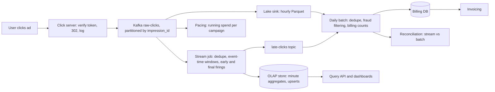

An advertiser pays you every time someone clicks their ad. Every click is money, and a counting error in either direction is a real problem: undercount and you lose revenue; overcount and you have billed a customer for clicks that did not happen, which is a trust problem and in some jurisdictions a legal one. Advertisers also want to see clicks within seconds, because they adjust bids and budgets live, and the ad server needs near-real-time spend to stop showing ads for a campaign that has exhausted its budget.

The tension is between fast and exact. A counter that updates in seconds cannot also wait for late data, run a fraud model over a day of traffic, and deduplicate against every click in the past 24 hours. The senior answer is not to pick one. It is to build two paths that share one immutable log, make each correct for its purpose, and reconcile them.

## Requirements

### Functional

- Record every click: ad, campaign, advertiser, time, placement, coarse location, device, and a user or device key.
- Aggregate clicks per ad per minute, with breakdowns by country and device; the top N ads in the last minute.
- Feed budget pacing: current spend per campaign within seconds.
- Produce billing-grade daily counts per campaign: deduplicated, invalid (fraudulent or robotic) clicks removed, auditable.

### Non-functional

| Property | Target |
|---|---|
| Volume | 1 billion clicks/day; peaks of 5× average |
| Real-time freshness | Dashboard aggregates within ~30 s of the click; pacing within a few seconds |
| Accuracy | Billing counts exact after dedupe and fraud filtering; no click counted twice, none lost |
| Late data | Real-time path accepts clicks up to 5 minutes late; billing path up to 48 hours |
| Retention | Raw clicks at least 90 days for audit, typically years |
| Ingest availability | 99.99%+: a lost click is lost revenue and a broken navigation for the user |

## Back-of-envelope estimates

| Quantity | Arithmetic | Result |
|---|---|---|
| Click rate | $10^9$ ÷ 86,400 s | 11,600/s average, **58,000/s at peak**; impressions (~100 per click at a 1% click-through rate) are 100× larger, so click tracking must not depend on them |
| Event bytes | 11,600/s × ~200 B | 2.3 MB/s, 11.6 MB/s peak: small for Kafka; 64 partitions are chosen for consumer parallelism, not throughput |
| Kafka disk | 2.3 MB/s × 7 days × 3 replicas | 4.2 TB |
| Raw storage | $10^9$ × 200 B, ~5× columnar compression | 200 GB/day raw, 40 GB/day as Parquet, ~15 TB/year: keeping the audit trail for years is cheap |
| Aggregate rows | ~300,000 (ad, minute) pairs with a click × ~5 country/device breakdowns | 1.5 million rows/min = 25,000 upserts/s; ~108 GB/day at 50 B/row, 60× less once minutes roll into hours after a week |
| Window state | 300,000 keys × ~6 open 1-minute windows (5 minutes of lateness) × 64 B | ~115 MB |
| Dedupe state | IDs × 16 B: 1 hour at average rate / peak rate / 24 hours | 670 MB / 3.3 GB / 16 GB before store overhead |
| Stream tasks | 58,000/s ÷ 64 tasks | ~900 events/s per task at peak; with 2–3× catch-up headroom that is a handful of machines, sized by state and recovery speed, not CPU |
| Click servers | HMAC verification measured at 0.7 µs in CPython; 58,000/s over ~30 instances | CPU is negligible (~2,000 clicks/s per instance at peak); the count is set by regions and availability, not load |

**The pacing number.** A campaign paying \$1 a click on a live-event ad draws 1,000 clicks/s. If the ad server learns about spend 30 s late, it has spent \$30,000 it did not know about. **Consequence: pacing reads the raw stream with a running counter (seconds of latency, no fraud filtering) and stops at ~95% of budget; it does not wait for minute windows.** Each pacing task pre-aggregates spend per campaign and pushes totals to the ad server's budget store every 1–2 s, which bounds the blind spot on that campaign to 1,000 × 2 s × \$1 = \$2,000, and the 5% margin absorbs it.

## API

The click itself is a redirect: the ad links to your click server, which records the click and sends the user on.

```text
GET /c?t=<signed impression token>
    -> 302 Location: <landing URL from the ad's metadata>
       (the click is logged asynchronously; logging never delays the redirect)

GET /v1/ads/{ad_id}/clicks?from=&to=&granularity=minute|hour&group_by=country
GET /v1/campaigns/{id}/clicks?date=2026-09-26&source=realtime|billing
GET /v1/top-ads?window=1m&n=100&country=US
```

The signed token carries the impression ID, ad ID and issue time with an HMAC, so the click server rejects forged or replayed clicks without a lookup. The landing URL comes from the ad's metadata, never from a query parameter, or the click server becomes an open redirect for phishing. `source=realtime|billing` is explicit because the two numbers differ for a day, and the advertiser should know which one they are reading.

## Data model

```json
{"click_id": "c-8f14e45f", "impression_id": "imp-5d41402a", "ad_id": "ad-9",
 "campaign_id": "cmp-3", "advertiser_id": "adv-1",
 "event_time": "2026-09-26T10:00:41.120Z", "received_at": "2026-09-26T10:00:41.180Z",
 "user_key": "u-hash-77", "ip_prefix": "203.0.113.0/24", "country": "US",
 "device": "mobile", "placement": "feed", "token_valid": true}
```

Two timestamps on purpose: `event_time` is when the click happened (windows use it); `received_at` is when the server saw it (bounds lateness, exposes clock skew). The raw topic is partitioned by `impression_id`, so every duplicate of a click lands on one partition and one task and dedupe needs no shuffle; aggregation then re-keys by `ad_id`. Keying the raw topic by `ad_id` instead would put a viral ad's entire traffic on one partition.

```text
ad_clicks_minute  (OLAP store with upserts)
  key:    (ad_id, window_start, country, device)
  values: clicks, unique_users_sketch (HyperLogLog), is_final, updated_at

campaign_billing  (transactional database)
  (campaign_id, date) -> billable_clicks, invalid_clicks, amount, batch_run_id
```

The OLAP key *is* the window, which is what makes replays harmless (deep dive 3). An OLAP store (Pinot or Druid class) rather than Postgres, because dashboards group 30 days of a campaign's rows by country and device while 25,000 upserts a second arrive: columnar segments answer that scan in milliseconds, and a row store would need an index per grouping. Billing rows are rewritten whole by each batch run, tagged with the run that produced them.

## High-level design



The click server is stateless, runs in every region, and appends to Kafka with an idempotent producer (`acks=all`); if Kafka is unreachable it spools to local disk rather than dropping or blocking the redirect. The raw topic feeds three consumers: the **fast path** (a Flink-class job) for dashboards, **pacing**, and the **billing path**, which lands hourly Parquet files for a daily batch job with the full fraud model.

```viz
{"type": "system", "scenario": "kafka-partitions", "nodes": 3, "keys": ["imp-51", "imp-07", "imp-51", "imp-93", "imp-07", "imp-22"],
 "title": "Duplicates land together",
 "caption": "Keying by impression ID sends a double-click's two events to the same partition and consumer, so a local seen check catches it. Ordering holds within a partition, not across partitions, which is why aggregation re-keys by ad and windows on event time."}
```

## Deep dive: one click, end to end

A user taps an ad for `ad-9` at 10:00:41.120 on a phone in the US.

| Time | Where | What happens | What it depends on |
|---|---|---|---|
| 10:00:41.120 | Phone | Taps; the browser requests `/c?t=…` | |
| +~100 ms | Click server | Cold mobile connection plus request; HMAC check, landing URL from an in-memory ad cache, event handed to the producer buffer, `302` after ~1 ms of server time | The mobile round trip, not the server |
| +~20 ms | Kafka | Producer waits up to 5 ms to batch, then `acks=all`; durable on the in-sync replicas | In-region replication |
| +~50 ms | Stream task 17 | Fetches from its partition; dedupe lookup on `imp-5d41402a` in the state store (tens of µs), not seen; stored with a 1-hour TTL | Consumer fetch |
| +≤100 ms | Shuffle | Re-keyed by `ad_id` to the aggregation task; network buffers flush at least every 100 ms | Buffer timeout |
| 10:00:41.4 | Window | Count for (`ad-9`, [10:00, 10:01), US, mobile) increments | |
| 10:00:50 | Early firing | A processing-time trigger emits the partial count every 10 s: upsert `clicks = 342, is_final = false` | Trigger interval |
| +~1–2 s | OLAP | Real-time ingestion makes the row queryable | Store ingestion lag |
| ≤10:01:02 | Dashboard | A 10 s poll shows 342: **the click is visible 10–20 s after the tap** | Poll interval |
| 10:01:30 | Final firing | The watermark passes 10:01:00; the job upserts `clicks = 412, is_final = true` | Watermark bound (30 s) |
| 10:06:30 | State dropped | Allowed lateness ends; later clicks for 10:00 go to the late topic | Allowed lateness (5 min) |
| 48 h later | Batch | The billing count for `cmp-3` is computed from Parquet over the whole day, late clicks included, and replaces the real-time rows | The 48-hour grace period for late data |

### Early firings, and a click that was never logged

The early firing is the design point people miss: with a 30 s watermark bound, a click at 10:00:01 would not appear until 10:01:30, 89 s later, which breaks the 30 s freshness target. Emitting partial counts on a processing-time trigger and a final count on the watermark gives both freshness and completeness. The [Dataflow model paper](https://www.vldb.org/pvldb/vol8/p1792-Akidau.pdf) composes exactly this trigger (a repeating one-minute processing-time trigger until the watermark, the watermark itself, then a repeat for each late arrival), and Apache Beam exposes it as early and late firings around the watermark trigger.

**The edge case.** The redirect returns before the event is durable, so a click server that crashes loses whatever sits in its producer buffer. At ~2,000 clicks/s per instance and a 5 ms batching delay, that is about 10 clicks per crash, plus anything queued behind a slow broker. Writing each click to a local append-only file before answering closes the gap at the cost of a disk write on the redirect path; most designs accept the small loss and make it visible by reconciling click-server request logs against the topic.

```viz
{"type": "system", "scenario": "stream-windowing",
 "title": "Tumbling one-minute windows",
 "caption": "Each click is assigned to the window containing its event time, not its arrival time. Partial results can be emitted while a window is open; the final result is emitted when the watermark says the window is complete."}
```

## Deep dive: event time, watermarks and late clicks

A click at 10:00:58 belongs to the 10:00 minute even if the job sees it at 10:01:05 or at 10:40 after a regional mirror lagged. Counting by *processing time* would misplace it, and after an outage would pile an hour of clicks into the recovery minute. When is [10:00, 10:01) *complete*? The job never knows. A **watermark** is its declared assumption: "I have seen everything with event time ≤ W". With W = max event time seen − 30 s ([the stream processing model](/learn/big-data/streaming/stream-processing-model)):

| Arrives at | Event time | Max seen | Watermark | Effect on [10:00, 10:01) |
|---|---|---|---|---|
| 10:00:52 | 10:00:50 | 10:00:50 | 10:00:20 | Counted, window open |
| 10:01:05 | 10:00:58 | 10:00:58 | 10:00:28 | Counted |
| 10:01:25 | 10:00:40 | 10:00:58 | 10:00:28 | Counted (out of order, window still open) |
| 10:01:31 | 10:01:30 | 10:01:30 | 10:01:00 | **Final firing** |
| 10:03:00 | 10:00:45 | ~10:03:00 | ~10:02:30 | Late but within 5 minutes' allowed lateness: count corrected and re-emitted |
| 10:09:00 | 10:00:33 | ~10:09:00 | ~10:08:30 | Too late: diverted to the late-clicks topic for the batch path |

The bound trades latency for completeness: 30 s means final results at least 30 s behind; 5 s fires sooner and diverts more clicks. Measure the arrival-delay distribution and set the bound at the percentile you can afford to divert.

```viz
{"type": "system", "scenario": "watermarks",
 "title": "When is a window complete?",
 "caption": "The watermark trails the maximum event time seen by a fixed bound. An out-of-order event that arrives before the watermark passes its window's end is counted normally; one that arrives after is late and is either used to correct the result or diverted."}
```

**The frozen watermark.** An operator's watermark is the *minimum* across its input partitions. A partition from a quiet region receives nothing at 3 a.m., holds the minimum back, and no window fires anywhere: dashboards freeze with clicks still arriving. An idleness timeout excludes silent partitions; the watermark-lag metric (wall clock minus watermark) is the alert.

The exercise implements the core loop without allowed lateness: a click for a window that has already fired is late.

```exercise
id: windowed-click-count
title: Count clicks in event-time windows with a watermark
prompt: |
  Implement `window_counts(events, window, delay)`. Each event is
  `[impression_id, ad_id, event_time]` (integer seconds), given in arrival order.
  Process events one at a time:

  1. If `impression_id` has appeared before (counted or late), ignore the event.
  2. Its window starts at `event_time - event_time % window`. If
     `window_start + window <= watermark`, the window has already fired:
     append `impression_id` to the late list. Otherwise add 1 to the count for
     `(ad_id, window_start)`.
  3. Set `watermark = max(watermark, event_time - delay)` (it starts at minus
     infinity), then fire every open window with `window_start + window <= watermark`.

  Firing appends `[ad_id, window_start, count]` to the fired list and removes the
  window. When several windows fire at once, fire them ordered by `window_start`,
  then `ad_id`. At the end of input, fire all remaining windows in the same order.
  Return `[fired, late]`.
languages: [python, javascript]
entry: window_counts
starter:
  python: |
    def window_counts(events, window, delay):
        fired, late = [], []
        # your code here
        return [fired, late]
  javascript: |
    function window_counts(events, window, delay) {
      const fired = [], late = [];
      // your code here
      return [fired, late];
    }
tests:
  - args: [[["i1", "ad1", 5], ["i2", "ad1", 30], ["i3", "ad2", 50], ["i4", "ad1", 75]], 60, 10]
    expected: [[["ad1", 0, 2], ["ad2", 0, 1], ["ad1", 60, 1]], []]
    label: in order
  - args: [[["a", "x", 50], ["b", "x", 65], ["c", "x", 58], ["d", "x", 80]], 60, 10]
    expected: [[["x", 0, 2], ["x", 60, 2]], []]
    label: out of order within the bound
  - args: [[["a", "x", 10], ["b", "x", 130], ["c", "x", 20]], 60, 10]
    expected: [[["x", 0, 1], ["x", 120, 1]], ["c"]]
    label: late click diverted
  - args: [[["a", "x", 10], ["a", "x", 12], ["b", "x", 20]], 60, 10]
    expected: [[["x", 0, 2]], []]
    label: duplicate impression
  - args: [[], 60, 10]
    expected: [[], []]
    label: no events
  - args: [[["a", "x", 0], ["b", "x", 60], ["c", "x", 59]], 60, 0]
    expected: [[["x", 0, 1], ["x", 60, 1]], ["c"]]
    label: watermark equal to window end fires it
  - args: [[["a", "x", 10], ["b", "x", 200], ["c", "x", 15], ["c", "x", 16]], 60, 0]
    expected: [[["x", 0, 1], ["x", 180, 1]], ["c"]]
    hidden: true
  - args: [[["p", "b", 3], ["q", "a", 4], ["r", "a", 15], ["s", "c", 27]], 10, 0]
    expected: [[["a", 0, 1], ["b", 0, 1], ["a", 10, 1], ["c", 20, 1]], []]
    hidden: true
hints:
  - "Keep a set of seen impression IDs, a map from (window_start, ad_id) to count, and the watermark."
  - "Decide lateness against the watermark before this event advances it, then fire."
```

## Deep dive: counting each click once, then proving it

Exactly-once *delivery* does not exist across a network; the target is an exactly-once *effect* ([exactly-once semantics](/learn/system-design/distributed-systems/exactly-once-semantics)). Duplicates come from four places:

1. **The user.** A double-click is two genuine requests; policy says one billable click per impression, so dedupe on `impression_id` (1 hour in the stream, the full day in batch).
2. **Producer retries.** A timeout after the broker wrote the event causes a resend; the idempotent producer's sequence numbers let the broker drop it ([Kafka internals](/learn/big-data/streaming/kafka-internals)).
3. **The job's restarts.** State and consumed offsets are checkpointed together; after a crash the job restores both and re-reads from the checkpointed offsets, so its *state* is exactly-once.
4. **The sink.** Replayed events re-emit results already written. Whether that double-counts depends on what the sink stores.

### A crash, simulated

Window [10:00, 10:01) for `ad-9` receives 412 clicks. The job emits every 10 s, checkpoints at 10:00:30, crashes at 10:00:47 and restarts from the checkpoint at 10:00:55:

| Processing time | Clicks seen so far | Increment sink writes | Its total | Absolute (upsert) sink writes | Its value |
|---|---|---|---|---|---|
| 10:00:10 | 60 | +60 | 60 | 60 | 60 |
| 10:00:20 | 139 | +79 | 139 | 139 | 139 |
| 10:00:30 (checkpoint: state 202, "emitted 202") | 202 | +63 | 202 | 202 | 202 |
| 10:00:40 | 278 | +76 | 278 | 278 | 278 |
| 10:00:47 crash; 10:00:55 restore state 202 and replay | | | | | |
| 10:01:00 | 405 | +203 (405 − 202) | **481** | 405 | 405 |
| 10:01:30 final | 412 | +7 | **488** | 412 | **412** |

The increment sink overcounts by exactly the 76 clicks emitted between the checkpoint and the crash, and nothing flags it. The upsert sink rewrites the same key with the full count, so the replay is invisible:

```sql
INSERT INTO ad_clicks_minute (ad_id, window_start, country, device, clicks, is_final, updated_at)
VALUES ('ad-9', '2026-09-26 10:00', 'US', 'mobile', 412, true, now())
ON CONFLICT (ad_id, window_start, country, device)
DO UPDATE SET clicks = EXCLUDED.clicks, is_final = EXCLUDED.is_final, updated_at = EXCLUDED.updated_at;
```

Absolute values keyed by window make replays harmless and late corrections natural (the Dataflow paper's *accumulating* rather than *discarding* panes). Where the sink is another Kafka topic, transactional producers commit output and offsets atomically instead.

### Under the hood: what a checkpoint is, and what transactions cost

A Flink-class job does not stop the world to checkpoint. The sources inject a *barrier* into every partition's stream; each operator, on receiving the barrier from all of its inputs, snapshots its state (the window counts and the seen set) and forwards the barrier, so the snapshot is consistent with the offsets the sources recorded when they injected it. With an on-disk state store the snapshot is incremental: only files written since the last checkpoint are uploaded. A transactional Kafka sink rides on this: it writes output inside a Kafka transaction, pre-commits when the barrier arrives, and commits only when the whole checkpoint is complete. The price is latency: consumers reading with `read_committed` see output once per checkpoint, so a 60-second checkpoint interval adds up to 60 seconds to every result. The upsert sink needs no transaction, so its freshness is set by the trigger, not the checkpoint.

### Two paths and a reconciliation

The stream cannot be the billing system: fraud detection needs a day of context (device behaviour, IP reputation, cross-campaign patterns); lateness has a long tail (offline SDK batches, regional outages); and an invoice must be recomputable from immutable inputs by a versioned, deterministic job. So the fast path is correct for dashboards and pacing, the batch path is authoritative for money, and once a day closes (48-hour grace) its numbers overwrite that day's real-time rows.

Reconciliation compares them per campaign per hour against an expected gap. Illustratively, for 120,000 streamed clicks: batch dedupe over the full day removes 0.3%, the fraud model removes 3.1%, and late arrivals add 0.4%, so batch should read 116,400 and the stream should run about 3% higher. Alert when the stream falls *below* batch by more than 1% (the stream is losing events), or when one campaign's gap moves several standard deviations from its history (a fraud attack or a dedupe bug). [Lambda vs Kappa](/learn/big-data/streaming/lambda-vs-kappa) covers the single-codebase alternative; a shared counting library called by both jobs keeps the logic from drifting.

## Failure modes

| Failure | Symptom | Diagnosis | Fix |
|---|---|---|---|
| Stream job crash | Dashboards stall, then catch up | Consumer lag in seconds; restarts in job logs | Restore checkpoint and replay; upserts make it invisible; provision 2–3× catch-up throughput |
| Frozen watermark | Dashboards freeze nightly while clicks arrive | Watermark lag grows; one partition has no input | Idleness timeout; a "data delayed" banner instead of silently stale numbers |
| Increment sink | Minute counts exceed batch after every restart | Overcount equals clicks emitted since the last checkpoint | Upsert absolute counts keyed by window |
| Click server outage | Users get errors instead of the landing page; clicks lost | Error rate at the edge by region | Stateless, every region behind anycast or geo-DNS, no synchronous dependency but the signing key; local spool when Kafka is down |
| Broker failure | Produce latency spike | Under-replicated partitions | RF 3, `min.insync.replicas=2`, `acks=all`: an acknowledged click survives one broker |
| Fraud flood | One campaign's clicks jump 100×; its budget drains | Velocity per IP prefix and device | Keep the evidence; score in the stream so pacing ignores suspicious clicks; batch excludes them from billing |
| Device clock skew | Clicks in windows hours away from `received_at` | `received_at − event_time` distribution | Clamp to [received − 24 h, received + 1 min] and flag clamped events |
| Schema change | Job fails to deserialise after a producer deploy | Deserialisation errors on one field | Schema registry rejecting incompatible changes at publish time |

## Trade-offs: what we rejected

| Decision | Chosen | Rejected | Why here | What would flip it |
|---|---|---|---|---|
| Counter store | Stream job + OLAP upserts from an immutable log | `INCR` in Redis per ad per minute | `INCR` is not idempotent, has no dedupe, uses arrival time and can lose increments on failover | A prototype with no billing |
| Window time | Event time with a watermark | Processing time | Outages would pile clicks into the recovery minute | None for billing |
| Freshness | Early processing-time firings + final on watermark | Final firing only | Final alone is ~90 s behind for early-minute clicks | A looser freshness target |
| Billing source | Daily batch over Parquet | The stream's numbers | Fraud context, long-tail lateness, reproducible invoices | Fraud logic that runs in the stream and a replayable month of log (Kappa) |
| Raw key | `impression_id` | `ad_id` | Local dedupe; no hot partition for a viral ad | No dedupe requirement |
| Unique users | HyperLogLog, $2^{14}$ registers | Exact sets | 12 KB per sketch, 0.8% standard error, mergeable across minutes and countries | Billing on uniques (compute exact in batch) |

## At 10× and 100×

**10× (10 billion clicks/day, 580,000/s peak):** Kafka and the lake scale by partitions and files. Dedupe state for one hour at peak reaches ~33 GB, spread over more tasks. A viral ad at 10% of traffic is 58,000 clicks/s on one key: pre-aggregate per task before the shuffle, so an ad costs one partial count per task per trigger rather than one message per click.

**100× (100 billion clicks/day, 1.2 million/s average):** 24-hour dedupe state is $10^{11}$ IDs × 16 B = 1.6 TB; shorten the stream's dedupe window and leave full-day dedupe to batch, or front the store with per-task Bloom filters. The OLAP store rolls minutes into hours after a day instead of a week, and reconciliation itself becomes a batch job per region.

## What real companies describe

- **Google's Photon paper** describes joining ad clicks with the queries that produced them across data centres, using a Paxos-replicated registry of click IDs so that no click is joined twice, because a duplicate would double-charge an advertiser; the **MillWheel** paper describes low watermarks and deduplication of record IDs for exactly-once processing; the **Dataflow model** paper introduced the window, trigger and accumulation vocabulary used here.
- **Uber** has publicly described an ad-event pipeline built on Flink, Kafka and Pinot that relies on checkpoints, Kafka transactions and unique record IDs to count each event once, with an upsert-capable OLAP store as the sink.

The rates, gaps and percentages in this lesson are illustrative assumptions, not any company's figures.

## Interviewer follow-ups

**"Why not `INCR` a Redis key per ad per minute?"** Model answer: it keeps up at 58,000/s, but `INCR` is not idempotent (every retry and replay double-counts, as the simulation shows), there is no dedupe, windows follow arrival time, a failover can lose recent increments, and there is no replayable source of truth. Put the immutable log first and derive every counter from it. Common wrong answer: "Redis is fast enough", which answers the wrong question.

**"A click arrives three days late."** Model answer: the stream sent it to the late topic long ago; billing for that day closed after a 48-hour grace period, so policy decides: drop it, or credit it to the current period. The policy must be explicit, consistent and visible in reconciliation, and I would measure how many clicks arrive that late before choosing the grace period. Common wrong answer: "reopen the day and re-invoice", which makes invoices unstable.

**"Advertisers want unique users per campaign per day."** Model answer: a [HyperLogLog](/learn/advanced-data-structures/probabilistic-structures/count-min-sketch-and-hyperloglog) with $2^{14}$ six-bit registers is 12 KB with $1.04/\sqrt{16{,}384} = 0.8\%$ standard error, and sketches merge by per-register maximum, so minutes roll into days and countries into a global count without double-counting; billing-grade uniques come from batch. Common wrong answer: summing per-minute unique counts, which counts a returning user once per minute.

**"Top 100 ads in the last minute?"** Model answer: after re-keying by `ad_id`, each ad's count is complete in one task; each task keeps a local top 100 when the window fires, and one final step merges 64 × 100 candidates. Exact, because no ad's count is split. Common wrong answer: each task's top 100 over *unaggregated* partitions, which misses ads spread across partitions. [Top K frequent elements](/practice/top-k-frequent) is the in-memory version.

**"How do you convince an advertiser the invoice is right?"** Model answer: reproducibility: an immutable, retained click log, a versioned batch job that recomputes any day to the same number, click-level reports on request, documented invalid-traffic rules, and a reconciliation history showing the two paths agreeing within the expected gap. Common wrong answer: "we use exactly-once processing", which is a mechanism, not evidence.

## What mid-level engineers get wrong

- Windowing on processing time, so every outage produces a false spike.
- Writing increments to the sink; the overcount after a restart equals the clicks emitted since the last checkpoint and nobody notices.
- Firing only on the watermark and then missing the freshness target by a minute.
- Forgetting idle partitions, so dashboards freeze every night.
- Deduplicating in the stream only, with a window shorter than the longest redelivery, and billing from it.
- Taking the landing URL from a query parameter, turning the click server into an open redirect.

## Senior signals

- You separate the fast path (dashboards, pacing) from the billing path, make each correct for its purpose, and reconcile them against an expected gap.
- You window on event time, explain watermarks with numbers, add early firings for freshness, and know idle partitions stall watermarks.
- You name all four sources of duplicates and show with a crash trace why sinks must write absolute values keyed by window.
- You treat the raw log as the immutable source of truth and everything else as a derivation.
- You quantify pacing overspend from pipeline latency and give pacing its own low-latency path.
- You make policy explicit where technology cannot decide: billable-click rules, late-click cut-offs, which number the advertiser sees.

## Check yourself

```quiz
- q: >-
    After a 20-minute stream job outage, the job recovers and processes the backlog. If windows use processing time, what goes wrong?
  options: ["The backlog is counted in the recovery minute", "The 20 minutes of clicks are dropped as too late", "Nothing; each minute's count comes out the same", "Kafka rejects the backlog as older than retention"]
  answer: 0
  explanation: >-
    Processing-time windows assign events by when the job sees them, so twenty minutes of clicks land in the recovery minute: a false spike, with empty minutes before it. Nothing is dropped; it is misattributed. Event-time windows assign each click to the minute it happened.
- q: >-
    The watermark policy is max event time seen minus 30 seconds. When does the window [10:00, 10:01) get its final firing?
  options: ["When 1,000 events for that window have arrived", "Only once the allowed-lateness period has expired", "At 10:01:00 on the wall clock of the job's host", "Once an event stamped 10:01:30 or later is seen"]
  answer: 3
  explanation: >-
    The watermark is derived from event times, not wall-clock time. It reaches 10:01:00 once the maximum event time is 10:01:30. Allowed lateness governs corrections after the final firing, not the firing itself.
- q: >-
    The job checkpoints at 10:00:30 after emitting 202, emits 278 at 10:00:40, crashes, and replays from the checkpoint. The window's true count is 412. What does an increment sink end up showing?
  options: ["278, because output after the crash is discarded", "488: the 76 clicks after the checkpoint count twice", "412, because the checkpoint restores the job's state", "202, because the sink rolls back to the checkpoint"]
  answer: 1
  explanation: >-
    The restored job believes it has emitted 202, so it re-emits the delta for clicks it already reported: 76 of them. The sink is outside the checkpoint and keeps everything written. An upsert of the absolute count rewrites the same key and ends at 412.
- q: >-
    With a 30-second watermark bound, a click at 10:00:01 would first appear on dashboards at 10:01:30. How does the design meet a 30-second freshness target?
  options: ["Shrink the bound to 1 s so windows close almost at once", "Have dashboards read the raw Kafka topic directly", "Emit partials every 10 s and a final on the watermark", "Switch windows to processing time for the dashboard only"]
  answer: 2
  explanation: >-
    Early firings on a processing-time trigger publish the running count while the window is open, and the watermark firing marks it final. A 1-second bound would divert every click delayed by more than a second; processing-time windows misplace clicks after any delay.
- q: >-
    Why is the billing number computed by a daily batch job rather than taken from the real-time stream?
  options: ["Batch jobs are always more accurate than stream jobs", "The stream is too expensive to run over every click", "Fraud context, late clicks and reproducible invoices", "Streams can only count approximately at this scale"]
  answer: 2
  explanation: >-
    Fraud filtering needs a day of context, late clicks have a long tail, and invoices must be reproducible from immutable inputs. Each reason is a property of the billing requirement, not a general claim that batch beats streaming. Reconciliation keeps the two paths honest.
- q: >-
    Dashboards stop updating every night at 3 a.m. although clicks are still arriving in most regions. What is the most likely cause?
  options: ["The OLAP store is compacting segments and blocks writes", "Clock skew on the click servers stamps events wrongly", "Kafka's nightly retention sweep deletes the input", "An idle partition is holding back the job's watermark"]
  answer: 3
  explanation: >-
    An operator's watermark is the minimum of its inputs' watermarks, so one partition from a quiet region with no events stops every window from firing. An idleness timeout excludes silent partitions from the minimum.
```
