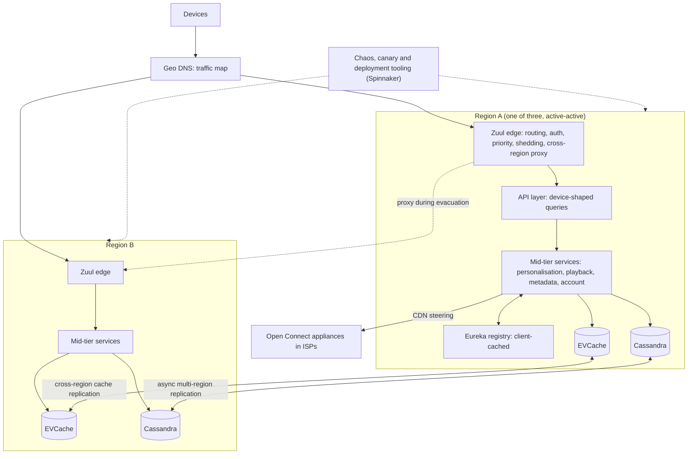

On Christmas Eve 2012, an AWS load-balancing outage in one region took Netflix streaming down for many members. Nothing in Netflix's own code was broken: the failure came from a dependency, in one place, and the architecture then had no way to route around it. What Netflix built before and after that night, and described publicly in unusual detail, is one of the most influential answers to the question this lesson asks: how do you design hundreds of services so that members can always browse and press play, when every instance, dependency, availability zone and occasionally a whole region will fail?

The question is not "design a feature" but "design for failure at the scale of an organisation". The video bytes come from Netflix's own CDN, Open Connect, covered in [the video streaming case study](/learn/system-design/case-studies/video-streaming-netflix). Here the subject is the *control plane* in the cloud: the services that sign you in, build your home page, authorise playback and choose your CDN server.

A note on sources. Everything said about Netflix is drawn from what its engineers have publicly described: the Netflix Technology Blog, conference talks and the documentation of its open-source projects. Internals change and are not public, so the numbers below are illustrative assumptions, labelled as such, and the design is what you would build with these publicly described ideas, not a description of Netflix's current internals.

## Requirements

**Functional.** Sign-in, profiles and account state; a personalised home page of rows with per-member artwork; search and title details; start playback (entitlement, DRM licence, CDN steering, manifest); playback telemetry; billing and plan changes, strongly consistent but deliberately *off* the playback path.

| Property | Target | Why |
|---|---|---|
| Availability metric | Stream starts per second (SPS) stays on its expected daily curve | Netflix has publicly described SPS as its primary health signal; per-service uptime is not what members experience |
| Instance failure | Invisible, continuously | Cloud instances disappear routinely |
| Zone failure | Invisible or nearly so | Every service runs in several zones |
| Region failure | Members moved to healthy regions within minutes | The Christmas Eve lesson |
| Dependency failure | The product degrades; it does not fail | Most features are enhancements, not necessities |
| Change velocity | Hundreds of teams deploying independently, many times a day | Most outages start with a change |

The first row is the senior one: choose one business metric that says whether members get what they came for, define "healthy" as that metric following its normal curve, and judge every mechanism by whether it protects it.

## Back-of-envelope estimates

Illustrative: 250 million accounts, 100 million active on a given day.

| Quantity | Arithmetic | Result |
|---|---|---|
| Edge traffic | $10^8$ members × ~200 API calls a day ÷ 86,400 s, ×3 for the evening peak | **~600,000 requests/s** at the edge |
| Internal RPCs | ~10 internal calls per edge request | ~6 million/s: a one-in-a-million failure happens six times a second |
| Page availability | 30 synchronous dependencies at 99.99% each: $0.9999^{30}$ | 0.9970: 150 failed pages a second at 50,000 page loads/s, with every SLO met |
| Tail exposure | $1 - 0.99^{30}$ | 26% of pages wait for someone's p99 |
| Threads for one slow dependency | Little's law: 1,000 requests/s × 5 s | 5,000 in flight against a 200-thread pool: saturated in 0.2 s |
| Stream starts | $10^8$ × ~1.5 plays a day | ~1,500 SPS average, ~5,000 at peak |
| Evacuation load | $N/(N-1)$ with three regions | Survivors carry 1.5× their peak: 65% utilisation becomes 98% |

**Consequences.** Turn dependency failure into degraded success; bound concurrency per dependency; judge health by SPS; and plan region capacity as $N/(N-1)$, ready before traffic moves.

## API

The device API is shaped for devices. Netflix has publicly described its evolution from one REST API, to device-specific endpoint scripts run on the API servers, to Falcor, to federated GraphQL: device teams shape responses for very different screens without a backend release each time. The internal contract is shaped for failure. Every internal call carries:

- **A deadline**, the member's remaining budget, so a service three hops deep does not start work the edge has abandoned.
- **A priority class** set at the edge: playback outranks prefetch, which outranks log upload. Netflix has described prioritised load shedding at its edge on exactly this idea.
- **Failure-injection context**, present only during experiments, telling a service to fail or delay *this* request's call to a named dependency.
- **Trace context**, so any request can be followed through the graph ([observability](/learn/system-design/building-blocks/observability)).

Every remote call is wrapped the same way. A sketch in the style of the publicly described Hystrix:

```python
import threading

class Dependency:
    """Timeout + bulkhead + circuit breaker + fallback around one remote call.
    CircuitBreaker, rpc and deadline are assumed helpers; this is a sketch."""

    def __init__(self, name, max_concurrent, timeout_s, fallback):
        self.name = name
        self.slots = threading.BoundedSemaphore(max_concurrent)      # bulkhead
        self.timeout_s = timeout_s
        self.breaker = CircuitBreaker(volume=20, error_pct=50, sleep_s=5)
        self.fallback = fallback

    def call(self, request, deadline):
        if not self.breaker.allow():                  # open: fail fast, no call
            return self.fallback(request, reason="circuit open")
        if not self.slots.acquire(blocking=False):    # full: reject, do not queue
            return self.fallback(request, reason="bulkhead full")
        try:
            budget = min(self.timeout_s, deadline.remaining())
            result = rpc(self.name, request, timeout=budget)
            self.breaker.record(ok=True)
            return result
        except (TimeoutError, ConnectionError):
            self.breaker.record(ok=False)
            return self.fallback(request, reason="call failed")
        finally:
            self.slots.release()
```

The breaker numbers are Hystrix's documented defaults: open once a rolling 10-second window holds at least 20 requests of which at least 50% failed, then wait 5 seconds before one trial request; the default timeout was 1 second and the default pool 10 threads. Hystrix isolated each dependency in its own thread pool by default, so a hung call could be abandoned; the semaphore here is the lighter variant it also offered.

## Data model

The interesting state is the state resilience depends on.

- **Registry entry (Eureka-style):** app, instance ID, address, zone, status, version, and a lease renewed every 30 seconds and expired after 90 without renewal, Eureka's documented defaults. Every client caches the whole registry and keeps using it if the registry servers are unreachable.
- **Circuit state** per (caller, dependency, operation): ten 1-second buckets of successes, failures, timeouts and rejections, a state (`CLOSED`, `OPEN`, `HALF_OPEN`) and when it opened. In-process and per instance, so the mechanism that survives dependency failures depends on nothing remote.
- **Traffic map:** per geography, the share of traffic each region receives. Evacuation is a change to this map.
- **Chaos experiment:** target (service, operation), injection (fail, or add latency), scope (for example 1% of members on one device family), an equal control group, the steady-state metric (SPS), an abort threshold and a maximum duration.
- **Personalisation in tiers.** Netflix has described offline, nearline and online recommendation stages, which give the home page three fallback tiers:

| Tier | Contents | Where it lives | Staleness |
|---|---|---|---|
| Live | Rows ranked with current context | Computed per request online | Seconds |
| Precomputed | Rows per profile, computed offline or nearline | Replicated cache ([EVCache](/learn/system-design/case-studies/distributed-cache)) in every region, backed by Cassandra | Hours |
| Unpersonalised | Popular and trending rows per country | Cached everywhere; a static default on the device | Up to a day |

## High-level design



Every region is a full copy of the control plane serving live traffic. Requests enter through Zuul, reach an API layer that assembles device-shaped responses, and fan out to mid-tier services that find each other through Eureka and call each other through isolation wrappers. Member data lives in Cassandra, replicated asynchronously across regions, and hot data in EVCache, which Netflix has described replicating across regions so that a member is already warm wherever they are sent. Playback returns Open Connect addresses; video bytes never touch the cloud.

| Component | Problem it answered | Publicly described evolution |
|---|---|---|
| Move to AWS | A 2008 database corruption stopped DVD shipping for about three days | Streaming control plane fully in the cloud by early 2016 |
| **Zuul** | One dynamic front door for every device: auth, routing, canaries, shedding | Zuul 2 on Netty, open-sourced 2018; prioritised load shedding |
| **Eureka** + **Ribbon** | Finding instances that come and go; client-side, zone-aware balancing | Moving into an Envoy-based service mesh; Ribbon in maintenance |
| **Hystrix** | One slow dependency cascading through everything | Maintenance mode since 2018; the README points to Resilience4j and adaptive concurrency limits |
| **Chaos Monkey**, Simian Army | Resilience assumed, not tested | FIT (request-scoped injection), ChAP (automated experiments with control groups) |
| **Active-active** | The Christmas Eve 2012 regional outage | Three regions; faster evacuation by having capacity ready (Project Nimble) |

Three ideas run through the table. **Prefer availability for control-plane metadata:** a registry 30 seconds stale is fine; one that refuses to answer during a partition is not ([CAP and PACELC](/learn/system-design/building-blocks/cap-and-pacelc)). **Put resilience in the caller**, who suffers when a dependency is slow. **Move shared mechanisms down the stack** once they stabilise: discovery, balancing, retries and mTLS started as Java libraries and are moving into a [mesh sidecar](/learn/networking/networking-in-practice/service-meshes-and-proxies) that serves any language.

```viz
{"type": "system", "scenario": "service-mesh", "nodes": 3,
 "title": "From libraries to a mesh",
 "caption": "Discovery, client-side load balancing, retries and mTLS once lived in libraries linked into every Java service (Eureka client, Ribbon, Hystrix). A sidecar proxy does the same work outside the application, for any language, configured centrally. The patterns are unchanged; where they run has moved."}
```

## Deep dive: one home page, five policies

### The model

An API instance serves 1,000 requests a second with 200 request threads. 70% are home pages, which call five dependencies in parallel (`profile`, `rows`, `ratings`, `artwork`, `bookmarks`, each answering in 30–70 ms); 30% are playback requests, which call three others and never touch `ratings`. A request holds its thread until its slowest call returns. At t = 10 s `ratings` slows to 5 s; at t = 70 s it heals. When every thread is busy a new request is rejected with a 503. Arrivals are Poisson; each policy was simulated for 100 seconds (results for the incident's steady state, t = 15–70 s):

| Policy | Threads busy | Home pages: full / degraded / failed / rejected | Playback served | p99 answered | Calls/s to `ratings` | Full pages again after heal |
|---|---|---|---|---|---|---|
| Healthy baseline | 67 | 100 / 0 / 0 / 0% | 100% | 75 ms | 700 | – |
| No timeouts | 200 | 5.7 / 0 / 0 / 94.3% | 6.2% | 5,005 ms | 40 | 0.5 s |
| 1 s timeouts | 200 | 0 / 0 / 27.6 / 72.4% | 28% | 1,005 ms | 194 | 0.3 s |
| + bulkhead of 60 | 123 | 0 / 0 / 100 / 0% | 100% | 1,005 ms | 60 | 0.3 s |
| + circuit breaker | 67 | 0 / 0 / 100 / 0% | 100% | 75 ms | 0.2 once open | 4.1 s |
| + fallback | 67 | 0 / **100** / 0 / 0% | 100% | 75 ms | 0.2 once open | 4.1 s |

### Reading it row by row

- **No timeouts.** Little's law: $700 \times 5\text{ s} = 3{,}500$ threads wanted, 200 available. 94% of requests are rejected, and **playback, which never calls `ratings`, fails with them**. That is the cascade.
- **1 s timeouts alone still saturate:** $700 \times 1\text{ s} + 300 \times 0.05\text{ s} = 715$ threads wanted. Hystrix's default 1 s timeout is safe only where rate × timeout fits the pool. It also sends `ratings` more traffic (194 calls/s) than doing nothing.
- **The bulkhead is sized from normal concurrency**, $700 \times 0.05\text{ s} = 35$ calls in flight, 49 at the slowest normal latency, so 60. (A bulkhead of 10, Hystrix's default pool size, failed 72% of home pages in the same simulation while `ratings` was healthy.) Now `ratings` can hold at most 60 threads and playback is untouched; home pages still fail, because nothing substitutes for the row.
- **The breaker** stops calling a dependency once half the calls in its window fail: its load drops from 700 calls/s to one trial every 5 s, and failures take microseconds instead of 1 s. It opened 5.0 s into the incident, not at once, because the 10-second window still held five seconds of successes: the error percentage reached 50% only then.
- **The fallback** turns every failure into a page without the ratings row, at normal latency.
- **The cost:** after `ratings` healed, full pages returned in 0.3 s without a breaker and 4.1 s with one, because nothing calls the dependency until the next trial. The sleep window is paid on the way out.

One request at t = 30 s under the last policy: the edge assigns the interactive class and a 1,000 ms deadline (0 ms); the API fans out five calls (2 ms); the `ratings` wrapper finds the breaker open and returns the fallback in microseconds; the other four answer by 70 ms; the page is assembled without the row, counted as degraded, and returned at about 75 ms.

```viz
{"type": "system", "scenario": "bulkhead", "nodes": 3,
 "title": "A slow dependency can only drown its own compartment",
 "caption": "Each dependency gets a small, separate pool. When one dependency hangs, its pool fills and further calls to it are rejected immediately into the fallback, while calls to every other dependency still have threads."}
```

```viz
{"type": "system", "scenario": "circuit-breaker", "requests": 15,
 "title": "Closed, open, half-open",
 "caption": "After enough requests in the rolling window fail, the breaker opens and calls fail fast into the fallback without touching the dependency. After a sleep window, one trial request is allowed through; success closes the breaker, failure keeps it open."}
```

### Retries multiply

Suppose the API, the personalisation service and the `ratings` client each make up to three attempts. With `ratings` fully down, one home page produces $3^3 = 27$ attempts at the bottom: its normal 700 calls/s become 18,900/s at the moment it is least able to take them. At a 50% failure rate the same policy gives about 2× (the layers above mostly see success), so the amplification is worst exactly when the dependency is fully down. Retrying at one layer with a budget of 10% of normal traffic caps it at 770/s. Retry where a different choice is possible (another instance), never past the propagated deadline ([idempotency and retries](/learn/system-design/building-blocks/idempotency-and-retries) simulates the storms).

```viz
{"type": "system", "scenario": "retry-backoff", "requests": 6,
 "title": "Retries arriving at a struggling dependency",
 "caption": "Every layer that retries multiplies the attempts that reach the bottom. Backoff with jitter spreads them in time; only a budget or a single retrying layer bounds how many there are."}
```

### Why Netflix moved on from static configuration

Every Hystrix command had its own timeout, pool size and thresholds, set once and wrong after the next change on either side, as the bulkhead-of-10 result shows. The README's stated direction was towards mechanisms that react to real-time performance. The publicly described concurrency-limits work applies TCP congestion-control thinking: treat latency rising above its no-load baseline as queueing and shrink the number of requests allowed in flight; grow it again when latency recovers. By Little's law the right limit is throughput × healthy latency, and the algorithm finds it instead of an engineer guessing. The patterns are permanent; the library and its hand-tuned numbers were not ([resilience patterns](/learn/system-design/building-blocks/resilience-patterns)).

```exercise
id: circuit-breaker
title: A Hystrix-style circuit breaker
prompt: |
  Implement `breaker(events, volume, error_pct, window, sleep)`. Each event is
  `[t, outcome]` (seconds, non-decreasing), where `outcome` is what the call would return:
  `"ok"`, `"error"` or `"timeout"` (both of the last two are failures). Calls complete
  instantly. Return one decision per event: `"call"`, `"reject"` or `"trial"`.

  - **Closed:** make the call (`"call"`) and record its outcome at time `t`. The window
    holds recorded outcomes with time in `(t - window, t]`: one exactly `window` seconds
    old has dropped out. After recording, if the window holds at least `volume` outcomes
    and `failures * 100 >= error_pct * count`, the breaker opens at `t`.
  - **Open:** if `t - opened_at < sleep`, return `"reject"` and record nothing. Otherwise
    this call is the single half-open trial (`"trial"`): if it succeeds the breaker closes
    and the window is emptied; if it fails the breaker stays open with `opened_at = t`.
languages: [python, javascript]
entry: breaker
starter:
  python: |
    def breaker(events, volume, error_pct, window, sleep):
        out = []
        # your code here
        return out
  javascript: |
    function breaker(events, volume, error_pct, window, sleep) {
      const out = [];
      // your code here
      return out;
    }
tests:
  - args: [[[0, "ok"], [1, "error"], [2, "error"], [3, "error"], [4, "ok"], [7, "ok"], [8, "ok"], [9, "error"]], 4, 50, 10, 5]
    expected: ["call", "call", "call", "call", "reject", "reject", "trial", "call"]
    label: opens, rejects, then a trial succeeds
  - args: [[[0, "error"], [1, "error"], [2, "error"], [3, "error"]], 5, 50, 10, 5]
    expected: ["call", "call", "call", "call"]
    label: below the volume threshold it never opens
  - args: [[[0, "error"], [1, "error"], [6, "error"], [8, "ok"], [10, "ok"], [11, "ok"]], 2, 50, 10, 5]
    expected: ["call", "call", "trial", "reject", "reject", "trial"]
    label: a failed trial re-opens for another sleep window
  - args: [[[0, "error"], [10, "error"], [11, "error"], [12, "ok"]], 2, 100, 10, 5]
    expected: ["call", "call", "call", "reject"]
    label: an outcome exactly one window old has aged out
  - args: [[], 20, 50, 10, 5]
    expected: []
    label: no calls
  - args: [[[0, "ok"], [1, "timeout"], [2, "ok"], [3, "timeout"], [4, "ok"]], 4, 50, 10, 5]
    expected: ["call", "call", "call", "call", "reject"]
    label: timeouts count as failures; exactly the threshold opens
  - args: [[[0, "error"], [1, "error"], [6, "ok"], [7, "error"], [8, "ok"], [9, "error"], [10, "error"]], 2, 50, 10, 5]
    expected: ["call", "call", "trial", "call", "call", "reject", "reject"]
    hidden: true
  - args: [[[0.0, "ok"], [0.1, "ok"], [0.2, "ok"], [0.3, "ok"], [0.4, "ok"], [0.5, "ok"], [0.6, "ok"], [0.7, "ok"], [0.8, "ok"], [0.9, "ok"], [1.0, "error"], [1.1, "error"], [1.2, "error"], [1.3, "error"], [1.4, "error"], [1.5, "error"], [1.6, "error"], [1.7, "error"], [1.8, "error"], [1.9, "error"], [2.0, "error"], [2.5, "error"], [6.8, "ok"], [7.0, "ok"], [7.1, "error"]], 20, 50, 10, 5]
    expected: ["call", "call", "call", "call", "call", "call", "call", "call", "call", "call", "call", "call", "call", "call", "call", "call", "call", "call", "call", "call", "reject", "reject", "reject", "trial", "call"]
    hidden: true
hints:
  - "Keep the state, the time it opened, and a list of (time, failed) for calls made while closed."
  - "Drop outcomes with time <= t - window before counting; check volume first, then the percentage."
```

## Deep dive: fallbacks and graceful degradation

A fallback is a product decision made in advance. Netflix's public write-ups on its fault-tolerant API described three kinds: return something else useful (often stale cached data), fail silently by omitting optional content, or fail fast when there is no honest substitute. For the home page that is a ladder: live personalisation; else the profile's precomputed rows from the replicated cache, hours stale; else popular rows for the country; else the static default the device already holds. Optional content (a ratings badge, a "because you watched" row, a banner) fails silent. Playback cannot fake a DRM licence or an entitlement check: those fail fast and rely on redundancy, a retry on another instance, and evacuation if the region is broken.

Four rules make the ladder real:

- **The fallback must not share the failure.** Reading the recommendations cache is no fallback if that cache is why recommendations failed; each rung depends on less, ending in something in-process.
- **It must be cheaper than the primary**, or an outage of one service becomes load on another.
- **It must be exercised.** A path that runs only during incidents has undiscovered bugs; failure injection runs it on purpose.
- **Fallback rate is an alert.** If 30% of home pages are unpersonalised for a week and nobody notices, the product has quietly degraded.

A member shown popular titles still usually finds something to watch; a member shown an error does not. Degrading the enhancement protects SPS.

## Deep dive: chaos experiments on the same call graph

Netflix's publicly described practice reads as three stages. **Chaos Monkey** terminates instances in production during business hours; its real effect was architectural, because once every team knew instances *would* vanish on a Tuesday, statelessness and redundancy across zones became requirements. The Simian Army extended it: Latency Monkey, Chaos Gorilla (a zone), Chaos Kong (a region). **FIT** (Failure Injection Testing) attaches injection metadata at the edge to requests matching a scope, so services fail or delay *that request's* call to a named dependency: the blast radius is a set of requests, starting with one engineer's account. **ChAP** (the Chaos Automation Platform) runs each experiment on two equal slices of traffic routed to fresh deployments, injects only into the experiment slice, compares SPS, and aborts automatically.

The experiment for our graph: "home pages whose `ratings` calls fail still start streams at the normal rate", injected for 1% of members against a 1% control. At 5,000 SPS each group sees 50 starts a second. Starts are roughly Poisson, so the standard deviation of the difference between two groups of $n$ starts is $\sqrt{2n}$:

| Running time | Starts per group | σ of difference | A 5% drop is | Smallest drop at 3σ |
|---|---|---|---|---|
| 1 minute | 3,000 | 77 | 1.9σ | 7.7% |
| 10 minutes | 30,000 | 245 | 6.1σ | 2.4% |
| 10 minutes, 0.1% groups | 3,000 | 77 | 1.9σ | 7.7% |

So set the abort threshold at the experiment group falling 3σ below control at any one-minute check, which stops a large regression (8% or worse) within a minute, and run for 10 minutes, which resolves a 2.4% effect. If the fallback works, the two groups match; if the client treats a missing ratings row as an error, SPS in the experiment group drops and the platform stops the experiment before most members notice. **The blast radius you can afford is set by how fast your metric detects harm.** Injecting a 5 s delay instead of an error tests something different: the timeouts and the bulkhead rather than the fallback.

## Deep dive: regional evacuation

Active-active means every region serves traffic all the time, so the failover path is exercised continuously. Member data in Cassandra replicates asynchronously and EVCache replicates cache writes across regions, so a moved member finds a warm cache. Asynchronous replication is accepted per data type: a "continue watching" position written seconds before an evacuation may be briefly missing, which is fine for viewing history and wrong for billing, so billing stays off the evacuation-critical path. Traffic moves two ways: a traffic-map change in geo DNS moves new connections, and because resolvers and devices cache answers (some ignore TTLs), the failing region's edge also *proxies* what it still receives to a healthy region, which Netflix has described Zuul doing.

A timed evacuation of region A, three regions at 65% of capacity at peak. Timings are illustrative orders of magnitude:

| t (min) | Step | Waits for |
|---|---|---|
| 0 | SPS in region A falls below its expected curve; errors rise | Automated detection on SPS, a minute or two of evidence |
| 2 | Decision: evacuate first, debug later | A human confirms; nobody investigates yet |
| 2–10 | Pre-scale B and C from 65% to handle 1.5× their load | Instances launched, healthy and warm; the longest step unless capacity is already reserved |
| 10 | Shift 25% of A's members (DNS weights plus edge proxying) | SPS and errors in B and C steady for a few minutes |
| 13 | Shift 50% | Same gate |
| 16 | Shift 100%; region A drained | Debugging starts in a region with no customers |

Shifting before scaling puts the survivors at $65\% \times 1.5 = 97.5\%$, where any wobble overloads them, which is how one regional failure becomes three. Netflix has described work (Project Nimble) to make evacuation much faster, largely by having capacity ready instead of waiting for it. The tooling that performs the evacuation must itself survive the loss of any one region.

## Failure modes

| Failure | Symptom | Diagnosis | Fix |
|---|---|---|---|
| Dependency cascade | Unrelated endpoints fail when one dependency slows | Thread pools saturated; in-flight calls to one dependency ≈ rate × its latency | Timeouts from the deadline, bulkheads sized from normal concurrency, breakers, fallbacks |
| Retry amplification | Load on a failing service 10–30× normal | Attempts per request at the bottom ≫ 1 | One retrying layer, a 10% budget, deadline propagation |
| Bad global change | Every region degrades at once; evacuation cannot help | Correlation with a deploy or config push | Region-by-region rollout with bake time and automated canary analysis (Netflix described Kayenta, built with Google) |
| Stale discovery | Calls to instances that died up to 90 s ago | Connection refused from addresses still in the registry | Retry idempotent calls on another instance; fast local failure detection |
| Registry partition | Heartbeats stop from much of the fleet at once | Renewals far below the expected rate | Eureka's self-preservation stops expiring registrations: a partition is likelier than a mass death |
| Evacuation overload | Survivors saturate after traffic moves; cache miss storm | Shift happened before scaling; cold caches | Pre-scale first; replicated caches; shift in steps with SPS gates |
| Hidden degradation | Home pages unpersonalised for a week | Fallback rate trending up with no alert | Fallback rate as a first-class alert with an owner |
| Edge overload | 3× traffic from a client bug or a surge | Request rate per priority class | Prioritised shedding at the edge: telemetry and prefetch before playback |
| Chaos escapes its radius | Harm beyond the experiment group | Control and experiment both drop | Small groups, automatic abort on SPS, a global kill switch, no experiments during launches |

```viz
{"type": "system", "scenario": "canary", "requests": 10,
 "title": "A bad change caught by a canary",
 "caption": "A small share of traffic goes to the new version alongside a baseline on the old version. Metrics are compared statistically; a regression stops the rollout before it reaches the rest of the region, let alone the other regions."}
```

## Trade-offs: what we rejected

| Decision | Chosen | Rejected | Why here | What would flip it |
|---|---|---|---|---|
| Discovery | AP registry, client caches, self-preservation | CP coordination service (ZooKeeper) | A partition must not erase healthy instances | Needing strict leader election, which belongs in a CP store anyway |
| Isolation limits | Adaptive concurrency limits, platform defaults | Hand-tuned per-command pools and timeouts | Static numbers were wrong after the next change | A handful of stable dependencies |
| Retries | One layer, 10% budget, deadline-aware | Every layer retries three times | 27× at the bottom when it is fully down | None |
| Region strategy | Active-active, pre-scaled evacuation | Active-passive standby | The failover path is exercised daily | Cost of 1.5× capacity exceeding the cost of regional outages |
| Chaos scope | Request-scoped injection with control groups | Killing whole services | Blast radius measured in requests, aborted by statistics | A metric too noisy to detect harm quickly |

## At 10× and 100×

Assume (illustratively) 50,000 instances today, each renewing a lease every 30 s, with ~1.5 KB per registry entry.

| Scale | Edge requests/s | Internal RPCs/s | Registry renewals/s | Full registry per client | One-in-a-million failures |
|---|---|---|---|---|---|
| 1× | 600,000 | 6 million | 1,700 | 75 MB | 6/s |
| 10× | 6 million | 60 million | 16,700 | 750 MB | 60/s |
| 100× | 60 million | 600 million | 167,000 | 7.5 GB | 600/s |

At 10× every client caching the whole registry becomes untenable, so clients subscribe only to the services they call and receive deltas, which is what a mesh control plane does. At 100× discovery is sharded per region and per service domain. Scale also helps: at 10× the SPS, a 0.1% experiment group sees what a 1% group sees today, so chaos experiments can shrink their blast radius tenfold.

## What real companies describe

Beyond Netflix's own writing, Amazon's Builders' Library articles describe timeouts, retries with capped exponential backoff and jitter, and limiting retries to one layer; Google's SRE book describes client-side throttling, retry budgets per request and per client, criticality-based load shedding and deadline propagation. The ideas converge because the arithmetic is the same everywhere. Treat these as public descriptions of approaches, not current internals.

## Interviewer follow-ups

**"Why did Netflix build Eureka instead of using ZooKeeper, or DNS?"** Model answer: discovery should prefer availability. In a CP service, instances on the minority side of a partition lose their sessions and vanish from the registry over a network problem that did not affect them; Eureka replicates loosely, clients keep their cached copy, and self-preservation stops mass expiry. DNS is slow to change and carries no health data. Common wrong answer: "ZooKeeper is consistent, so it is safer".

**"Hystrix is in maintenance mode. Would you still use circuit breakers?"** Model answer: yes; the library retired, not the pattern. I would take defaults from a library or the mesh, derive timeouts from propagated deadlines, use adaptive concurrency limits for overload, key breakers per operation, and accept that a breaker delays recovery by up to its sleep window (4.1 s in the simulation). The fallback stays application code. Common wrong answer: "no, the mesh handles resilience now", when only the application knows what degraded-but-useful means.

**"How do you choose a timeout?"** Model answer: from the caller's remaining deadline and the dependency's observed p99 plus margin, then check rate × timeout against the pool: at 700 calls/s a 1 s timeout needs 700 threads, so it must be backed by a bulkhead sized from normal concurrency. Common wrong answer: "1 second, the default".

**"Chaos in production sounds reckless. How do you justify it?"** Model answer: failures happen in production anyway; the choice is a 1% blast radius at 14:00 with engineers watching or 100% on a holiday. It needs a metric that detects harm within minutes (at 5,000 SPS, 3σ on a 1% group catches an 8% drop in a minute), automatic abort, and basic resilience in place. Common wrong answer: "we test in staging", which never has production's traffic or dependencies.

**"How much of this would you build with 30 engineers and one region?"** Model answer: multiple zones; timeouts, bounded retries with jitter and breakers on every remote call via a library or mesh; a fallback table for the top five features; alerts on one business metric; a quarterly game day. Active-active costs 1.5× capacity plus asynchronous replication, justified only by the cost of a regional outage ([designing for failure](/learn/system-design/senior-design-skills/designing-for-failure)). Common wrong answer: copying Netflix's architecture, which buys its costs without its reasons.

## What mid-level engineers get wrong

- Setting a 1 s timeout and calling the service protected, without checking rate × timeout against the thread pool.
- Sizing bulkheads by default (10) rather than from normal concurrency, and rejecting healthy traffic.
- Retrying at every layer, which multiplies load 27× on a dependency that is fully down.
- Writing a fallback that reads from the component that has failed.
- Measuring health with CPU and per-service error rates instead of the business metric.
- Shifting traffic to surviving regions before they have scaled.
- Treating chaos engineering as random breakage rather than an experiment with a hypothesis, a control group and an abort threshold.

## Senior signals

- You define availability as a business metric (stream starts) and judge every mechanism by whether it protects it.
- You show with Little's law why one slow dependency takes down unrelated endpoints, and why timeouts alone do not stop it at high rates.
- You size bulkheads from normal concurrency and know a breaker trades faster failure for slower recovery.
- You treat fallbacks as product decisions: independent of the failure, cheaper, exercised and monitored.
- You size chaos experiments by statistics and give them an abort threshold.
- You plan regions as N/(N−1), pre-scale before shifting, and roll changes out region by region because active-active amplifies bad global changes.
- You attribute Netflix specifics to public descriptions and adapt the ideas to the scale in front of you.

## Check yourself

```quiz
- q: >-
    A home page synchronously depends on 30 services, each 99.99% available. What does the arithmetic imply for the design?
  options: ["It fails ~0.3% of the time; failures must degrade, not error", "The page should call the services in sequence, not in parallel", "The page is 99.99% available, so nothing is needed", "Each dependency must be 99.999% available and that is sufficient"]
  answer: 0
  explanation: >-
    0.9999^30 is about 0.997, so the page fails about 0.3% of the time even when every dependency meets its SLO. At high volume that is a constant stream of failed pages, so most dependency failures must become degraded success. Tightening every SLO helps less and costs far more.
- q: >-
    In the simulation, adding 1-second timeouts still left 72% of requests rejected, including playback requests that never call the slow dependency. Why?
  options: ["700 home pages/s × 1 s needs ~700 threads; the pool has 200", "Playback shares the slow dependency's database connection", "The breaker opened and rejected every request at the edge", "Timeouts add retries, which double the load on the pool"]
  answer: 0
  explanation: >-
    By Little's law, threads in use equal arrival rate times time held. Each home page now holds its thread for the full 1 s timeout, so about 715 threads are wanted against 200, and every other request, playback included, finds the pool full. A bulkhead sized from normal concurrency caps what the slow dependency can hold.
- q: >-
    The dependency fails at t = 10 s, but the Hystrix-style breaker (10 s window, 20 requests, 50% errors) opens only at about t = 15 s. Why the delay?
  options: ["Timeouts are not counted as failures until the call is retried", "The breaker waits one sleep window of 5 s before it may open", "The volume threshold of 20 requests takes 5 s to accumulate", "Its window held 5 s of successes, so errors hit 50% late"]
  answer: 3
  explanation: >-
    The error percentage is computed over the whole rolling window. At 700 calls a second, 20 requests arrive in milliseconds, but the window also holds the healthy calls from before the incident, so failures reach half of it only when about half the window is post-incident. The sleep window applies after opening, not before.
- q: >-
    The API, a mid-tier service and a client library each make up to three attempts. The bottom dependency is fully down. How many attempts reach it per home page?
  options: ["3, one set of retries for the whole request", "27, three at each of three nested layers", "9, three attempts at each of the top two layers", "About 2, because retries mostly succeed"]
  answer: 1
  explanation: >-
    Each attempt at a layer triggers the full retry sequence of the layer below, so attempts multiply: 3 × 3 × 3 = 27. At a 50% failure rate the same policy gives about 2 because upper layers mostly see success, which is why amplification peaks exactly when the dependency is down. One retrying layer with a 10% budget caps it at 1.1.
- q: >-
    A chaos experiment uses 1% of traffic each for control and experiment groups at 5,000 stream starts per second. What does one minute of data let you detect at 3 sigma?
  options: ["A drop of about 0.5%, the natural noise in SPS", "Any drop at all, because the groups are large", "A drop of about 8% or more in experiment starts", "Only a complete outage of the experiment group"]
  answer: 2
  explanation: >-
    Each group sees about 3,000 starts in a minute; the standard deviation of the difference is the square root of 6,000, about 77, so 3 sigma is about 232 starts, 7.7% of 3,000. After ten minutes the same threshold resolves about 2.4%. The metric's volume sets how small a blast radius can still detect harm quickly.
- q: >-
    Three active-active regions each run at 65% of capacity at peak. One region must be evacuated. What happens if traffic is shifted before the survivors scale up?
  options: ["Each survivor hits ~98%, with almost no headroom left", "The evacuated region keeps serving until the survivors scale", "Nothing; each survivor rises to about 72% of capacity", "DNS drops the evacuated region's traffic until scaling ends"]
  answer: 0
  explanation: >-
    Survivors must carry N/(N-1) = 1.5 times their load, so 65% becomes about 98%, and any wobble overloads them and spreads the failure. Pre-scaling, or permanent headroom, comes before the shift.
```
