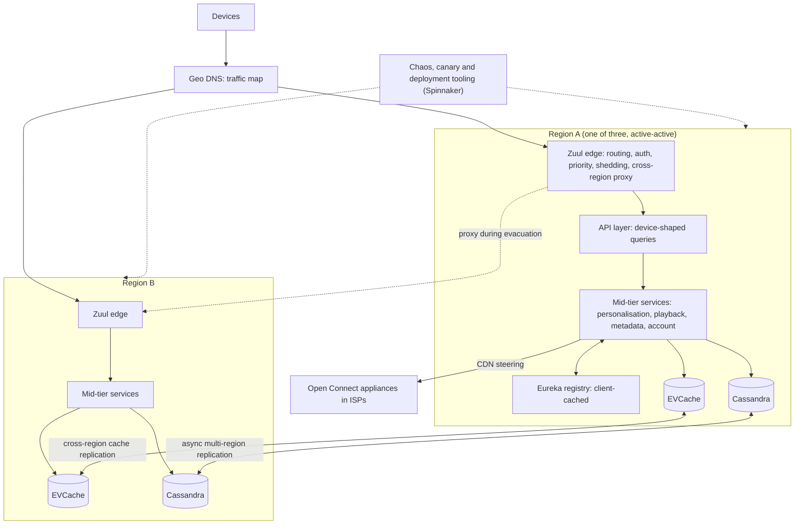
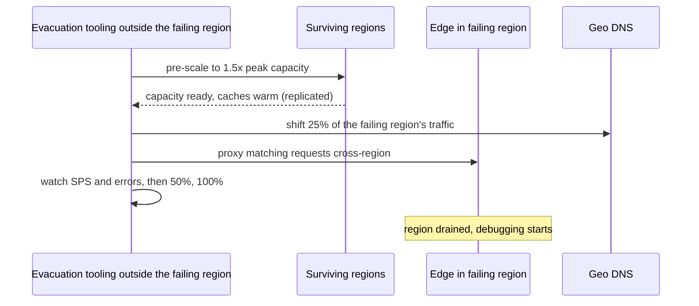

On Christmas Eve 2012, an AWS load-balancing outage in a single region took Netflix streaming down for many members. Nothing in Netflix's own code was broken. The failure came from a dependency, in one place, and at the time the architecture had no way to route around it. What Netflix built before and after that night, and described publicly in unusual detail, is one of the most influential answers to the question this lesson asks: how do you design a system of hundreds of services so that members can always browse and press play, when every instance, every dependency, every availability zone and occasionally a whole cloud region will fail?

This case study is different from the others in the module. The question is not "design a feature" but "design for failure at the scale of an organisation". The video bytes themselves are served by Netflix's own CDN, Open Connect, which [the video streaming case study](/learn/system-design/case-studies/video-streaming-netflix) covers. Here the subject is the *control plane* in the cloud: the services that sign you in, build your home page, authorise playback and choose which CDN server you stream from.

A note on sources. Everything said here about Netflix is drawn from what its engineers have publicly described: the Netflix Technology Blog, conference talks, and the documentation of its open-source projects. Internal details change and are not public, so the numbers in the estimates are illustrative assumptions, labelled as such, and the design is framed as what you would build using these publicly described ideas, not as a description of Netflix's current internals.

## Requirements

### Functional

- Sign-in, profiles, and account state.
- A personalised home page: rows of titles chosen and ordered per profile, with per-member artwork.
- Search and title details.
- Start playback: check entitlement, issue a DRM licence, choose CDN servers, return the stream manifest.
- Playback telemetry (heartbeats, quality events) and client logging.
- Billing and plan changes (strongly consistent, but deliberately *off* the playback path).

### Non-functional

| Property | Target | Why |
|---|---|---|
| The availability metric | Stream starts per second (SPS) stays on its expected curve | Netflix has publicly described SPS as its primary health signal; per-service uptime is not what members experience |
| Instance failure | Invisible to members, continuously | Cloud instances disappear routinely |
| Zone failure | Invisible or nearly so | Every service runs in multiple zones |
| Region failure | Members moved to healthy regions within minutes | The Christmas Eve lesson |
| Dependency failure | The product degrades, it does not fail | Most features are enhancements, not necessities |
| Change velocity | Hundreds of teams deploy independently, many times a day | Most outages are caused by changes, so safe change is a resilience requirement |

The row that most distinguishes a senior answer is the first. Choose one business-level metric that reflects whether members are getting what they came for, define "healthy" as that metric following its normal daily curve, and judge every resilience mechanism by whether it protects that metric.

## Back-of-envelope estimates

Assume (illustratively) 250 million member accounts, 100 million active on a given day.

**Edge traffic.** Each active member's devices make ~200 API calls a day: browsing, artwork, playback licences, heartbeats, logging. $10^8 \times 200 = 2 \times 10^{10}$ calls/day, $2 \times 10^5$ per second on average. Evening viewing concentrates by time zone, so peak is ~3×: **~600,000 requests/s at the edge.**

**Internal fan-out.** If an edge request fans out to ~10 internal calls on average (a home page, far more), that is ~6 million internal RPCs per second at peak. At this volume, "rare" failures are constant: a one-in-a-million failure mode happens six times a second.

**Why availability cannot be a product of dependencies.** Suppose a home page synchronously needs 30 services, each 99.99% available. Its availability is $0.9999^{30} \approx 0.9970$: 0.3% of pages fail. At 50,000 home-page loads per second, that is 150 failed pages every second, continuously, with every dependency meeting a four-nines SLO. The only way out is to make most dependency failures *not* fail the page: time out, fall back, render without that row.

**Why tails dominate.** If each of those 30 calls has a p99 of 100 ms, the chance that at least one of them is in its tail is $1 - 0.99^{30} \approx 26\%$. A quarter of home pages would wait for somebody's worst 1%. Timeouts with fallbacks bound the page's latency to the timeout, not to the slowest dependency's tail.

**Why one slow dependency exhausts a service (Little's law).** A service handling 1,000 requests/s calls a dependency that normally answers in 50 ms: 50 calls in flight. The dependency slows to 5 s: now $1{,}000 \times 5 = 5{,}000$ calls in flight. A server with a 200-thread pool is saturated in a fifth of a second, and it stops serving requests that never touch the slow dependency. Cap that dependency at 10 concurrent calls with a 1-second timeout, and it can hold at most 10 threads; the other 190 keep working.

**Playback.** 100 million daily members × ~1.5 plays = $1.5 \times 10^8$ stream starts/day: ~1,500 SPS on average, ~5,000 at peak (illustrative).

**Regional headroom.** Spread 600,000 requests/s evenly over three regions: 200,000 each. Evacuate one, and the other two carry 300,000 each: **1.5× their normal peak.** In general, with N regions each must absorb $N/(N-1)$ of its normal load: 1.5× for three, 1.33× for four. A region running at 60% of capacity at peak lands at 90% after an evacuation, survivable with no margin; one at 70% lands at 105% and falls over. So either every region carries permanent headroom (expensive), or the survivors scale up *before* traffic moves, which is only fast enough if capacity is ready rather than waiting on autoscaling.

The design consequences: turn dependency failure into degraded success; bound concurrency per dependency; judge health by SPS; and plan region capacity as $N/(N-1)$.

## API design

The device-facing API is shaped for devices; the internal contract is shaped for failure.

```text
Device-facing (at the edge)
GET  /home?profile={id}                        -> rows of titles (a GraphQL-style query in practice)
GET  /titles/{id}                              -> metadata, artwork, member state
POST /playback/start {title_id, device_caps}  -> manifest, DRM licence, CDN steering
POST /events         [telemetry batch]         -> 202, sheddable
```

Netflix's device API has a publicly described history of its own: a one-size-fits-all REST API, then device-specific endpoint scripts written by the client teams and run on the API servers, then Falcor (its JSON Graph library), and later GraphQL, including a federated GraphQL architecture. The through-line is that device teams need to shape responses for very different screens without every change requiring a backend release.

What matters more for this lesson is the context every internal call carries:

- **A deadline**, not just a timeout: the remaining budget of the member's request, so a service three hops deep does not start work the edge has already abandoned.
- **A priority class**, assigned at the edge: a playback request outranks a prefetch, which outranks a log upload. Netflix has publicly described using exactly this idea for prioritised load shedding at its edge gateway.
- **Failure-injection context**, present only during experiments, which tells downstream services to fail or delay this particular request (more in the chaos deep dive).
- **Trace context**, so any request can be followed through the call graph.

Every remote call is wrapped by the same few mechanisms. A sketch of what an isolation wrapper in the style of Netflix's publicly described Hystrix does around every call:

```python
import threading

class Dependency:
    """Timeout + bulkhead + circuit breaker + fallback around one remote call.
    CircuitBreaker, rpc and deadline are assumed helpers; this is a sketch."""

    def __init__(self, name, max_concurrent, timeout_s, fallback):
        self.name = name
        self.slots = threading.BoundedSemaphore(max_concurrent)      # bulkhead
        self.timeout_s = timeout_s
        self.breaker = CircuitBreaker(volume=20, error_pct=50, sleep_s=5)
        self.fallback = fallback

    def call(self, request, deadline):
        if not self.breaker.allow():                  # open: fail fast, no call
            return self.fallback(request, reason="circuit open")
        if not self.slots.acquire(blocking=False):    # full: reject, do not queue
            return self.fallback(request, reason="bulkhead full")
        try:
            budget = min(self.timeout_s, deadline.remaining())
            result = rpc(self.name, request, timeout=budget)
            self.breaker.record(ok=True)
            return result
        except (TimeoutError, ConnectionError):
            self.breaker.record(ok=False)
            return self.fallback(request, reason="call failed")
        finally:
            self.slots.release()
```

The numbers in the sketch are Hystrix's documented defaults: a circuit opens only when at least 20 requests in a rolling 10-second window have been seen and at least 50% failed, then waits 5 seconds before letting a trial request through; the default timeout was 1 second and the default thread pool 10 threads. Hystrix's default isolation used a separate thread pool per dependency (so a hung call could be abandoned by the caller); the semaphore here is the lighter variant it also offered.

## Data model

The interesting state in this system is the state that resilience mechanisms depend on.

**Service registry entry (Eureka-style).**

```json
{"app": "RECOMMENDATIONS", "instanceId": "i-0a12bc34", "ipAddr": "10.1.2.3", "port": 7001,
 "zone": "us-east-1c", "status": "UP", "metadata": {"version": "v412"},
 "lease": {"renewalIntervalSecs": 30, "durationSecs": 90, "lastRenewal": 1790000000}}
```

Instances renew their lease every 30 seconds and are expired after 90 seconds without renewal, the defaults Eureka documents. Every client caches the full registry locally and refreshes it periodically, so calls keep working if the registry servers are unreachable.

**Circuit state**, per (calling service, dependency, operation): a rolling window of ten 1-second buckets counting successes, failures, timeouts and rejections; a state (`CLOSED`, `OPEN`, `HALF_OPEN`); and when it opened. It is in-process and per instance: each instance decides from its own experience, which avoids a coordination dependency for the thing that exists to survive dependency failures.

**Personalisation, in tiers.** Netflix has publicly described splitting recommendation computation into offline, nearline and online stages. For fallback purposes that gives three tiers of home-page data:

| Tier | Contents | Where it lives | Staleness |
|---|---|---|---|
| Live | Rows ranked with current context (time of day, what you just watched) | Computed per request by online services | Seconds |
| Precomputed | Rows computed per profile offline or nearline | Replicated cache (EVCache) in every region, backed by Cassandra | Hours |
| Unpersonalised | Popular and trending rows per country | Small, cached everywhere, even embedded as a static default | Hours to a day |

**Traffic map.** Per geography, the share of traffic each region receives. Evacuation is a change to this map.

**Chaos experiment definition.** Target (service, operation), injection (fail, or add 500 ms), scope (for example 1% of members on one device family), a control group of equal size, the steady-state metric (SPS), an abort threshold, and a maximum duration.

## High-level design



Every region is a full copy of the control plane and serves live traffic. Geo DNS sends each member to a nearby region. Within a region, requests enter through Zuul, go to an API layer that assembles device-shaped responses, and fan out to mid-tier services that find each other through Eureka and call each other through isolation wrappers. Member data lives in Cassandra, replicated asynchronously across regions, and hot data in EVCache, which Netflix has publicly described replicating across regions so that a member's data is already warm wherever they are sent. Playback returns the addresses of Open Connect servers; the video bytes never touch the cloud.

### The publicly described lineage

| Component | Problem it answered | What it did | Publicly described evolution |
|---|---|---|---|
| Move to AWS | A 2008 database corruption stopped DVD shipping for about three days | Rebuild as cloud-native services rather than lift the monolith | Streaming control plane fully in the cloud by early 2016 |
| **Zuul** | One front door for every device, with dynamic behaviour | Edge gateway with pre, routing, post and error filters loaded at runtime; auth, routing, insights, canary routing, stress testing, load shedding | Zuul 2 rewritten asynchronously on Netty and open-sourced in 2018; prioritised load shedding at the edge |
| **Eureka** | Finding instances that come and go constantly | Registry with heartbeats, client-side caches, and a preference for stale data over no data | Service-mesh discovery (Netflix has described moving inter-service traffic onto an Envoy-based mesh) |
| **Ribbon** | Load balancing without a central balancer hop | Client-side, zone-aware load balancing using Eureka's data | In maintenance mode; the responsibility moves into gRPC clients and the mesh |
| **Hystrix** | One slow dependency cascading through everything | Timeouts, per-dependency thread pools, circuit breakers, fallbacks, real-time metrics (Hystrix Dashboard, Turbine) | Maintenance mode since 2018; the README points new projects to Resilience4j and to adaptive approaches such as concurrency limits |
| **Chaos Monkey and the Simian Army** | Resilience that was assumed, not tested | Terminate instances in production during business hours; Chaos Gorilla (a zone), Chaos Kong (a region), Latency Monkey | FIT (request-scoped failure injection) and ChAP (automated experiments with control groups) |
| **Active-active regions** | The Christmas Eve 2012 regional outage | Serve from multiple regions at once; evacuate a failing region by shifting traffic | Three regions; work (Project Nimble) to make evacuation much faster by having capacity ready |

Three ideas run through the table. **Prefer availability for control-plane metadata**: a registry entry that is 30 seconds stale is fine; a registry that refuses to answer during a partition is not. **Put resilience in the client**: the caller is the one who suffers when a dependency is slow, so the caller holds the timeout, the breaker and the fallback. **Move shared mechanisms down the stack when they stabilise**: discovery, load balancing, retries and mTLS started as Java libraries every service linked, and are moving into infrastructure (a [mesh sidecar](/learn/networking/networking-in-practice/service-meshes-and-proxies)) that works for any language.

```viz
{"type": "system", "scenario": "service-mesh", "nodes": 3,
 "title": "From libraries to a mesh",
 "caption": "Discovery, client-side load balancing, retries and mTLS once lived in libraries linked into every Java service (Eureka client, Ribbon, Hystrix). A sidecar proxy does the same work outside the application, for any language, configured centrally. The patterns are unchanged; where they run has moved."}
```

## Deep dives

### Isolation: from Hystrix to adaptive concurrency limits

The Little's-law arithmetic above is why isolation exists. [Resilience patterns](/learn/system-design/building-blocks/resilience-patterns) covers each pattern on its own; here the question is how they compose across hundreds of services. Without isolation, a single dependency slowing from 50 ms to 5 s consumes every request thread in the calling service within a fraction of a second, and the caller fails for everything, including requests that never needed the slow dependency. Then *its* callers see it slow down, and the failure climbs the call graph. The publicly described Hystrix design stops that with four mechanisms, each answering one part of the problem:

1. **Timeouts** bound how long any one call can hold resources. Set them from the dependency's observed p99 plus margin, and never longer than the caller's remaining deadline.
2. **Bulkheads** (a small, separate thread pool or semaphore per dependency) bound how *many* resources one dependency can hold. When the pool is full, new calls are rejected instantly and go to the fallback, rather than queueing.
3. **Circuit breakers** stop calling a dependency that is clearly failing, which protects the caller's latency (no waiting for timeouts) and gives the dependency room to recover instead of being hammered.
4. **Fallbacks** turn a rejected, timed-out or failed call into a degraded answer instead of an error.

```viz
{"type": "system", "scenario": "bulkhead", "nodes": 3,
 "title": "A slow dependency can only drown its own compartment",
 "caption": "Each dependency gets a small, separate pool. When one dependency hangs, its pool fills and further calls to it are rejected immediately into the fallback, while calls to every other dependency still have threads."}
```

```viz
{"type": "system", "scenario": "circuit-breaker", "requests": 15,
 "title": "Closed, open, half-open",
 "caption": "After enough requests in the rolling window fail, the breaker opens and calls fail fast into the fallback without touching the dependency. After a sleep window, one trial request is allowed through; success closes the breaker, failure keeps it open."}
```

**Why Netflix moved on from Hystrix's configuration model.** Every Hystrix command had its own timeout, pool size and thresholds. Across hundreds of services and thousands of commands, those numbers were set once, rarely revisited, and wrong after the next change to either side: a timeout tuned for last quarter's latency, a pool sized for last year's traffic. The README's stated direction (when the project entered maintenance) was towards implementations that react to an application's real-time performance rather than pre-configured settings. The publicly described concurrency-limits work applies TCP congestion-control thinking to services: measure latency continuously, treat latency rising above its no-load baseline as a sign that requests are queueing, and shrink the number of requests allowed in flight; when latency returns to baseline, grow it again. By Little's law the right limit is roughly throughput × latency at the healthy operating point, and the algorithm discovers it instead of an engineer guessing it. The server protects itself by shedding excess concurrency early and cheaply, and the client does the same towards each dependency.

The senior way to say this in an interview: the *patterns* (timeouts, bulkheads, breakers, fallbacks, load shedding) are permanent; the *library* is a detail; and static per-call configuration does not survive contact with hundreds of teams, so prefer adaptive limits and platform-level defaults that teams override only with a reason.

### Fallbacks and graceful degradation of personalisation

A fallback is a product decision made in advance. Netflix's public write-ups on making its API fault-tolerant described three kinds: return something else useful (often stale data from a cache), fail silently by omitting optional content, or fail fast when there is no sensible substitute. Applied to the home page, that becomes a degradation ladder:

1. **Live personalisation** is available: rows reflect what the member did five minutes ago.
2. **The online ranking service is down or slow**: serve the profile's precomputed rows from the replicated cache. They are a few hours stale; almost nobody notices.
3. **The member's precomputed rows are missing too**: serve unpersonalised popular and trending rows for the member's country.
4. **Even that is unreachable**: the edge or the client renders a static default set of rows it already holds.

Meanwhile, anything optional (a "because you watched" row, ratings badges, a promotional banner) *fails silent*: the row is omitted. And a small number of calls have no honest fallback. Playback cannot fake a DRM licence or an entitlement check; those *fail fast* and rely instead on redundancy: retry once on another instance, and if the region is broken, the region is evacuated.

Four rules make a degradation ladder real rather than aspirational:

- **The fallback must not share the failure.** "If recommendations fails, read from the recommendations cache cluster" is not a fallback if that cluster is why recommendations failed. Each rung depends on less than the one above it, ending in something in-process.
- **The fallback must be cheaper than the primary.** A fallback that runs a heavy query turns an outage of one service into load on another.
- **The fallback must be exercised.** A path that runs only during incidents is a path with undiscovered bugs. Failure injection (next section) forces fallbacks to run in production on purpose.
- **Fallback rate is a monitored signal.** If 30% of home pages are unpersonalised for a week and nobody notices, the product has quietly degraded. Alert on fallback rate like an error rate.

The justification is SPS. A member who sees popular titles instead of perfectly personalised ones still finds something to watch most of the time; a member who sees an error page does not. Degrading the enhancement protects the metric that matters, and that is why personalisation is treated as important but not critical-path.

### Chaos engineering: from killing instances to automated experiments

Netflix's publicly described chaos engineering practice can be read as three stages, and the stages are a good template for any organisation.

**Stage 1: make failure routine (Chaos Monkey).** Chaos Monkey terminates instances at random in production, during business hours when engineers are around to respond. Its real effect was cultural and architectural rather than operational: once every team knew instances *would* disappear on a normal Tuesday, statelessness, redundancy across zones and automatic replacement stopped being best practices and became requirements, because the alternative was being paged for your own design. The Simian Army extended the idea: Latency Monkey injected delays, Chaos Gorilla took out an availability zone, and Chaos Kong evacuated an entire region, which Netflix has described doing regularly as an exercise.

**Stage 2: target the failure precisely (FIT).** Killing instances cannot test "what happens to the home page when the ratings service returns errors for a subset of members", and killing the ratings service entirely is too blunt. Failure Injection Testing, as publicly described, attaches failure-injection metadata at the edge to requests that match a scope (a test account, a device type, a small percentage of members); services along the call path read the metadata and fail or delay *that request's* call to the named dependency. The blast radius is a set of requests, not a set of machines, and it can start at one engineer's own account.

**Stage 3: make experiments safe to run continuously (ChAP).** The Chaos Automation Platform, as publicly described, runs each experiment with two small, equal slices of traffic: a control group and an experiment group, both routed to fresh deployments so the comparison is fair. The failure is injected only for the experiment group; the platform compares the steady-state metric (SPS) between the groups and stops the experiment automatically if the difference exceeds a threshold.

The experiment method itself is the one written up as the Principles of Chaos Engineering, which Netflix engineers helped articulate: define steady state as a measurable output (SPS, not CPU), hypothesise that it will not change under a realistic failure, introduce the failure, try to disprove the hypothesis, and minimise the blast radius while doing it.

The group size is a statistics question, and it is worth doing the arithmetic in an interview. At 5,000 SPS, a 1% experiment group sees 50 stream starts a second, 30,000 in 10 minutes; so does the control. Stream starts are roughly Poisson, so the standard deviation of the difference between two groups is about $\sqrt{30{,}000 + 30{,}000} \approx 245$. A 5% drop in the experiment group is 1,500 starts, about 6 standard deviations: detectable within minutes. At a 0.1% group the same 5% drop is about 2 standard deviations after 10 minutes, too noisy to act on quickly. **The blast radius you can afford is set by how fast your metric can detect harm**, which is why a high-volume, low-noise business metric is the foundation of chaos engineering.

### Regional evacuation

Active-active means every region serves traffic all the time, so the failover path is exercised continuously rather than discovered during a disaster. Evacuating a region, as publicly described in Netflix's active-active write-ups, has these parts:

**Data is already everywhere.** Member data in Cassandra replicates asynchronously between regions, and EVCache replicates cache writes across regions, so a member moved to another region finds their profile and a warm cache there. The consequence of *asynchronous* replication has to be accepted per data type: a "continue watching" position written seconds before the evacuation may be missing for a short while. That is fine for viewing history and wrong for billing, which is why strongly consistent flows are kept out of the evacuation-critical path and handled with different mechanisms.

**Traffic moves in two ways.** Changing the traffic map in geo DNS moves new connections, but DNS answers are cached by resolvers and devices, some of which ignore TTLs. So the edge in the failing region also *proxies* requests it still receives to a healthy region, which moves traffic immediately for clients that have not re-resolved. Netflix has described Zuul's role in exactly this cross-region proxying.

**Capacity must be there first.** From the estimate, the survivors need 1.5× their peak. Autoscaling reacts to load, but launching instances and warming them takes minutes, and during those minutes the survivors would be overloaded, which is how one regional failure becomes three. The sequence is therefore: scale up the survivors to the target capacity, *then* shift traffic in steps, watching SPS and error rates at each step. Netflix has publicly described work (Project Nimble) aimed at making evacuations much faster, largely by having that capacity ready instead of waiting for it.

**The decision is made quickly and early.** Cheap, rehearsed evacuation enables a posture of evacuating first and debugging later: if a region is unhealthy and the cause is not immediately obvious, move members out, restore SPS, and then investigate in a region with no customers in it. That only works because evacuation is practised regularly (Chaos Kong) and is known to be safe; an evacuation that has never been rehearsed is itself a risk, and teams hesitate to use it.



Note where the tooling runs. If the system that performs the evacuation is hosted in the region being evacuated, the failure you are escaping can disable the escape. The control plane for failover must be deployed so that it survives the loss of any one region.

## Failure modes

**Retry amplification.** Three layers of services each making up to three attempts turn one failed request into up to $3^3 = 27$ calls at the bottom, arriving exactly when the bottom layer is struggling. Mitigate: retry at one layer (usually closest to the caller that can make a different choice, such as another instance), use retry budgets ([timeouts, retries and backoff](/learn/networking/networking-in-practice/timeouts-retries-and-backoff)) so that retries add at most, say, 10% to normal traffic, and never retry past the propagated deadline.

**The change that breaks every region at once.** Active-active protects against a region failing; it amplifies a bad global change. A configuration push or a deploy that reaches every region simultaneously is a correlated failure that evacuation cannot fix, because there is nowhere healthy to go. Mitigate: treat configuration like code, roll out region by region with a bake time, and gate each stage on automated canary analysis (Netflix publicly described Kayenta, built with Google, for this), comparing the canary's metrics with a baseline running the old version.

```viz
{"type": "system", "scenario": "canary", "requests": 10,
 "title": "A bad change caught by a canary",
 "caption": "A small share of traffic goes to the new version alongside a baseline on the old version. Metrics are compared statistically; a regression stops the rollout before it reaches the rest of the region, let alone the other regions."}
```

**Stale discovery.** An instance dies without deregistering; for up to the lease duration, clients' cached registries still route to it. Mitigate: client-side retries on a different instance for idempotent calls, and fast local failure detection (connection refused is immediate). The opposite failure is worse: during a network partition the registry sees heartbeats stop from many instances at once. Eureka's publicly documented self-preservation mode stops expiring registrations when renewals fall far below the expected rate, on the reasoning that it is more likely the registry is partitioned than that most of the fleet died simultaneously.

**Evacuation overload.** Survivors receive 1.5× load before they are scaled, or with cold caches, and the database behind them sees a miss storm. Mitigate: pre-scale first, replicate caches across regions, and shift traffic in steps with SPS gates.

**Fallbacks that hide a permanent outage.** The home page quietly serves unpersonalised rows for a week. Mitigate: fallback rate as a first-class alert, with an owner.

**Edge overload.** A client bug or a surge sends 3× normal traffic. Mitigate: prioritised load shedding at the edge, as publicly described: classify requests by criticality and shed prefetch, telemetry and non-interactive traffic before anything on the playback path, and prefer shedding at the edge (cheap) to shedding deep in the call graph (after work has been done).

**Chaos that escapes its blast radius.** An experiment's failure spreads further than planned. Mitigate: small groups, automatic abort on the steady-state metric, a global kill switch, and not running experiments during known high-risk periods such as a major launch.

## Senior follow-ups

**Q: "Why did Netflix build Eureka instead of using ZooKeeper, or just DNS?"**

The design answer is that discovery should prefer availability. In a CP coordination service, instances on the minority side of a partition lose their sessions, their ephemeral registrations disappear, and healthy services vanish from the registry because of a network problem that did not affect them. Eureka's design takes the opposite position: registries replicate loosely, clients cache the whole registry and keep using it if the servers are unreachable, and self-preservation stops mass expiry when heartbeats drop suspiciously. Stale entries are handled by client retries. DNS alone is slow to change (answers are cached far and wide) and carries no health or metadata. The general principle, which applies equally to a mesh control plane today, is that the data plane must keep working on the last known good configuration when the control plane is unavailable.

**Q: "Hystrix is in maintenance mode. Would you still use circuit breakers?"**

Yes; the library retired, not the pattern. What I would change is how they are configured. Hand-tuned per-command timeouts and pool sizes drift out of date, so I would use platform defaults (from a library such as Resilience4j or from the mesh), derive timeouts from propagated deadlines and observed latency, use adaptive concurrency limits for overload protection, and key breakers per operation so one broken endpoint does not open the breaker for a healthy one. The fallback is still application code, because only the application knows what "degraded but useful" means.

**Q: "How do you decide what a service's fallback should be?"**

Classify the call by what the member loses without it. Critical-path calls with no honest substitute (entitlement, DRM licence) get no fake fallback; they fail fast and rely on redundancy and evacuation. Enhancements get a stale or generic substitute (precomputed rows, then popular rows). Purely optional content fails silent. Then check each fallback against three rules: it must not depend on the thing that failed, it must be cheaper than the primary, and it must be exercised by failure injection. I would write the table down with product owners, because choosing what the member sees in an outage is a product decision.

**Q: "Chaos in production sounds reckless. How do you justify it to a VP?"**

Failures happen in production whether or not you schedule them; the choice is between discovering a weakness at 14:00 on a Tuesday with engineers watching and a 1% blast radius, or at 21:00 on a holiday at 100%. The practice has prerequisites, and I would say so: you need a steady-state metric that detects harm within minutes, automatic abort, and basic resilience already in place. Start with game days in staging, then single-instance termination in production, then request-scoped injection for a test account, and grow the blast radius only as confidence and detection improve.

**Q: "Your region evacuation takes 40 minutes. How do you get it to 5?"**

Break the 40 minutes into phases and attack each. Detection and decision: automate the trigger on SPS and error rate, with a human confirming rather than investigating. Capacity: pre-provisioned headroom or instant pre-scaling, because waiting for autoscaling is usually the longest phase. Traffic shift: edge proxying moves traffic immediately while DNS catches up. Data: caches already replicated so the survivors are warm. Then rehearse it regularly, because each rehearsal finds the manual step nobody wrote down.

**Q: "How much of this would you build at a company with 30 engineers and one region?"**

Much less, deliberately. I would run everything across multiple zones; put timeouts, bounded retries with jitter and circuit breakers on every remote call via a library or mesh; write a fallback table for the five most important features; alert on one business-level metric rather than on CPU; and run a game day each quarter. Active-active multi-region roughly means paying for 1.5× capacity plus the complexity of asynchronous replication, so I would adopt it only when the cost of a regional outage justifies that. Copying Netflix's architecture without Netflix's scale is a way of buying its costs without its reasons. [Designing for failure](/learn/system-design/senior-design-skills/designing-for-failure) develops the blast-radius and multi-region trade-offs.

## Senior signals

- You define availability as a business-level metric (stream starts) and judge every resilience mechanism by whether it protects that metric.
- You show with arithmetic why availability cannot be the product of 30 dependencies' availabilities, and why one slow dependency exhausts a caller (Little's law).
- You prefer availability for control-plane metadata and require the data plane to work on the last known good configuration.
- You treat fallbacks as product decisions with rules: independent of the failure, cheaper than the primary, exercised, and monitored.
- You describe chaos engineering as a scientific method with a blast radius set by statistics, not as randomly breaking things.
- You plan region capacity as N/(N−1), pre-scale before shifting traffic, and know that active-active amplifies bad global changes, which is why rollouts are regional and canaried.
- You attribute Netflix specifics to what has been publicly described, and adapt the ideas to the scale in front of you rather than copying the architecture.

## Check yourself

```quiz
- q: >-
    A home page synchronously depends on 30 services, each 99.99% available. What does the arithmetic imply for the design?
  options: ["It fails ~0.3% of the time; failures must degrade, not error", "The page should call the services in sequence, not in parallel", "The page is 99.99% available, so nothing is needed", "Each dependency must be 99.999% available and that is sufficient"]
  answer: 0
  explanation: >-
    0.9999^30 is about 0.997, so the page fails about 0.3% of the time even when every dependency meets its SLO. At high volume that is a constant stream of failed pages, so most dependency failures must become degraded success. Timeouts and fallbacks make a dependency's failure cost a row, not the page; tightening every SLO helps less and costs far more.
- q: >-
    A service at 1,000 requests per second calls a dependency whose latency rises from 50 ms to 5 s. The service has 200 request threads. Why does a bulkhead of 10 threads for that dependency help?
  options: ["It caches the dependency's responses for the fallback", "It retries the slow calls on a separate thread pool", "It gives the slow calls priority over other requests", "Slow calls can tie up 10 threads instead of all 200"]
  answer: 3
  explanation: >-
    By Little's law, in-flight calls equal rate times latency: 5,000 calls would be in flight, so the slow dependency would absorb all 200 threads and fail unrelated requests. The bulkhead caps its share at 10 and rejects excess calls straight into the fallback, leaving the rest to serve other requests. It protects the caller; it does not make the dependency faster.
- q: >-
    Which is the best fallback when the online personalisation service times out on the home page?
  options: ["Query the personalisation service's database directly", "Retry the personalisation service three times with backoff", "Return an error so the client can retry the whole page", "Cached precomputed rows, then popular rows for the country"]
  answer: 3
  explanation: >-
    A good fallback is cheaper than the primary, does not depend on the failing component, and still gives the member something useful: precomputed rows for the profile from a replicated cache, then popular rows for the country if those are missing. Retrying adds load to a struggling service, and reading its database shares its failure.
- q: >-
    A chaos experiment uses 1% of traffic each for control and experiment groups at 5,000 stream starts per second. Why can it detect a 5% drop in the experiment group within about 10 minutes?
  options: ["Because 1% of traffic is a large blast radius at this scale", "Because the experiment compares against yesterday's traffic", "~30,000 starts per group make a 1,500 drop about six sigma", "Because SPS is steady enough that any dip is significant"]
  answer: 2
  explanation: >-
    Each group sees about 30,000 starts in 10 minutes. With roughly Poisson counts, the standard deviation of the difference is about the square root of 60,000, around 245, so a 1,500 difference is clear. Smaller groups would need longer to reach the same confidence, which is why the metric's volume sets the affordable blast radius. SPS does vary, which is why a concurrent control group is used.
- q: >-
    Three active-active regions each run at 65% of capacity at peak. One region must be evacuated. What happens if traffic is shifted before the survivors scale up?
  options: ["Each survivor hits ~98%, with almost no headroom left", "The evacuated region keeps serving until the survivors scale", "Nothing; each survivor rises to about 72% of capacity", "DNS drops the evacuated region's traffic until scaling ends"]
  answer: 0
  explanation: >-
    Survivors must carry N/(N-1) = 1.5 times their load, so 65% becomes about 98%, and overload there spreads the failure. Shifting first and scaling later is how one regional failure becomes a global one; pre-scaling or permanent headroom is required.
- q: >-
    Why is Eureka designed to keep serving possibly stale registrations, and to stop expiring instances when heartbeats drop sharply?
  options: ["To save the memory and CPU that expiry sweeps would cost", "Because it has no reliable way to detect instance failures at all", "Stale entries beat evicting healthy instances in a partition", "Because instances rarely fail, so expiry is seldom needed"]
  answer: 2
  explanation: >-
    A sudden mass loss of heartbeats is more likely a partition between the registry and the fleet than a simultaneous failure of most instances. Expiring them would remove healthy services from discovery; stale data with client-side retries is the better failure. Preferring availability for control-plane metadata is the principle. Eureka does detect failures through heartbeats; it just distrusts a mass drop.
```
