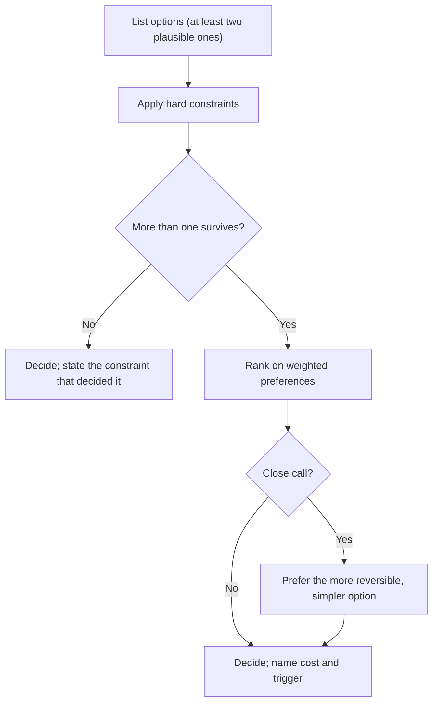

"I would put a Kafka topic between the upload service and the transcoder." The interviewer asks why not SQS. "Kafka scales better." The interviewer writes one word on the scorecard: *preference*. Nothing in that answer was wrong, and nothing in it was a trade-off: no requirement it served, no cost it incurred, no condition under which SQS would have been the better choice. The candidate may well have had good reasons. The panel cannot score reasons it cannot hear.

At the senior bar, the choice matters less than the reasoning around it. Two candidates who pick opposite databases can both earn a strong hire; a candidate who picks the "right" one without saying why usually does not. This lesson is a structure for making reasoning visible: what a complete trade-off statement contains, the currencies costs are paid in, frameworks for comparing several options, and the discipline of saying what you would not do.

## Anatomy of a trade-off statement

A complete trade-off statement has five parts:

1. **The options** actually considered: at least two, both plausible.
2. **The deciding requirement**, tied to something already on the board: a number, an SLO, a product constraint.
3. **The cost** of the chosen option, named in a currency (latency, money, consistency, operational load).
4. **Why the cost is acceptable** here.
5. **The trigger** that would change the decision.

As a template: *"I choose X over Y because of R. X costs us C, which is acceptable because A. If T happens, I would switch to Y."*

The Kafka answer, rebuilt:

> "For the upload-to-transcode hop I would use SQS rather than Kafka. The requirement is that every upload gets transcoded, at about 200 uploads a second, and nobody needs to replay the stream or have several independent consumers read it. Standard SQS costs us ordering and replay, and it charges per call: with a send, a receive and a delete per message that is around 1.5 billion calls a month, on the order of $600. That is acceptable because transcode jobs are independent and idempotent by upload id. If analytics and moderation later want to consume the same upload events, I would move to Kafka, because a replayable log read by several consumer groups is exactly what SQS does not give us."

Every sentence carries information the interviewer can score: the requirement, a number, a cost with a price, a property that makes the cost safe (idempotency), and a concrete future condition. The 1.5 billion is arithmetic you can do aloud: 200 per second × 2.6 million seconds a month ≈ 520 million messages, times three calls each.

Notice what is missing: adjectives. "Scalable", "robust", "flexible", "industry standard" and "battle-tested" carry no information, because every option on the board is all of those at some scale. Replace each adjective with the number or property it was standing in for.

## The currencies

Every design decision moves cost from one column to another. Naming both columns is the trade-off.

| Currency | Unit you should quote | Typical exchange |
|---|---|---|
| Latency | ms at p50 and p99 | Synchronous cross-region replication adds one round trip, 60–150 ms, to every write |
| Availability | Nines, or minutes of downtime per month | Five serial dependencies at 99.9% each give about 99.5%, roughly 3.6 hours a month |
| Consistency | Which anomaly a client can observe | Replica reads can be stale by the replication lag |
| Durability | Recovery point objective: how much data a failure can lose | Asynchronous replication loses up to the lag on failover |
| Throughput | Requests or MB per second per node | A single Postgres primary tops out at tens of thousands of simple writes per second |
| Money | $ per month, $ per million requests | Memory costs roughly 100× object storage per byte |
| Operational load | Systems to run, page, patch, back up and upgrade | A new stateful datastore needs expertise, runbooks and on-call coverage |
| Delivery time | Engineer-weeks | A custom solution is weeks; a managed service is days |
| Reversibility | Cost to undo | A partition key or public API is expensive to change; a cache library is not |

Two columns deserve emphasis because candidates forget them. **Operational load** is the one that bites hardest in real organisations: a team of six that adopts a fourth datastore has just signed up to be experts in it at 3 a.m. **Reversibility** changes how much care the decision deserves, which is the subject of the next section.

## Frameworks for comparing options

### Constraints first, then preferences

Separate hard constraints from soft preferences before comparing anything. A hard constraint is binary and non-negotiable: "must survive the loss of a region", "account balances must be linearizable", "the team cannot operate a new stateful system this year". Filter the options by the constraints, then rank the survivors on the preferences. The filter usually removes most of the argument, and it forces the useful question early: is that constraint actually hard, or is it a preference someone stated firmly?

### A weighted matrix, used honestly

Take a real decision: storing viewing history for a streaming service. Writes peak around 200,000 per second, the data is append-mostly, reads fetch a profile's recent history, the service runs active-active in three regions, and retention is years. The options are sharded Postgres, Cassandra, and DynamoDB with global tables.

| Criterion (weight) | Sharded Postgres | Cassandra | DynamoDB global tables |
|---|---|---|---|
| Write throughput at 200k/s (3) | 2 | 5 | 5 |
| Multi-region writes (3) | 1 | 4 | 4 |
| Operational burden for our team (2) | 3 | 2 | 5 |
| Cost at our volume (2) | 4 | 4 | 2 |
| Query flexibility (1) | 5 | 2 | 2 |
| **Weighted total** | **28** | **41** | **43** |

The matrix did two useful things, and neither was "DynamoDB wins". It eliminated sharded Postgres, which scores poorly on both heavily weighted criteria. And it showed that Cassandra and DynamoDB are within noise of each other: raise the weight on cost from 2 to 3 and they tie at 45. The real decision is a single question the matrix surfaced: do we run Cassandra ourselves, or pay a cloud provider a premium to run it for us? A company that already operates large Cassandra fleets, as Netflix famously does, scores "operational burden" completely differently from a ten-person startup.

That is how to use a matrix in an interview or a design review: to structure the comparison and find the pivot, not to launder opinions into a number. If a one-point change in a weight flips the result, say so, and decide on something else, usually reversibility or the team's existing expertise.

### One-way and two-way doors

Amazon popularised the distinction. A **two-way door** is a decision you can walk back cheaply: which cache client, which instance type, SQS versus Kafka for a single consumer, a TTL. Decide quickly, prefer the simpler option, and move on. A **one-way door** is expensive or impossible to undo: a partition key, a public API contract, an event schema other teams consume, the primary datastore, multi-leader replication. Slow down, prototype, and write it up.

The practical test is "what would it cost to change this in a year?" Changing a Cassandra partition key means rewriting every row into a new table and migrating every reader: months. Swapping a Redis client is an afternoon. Senior engineers spend their deliberation budget on the first kind and very little on the second, and they say which kind each decision is out loud.

### The cost of being wrong

When you cannot tell which option is right, compare what happens if you are wrong in each direction. Deciding not to shard a 3 TB database: if wrong, you shard in eighteen months, roughly a quarter of work for two engineers, with warning from growth graphs. Sharding now when you did not need to: every feature for years pays for cross-shard queries, resharding tooling and harder transactions. The regret is asymmetric, so you take the simpler, reversible option and name the trigger ("when the primary passes 60% CPU at peak, or storage passes 10 TB").

### Dials, not switches

Many apparent binaries are continuous. "Synchronous or asynchronous replication?" has a middle: synchronous to one replica in the same region, asynchronous across regions, which gives zero data loss for a single-node failure at the cost of a 1 ms in-region round trip. "Strong or eventual consistency?" is chosen per operation, not per system. Offering the dial often beats both extremes, and it signals that you see the design space rather than two named options.

Caching writes is a clean example of a dial between latency and durability. Step through both and notice where each pays.

```viz
{"type": "system", "scenario": "write-through", "title": "Write-through: pay latency, keep durability",
 "caption": "The write returns only after both the cache and the database have it. Reads after a write are fresh and nothing is lost if the cache dies, at the cost of the database write on every request's critical path."}
```

```viz
{"type": "system", "scenario": "write-behind", "title": "Write-behind: pay durability, gain latency",
 "caption": "The write returns once the cache has it and the database is updated later in batches. Writes are fast and coalesced, but anything still in the cache's buffer is lost if the cache node dies before flushing."}
```

## Trade-offs you will be asked about

These come up in almost every loop. Know both sides and the number that decides between them.

| Decision | Option A buys | Option B buys | What decides it |
|---|---|---|---|
| Sync vs async replication | Zero data loss on failover | No extra round trip per write | Cross-region RTT against the data loss the business accepts |
| Fan-out on write vs on read (feeds) | Fast reads from a precomputed inbox | Cheap writes for accounts with millions of followers | The follower-count distribution; usually a hybrid |
| Cache-aside vs write-through | Caches only what is read | Cache is fresh after every write | Read/write ratio and staleness tolerance |
| Relational vs wide-column | Joins, transactions, ad hoc queries | Linear write scaling, multi-region writes | Write rate and whether access patterns are known in advance |
| Monolith vs services | One deploy, in-process calls, easy refactors | Independent deploys and team autonomy | Number of teams, not request rate |
| Build vs buy (managed) | Control, possibly lower unit cost at scale | Weeks saved, no on-call for the component | Whether it is your differentiator, and your scale |
| Strong vs eventual reads | No stale reads | Lower latency, higher availability | Whether a stale read leads to a wrong write |

## Saying what you would not do

Rejections carry as much signal as choices, because they show the options you saw and the reason you declined each. There are three kinds worth stating:

- **Components you will not add.** "No message queue in the create path: it is 40 writes a second and the database handles that with room to spare." "No sharding on day one: 3 TB fits on one primary."
- **Requirements you will not meet on day one.** "I am not offering cross-region strong consistency for watch history. The only real conflict is two devices playing at once, and last-writer-wins by event time is acceptable for that."
- **Techniques you considered and rejected.** "Not two-phase commit across payments and the ledger: the coordinator blocks participants when it fails. A saga with compensating actions instead."

Separate "not now" from "never". "Not now" comes with a trigger ("when a second consumer appears"); "never" comes with a principle ("we never let two services write the same table"). Both tell the interviewer you are managing scope deliberately rather than running out of ideas.

## Trade-offs in writing

The same structure scales from a sentence to a document. In a design doc or an architecture decision record, the alternatives section is where reviewers look first. Give each alternative its strongest form (a strawman alternative convinces nobody and signals you did not look), state the deciding criteria before the comparison, and list the costs you are accepting under "consequences", so that a reader in two years knows which pain was chosen deliberately. [Design docs and RFCs](/learn/senior-craft/technical-leadership/design-docs-and-rfcs) and [documentation and ADRs](/learn/senior-craft/software-craft/documentation-and-adrs) cover the formats.



## How trade-off reasoning goes wrong

**Adjectives instead of currencies.** "It is more scalable." Scalable to what, at what cost? Detect: any sentence you could say about every option. Fix: replace the adjective with the number it stood in for.

**The strawman alternative.** Comparing your choice with an option nobody would pick ("we could store it in a flat file") proves nothing. Fix: compare against the option a strong colleague would propose.

**The false binary.** "SQL or NoSQL?" when the answer is Postgres for orders and a key-value store for sessions, or strong reads for checkout and eventual reads for browsing. Fix: ask whether the decision can be made per operation or per dataset.

**Optimising an unstated requirement.** Designing for ten million requests a second when the requirement was ten thousand, or for zero data loss when an hour's loss was acceptable. Fix: point at the requirement on the board before every decision.

**"It depends" with no dependency.** The phrase is fine as an opening and fatal as an ending. Finish it: "it depends on whether we need replay; you said we do not, so SQS."

**Never committing.** A candidate who lists five options and their trade-offs and then will not choose has shown knowledge, not judgement. Interviewers need a decision to probe. Commit, then invite the challenge.

## Interviewer follow-ups

**Q: "Why not just use DynamoDB for everything?"**

For a lot of this design I would, and I would say where: the viewing history and session state are key-value access patterns at high write rates, which is its sweet spot. I would not use it for billing, where I want multi-row transactions, ad hoc queries for finance, and auditors who can run SQL; its transactions exist but are limited and cost double capacity. And I would be explicit about lock-in: it is a one-way door for the data model, because designing tables around access patterns means a new access pattern can need a new table or index and a backfill.

**Q: "You chose eventual consistency. Convince me it is safe."**

It is safe for the operations where a stale read cannot cause a wrong write. I would list them: the home page rows, view counts, search results. Then I would list the ones where it is not safe and say what they get instead: the "resume from here" position after a device switch gets read-your-writes via the profile's home region, and anything that decrements a balance or a quota goes through a conditional write on the leader. I am choosing consistency per operation, not per system.

**Q: "What is the weakest part of your design?"**

Name it before they do. For example: "The single-region primary for billing. It meets the 99.9% target but a regional outage stops new subscriptions for the duration. I accepted that because billing writes are a small fraction of traffic and can queue on the client for a few minutes, and building multi-region writes for money is a one-way door I would not take without a clear business case." A candidate who answers "nothing, it's solid" has failed the question.

**Q: "You have half the engineers you planned for. What do you cut?"**

I cut in reverse order of how much the requirement depends on it and how reversible the shortcut is. First to go: the custom components that a managed service replaces (hosted queue instead of our own Kafka), multi-region active-active in favour of active-passive with a tested failover, and the real-time analytics path in favour of a nightly batch. I would keep the idempotency, the timeouts and the data model, because those are cheap now and expensive to retrofit.

**Q: "A senior colleague strongly prefers option B. How do you resolve it?"**

First agree on the criteria and their weights, separately from the options, because most disagreements are about priorities rather than facts. Then find the fact that would settle it and get it: a load test, a prototype, a cost estimate. If it is a two-way door and still close, pick one, write down the trigger to revisit, and commit fully even if it was not mine. If it is a one-way door, escalate the criteria question, not the technology question, to whoever owns the priority.

## Senior signals

- You state choices in the **five-part form**: options, deciding requirement, cost in a currency, why it is acceptable, and the trigger to revisit.
- You quote costs as **numbers** (milliseconds, dollars, minutes of downtime, engineer-weeks), never adjectives.
- You classify decisions as **one-way or two-way doors** and spend deliberation accordingly.
- You use a decision matrix to **find the pivot**, and you say when a result is within noise.
- You volunteer **what you would not build**, separating "not now" (with a trigger) from "never" (with a principle).
- You name the **weakest part of your own design** before the interviewer does.

## Check yourself

```quiz
- q: >-
    A candidate says: "I'd use Cassandra because it's highly scalable and battle-tested." What is the most important thing missing?
  options: ["The version of Cassandra", "The requirement it serves, the cost it incurs and the condition under which another option would be better", "A diagram of the Cassandra ring", "A comparison with at least five other databases"]
  answer: 1
  explanation: >-
    "Scalable" and "battle-tested" apply to every serious option, so they carry no information. A trade-off statement ties the choice to a requirement, names what it costs, and says when the decision would flip. Listing more databases without that structure is still preference.
- q: >-
    In a weighted decision matrix, option A scores 41 and option B scores 43. Raising one weight by a single point makes them tie. What should you conclude?
  options: ["B is the better choice", "The matrix is wrong and should be discarded", "The options are within noise on these criteria; decide on something the matrix does not capture well, such as reversibility or team expertise, and say so", "Add more criteria until one option clearly wins"]
  answer: 2
  explanation: >-
    A result that flips on a one-point weight change is a close call. The matrix's value was eliminating weak options and exposing the pivot. Adding criteria until one wins is motivated reasoning; declaring B the winner overstates what the numbers show.
- q: >-
    Which of these decisions is most clearly a one-way door?
  options: ["Choosing a Redis client library", "Setting a cache TTL", "Choosing an instance type for a stateless service", "Choosing the partition key for a table that will hold billions of rows"]
  answer: 3
  explanation: >-
    Changing a partition key means rewriting every row into a new layout and migrating every reader: months of work. The others can be changed in hours with a config change or a deploy, so they deserve quick decisions.
- q: >-
    You are unsure whether to shard a 3 TB database now or later. Which reasoning best reflects the cost-of-being-wrong framework?
  options: ["Do not shard now: if wrong, you shard later with warning from growth graphs; if you shard unnecessarily, every feature pays the complexity for years; name the trigger", "Shard now, because sharding later is always impossible", "Flip a coin, since both are defensible", "Shard now, because interviewers expect sharding"]
  answer: 0
  explanation: >-
    The regret is asymmetric: sharding later is bounded work with advance warning, while premature sharding taxes everything continuously. Choosing the reversible, simpler option and stating the trigger (CPU or storage threshold) is the senior move.
- q: >-
    An interviewer asks whether you want synchronous or asynchronous replication. Which answer shows the most judgement?
  options: ["Synchronous, because data loss is never acceptable", "Asynchronous, because latency matters most", "Synchronous to one replica in the same region and asynchronous across regions, giving zero loss on a single-node failure for about 1 ms extra per write, with the cross-region loss window stated", "Whichever the database defaults to"]
  answer: 2
  explanation: >-
    The question presents a binary, but replication is a dial. The middle setting buys most of the durability for a small, quantified latency cost and names the residual risk. Either extreme ignores the cost on the other side.
```
