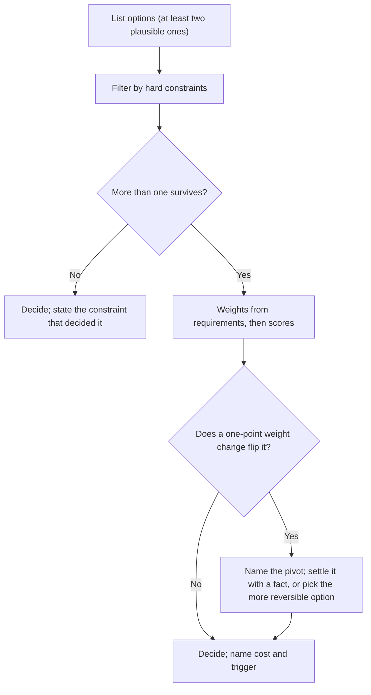

"I would put a Kafka topic between the upload service and the transcoder." The interviewer asks why not SQS. "Kafka scales better." The interviewer writes one word on the scorecard: *preference*. Nothing in that answer was wrong, and nothing in it was a trade-off: no requirement it served, no cost it incurred, no condition under which SQS would have been the better choice. The candidate may well have had good reasons. The panel cannot score reasons it cannot hear.

At the senior bar the choice matters less than the reasoning around it. Two candidates who pick opposite databases can both earn a strong hire; a candidate who picks the "right" one without saying why usually does not. This lesson gives you the structure of a complete trade-off statement, a decision matrix worked to the point where you can say which weight change would flip it, the arithmetic of being wrong, and the discipline of saying what you would not do.

## Anatomy of a trade-off statement

A complete trade-off statement has five parts:

1. **The options** actually considered: at least two, both plausible.
2. **The deciding requirement**, tied to something already on the board: a number, an SLO, a product constraint.
3. **The cost** of the chosen option, in a currency (latency, money, consistency, operational load).
4. **Why the cost is acceptable** here.
5. **The trigger** that would change the decision.

As a template: *"I choose X over Y because of R. X costs us C, which is acceptable because A. If T happens, I would switch to Y."* The Kafka answer, rebuilt:

> "For the upload-to-transcode hop I would use SQS rather than Kafka. The requirement is that every upload gets transcoded, at about 200 uploads a second, and nobody needs to replay the stream or have several independent consumers read it. Standard SQS costs us ordering and replay, and it charges per call: a send, a receive and a delete per message is about 1.5 billion calls a month, a few hundred dollars at list prices of tens of cents per million calls, less with batching. That is acceptable because transcode jobs are independent and idempotent by upload id. If analytics and moderation later want the same upload events, I would move to Kafka, because a replayable log read by several consumer groups is exactly what SQS does not give us."

Every sentence carries something the interviewer can score ([queues and async processing](/learn/system-design/building-blocks/queues-and-async-processing) has the delivery semantics behind it): the requirement, a number, a cost with an order-of-magnitude price, the property that makes the cost safe (idempotency), and a concrete future condition. The 1.5 billion is arithmetic you can do aloud: 200 per second × 2.6 million seconds a month ≈ 520 million messages, times three calls each.

What is missing is adjectives. "Scalable", "robust", "flexible", "industry standard" and "battle-tested" carry no information, because every option on the board is all of those at some scale. Replace each adjective with the number or property it was standing in for.

## The currencies

Every design decision moves cost from one column to another. Naming both columns is the trade-off.

| Currency | Unit you should quote | Typical exchange |
|---|---|---|
| Latency | ms at p50 and p99 | Synchronous cross-region replication adds a round trip, 60–150 ms depending on the region pair, to every write |
| Availability | Nines, or minutes of downtime a month | Five serial dependencies at 99.9% give 0.999⁵ ≈ 99.5%, about 3.6 hours a month ([designing for failure](/learn/system-design/senior-design-skills/designing-for-failure)) |
| Consistency | Which anomaly a client can observe | Replica reads can be stale by the replication lag |
| Durability | RPO: how much data a failure can lose | Asynchronous replication loses up to the lag on failover |
| Throughput | Requests or MB per second per node | One Postgres primary tops out around tens of thousands of simple writes a second, depending on hardware and row size |
| Money | $ per month, $ per million requests | Managed memory costs two to three orders of magnitude more per GB-month than object storage |
| Operational load | Systems to run, page, patch, back up | A new stateful datastore needs expertise, runbooks and on-call coverage |
| Delivery time | Engineer-weeks | A custom component is weeks; a managed service is days |
| Reversibility | Cost to undo | A partition key or public API is expensive to change; a cache library is not |

Candidates forget two columns. **Operational load** bites hardest in real organisations: a team of six that adopts a fourth datastore has signed up to be experts in it at 3 a.m. **Reversibility** decides how much deliberation a choice deserves, and it can be priced (below).

## Constraints first, then preferences

Separate hard constraints from soft preferences before comparing anything. A hard constraint is binary: "must accept writes in three regions", "account balances must be linearizable", "the team cannot operate a new stateful system this year". Filter the options by the constraints, then rank the survivors on preferences. The filter removes most of the argument, and it forces the useful question early: is that constraint hard, or is it a preference someone stated firmly? The section on what a weighted sum computes shows what goes wrong if you skip the filter.

## A weighted matrix, worked end to end

The decision: where to store viewing history for a streaming service. The numbers on the board: writes peak at 200,000 a second, the data is append-mostly, reads fetch one profile's recent history, the service runs active-active in three regions, retention is years, and the owning team is six engineers who know Postgres well and have never run a wide-column store. The options are sharded Postgres, Cassandra, and DynamoDB with global tables ([choosing a database](/learn/databases/nosql-and-specialised/choosing-a-database) and [wide-column stores](/learn/databases/nosql-and-specialised/wide-column-stores) cover the engines). Postgres fails the multi-region requirement and should be filtered out first; it stays in this matrix deliberately, to show what the sensitivity analysis and a weighted sum do with an option that should never have reached it.

**Set the weights before scoring anything**, each from a requirement, on a 1–3 scale:

| Criterion | Weight | The requirement that sets it |
|---|---|---|
| Write throughput at 200k/s | 3 | The load the system exists to absorb |
| Multi-region writes | 3 | Active-active in three regions is the platform standard |
| Operational burden for this team | 2 | Six engineers, no wide-column experience, shared on-call |
| Cost at this volume | 2 | Storage and writes are the service's largest line items |
| Query flexibility | 1 | Access patterns are fixed; ad hoc analysis goes to the warehouse via CDC |

**Then score each option 1–5 with a reason you could defend:**

| Criterion (weight) | Sharded Postgres | Cassandra | DynamoDB global tables |
|---|---|---|---|
| Throughput (3) | 2: 10–20 primaries at 10–20k writes/s each, plus resharding tooling | 5: LSM writes, linear scale-out | 5: partitions split automatically |
| Multi-region (3) | 1: no native multi-leader; home-region routing only | 4: multi-datacentre replication, last-write-wins per cell | 4: multi-active replication, last-writer-wins |
| Ops burden (2) | 3: known engine, new sharding layer | 2: repairs, compaction and JVM tuning the team has never done | 5: managed |
| Cost (2) | 4 | 4: on the order of 100 self-run nodes across three regions | 2: per-write pricing on 200k writes/s in three regions runs several times higher at list prices |
| Query flexibility (1) | 5 | 2 | 2 |
| **Weighted total** | **28** | **41** | **43** |

DynamoDB's total, by hand: 3×5 + 3×4 + 2×5 + 2×2 + 1×2 = 15 + 12 + 10 + 4 + 2 = 43. Cassandra's differs only on ops (2 instead of 5, costing 6 points) and cost (4 instead of 2, gaining 4): 43 − 6 + 4 = 41.

The cost score is an order-of-magnitude judgement, not a quote: it depends on provisioned versus on-demand capacity mode, reserved capacity, item size and region, and you should say that when you give it.

## Sensitivity analysis: find the pivot

A two-point lead means nothing until you know how fragile it is. For a criterion $c$ and a rival option $j$, let the gap be $G = T_{\text{winner}} - T_j$ and the score difference $\Delta_c = s_{j,c} - s_{\text{winner},c}$. Changing weight $c$ by $d$ changes the rival's position by $d \times \Delta_c$, so the rival strictly overtakes when $d \times \Delta_c > G$. For DynamoDB against Cassandra, $G = 2$:

| Criterion | $\Delta$ (Cassandra − DynamoDB) | Smallest change that flips the winner | Result |
|---|---|---|---|
| Throughput | 0 | None | Weight cannot separate them |
| Multi-region | 0 | None | Same |
| Ops burden | −3 | Lower the weight by 1: (−1) × (−3) = 3 > 2 | Cassandra 39, DynamoDB 38 |
| Cost | +2 | Raise the weight by 2 (+1 only ties at 45) | Cassandra 49, DynamoDB 47 |
| Query flexibility | 0 against Cassandra; +3 for Postgres against DynamoDB, gap 15 | Raise it from 1 to 7 | Postgres 58, DynamoDB 55 |

Then perturb every weight at once. Enumerating all 3⁵ = 243 combinations of moving each weight by −1, 0 or +1: DynamoDB wins 162 (67%), Cassandra wins 54 (22%), 27 tie (11%), and Postgres wins none.

```python
import itertools

W = [3, 3, 2, 2, 1]                        # throughput, multi-region, ops, cost, query
S = {"Postgres": [2, 1, 3, 4, 5], "Cassandra": [5, 4, 2, 4, 2], "DynamoDB": [5, 4, 5, 2, 2]}

def winners(w):
    t = {n: sum(a * b for a, b in zip(w, s)) for n, s in S.items()}
    best = max(t.values())
    return [n for n in S if t[n] == best]  # more than one name means a tie

counts = {}
for delta in itertools.product((-1, 0, 1), repeat=len(W)):
    key = "/".join(winners([x + d for x, d in zip(W, delta)]))
    counts[key] = counts.get(key, 0) + 1
print(counts)   # {'DynamoDB': 162, 'Cassandra': 54, 'Cassandra/DynamoDB': 27}
```

Read the result the way a reviewer would. The elimination of Postgres is robust: no plausible reweighting revives it. The choice between the top two is not: one point on the ops weight flips it, and the only criteria that separate them are ops and cost. The matrix has reduced a five-criterion argument to one question: **do we run Cassandra ourselves, or pay a provider a premium to run it for us?** That is a question about the team, not the technology. Netflix has written publicly about operating Cassandra at very large scale with dedicated tooling; an organisation like that scores ops burden 4 or 5, not 2, and Cassandra wins 45 to 43 or 47 to 43. Say the pivot out loud, then decide it on the fact that settles it: can this team hire or borrow Cassandra operators within the quarter?

### Running the matrix aloud

In a 45-minute interview you will not draw a 5 × 3 grid. You run the same computation in four sentences, and the panel scores it exactly as if you had:

> "Three candidates. Postgres drops out on the two requirements that matter most, 200,000 writes a second and writes in three regions. Cassandra and DynamoDB are equal on both, so the choice is ops burden against cost: DynamoDB is managed but its per-write pricing is several times higher at this volume. With a six-person team that has never run Cassandra, I take DynamoDB and accept the bill; if we already had a Cassandra team, or cost became the top constraint, I would flip."

The four moves are the filter (Postgres out), the tie on the heavy criteria, the pivot named as two currencies, and the flip condition. Candidates who skip the third move sound decisive but give the interviewer nothing to probe; candidates who skip the fourth sound certain about a two-point call.

## Under the hood: what a weighted sum computes

A weighted matrix is a linear model, $T_j = \sum_c w_c s_{j,c}$, and its derivative with respect to each weight is the score. That linearity is what makes the sensitivity table computable, and it is also the source of four ways a matrix misleads.

**It is compensatory.** High scores buy back low ones. Postgres scores 1 on multi-region writes, a platform requirement, yet raising the query-flexibility weight to 7 makes it win. A weighted sum cannot express "must", which is why hard constraints filter options before the matrix, never inside it.

**It treats ordinal scores as ratios.** A 4 is not "twice as good" as a 2, but the arithmetic assumes it. Anchor each score to a threshold ("5 = meets the requirement with 2× margin, 3 = meets it, 1 = fails it") so a score means the same thing across criteria.

**It double-counts correlated criteria.** Throughput and cost are both driven by the write rate; weighting both at full strength counts the write rate twice. Merge criteria that move together, or lower one weight.

**Normalised scores can reverse rank when you add an option.** Suppose you score raw numbers by min-max normalisation: A costs $10k a month with 30 ms p99, B costs $20k with 10 ms, both lower-is-better, weights 0.6 on cost and 0.4 on latency.

| Options present | A (cost, latency → total) | B (cost, latency → total) | Winner |
|---|---|---|---|
| A, B | 1.0, 0.0 → 0.60 | 0.0, 1.0 → 0.40 | A |
| A, B, C ($40k, 25 ms) | 1.0, 0.0 → 0.60 | 0.67, 1.0 → 0.80 | B |

Adding C, which nobody would choose, stretched the cost range from $10k–20k to $10k–40k, so B's cost now looks closer to the best and B wins. Nothing about A or B changed. Scores anchored to requirement thresholds cannot do this, because no option's score depends on the others.

## One-way and two-way doors, priced

Amazon popularised the distinction. A **two-way door** is cheap to walk back: a cache client, an instance type, SQS versus Kafka for one consumer, a TTL. A **one-way door** is expensive or impossible to undo: a partition key, a public API contract, an event schema other teams consume, the primary datastore. The test is "what would it cost to change this in a year?", and the answer can be turned into an expected cost.

**Deliberation is worth its price when it reduces expected regret by more than it costs.** Suppose a one-week spike would cut your chance of choosing wrong from 30% to 10%:

| Decision | Cost to reverse later | Expected saving from the spike (0.2 × reversal) | Spend the week? |
|---|---|---|---|
| Viewing-history partition key (3 billion rows, 12 readers) | ~40 engineer-weeks | 8 engineer-weeks | Yes: 8 saved for 1 spent |
| Queue for a single-consumer hop | ~2 engineer-weeks | 0.4 engineer-weeks | No: decide now, revisit on the trigger |

Under these assumptions the break-even is a reversal cost of 1 / 0.2 = 5 engineer-weeks. The engineer-week figures are estimates that depend on the team and its tooling; the shape of the calculation does not.

**Asymmetric regret decides "now or later" decisions.** Should you shard a 3 TB Postgres database today? Illustrative estimates:

- Shard now: 12 engineer-weeks to build, plus about 1 engineer-week a month of tax (cross-shard queries, resharding tooling, harder transactions) for the 24-month horizon: **36 engineer-weeks, certain**.
- Wait, and shard only if growth demands it: online resharding of a live, larger database at month 18 is harder, about 40 engineer-weeks, plus 6 months of tax: **46 engineer-weeks, with probability p**.

Waiting costs $46p$ in expectation against 36 for sharding now, so waiting wins whenever $p < 36/46 \approx 78\%$. Doing it later is more expensive per event; you win by paying it only when it happens. State the trigger that turns p into a certainty: "when the primary passes 60% CPU at peak, or storage passes 10 TB, we start resharding, which gives about two quarters of warning from the growth curve."

## Dials, not switches

Many apparent binaries are continuous. "Synchronous or asynchronous replication?" has a middle: synchronous to one replica in the same region, asynchronous across regions, which gives zero data loss for a single-node failure for about 1 ms more per write. "Strong or eventual consistency?" is chosen per operation, not per system. For the viewing-history service:

| Operation | Setting on the dial | What it costs |
|---|---|---|
| Record a heartbeat | Local quorum write, asynchronous to other regions | Up to the replication lag lost if the region dies |
| Resume after switching device | Local quorum read; both devices of a household usually reach the same region | A device routed to another region can read a position up to the lag old |
| Continue-watching row | Local read, stale by up to the lag | Nothing a user notices |
| Delete my history | Propagated to every region and the warehouse, tracked to completion | Seconds to hours, and a job someone must own |

Offering the dial shows you see the design space rather than two named options. Caching writes is a clean example of a dial between latency and durability; step through both and notice where each pays.

```viz
{"type": "system", "scenario": "write-through", "title": "Write-through: pay latency, keep durability",
 "caption": "The write returns only after both the cache and the database have it. Reads after a write are fresh and nothing is lost if the cache dies, at the cost of the database write on every request's critical path."}
```

```viz
{"type": "system", "scenario": "write-behind", "title": "Write-behind: pay durability, gain latency",
 "caption": "The write returns once the cache has it and the database is updated later in batches. Writes are fast and coalesced, but anything still in the cache's buffer is lost if the cache node dies before flushing."}
```

## Trade-offs you will be asked about

| Decision | Option A buys | Option B buys | What decides it |
|---|---|---|---|
| Sync vs async replication | Zero data loss on failover | No extra round trip per write | Cross-region RTT against the data loss the business accepts |
| Fan-out on write vs read (feeds) | Fast reads from a precomputed inbox | Cheap writes for accounts with millions of followers | The follower-count distribution; usually a hybrid |
| Cache-aside vs write-through | Caches only what is read | Cache fresh after every write | Read/write ratio and staleness tolerance |
| Relational vs wide-column | Joins, transactions, ad hoc queries | Linear write scaling, multi-region writes | Write rate and whether access patterns are known |
| Monolith vs services | One deploy, in-process calls | Independent deploys, team autonomy | Number of teams, not request rate |
| Build vs buy (managed) | Control, lower unit cost at scale | Weeks saved, no on-call for it | Whether it is your differentiator, and your scale |

## Saying what you would not do

Rejections carry as much signal as choices, because they show the options you saw and why you declined each. Three kinds are worth stating: components you will not add, requirements you will not meet on day one, and techniques you considered and rejected. Here are all three, for the viewing-history service, as a senior would say them in the last minutes of a design:

> "Three things I am deliberately not doing. No cache in front of the history store: the read is one partition at a few thousand a second, the store serves it in single-digit milliseconds, and a cache would add a second copy that can be stale for the one feature users complain about. I would add one if read p99 passed 20 ms at peak. No cross-region strong consistency: the only real conflict is two devices playing the same title at once, and last-writer-wins by server timestamp loses at most a few seconds of position. If product ever needed exact cross-device resume, I would route each profile's writes to a home region rather than pay a cross-region consensus round trip on 200,000 writes a second. And no two-phase commit between the history store and the recommendations feature store: the coordinator blocks participants when it fails, so recommendations will consume history through CDC and tolerate a few seconds of lag."

Each rejection has a number, a reason, and either a trigger ("if read p99 passed 20 ms") or an alternative. Separate **"not now"**, which comes with a trigger, from **"never"**, which comes with a principle ("we never let two services write the same table"). Both tell the interviewer you are managing scope deliberately rather than running out of ideas.

## Trade-offs in writing

The same structure scales to a document. In a design doc or an architecture decision record, reviewers read the alternatives section first. Give each alternative its strongest form, state the criteria and weights before the comparison, include the sensitivity result ("the choice flips if ops burden matters less than we think"), and list the costs you accept under "consequences", so a reader in two years knows which pain was chosen deliberately. [Design docs and RFCs](/learn/senior-craft/technical-leadership/design-docs-and-rfcs) and [documentation and ADRs](/learn/senior-craft/software-craft/documentation-and-adrs) cover the formats. The decision above, as the record a reviewer would want:

```text
ADR-042  Viewing-history store: DynamoDB global tables          Status: accepted
Constraints   writes in 3 regions; 200k writes/s peak; years of retention
Rejected      Sharded Postgres: fails the multi-region write constraint
Criteria      throughput 3, multi-region 3, ops burden 2, cost 2, query flexibility 1
Result        DynamoDB 43, Cassandra 41, Postgres 28
Sensitivity   flips to Cassandra if ops weight drops to 1 or cost weight rises to 4
Consequences  per-write cost several times a self-run cluster; data model tied to access patterns
Revisit when  write volume doubles, or the org staffs a Cassandra platform team
```

The "revisit when" line is what stops the decision being relitigated every quarter: anyone who wants to reopen it has to show the trigger fired.



## Choosing a comparison method

| Method | Effort | What it catches | How it misleads | Use when |
|---|---|---|---|---|
| Constraint filter | Minutes | Options that fail a must-have | A preference stated firmly passes as a constraint | Always, first |
| Weighted matrix + sensitivity | An hour | The pivot criterion; robust eliminations | Compensatory maths, ordinal scores, normalisation | Three or more survivors |
| Pairwise against a baseline (Pugh) | Minutes | Whether each option beats the incumbent per criterion | No sense of magnitude | Incremental changes to an existing system |
| Expected cost of being wrong | Minutes | Whether deliberation or waiting pays | Probabilities are guesses; say so | One-way doors, "now or later" |
| Spike or load test | Days | The fact the argument turns on | Tests the wrong workload if unshaped | The pivot is a measurable fact |

## Production failure modes

| Failure | Symptom | Diagnosis | Fix |
|---|---|---|---|
| The relitigated decision | The same debate reopens every quarter; new joiners propose the rejected option | No written criteria, weights or trigger, so nobody can tell whether conditions changed | An ADR with the criteria, the sensitivity result and the revisit trigger; reopen only when the trigger fires |
| The laundered matrix | The winner changes depending on who fills in the matrix | Weights set after the scores, by someone who already had a favourite | Weights agreed first and separately; scores anchored to thresholds; publish the flip table |
| The hidden one-way door | A "quick" choice becomes a months-long migration | An event schema or API that looked internal had 12 consumers by the time it needed changing | Count dependents before deciding; anything other teams consume is a one-way door |
| Optimising an unstated requirement | A system built for 10 million requests a second serves 10,000 at 3% utilisation | No design decision traces back to a number on the board | Point at the requirement before every decision; size to the forecast with a named trigger |
| Paralysis on a two-way door | Weeks of debate over a client library or instance type | Deliberation budget not matched to reversal cost | Price the reversal; below a few engineer-weeks, pick the simpler option today |

## Interviewer follow-ups

**"Why not use DynamoDB for everything?"** Model answer: for a lot of this design I would, and I would say where: viewing history and session state are key-value access at high write rates. Not for billing, where finance needs multi-row transactions and ad hoc SQL; DynamoDB's transactions exist but are limited in size and cost double the write capacity. And I would call the data model a one-way door: tables are designed around access patterns, so a new pattern can mean a new index and a backfill. Common wrong answer: "because of vendor lock-in", a real cost stated with no requirement it violates.

**"You chose eventual consistency. Convince me it is safe."** Model answer: it is safe where a stale read cannot cause a wrong write: home-page rows, view counts, search results. The resume position after a device switch is read at local quorum in the region where the pause was written, which is the same region for almost every household; the rare cross-region case is stale by the lag, which I measure as an SLI. Anything that decrements a balance or quota goes through a conditional write on the leader. Consistency is chosen per operation. Common wrong answer: "replication lag is only milliseconds", which ignores the tail during failover and partitions.

**"How sensitive is your choice to your weights?"** Model answer: DynamoDB leads by 2; the only criteria that separate it from Cassandra are ops burden and cost, and lowering the ops weight by one point flips it. So the decision reduces to whether this team can operate Cassandra, and I would settle that fact rather than argue weights. Postgres is eliminated under every one-point reweighting. Common wrong answer: "I am confident in the weights", which turns a close call into false precision.

**"What is the weakest part of your design?"** Model answer: name it before they do, with the reason you accepted it: "The single-region primary for billing. A regional outage stops new subscriptions; I accepted that because billing writes are a small fraction of traffic, can queue on the client for minutes, and multi-region writes for money are a one-way door I would not take without a business case." Common wrong answer: "Nothing, it is solid", or a fake weakness such as "I would add more monitoring".

**"A senior colleague strongly prefers option B. How do you resolve it?"** Model answer: agree the criteria and weights separately from the options, since most disagreements are about priorities, not facts; run the sensitivity analysis to find the criterion the choice turns on; get the fact that settles it (a load test, a cost estimate). If it is still close and a two-way door, pick one, record the trigger and commit fully. If it is a one-way door, escalate the priority question to whoever owns it. Common wrong answer: "defer to whoever has more experience", which settles the argument and teaches nobody what decided it.

## What mid-level engineers get wrong

- **Adjectives instead of currencies.** "More scalable" is a sentence that fits every option; the interviewer hears preference.
- **Scoring before weighting.** Weights chosen after the scores are fitted to a favourite, and the matrix launders it into a number.
- **Reading a 43 against a 41 as a win.** Without the flip table the two-point gap looks decisive; one weight point reverses it.
- **Putting must-haves inside the matrix.** A weighted sum lets high scores compensate for failing a requirement.
- **Spending equal deliberation on every decision.** Hours on a two-way door, minutes on a partition key.
- **The strawman alternative.** Comparing against an option nobody would pick ("a flat file") proves nothing; compare against what a strong colleague would propose.
- **"It depends" with no dependency, or never committing.** Finish the sentence ("it depends on replay; you said we do not need it, so SQS") and choose, so the interviewer has something to probe.

## Exercise: find the weight that flips the decision

```exercise
id: matrix-sensitivity
title: Decision matrix with a flip check
prompt: |
  Score a weighted decision matrix and report how fragile the winner is.

  - `weights` is a list of non-negative integers, one per criterion.
  - `scores` is a list of options; each option is a list of integer scores,
    one per criterion, in the same order as `weights`.
  - An option's total is the sum of weight × score over the criteria.
  - The winner is the option with the highest total; if several tie, the
    one with the lowest index.

  For each criterion `c`, keeping every other weight fixed:
  - `flip_up[c]` is the smallest integer `d >= 1` such that raising
    `weights[c]` by `d` gives some other option a strictly higher total
    than the original winner, both totals computed with the changed
    weight. Use `null` (Python `None`) if no such `d` exists.
  - `flip_down[c]` is the same for lowering `weights[c]` by `d`, where the
    weight may not go below 0; `null` if no allowed `d` works.

  Return an object `{"totals": [...], "winner": i, "flip_up": [...],
  "flip_down": [...]}`.
languages: [python, javascript]
entry: matrix_sensitivity
starter:
  python: |
    def matrix_sensitivity(weights, scores):
        # your code here
        return {"totals": [], "winner": 0, "flip_up": [], "flip_down": []}
  javascript: |
    function matrix_sensitivity(weights, scores) {
      // your code here
      return { totals: [], winner: 0, flip_up: [], flip_down: [] };
    }
tests:
  - args: [[3, 3, 2, 2, 1], [[2, 1, 3, 4, 5], [5, 4, 2, 4, 2], [5, 4, 5, 2, 2]]]
    expected: {"totals": [28, 41, 43], "winner": 2, "flip_up": [null, null, null, 2, 6], "flip_down": [null, null, 1, null, null]}
    label: the lesson's viewing-history matrix
  - args: [[1, 1], [[5, 1], [1, 5]]]
    expected: {"totals": [6, 6], "winner": 0, "flip_up": [null, 1], "flip_down": [1, null]}
    label: a tie goes to the lower index, and any nudge breaks it
  - args: [[1, 2], [[3, 4]]]
    expected: {"totals": [11], "winner": 0, "flip_up": [null, null], "flip_down": [null, null]}
    label: a single option can never be overtaken
  - args: [[2, 1], [[5, 5], [1, 4]]]
    expected: {"totals": [15, 6], "winner": 0, "flip_up": [null, null], "flip_down": [null, null]}
    label: a robust winner survives even a weight of zero
  - args: [[0, 3], [[1, 5], [5, 4]]]
    expected: {"totals": [15, 12], "winner": 0, "flip_up": [1, null], "flip_down": [null, null]}
    label: a zero weight cannot go lower
  - args: [[2, 2, 1], [[4, 4, 1], [3, 4, 4], [5, 1, 5]]]
    expected: {"totals": [17, 18, 17], "winner": 1, "flip_up": [1, null, 2], "flip_down": [null, 1, 1]}
    hidden: true
    label: the option that overtakes need not be the runner-up
  - args: [[3, 3, 2, 2, 1], [[2, 1, 3, 4, 5], [5, 4, 3, 4, 2], [5, 4, 5, 2, 2]]]
    expected: {"totals": [28, 43, 43], "winner": 1, "flip_up": [null, null, 1, null, 6], "flip_down": [null, null, null, 1, null]}
    hidden: true
    label: one more ops point for Cassandra makes it a tie
hints:
  - "Compute the totals and the winner first; the winner never changes while you test weights."
  - "Raising weight c by d moves rival j by d * (scores[j][c] - scores[winner][c]) relative to the winner. It overtakes when that exceeds the gap."
  - "For an integer gap g >= 0 and a positive difference k, the smallest d with d * k > g is g // k + 1. A brute-force loop over d also works."
```

## Senior signals

- You state choices in the **five-part form**: options, deciding requirement, cost in a currency, why it is acceptable, and the trigger to revisit.
- You quote costs as **numbers** (milliseconds, dollars as orders of magnitude, minutes of downtime, engineer-weeks), never adjectives.
- You set **weights before scores**, filter must-haves before the matrix, and run the **sensitivity analysis** to find the one criterion the decision turns on.
- You know how a weighted sum misleads: **compensation, ordinal scores, double counting, normalisation**.
- You **price reversibility**: expected cost of being wrong, the value of a spike, and the break-even probability for doing it later.
- You volunteer **what you would not build**, with a trigger for "not now" and a principle for "never", and you name the weakest part of your own design first.

## Check yourself

```quiz
- q: >-
    A candidate says: I would use Cassandra because it is highly scalable and battle-tested. What is the most important thing missing?
  options: ["The Cassandra version and the consistency level chosen", "A diagram of the ring showing replication across nodes", "A comparison with at least five other candidate databases", "The requirement served, the cost, and when it flips"]
  answer: 3
  explanation: >-
    Scalable and battle-tested apply to every serious option, so they carry no information. A trade-off statement ties the choice to a requirement, names what it costs, and says the condition under which another option would be better. Listing more databases without that structure is still preference.
- q: >-
    DynamoDB leads Cassandra 43 to 41. They differ only on ops burden (5 against 2, weight 2) and cost (2 against 4, weight 2). Which single one-point weight change makes Cassandra strictly win?
  options: ["Raising the cost weight from 2 to 3", "Raising the throughput weight from 3 to 4", "Lowering the ops weight from 2 to 1", "Lowering the query weight from 1 to 0"]
  answer: 2
  explanation: >-
    Lowering the ops weight by one removes 5 points from DynamoDB and 2 from Cassandra, closing the gap by 3: Cassandra 39, DynamoDB 38. Raising the cost weight by one closes the gap by 2, which only ties them at 45. Throughput and query scores are equal for the two, so those weights cannot change their order.
- q: >-
    A one-week spike would cut the chance of choosing wrong from 30% to 10%. Reversing the decision later would cost about 2 engineer-weeks. Should you run the spike?
  options: ["No: it saves about 0.4 weeks for 1 spent", "No: spikes rarely change the final decision", "Yes: it saves about 8 weeks for 1 spent", "Yes: any reduction in risk is worth a week"]
  answer: 0
  explanation: >-
    The expected saving is the drop in probability times the reversal cost, 0.2 × 2 = 0.4 engineer-weeks, less than the week the spike costs. This is a two-way door: decide now and name the trigger. The 8-week figure applies to a decision that costs about 40 engineer-weeks to reverse, such as a partition key.
- q: >-
    Sharding now costs 36 engineer-weeks over two years. Waiting costs 46 engineer-weeks, but only if growth forces it. Above roughly what probability of needing it should you shard now?
  options: ["About 78%", "About 95%", "About 22%", "About 50%"]
  answer: 0
  explanation: >-
    Waiting costs 46p in expectation, sharding now costs 36 for certain, so sharding now wins only when 46p exceeds 36, at p above 36/46, about 78%. Waiting is more expensive per event; it wins because you pay it only when it happens. 50% and 22% shard far too early, and 95% waits past the point where the expected costs cross.
- q: >-
    You scored options by min-max normalising their raw cost and latency. Adding a third option that nobody would choose changed which of the other two wins. Why?
  options: ["The winner was already inside rounding noise", "The third option split the stronger option's votes", "Normalisation rescaled the other options' scores", "The weights are re-derived whenever options change"]
  answer: 2
  explanation: >-
    Min-max scores depend on the range of the options present. An expensive newcomer stretched the cost range, so the pricier of the original two now looked closer to the best and overtook the other. Anchoring scores to requirement thresholds makes each score independent of the other options.
- q: >-
    Why should hard constraints filter options before a weighted matrix rather than being included as heavily weighted criteria?
  options: ["Hard constraints get the top weight, so they dominate anyway", "Filtering first makes the arithmetic quicker to do aloud", "A matrix cannot represent a yes-or-no criterion at all", "A weighted sum lets high scores buy back a failed must-have"]
  answer: 3
  explanation: >-
    A weighted sum is compensatory: in the lesson, sharded Postgres fails multi-region writes yet wins if the query-flexibility weight rises to 7. A must-have cannot be traded, so it belongs in a filter. A matrix can hold a 0/1 criterion, but a heavy weight still only makes failure expensive, not disqualifying.
```
