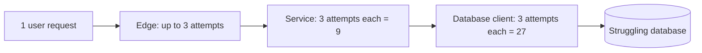
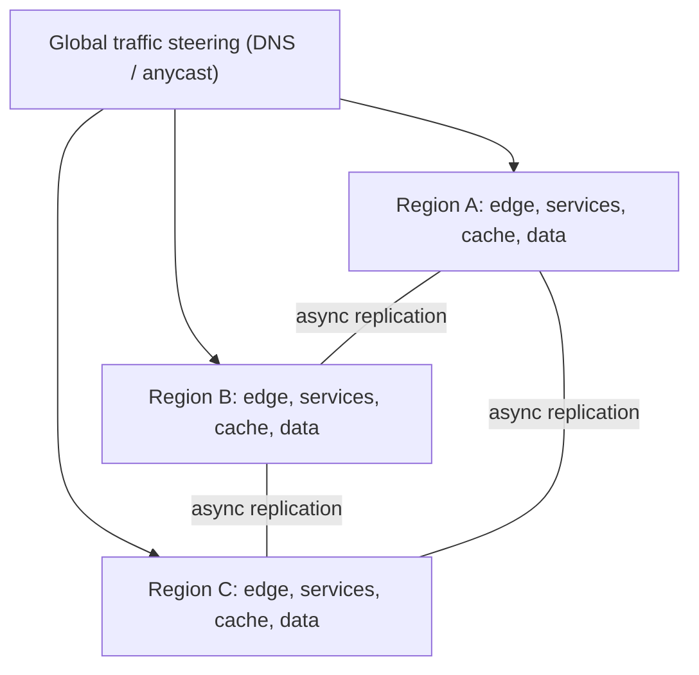

A configuration change goes out to every region at once. It is valid YAML, it passed review, and it sets a client timeout to zero. Within ninety seconds every region is failing. The architecture had three regions, redundant instances, replicated databases and a 99.99% availability target, and none of it helped, because the failure was not a machine dying. It was a change that every copy shared. Large outages mostly look like this: a deploy, a config push, an overload or a common dependency, hitting all the redundancy at the same moment.

Designing for failure means treating failure as an input to the design, alongside requirements and load. You enumerate how each part fails, decide how far each failure is allowed to spread, decide what users see while it is happening, and decide how you recover when a whole region is gone. [Resilience patterns](/learn/system-design/building-blocks/resilience-patterns) covered the mechanisms: timeouts, breakers, bulkheads, shedding. This lesson is the judgement that decides where they go and what they have to achieve.

## A failure taxonomy

| Class | Example | Why it is dangerous | Primary defence |
|---|---|---|---|
| Crash-stop | An instance, a disk or an availability zone dies | Least dangerous: clean and detectable | Redundancy and health checks |
| Omission | Dropped packets, lost messages | Looks like slowness; retries duplicate work | Timeouts, idempotent retries |
| Gray failure | A node is up and passes health checks but is slow or fails 5% of requests | Health checks and users disagree; the load balancer keeps sending it traffic | Client-side latency and error measurement, outlier ejection |
| Overload | Traffic or retries exceed capacity | Can become self-sustaining after the trigger is gone | Load shedding, retry budgets, backoff |
| Correlated | Region outage, a shared DNS, auth or config service, a certificate expiring everywhere | Defeats redundancy, because every copy fails together | Isolation: cells, staged rollouts, no shared critical dependencies |
| Poison input | A malformed message or query crashes every consumer that touches it | Replicas all crash identically, one after another | Validation, dead-letter queues, quarantine |
| Change | A bad deploy, config push or manual command | The most common trigger of major incidents | Canaries, staged rollouts, fast rollback |
| Logical corruption | A bug writes wrong data | Replication copies the damage faithfully to every replica | Point-in-time backups, delayed replicas, immutable logs |

Read the "why" column again: redundancy protects only against *independent* failures. Most of the dangerous rows are correlated failures, and the senior skill is asking of each redundant pair, "what do these two copies share?"

## Availability arithmetic

Serial dependencies multiply. A request that needs five services, each 99.9% available, succeeds 0.999⁵ ≈ 99.5% of the time: about 3.6 hours of failure a month instead of 43 minutes. Every synchronous dependency you add to the critical path costs availability.

Redundancy in parallel compounds the other way, but only if failures are independent. Two regions that are each unavailable 0.1% of the time give 1 − 0.001² = 99.9999% on paper. Now suppose a common cause (a global config push, a shared DNS provider) takes both down for 0.01% of the time. Combined unavailability becomes roughly 0.01% + (0.09%)² ≈ 0.0101%: the pair delivers 99.99%, not 99.9999%. The common-mode term dominates, which is why removing shared dependencies is worth more than adding copies.

Error budgets make targets concrete:

| Target | Downtime per 30 days | What it implies |
|---|---|---|
| 99.9% | 43 minutes | A human can be paged, diagnose and roll back, once |
| 99.99% | 4.3 minutes | Recovery must be automatic: a page, acknowledgement and decision take longer than the whole budget |
| 99.999% | 26 seconds | No single incident may be noticeable; every change must be staged and self-reverting |

The middle row is the one to remember. A 99.99% target is a statement that detection and recovery are automated, because a human in the loop consumes the month's budget before they have opened a laptop.

## Walk every box and every arrow

The method is simple and tedious, which is why it catches things. For each component and each arrow in your diagram, ask five questions: what if it is **down**, **slow**, **returning errors**, **returning wrong data**, or **overloaded**? Record detection, user impact and mitigation. For the "start playback" path of a streaming service:

| Component | Failure | User impact | Mitigation |
|---|---|---|---|
| Auth token service | Down | New logins fail | Tokens are signed and verified locally, so existing sessions continue through a grace period |
| Licence (DRM) service | p99 rises to 2 s | Slow starts | 500 ms timeout, one retry to a different instance, breaker if the error rate climbs |
| CDN steering service | Down | Client does not know which edge to use | Client falls back to a default server list shipped with its config |
| Playback metadata store | Replica stale by seconds | None visible | Accept; metadata changes rarely |
| Recommendations | Down | None, *if* it is not on this path | Verify that the playback page does not call it synchronously |

The last row is where the method pays for itself. Critical paths accumulate hidden dependencies on non-critical services: a playback page that fetches "more like this" synchronously, a checkout that waits for a loyalty-points call. Each one silently lowers the availability of the core action to that of the least reliable thing it touches.

## Blast radius

Blast radius is the fraction of users, requests or tenants affected by a single failure. The design goal is to make every failure small, using techniques at increasing scale.

**Bulkheads** give each dependency its own pool of threads or connections, so one slow dependency can exhaust only its own compartment.

```viz
{"type": "system", "scenario": "bulkhead", "nodes": 3,
 "title": "Bulkheads cap what one slow dependency can take", "caption": "With a shared pool, a slow dependency holds every worker and healthy calls queue behind it. With per-dependency pools, the slow one exhausts only its own compartment."}
```

**Circuit breakers** stop callers from spending time and threads on a dependency that is already failing, and give it room to recover.

```viz
{"type": "system", "scenario": "circuit-breaker", "requests": 15,
 "title": "A breaker turns slow failure into fast failure", "caption": "After consecutive failures the breaker opens and fails calls instantly, so callers can serve a fallback instead of waiting on timeouts; a half-open trial decides when to close again."}
```

**Cells** go further: split the whole stack (services, caches, databases) into independent copies, each serving a fixed subset of users. With 20 cells, a poison request, a bad deploy or a corrupted cache in one cell affects 5% of users. The router that maps users to cells must be the simplest component in the system, because it is the one thing all cells share. Cloud providers have written publicly about building their own control planes this way.

**Shuffle sharding** limits the damage one bad tenant can do. Assign each customer a random subset of k workers out of n. A customer whose requests crash workers takes down only its own k. With n = 100 and k = 5 there are about 75 million possible subsets; the chance another customer shares all five workers is about 1 in 75 million, and the chance it shares two or more is about 2%. About 23% of customers share at least one worker, but with a retry to one of their other four, they are unaffected.

**Staged rollouts** limit the blast radius of change, the most common trigger: one cell, then one region, then the rest, with automated comparison at each stage, and configuration shipped through the same pipeline as code. The config push in the opening story would have broken one cell.

**Regional isolation** means no synchronous cross-region calls on the request path. A region that needs another region to serve a request fails when either region fails.

## Graceful degradation

Blast radius limits *who* is affected; degradation decides *what they see*. Classify every feature as critical (must work), degradable (may be stale or partial) or optional (may disappear), then design a ladder. For a streaming home page:

1. **Normal:** personalised rows computed for this profile.
2. **Personalisation slow:** serve the profile's last computed rows from cache, hours old. Few users notice.
3. **Cache miss and personalisation down:** popular-in-your-region rows, precomputed and static.
4. **Everything but playback impaired:** a minimal page built from the client's local state ("continue watching" from the device), and playback still works.

The principle is to protect the core action (starting a stream, checking out, sending a message) at the expense of everything else. Load shedding follows the same priority: under overload, drop prefetches, telemetry and background refreshes before any request that starts a stream. Netflix has described prioritising requests at its edge in exactly this way.

Two rules make ladders real. The fallback must be **cheaper** than the primary, or it collapses under the same load. And it must be **exercised**, through chaos experiments or regular forced use, because a fallback that has never run in production is a fallback with a bug in it.

## Retries: the amplifier

Retries turn a partial failure into a total one. If each of three layers makes up to three attempts, a failing bottom layer receives 3³ = 27 requests for every user request, at exactly the moment it can least handle them.



This is how **metastable failures** happen. A brief trigger (a spike, a slow deploy, a cache flush) pushes the system into overload. Requests time out, clients retry, and the retries keep it overloaded after the trigger is gone. The system stays down at normal traffic and recovers only when load is cut well below normal. The defences:

- **Retry at one layer**, normally the one closest to the user that can still make a useful decision.
- **Retry budgets**: cap retries at a fraction of traffic (10% is a common choice) per client, so retries cannot multiply load when everything is failing.
- **Exponential backoff with jitter**, so retries spread out instead of arriving in synchronised waves.
- **Respect overload signals**: do not retry a 429 or a 503 carrying `Retry-After` sooner than it asks.
- **Idempotency** so retries are safe at all; see [idempotency and retries](/learn/system-design/building-blocks/idempotency-and-retries).

## Disaster recovery: RPO and RTO

Two numbers define recovery, and each should be set per dataset by the business cost of loss and downtime:

- **RPO (recovery point objective):** how much data, measured in time, you can afford to lose.
- **RTO (recovery time objective):** how long until the service is back.

| Strategy | What runs in the recovery region | RPO | RTO | Rough cost |
|---|---|---|---|---|
| Backup and restore | Nothing; backups are copied there | Hours (the backup interval) | Hours to a day | Little more than storage |
| Pilot light | Replicated data; compute off or minimal | Seconds to minutes | Tens of minutes (scale up, then shift) | A fraction more |
| Warm standby | A scaled-down full stack, data replicated | Seconds | Minutes | Perhaps half again |
| Active-active | Full capacity serving live traffic in every region | Zero to seconds | Seconds to minutes (shift traffic) | Double or more, including headroom |

Replication protects against losing a region, not against a bug that writes bad data: the corruption replicates in milliseconds. For logical corruption the RPO is effectively "time until someone notices", and the defences are point-in-time recovery, a delayed replica (applying changes an hour behind), and immutable event logs you can replay. Ask in every design review: "if a bug corrupted this table at 2 p.m., how do we get back to 1:59?"

## Multi-region: the data layer decides

Stateless compute is easy to run in several regions. Data is where multi-region designs succeed or fail, and there are four patterns:

1. **One write region, read replicas elsewhere.** Simple. Writes from other regions pay a cross-region round trip, and failover means promoting a replica, losing whatever was inside the replication lag, usually under a second.
2. **Home region per user.** Each user's data has a home region that takes their writes, and other regions hold read replicas. Failover moves homes. You get local writes for most users and no conflicts; this is the pattern most large consumer products converge on.
3. **Multi-leader, active-active writes.** Every region accepts writes and conflicts are resolved by last-writer-wins, merges or [CRDTs](/learn/system-design/distributed-systems/crdts-and-collaboration). Use it only for data where a merge is safe: viewing history, preferences, carts. Never for money.
4. **Consensus across regions.** A Spanner-style database commits every write to a cross-region majority: zero data loss on region failure, and tens of milliseconds or more on every write.

```viz
{"type": "system", "scenario": "replication-multi-leader", "nodes": 3,
 "title": "Active-active writes across three regions", "caption": "Each region accepts writes locally and replicates asynchronously. Concurrent writes to the same key conflict and must be resolved deterministically; this is the price of local writes and surviving a region loss."}
```



Three things decide whether evacuation actually works:

- **Headroom.** With N active regions each normally carries 1/N of traffic and must absorb 1/(N−1) after losing one. Three regions can each run at no more than two-thirds of their capacity; two regions at no more than half. That idle third is the price of active-active.
- **Warm state.** The surviving regions receive users whose data is not in their caches. A cold cache turns a region failover into a database stampede, which is why caches are replicated across regions or pre-warmed before an evacuation.
- **Pre-scaling.** Autoscaling takes minutes to boot instances, and in a real regional event everyone else is asking the cloud for capacity at the same moment. Evacuation plans scale the receiving regions first and shift traffic second.

Netflix has written publicly about running active-active across several AWS regions and practising regional evacuation regularly, shifting a whole region's traffic to the others in minutes. Automate the traffic shift, which is stateless and reversible; be more deliberate about promoting a write primary, where two primaries during a partition means divergent data.

## Failure modes of failure design

**The untested fallback.** The degraded path throws a null-pointer exception the first time it runs, during the incident. Mitigate: exercise fallbacks on purpose, continuously.

**Recovery depends on the failed region.** The deployment pipeline, secrets store, DNS control plane or runbook wiki lives in the region that is down. Mitigate: list every tool the failover needs and check where each one runs.

**Health checks that fail together.** Deep health checks that test a shared database make every instance unhealthy at once, and the load balancer removes the whole fleet. Mitigate: shallow liveness checks; never gate readiness on a dependency all instances share.

**The recovery stampede.** The service comes back and every client reconnects in the same second, knocking it over again. Mitigate: jittered reconnects, admission control, ramping traffic back.

**Split brain on data failover.** Automated promotion during a network partition leaves two primaries accepting writes. Mitigate: fencing or consensus-based promotion, or a human decision for the data layer while traffic failover stays automatic.

## Interviewer follow-ups

**Q: "Your whole region goes down. Walk me through the next ten minutes."**

Global traffic steering detects failing health checks from several vantage points within about a minute and starts shifting traffic, which the other two regions can absorb because they run at under two-thirds of capacity. For stateless services that is the whole story. For data, profile writes whose home was the failed region are re-homed; anything inside the replication lag, typically under a second of writes, is at risk, and for viewing progress that is acceptable because clients resend their latest position. Caches in the receiving regions are warm because they are replicated. What I would watch: database load in the receiving regions (cold keys), error rates on anything I have not tested failing over, and whether any of our tooling lived in the failed region.

**Q: "How do you choose RPO and RTO?"**

Per dataset, from the business cost. Ask what a minute of downtime costs and what an hour of lost writes costs, then price each DR tier. Payments: RPO zero, which means synchronous replication or consensus and higher write latency. Viewing history: RPO of seconds is fine. Analytics: restore from backup within a day. One system can have three tiers, and pretending everything needs RPO zero is how a design becomes unaffordable.

**Q: "What is the blast radius of a bad config push in your design?"**

It should be one cell, then one region, because configuration ships through the same staged pipeline as code, with automated comparison of error rates and latency at each stage and automatic rollback. If the answer were "everywhere at once", I would treat the config system as the single biggest risk in the design, bigger than any machine failure.

**Q: "Would you run payments active-active across regions?"**

Not with asynchronous multi-leader writes: two regions can each accept a charge against the same balance and last-writer-wins would lose one. I would give each account a home region that owns its writes, with synchronous replication to a second region or a consensus store if RPO must be zero, and accept a cross-region write latency on the small fraction of traffic that is payments. Reads and everything around payments can be active-active.

**Q: "How would you make a 99.99% target credible?"**

By showing that no single failure needs a human. That means automated detection within a minute, automated rollback of changes, traffic failover without promotion decisions, and a critical path with few serial dependencies, each with a fallback. I would also show the budget: 4.3 minutes a month, so two slow incidents miss it. Then I would ask whether the product needs it, because the jump from 99.9% to 99.99% can easily double the cost of the design.

## Senior signals

- You ask **"what do these copies share?"** of every redundant pair, because correlated failures defeat redundancy.
- You do the **availability arithmetic**, including the common-mode term, and know that 99.99% means automated recovery.
- You walk **every box and arrow** for down, slow, erroring, wrong and overloaded, and you hunt hidden dependencies on the critical path.
- You shrink **blast radius** deliberately: bulkheads, cells, shuffle sharding, staged rollouts, config treated as code.
- You design a **degradation ladder** that protects the core action, and you insist fallbacks are exercised.
- You set **RPO and RTO per dataset**, and you remember that replication does not protect against logical corruption.

## Check yourself

```quiz
- q: >-
    Two regions are each 99.9% available. A shared global configuration service can take both down together for 0.01% of the time. What is the realistic combined availability?
  options: ["About 99.99%, because the common-mode failure dominates", "99.9999%, because the regions are redundant", "99.8%, because availabilities multiply", "99.9%, because you can never beat a single region"]
  answer: 0
  explanation: >-
    Independent failures of both regions are negligible (about 0.00008%), but the shared dependency takes both down 0.01% of the time, so unavailability is about 0.01%. Multiplying availabilities applies to serial dependencies, not redundant ones.
- q: >-
    Why does a 99.99% availability target effectively require automated recovery?
  options: ["Because humans make mistakes", "Because the monthly budget is about 4.3 minutes, less than the time to page, acknowledge and decide", "Because regulations require it", "Because automated systems never fail"]
  answer: 1
  explanation: >-
    4.3 minutes a month is consumed by a single human response cycle. Human error is real but not the reason; automation fails too, which is why it must be tested.
- q: >-
    Each of three service layers retries a failed call up to three attempts. The database at the bottom is failing. How many database requests can one user request generate?
  options: ["3", "9", "27", "81"]
  answer: 2
  explanation: >-
    Attempts multiply per layer, 3 × 3 × 3 = 27, arriving exactly when the database is least able to cope. The fix is retrying at one layer, retry budgets, and backoff with jitter.
- q: >-
    A bug writes corrupted values into a table replicated synchronously to three regions. Which defence recovers the data?
  options: ["Failing over to another region", "Adding a fourth replica", "Increasing the replication factor", "Point-in-time recovery or a delayed replica"]
  answer: 3
  explanation: >-
    Replication copies the corruption everywhere within milliseconds, so failover and extra replicas hold the same bad data. Only a copy from before the corruption (PITR, a delayed replica, an immutable log) gets you back.
- q: >-
    You run active-active in three regions. What is the highest steady-state utilisation each region can safely run at, if it must absorb a lost region?
  options: ["About 33%", "About 50%", "About 67%", "About 90%"]
  answer: 2
  explanation: >-
    Each region normally carries one third of traffic and must carry one half after a loss, so its normal load can be at most (1/3)/(1/2) = two thirds of its capacity. Two regions would each be limited to 50%.
```
