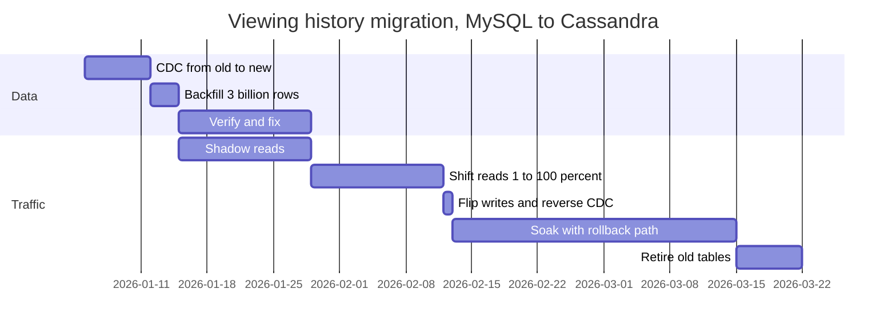

Viewing history lives in the monolith's MySQL database: 3 billion rows, about 1.5 TB, 20,000 writes a second at peak, read on every home-page load. It has to move to a new service backed by Cassandra, with the usual requirements: no downtime, no lost data, and the ability to back out at any point. Designing the new service is the easy half; any competent engineer can design a store for viewing history. The hard half is getting there, because every step happens while users are watching, and every mistake corrupts data they will see the next time they open the app.

Migrations are where senior engineers earn the title. The work is unglamorous, long (months, not weeks) and full of traps that look fine in review: two writes that race, a backfill that overwrites newer data, a cutover with no way back. This lesson is the playbook, with the reasoning for each step so you can adapt it rather than recite it.

## Why big-bang cutovers fail

The tempting plan is a weekend: stop writes, copy everything, switch, restart. It concentrates every risk into one irreversible moment. Unknown readers (the finance report nobody mentioned) break on Monday. The new system has never served production traffic, so its performance under real load is a guess. And rolling back means copying back every write made since the switch, which nobody has rehearsed.

The alternative rests on four principles:

1. **Old and new coexist**, sometimes for months.
2. **Every step is small, observable and reversible**, usually by flipping a flag.
3. **Exactly one source of truth at every moment**, and everyone knows which.
4. **Verify against production data before users depend on it.**

## Moving traffic: the strangler fig

For code and capabilities, put a routing facade in front of the old system and move one capability at a time behind it. The facade starts as a no-op proxy; each capability is flipped to the new service when it is ready; the old system shrinks until it can be switched off. [Microservices vs monolith](/learn/system-design/building-blocks/microservices-vs-monolith) walks through extracting a module this way.

```viz
{"type": "system", "scenario": "strangler-fig", "requests": 8,
 "title": "Routing one capability at a time", "caption": "The facade flips routes individually, shadows a route to compare responses before trusting it, and exposes the real bottleneck: both sides need the same data until ownership moves."}
```

Shadowing is the safest way to test with real traffic: the facade sends each request to both systems, returns the old system's answer, and compares the new one offline. Two cautions. Responses need normalising before comparison (timestamps, ordering of unordered lists, generated ids) or the diff is all noise. And never shadow writes that have side effects: a shadowed "send receipt" sends two emails, and a shadowed charge charges twice. Shadow reads freely; run writes in a dry-run mode or against a sandbox.

## Moving data: the phases

Data is where migrations stall, because both sides need it at the same time. The sequence that works:

| Phase | What happens | Source of truth | Rollback |
|---|---|---|---|
| 1. Replicate | Change data capture streams every new write from old to new | Old | Stop the stream; drop new tables |
| 2. Backfill | Copy historical rows into the new store | Old | Same |
| 3. Verify | Reconcile counts and checksums; shadow reads compare answers | Old | Same |
| 4. Shift reads | 1% → 10% → 50% → 100% of reads served by new | Old | Flip the read flag back |
| 5. Flip writes | New becomes the source of truth; reverse replication keeps old current | New | Flip back; old is current thanks to reverse replication |
| 6. Soak | Weeks of production with the rollback path intact | New | Same as 5 |
| 7. Retire | Stop reverse replication; archive and delete the old tables | New | None: this is the one-way door, taken last and deliberately |

Notice that the source of truth changes exactly once, in phase 5, and that every phase before it can be abandoned with no user impact because the old system never stopped being authoritative.

## The dual-write problem

The obvious shortcut for phase 1 is to have the application write to both stores. It corrupts data in two ways, neither of which raises an error.

**Partial failure.** The write to MySQL commits; the write to Cassandra times out. Did it apply? Retrying may duplicate it; not retrying may lose it. Either way the stores now disagree, and nothing records that they do.

**Reordering.** Two requests update the same row concurrently, and the network delivers them to the two stores in different orders:

| Time | Request A: position = 100 | Request B: position = 200 | Old store | New store |
|---|---|---|---|---|
| t1 | writes old | | 100 | — |
| t2 | | writes old | 200 | — |
| t3 | | writes new | 200 | 200 |
| t4 | writes new (delayed) | | 200 | 100 |

Both writes succeeded everywhere, no error was logged, and the stores permanently disagree. At 20,000 writes a second, this happens many times a day.

The fix is to stop treating the two stores as equals. The old store stays the single source of truth, and the new store is fed from the old store's own commit log, in commit order, by change data capture (or by a transactional outbox written in the same transaction). The log decides the order, so reordering cannot happen, and the connector retries from its last confirmed position, so a failure delays a change rather than losing it.

```viz
{"type": "system", "scenario": "cdc", "requests": 4,
 "title": "Feeding the new store from the old store's log", "caption": "The connector turns each committed change into an event in commit order. A restart re-emits events, so the new store must apply them idempotently."}
```

CDC delivers at least once, so the new store must apply events idempotently, and the robust way is a version check: every event carries the source's version for that row (a commit position or a per-row version column), and the new store applies it only if it is newer than what it holds.

```sql
-- Apply a change event only if it is newer than the stored version.
INSERT INTO viewing_history (profile_id, title_id, position_s, src_version)
VALUES ($1, $2, $3, $4)
ON CONFLICT (profile_id, title_id) DO UPDATE
  SET position_s  = EXCLUDED.position_s,
      src_version = EXCLUDED.src_version
  WHERE viewing_history.src_version < EXCLUDED.src_version;
```

In Cassandra the same effect comes from writing with `USING TIMESTAMP` set to the source version, because Cassandra resolves each cell by its write timestamp: whichever event arrives last, the highest version wins. Duplicates and replays become harmless, which matters more than it seems, because the backfill is about to replay history on top of live changes.

## Backfills that do not corrupt data

The backfill copies 3 billion existing rows while CDC is applying live changes to the same keys. That creates a race the version check exists to prevent:

- 10:00:00: the backfill reads row R from the old store at version 5.
- 10:00:01: a user updates R to version 6; CDC applies version 6 to the new store.
- 10:00:02: the backfill writes its copy of R, version 5, and overwrites the newer data.

With the conditional write, the backfill's version-5 write is rejected because version 6 is already there. The rule: **the backfill and the live stream use the same versioned write path.** And start CDC *before* the backfill, from a recorded log position, so no change can fall into the gap between the snapshot and the stream.

Backfills also have to be polite to production and survive their own crashes:

```python
def backfill(end_key, batch=1000, rows_per_s=20_000):
    last = load_checkpoint()                              # None on the first run
    while True:
        rows = replica.fetch_after(last, limit=batch)     # WHERE pk > last ORDER BY pk LIMIT batch
        if not rows or rows[0].pk > end_key:
            break
        new_store.upsert_if_newer(rows)                   # same version check as the CDC path
        last = rows[-1].pk
        save_checkpoint(last)                             # resume point after a crash
        time.sleep(len(rows) / rows_per_s)                # throttle; slow further if lag rises
```

Read from a replica, not the primary. Throttle, and back off automatically when source replication lag or p99 rises. Checkpoint by key range so a crash resumes instead of restarting; the versioned writes make re-running any range harmless. And do the duration arithmetic before promising a date: 3 billion rows at 5,000 rows a second is about 7 days; at 30,000 rows a second, about 28 hours. Split the key space across parallel workers if the source can take it.

## Verification

"The job finished without errors" is not evidence. Verify in layers, cheapest first:

- **Counts per key range.** Cheap; catches gross loss, such as a whole partition missing.
- **Checksums per key range.** Hash the rows in each range on both sides and compare; drill into ranges that differ. This is the Merkle-tree idea from [gossip and anti-entropy](/learn/system-design/distributed-systems/gossip-and-anti-entropy), applied to a migration.
- **Sampled deep comparison.** Random keys, every field, compared after normalisation.
- **Shadow reads.** Serve from the old store, read the new one too, compare, and emit a mismatch metric by category.

Classify every mismatch. **In flight** (CDC lag; it disappears on a recheck a few seconds later), **bug** (a transformation is wrong; fix it and re-run the affected ranges), or **dirty source data** (the old store holds values the new schema rejects; decide explicitly what to do with each class). The goal is not a small mismatch rate; it is an explained one, sustained across at least a full weekly cycle so weekend traffic and monthly jobs have run against the new store.

## Cutover and rollback

**Reads** move by percentage, by user cohort and sticky per user, so one person does not flip between old and new state on every refresh. Compare error rates and latency between cohorts at each step, exactly as a canary release compares versions.

```viz
{"type": "system", "scenario": "canary",
 "title": "Shifting reads the way you ship code", "caption": "A small share of traffic goes to the new path, its metrics are compared with the old path on the same window, and the share widens only when the gate passes. A failure costs one analysis window for a small cohort."}
```

**Writes** are the hard moment, because this is where the source of truth changes. The simplest safe method is a short write pause: stop accepting writes (or buffer them at the client for a few seconds, which viewing progress tolerates easily), wait for CDC lag to reach zero, flip the source of truth, resume. For data that cannot pause at all, ownership can be flipped per key range or per cohort, at the cost of more complex routing.

The moment writes land in the new store first, **start reverse replication** from new to old. It keeps the old store current, so rollback remains a flag flip rather than a data-recovery project. Without it, rolling back loses every write since the cutover, and the cutover has quietly become a one-way door. Keep the reverse path for a soak period of weeks, then stop it, make the old tables read-only, archive them, and delete them.



About three months end to end, for a table whose new schema took a week to design. That ratio is normal and worth saying out loud when you estimate a migration.

## Schema and contract evolution

Not every change is a migration between systems. Most are changes to a live schema or contract, and they follow the same principle: every version that can be live at the same time must work with every shape of data it can meet.

**Database schemas: expand and contract.** Renaming a column is six steps, not one: add the new column (expand), write both, backfill, switch reads to the new column, stop writing the old one, drop it (contract). Each step is independently deployable and reversible until the drop. [Schema migrations at scale](/learn/databases/data-modeling-and-evolution/schema-migrations-at-scale) covers online DDL and the tooling.

```viz
{"type": "system", "scenario": "blue-green",
 "title": "Why rollbacks need expand/contract", "caption": "Two versions run against one database around every deploy. The schema change ships as an expand step so the old version still works after a rollback; the contract step runs only once the old version can never return."}
```

**APIs: additive by default.** Add optional fields and new endpoints; never change the meaning or type of an existing field; make clients tolerant readers that ignore fields they do not know. When a break is unavoidable, run `/v1` and `/v2` side by side and migrate callers; see [API design and versioning](/learn/system-design/building-blocks/api-design-and-versioning). For device clients this is not optional: TVs, consoles and phones keep running old app versions for years, so an API serving them must support every version you have not explicitly stopped supporting.

**Events: compatibility rules in a registry.** Backward compatibility lets new consumers read old events; forward compatibility lets old consumers read new events. Enforce the mode in a schema registry at publish time, not by review; [event-driven architecture](/learn/system-design/building-blocks/event-driven-architecture) covers the rules.

## Deprecations that finish

A migration is finished when the old thing is gone, and most never get there: the last 5% of callers keep the old system alive for years at full operational cost. Deprecations finish when you:

- **Measure callers.** Per-client and per-version telemetry on every deprecated endpoint or table. You cannot retire what you cannot attribute.
- **Announce with dates** in the channels callers actually read, and in the protocol: the `Deprecation` and `Sunset` HTTP response headers tell automated clients the end date.
- **Run brownouts.** Scheduled short windows in which the deprecated path returns errors flush out callers nobody knew about while there is still time to fix them.
- **Expect Hyrum's law.** With enough users, every observable behaviour of your system is depended on by somebody: response ordering, error message text, timing. Budget for discovering these.
- **Own the long tail.** The last 1% is usually one forgotten batch job. Find its owner and migrate it, or record an explicit exception with a name and an end date.
- **Delete the code**, the flags and the tables. Dead paths are future incidents.

## Failure modes

**Two sources of truth.** Midway through, some writes go to old and some to new, and nobody can say which is authoritative for a given row. Detect: shadow-read mismatches that do not converge. Mitigate: a single, documented flip of the source of truth, gated on zero replication lag.

**The backfill overwrote newer data.** Rows revert to older values after the backfill passes them. Detect: mismatches clustered in recently updated rows. Mitigate: versioned conditional writes on every path into the new store.

**Rollback that loses data.** The cutover succeeded, a bug appears a week later, and rolling back would discard a week of writes. Mitigate: reverse replication until the soak ends.

**The backfill hurts production.** Replica lag climbs, the primary's I/O saturates, user latency rises. Mitigate: read from replicas, adaptive throttling on lag and p99, run at off-peak hours.

**Shadowed side effects.** Emails, charges or notifications sent twice. Mitigate: shadow reads only; writes in dry-run mode.

**The stalled migration.** Ninety-five percent of traffic moved, the old system still runs for the last 5%, and the team has moved on. Detect: two systems' costs on the bill a year later. Mitigate: retirement is a milestone in the plan with an owner, not a hope.

## Interviewer follow-ups

**Q: "Why not just dual-write from the application? It is much simpler."**

Because it gives two sources of truth with no ordering between them. A partial failure leaves the stores disagreeing with no record of it, and two concurrent updates can land in opposite orders so the stores disagree permanently without any error. I would keep one source of truth and feed the new store from its commit log with CDC or an outbox, with versioned writes so duplicates and the backfill cannot overwrite newer data. If CDC is unavailable, the application writes the old store and an outbox row in one transaction, and a relay applies it to the new store.

**Q: "How do you know the new store is correct before you switch reads?"**

Counts and checksums per key range to find gross gaps, sampled field-by-field comparison, and shadow reads over at least a week, with every mismatch classified as in-flight lag, a transformation bug or dirty source data. I switch reads only when the unexplained mismatch rate is zero over a full weekly cycle, and even then I move 1% of users first and compare their error and latency metrics against everyone else.

**Q: "Mid-migration you discover the new store has corrupted 0.1% of rows. What now?"**

Flip reads back to the old store, which is still the source of truth, so users are unaffected within seconds. Find the bug, fix the transformation, identify the affected key ranges from the verification data, and re-run the backfill for those ranges; the versioned writes make that safe while CDC keeps running. This is exactly why the source of truth does not move until verification is clean.

**Q: "How long do you keep the rollback path?"**

Long enough to cover the kinds of failure that show up late: a full weekly cycle for traffic patterns, the monthly batch jobs, and a margin; typically two to four weeks. The cost is running reverse replication and the old store, which is cheap next to a rollback that loses data. Then I retire it deliberately, as a planned step with a date.

**Q: "You need to rename a column that 40 services read. How?"**

Expand and contract, with the consumer list as the critical path. Add the new column and write both; backfill; publish the new column and a deadline; track which services still read the old one through query logs or a view that records access; migrate them, the long tail by hand; then stop writing the old column and drop it. It takes months, and the honest answer includes asking whether the rename is worth that at all.

## Senior signals

- You insist on **exactly one source of truth** at every moment and plan the single step where it changes.
- You reject **naive dual writes** and can draw the reordering timeline that shows why.
- You make **every write path versioned and idempotent**, so CDC replays and backfills cannot overwrite newer data.
- You verify with **counts, checksums, samples and shadow reads**, and you require every mismatch to be explained.
- You keep **rollback cheap with reverse replication**, and you know when a step becomes a one-way door.
- You treat **retirement and deletion as part of the plan**, with brownouts, telemetry and an owner for the long tail.

## Check yourself

```quiz
- q: >-
    During a migration the application writes each update to the old store and then the new store. Two concurrent updates to the same row both succeed everywhere with no errors. What can still go wrong?
  options: ["The old store deadlocks on the two concurrent updates", "The new store rejects the second write as a conflict", "The two stores may apply them in different orders", "Nothing; both stores received both writes successfully"]
  answer: 2
  explanation: >-
    Without a shared order, the stores can apply the same two writes in different sequences and end with different final values, permanently and silently. Receiving both writes is not enough; order matters. Feeding the new store from the old store's commit log fixes the order.
- q: >-
    A backfill copies rows while CDC applies live updates to the same keys. What prevents the backfill from overwriting a newer value with an older copy?
  options: ["Running the backfill faster than CDC can overtake it", "Reading the backfill from the primary, not a replica", "Finishing the backfill before starting CDC at all", "Version-checked conditional writes on both paths"]
  answer: 3
  explanation: >-
    The race is between reading an old version and writing it after a newer one has landed. Applying a row only if its source version is newer than the stored one, on both the backfill and CDC paths, makes the order of arrival irrelevant. Starting the backfill first would leave a gap of missed changes; speed and read source do not remove the race.
- q: >-
    Why start reverse replication (new to old) at the moment writes move to the new store?
  options: ["To double write throughput by using both stores at once", "Because CDC only works in one direction at a time", "So a rollback does not lose writes made after cutover", "To verify the new store by comparing it with the old"]
  answer: 2
  explanation: >-
    Without it, the old store freezes at cutover and a rollback would discard everything written since, turning the cutover into a one-way door. With it, the old store stays current and rollback remains a flag flip.
- q: >-
    You want to rename a column read by several services without downtime. Which sequence is correct?
  options: ["Drop the old column first so that stale services fail fast", "Add, dual-write, backfill, move reads, stop old writes, drop", "Rename it in a single migration and deploy every service at once", "Create a new table and switch services over without copying"]
  answer: 1
  explanation: >-
    Expand and contract (add the new column, write both, backfill, move reads, stop writing the old one, then drop it) keeps every version that can be live compatible with the schema at every step, and each step is reversible until the final drop. Simultaneous deploys across services are not atomic, so a one-step rename breaks whatever deploys late.
- q: >-
    Shadow traffic compares the new system's responses with the old system's. Which requests should not be shadowed to the new system?
  options: ["Requests that are served from the cache on the old path", "Requests from older mobile clients on slow networks", "Read requests that return very large responses", "Requests with side effects such as charging a card"]
  answer: 3
  explanation: >-
    Shadowing executes the request twice. For reads that only costs capacity; for side-effecting writes it sends two emails or two charges. Those paths run in dry-run mode or against a sandbox instead.
```
