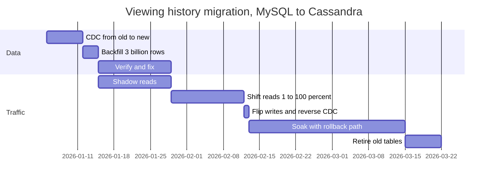

Viewing history lives in the monolith's MySQL database: 3 billion rows, about 1.5 TB, 20,000 writes a second at peak, read on every home-page load. It has to move to a new service backed by Cassandra, with the usual requirements: no downtime, no lost data, and the ability to back out at any point. Designing the new service is the easy half. The hard half is getting there, because every step happens while users are watching, and every mistake corrupts data they will see the next time they open the app.

Migrations are where senior engineers earn the title. The work is long (months, not weeks) and full of traps that look fine in review: two writes that race, a backfill that overwrites newer data, a cutover with no way back. This lesson traces each trap on concrete rows, then the mechanism that removes it.

## Why big-bang cutovers fail

The tempting plan is a weekend: stop writes, copy everything, switch, restart. It concentrates every risk into one irreversible moment. Unknown readers (the finance report nobody mentioned) break on Monday. The new system has never served production traffic, so its behaviour under real load is a guess. Rolling back means copying back every write made since the switch, which nobody has rehearsed. The alternative rests on four principles:

1. **Old and new coexist**, sometimes for months.
2. **Every step is small, observable and reversible**, usually by flipping a flag.
3. **Exactly one source of truth at every moment**, and everyone knows which.
4. **Verify against production data before users depend on it.**

## Moving traffic: the strangler fig

Put a routing facade in front of the old system and move one capability at a time behind it. The facade starts as a no-op proxy; each route flips to the new service when it is ready; the old system shrinks until it can be switched off. [Microservices vs monolith](/learn/system-design/building-blocks/microservices-vs-monolith) walks through extracting a module this way. Midway through, the facade's routing table might read:

```text
GET  /history/{profile}            -> new                     # migrated, reads only
POST /history/{profile}            -> old                     # writes follow the source of truth
GET  /continue-watching?profile=P  -> new if hash(P) % 100 < 10 else old   # 10% cohort, sticky
                                      shadow to new when served by old     # compare, discard
GET  /history/export               -> old                     # finance batch job, not migrated
*                                  -> old
```

Six requests through it:

| # | Request | Rule matched | Served by | Shadowed? |
|---|---|---|---|---|
| 1 | `GET /history/17` | Migrated read | New | No |
| 2 | `POST /history/17` | Writes stay on the source of truth | Old | Never: writes are not shadowed |
| 3 | `GET /continue-watching?profile=17`, hash bucket 42 | Outside the 10% cohort | Old | Yes: new store read, compared, discarded |
| 4 | `GET /continue-watching?profile=903`, bucket 7 | Inside the cohort | New | No |
| 5 | `GET /history/export` | Not migrated | Old | No |
| 6 | `GET /profile/17/settings` | Default | Old | No |

The cohort is chosen by a hash of the profile, not per request, so one person does not flip between old and new state on every refresh; raising the threshold from 10 to 50 moves more profiles without moving any back.

```viz
{"type": "system", "scenario": "strangler-fig", "requests": 8,
 "title": "Routing one capability at a time", "caption": "The facade flips routes individually, shadows a route to compare responses before trusting it, and exposes the real bottleneck: both sides need the same data until ownership moves."}
```

Shadow comparisons need normalising first (timestamps, ordering of unordered lists, generated ids) or the diff is all noise. Never shadow writes with side effects: a shadowed "send receipt" sends two emails and a shadowed charge charges twice. Shadow reads freely; run writes in a dry-run mode or against a sandbox.

## Moving data: the phases

Data is where migrations stall, because both sides need it at once. The sequence that works:

| Phase | What happens | Source of truth | Rollback |
|---|---|---|---|
| 1. Replicate | CDC streams every new write from old to new | Old | Stop the stream; drop new tables |
| 2. Backfill | Copy historical rows into the new store | Old | Same |
| 3. Verify | Counts and checksums per chunk; shadow reads compare answers | Old | Same |
| 4. Shift reads | 1% → 10% → 50% → 100% of reads served by new | Old | Flip the read flag back |
| 5. Flip writes | New becomes the source of truth; reverse replication keeps old current | New | Flip back; old is current |
| 6. Soak | Weeks of production with the rollback path intact | New | Same as 5 |
| 7. Retire | Stop reverse replication; archive and delete the old tables | New | None: the one-way door, taken last |

The source of truth changes exactly once, in phase 5, and every phase before it can be abandoned with no user impact.

## The dual-write problem, traced

The obvious shortcut for phase 1 is to have the application write to both stores. It corrupts data in two ways, and neither raises an error. Both traces use one row: profile 17, title 42, the resume position.

**Reordering.** Two requests update the row concurrently (a TV sends 100 s, a phone sends 200 s), and the network delivers their writes to the two stores in different orders:

| Step | Request A (position 100) | Request B (position 200) | Old store | New store |
|---|---|---|---|---|
| 1 | Writes old | | 100 | — |
| 2 | | Writes old | 200 | — |
| 3 | | Writes new | 200 | 200 |
| 4 | Writes new (delayed by a GC pause) | | 200 | 100 |

Both writes succeeded everywhere, nothing was logged, and the stores permanently disagree. At 20,000 writes a second with pauses of tens of milliseconds, this happens many times a day.

**Partial failure.** The row starts at position 50 in both stores, and request A's second write times out:

| Step | Request A (position 100) | Request B (position 200) | Old store | New store |
|---|---|---|---|---|
| 1 | Writes old: commits | | 100 | 50 |
| 2 | Writes new: times out, outcome unknown | | 100 | 50 or 100 |
| 3 | | Writes old, then new | 200 | 200 |
| 4 | Retries new | | 200 | 100 |

Without the retry, a lost step-2 write leaves the new store at 50 while the old holds 100 until B arrives; with the retry, the new store ends at 100 while the old holds 200, the reordering bug caused by the fix for the first bug. Either way the stores disagree and nothing records that they do.

## One log decides the order: CDC and the outbox

The fix is to stop treating the two stores as equals. The old store stays the single source of truth, and the new store is fed from the old store's own commit log, in commit order, by change data capture. For the reordering case the binlog holds position 100 then position 200, because that is the order the old store committed them; the connector applies them in that order and both stores end at 200. A connector that crashes resumes from its last confirmed log position, so a failure delays a change instead of losing it.

```viz
{"type": "system", "scenario": "cdc", "requests": 4,
 "title": "Feeding the new store from the old store's log", "caption": "The connector turns each committed change into an event in commit order. A restart re-emits events, so the new store must apply them idempotently."}
```

When log-based CDC is not available (a managed database without log access, or a team that cannot run connectors), the **transactional outbox** gets the same ordering from inside the application:

1. In one transaction: `UPDATE viewing_history SET position_s = 200, version = 6 ...` and `INSERT INTO outbox (id, key, version, payload) VALUES (9001, '17:42', 6, ...)`; commit. Both rows exist, or neither does.
2. A relay polls `SELECT ... FROM outbox WHERE id > 9000 ORDER BY id LIMIT 500`, writes each event to the new store (or a Kafka topic), then records 9001 as its checkpoint.
3. If the relay crashes after writing and before checkpointing, it re-sends 9001 on restart. The new store's version check discards the duplicate.

>>>

| | Application dual write | Transactional outbox | Log-based CDC |
|---|---|---|---|
| Ordering | None between stores | Outbox id order, per database | Commit order |
| Atomic with the source write | No | Yes, same transaction | Yes, reads the committed log |
| Application changes | Every write path | Every write path adds an insert | None |
| Load on the source | A second network write per request | An extra row per write, plus polling | Reading the log |
| Catches writes from scripts and other services | No | Only those that write the outbox | Yes, everything committed |

CDC delivers at least once, so every path into the new store applies events with a version check: each event carries the source's version for the row (a commit position or a per-row version column), and the new store applies it only if it is newer than what it holds.

```sql
-- Apply a change event only if it is newer than the stored version.
INSERT INTO viewing_history (profile_id, title_id, position_s, src_version)
VALUES ($1, $2, $3, $4)
ON CONFLICT (profile_id, title_id) DO UPDATE
  SET position_s  = EXCLUDED.position_s,
      src_version = EXCLUDED.src_version
  WHERE viewing_history.src_version < EXCLUDED.src_version;
```

In Cassandra the same effect comes from `USING TIMESTAMP` set to the source version, because Cassandra resolves each cell by write timestamp: whichever event arrives last, the highest version wins. Deletes must leave a **tombstone** carrying their version; otherwise a stale copy arriving later has nothing to lose to and resurrects the row. [Change data capture](/learn/big-data/streaming/change-data-capture) covers connectors, snapshots and schema changes in depth.

## Under the hood: how a snapshot joins the log

A CDC connector reads a replication stream the database already produces: MySQL's row-based binlog, positioned by file and offset or by GTID; Postgres's write-ahead log through a logical replication slot, positioned by LSN. The connector records the position it has applied, and the database retains log from that position onward, which is also why an abandoned Postgres slot fills the disk.

The historical rows are not in the log, so they must be read with `SELECT`, and a `SELECT` races the log. Netflix has written publicly about DBLog, its CDC framework, which solves this with watermarks so chunks of the table can be read while the log keeps streaming; Debezium's incremental snapshots use the same idea. The algorithm, per chunk: pause log processing briefly; write a low watermark row to a watermark table, `SELECT` the next chunk by primary key into memory, write a high watermark row; resume processing the log. Any log event between the two watermarks removes its key from the in-memory chunk, because the log's value is at least as new. When the high watermark arrives in the log, the remaining chunk rows are emitted at that position.

| Step | Log, in commit order | In-memory chunk | Emitted downstream |
|---|---|---|---|
| 1 | Low watermark L1 | | |
| 2 | (`SELECT` pk 1–4: 1@v3, 2@v5, 3@v1, 4@v2) | {1, 2, 3, 4} | |
| 3 | Update pk 2 → v6, committed during the select | {1, 3, 4} | pk 2 @ v6 |
| 4 | High watermark H1 | {} | pk 1 @ v3, pk 3 @ v1, pk 4 @ v2 |
| 5 | Update pk 3 → v2 | | pk 3 @ v2 |

Every row reaches the output either from the chunk or from a newer log event, never an older chunk copy after a newer event, and the log never pauses for long. Keep the version check in the sink anyway: it is the defence against every other path.

## Backfills that do not corrupt data

A backfill that bypasses such a connector races live changes on the same keys:

- 10:00:00: the backfill reads row (17, 42) from the old store at version 5, position 100.
- 10:00:01: the user watches on; CDC applies version 6, position 200, to the new store.
- 10:00:02: the backfill writes its copy, version 5, and overwrites the newer data.

With the conditional write, the version-5 write is rejected because version 6 is already there. The rules: **the backfill and the live stream use the same versioned write path**, and **CDC starts before the backfill**, from a recorded log position, so no change falls into the gap between snapshot and stream.

**Chunk by primary key, never by `OFFSET`.** `WHERE pk > :last ORDER BY pk LIMIT 1000` is an index range scan that costs the same for the last chunk as the first. `LIMIT 1000 OFFSET n` makes the database walk and discard n rows each time: over 3 million chunks that is about 1000 × (3 × 10⁶)² / 2 = 4.5 × 10¹⁵ rows visited, against 3 × 10⁹.

**Throttle from a budget, then close the loop.** The new cluster was load-tested to hold its p99 write SLO up to 150,000 replica writes a second, and each row costs three (replication factor 3), so it absorbs 50,000 rows a second. Live writes swing from 8,000 at 08:00 to 20,000 at the evening peak, leaving 30,000–42,000 rows a second of headroom. The source replica is not the constraint: 30,000 rows a second at 500 bytes is 15 MB/s of primary-key range reads. The simulation below compares throttles: live traffic on that daily curve, capacity dipping randomly by up to 15% per 10-minute window (compaction, repairs), backfill writes accepted first, and any shortfall landing on the CDC stream as lag; seed 7.

```python
import math, random
ROWS, CAP, RF, DAY = 3_000_000_000, 150_000, 3, 86_400

def live_rate(t):                           # 8k rows/s at 08:00, 20k at the 20:00 peak
    return 14_000 + 6_000 * math.cos(2 * math.pi * (t - 72_000) / DAY)

def run(policy, seed=7, max_days=6):
    rng = random.Random(seed)
    mult, done, backlog, r, max_lag, over, t = 1.0, 0, 0.0, 5_000.0, 0.0, 0, 0
    while done < ROWS and t < max_days * DAY:
        if t % 600 == 0:
            mult = rng.uniform(0.85, 1.0)   # compaction and repair dips
        live, lag = live_rate(t), backlog / live_rate(t)
        budget = max(0.0, 0.8 * (CAP / RF - live))   # 80% of nominal headroom
        if isinstance(policy, int):
            r = policy
        elif policy == "budget":
            r = budget
        elif t % 10 == 0:                   # controllers act every 10 s
            if policy == "aimd":
                r = r / 2 if lag > 2.0 else min(r + 1_000, 60_000)
            else:                           # hybrid: budget, halved while lag > 2 s
                r = budget / 2 if lag > 2.0 else budget
        backlog = max(0.0, backlog + live + r - CAP * mult / RF)
        done += r
        max_lag, over, t = max(max_lag, backlog / live), over + (backlog / live > 2), t + 1
    return round(t / 3600, 1), round(max_lag, 1), round(over / t, 3)

for p in (40_000, 10_000, "budget", "aimd", "hybrid"):
    print(p, run(p))
```

| Throttle | Hours for 3 billion rows | Worst CDC lag | Time with lag over 2 s |
|---|---|---|---|
| Fixed 40,000 rows/s | 20.8 | 7.6 hours | 100% |
| Fixed 10,000 rows/s | 83.3 | 0 | 0% |
| 80% of computed headroom | 28.9 | 129 s | 12.0% |
| AIMD on CDC lag (+1,000/10 s, halve above 2 s) | 31.9 | 9.7 s | 3.5% |
| Headroom budget, halved while lag > 2 s | 29.0 | 2.7 s | 0.5% |

The fixed fast rate finishes first by leaving every user's history hours stale. The fixed safe rate takes three and a half days. The computed budget is fast but blind to capacity dips; the lag-only controller is safe but probes. Feed-forward from the budget plus feedback from lag gets both. The loop, with checkpoints:

```python
def backfill(end_key, batch=1000):
    last = load_checkpoint()                           # None on the first run
    while True:
        rows = replica.fetch_after(last, limit=batch)  # WHERE pk > last ORDER BY pk LIMIT batch
        if not rows or rows[0].pk > end_key:
            break
        new_store.upsert_if_newer(rows)                # same version check as the CDC path
        last = rows[-1].pk
        save_checkpoint(last)                          # a crash resumes here
        rate = 0.8 * (NEW_STORE_ROWS_PER_S - live_write_rate())
        if cdc_lag_seconds() > 2.0:
            rate /= 2
        time.sleep(len(rows) / max(rate, 100))
```

The versioned writes make re-running any range harmless, so a crash, a bug fix or a verification failure means "re-run these chunks", not "start over". Parallel workers split the key space so no single reader is the bottleneck, but they share one budget: ten workers at 3,000 rows a second each is the same 30,000 as one worker at full rate. The duration is rows ÷ budget, here 3 × 10⁹ / ~29,000 ≈ 29 hours, and only more capacity in the new store shortens it.

## Verification

"The job finished without errors" is not evidence. Verify in layers, cheapest first:

- **Counts per key range.** Catches gross loss, such as a missing partition.
- **Checksums per chunk.** Hash each row, combine per chunk on both sides, compare, and drill into chunks that differ. Percona's `pt-table-checksum` combines row CRC32s with `BIT_XOR`; an XOR cancels identical duplicate rows, so pair it with the count or use a sum of 64-bit hashes. This is the Merkle-tree idea from [gossip and anti-entropy](/learn/system-design/distributed-systems/gossip-and-anti-entropy), applied to a migration.
- **Sampled deep comparison.** Random keys, every field, after normalisation.
- **Shadow reads.** Serve from old, read new too, emit a mismatch metric by category.

```sql
-- One chunk's fingerprint on the MySQL side; the new side computes the same over the same key range.
SELECT COUNT(*) AS n,
       BIT_XOR(CRC32(CONCAT_WS('#', profile_id, title_id, position_s, src_version))) AS fp
FROM viewing_history
WHERE profile_id >= 1700000 AND profile_id < 1710000;
```

How many clean shadow reads are enough? With zero mismatches in n comparisons, the 95% upper bound on the mismatch rate is about 3/n (the rule of three), so 30,000 clean reads bound it below 0.01%. Shadowing 1% of 30,000 home-page reads a second gives that in under two minutes, so volume is never the constraint; **coverage** is. Run shadow reads across a full weekly cycle so weekend patterns and monthly jobs have met the new store.

Classify every mismatch: **in flight** (CDC lag; gone on a recheck seconds later), **bug** (a transformation is wrong; fix it and re-run the affected chunks), or **dirty source data** (values the new schema rejects; decide explicitly per class). The goal is not a small mismatch rate but an explained one.

## Cutover and rollback

**Reads** move by cohort, sticky per user, and each step compares error rate and latency between cohorts, exactly as a canary release compares versions.

```viz
{"type": "system", "scenario": "canary",
 "title": "Shifting reads the way you ship code", "caption": "A small share of traffic goes to the new path, its metrics are compared with the old path on the same window, and the share widens only when the gate passes. A failure costs one analysis window for a small cohort."}
```

**Writes** are the hard moment, because the source of truth changes. The simplest safe method is a short write pause, run at the daily trough (8,000 writes a second here):

1. Set the `writes_paused` flag. The progress service stops writing to the old store and buffers requests in memory; clients already retry progress writes, so a few seconds of delay is invisible.
2. Read the old store's current log position (binlog GTID set) and wait until the CDC connector has applied through it. At a normal lag of about 300 ms this takes well under a second.
3. Flip `source_of_truth` to `new`. From here the write path writes the new store.
4. Start reverse replication from the new store's current position, so the old store keeps receiving every write.
5. Clear `writes_paused` and drain the buffer into the new store.

Budget two seconds for steps 1–5: at 8,000 writes a second that is 16,000 buffered writes, a few megabytes spread across the service's instances. If step 2 does not complete within the budget, unset the pause and try again later; nothing has changed yet. Data that cannot pause at all flips ownership per key range instead, at the cost of routing that knows which ranges have moved.

The moment writes land in the new store first, **start reverse replication** from new to old, so rollback stays a flag flip. Without it, rolling back loses every write since cutover, and the cutover has quietly become a one-way door. Keep it through a soak of weeks, then stop it, make the old tables read-only, archive and delete them.



About three months end to end, for a schema that took a week to design. Say that ratio out loud when you estimate a migration.

## Schema and contract evolution

Most changes are to a live schema or contract, and they follow one rule: every version that can be live at the same time must work with every shape of data it can meet.

**Database schemas: expand and contract.** Renaming a column is six deployable, reversible steps: add the new column, write both, backfill, move reads, stop writing the old one, drop it. [Schema migrations at scale](/learn/databases/data-modeling-and-evolution/schema-migrations-at-scale) covers online DDL and tooling.

```viz
{"type": "system", "scenario": "blue-green",
 "title": "Why rollbacks need expand/contract", "caption": "Two versions run against one database around every deploy. The schema change ships as an expand step so the old version still works after a rollback; the contract step runs only once the old version can never return."}
```

**APIs: additive by default.** Add optional fields and endpoints; never change a field's meaning or type; clients ignore unknown fields. When a break is unavoidable, run `/v1` and `/v2` side by side ([API design and versioning](/learn/system-design/building-blocks/api-design-and-versioning)). TVs and consoles run old app versions for years, so a device API supports every version you have not explicitly retired.

**Events: compatibility enforced in a registry** at publish time, not by review ([event-driven architecture](/learn/system-design/building-blocks/event-driven-architecture)).

## Deprecations that finish

A migration is finished when the old thing is gone. Most stall with the last 5% of callers keeping the old system alive at full operational cost. What finishes them: per-caller telemetry on every deprecated path (you cannot retire what you cannot attribute); dates announced in the channels callers read and in the protocol, through the `Deprecation` and `Sunset` response headers; brownouts, scheduled windows where the old path fails on purpose to flush out unknown callers; and an owner for the long tail, usually one forgotten batch job. Expect Hyrum's law: every observable behaviour, from response ordering to error text, is depended on by someone.

Put dates and gates in the plan, so each phase starts on evidence rather than on the calendar:

| Date | Phase | Gate to start the next phase |
|---|---|---|
| 2026-06-01 | Announce; `Deprecation` header on `/v1/history` | Every caller in telemetry mapped to an owning team |
| 2026-07-01 | Migrate: guide, office hours, pull requests to the top callers | `/v1` below 20% of history traffic |
| 2026-08-03 | First brownout: `/v1` returns 503 for 10 minutes | No incident caused; every newly surfaced caller has an owner |
| 2026-09-07 | Weekly one-hour brownouts | `/v1` below 1% of traffic for 14 consecutive days |
| 2026-10-05 | Sunset: `/v1` returns 410 Gone | Zero calls for 30 days, spanning a monthly batch run |
| 2026-11-02 | Delete code, flags and tables after archiving | Archive restored once in a drill |

If a gate fails, the date moves and the reason is written down; the next phase never starts on a missed gate.

## Production failure modes

| Failure | Symptom | Diagnosis | Fix |
|---|---|---|---|
| Two sources of truth | Shadow mismatches that never converge | Some writes go to old and some to new for the same keys | One documented flip of the source of truth, gated on zero CDC lag |
| Backfill overwrote newer data | Rows revert to older values after the backfill passes | Mismatches cluster in recently updated keys | Versioned conditional writes on every path; CDC started before the backfill |
| Deleted rows reappear | Users see titles they removed | Delete applied without a tombstone; a stale backfill copy recreated it | Keep versioned tombstones until the backfill and verification finish |
| Backfill hurts production | CDC lag climbs, user-visible staleness, p99 rises | Fixed backfill rate above the store's headroom at peak | Budget from load-test capacity minus live rate, halved on lag |
| Rollback that loses data | A bug a week after cutover; rolling back would discard a week of writes | No reverse replication | Reverse replication until the soak ends |
| The stalled migration | Both systems on the bill a year later | 5% of traffic never moved; no owner or gate | Retirement as a dated, gated milestone with an owner |

## Interviewer follow-ups

**"Why not dual-write from the application? It is much simpler."** Model answer: it creates two sources of truth with no ordering between them; a partial failure leaves the stores disagreeing with no record, and two concurrent updates can land in opposite orders so the stores disagree permanently without an error. Keep one source of truth and feed the new store from its log, or from an outbox written in the same transaction, with versioned writes. Common wrong answer: "wrap both writes in a distributed transaction", which couples the old store's availability to the new one's and is not offered by most stores you would migrate to.

**"How do you know the new store is correct before you switch reads?"** Model answer: counts and checksums per chunk for gross gaps, sampled field-by-field comparison, and shadow reads across a full weekly cycle, with every mismatch classified as lag, a bug or dirty source data. Zero unexplained mismatches over 30,000 or more comparisons bounds the rate below 0.01%; then move 1% of users and compare their metrics. Common wrong answer: "the backfill finished and the row counts match", which misses wrong values in the right number of rows.

**"Mid-migration you discover 0.1% of rows in the new store are corrupted. What now?"** Model answer: flip reads back to the old store, still the source of truth, so users are unaffected in seconds; fix the transformation; find the affected chunks from the checksum data; re-run the backfill for those chunks while CDC keeps running, which the versioned writes make safe. Common wrong answer: "patch the bad rows in the new store with a script", which fixes symptoms and leaves the transformation bug writing more.

**"How fast can the backfill go?"** Model answer: as fast as the binding resource allows with margin: here the new store's 50,000 rows a second at SLO minus live writes, 30,000–42,000 a second, run at 80% and halved whenever CDC lag passes 2 s. In simulation that finished 3 billion rows in 29 hours with lag never above 2.7 s. Common wrong answer: "as fast as possible, overnight", which in simulation left the live stream hours behind.

**"How long do you keep the rollback path?"** Model answer: long enough for late failures: a full weekly cycle, the monthly batch jobs and a margin, typically two to four weeks; the cost is reverse replication and the old store, cheap next to a rollback that loses data. Then retire it on a date. Common wrong answer: "until the cutover succeeds", which is the moment the late failures have not happened yet.

## What mid-level engineers get wrong

- **Dual writes from the application.** The stores diverge silently on reordering and partial failure, and nothing records where.
- **Starting the backfill before CDC.** Changes made between the snapshot and the stream's start are never copied.
- **Unversioned writes.** A replayed event or a backfill copy overwrites newer data; a delete without a tombstone comes back.
- **Paginating with `OFFSET`.** The backfill slows quadratically and hammers the source.
- **A fixed backfill rate chosen at 3 a.m.** It is fine in the trough and starves the live stream at the evening peak.
- **Treating "no errors" as verification.** Only checksums and classified shadow mismatches show the data is right.
- **Declaring victory at 95%.** The old system stays on the bill until someone owns the last 5% with dated, gated steps.

## Exercise: apply changes idempotently

```exercise
id: apply-if-newer
title: Apply CDC and backfill events with a version check
prompt: |
  Events reach the new store in the order given. Each event is
  `[source, key, version, value]`, where `source` is `"cdc"` or
  `"backfill"`, `version` is an integer, and `value` is an integer, or
  `null` (Python `None`) for a delete.

  The store starts empty. Apply an event only if the key has never been
  seen or the event's version is strictly greater than the stored version.
  Otherwise skip it and count it against its source. A delete is stored as
  a tombstone (its version is remembered) so that an older copy arriving
  later cannot bring the row back.

  Return `{"rows": [[key, value], ...], "skipped": {"cdc": n, "backfill": m}}`,
  where `rows` lists the live (non-deleted) keys sorted by key.
languages: [python, javascript]
entry: apply_changes
starter:
  python: |
    def apply_changes(events):
        # your code here
        return {"rows": [], "skipped": {"cdc": 0, "backfill": 0}}
  javascript: |
    function apply_changes(events) {
      // your code here
      return { rows: [], skipped: { cdc: 0, backfill: 0 } };
    }
tests:
  - args: [[["cdc", "a", 6, 200], ["backfill", "a", 5, 100]]]
    expected: {"rows": [["a", 200]], "skipped": {"cdc": 0, "backfill": 1}}
    label: the backfill race from the lesson
  - args: [[["backfill", "a", 5, 100], ["cdc", "a", 6, 200], ["backfill", "b", 3, 50]]]
    expected: {"rows": [["a", 200], ["b", 50]], "skipped": {"cdc": 0, "backfill": 0}}
  - args: [[["cdc", "a", 1, 10], ["cdc", "a", 2, 20], ["cdc", "a", 1, 10], ["cdc", "a", 2, 20]]]
    expected: {"rows": [["a", 20]], "skipped": {"cdc": 2, "backfill": 0}}
    label: a replay after a connector restart
  - args: [[]]
    expected: {"rows": [], "skipped": {"cdc": 0, "backfill": 0}}
    label: no events
  - args: [[["cdc", "a", 7, null], ["cdc", "a", 8, 300]]]
    expected: {"rows": [["a", 300]], "skipped": {"cdc": 0, "backfill": 0}}
    label: a newer write after a delete recreates the row
  - args: [[["cdc", "a", 7, null], ["backfill", "a", 5, 100]]]
    expected: {"rows": [], "skipped": {"cdc": 0, "backfill": 1}}
    hidden: true
    label: a stale copy must not resurrect a deleted row
  - args: [[["backfill", "b", 4, 40], ["cdc", "a", 2, 20], ["cdc", "b", 3, 30], ["backfill", "a", 1, 10], ["cdc", "c", 1, 5], ["cdc", "c", 2, null], ["backfill", "c", 1, 5]]]
    expected: {"rows": [["a", 20], ["b", 40]], "skipped": {"cdc": 1, "backfill": 2}}
    hidden: true
    label: a lagging CDC event can be older than the backfill copy
  - args: [[["backfill", "p9", 1, 9], ["backfill", "p10", 1, 10], ["cdc", "p1", 1, 1]]]
    expected: {"rows": [["p1", 1], ["p10", 10], ["p9", 9]], "skipped": {"cdc": 0, "backfill": 0}}
    hidden: true
    label: keys sort as strings
hints:
  - "Keep a map from key to (version, value), where value may be null."
  - "Compare with <= to skip: an equal version is a duplicate."
  - "Filter tombstones out only when building the result, never when storing."
```

## Senior signals

- You insist on **exactly one source of truth** at every moment and plan the single step where it changes.
- You reject **naive dual writes** and can trace the reordering and partial-failure cases on a concrete row; you know when an **outbox** substitutes for log-based CDC.
- You make **every write path versioned and idempotent**, with tombstones for deletes, so replays and backfills cannot overwrite or resurrect.
- You **throttle backfills from a computed budget with lag feedback**, chunk by primary key, and do the duration arithmetic before promising a date.
- You verify with **counts, checksums, samples and shadow reads**, know what a clean sample proves, and require every mismatch to be explained.
- You keep **rollback cheap with reverse replication**, and treat **retirement** as dated phases gated by metrics, with an owner for the long tail.

## Check yourself

```quiz
- q: >-
    During a migration the application writes each update to the old store and then the new store. Two concurrent updates to the same row both succeed everywhere with no errors. What can still go wrong?
  options: ["The old store deadlocks on the two concurrent updates", "The new store rejects the second write as a conflict", "The two stores may apply them in different orders", "Nothing; both stores received both writes successfully"]
  answer: 2
  explanation: >-
    Without a shared order, the stores can apply the same two writes in different sequences and end with different final values, permanently and silently. Receiving both writes is not enough; order matters. Feeding the new store from the old store's commit log fixes the order.
- q: >-
    CDC applies a delete of row R at version 7. The backfill then delivers its copy of R, read earlier at version 5. With version-checked writes, what must the new store have kept so that R does not reappear?
  options: ["A tombstone for R recording version 7", "Nothing, because R is already deleted", "A copy of R's last value at version 5", "A lock on R until the backfill ends"]
  answer: 0
  explanation: >-
    The version check compares against the stored version. If the delete removed R entirely, the store has nothing to compare with and the version-5 copy is applied as a new row. A tombstone remembers version 7, so the stale copy is rejected. A lock would stall live writes and still not tell the store the copy is stale.
- q: >-
    Why start reverse replication (new to old) at the moment writes move to the new store?
  options: ["To double write throughput by using both stores at once", "Because CDC only works in one direction at a time", "So a rollback does not lose writes made after cutover", "To verify the new store by comparing it with the old"]
  answer: 2
  explanation: >-
    Without it, the old store freezes at cutover and a rollback would discard everything written since, turning the cutover into a one-way door. With it, the old store stays current and rollback remains a flag flip.
- q: >-
    In a watermark-based snapshot, a chunk read between the low and high watermarks contains key 2, and a log event for key 2 also falls between the watermarks. What happens to the chunk's copy of key 2?
  options: ["It is dropped; the log event carries the value", "It is emitted after the log event, replacing it", "It is emitted first, and the log event follows it", "The chunk is discarded and read again from scratch"]
  answer: 0
  explanation: >-
    Any key changed between the watermarks is removed from the in-memory chunk, because the log event is at least as new as whatever the select saw. The remaining chunk rows are emitted when the high watermark reaches the log. Emitting the chunk copy after the event would overwrite newer data; re-reading the chunk would never finish on a busy table.
- q: >-
    The new store absorbs 50,000 rows a second at its SLO, and live writes peak at 20,000 a second. What happened in the lesson's simulation when the backfill ran at a fixed 40,000 rows a second?
  options: ["The CDC stream fell hours behind the live writes", "It finished in about 21 hours with no effect on users", "The store rejected the excess backfill writes with errors", "It slowed itself automatically as the store saturated"]
  answer: 0
  explanation: >-
    At peak the demand is 60,000 rows a second against 50,000 of capacity, so the live stream absorbed the shortfall and its lag reached about 7.6 hours. The backfill did finish in about 21 hours, but at the cost of stale history for every user. Nothing in a fixed-rate loop slows down on its own; a budget with lag feedback does.
- q: >-
    Shadow reads have compared 30,000 responses from the old and new stores with zero mismatches. What can you claim?
  options: ["The mismatch rate is below about 0.01% at 95% confidence", "The new store is identical to the old store for every key", "The mismatch rate is below 0.0033% with certainty", "Nothing, until at least a million reads have been compared"]
  answer: 0
  explanation: >-
    With zero failures in n trials, the 95% upper bound on the rate is about 3/n, the rule of three: 3 / 30,000 = 0.01%. A sample cannot prove every key identical, and 1/n is the observed-rate intuition without confidence. Volume is rarely the limit; covering a full weekly cycle of traffic patterns is.
```
