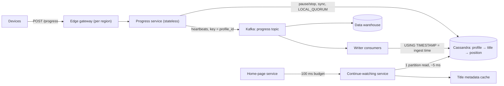

Two candidates get the same prompt and know roughly the same things. One gets a strong hire; the other gets "lean no hire, did not demonstrate senior judgement". Read their whiteboards afterwards and you would struggle to tell them apart: similar boxes, similar databases, a queue in each. The difference was in the forty-five minutes. The first candidate turned the prompt into a scoped problem in five minutes, derived the architecture from arithmetic, chose the two hardest parts and took them to mechanism level, and named the weakest part of the design before being asked. The second answered questions well, one at a time, in whatever order the interviewer asked them, and ran out of time halfway through the first deep dive.

The design round measures judgement, and judgement is only visible if you present it. [The design interview method](/learn/system-design/building-blocks/the-design-interview-method) gave you the phases. This lesson is about running them live: what the panel writes down, how to manage the clock, how to lay out the board, what to say when things go wrong, and a full annotated transcript of a strong candidate driving a design end to end.

## What the panel is scoring

Most large companies score some variant of the same dimensions. The words differ; the behaviours do not.

| Dimension | Mid-level signal | Senior signal |
|---|---|---|
| Scoping | Designs everything mentioned | Negotiates scope, parks the rest explicitly, points back at requirements later |
| Estimation | Numbers as a ritual, then ignored | Numbers change the design, and the candidate says how |
| Architecture | A correct set of boxes | Every box justified by a requirement or a number; nothing decorative |
| Depth | Names components | Mechanisms, failure modes and numbers inside the deep dives |
| Trade-offs | Choices without reasons | Choices with costs and triggers; rejected options stated |
| Operations | Failure as an afterthought | Degradation, blast radius, the metric that proves it works |
| Communication | Answers questions | Drives the agenda, signposts, checks in, recovers from mistakes |

At the senior bar, the last row, communication, is the one candidates underrate. Interviewers write "drove the discussion" or "needed prompting" on almost every scorecard, and it colours how they read everything else. Staff-level loops add a layer on top: how the design evolves over years, how it would be migrated to, which teams own which parts. [The FAANG loop](/learn/senior-craft/getting-the-job/the-faang-loop) covers how these scores become a decision.

## The time plan and its checkpoints

A plan is only useful if you know when you are behind it. Use checkpoints, not just durations.

| Clock | Phase | Checkpoint: by the end you have |
|---|---|---|
| 0–2 | Restate and set the agenda | The interviewer has agreed, or redirected, your plan |
| 2–7 | Requirements | Functional list, non-functional numbers, an out-of-scope list |
| 7–11 | Estimates | One sentence on what dominates (reads, writes, storage, fan-out) |
| 11–15 | API and data model | The access patterns, and a store chosen for them |
| 15–22 | High-level design | One diagram, arrows labelled with protocol and rate |
| 22–37 | Two deep dives | Each ends with a failure mode and its mitigation |
| 37–42 | Failure, scale, evolution | Region loss, 10× growth, what you would change first |
| 42–45 | Wrap-up | Summary, what you left out, the weakest part |

Two checkpoints matter most. At **minute 15**, if you have not started the diagram, compress: state the API in one line and draw. At **minute 25**, if you are not in a deep dive, stop polishing the diagram and pick one. Running out of time before the deep dive is the single most common way strong engineers fail this round, because the deep dive is where senior is decided.

## Lay out the board

A consistent layout does two jobs: it keeps you organised under pressure, and it lets you point at things. You will point at the requirements when justifying a trade-off and at the numbers when choosing a store.

```text
+--------------------------+------------------------------+
| REQUIREMENTS             | NUMBERS                      |
| F:  record, show, resume | writes 140k/s avg, 350k peak |
| NF: switch device < 5 s  | reads  8k/s avg, 20k peak    |
| Out: ranking, next ep    | serving 22 TB; raw 1.2 TB/d  |
+--------------------------+------------------------------+
| API + DATA MODEL         |                              |
| POST /progress           |       HIGH-LEVEL DIAGRAM     |
| GET /continue-watching   |       (deep-dive zooms       |
| profile -> title -> pos  |        drawn beside it)      |
+--------------------------+------------------------------+
| PARKING LOT: kids profiles, history deletion, ranking   |
+---------------------------------------------------------+
```

The parking lot is the underrated zone. When the interviewer raises something you do not want to derail into, write it there and say you will come back to it. Then come back to it in the wrap-up. It shows you heard, you prioritised, and you kept your word.

In a virtual interview the same zones work in a shared document or drawing tool. Type the requirements and numbers rather than drawing them, keep the diagram to simple labelled boxes, and narrate what you are drawing, because the interviewer cannot see your hand moving.

## Phrases that carry signal

| Weak | Strong |
|---|---|
| "We could use Kafka, or RabbitMQ, or maybe SQS..." | "Kafka, partitioned by profile id: I need per-profile ordering and a second consumer. SQS would do if analytics were not reading the same stream." |
| "This should scale." | "This takes 350k writes a second on a few dozen nodes per region; the first thing to break is the per-partition rate for bot accounts." |
| (sixty seconds of silence) | "I am weighing two keys. Give me twenty seconds to compare them out loud." |
| "Is that right?" | "I am assuming clients report every 60 seconds; tell me if that is wrong." |
| "I don't know Cassandra's limits." | "I do not know the exact per-node figure. I will assume tens of thousands of small writes a second and size from that; if it is lower, the node count changes, not the design." |
| "And we add caching everywhere." | "No cache on this read: it is one partition at 20k a second, and a cache would add staleness to the one thing users complain about." |

The pattern in the right-hand column: a decision, the requirement it serves, and either its cost or what would change it. [Articulating trade-offs](/learn/system-design/senior-design-skills/articulating-trade-offs) has the full structure.

## A transcript: driving a 45-minute design

What follows is a condensed transcript of a strong candidate. The prompt is one sentence: *"Design the Continue Watching row for a Netflix-scale streaming service."* Annotations after each phase say what the panel saw.

### 0:00 to 2:00, framing

**Interviewer:** Design the Continue Watching row for a Netflix-scale streaming service.

**Candidate:** Let me restate it to check I have it. When a member opens the app on any device, they see the titles they started and have not finished, most recent first, and pressing play resumes where they stopped, including when they switch devices. My plan: about five minutes of requirements, a quick estimate, the API and data model, a high-level design, and then deep dives on whatever is hardest at this scale. I suspect that is the write path. I will keep time for failure modes at the end. Stop me whenever you would rather go somewhere else.

*The panel saw: a restatement that exposed an assumption (device switching), an agenda with a prediction about where the difficulty is, and an explicit invitation to steer. Ninety seconds, and the candidate is already driving.*

### 2:00 to 7:00, requirements

**Candidate:** Functionally: record progress while a title plays, show the row, resume at the right position on any device, and drop titles once they are finished. Is ranking the row in scope, or is recency enough?

**Interviewer:** Recency is fine. Ranking belongs to another team.

**Candidate:** Then ranking goes in the parking lot, and so does next-episode logic for series. For freshness: if I pause on the TV and pick up my phone ten seconds later, must the phone resume at the exact spot?

**Interviewer:** Within a few seconds, yes. That is the complaint we actually get.

**Candidate:** Good, that is the consistency requirement that matters, and I will design for it explicitly. On availability, the row itself is not critical: if it is missing, the home page still works. But the resume position feeds playback start, which is critical, so that read needs a fallback rather than an error. On durability, losing the last minute of progress is acceptable; losing someone's history is not. And I will assume active-active across three regions like the rest of the platform.

*The panel saw: a vague "freshness" turned into a testable requirement (under five seconds across devices), criticality classified per operation, and a clear line between what may be lost and what may not. Scope was negotiated, not assumed.*

### 7:00 to 11:00, estimates

**Interviewer:** Assume 100 million profiles watch something each day, about two hours each.

**Candidate:** If clients report progress every 60 seconds while playing, that is 100 million times 120, 12 billion heartbeats a day. Divided by about 86,000 seconds, roughly 140,000 writes a second on average; with an evening peak around two and a half times that, 350,000 a second. Reads: say four home-page loads and three play starts per active profile per day, 700 million reads, about 8,000 a second on average and 20,000 at peak. So this is write-heavy, around 17 writes per read at peak, which is unusual and shapes the design. Storage: a row is a profile id, title id, position, duration, timestamp, device; call it 50 bytes. A hundred in-progress titles per profile and 500 million profiles with history is 2.5 TB, times three replicas and three regions, about 22 TB. Small. The raw heartbeat stream is different: 12 billion events at 100 bytes is 1.2 TB a day. That belongs in the data warehouse, not the serving store.

*The panel saw: arithmetic done aloud with round numbers, and three design consequences drawn from it: write-heavy, small serving state, a separate analytics path. The numbers are already doing work.*

### 11:00 to 15:00, API and data model

```text
POST /progress  {profile_id, title_id, position_s, event: heartbeat|pause|stop, session_id, seq}
GET  /continue-watching?profile_id=P&limit=40  -> [{title_id, position_s, updated_at}]
GET  /resume?profile_id=P&title_id=T           -> {position_s}
```

**Candidate:** The progress call is idempotent on session id plus sequence number, so client retries are harmless. The data model is one partition per profile, clustered by title: profile, then title, then position, duration and updated time. Both reads are single-partition reads. I would use a wide-column store such as Cassandra: the access pattern is fixed, the write rate is high, and it replicates across regions with every region accepting writes. I will sort by recency at read time, since a profile has at most a few hundred rows and that sort takes microseconds, rather than clustering by timestamp, which would turn every progress update into a delete plus an insert.

**Interviewer:** Why not keep this in the same database as the member profile?

**Candidate:** That database is relational and sized for a few thousand writes a second, and login and billing depend on it. Adding 350,000 small writes a second would make them share fate with a non-critical feature. Separate store, separate blast radius. Moving on to the high-level design.

*The panel saw: a store chosen from the access pattern and the write rate, a plausible alternative (clustering by timestamp) rejected with its reason, and an interruption answered with a number and a principle before returning to the plan.*

### 15:00 to 22:00, high-level design



**Candidate:** Devices send progress to the edge in their region, then to a stateless progress service. Heartbeats go onto a Kafka topic keyed by profile id; one consumer group writes the latest position to Cassandra, and another path feeds the warehouse. Pause and stop events are also written straight to Cassandra, synchronously, because those are the moments someone switches devices. On the read side, the home-page service calls the continue-watching service with a 100 ms budget; it reads one partition, filters out finished titles, adds titles from the metadata cache, and sorts. Each region is self-contained. Cassandra replicates between regions asynchronously, and a conflict on the same profile and title resolves last-writer-wins by the ingestion timestamp the edge assigns, never the device clock, because device clocks are routinely minutes wrong.

*The panel saw: every arrow labelled, every component traceable to a requirement, and two non-obvious decisions (synchronous writes only for pause and stop; server-assigned timestamps) stated with their reasons at the moment they appeared.*

### 22:00 to 37:00, deep dives

**Candidate:** I would like to go deep on two things: the write path, because 350,000 writes a second is where both cost and correctness live, and the device-switch requirement, because it is the user complaint. Does that work, or is there something you would rather see?

**Interviewer:** Go ahead.

**Candidate:** Keying Kafka by profile id keeps each profile's events in order within a partition. Order matters here because a rewind legitimately moves the position backwards, so I cannot merge with a maximum; the latest event has to win.

```viz
{"type": "system", "scenario": "kafka-partitions", "nodes": 3,
 "keys": ["profile:17", "profile:42", "profile:17", "profile:8", "profile:42", "profile:17"],
 "title": "Keying progress events by profile", "caption": "Every event for one profile lands in the same partition in order, so a rewind is never overtaken by an older heartbeat. A consumer crash replays from the last committed offset, which is why the writes are versioned."}
```

**Candidate:** Consumers write with Cassandra's `USING TIMESTAMP` set to the ingestion time, so if a consumer replays a batch after a rebalance, an older event cannot overwrite a newer one. On capacity: 350,000 writes a second with three replicas is about a million replica writes a second in each region at peak; at tens of thousands of small writes per node, that is a few dozen nodes per region. The alternative I considered is coalescing heartbeats in a stream processor and writing every five minutes. That cuts writes five-fold, but a crash would lose up to five minutes of progress, which is exactly the complaint we are fixing. If cost became the problem, I would revisit that, perhaps with coalescing only for sessions on a single device.

**Interviewer:** What happens if Kafka is unavailable for ten minutes?

**Candidate:** Two answers, because there are two consumers. For the serving store the data heals itself: every heartbeat carries the absolute position, so the first one after recovery supersedes everything lost, and pause and stop go directly to Cassandra anyway. The progress service should drop heartbeats with a metric rather than queue them in memory and fall over. For the warehouse it depends on what the data is for. If viewing hours feed licensing or royalty reports, ten minutes of loss is not acceptable, so the edge spools events to local disk and replays them when Kafka returns. I would confirm with the data team which it is.

*The panel saw: the candidate chose the deep dives and justified the choice from the estimates, checked in, used mechanism-level detail (partition ordering, write timestamps, replay), rejected an alternative with its cost, and split one failure question into two consumers with different durability needs. Asking the data team rather than guessing is a signal, not a weakness.*

**Candidate:** Now the device switch. Pausing on the TV writes synchronously to Cassandra in the TV's region at `LOCAL_QUORUM`: a few milliseconds. A phone in the same household almost always reaches the same region, so a `LOCAL_QUORUM` read sees it. That is read-your-writes across devices, in practice. The cross-region case, such as a phone on a mobile network routed elsewhere, sees replication lag that is typically under a second, inside the few-seconds requirement. I would not trust "typically", though: I would measure, as an SLI, the p99 time from a pause event to its visibility in each region, and alert on it.

**Interviewer:** And if Cassandra in that region is slow?

**Candidate:** The resume call has a 50 ms timeout. On timeout the client uses its own last known position for that title, which is correct for the common case of resuming on the same device, and the home page drops the row rather than wait for it. Playback never fails because of this service. That is the degradation ladder: fresh position, then the device's local position, then start from the beginning.

*The panel saw: a consistency requirement met with the cheapest sufficient mechanism, an honest word ("typically") followed by a metric that removes the hand-waving, and a degradation ladder that protects the critical action, all without being prompted.*

### 37:00 to 42:00, failure and scale

**Candidate:** Three failure modes I have not covered. Losing a region: traffic shifts to the other two, the data is already replicated, and we lose at most the replication lag of progress, under a second. Poison events, such as a client bug sending negative positions: validate at the progress service and route rejects to a dead-letter topic. And bot or test accounts with enormous histories, which create wide partitions: cap rows per profile at a few hundred and expire entries after a year untouched. At ten times the traffic, the design holds; the node count grows linearly, and the first thing I would revisit is the heartbeat interval, not the architecture.

### 42:00 to 45:00, wrap-up

**Candidate:** To summarise: this is write-heavy with a small serving state. Kafka keyed by profile gives ordering and feeds analytics; Cassandra with ingestion timestamps gives last-writer-wins that survives replays; synchronous writes on pause and stop meet the device-switch requirement; and every read has a fallback. From the parking lot, ranking and next-episode logic stay with their owners, but two things I would want to design next: kids' profiles and history deletion, because a member deleting their history must also reach the warehouse, which is a privacy obligation rather than a feature. The weakest part is cross-region freshness, which is probabilistic. If the requirement became strict, I would route each profile's writes and resume reads to a home region and accept a cross-region hop for the rare roaming device.

*The panel saw: a two-sentence summary, the parking lot closed out, an obligation (privacy) the interviewer never raised, and the weakest part named with the change that would fix it. The interviewer's last impression is honesty.*

## Recovering when it goes wrong

Every real interview goes off the plan somewhere. Recovery is scored, sometimes more than the original mistake.

- **You are behind the clock.** Announce the cut: "Given time, I will skip the API details and go straight to the diagram." Silent rushing looks like panic; an announced cut looks like prioritisation.
- **The interviewer disagrees.** Engage with the reasoning, not the conclusion. If they have a point, update: "You are right; with that constraint I would switch to a home-region design." Changing your mind on evidence is a senior signal. Folding instantly with no reasoning is not, and neither is digging in with no new argument; sometimes they are testing whether you can defend a sound choice.
- **You blank on a component.** Reason from first principles and state the assumption out loud. "I do not remember the exact limit, so I will assume X and show what changes if it is lower."
- **You find your own error.** Flag it yourself: "I said 2.5 TB earlier and forgot replication; it is 22 TB. Still small, so the conclusion holds." Catching your own mistake is one of the strongest signals available.
- **A rabbit hole.** The interviewer drills into one detail for ten minutes. Answer it, then ask: "Shall I keep going here, or return to the failure modes?" The choice is theirs, but you have shown you are tracking the clock.

## Practising

Presenting is a skill, and it improves only with repetitions under realistic conditions:

- **Timed mocks** with a peer playing interviewer, 45 minutes, with the checkpoints enforced. Swap roles: interviewing others teaches you what the panel sees.
- **Record yourself** and count how often you drove versus waited, how many decisions came with a cost attached, and where the clock went.
- **Rehearse the first five minutes** until the restatement, agenda and requirement questions are automatic. A strong opening buys calm for everything after it.
- **Write a one-page summary** after each mock: requirements, the numbers, the diagram from memory, two deep dives, the weakest part. If you cannot write it, you did not drive it.
- **Work the [case studies](/learn/system-design/case-studies/video-streaming-netflix)** aloud, not just read them.

## Interviewer follow-ups

**Q: "You spent most of the deep dive on the write path. Why?"**

Because the estimates said to. Writes outnumber reads roughly seventeen to one at peak, they drive the node count and the cost, and they carry the correctness risk (ordering, replays, rewinds). The read path is one partition read at 20,000 a second, which any reasonable store handles. Spending the time where the numbers point is the choice I would make in a real design review too.

**Q: "You have six weeks and two engineers. What do you build first?"**

The minimum that meets the device-switch requirement: synchronous writes of pause and stop events plus heartbeats written directly to a managed wide-column or key-value store, single partition reads, and the client-side fallback. No Kafka yet: at launch the analytics can come from a nightly export. I would add the stream when the write rate or a second consumer requires it, and I would make sure the event format and idempotency keys are right from day one, because those are the parts that are expensive to change.

**Q: "How would you know it is working in production?"**

Four SLIs: p99 latency of the continue-watching read; the success rate of progress writes; the p99 time from a pause event to its visibility in each region, which is the device-switch requirement expressed as a number; and resume accuracy, measured by how often a user seeks backwards or forwards within the first 30 seconds of a resumed playback, which is how users vote on whether we got it right.

**Q: "What did you leave out, and would any of it change the design?"**

Ranking and next-episode logic would not change the storage design; they consume it. History deletion might: it needs a delete path that reaches the warehouse and any caches, and tombstones in Cassandra with sensible compaction settings. Kids' profiles are mostly policy. The one item that would change the architecture is a strict cross-region freshness requirement, which would push me to home-region routing.

## Senior signals

- You **restate, set an agenda and predict** where the difficulty lies in the first two minutes, and invite the interviewer to steer.
- You manage the clock with **checkpoints** and announce cuts instead of rushing silently.
- You keep a **board layout** with requirements, numbers and a parking lot, and you close the parking lot in the wrap-up.
- You **choose the deep dives from the estimates** and say why.
- You treat interruptions as **redirects**, answer them with numbers, and return to the plan.
- You **flag your own mistakes**, update on good arguments, and end by naming the weakest part of your design.

## Check yourself

```quiz
- q: >-
    It is minute 25 of a 45-minute design interview and you are still refining the high-level diagram. What is the best move?
  options: ["Ask the interviewer for ten more minutes to cover depth", "Start the wrap-up early so that you finish on time", "Finish the diagram; a complete diagram is what gets scored", "Announce the move and go deep where the estimates point"]
  answer: 3
  explanation: >-
    The deep dive is where senior is decided, and running out of time before it is the most common failure. An announced cut to the deep dive the estimates point to shows prioritisation. A polished diagram with no depth scores as mid-level.
- q: >-
    The interviewer raises data deletion for privacy while you are drawing the high-level design. You do not want to derail. What should you do?
  options: ["Park it on the board and come back to it in the wrap-up", "Ignore it and continue so the flow is not broken", "Switch at once to designing the deletion path", "Tell the interviewer that privacy is out of scope here"]
  answer: 0
  explanation: >-
    Writing it in the parking lot and saying you will return shows you heard it and are prioritising; covering it in the wrap-up shows follow-through. Ignoring it or dismissing it loses the signal; switching immediately hands the agenda to whatever is raised next.
- q: >-
    The interviewer challenges your choice of store with a constraint you had not considered, and it is a good point. What response scores best?
  options: ["Weigh the point, update the design, and say what changes", "Defend the original choice firmly to show conviction", "Offer three alternative stores and let the interviewer choose", "Agree at once and swap the store without discussion"]
  answer: 0
  explanation: >-
    Updating on evidence, with the reasoning visible (acknowledge the constraint, say what changes and why), is a senior signal. Digging in without a new argument looks rigid; folding without discussion looks like you had no reasons; handing the choice back abdicates the decision.
- q: >-
    In the transcript, why did the candidate write only pause and stop events synchronously to the database, while heartbeats went through Kafka?
  options: ["Kafka cannot guarantee ordering for pause and stop events", "Heartbeats are never stored, so they need no database write", "Device switches happen then, so they must be visible fast", "Synchronous writes are cheaper per event than Kafka writes"]
  answer: 2
  explanation: >-
    The device-switch requirement applies at the moments a person stops watching, so those events must be visible within seconds. Heartbeats are the bulk of the load and tolerate asynchronous delay. Paying the synchronous cost only for the rare events meets the requirement without putting 350,000 writes a second on the synchronous path; heartbeats are still stored, just asynchronously.
- q: >-
    Which wrap-up best meets the senior bar?
  options: ["A careful recap of every component on the board", "A statement that the design meets all requirements", "A list of technologies you would like to explore next", "The parked items, and the weakest part with its fix"]
  answer: 3
  explanation: >-
    The wrap-up is where honesty and prioritisation are scored: a short summary, the parked items and whether they would change the design, and the weakest part with the change that would fix it. Claiming the design meets everything invites the interviewer to find the gap; a component recap repeats what they already saw.
```
