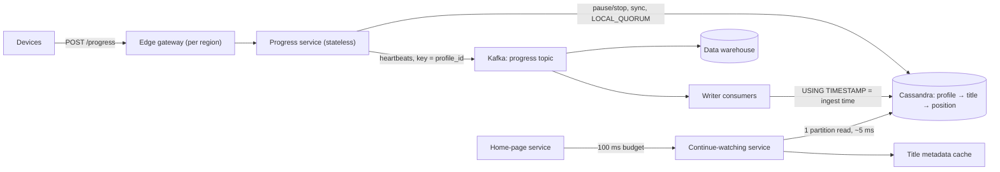

Two candidates get the same prompt and know roughly the same things. One gets a strong hire; the other gets "lean no hire, did not demonstrate senior judgement". Their whiteboards look alike: similar boxes, similar databases, a queue in each. The difference was in the forty-five minutes. The first scoped the problem in five minutes, derived the architecture from arithmetic, took the two hardest parts to mechanism level, and named the weakest part of the design before being asked. The second answered questions well, one at a time, in the interviewer's order, and ran out of time halfway through the first deep dive.

The design round measures judgement, and judgement is visible only if you present it. [The design interview method](/learn/system-design/building-blocks/the-design-interview-method) gave you the phases. This lesson is about running them live: what the panel records, how to hold the clock, how to take pushback, and a condensed transcript of a strong candidate driving a design end to end.

## What the panel is scoring

Most large companies score some variant of the same dimensions. The words differ; the behaviours do not.

| Dimension | Mid-level signal | Senior signal |
|---|---|---|
| Scoping | Designs everything mentioned | Negotiates scope, parks the rest explicitly, points back at requirements later |
| Estimation | Numbers as a ritual, then ignored | Numbers change the design, and the candidate says how |
| Architecture | A correct set of boxes | Every box justified by a requirement or a number |
| Depth | Names components | Mechanisms, failure modes and numbers inside the deep dives |
| Trade-offs | Choices without reasons | Choices with costs and triggers; rejected options stated |
| Operations | Failure as an afterthought | Degradation, blast radius, the metric that proves it works |
| Communication | Answers questions | Drives the agenda, signposts, checks in, recovers from mistakes |

Candidates underrate the last row. "Drove the discussion" or "needed prompting" appears on almost every scorecard and colours how the rest is read. Staff-level loops add how the design evolves over years and which teams own which parts.

## Under the hood: how feedback becomes a decision

Processes differ between companies and change over time, but the published descriptions and common practice share a shape, and the shape tells you what to do in the room.

1. **Interviewers write feedback independently**, usually before seeing anyone else's, so an early strong or weak opinion does not anchor the rest.
2. **Feedback is evidence mapped to dimensions**: what you said and did, often close to verbatim, then a recommendation on a hire/no-hire scale and a level signal.
3. **A debrief or hiring committee reads the packet** and calibrates against a shared bar of what each level looks like. Feedback without evidence ("seemed sharp") carries little weight; feedback with it ("estimated 350k writes/s, keyed Kafka by profile for per-profile ordering, rejected coalescing because it loses five minutes of progress") carries a lot.
4. **Interviewers are calibrated** by shadowing experienced interviewers and by seeing how committees decided on candidates they interviewed.

Three consequences. Your job in every phase is to produce **quotable evidence**: a number, a decision with its reason, a rejected option. "Needed prompting to discuss failure" is itself evidence, recorded as such. And **levelling is decided here**: a correct design the interviewer had to drive is often recorded as mid-level evidence, and an offer one level down is a common outcome of a design round that was right but not driven. [The FAANG loop](/learn/senior-craft/getting-the-job/the-faang-loop) covers how the packets combine; [Netflix culture and interviews](/learn/senior-craft/getting-the-job/netflix-culture-and-interviews) covers how one company's published culture shapes what its interviewers look for.

## The time plan and its checkpoints

A plan is useful only if you know when you are behind it. Use checkpoints, not only durations.

| Clock | Phase | Checkpoint: by the end you have |
|---|---|---|
| 0–2 | Restate and set the agenda | The interviewer has agreed, or redirected, your plan |
| 2–7 | Requirements | Functional list, non-functional numbers, an out-of-scope list |
| 7–11 | Estimates | One sentence on what dominates (reads, writes, storage, fan-out) |
| 11–15 | API and data model | The access patterns, and a store chosen for them |
| 15–22 | High-level design | One diagram, arrows labelled with protocol and rate |
| 22–37 | Two deep dives | Each ends with a failure mode and its mitigation |
| 37–42 | Failure, scale, evolution | Region loss, 10× growth, what you would change first |
| 42–45 | Wrap-up | Summary, what you left out, the weakest part |

Two checkpoints matter most. At **minute 15**, if you have not started the diagram, state the API in one line and draw. At **minute 25**, if you are not in a deep dive, stop polishing and pick one.

How often do they fire? A toy model makes the point. Assume each phase before the deep dive runs a median 10% over plan with a wide spread (lognormal, σ = 0.35), and the interviewer asks a clarifying question about once every 15 planned minutes, costing 1–2 minutes. These are modelling assumptions, not data about real interviews. Simulating 20,000 rounds (seed 7):

```python
import math, random, statistics

PLAN = [("framing", 2), ("requirements", 5), ("estimates", 4), ("api", 4), ("design", 7)]
# then deep dives 15, failure and scale 5, wrap-up 3: 45 minutes

def interview(rng, checkpoints):
    t, fired, design_min = 0.0, False, 0.0
    for name, planned in PLAN:
        d = planned * rng.lognormvariate(math.log(1.1), 0.35)      # median 10% over plan
        k = sum(rng.random() < 1 / 60 for _ in range(planned * 4))  # ~1 question per 15 min
        d += sum(rng.uniform(1, 2) for _ in range(k))               # 1-2 minutes each
        if checkpoints and name == "api" and t + d > 15:            # minute 15: API in one line
            d, fired = max(1.0, 15 - t), True
        if checkpoints and name == "design" and t + d > 25:         # minute 25: go deep now
            d, fired = max(3.0, 25 - t), True
        if name == "design":
            design_min = d
        t += d
    end = 40 if checkpoints else min(45, t + 15)                    # checkpoints hold 5 min back
    deep = max(0.0, min(end, 45) - t)
    return t, deep, 45 - (t + deep), fired, design_min

rng = random.Random(7)
for cp in (False, True):
    start, deep, tail, fired, design = zip(*(interview(rng, cp) for _ in range(20_000)))
    print(cp, statistics.median(start), sum(x >= 4 for x in tail) / 20_000, sum(fired) / 20_000)
```

| | Without checkpoints | With checkpoints |
|---|---|---|
| Deep dive starts (median / 90th percentile) | Minute 27.5 / 34.2 | Minute 24.4 / 25.0 |
| Rounds with 12+ minutes of deep dive | 86% | 99% |
| Rounds with 4+ minutes left for failure modes and wrap-up | 37% | 100% |
| Rounds where a checkpoint fired | — | 91% |
| Design phase, median minutes | 8.4 | 7.6 |

Small overruns compound: by minute 22 the typical round is five minutes behind, so the checkpoints fire in nine rounds out of ten, at a cost of under a minute of diagram time. Without them the loss lands at the end, where operations and the weakest part of the design are scored. Treat the plan as a budget you enforce, not a forecast.

## Lay out the board

A consistent layout keeps you organised and lets you point: at the requirements when justifying a trade-off, at the numbers when choosing a store.

```text
+--------------------------+------------------------------+
| REQUIREMENTS             | NUMBERS                      |
| F:  record, show, resume | writes 140k/s avg, 350k peak |
| NF: switch device < 5 s  | reads  8k/s avg, 20k peak    |
| Out: ranking, next ep    | serving 22 TB; raw 1.2 TB/d  |
+--------------------------+------------------------------+
| API + DATA MODEL         |                              |
| POST /progress           |       HIGH-LEVEL DIAGRAM     |
| GET /continue-watching   |       (deep-dive zooms       |
| profile -> title -> pos  |        drawn beside it)      |
+--------------------------+------------------------------+
| PARKING LOT: kids profiles, history deletion, ranking   |
+---------------------------------------------------------+
```

The parking lot is the underrated zone. When the interviewer raises something you do not want to derail into, write it there, say you will come back, and come back in the wrap-up. In a virtual interview, type the requirements and numbers into the shared document, keep the diagram to labelled boxes, and narrate what you draw, because the interviewer cannot see your hand.

## Phrases that carry signal

| Weak | Strong |
|---|---|
| "We could use Kafka, or RabbitMQ, or maybe SQS..." | "Kafka, partitioned by profile id: I need per-profile ordering and a second consumer. SQS would do if analytics were not reading the same stream." |
| "This should scale." | "This takes 350k writes a second on a few dozen nodes per region; the first thing to break is the per-partition rate for bot accounts." |
| (sixty seconds of silence) | "I am weighing two keys. Give me twenty seconds to compare them out loud." |
| "I don't know Cassandra's limits." | "I will assume tens of thousands of small writes a second per node; if it is lower, the node count changes, not the design." |
| "And we add caching everywhere." | "No cache on this read: one partition at 20k a second, and a cache would add staleness to the one thing users complain about." |

The pattern on the right: a decision, the requirement it serves, and its cost or what would change it.

Driving also means **signposting**: one sentence at each transition that closes the phase, says what comes next, and leaves a door open. "Those are the requirements; I will estimate next unless you want to add any." "The diagram is complete at this level; I would like to go deep on the write path and the device switch." "I have ten minutes left: failure modes, then a summary." Each costs five seconds, and each is evidence that you are running the agenda rather than following it. [Articulating trade-offs](/learn/system-design/senior-design-skills/articulating-trade-offs) has the full structure.

## A condensed transcript

The prompt is one sentence: *"Design the Continue Watching row for a Netflix-scale streaming service."* Annotations say what the panel recorded.

### 0:00 to 7:00, framing and requirements

**Candidate:** Let me restate it. When a member opens the app on any device, they see titles they started and have not finished, most recent first, and play resumes where they stopped, including after switching devices. Plan: five minutes of requirements, a quick estimate, API and data model, a high-level design, then deep dives on the hardest part, which I suspect is the write path. Stop me whenever you would rather go elsewhere. Is ranking in scope, or is recency enough?

**Interviewer:** Recency. Ranking belongs to another team.

**Candidate:** Parking lot, with next-episode logic. If I pause on the TV and pick up my phone ten seconds later, must it resume at the exact spot?

**Interviewer:** Within a few seconds. That is the complaint we get.

**Candidate:** Then that is the consistency requirement I design for. The row is not critical, since the home page works without it, but the resume position feeds playback start, so that read needs a fallback. Losing the last minute of progress is acceptable; losing history is not. I will assume active-active in three regions like the rest of the platform.

*Recorded: a restatement exposing an assumption, an agenda with a prediction, "freshness" turned into a testable number, criticality classified per operation, scope negotiated.*

### 7:00 to 15:00, estimates, API and data model

**Candidate:** A hundred million profiles watching two hours a day, reporting every 60 seconds: 12 billion heartbeats a day, about 140,000 writes a second, 350,000 at an evening peak of two and a half times average. Reads: about seven per active profile per day, 8,000 a second, 20,000 at peak. So write-heavy, about 17 to 1, which shapes everything. Serving state: 50-byte rows, a hundred per profile, 500 million profiles, 2.5 TB, times three replicas and three regions, 22 TB. The raw heartbeat stream is 1.2 TB a day and belongs in the warehouse.

```text
POST /progress  {profile_id, title_id, position_s, event: heartbeat|pause|stop, session_id, seq}
GET  /continue-watching?profile_id=P&limit=40  -> [{title_id, position_s, updated_at}]
GET  /resume?profile_id=P&title_id=T           -> {position_s}
```

**Candidate:** Progress writes are idempotent on session id plus sequence. One partition per profile, clustered by title, so both reads are single-partition. A wide-column store such as Cassandra: fixed access pattern, high write rate, multi-region writes. I sort by recency at read time, since a few hundred rows sort in microseconds, rather than clustering by timestamp, which would turn every update into a delete plus an insert.

**Interviewer:** Why not the member-profile database?

**Candidate:** It is relational, sized for thousands of writes a second, and login and billing depend on it. Adding 350,000 a second makes them share fate with a non-critical feature. Moving on to the diagram.

*Recorded: arithmetic aloud with round numbers and three consequences drawn from it; a store chosen from the access pattern; a plausible alternative rejected with its reason; an interruption answered with a number and a principle, then back to the plan.*

### 15:00 to 22:00, high-level design



**Candidate:** Heartbeats go to Kafka keyed by profile; one consumer group writes the latest position, another feeds the warehouse. Pause and stop are written synchronously, because those are the moments someone switches devices. Reads have a 100 ms budget and hit one partition. Regions replicate asynchronously and conflicts resolve last-writer-wins by the timestamp the edge assigns, never the device clock, because device clocks are routinely minutes wrong.

*Recorded: every arrow labelled, two non-obvious decisions (synchronous only for pause and stop; server timestamps) stated with reasons as they appeared.*

### 22:00 to 37:00, deep dives

**Candidate:** Two deep dives: the write path, because 350,000 writes a second is where cost and correctness live, and the device switch, because it is the complaint. Does that work?

**Interviewer:** Go ahead.

**Candidate:** Keying by profile keeps each profile's events ordered within a partition. Order matters because a rewind moves the position backwards, so I cannot merge with a maximum.

```viz
{"type": "system", "scenario": "kafka-partitions", "nodes": 3,
 "keys": ["profile:17", "profile:42", "profile:17", "profile:8", "profile:42", "profile:17"],
 "title": "Keying progress events by profile", "caption": "Every event for one profile lands in the same partition in order, so a rewind is never overtaken by an older heartbeat. A consumer crash replays from the last committed offset, which is why the writes are versioned."}
```

**Candidate:** Consumers write with `USING TIMESTAMP` set to ingestion time, so a replay after a rebalance cannot overwrite newer data. Capacity: 350,000 writes a second at three replicas is about a million replica writes a second per region; at tens of thousands per node, a few dozen nodes per region. I considered coalescing heartbeats and writing every five minutes: five times fewer writes, but a crash loses up to five minutes of progress, which is the complaint we are fixing.

**Interviewer:** What if Kafka is unavailable for ten minutes?

**Candidate:** Two consumers, two answers. The serving store heals itself: every heartbeat carries the absolute position, and pause and stop bypass Kafka. The progress service drops heartbeats with a metric rather than queueing them in memory. For the warehouse it depends on use: if viewing hours feed licensing reports, the edge spools to local disk and replays. I would confirm which with the data team.

**Candidate:** The device switch: pausing on the TV writes at `LOCAL_QUORUM` in the TV's region; a phone in the same household almost always reaches the same region, so a `LOCAL_QUORUM` read sees it. A phone routed elsewhere sees replication lag, typically under a second. I would not trust "typically": I would measure the p99 time from a pause to its visibility in each region as an SLI and alert on it. If Cassandra is slow, the resume call times out at 50 ms and the client uses its own last position; playback never fails because of this service.

*Recorded: deep dives chosen from the estimates, mechanism-level detail, an alternative rejected with its cost, one failure question split by consumer, an honest "typically" replaced by a metric, a degradation ladder unprompted.*

### 37:00 to 45:00, failure, scale and wrap-up

**Candidate:** Three failure modes not yet covered: region loss (traffic shifts, we lose at most the replication lag of progress); poison events such as negative positions (validate, dead-letter topic); bot accounts with huge histories (cap rows per profile, expire untouched entries after a year). At 10× traffic the node count grows linearly; I would revisit the heartbeat interval first. To summarise: write-heavy with small serving state; Kafka by profile for ordering and analytics; Cassandra with ingestion timestamps for replay-safe last-writer-wins; synchronous pause and stop for the device switch; a fallback on every read. From the parking lot, history deletion needs designing next, because deletion must reach the warehouse, which is a privacy obligation. The weakest part is cross-region freshness, which is probabilistic; if it had to be strict, I would route each profile's writes and resume reads to a home region.

*Recorded: the parking lot closed, an obligation the interviewer never raised, and the weakest part named with its fix. The last impression is honesty.*

## Handling pushback

Pushback is a probe, not a verdict. The interviewer wants to see whether you have reasons, whether you can update on a good argument, and whether you can hold a sound position without either folding or repeating yourself.

| Interviewer | Weak answer | Strong answer |
|---|---|---|
| "Why not use Postgres here?" | "Cassandra scales better." | "At 350,000 writes a second, Postgres needs twenty-plus sharded primaries and resharding tooling, and nothing here needs joins. At a tenth of the write rate I would use Postgres and keep transactions." |
| "This feels over-engineered." | "It is what large companies do." Or: "OK, I will remove Kafka." | "Which part? Kafka is there for the warehouse consumer. If analytics can take a nightly export, I drop it and write heartbeats straight to the store: fewer moving parts, and we lose replay." |
| "I don't think last-writer-wins works here." | "It is what Cassandra does." | "Where do you see it failing? For positions, the latest action should win, rewinds included, so max() would be wrong and LWW by server timestamp is right. It would fail for a counter; there I would use a CRDT or a home region. Is there a case you have in mind?" |
| "Your estimate looks high." | Recalculates silently for a minute. | "The driver is the 60-second heartbeat. At five minutes, peak falls to 70,000 writes a second; the design holds and the node count drops fivefold. Which assumption would you change?" |
| "What if the whole region goes down?" | "We have replicas, so it is fine." | "Traffic shifts to the other two regions, which run below two-thirds of capacity; we lose at most the replication lag of progress, under a second, and clients resend their position." |

The strong answers share a move: locate the disagreement (which part, which assumption, which case), then answer with a requirement or a number, and name what would change your mind. When the interviewer is right, say so and say what changes: "You are right; with that constraint I would switch to a home-region design, and the cost is a cross-region hop for roaming devices." Changing your mind on evidence is a senior signal; changing it without discussion is not.

## How a design round goes wrong

| Failure | Symptom | Diagnosis | Fix |
|---|---|---|---|
| Out of time before depth | Minute 30 and still on the diagram | No checkpoints; each phase overran a little | Minute-15 and minute-25 checkpoints; announce the cut: "given time, I will go straight to the deep dive" |
| The interviewer drives | A stream of questions; you never choose what comes next | You waited for permission instead of proposing an agenda | Propose the agenda at minute 1 and the deep dives at minute 22; after each answer, return to the plan aloud |
| The rabbit hole | Ten minutes on one detail | Following an interesting question without checking the clock | Answer, then ask: "keep going here, or return to failure modes?" |
| Silent drawing | The interviewer's notes stop for minutes | Thinking without narrating | Narrate decisions as you draw; ask for twenty seconds when you need them |
| The broken number | An estimate is off by 10× and later decisions depend on it | Unit slip or forgotten replication factor | Flag it yourself: "I said 2.5 TB and forgot replication; it is 22 TB, still small, so the conclusion holds" |
| Folding or digging in | Under pushback you reverse instantly or repeat yourself | Treating a probe as a verdict | Locate the disagreement, weigh it against a requirement, update or defend with a number |

Catching your own mistake is one of the strongest signals available, because it is the behaviour a team relies on in a real design review. Recovery is scored, sometimes more than the original mistake.

### Recovering from a wrong turn

A wrong number is easy to fix. A wrong mechanism is harder, because decisions have been built on it. Suppose that at minute 31 the candidate in the transcript notices a flaw in their own write path:

> "I need to correct something. I said the consumers write with the ingestion time. If that meant the time the consumer reads the event, there is a bug: a heartbeat delayed in Kafka, sent before the pause, would be consumed after the synchronous pause write, get a later timestamp and overwrite the pause position with an older one. The resume would jump backwards. The fix is to assign the timestamp once, at the edge, carry it in the event, and have both paths write with it, so they compare the same clock. Nothing else in the design changes."

The structure is the one to copy: say you are correcting yourself, show the failing interleaving in one sentence, give the fix, and state the blast radius of the change on the rest of the design. It takes thirty seconds and turns a flaw into the strongest evidence of the round.

If instead the flaw invalidates a larger decision (the store cannot meet the write rate, say), stop and re-plan aloud: "This changes the storage choice. I will spend two minutes re-deciding it, then return to the deep dive." A visible re-plan scores as judgement; quietly patching around the flaw for ten minutes scores as not having noticed it.

## Presentation trade-offs

| Choice | Buys | Costs | Use when |
|---|---|---|---|
| Breadth first: whole diagram, then depth | The interviewer sees how parts connect | Depth starts late | Default for 45-minute product designs |
| Depth first on the core algorithm | Senior evidence early | The system around it stays sketchy | Infrastructure prompts where the core is the mechanism (a rate limiter, a lock service) |
| Ask a question vs state an assumption | Asking gets the real requirement | Time; a stream of questions looks unprepared | Ask when the answer changes the design; otherwise assume aloud and move on |
| You pick the deep dives vs you ask | Picking shows judgement from the estimates | You may miss what they want to probe | Propose two with reasons, then offer the choice |
| Round numbers vs precise ones | Round numbers are fast and checkable aloud | Precision near a threshold | Round aloud; be precise only when a number sits near a limit |

## Practising

Presenting improves only with repetitions under realistic conditions. Run timed 45-minute mocks with a peer and enforce the checkpoints; swap roles, because interviewing teaches you what the panel sees. Record yourself and count how often you drove versus waited and how many decisions came with a cost attached. Rehearse the first five minutes until the restatement and agenda are automatic. After each mock, write a one-page summary: requirements, numbers, the diagram from memory, two deep dives, the weakest part; if you cannot write it, you did not drive it. Work the [case studies](/learn/system-design/case-studies/video-streaming-netflix) aloud, not only on paper.

## Interviewer follow-ups

**"You spent most of the deep dive on the write path. Why?"** Model answer: the estimates said to: writes outnumber reads about 17 to 1 at peak, drive the node count and the cost, and carry the correctness risk (ordering, replays, rewinds); the read path is one partition read at 20,000 a second. Common wrong answer: "it is the part I know best", which tells the panel the agenda followed comfort rather than risk.

**"You have six weeks and two engineers. What do you build first?"** Model answer: the minimum that meets the device-switch requirement: synchronous pause and stop writes, heartbeats written directly to a managed store, single-partition reads, the client fallback. No Kafka yet; analytics from a nightly export. The event format and idempotency keys are right from day one, because those are expensive to change. Common wrong answer: "the same design with fewer features", which keeps every moving part and cuts the wrong things.

**"How would you know it is working in production?"** Model answer: four SLIs: p99 of the continue-watching read; success rate of progress writes; p99 time from a pause to its visibility in each region, the device-switch requirement as a number; and resume accuracy, measured by how often users seek within 30 seconds of a resumed playback. Common wrong answer: "CPU, memory and error logs", which measure machines, not the requirement.

**"What did you leave out, and would any of it change the design?"** Model answer: ranking and next-episode logic consume the store and would not change it; history deletion might, since it needs a delete path to the warehouse and caches and tombstone-aware compaction; a strict cross-region freshness requirement would change the architecture to home-region routing. Common wrong answer: "nothing important", which the interviewer then disproves.

**"If you had another thirty minutes, where would you go deeper?"** Model answer: the item most likely to change the design or fail in production: the cross-region freshness SLI and the home-region fallback, then deletion propagation, because it is an obligation. Common wrong answer: adding components (a search index, more caches), which shows breadth where the question asked for judgement.

## What mid-level engineers get wrong

- **Answering instead of driving.** Each answer is correct, and the scorecard still says "needed prompting".
- **No checkpoints.** Five small overruns push the deep dive past minute 27 and squeeze out failure modes and the wrap-up.
- **Estimates that change nothing.** Numbers recited and then ignored score as ritual.
- **Folding or digging in under pushback.** Both look like the choice had no reasons behind it.
- **Hiding a mistake.** A wrong number left on the board undermines every decision drawn from it.
- **Ending with "it meets all the requirements".** It invites the interviewer to find the gap you did not name.

## Senior signals

- You **restate, set an agenda and predict** where the difficulty lies in the first two minutes, and invite the interviewer to steer.
- You manage the clock with **checkpoints**, announce cuts, and treat the plan as a budget to enforce.
- You produce **quotable evidence** in every phase: numbers, decisions with reasons, rejected options.
- You **choose the deep dives from the estimates** and say why.
- You take **pushback as a probe**: locate the disagreement, answer with a number, update on evidence, hold a sound position.
- You **flag your own mistakes**, close the parking lot, and end by naming the weakest part of your design with its fix.

## Check yourself

```quiz
- q: >-
    It is minute 25 of a 45-minute design interview and you are still refining the high-level diagram. What is the best move?
  options: ["Finish the diagram; a complete diagram is what gets scored", "Start the wrap-up early so that you finish on time", "Announce the move and go deep where the estimates point", "Ask the interviewer for ten more minutes to cover depth"]
  answer: 2
  explanation: >-
    The deep dive is where senior is decided, and running out of time before it is the most common failure. An announced cut to the deep dive the estimates point to shows prioritisation. A polished diagram with no depth scores as mid-level.
- q: >-
    The interviewer raises data deletion for privacy while you are drawing the high-level design. You do not want to derail. What should you do?
  options: ["Switch at once to designing the deletion path", "Ignore it and continue so the flow is not broken", "Park it on the board and return to it at the end", "Tell the interviewer that privacy is out of scope here"]
  answer: 2
  explanation: >-
    Writing it in the parking lot and saying you will return shows you heard it and are prioritising; covering it in the wrap-up shows follow-through. Ignoring or dismissing it loses the signal; switching immediately hands the agenda to whatever is raised next.
- q: >-
    The interviewer says: I don't think last-writer-wins works here. What response scores best?
  options: ["Ask where it fails, then answer from the data", "Agree at once and switch to a consensus-based store", "Explain that last-writer-wins is Cassandra's default", "Offer three other conflict strategies to choose from"]
  answer: 0
  explanation: >-
    Locating the disagreement first shows you treat pushback as a probe. Then the answer comes from the data: positions should take the latest action, so last-writer-wins by server time is right, while a counter would need a CRDT or a home region. Folding looks like there were no reasons; citing the default is not a reason; a menu of options hands the decision back.
- q: >-
    In the transcript, why did the candidate write only pause and stop events synchronously to the database, while heartbeats went through Kafka?
  options: ["Heartbeats are never stored, so they need no database write", "Synchronous writes are cheaper per event than Kafka writes", "Device switches happen then, so they must be visible fast", "Kafka cannot guarantee ordering for pause and stop events"]
  answer: 2
  explanation: >-
    The device-switch requirement applies at the moments a person stops watching, so those events must be visible within seconds. Heartbeats are the bulk of the load and tolerate asynchronous delay. Paying the synchronous cost only for the rare events meets the requirement without putting 350,000 writes a second on the synchronous path; heartbeats are still stored, asynchronously.
- q: >-
    In the lesson's model of the clock, the minute-15 or minute-25 checkpoint fired in 91% of simulated rounds. What is the right conclusion?
  options: ["The plan is a budget to enforce, not a forecast", "The checkpoints are set too early and should move", "Most candidates are too slow to pass the round", "The model proves interviewers ask too many questions"]
  answer: 0
  explanation: >-
    Small, typical overruns compound, so by minute 22 most rounds are behind; the checkpoints convert that slippage into a shorter diagram instead of a missing deep dive and wrap-up. Moving them later only moves the loss to the end. The model's inputs are assumptions, so it supports the budgeting habit, not claims about candidates or interviewers.
- q: >-
    Why does a note such as estimated 350k writes/s, keyed Kafka by profile for ordering carry more weight in a debrief than strong communicator?
  options: ["Debriefs calibrate on evidence, not adjectives", "Numbers show that the design was memorised in advance", "Committees read only the technical parts of the notes", "Adjectives are not permitted in written feedback at all"]
  answer: 0
  explanation: >-
    A debrief compares evidence against a shared bar for each level. A concrete decision with its reason can be checked against that bar; an adjective cannot, so it carries little weight. Your job in the room is to generate quotable evidence in every phase.
```
