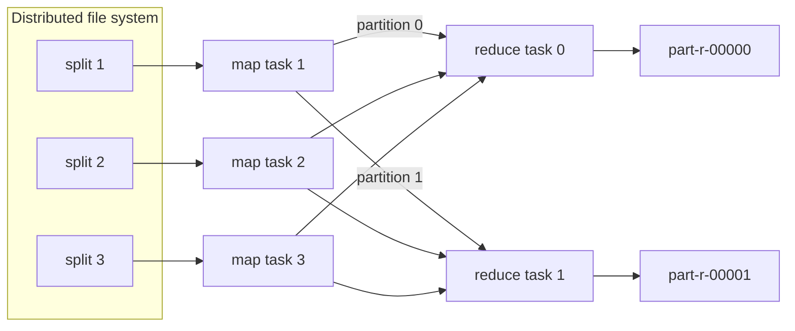

You have 10 TB of playback logs and a question: how many times was each title played yesterday? On one machine the answer is a hash map and a loop, and the loop is the problem. A good disk streams about 200 MB/s, so reading 10 TB takes 50,000 seconds, roughly 14 hours, before you have counted anything. Spread the files over 1,000 machines and each reads 10 GB in under a minute. The arithmetic is easy. The engineering is not: someone has to decide which machine reads which bytes, get every partial count for "Stranger Things" onto the same machine so they can be added, and cope with the fact that in a fleet of 1,000 cheap servers, something fails during most long jobs.

MapReduce, described by Google in 2004 and cloned as Hadoop soon after, answered all three problems with one constraint: you write two pure functions, and the framework owns everything else. It has since been displaced by [Spark](/learn/big-data/batch-processing/spark) and SQL engines, but every one of them still executes the same three phases underneath. If you understand where MapReduce spends its time, you can read a Spark plan or a BigQuery execution graph and predict why it is slow.

## The model: two functions and a contract

A MapReduce job is defined by two functions:

- `map(key, value) -> list of (k2, v2)`: called once per input record, independently. It may emit zero, one or many pairs.
- `reduce(k2, iterator of v2) -> list of output`: called once per distinct intermediate key, with every value any mapper emitted for that key.

Between them sits the framework's contract, the **shuffle**: every pair with the same `k2` reaches the same `reduce` call, and the keys arrive at each reducer in sorted order.

```python
def map_fn(offset, line):
    # line: "2024-05-01T10:00:03Z user=91 title=stranger-things device=tv"
    fields = dict(f.split("=", 1) for f in line.split()[1:])
    yield fields["title"], 1

def reduce_fn(title, counts):
    yield title, sum(counts)
```

That is the whole user program. Notice what it does not contain: no file paths per machine, no sockets, no retry logic, no locks. Because `map_fn` looks at one record and `reduce_fn` looks at one key, the framework is free to run them anywhere, in any order, as many times as it likes. That freedom is what buys fault tolerance.

The values reach `reduce` as a one-pass iterator, not a list. Hadoop reuses the same value object on every step of the iterator to avoid allocation, so code that stores the object (rather than a copy of its contents) sees every element mutate into the last one. It is the first bug most engineers write in a raw MapReduce job.

## How a job actually executes



1. **Split.** The input is cut into splits, normally one per file-system block (128 MB in HDFS, see [distributed file systems](/learn/big-data/batch-processing/distributed-file-systems)). 10 TB becomes about 80,000 map tasks. A master (the JobTracker in Hadoop 1, an ApplicationMaster under YARN since Hadoop 2) schedules each task, preferring a worker that already holds a replica of the split on local disk. Moving a 1 KB program to 128 MB of data is cheaper than the reverse.
2. **Map.** Each map task reads its split, calls `map` per record and writes output into an in-memory sort buffer (100 MB by default, spilled to disk at 80% full).
3. **Partition, sort, spill.** Each emitted pair is assigned a reducer by the **partitioner**, `hash(k2) mod R`. When the buffer spills, pairs are sorted by (partition, key) and written to the mapper's *local* disk. At the end, spills are merged into one file per map task, internally divided into R sorted segments.
4. **Shuffle.** Each reducer fetches its segment from every map task over HTTP. With M map tasks and R reducers that is M × R fetches. Reducers start fetching once 5% of maps have finished (`mapreduce.job.reduce.slowstart.completedmaps`), overlapping network transfer with the tail of the map phase.
5. **Merge and reduce.** The reducer merge-sorts its M sorted segments (a k-way merge), then walks the merged stream calling `reduce` once per key. Output is written to the distributed file system, one file per reducer: `part-r-00000`, `part-r-00001`, and so on.

Watch a small word count go through those phases, including the combiner and a failed mapper:

```viz
{"type": "system", "scenario": "mapreduce", "nodes": 3,
 "title": "Word count: map, combine, partition, shuffle, reduce",
 "caption": "Three mappers each read one line. The combiner collapses repeated words before anything crosses the network; the partitioner routes every word to one of two reducers by hash. When a mapper dies, the master re-runs its split on another worker and the reducers fetch from the new location."}
```

## A trace you can do on paper

Take three splits, two reducers, and a partitioner that sums the character codes of the word and takes them mod 2 (the same function the exercise below uses). The five words hash like this: `the` = 116 + 104 + 101 = 321 → partition 1; `cat` = 312 → 0; `sat` = 328 → 0; `dog` = 314 → 0; `ran` = 321 → 1.

| Map task | Input split | Pairs emitted | After combiner | Segment for reducer 0 | Segment for reducer 1 |
|---|---|---|---|---|---|
| m1 | `the cat sat` | (the,1) (cat,1) (sat,1) | unchanged | (cat,1) (sat,1) | (the,1) |
| m2 | `the dog sat` | (the,1) (dog,1) (sat,1) | unchanged | (dog,1) (sat,1) | (the,1) |
| m3 | `the cat ran` | (the,1) (cat,1) (ran,1) | unchanged | (cat,1) | (ran,1) (the,1) |

Each map task writes one local file, `file.out`, holding its two segments back to back, each sorted by key, plus `file.out.index` with three 8-byte numbers per segment (start offset, raw length, compressed length): 48 bytes of index for two partitions. Nine pairs cross the network in six fetches (M × R = 3 × 2).

Reducer 0 fetches three segments and merge-sorts them: `(cat,1)` from m1, `(cat,1)` from m3, `(dog,1)` from m2, `(sat,1)` from m1, `(sat,1)` from m2. The merged stream is grouped by key, so `reduce` is called three times: `cat → [1, 1] → 2`, `dog → [1] → 1`, `sat → [1, 1] → 2`. Reducer 1 sees `(ran,1), (the,1), (the,1), (the,1)` and emits `ran → 1`, `the → 3`. Two output files, `part-r-00000` and `part-r-00001`, and nothing is globally sorted across them: reducer 0's keys and reducer 1's keys interleave alphabetically.

### Inject a failure

The worker running m2 dies after reducer 0 has fetched its segment but before reducer 1 has. The master notices the missed heartbeats, marks m2's output lost and re-runs m2 on another worker, which regenerates both segments. Reducer 1 is told the new location and fetches `(the,1)` from there; reducer 0 does nothing, because the master tracks fetch completion per (map, reduce) pair and its copy is already merged. Nothing is double-counted, because a reducer never fetches the same map attempt's segment twice, and the re-run attempt produces identical bytes.

Change one input and the trace changes shape. Make the third split `the the the the ran`: the combiner collapses four `(the,1)` pairs into one `(the,4)` before anything is written, so m3's segment for reducer 1 is `(ran,1) (the,4)`, still one pair per distinct word, and reducer 1 computes `the → 1 + 1 + 4 = 6`. The combiner did not change the answer; it changed how many bytes carried it.

## Under the hood: the sort buffer, spills and the shuffle handler

The numbers below are Hadoop 2 and 3 defaults; every one is a configuration key you can change per job.

### The map side

`MapOutputBuffer` is a single byte array of `mapreduce.task.io.sort.mb` (100 MB). Serialised key and value bytes are appended from one end; a 16-byte metadata record per pair (key offset, value offset, partition, value length) is appended from the other, and the two regions grow toward each other. When either region passes `mapreduce.map.sort.spill.percent` (0.80) of its share, a spill thread sorts the metadata records by (partition, key), comparing raw bytes without deserialising, and writes `spillN.out` while the map function keeps filling the rest of the buffer. If a combiner is set it runs on each spill. When the map finishes, the spills are merged `mapreduce.task.io.sort.factor` (10) at a time; with three or more spills (`mapreduce.map.combine.minspills`) the combiner runs again during the merge. A map that emits 1.3 GB of pairs into a 100 MB buffer spills about 16 times and then needs two merge rounds, rewriting most of its output twice. That shows up as the `SPILLED_RECORDS` counter being several times `MAP_OUTPUT_RECORDS`.

### Serving segments

The final `file.out` lives on the mapper's local disk, not in HDFS. A NodeManager auxiliary service, the ShuffleHandler, serves it over HTTP (port 13562 by default) using Netty and `sendfile`, so segment bytes go from the page cache to the socket without passing through the JVM heap.

### The reduce side

Each reducer runs `mapreduce.reduce.shuffle.parallelcopies` (5) fetcher threads. Segments smaller than a quarter of the shuffle buffer (`mapreduce.reduce.shuffle.memory.limit.percent`, 0.25 of a buffer that is 70% of the heap by default) land in memory; larger ones stream to disk. When the in-memory segments pass 66% of the buffer (`mapreduce.reduce.shuffle.merge.percent`), a background merge writes them to disk as one sorted run. The final merge feeds `reduce` directly from a k-way merge over the remaining runs, `io.sort.factor` at a time. The job UI's reduce progress bar encodes these phases: 0–33% is copying, 33–66% is merging, 66–100% is your code.

### Splits, record boundaries and scheduling

A split is a byte range, and records do not respect byte ranges. `LineRecordReader` handles this with a convention: every reader except the first skips its split's first partial line, and every reader continues past its split's end until it finishes the line it is in. The few bytes read across a block boundary usually come from a different DataNode, which is the one non-local read in an otherwise local map task.

Under YARN each task is a container (1 GB of memory by default for a map, `mapreduce.map.memory.mb`) with its own JVM, and JVM start-up plus container negotiation costs on the order of a second or two per task. Eighty thousand tasks pay that overhead eighty thousand times; small jobs can run every task inside the ApplicationMaster's JVM (uber mode) to avoid it. Spark's executors are long-lived and schedule tasks as threads in milliseconds, which is a large part of why it feels faster on medium-sized jobs.

## Counting the shuffle

The shuffle is the expensive part of every distributed job, so learn to estimate it before you run anything. Take the title-count job on 1 TB of play events at 200 bytes each: 5 billion events, about 10,000 distinct titles. A serialised `(Text, IntWritable)` pair costs the key's length prefix, the key bytes, the value's length prefix and a 4-byte int, so a 10-byte title is about 16 bytes on the wire.

| Quantity | Without a combiner | With a combiner |
|---|---|---|
| Map tasks (1 TB / 128 MB) | ~8,000 | ~8,000 |
| Pairs emitted by map | 5 billion | 5 billion (in memory) |
| Pairs crossing the network | 5 billion | at most 8,000 × 10,000 = 80 million |
| Shuffle bytes at ~16 B per pair | ~80 GB | ~1.3 GB |

The **combiner** is a reducer that runs on each mapper's output before it is written, so a mapper that saw "stranger-things" 40,000 times ships one pair `(stranger-things, 40000)` instead of 40,000 pairs. For aggregations over a small key space it routinely shrinks the shuffle by one to two orders of magnitude.

The combiner is only legal when the reduce function is associative and commutative, because the framework may apply it zero, one or several times to arbitrary subsets of values (once per spill, again at merge time, never if the buffer never spilled). `sum`, `max`, `min` and `count` qualify. `average` does not: the average of partial averages is wrong unless every partition has the same count. The fix is to change what flows through the shuffle: emit `(sum, count)` pairs, combine them by adding both fields, and divide only in the final reduce. This "carry the algebra, not the answer" trick reappears in every partial aggregation you will meet: Spark's `partial_sum`, the partial aggregates in an [OLAP engine's](/learn/big-data/batch-processing/olap-engines) plan, and incremental window aggregates in [stream processing](/learn/big-data/streaming/stream-processing-model).

### Choosing the number of reducers

With R = 200 reducers the shuffle is 8,000 × 200 = 1.6 million segment fetches. With the combiner the average segment is 1.3 GB / 1.6 M ≈ 800 bytes, so the job spends its shuffle on per-request overhead, not bytes. Crank R up to 2,000 and you have 16 million fetches of 80 bytes. Crank it down to 5 and each reducer merges 8,000 segments into a single process that becomes the bottleneck. The number of reducers is a real tuning decision: aim for reducer inputs in the hundreds of megabytes to a few gigabytes each, and let the total shuffle size divided by that target set R. Google's 2004 paper reported typical jobs at M = 200,000 and R = 5,000 on 2,000 workers, which is the same rule at a different scale.

## Fault tolerance by re-execution

At a thousand machines, failure is a scheduling event, not an emergency. MapReduce's recovery story is deliberately simple:

- The master pings workers. A worker that misses heartbeats is declared dead, and every map task it ran is re-executed elsewhere, **including completed ones**, because their output lived on the dead machine's local disk.
- A failed reduce task is re-run; completed reduce output is already in the replicated file system and survives.
- Task output is written to a temporary attempt directory and committed by an atomic rename on success. If two copies of the same task finish, the rename makes exactly one visible.
- The master itself is not replicated. In the original design a master crash aborted the job. Under YARN the ApplicationMaster is restarted (twice by default, `yarn.resourcemanager.am.max-attempts`) and recovers completed tasks from its own history log rather than re-running them.

All of this rests on **determinism**. If `map` reads the clock, calls a random number generator without a fixed seed, or writes to an external database, re-execution produces different or duplicated effects. The same rule governs Spark tasks and streaming operators today: side effects inside a task that may be retried are the most common source of "we counted it twice" bugs. The output committer gives you exactly-once for files; anything else you write from a task is at-least-once, and the [idempotency lesson](/learn/system-design/building-blocks/idempotency-and-retries) is the toolkit for that.

**Stragglers** are the subtler problem. One machine with a failing disk or a noisy neighbour runs its task five times slower, and the whole job waits for it. MapReduce launches **speculative** backup copies of the last few in-progress tasks and takes whichever finishes first. The paper's 1 TB sort took 891 seconds with backup tasks and 1,283 seconds without, a 44% increase, on about 1,800 machines with two 160 GB IDE disks each. Speculation is safe only because of the atomic-rename commit; it is also why speculation is dangerous for tasks with external side effects.

## Skew: when one reducer does all the work

Hash partitioning spreads *keys* evenly, not *records*. Suppose you want unique viewers per title instead of plays. The reduce function must see every `user_id` for a title, so no combiner can collapse them to a single number. If one hit title accounts for 5% of the 5 billion events, its reducer receives 250 million records while the average reducer among 200 receives 25 million. That one task runs ten times longer than the rest, and the job's wall-clock time is the slowest task's time.

The standard fix is **salting**: split the hot key into sub-keys, aggregate each, then merge.

```python
SALTS = 16

def map_fn(_, event):
    salt = hash(event.user_id) % SALTS          # same user -> same salt
    yield (event.title, salt), event.user_id

def reduce_fn(key, user_ids):                    # stage 1: per (title, salt)
    title, _salt = key
    yield title, len(set(user_ids))

# stage 2 (a second job): sum the 16 partial distinct counts per title
```

Salting by a hash of the `user_id` (not a random number) matters: each user lands in exactly one salt bucket, so the 16 partial distinct sets are disjoint and their sizes can be added. Salt randomly and the same user can appear in several buckets and be counted more than once. That detail is a good interview follow-up: many candidates know "add a salt", fewer know when the second stage is still correct.

Stage 1 still materialises `set(user_ids)` for one (title, salt) pair in memory: 250 million ids / 16 salts is about 16 million ids, roughly 1 GB of Java objects, which is the reducer heap. When that is too big, use **secondary sort**: make the value part of the key (`(title, salt, user_id)`), write a grouping comparator that groups on `(title, salt)` only, and count distinct ids by comparing each id with the previous one as the sorted stream goes past. Memory drops to two ids.

## Joins in two phases

Most real batch jobs join. MapReduce has two join strategies and two refinements, and every later engine keeps all four.

| Strategy | Shuffles the large side? | Memory per task | Requirement | Use when |
|---|---|---|---|---|
| Reduce-side (repartition) join | Yes, both sides in full | Buffers one key's rows from the smaller side | None | Both sides large, no layout guarantees |
| Map-side broadcast join | No | Whole small side as a hash map in every mapper | Small side fits in a mapper's heap (tens to a few hundred MB) | Fact table × small dimension |
| Map-side merge join over bucketed inputs | No | Streaming | Both inputs pre-partitioned and sorted by the join key with the same bucket count | Repeated joins on the same key (the ancestor of Spark bucketing) |
| Semi-join with a Bloom filter | Only the rows that can match | A Bloom filter of the small side's keys (about 10 bits per key for 1% false positives) | A pass to build the filter | Large × large where most fact rows have no partner |

In the reduce-side join both inputs are mapped to `(join_key, tagged_record)`, the shuffle brings matching keys together, and secondary sort puts the dimension record first within each key so the reducer can hold one row and stream the fact rows past it. In the broadcast join, the 50 MB titles table is shipped to every mapper through the distributed cache, loaded into a hash map, and probed during `map`; the large side never crosses the network at all. Choosing between them is still the most consequential decision in most batch query plans, and Spark's optimiser makes it by a size threshold you should know by heart.

## Production failure modes

### Skew and spills

**One reducer runs ten times longer than the rest.** Symptom: 199 of 200 reduce tasks finish in three minutes; one runs for forty. Diagnosis: sort the task list by `REDUCE_INPUT_RECORDS` in the job history; the slow task has a multiple of the median, and its key is usually a null, empty or placeholder value (`title_id = -1`) rather than a real hit. Fix: filter or route placeholder keys separately, then salt the genuinely hot keys as above.

**Map tasks are slow and the disks are saturated.** Symptom: `SPILLED_RECORDS` is three to five times `MAP_OUTPUT_RECORDS`, map tasks spend most of their time in "sort", local disks show 100% utilisation. Diagnosis: the map emits far more bytes than its 100 MB sort buffer (a 128 MB split that emits ten pairs per record produces gigabytes), so the output is spilled a dozen times and merged in several rounds. Fix: a combiner that shrinks the spills, smaller keys and values (emit an id, not the record), and a larger `io.sort.mb` inside a larger container.

### Shuffle, retries and small files

**The reduce phase sits at 33% for an hour.** Symptom: the copy phase stalls; reducer logs say `Failed to shuffle output of attempt_… from host X`. Diagnosis: one NodeManager's ShuffleHandler is unhealthy (a failing disk under `file.out`, a full disk, a stuck process), so every reducer retries the same host. Fix: after a configurable number of fetch failures the framework declares the map output lost and re-runs those maps elsewhere; you can speed that up by blacklisting the node, and prevent it with YARN's node health-check script and multiple local disks.

**Downstream rows are 1–2% higher than the job's output counter.** Symptom: the job writes to an external database from inside `map` or `reduce`; totals are too high and not reproducible. Diagnosis: speculative execution and task retries ran some tasks twice, and each run performed the write. Fix: write to the file system and load atomically afterwards, or make the write idempotent (upsert keyed by task attempt and record), and disable speculation for that job if you cannot.

**Two million map tasks, each finishing in a second.** Symptom: a job over a directory of 50 KB files takes hours while doing almost no I/O; the ApplicationMaster is at 100% CPU scheduling. Diagnosis: one split per file, so the job is pure task overhead. Fix: `CombineFileInputFormat` to pack many small files into one split, and compaction upstream so the files are never that small.

**The hot key's reducer dies with `OutOfMemoryError`.** Symptom: one reduce attempt fails four times (the default retry limit) and the job fails with it. Diagnosis: the reducer collects the value iterator into a list (to compute a median or a distinct count), and the hot key's list does not fit in the heap. Fix: a streaming algorithm over the sorted stream, a sketch (HyperLogLog for distinct counts) or the secondary-sort pattern; a bigger heap moves the threshold without removing it.

## Why it mattered, and why it was replaced

MapReduce mattered because it made thousand-machine computation boring. Commodity servers, local disks, a simple programming model and recovery by re-execution let ordinary engineers process datasets that previously required a specialised parallel database. Hadoop spread the idea across the industry, and Hive compiled SQL into chains of MapReduce jobs so analysts never saw the model at all.

It was replaced for reasons that follow directly from its design:

| Limitation | Consequence | What replaced it |
|---|---|---|
| Every job writes its output to the replicated file system | A five-stage Hive query materialises four intermediate datasets, each written three times | Spark and Tez run a whole DAG of stages, pipelining operators and shuffling only at stage boundaries |
| Only map then reduce | Multi-step logic becomes many jobs, each paying container and JVM start-up overhead of seconds per task | Arbitrary operator graphs with long-lived executors |
| No in-memory reuse | Iterative algorithms (PageRank, gradient descent) re-read their input on every iteration | Spark caches datasets in memory and recovers lost partitions from lineage |
| Sort-based shuffle always | Every job pays for sorting even when only grouping is needed | Hash-based aggregation and sort only when the plan needs it |
| Batch-only, minutes of latency | Unusable for interactive queries | Columnar MPP engines (Dremel/BigQuery, Presto/Trino) for SQL; streaming engines for real time |

What survived is more important than what died. The shuffle, the partitioner, partial aggregation, the broadcast-versus-repartition join choice, deterministic tasks with atomic commit, and speculative execution are all still there in Spark, Flink's batch mode and every cloud warehouse. The next lessons keep coming back to them.

## What mid-level engineers get wrong

- **Using the reducer as a combiner without checking the algebra.** Averages, medians and ratios come out wrong and nobody notices until the numbers are audited.
- **Setting one reducer to get one output file.** The whole shuffle funnels through a single process; the job takes as long as a single machine would.
- **Emitting the whole record as the value** when the reducer needs one field. Shuffle bytes and spill counts grow by the record size.
- **Salting with a random number** in a distinct count. Each user can be counted several times; the totals are plausible and wrong.
- **Writing to a database from inside a task.** Retries and speculation duplicate the writes.
- **Holding a reference to the value object from the reduce iterator.** Hadoop reuses it, so every stored element becomes the last one.

## Interviewer follow-ups

**"Why do keys arrive at the reducer sorted? Is the sort necessary?"** Model answer: sorting is how Hadoop groups keys with bounded memory; a merge of sorted runs needs one record per run in memory, whereas hash grouping needs every key in memory. The sorted order is a by-product that secondary sort exploits, and it is not a global order across reducers. Common wrong answer: "the output has to be sorted", which confuses per-reducer order with a total order that only a range partitioner provides.

**"How would you compute the ten most-played titles?"** Model answer: count per title (combiner, R reducers), then a second tiny job or a per-reducer top-10 kept in a bounded heap, merged by a single reducer that sees at most 10 × R candidates. Common wrong answer: one reducer sorting all counts, which serialises the whole job through one task. See [Top K Frequent](/practice/top-k-frequent) for the heap.

**"The master dies halfway. What now?"** Model answer: in the original design the job aborts and the client resubmits; under YARN the ApplicationMaster restarts and recovers completed tasks from its history log, and the ResourceManager gives up after two attempts. Common wrong answer: "the master is replicated", which it is not.

**"Two 5 TB tables join on `user_id`. How do you avoid shuffling 10 TB?"** Model answer: pre-bucket both tables by `user_id` with the same bucket count and sort within buckets, so the join is a map-side merge with no shuffle; if only one side is filtered, build a Bloom filter of its keys first and drop non-matching rows from the other side before the shuffle. Common wrong answer: broadcast one side, which needs 5 TB in every mapper's heap.

**"Does MapReduce give exactly-once?"** Model answer: for its own output files yes, through the atomic commit of one attempt per task; for anything a task does externally, no, because of retries and speculation. Common wrong answer: "yes, tasks run exactly once", which is what re-execution specifically does not promise.

## Exercise

```exercise
id: word-count-map-reduce
title: Simulate a word count with a combiner and partitioner
prompt: |
  Simulate one MapReduce word-count job.

  `splits` is a list of strings; each string is the input for one map task.
  Words are separated by whitespace (ignore empty strings from extra spaces).

  1. Map: every word in a split emits `(word, 1)`.
  2. Combine: within each split, sum the pairs per word. Every distinct word
     in a split becomes exactly one pair that crosses the network.
  3. Partition: a pair goes to reducer `p = (sum of the character codes of
     the word) % num_reducers`. Words are lowercase ASCII.
  4. Reduce: each reducer sums the counts per word.

  Return an object with two fields:
  - `shuffled`: the total number of pairs sent across the network (after the combiner).
  - `reducers`: a list with one entry per reducer (index 0 to num_reducers - 1);
    each entry is a list of `[word, count]` pairs sorted by word. A reducer
    that receives nothing has an empty list.
languages: [python, javascript]
entry: map_reduce_word_count
starter:
  python: |
    def map_reduce_word_count(splits, num_reducers):
        def partition(word):
            return sum(ord(c) for c in word) % num_reducers
        # your code here
        return {"shuffled": 0, "reducers": [[] for _ in range(num_reducers)]}
  javascript: |
    function map_reduce_word_count(splits, num_reducers) {
      const partition = (word) => {
        let s = 0;
        for (const ch of word) s += ch.charCodeAt(0);
        return s % num_reducers;
      };
      // your code here (split with: text.split(/\s+/).filter(w => w.length > 0))
      return { shuffled: 0, reducers: Array.from({ length: num_reducers }, () => []) };
    }
tests:
  - args: [["the cat sat", "the dog sat", "the cat ran"], 2]
    expected: {"shuffled": 9, "reducers": [[["cat", 2], ["dog", 1], ["sat", 2]], [["ran", 1], ["the", 3]]]}
  - args: [["a a a a b", "b b a"], 1]
    expected: {"shuffled": 4, "reducers": [[["a", 5], ["b", 3]]]}
    label: the combiner collapses repeats before the shuffle
  - args: [["", "  x  y x "], 3]
    expected: {"shuffled": 2, "reducers": [[["x", 2]], [["y", 1]], []]}
    label: empty split, extra whitespace, idle reducer
  - args: [["to be or not to be", "be quick"], 2]
    expected: {"shuffled": 6, "reducers": [[], [["be", 3], ["not", 1], ["or", 1], ["quick", 1], ["to", 2]]]}
    hidden: true
    label: every key lands on one reducer (skew)
  - args: [["a b c"], 4]
    expected: {"shuffled": 3, "reducers": [[], [["a", 1]], [["b", 1]], [["c", 1]]]}
    hidden: true
    label: more reducers than needed
hints:
  - "Build one dictionary per split for the combiner; its size is that split's contribution to `shuffled`."
  - "Keep one dictionary per reducer; add each combined pair into the dictionary chosen by `partition(word)`."
  - "Finish by sorting each reducer's items by word and converting them to `[word, count]` lists."
```

## Senior signals

- You estimate a job by its **shuffle**: pairs emitted, bytes after the combiner, M × R fetches and the size of each reducer's input, before you tune anything else.
- You know a combiner requires an **associative and commutative** function, that the framework may run it zero or several times, and you fix averages and similar metrics by shuffling `(sum, count)` instead of the answer.
- You read the **counters** (`SPILLED_RECORDS` against `MAP_OUTPUT_RECORDS`, `REDUCE_INPUT_RECORDS` per task) before guessing, and you know the sort buffer, spill and merge mechanics they describe.
- You treat **determinism** as a correctness requirement: retries and speculative execution run tasks more than once, so side effects inside tasks are bugs, and only the committed output files are exactly-once.
- You diagnose **skew** from the task-duration distribution (one reducer at 10× the median), check for placeholder keys first, and fix real hot keys with salting or secondary sort, knowing that the salt must be a function of the record when the second stage has to stay correct.
- You can say precisely why MapReduce was replaced (materialisation between jobs, per-task JVM start-up, no in-memory reuse, mandatory sort) and which of its ideas every modern engine still uses.

## Check yourself

```quiz
- q: >-
    A job computes the average watch time per title. An engineer adds the reduce function (which returns the mean of its inputs) as a combiner to cut shuffle volume. What happens?
  options: ["The job gets faster but some averages are wrong", "The job gets faster and every average stays correct", "The job fails because combiners cannot emit floats", "Nothing changes; the framework ignores combiners for averages"]
  answer: 0
  explanation: >-
    The mean is not associative: the mean of per-mapper means weights each mapper equally regardless of how many records it saw. The framework will happily run it and produce wrong numbers. Shuffle (sum, count) pairs, combine them by addition, and divide in the final reduce.
- q: >-
    A job has 8,000 map tasks and 1,000 reducers, and the shuffle after the combiner is 2 GB. What is the main cost of the shuffle?
  options: ["Network bandwidth to move the 2 GB between machines", "8 million fetches of ~250 bytes, dominated by overhead", "Replicating the 2 GB of shuffle data three times in HDFS", "Sorting and merging the 2 GB on the 1,000 reducers"]
  answer: 1
  explanation: >-
    M × R = 8 million segment fetches, averaging 2 GB / 8 M = 250 bytes. Per-request overhead dominates, not bytes. Fewer reducers would make each fetch larger and the job faster. Shuffle data lives on mappers' local disks, not in replicated HDFS.
- q: >-
    A worker that completed three map tasks dies while the reduce phase is fetching. What does the master do?
  options: ["Nothing, because those map tasks already completed", "Asks the reducers to skip that worker's partitions", "Restarts the whole job, since shuffle state is lost", "Re-runs those three map tasks on other workers"]
  answer: 3
  explanation: >-
    Map output lives on the mapper's local disk, not in the replicated file system, so completed map work is lost with the machine and must be recomputed elsewhere; only those tasks re-run, and reducers that already fetched a segment keep it. Completed reduce output, by contrast, is already in the distributed file system and survives.
- q: >-
    You salt a skewed distinct-count job by appending a random number from 0 to 15 to each title key, then sum the 16 partial distinct counts per title. Why is the result wrong?
  options: ["Sums of distinct counts are never correct, whatever the salt", "Random salts create more skew than the original key", "The second stage needs a combiner to merge the partials", "A user can land in several buckets and be counted in each"]
  answer: 3
  explanation: >-
    Distinct counts add only across disjoint sets. A random salt sends a user's events to several buckets, so that user is counted multiple times. Salting by hash(user_id) keeps each user in one bucket, makes the partial sets disjoint and makes the sum correct.
- q: >-
    Which property of MapReduce made speculative execution of straggling tasks safe?
  options: ["Deterministic tasks committed by an atomic rename", "The master keeps a copy of every intermediate result", "Reducers receive every key's values in sorted order", "Mappers run on the node that holds their data"]
  answer: 0
  explanation: >-
    Task output is written to a temporary file and committed by an atomic rename, so two copies of a deterministic task produce the same output and exactly one of them becomes visible. Data locality and sorted keys are unrelated to duplicate execution; the master holds only metadata.
- q: >-
    A map task's counters show MAP_OUTPUT_RECORDS = 50 million and SPILLED_RECORDS = 190 million, and the task spent most of its time in the sort phase. What does that tell you?
  options: ["The partitioner sent most records to a single reducer", "The combiner ran on every spill and inflated the count", "The output overflowed the sort buffer and was merged in rounds", "The reducer fetched each segment several times after failures"]
  answer: 2
  explanation: >-
    SPILLED_RECORDS counts every record written to disk on the map side. A ratio near four means the output overflowed the 100 MB sort buffer into many spill files, which were then merged in several rounds of io.sort.factor streams, rewriting records each time. A combiner would lower the count, not raise it; partitioning and reducer fetches do not affect this counter.
```
