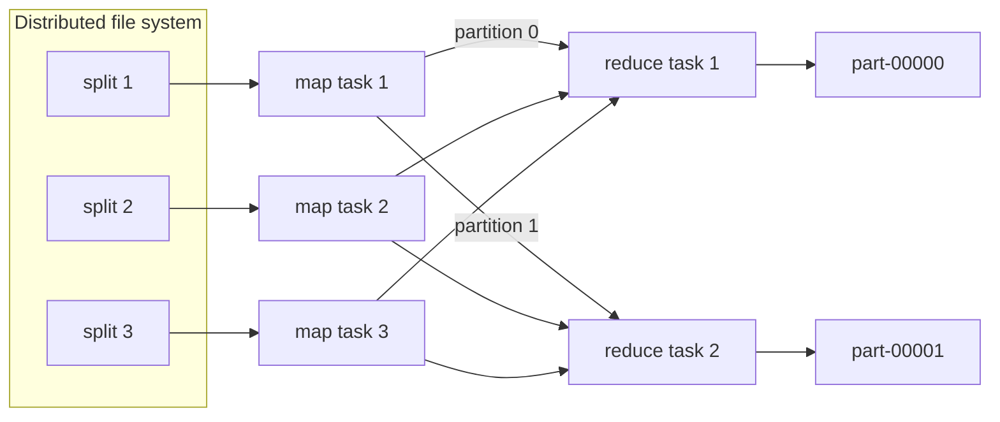

You have 10 TB of playback logs and a question: how many times was each title played yesterday? On one machine the answer is a hash map and a loop, and the loop is the problem. A good disk streams about 200 MB/s, so reading 10 TB takes 50,000 seconds, roughly 14 hours, before you have counted anything. Spread the files over 1,000 machines and each reads 10 GB in under a minute. The arithmetic is easy. The engineering is not: someone has to decide which machine reads which bytes, get every partial count for "Stranger Things" onto the same machine so they can be added, and cope with the fact that in a fleet of 1,000 cheap servers, something fails during most long jobs.

MapReduce, described by Google in 2004 and cloned as Hadoop soon after, answered all three problems with one constraint: you write two pure functions, and the framework owns everything else. It has since been displaced by Spark and SQL engines, but every one of them still executes the same three phases underneath. If you understand where MapReduce spends its time, you can read a Spark plan or a BigQuery execution graph and predict why it is slow.

## The model: two functions and a contract

A MapReduce job is defined by two functions:

- `map(key, value) -> list of (k2, v2)`: called once per input record, independently. It may emit zero, one or many pairs.
- `reduce(k2, list of v2) -> list of output`: called once per distinct intermediate key, with every value any mapper emitted for that key.

Between them sits the framework's contract, the **shuffle**: every pair with the same `k2` reaches the same `reduce` call, and the keys arrive at each reducer in sorted order.

```python
def map_fn(offset, line):
    # line: "2024-05-01T10:00:03Z user=91 title=stranger-things device=tv"
    fields = dict(f.split("=", 1) for f in line.split()[1:])
    yield fields["title"], 1

def reduce_fn(title, counts):
    yield title, sum(counts)
```

That is the whole user program. Notice what it does not contain: no file paths per machine, no sockets, no retry logic, no locks. Because `map_fn` looks at one record and `reduce_fn` looks at one key, the framework is free to run them anywhere, in any order, as many times as it likes. That freedom is what buys fault tolerance.

## How a job actually executes



1. **Split.** The input is cut into splits, normally one per file-system block (128 MB in HDFS). 10 TB becomes about 80,000 map tasks. A master (the JobTracker in Hadoop 1, an ApplicationMaster under YARN) schedules each task, preferring a worker that already holds a replica of the split on local disk. Moving a 1 KB program to 128 MB of data is cheaper than the reverse.
2. **Map.** Each map task reads its split, calls `map` per record and writes output into an in-memory buffer (100 MB by default in Hadoop, spilled to disk at 80% full).
3. **Partition, sort, spill.** Each emitted pair is assigned a reducer by the **partitioner**, `hash(k2) mod R`. When the buffer spills, pairs are sorted by (partition, key) and written to the mapper's *local* disk. At the end, spills are merged into one file per map task, internally divided into R sorted segments.
4. **Shuffle.** Each reducer fetches its segment from every map task over HTTP. With M map tasks and R reducers that is M × R fetches. Reducers start fetching once a small fraction of maps have finished, overlapping network transfer with the tail of the map phase.
5. **Merge and reduce.** The reducer merge-sorts its M sorted segments (a k-way merge), then walks the merged stream calling `reduce` once per key. Output is written to the distributed file system, one file per reducer: `part-00000`, `part-00001`, and so on.

Watch a small word count go through those phases, including the combiner and a failed mapper:

```viz
{"type": "system", "scenario": "mapreduce", "nodes": 3,
 "title": "Word count: map, combine, partition, shuffle, reduce",
 "caption": "Three mappers each read one line. The combiner collapses repeated words before anything crosses the network; the partitioner routes every word to one of two reducers by hash. When a mapper dies, the master simply re-runs its split elsewhere."}
```

## Counting the shuffle

The shuffle is the expensive part of every distributed job, so learn to estimate it before you run anything. Take the title-count job on 1 TB of play events at 200 bytes each: 5 billion events, about 10,000 distinct titles.

| Quantity | Without a combiner | With a combiner |
|---|---|---|
| Map tasks (1 TB / 128 MB) | ~8,000 | ~8,000 |
| Pairs emitted by map | 5 billion | 5 billion (in memory) |
| Pairs crossing the network | 5 billion | at most 8,000 × 10,000 = 80 million |
| Shuffle bytes at ~16 B per pair | ~80 GB | ~1.3 GB |

The **combiner** is a reducer that runs on each mapper's output before it is written, so a mapper that saw "stranger-things" 40,000 times ships one pair `(stranger-things, 40000)` instead of 40,000 pairs. For aggregations over a small key space it routinely shrinks the shuffle by one to two orders of magnitude.

The combiner is only legal when the reduce function is associative and commutative, because the framework may apply it zero, one or several times to arbitrary subsets of values. `sum`, `max`, `min` and `count` qualify. `average` does not: the average of partial averages is wrong unless every partition has the same count. The fix is to change what flows through the shuffle: emit `(sum, count)` pairs, combine them by adding both fields, and divide only in the final reduce. This "carry the algebra, not the answer" trick reappears in every partial aggregation you will meet: Spark's `reduceByKey`, streaming window aggregates, and the partial/final aggregation stages in a query plan.

Now the other dimension. With R = 200 reducers the shuffle is 8,000 × 200 = 1.6 million segment fetches. With the combiner the average segment is 1.3 GB / 1.6 M ≈ 800 bytes, so the job spends its shuffle on per-request overhead, not bytes. Crank R up to 2,000 and you have 16 million fetches of 80 bytes. Crank it down to 5 and each reducer merges 8,000 segments into a single process that becomes the bottleneck. The number of reducers is a real tuning decision: aim for reducer inputs in the hundreds of megabytes to a few gigabytes each, and let the total shuffle size divided by that target set R.

## Fault tolerance by re-execution

At a thousand machines, failure is a scheduling event, not an emergency. MapReduce's recovery story is deliberately simple:

- The master pings workers. A worker that misses heartbeats is declared dead, and every map task it ran is re-executed elsewhere, **including completed ones**, because their output lived on the dead machine's local disk.
- A failed reduce task is re-run; completed reduce output is already in the replicated file system and survives.
- Task output is written to a temporary file and atomically renamed on success. If two copies of the same task finish, the rename makes exactly one visible.

All of this rests on **determinism**. If `map` reads the clock, calls a random number generator without a fixed seed, or writes to an external database, re-execution produces different or duplicated effects. The same rule governs Spark tasks and streaming operators today: side effects inside a task that may be retried are the most common source of "we counted it twice" bugs.

**Stragglers** are the subtler problem. One machine with a failing disk or a noisy neighbour runs its task five times slower, and the whole job waits for it. MapReduce launches **speculative** backup copies of the last few in-progress tasks and takes whichever finishes first. The original paper reported a large sort running roughly 40% longer with backup tasks disabled. Speculation is safe only because of the atomic-rename commit; it is also why speculation is dangerous for tasks with external side effects.

## Skew: when one reducer does all the work

Hash partitioning spreads *keys* evenly, not *records*. Suppose you want unique viewers per title instead of plays. The reduce function must see every `user_id` for a title, so no combiner can collapse them to a single number. If one hit title accounts for 5% of the 5 billion events, its reducer receives 250 million records while the average reducer among 200 receives 25 million. That one task runs ten times longer than the rest, and the job's wall-clock time is the slowest task's time.

The standard fix is **salting**: split the hot key into sub-keys, aggregate each, then merge.

```python
SALTS = 16

def map_fn(_, event):
    salt = hash(event.user_id) % SALTS          # same user -> same salt
    yield (event.title, salt), event.user_id

def reduce_fn(key, user_ids):                    # stage 1: per (title, salt)
    title, _salt = key
    yield title, len(set(user_ids))

# stage 2 (a second job): sum the 16 partial distinct counts per title
```

Salting by a hash of the `user_id` (not a random number) matters: each user lands in exactly one salt bucket, so the 16 partial distinct sets are disjoint and their sizes can simply be added. Salt randomly and the same user can appear in several buckets and be counted more than once. That detail is a good interview follow-up: many candidates know "add a salt", fewer know when the second stage is still correct.

## Joins in two phases

Most real batch jobs join. MapReduce has two join strategies, and every later engine keeps both.

**Reduce-side (repartition) join.** Both inputs are mapped to `(join_key, tagged_record)`, the shuffle brings matching keys together, and the reducer pairs the `plays` records with the `titles` record. It works for any sizes and shuffles both inputs in full.

**Map-side (broadcast) join.** If one side is small (a 50 MB titles table), ship a copy to every mapper, load it into a hash map, and join during the map phase. No shuffle of the large side at all. This is the ancestor of Spark's broadcast hash join, and choosing between the two is still the most consequential decision in most batch query plans.

## Why it mattered, and why it was replaced

MapReduce mattered because it made thousand-machine computation boring. Commodity servers, local disks, a simple programming model and recovery by re-execution let ordinary engineers process datasets that previously required a specialised parallel database. Hadoop spread the idea across the industry, and Hive compiled SQL into chains of MapReduce jobs so analysts never saw the model at all.

It was replaced for reasons that follow directly from its design:

| Limitation | Consequence | What replaced it |
|---|---|---|
| Every job writes its output to the replicated file system | A five-stage Hive query materialises four intermediate datasets, each written three times | Spark and Tez run a whole DAG of stages, pipelining operators and shuffling only at stage boundaries |
| Only map then reduce | Multi-step logic becomes many jobs, each paying scheduling and JVM start-up overhead measured in seconds | Arbitrary operator graphs |
| No in-memory reuse | Iterative algorithms (PageRank, gradient descent) re-read their input on every iteration | Spark caches datasets in memory and recovers lost partitions from lineage |
| Batch-only, minutes of latency | Unusable for interactive queries | Columnar MPP engines (Dremel/BigQuery, Presto/Trino) for SQL; streaming engines for real time |

What survived is more important than what died. The shuffle, the partitioner, partial aggregation, the broadcast-versus-repartition join choice, deterministic tasks with atomic commit, and speculative execution are all still there in Spark, Flink's batch mode and every cloud warehouse. The next lessons keep coming back to them.

## Exercise

```exercise
id: word-count-map-reduce
title: Simulate a word count with a combiner and partitioner
prompt: |
  Simulate one MapReduce word-count job.

  `splits` is a list of strings; each string is the input for one map task.
  Words are separated by whitespace (ignore empty strings from extra spaces).

  1. Map: every word in a split emits `(word, 1)`.
  2. Combine: within each split, sum the pairs per word. Every distinct word
     in a split becomes exactly one pair that crosses the network.
  3. Partition: a pair goes to reducer `p = (sum of the character codes of
     the word) % num_reducers`. Words are lowercase ASCII.
  4. Reduce: each reducer sums the counts per word.

  Return an object with two fields:
  - `shuffled`: the total number of pairs sent across the network (after the combiner).
  - `reducers`: a list with one entry per reducer (index 0 to num_reducers - 1);
    each entry is a list of `[word, count]` pairs sorted by word. A reducer
    that receives nothing has an empty list.
languages: [python, javascript]
entry: map_reduce_word_count
starter:
  python: |
    def map_reduce_word_count(splits, num_reducers):
        def partition(word):
            return sum(ord(c) for c in word) % num_reducers
        # your code here
        return {"shuffled": 0, "reducers": [[] for _ in range(num_reducers)]}
  javascript: |
    function map_reduce_word_count(splits, num_reducers) {
      const partition = (word) => {
        let s = 0;
        for (const ch of word) s += ch.charCodeAt(0);
        return s % num_reducers;
      };
      // your code here (split with: text.split(/\s+/).filter(w => w.length > 0))
      return { shuffled: 0, reducers: Array.from({ length: num_reducers }, () => []) };
    }
tests:
  - args: [["the cat sat", "the dog sat", "the cat ran"], 2]
    expected: {"shuffled": 9, "reducers": [[["cat", 2], ["dog", 1], ["sat", 2]], [["ran", 1], ["the", 3]]]}
  - args: [["a a a a b", "b b a"], 1]
    expected: {"shuffled": 4, "reducers": [[["a", 5], ["b", 3]]]}
    label: the combiner collapses repeats before the shuffle
  - args: [["", "  x  y x "], 3]
    expected: {"shuffled": 2, "reducers": [[["x", 2]], [["y", 1]], []]}
    label: empty split, extra whitespace, idle reducer
  - args: [["to be or not to be", "be quick"], 2]
    expected: {"shuffled": 6, "reducers": [[], [["be", 3], ["not", 1], ["or", 1], ["quick", 1], ["to", 2]]]}
    hidden: true
    label: every key lands on one reducer (skew)
  - args: [["a b c"], 4]
    expected: {"shuffled": 3, "reducers": [[], [["a", 1]], [["b", 1]], [["c", 1]]]}
    hidden: true
    label: more reducers than needed
hints:
  - "Build one dictionary per split for the combiner; its size is that split's contribution to `shuffled`."
  - "Keep one dictionary per reducer; add each combined pair into the dictionary chosen by `partition(word)`."
  - "Finish by sorting each reducer's items by word and converting them to `[word, count]` lists."
```

## Senior signals

- You estimate a job by its **shuffle**: pairs emitted, bytes after the combiner, M × R fetches and the size of each reducer's input, before you tune anything else.
- You know a combiner requires an **associative and commutative** function, and you fix averages and similar metrics by shuffling `(sum, count)` instead of the answer.
- You treat **determinism** as a correctness requirement: retries and speculative execution run tasks more than once, so side effects inside tasks are bugs.
- You diagnose **skew** from the task-duration distribution (one reducer at 10× the median) and fix it with salting, knowing that the salt must be a function of the record when the second stage has to stay correct.
- You can say precisely why MapReduce was replaced (materialisation between jobs, no in-memory reuse, start-up latency) and which of its ideas every modern engine still uses.

## Check yourself

```quiz
- q: >-
    A job computes the average watch time per title. An engineer adds the reduce function (which returns the mean of its inputs) as a combiner to cut shuffle volume. What happens?
  options: ["The job gets faster and stays correct", "The job gets faster but some averages are wrong", "The job fails because combiners cannot emit floats", "Nothing changes; the framework ignores combiners for averages"]
  answer: 1
  explanation: >-
    The mean is not associative: the mean of per-mapper means weights each mapper equally regardless of how many records it saw. The framework will happily run it and produce wrong numbers. Shuffle (sum, count) pairs, combine them by addition, and divide in the final reduce.
- q: >-
    A job has 8,000 map tasks and 1,000 reducers, and the shuffle after the combiner is 2 GB. What is the main cost of the shuffle?
  options: ["Network bandwidth for the 2 GB", "8 million small fetches of about 250 bytes each, dominated by per-request overhead", "Sorting 2 GB on the reducers", "Replicating the shuffle data three times in HDFS"]
  answer: 1
  explanation: >-
    M × R = 8 million segment fetches, averaging 2 GB / 8 M = 250 bytes. Per-fetch overhead dominates. Fewer reducers would make each fetch larger and the job faster. Shuffle data lives on mappers' local disks, not in replicated HDFS.
- q: >-
    A worker that completed three map tasks dies while the reduce phase is fetching. What does the master do?
  options: ["Nothing, the map tasks already completed", "Re-runs the three completed map tasks on other workers", "Restarts the whole job", "Asks the reducers to skip that worker's partitions"]
  answer: 1
  explanation: >-
    Map output lives on the mapper's local disk, not in the replicated file system, so completed map work is lost with the machine and must be recomputed. Completed reduce output, by contrast, is already in the distributed file system and survives.
- q: >-
    You salt a skewed distinct-count job by appending a random number from 0 to 15 to each title key, then sum the 16 partial distinct counts per title. Why is the result wrong?
  options: ["Random salts cause more skew", "The same user can land in several salt buckets and be counted once in each", "Sums of distinct counts are always wrong", "The second stage needs a combiner"]
  answer: 1
  explanation: >-
    Distinct counts add only across disjoint sets. A random salt sends a user's events to several buckets, so that user is counted multiple times. Salting by hash(user_id) keeps each user in one bucket and makes the sum correct.
- q: >-
    Which property of MapReduce made speculative execution of straggling tasks safe?
  options: ["Mappers run on the node that holds their data", "Task output is written to a temporary file and committed by an atomic rename, and tasks are deterministic", "Reducers receive keys in sorted order", "The master keeps a copy of every intermediate result"]
  answer: 1
  explanation: >-
    Two copies of a deterministic task produce the same output, and the atomic rename makes exactly one of them visible. Data locality and sorted keys are unrelated to duplicate execution; the master holds only metadata.
```
