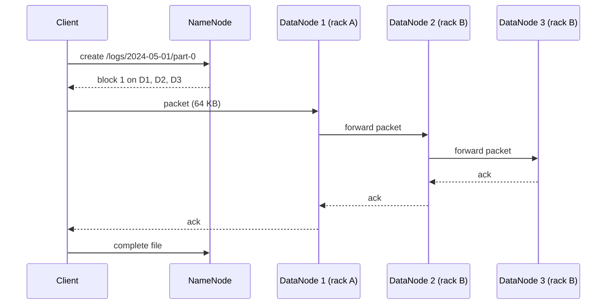

Your cluster has 1,000 machines with 12 disks each. Hard drives fail at around 1–2% a year (the public annualised failure rates from large fleets sit in that band, varying by model and age), so you should expect a few dead disks every week, and one of them will hold part of the file your nightly job is reading. You also want that file read at 1,000 × 12 × 150 MB/s, not at the speed of whichever disk it happens to live on. A distributed file system solves both problems at once: it cuts files into large blocks, spreads the blocks across all the disks, and keeps several copies of each.

Almost every batch and streaming system in this track sits on one of two storage models: a Hadoop-style distributed file system (HDFS, and Google's GFS before it) or a cloud object store (S3, Google Cloud Storage, Azure Blob Storage). They look similar from a Spark job ("read `path/*.parquet`"), but they promise different things about rename, listing and consistency, and those differences explain a surprising amount of modern data engineering, including why table formats like Iceberg exist.

## HDFS: blocks, a NameNode and many DataNodes

HDFS has two kinds of server:

- **DataNodes** store blocks as ordinary files on local disks and serve them over the network.
- **The NameNode** holds the entire namespace in memory: the directory tree, each file's list of block IDs, and (rebuilt from DataNode block reports, not persisted) which DataNodes hold each block. Namespace changes are appended to an edit log and periodically folded into a checkpoint image (`fsimage`); on restart the NameNode loads the image, replays the edits, then waits in safe mode until enough block reports have arrived to know where the blocks are.

A file is cut into **blocks** of 128 MB by default (`dfs.blocksize`), and each block is stored on 3 DataNodes (`dfs.replication`). The large block size is a deliberate piece of arithmetic. A spinning disk spends about 10 ms seeking and then streams at roughly 100–200 MB/s. If you want the seek to cost no more than about 1% of the read, each read must transfer for at least 1 s, which means blocks of 100 MB or more. Small blocks would also multiply the metadata the NameNode keeps in memory.

Every DataNode sends a **heartbeat** every 3 seconds and a full **block report** every 6 hours by default. A DataNode that misses heartbeats is marked stale after 30 seconds (reads prefer other replicas) and dead after about 10.5 minutes (twice the 5-minute recheck interval plus ten heartbeats), at which point every block it held is under-replicated and the NameNode starts scheduling copies. The long timeout is deliberate: declaring a node dead too early after a network blip would trigger terabytes of pointless re-replication.

### Reads and writes

A client never pushes data through the NameNode. It asks the NameNode where the blocks are, then talks to DataNodes directly.



Writes go through a **pipeline**: the client streams packets to the first DataNode, which forwards to the second, which forwards to the third, and acknowledgements flow back along the chain. The client's outbound bandwidth is spent once, not three times. Reads go to the closest replica (same node, then same rack), and a reader that finds a corrupt block reports it and moves to another replica.

### Under the hood: packets, checksums and generation stamps

The client's `DFSOutputStream` cuts data into **chunks** of 512 bytes, each with a 4-byte CRC32C checksum (`dfs.bytes-per-checksum`), and groups chunks into **packets** of 64 KB (`dfs.client-write-packet-size`). Packets sit in a data queue until sent and in an ack queue until every DataNode in the pipeline has acknowledged them; the ack queue is what makes recovery possible. On disk, a replica is two files: `blk_1073741825` with the bytes and `blk_1073741825_1001.meta` with the checksums, where `1001` is the block's **generation stamp**, a version number the NameNode bumps whenever the pipeline is rebuilt. Checksum overhead is 4 bytes per 512, about 0.8%, and a DataNode verifies checksums when serving reads and in a background scanner (every three weeks per block by default), so silent disk corruption is found before a reader hits it.

## A write, a failure and a read, traced

A client on rack A writes a 300 MB file into a three-rack cluster (racks A, B, C; nodes A1–A4, B1–B4, C1–C4), replication 3.

| Step | Event | State afterwards |
|---|---|---|
| 1 | `create()`; NameNode records the file with no blocks and grants the client a lease | Namespace: file exists, 0 blocks, lease held by client |
| 2 | Client asks for block 1; NameNode picks A1 (local), B3, B4 (one remote rack, two nodes on it) and generation stamp 1001 | Pipeline A1 → B3 → B4 |
| 3 | 2,048 packets of 64 KB flow through the pipeline; each ack returns through B4 → B3 → A1 → client | Block 1 finalised at 128 MB, 3 replicas |
| 4 | Block 2 allocated on A1, C2, C3 (the NameNode spreads racks across blocks, not within them) | Pipeline A1 → C2 → C3 |
| 5 | After 900 packets, C2 stops acking (disk failure). The client's ack timeout fires | Ack queue holds the unacked packets |
| 6 | Pipeline recovery: the client tells the NameNode, which issues generation stamp 1002; the client rebuilds the pipeline as A1 → C3, and both surviving replicas truncate to the last byte both hold, then resume from the ack queue | Block 2 continues with 2 replicas at stamp 1002 |
| 7 | Block 2 finalised at 128 MB with 2 replicas; block 3 (44 MB) written on A2, B1, B2; `close()` releases the lease | File complete: 3 blocks, 8 replicas |
| 8 | Next heartbeat cycle: the NameNode sees block 2 under-replicated and asks C3 to copy it to B1 | 9 replicas; rack rule satisfied |

Two details matter. The generation stamp is how the NameNode later rejects the stale replica on C2 if that node comes back: `blk_…_1001` is older than the recorded `1002`, so it is deleted rather than counted. And the file remained writable throughout: the pipeline shrank rather than failing, and the client noticed nothing beyond a pause. Only when fewer than `dfs.client.block.write.replace-datanode-on-failure.min-replication` live nodes remain does the write fail.

Now a reader on rack C opens the file. For block 2 the NameNode returns replicas sorted by distance (C3 first, then B1). The reader streams from C3, verifying each 512-byte chunk against its checksum. Suppose chunk 4,000 fails: the reader reports the corrupt replica to the NameNode, discards the partial packet, and re-reads that range from B1. The NameNode schedules one more copy of block 2 and deletes the bad replica. The read completes with the correct bytes and a warning in the log; nobody pages anyone.

### Placement is a failure model

The default placement puts the first replica on the writer's own node, the second on a node in a **different rack**, and the third on another node in that second rack. That encodes a specific failure model: a top-of-rack switch or power strip can take out a whole rack, so no block may live on only one rack; but cross-rack bandwidth is scarcer than in-rack bandwidth, so the write crosses racks only once. The policy is only as real as the rack map: HDFS learns racks from a topology script (`net.topology.script.file.name`), and a cluster that never configured one puts every node in `/default-rack`, which makes the policy vacuous and a rack outage a data-loss event.

Replication across the whole cluster (the same leader-free, declustered idea contrasted with database [replication strategies](/learn/system-design/distributed-systems/replication-strategies)) also makes recovery fast. When an 8 TB disk dies, its roughly 65,000 blocks' other replicas are scattered over hundreds of machines, so the NameNode hands each DataNode a small batch of replication tasks per heartbeat and the whole fleet copies in parallel: a few gigabytes per node, done in minutes. A RAID array rebuilding the same 8 TB onto one spare disk at 150 MB/s takes about 15 hours, during which a second failure is far more likely to lose data. Declustered replication is the reason clusters of cheap disks are reliable.

### Erasure coding for cold data

Three replicas cost 200% overhead. HDFS 3 supports **erasure coding**, for example Reed-Solomon RS(6,3): each group of 6 data blocks gets 3 parity blocks, any 6 of the 9 reconstruct the data, and the overhead is 50%. The price is that reading lost data requires fetching 6 blocks and computing, and small files do not fill a stripe efficiently. The usual policy is replication for hot, recent data and erasure coding for large, cold data. Cloud object stores use erasure coding internally, which is part of why they are cheap.

## What HDFS promises, and where it hurts

HDFS gives you something close to a normal file system with a few deliberate restrictions:

| Property | HDFS behaviour |
|---|---|
| Consistency of metadata | Strong. One NameNode orders every namespace operation. |
| Writers | One writer per file at a time, enforced by a lease. Append is allowed; random writes are not. |
| Visibility of data being written | Readers see data up to the writer's last `hflush`; after `close`, the whole file. |
| Rename | Atomic metadata operation, including for directories. |
| Listing | Fast, consistent, served from NameNode memory. |

The atomic directory rename is the quiet foundation of batch processing. [MapReduce](/learn/big-data/batch-processing/mapreduce) and [Spark](/learn/big-data/batch-processing/spark) commit a job by having each task write into a `_temporary/attempt_…` directory and then renaming successful attempts into the final location. Readers see either no output or all of it. Hold on to that fact; it breaks on object stores.

### The NameNode heap and the small-files problem

Every file, directory and block is an object in the NameNode's heap, at roughly 150 bytes each (the figure behind the common planning rule of about 1 GB of heap per million blocks). A 1 GB file is eight blocks plus one file object, about 1.4 KB of heap; a 100 KB file is one block plus one file object, about 300 bytes, for ten thousand times less data. A cluster with 300 million files and 400 million blocks needs a NameNode heap on the order of 100 GB, with garbage-collection pauses to match. That is the **small-files problem**: 1 PB stored as 1 GB files is about a million files and eight million blocks, while the same petabyte as 100 KB files is ten billion files, each with its own block, which no NameNode can hold. Small files are also slow to process, because each one becomes at least one task or one open-seek-read cycle.

Availability was a limit too. The original NameNode was a single point of failure. Modern deployments run an active and a standby NameNode sharing the edit log through a quorum of JournalNodes, with ZooKeeper-based failover and fencing so that a partitioned old active cannot keep writing. Federation splits the namespace across several NameNodes when one heap is not enough.

## Object stores: a different contract

Cloud object stores replaced HDFS for most new platforms, including Netflix's data warehouse, which lives in S3. They are not file systems, and treating them as one is the root of a family of bugs.

| Property | HDFS | Object store (S3, GCS, Azure Blob) |
|---|---|---|
| Namespace | Real directory tree | Flat keys; "directories" are only shared prefixes |
| Update | Append to a file | Replace the whole object; no append, no partial update |
| Rename | Atomic, O(1) metadata change | Does not exist; emulated as copy + delete per object, O(bytes) |
| Listing | Consistent, fast | Paginated (1,000 keys per call on S3), one request per page |
| Consistency | Strong | Strong read-after-write and list on the major clouds since 2020 |
| Scaling limit | NameNode heap | Request rate per key prefix, request cost |
| Compute | Co-located with storage | Separate; data crosses the network |

### Under the hood: what a PUT and a GET are

An object is written with a single PUT (up to 5 GB) or a **multipart upload**: initiate, upload parts of at least 5 MB each (up to 10,000 parts, 5 TB total), then complete, which is when the object becomes visible, all at once, under its key. Parts can be uploaded in parallel from many machines, and an upload that is never completed is invisible but still billed until aborted; every bucket that receives job output needs a lifecycle rule that aborts incomplete multipart uploads after a day or so. A GET can carry a `Range` header, so a reader can fetch bytes 1,048,576–2,097,151 of a 512 MB Parquet file without touching the rest, which is the whole basis of columnar reads over object storage. Each object has an ETag (an MD5 for single-part uploads, a hash of the part hashes for multipart), and since 2024 S3 supports conditional writes: `If-None-Match: *` to create a key only if it does not exist, and `If-Match: <etag>` to replace an object only if nobody else has since. Those two headers are the compare-and-swap that table formats and lock services previously needed an external database for.

### Consistency has changed, and history still matters

For years S3 offered only eventual consistency for overwrites and listings: a job could write 1,000 files, and the next job's listing might return 997 of them. Data silently went missing from downstream jobs. Netflix, which ran Hadoop directly on S3, published a tool (s3mper) that recorded listings in a separate consistent store to detect this, and AWS shipped similar workarounds. Since December 2020 S3 provides strong read-after-write consistency for writes, overwrites, deletes and listings, and Google Cloud Storage has long been strongly consistent. You will still meet the workarounds in older codebases and the scepticism in older engineers; both came from real incidents.

## Committing a job on an object store

Strong consistency did not bring atomic rename. Trace the classic Hadoop committer (`FileOutputCommitter` algorithm version 1) writing 4,000 files totalling 1 TB to S3:

1. Each task writes its file to `out/_temporary/0/_temporary/attempt_…/part-00042`.
2. Task commit "renames" the attempt directory to `out/_temporary/0/task_…`: on S3 that is one server-side COPY plus one DELETE per object.
3. Job commit "renames" every task directory into `out/`: another COPY and DELETE per object. Every byte is copied twice at commit time, at server-side copy speed, single-threaded from the driver.
4. A driver crash during step 3 leaves some files in `out/` and some in `_temporary`: partial output, visible to readers.

Version 2 of the same committer moves files straight to `out/` at task commit, which halves the copying and makes the partial-output window as long as the whole job. Two designs fix this properly:

- **The S3A magic committer.** Each task writes its output as a multipart upload against the *final* key but never completes it; instead it writes a small `.pending` file describing the upload ID and parts. Job commit reads the pending files and issues one complete request per file: 4,000 small metadata requests instead of 1 TB of copies, and a crash mid-commit leaves only invisible incomplete uploads. Visibility is still per file, not per job.
- **Table formats.** Iceberg, Delta Lake and Hudi stop relying on directories entirely. The set of files in a table is recorded in metadata files, and a commit atomically swaps one pointer to a new metadata version. Iceberg was started at Netflix largely because Hive tables on S3 depended on directory listings and renames that were slow and unsafe there. The [columnar formats and lakehouses](/learn/big-data/batch-processing/columnar-formats-and-lakehouses) lesson covers how.

### Throughput, prefixes and cost

An object store scales by partitioning its key space, internally, into ranges of key prefixes. S3 documents a baseline of about 3,500 writes and 5,500 reads per second per partitioned prefix and splits hot prefixes automatically over time; a client that exceeds the rate gets HTTP 503 `SlowDown` and must back off. Sequential key names (timestamps at the start of the key) used to concentrate load on one partition, which is why older guidance recommended random prefixes.

```viz
{"type": "system", "scenario": "sharding-range", "nodes": 3,
 "title": "Range partitioning and the hot tail",
 "caption": "Object stores and many databases partition keys by range. Keys that share a growing prefix (a timestamp, an auto-increment id) all land in the last range until it is split. Hash-prefixing spreads the load but gives up cheap range listing."}
```

Per request, an object store is slow: a GET has tens to low hundreds of milliseconds of first-byte latency (single-digit milliseconds on the express, single-zone tiers), and a single connection streams at tens of MB/s. Aggregate throughput comes from parallelism: engines issue many concurrent ranged GETs (for example, one per Parquet column chunk), so a cluster can read at hundreds of GB/s from a store no single client could saturate.

Requests also cost money, on the order of half a cent per thousand PUT or LIST requests and a tenth of that per thousand GETs on the standard tier (the exact figures depend on region and tier, so check the price list). Reading 10 million 100 KB objects needs 10 million requests instead of a few thousand for the same 1 TB stored as 1,000 objects of 1 GB, and it is far slower because every request pays the latency. The small-files problem survives the move to the cloud; it changes from a NameNode heap problem to a latency and cost problem. The fix is the same: **compaction** into files of roughly 128 MB to 1 GB.

## Locality: why disaggregation won

HDFS was designed so that computation runs where the data is, because in 2006 the network was the bottleneck. Two things changed. Data-centre networks moved to 25–100 Gbps per server with non-blocking fabrics, so reading from a remote disk is often as fast as reading a local one. And separating storage from compute lets each scale on its own: a nightly job can start 500 machines, read from S3, and release them an hour later, while HDFS clusters must stay up (and stay full) to keep the data available.

The cost is that locality is gone for good. Every byte a query touches crosses the network, which is exactly why the next lessons obsess over *not reading bytes*: columnar layouts, partition pruning, min/max statistics and caching layers exist to shrink the bytes fetched from object storage.

## Production failure modes

### On HDFS

**The whole cluster stalls for a minute, then DataNodes die in a wave.** Symptom: every client hangs; the NameNode log shows a long garbage-collection pause; minutes later dozens of DataNodes are marked dead and the replication queue jumps into the millions. Diagnosis: the heap is too big for the collector to pause briefly (hundreds of millions of objects), and the pause exceeded the heartbeat window, so healthy nodes were declared dead and the NameNode began re-replicating data that was never lost. Fix: shrink the object count (compaction, archiving old directories, federation), tune the collector for the heap size, and raise the stale and dead timeouts so a pause does not become a replication storm.

**`fsck` reports 8% of blocks under-replicated, and the number is not falling.** Symptom: reads are fine but the cluster is one failure from data loss. Diagnosis: a rack lost power; re-replication is running but the remaining nodes are near full so the placement policy cannot find targets, or the topology script is missing and every node is on `/default-rack`. Fix: free space or add nodes, verify the rack map with `hdfs dfsadmin -printTopology`, and let the replication queue drain before touching anything else.

**Jobs over one directory take hours doing almost no I/O.** Symptom: a million map tasks each finishing in a second; NameNode RPC queue time climbs. Diagnosis: the directory holds millions of files under a few hundred KB, produced by a streaming writer flushing every few seconds. Fix: compact into 128 MB–1 GB files, and change the writer to buffer longer or to write to a table format that compacts for you.

### On object stores

**A large job fails with 503 `SlowDown`.** Symptom: thousands of tasks retry and back off at once; the stage crawls. Diagnosis: every task lists or writes under the same key prefix faster than its partition can serve, typically right after a new table or date prefix is created. Fix: let the client's retry with exponential backoff absorb it (the S3A and cloud connectors do), reduce request counts (fewer, larger files; fewer LIST calls by using a table format), and if a prefix is permanently hot, spread keys across more prefixes.

**A failed job leaves half its output visible.** Symptom: a downstream report is built from a partial day; nobody noticed because the directory existed. Diagnosis: the rename-based committer copied some files to the final prefix before the driver died. Fix: switch to a multipart-based committer or a table format, and have downstream jobs read a success marker or a table snapshot rather than a directory.

**The bill for a nightly job doubles while its data does not.** Symptom: request charges dominate storage charges. Diagnosis: the job reads millions of small objects, each costing a GET and a first-byte latency, and lists deep prefix trees for planning. Fix: compaction, and planning from table-format metadata instead of LIST calls.

## A worked design decision

A team lands 2 TB of events per day and asks where to store them.

1. **Volume and retention.** 2 TB/day for two years is about 1.5 PB. On HDFS with three replicas that is 4.4 PB of raw disk on always-on machines; in S3 it is 1.5 PB billed per gigabyte-month with durability handled for you.
2. **Access pattern.** Mostly scans by date by Spark and a SQL engine, a few times a day. There is no need for low-latency random reads, so object storage's per-request latency is acceptable.
3. **File layout.** At 2 TB/day, target ~512 MB files: about 4,000 files per day. Streaming ingest that writes a file per partition per minute would produce hundreds of thousands of small files per day; schedule compaction, or buffer longer before writing.
4. **Commit safety.** Several jobs read while others write. Use a table format so readers see snapshots and writers commit atomically, instead of relying on directory renames.
5. **When HDFS still wins.** On-premises clusters with steady utilisation, workloads that need append or very low-latency small reads (HBase uses HDFS for this), or data that must not leave a facility.

## Exercise

```exercise
id: replication-audit
title: Audit replication after nodes fail
prompt: |
  You are the NameNode's replication monitor. `blocks` maps a block id to the
  list of nodes holding a replica; `racks` maps a node name to its rack;
  `dead` is a list of nodes that stopped heartbeating; `rf` is the target
  replication factor.

  Count only replicas on live nodes. Return an object with three fields, each
  a list sorted by block id:

  - `missing`: blocks with no live replica at all.
  - `under_replicated`: `[block_id, live_count]` for blocks with at least one
    live replica but fewer than `rf`.
  - `single_rack`: blocks with two or more live replicas that all sit on one
    rack (the placement policy is violated even if the count is fine).

  A block can appear in both `under_replicated` and `single_rack`.
languages: [python, javascript]
entry: replication_audit
starter:
  python: |
    def replication_audit(blocks, racks, dead, rf):
        # blocks: {"b1": ["n1", "n2", "n3"], ...}; racks: {"n1": "A", ...}
        return {"missing": [], "under_replicated": [], "single_rack": []}
  javascript: |
    function replication_audit(blocks, racks, dead, rf) {
      // blocks: {b1: ["n1", "n2", "n3"], ...}; racks: {n1: "A", ...}
      return { missing: [], under_replicated: [], single_rack: [] };
    }
tests:
  - args: [{"b1": ["a1", "b3", "b4"], "b2": ["a1", "c2", "c3"], "b3": ["a2", "b1", "b2"]}, {"a1": "A", "a2": "A", "b1": "B", "b2": "B", "b3": "B", "b4": "B", "c2": "C", "c3": "C"}, ["c2"], 3]
    expected: {"missing": [], "under_replicated": [["b2", 2]], "single_rack": []}
  - args: [{"b1": ["a1", "b3", "b4"], "b2": ["a1", "c2", "c3"]}, {"a1": "A", "b3": "B", "b4": "B", "c2": "C", "c3": "C"}, ["a1"], 3]
    expected: {"missing": [], "under_replicated": [["b1", 2], ["b2", 2]], "single_rack": ["b1", "b2"]}
    label: losing the writer's node leaves both blocks on one rack
  - args: [{"b1": ["a1", "a2", "a3"], "b2": ["a1", "b1", "b2"]}, {"a1": "A", "a2": "A", "a3": "A", "b1": "B", "b2": "B"}, [], 3]
    expected: {"missing": [], "under_replicated": [], "single_rack": ["b1"]}
    label: no rack script, so a fully replicated block still violates the policy
  - args: [{"b1": ["a1", "b1", "c1"], "b2": ["a1", "a2", "a3"]}, {"a1": "A", "a2": "A", "a3": "A", "b1": "B", "c1": "C"}, ["a1", "a2", "a3"], 3]
    expected: {"missing": ["b2"], "under_replicated": [["b1", 2]], "single_rack": []}
    label: a whole rack goes down
  - args: [{"b1": ["a1"], "b2": ["a1", "b1"]}, {"a1": "A", "b1": "B"}, [], 1]
    expected: {"missing": [], "under_replicated": [], "single_rack": []}
    hidden: true
    label: replication factor 1 with one replica is not under-replicated
  - args: [{"b9": ["a1", "a2"], "b1": ["b1", "b2", "b3"]}, {"a1": "A", "a2": "A", "b1": "B", "b2": "B", "b3": "B"}, ["b2"], 3]
    expected: {"missing": [], "under_replicated": [["b1", 2], ["b9", 2]], "single_rack": ["b1", "b9"]}
    hidden: true
    label: sorted by block id, both lists can name the same block
  - args: [{}, {}, ["a1"], 3]
    expected: {"missing": [], "under_replicated": [], "single_rack": []}
    hidden: true
    label: no blocks
hints:
  - "Filter each block's replica list to nodes not in `dead` first; everything else is a count over that list."
  - "For `single_rack`, map the live nodes to racks and check whether the set of racks has size 1 while there are at least two live replicas."
  - "Sort by block id as a string (`sorted(...)` in Python, `.sort()` on strings in JavaScript)."
```

## What mid-level engineers get wrong

- **Treating S3 as a file system with a slow rename.** Rename is a copy; commit protocols built on it are slow and non-atomic, and a crash leaves partial output visible.
- **Writing many small files because the writer flushes on a timer.** The cost appears months later as NameNode heap or request charges, far from the code that caused it.
- **Assuming three replicas means three racks.** The default is two racks, and with no topology script it is one.
- **Reading old S3 consistency advice as current.** Listings have been consistent since 2020; the missing-file workarounds are dead code, but the rename problem is not.
- **Sizing a NameNode by bytes stored.** It is sized by objects: files plus blocks, at about 150 bytes each.

## Interviewer follow-ups

**"A DataNode in the middle of a write pipeline dies. Does the write fail?"** Model answer: no; the client detects the missing ack, the NameNode issues a new generation stamp, the pipeline is rebuilt without the dead node, the survivors truncate to a common length and the client resends from its ack queue; the block finishes under-replicated and is repaired asynchronously. Common wrong answer: "the client retries the block from the beginning on three new nodes".

**"How would you make a job's output on S3 appear atomically?"** Model answer: you cannot with keys alone; either commit through a table format whose metadata pointer swap is the atomic step, or write a success marker after all files are complete and have readers require it. The magic committer removes the copying but still exposes files one by one. Common wrong answer: "use the v2 committer, it is faster", which widens the partial-output window.

**"Why is a 100 KB average file size a problem on both HDFS and S3?"** Model answer: on HDFS it is 300 bytes of NameNode heap per file and one task per file; on S3 it is one request with tens of milliseconds of latency per file and a per-request charge. The fix in both cases is compaction to hundreds of megabytes. Common wrong answer: "S3 has no metadata server so it does not care".

**"Erasure coding halves storage cost. Why not use it for everything?"** Model answer: a degraded read reconstructs from six blocks instead of one, writes stripe across more nodes, and small files waste stripe capacity; use it for large, cold data. Common wrong answer: "because it is less durable", when RS(6,3) tolerates three losses to replication's two.

**"S3 is strongly consistent now. Is directory-as-table safe?"** Model answer: no; consistency fixes missing listings, not the lack of atomic multi-file commit or isolation between writers, and planning by listing is still one request per 1,000 keys. Common wrong answer: conflating consistency with atomicity.

## Senior signals

- You describe storage by its **contract** (rename, listing, append, consistency) before its throughput, because the contract decides whether a commit protocol is safe.
- You can trace an HDFS write through **packets, checksums, the ack queue and pipeline recovery**, and you know the generation stamp is what keeps a returning stale replica from being counted.
- You know that HDFS relies on **atomic directory rename** to commit jobs and that object stores emulate rename as copy + delete, and you can name the fixes: multipart-based committers and table formats.
- You can estimate **NameNode heap** from file and block counts and explain the small-files problem in both HDFS terms (heap) and object-store terms (request latency and cost).
- You explain replica placement as a **failure model** (rack loss) and declustered replication as the reason cheap disks are safe, and you check that the rack map is real.
- You know S3 became **strongly consistent** in 2020 and gained **conditional writes** in 2024, and you still check whether a code path depends on older workarounds or on rename atomicity it never had.

## Check yourself

```quiz
- q: >-
    A Spark job writes 800 GB to S3 using the classic rename-based output committer. Why is job commit slow and unsafe?
  options: ["S3 caps objects at 5 GB, so large outputs must be split", "Rename is emulated by copying all 800 GB, non-atomically", "S3 is eventually consistent, so new files appear late", "The NameNode must record every one of the written files"]
  answer: 1
  explanation: >-
    Object stores have no rename. The committer's final "rename" becomes a server-side copy of all 800 GB plus deletes, which takes a long time and is not atomic across files, so a crash leaves partial output visible. S3 has been strongly consistent since 2020, so consistency is not the issue here, and S3 has no NameNode.
- q: >-
    An HDFS cluster stores 400 million files averaging 200 KB. What problem are you most likely to hit first?
  options: ["NameNode heap pressure from its in-memory objects", "Running out of disk capacity on the DataNodes", "The CPU cost of verifying every block's checksum", "Saturated cross-rack network bandwidth during writes"]
  answer: 0
  explanation: >-
    Every file and block is an in-memory object in the NameNode heap. 400 million files plus their blocks is on the order of 800 million namespace objects, far past what one NameNode heap handles comfortably, with garbage-collection pauses to match. The total data (80 TB) is modest; the object count is the problem.
- q: >-
    Why does HDFS place the second and third replicas of a block on a different rack from the first, but on the same rack as each other?
  options: ["To survive a rack loss, crossing racks only once per write", "Because the NameNode can only track two racks per block", "To maximise read bandwidth for clients on the writer's rack", "So that the block can be erasure-coded later without copying"]
  answer: 0
  explanation: >-
    A rack can fail as a unit (switch, power). Two racks are enough to survive that; putting replicas 2 and 3 together means the write pipeline crosses racks once, conserving scarce cross-rack bandwidth. Read bandwidth for the writer's rack would argue for keeping replicas local, the opposite of this placement.
- q: >-
    When an 8 TB disk fails in a 1,000-node HDFS cluster, why is recovery much faster than rebuilding a RAID array?
  options: ["A RAID rebuild must verify checksums, which HDFS skips", "HDFS compresses the blocks before copying them to new disks", "Surviving replicas are spread out, so many nodes copy at once", "HDFS re-replicates only the blocks that clients actually read"]
  answer: 2
  explanation: >-
    Declustered replication means the lost blocks' other replicas are scattered over hundreds of nodes, each copying a few gigabytes concurrently. A RAID rebuild writes all 8 TB onto one spare disk at single-disk speed, which takes many hours. HDFS verifies checksums too; the difference is parallelism.
- q: >-
    A streaming job writes one Parquet file per partition every 30 seconds to S3, producing about 3 million files a day of about 300 KB each. Downstream queries are slow and expensive. What is the right first fix?
  options: ["Compact into 128 MB to 1 GB files and buffer longer", "Enable S3 strong consistency for the output prefix", "Switch the bucket's storage to erasure coding", "Raise the S3 request-rate limit on the output bucket"]
  answer: 0
  explanation: >-
    Each small file costs a request and its latency for every query that reads it, and it inflates planning. Compaction and larger write batches reduce object count by orders of magnitude. A higher request-rate limit still pays per-request latency and cost for 3 million objects; consistency and erasure coding are unrelated to the problem.
- q: >-
    During an HDFS write, the second DataNode in the pipeline stops acknowledging packets. A week later that node comes back with its partial copy of the block. Why is that stale copy not counted as a replica?
  options: ["The NameNode only counts replicas that took part in the final ack", "Its checksums were rewritten when the pipeline shrank to two nodes", "Its generation stamp is older than the one the NameNode recorded", "The client deleted it from the node before rebuilding the pipeline"]
  answer: 2
  explanation: >-
    Pipeline recovery bumps the block's generation stamp, and the surviving replicas are finalised under the new stamp. A returning replica reports the old stamp, so the NameNode marks it stale and schedules its deletion instead of counting it. The client never talks to the dead node again, and checksums belong to each replica's own bytes.
```
